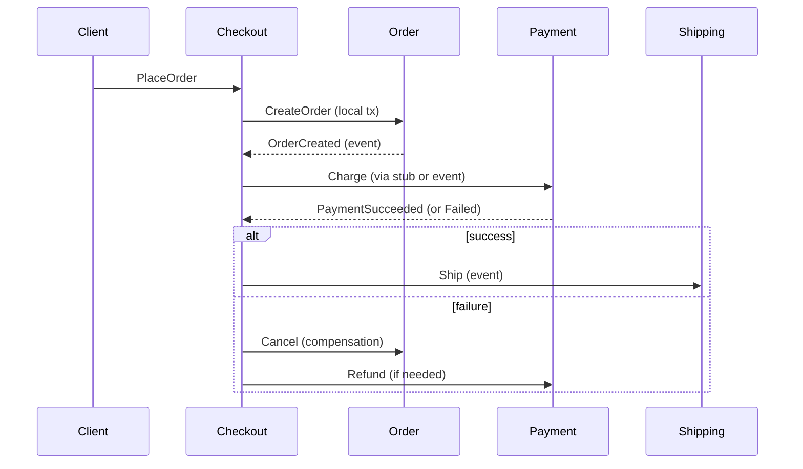
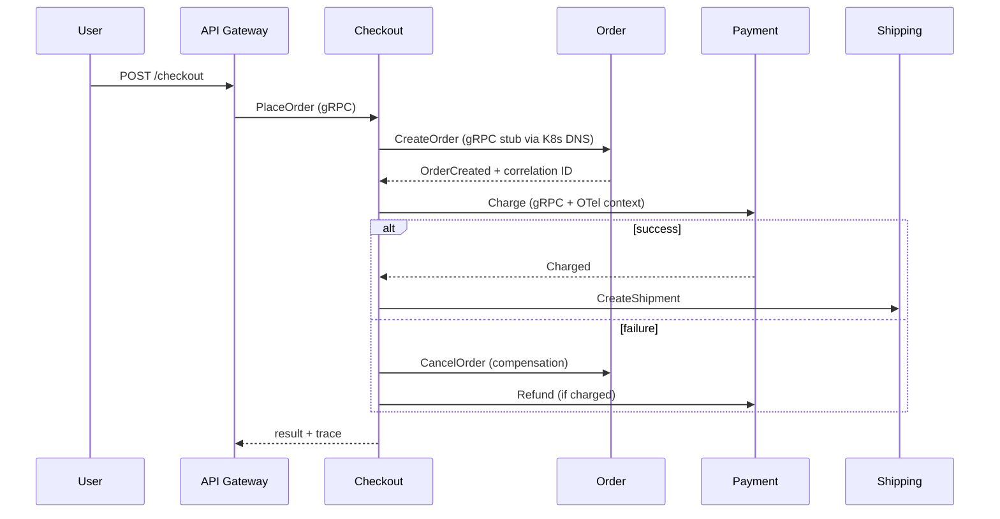

### 📖 Chapter Summary

Chapter 2 bridges microservices architecture theory with gRPC as the communication fabric. Babal (*gRPC Microservices in Go*, Ch.2) explains why teams move from monoliths to microservices, introduces the **Scale Cube** (X/Y/Z axes), covers the loss of ACID transactions across services, and presents **Saga patterns** (choreography vs orchestration) for distributed consistency. It also covers service discovery models and sets up the need for a high-performance, contract-first RPC like gRPC.

Shuiskov (*Microservices with Go, 2nd Edition*, Ch.1) provides the broader theory: definitions of microservices by business capability, monolith pain points (build times, coupled deploys, blast radius, uniform scaling), when *not* to split, and Go's strengths for cloud-native workloads. Sagas appear in later chapters (Ch.6 preview in the mapping).

Internet sources (2026) add modern defaults: `grpc.NewClient`, Buf for contract governance, Kubernetes-native DNS discovery, and practical saga implementation patterns using outbox + events or orchestrators like Temporal.

This chapter answers: *When do microservices make sense? How do we scale in three dimensions? How do we keep data consistent without distributed transactions? How do services find each other? Why does gRPC fit the resulting communication patterns?*

**Sources**

| Reference | Chapter / Section | Focus |
|-----------|-------------------|-------|
| Babal | Ch.2 — gRPC meets microservices | Scale cube, monolith→MS transition, sagas, service discovery, gRPC 5-step workflow |
| Shuiskov | Ch.1 — Introduction to Microservices; Ch.6 sagas preview | Microservice definition, monolith pros/cons, when to split, Go project thinking |
| Repo | `https://github.com/huseyinbabal/microservices` | Order/Checkout → Payment flow (saga-like), K8s service names for discovery |
| Internet (2026) | gRPC docs, microservices.io, Buf, K8s, OpenTelemetry | `grpc.NewClient`, `buf breaking`, K8s DNS + health, saga orchestration patterns |

#### 🆕 Key New Concepts & Technologies

| **Concept / Technology** | **Short Description** | **Babal** | **Shuiskov** | **Repo** | **2026** |
|:--|:--|:--|:--|:--|:--|
| **Monolith** | Single deployable unit containing all modules | Pain points: slow builds, full redeploys, uniform scaling | Core definition + when it still wins | — | Start here; split deliberately |
| **Microservice** | Independently deployable service for one business capability | Five services in Fig 1.1 (Product, Cart, Checkout, Payment, Shipping) | Business-capability split | Order + Payment services | Y-axis scaling; domain boundaries |
| **Scale Cube** | 3D model: X (clone), Y (split by function), Z (partition data) | Y-axis = microservices; Z for data isolation | Ch.1 scaling discussion | Horizontal via K8s Deployments | Still the canonical mental model |
| **Saga** | Sequence of local transactions coordinated by events or orchestrator | Choreography vs Orchestrator; compensation | Preview in Ch.6 / async | Implicit in Checkout flow | Outbox + events or Temporal/Saga orchestrators |
| **Choreography** | Decentralized: each service publishes events to trigger the next | Simple for small flows; hard to track | — | — | Good for loose coupling; needs correlation IDs |
| **Orchestration** | Centralized coordinator drives steps and compensation | Easier for complex flows + undo | — | — | Preferred for non-trivial business processes |
| **Service Discovery** | Finding service locations (IP:port) at runtime | Client-side vs server-side; K8s native by name | Ch.1 + later discovery | K8s Services | K8s DNS + gRPC health service standard |
| **gRPC 5-step workflow** | Define proto → generate stubs → implement server → implement client → run | Core of Ch.2/3 transition | Sync comm in Ch.5 | `microservices-proto` + order/payment | Buf + `buf generate`; pinned modules |
| **gRPC Stub** | Generated client proxy that makes remote calls feel local | Explicitly defined | Client patterns | `NewPaymentClient(conn)` | Always use versioned proto module import |

#### 📊 Comparison at a Glance

| Topic | Babal Ch.2 | Shuiskov Ch.1 | Repo | Current practice (2026) |
|-------|------------|---------------|------|-------------------------|
| **When to split** | After monolith becomes painful (builds, deploys, scaling) | Don't split too early; clear boundaries first | E-commerce decomposition shown | DDD + clear ownership before split |
| **Scaling model** | Scale Cube (X/Y/Z) | Monolith uniform scaling pain | K8s per-service scaling | X + Y + selective Z |
| **Data consistency** | Saga (choreo or orch) instead of 2PC | ACID inside service; distributed elsewhere | Checkout calls Payment (later saga) | Prefer choreography for simple; orchestrator (Temporal) for complex |
| **Service location** | K8s DNS "by name"; client vs server discovery | Registry vs LB models | `payment` service name | K8s + `grpc.NewClient` + health checks |
| **Communication contract** | Proto first (preview to Ch.3) | Explicit APIs | Shared `microservices-proto` | Buf + breaking change detection in CI |
| **Client creation** | `grpc.Dial` style in early examples | `grpc.Dial` examples | Updated repo uses modern client | `grpc.NewClient` + OTel + credentials |

## Part 1: Monolith vs Microservices — The Transition

### 📌 Concepts Explained

- **Monolithic Architecture**: All modules packaged into one distributable artifact. Simple tech stack and navigation at the start.
- **Microservice Architecture**: Collection of loosely coupled, fine-grained services, each focused on a business capability, independently deployable and scalable.
- **Network boundary**: In-process method calls become remote calls (TCP/HTTP/gRPC). Latency, partial failure, timeouts, and retries become first-class concerns.
- **Blast radius**: A bug in shared code inside a monolith can affect the entire application at once.
- **Uniform scaling**: A monolith forces you to scale the whole application even when only one module is hot.

### 🔧 Shuiskov — Microservice Definition and Monolith Pain

Shuiskov defines a microservice as an independently deployable unit responsible for a specific part of the application logic, typically aligned to a business capability (e.g., payments, search, ratings).

**Common monolith pains (Shuiskov + Babal):**

| Problem | Monolith Impact | Microservice Benefit |
|---------|-----------------|----------------------|
| Build & test time | Grows with codebase; IDEs slow down | Small services build and test in seconds |
| Deployment coupling | Any change requires full redeploy | Independent release cycles |
| Resource waste | Scale entire app for one hot module | Scale only the needed service (CPU/Mem per Deployment) |
| Blast radius | One bad change or library affects everything | Failure isolated to one service |
| Tech stack lock-in | One language/runtime for all | Polyglot when it makes sense |

**When monoliths still win (Shuiskov):** early product with unclear boundaries, small team, latency-sensitive in-process calls, or when operational overhead of microservices would slow you down more than the monolith does.

### 🔧 Babal — The Network Shift

Babal emphasizes that moving to microservices replaces simple class method calls with network communication. This is harder. gRPC mitigates much of the pain with generated stubs, built-in load balancing hooks, tracing, health checking, and TLS.

> "In a monolithic application, calling a payment service from a checkout service means accessing a class method... If you use microservices, such calls will be converted to network communication."

### 📊 Diagram — Monolith vs Microservices (Y-axis Scaling)

```
MONOLITH (everything together)          MICROSERVICES (Babal Fig 1.1 style)
┌───────────────────────────────┐       ┌──────────┐   gRPC    ┌──────────┐
│  Checkout calls Payment       │       │ Checkout │ ────────► │ Payment  │
│  (in-process, fast, fragile)  │       └────┬─────┘           └──────────┘
│  Cart + Shipping + Product    │            │ gRPC
│  One binary, one deploy       │       ┌────▼─────┐   gRPC    ┌──────────┐
└───────────────────────────────┘       │   Cart   │           │ Shipping │
                                        └──────────┘           └──────────┘
                                        (each = own DB, own deploy, own scale)
```

### 🧪 Interview Q&A

**Q1:** How does Shuiskov define a microservice?

**Q2:** List three concrete pains that appear as a monolith grows.

**Q3:** What does "uniform scaling" mean and why is it wasteful?

**Q4:** What replaces an in-process method call when you move to microservices?

**Q5:** According to both books, when should you *not* start with microservices?

> [!success]- 📋 Answers — Part 1
> **A1:** A collection of services, each responsible for part of application logic defined by a business capability. They are independently deployable and scalable.
>
> **A2:** Slow builds and tests, full-application redeploys for small changes, uniform scaling (scale everything to help one module), high blast radius from shared code, and eventual vertical scaling limits.
>
> **A3:** You must scale the entire monolith even if only one functional area (e.g. Payment) needs more resources. Scaling a 16 GB process just because the 2 GB payment module is hot is wasteful.
>
> **A4:** A remote network call (gRPC, HTTP, or async message). This introduces latency, partial failure, timeouts, retries, and the need for distributed consistency strategies.
>
> **A5:** When the product is early/ill-defined, the team is small, boundaries are unclear, or you have strict in-process latency requirements. Start monolithic, understand domains, then split.

---

## Part 2: The Scale Cube — Three Dimensions of Scaling

### 📌 Concepts Explained

- **X-axis scaling**: Horizontal duplication — run N identical copies behind a load balancer.
- **Y-axis scaling**: Functional decomposition — split the application by business capability (this is what microservices primarily do).
- **Z-axis scaling**: Data partitioning — each instance owns a subset of the data (sharding, tenancy, geographic splits).

### 🔧 Babal — Scale Cube Applied

Babal uses the Scale Cube to explain why microservices are primarily Y-axis scaling. You split the monolith along business capabilities rather than just cloning it.

- X-axis alone is still useful (K8s replicas).
- Z-axis becomes relevant when a single service's data grows too large or you need isolation (e.g., per-tenant databases).
- Kubernetes makes X-axis cheap: just increase replicas on a Deployment. Resource requests/limits let you right-size per service.

### 📊 ASCII — Scale Cube

```
          Z (data partition)
             ^
             |
   +---------+---------+
  /                   /|
 /     Y (split)     / |
+---------+---------+  |
|                   |  |   X (clone)
|   Microservices   | / 
|   (Y-axis)        |/
+-------------------+
```

### 🧪 Interview Q&A

**Q1:** What does each axis of the Scale Cube represent?

**Q2:** Why is Y-axis scaling the primary driver for adopting microservices?

**Q3:** Give an example of Z-axis scaling in an e-commerce system.

**Q4:** How does Kubernetes make X-axis scaling practical for microservices?

**Q5:** Can you combine all three axes?

> [!success]- 📋 Answers — Part 1
> **A1:** X = run more identical copies (horizontal scaling). Y = split the application into services by function/business capability. Z = partition data so each instance owns only a slice.
>
> **A2:** Y-axis is functional decomposition. Instead of cloning the whole monolith, you split it so that only the hot or complex parts can be scaled, deployed, and reasoned about independently.
>
> **A3:** Sharding orders by customer region or by tenant ID so that each "Order" service instance only holds data for a subset of customers.
>
> **A4:** You define a Deployment with replicas > 1 and a Service in front. Kubernetes handles rolling updates, health checks, and load balancing. You can also set different replica counts and resources per microservice.
>
> **A5:** Yes. A well-designed system often uses X (replicas), Y (separate services), and selective Z (sharded data stores) together.

---

## Part 3: Distributed Consistency — The Saga Pattern

### 📌 Concepts Explained

- **The problem**: Each microservice owns its own database. A single ACID transaction across services is no longer possible.
- **Saga**: A sequence of local transactions. Each service updates its own DB and then publishes an event/message that triggers the next local transaction.
- **Compensation**: "Undo" actions that reverse the effects of previous steps when a later step fails.
- **Two primary styles**: Choreography (decentralized) and Orchestration (centralized coordinator).

### 🔧 Choreography-based Saga (Decentralized)

Each service performs its local transaction and emits a domain event. Other services listen and react.

- **Command channels**: Direct message to a specific service.
- **Pub/Sub**: Broadcast event; interested services consume.
- **Completion signaling**: Domain status, polling, or WebSocket back to client.
- **Correlation ID**: Required to trace one business transaction across services.

**Pros**: Loose coupling.  
**Cons**: Harder to see the full picture; compensation logic scattered; debugging distributed flows is difficult.

### 🔧 Orchestrator-based Saga (Centralized)

A dedicated orchestrator (or saga coordinator) tells participants what to do step by step.

- If a step fails, the orchestrator explicitly triggers compensation in reverse order.
- Easier to model complex workflows and see the state machine.
- Still eventually consistent.

**Pros**: Clear control flow; compensation is explicit and centralized.  
**Cons**: Introduces a new component; potential single point of coordination (mitigated by making the orchestrator resilient).

### 📊 Mermaid — Order Placement Saga (Choreography style)



### 🧪 Interview Q&A

**Q1:** Why can't microservices use a single ACID transaction across services?

**Q2:** Define a Saga in one sentence.

**Q3:** What is the key difference between choreography and orchestration?

**Q4:** What is a compensation transaction? Give an example in the Order/Payment/Shipping flow.

**Q5:** Why are correlation IDs critical in saga implementations?

> [!success]- 📋 Answers — Part 3
> **A1:** Each service owns its private database. Distributed transactions (2PC) are slow, block resources, and have poor failure modes at scale. Sagas give you eventual consistency instead.
>
> **A2:** A Saga is a sequence of local transactions where each participant updates only its own database and then publishes an event or message to trigger the next step (or compensation on failure).
>
> **A3:** Choreography is decentralized — services react to events published by others. Orchestration uses a central coordinator that explicitly drives the sequence of steps and compensation.
>
> **A4:** An "undo" operation. Example: if Shipping fails after Payment succeeded, the orchestrator (or compensating event) triggers Payment refund and Order cancel.
>
> **A5:** A single business transaction (one "order placement") touches many services and events. A correlation ID lets you trace the entire flow in logs and traces.

---

## Part 4: Service Discovery

### 📌 Concepts Explained

- **Service Discovery**: The mechanism that allows services to find each other's network locations (IP + port) at runtime.
- **Client-side discovery**: Client queries a registry (Eureka, Consul) and picks an instance.
- **Server-side discovery**: Client talks to a load balancer / router that knows the registry (K8s Service, NGINX, AWS ELB).
- **Kubernetes native**: Services are discoverable by DNS name inside the cluster. No extra registry needed for basic cases.

### 🔧 Babal & Modern Practice

Babal highlights that once you are on Kubernetes, services find each other by the Service name defined in the spec. This is server-side discovery provided by the platform.

**2026 recommendation**:
- Use Kubernetes Services + DNS for most internal discovery.
- Add gRPC health service (`grpc.health.v1.Health`) so readiness/liveness probes and load balancers can tell when an instance is actually able to serve RPCs.
- For advanced client-side load balancing or multi-cluster, consider client-side with xDS or explicit registries.

### 📊 Comparison — Discovery Models

| Aspect | Client-Side | Server-Side (K8s) | 2026 Practice |
|--------|-------------|-------------------|---------------|
| Registry interaction | Client queries directly | LB/router queries | K8s DNS + optional service mesh |
| Client complexity | High (caching, load balancing logic) | Low | Prefer platform; add client LB only when needed |
| Examples | Netflix Eureka, Consul client | K8s Service, NGINX | K8s Service + `grpc.NewClient` |

### 💡 Best Practice Callout

> [!tip] Always design for failure
> Even with perfect discovery, instances can disappear. Use short deadlines, retries with backoff and jitter, and circuit breakers. gRPC interceptors + context deadlines make this easier.

### 🧪 Interview Q&A

**Q1:** Explain the difference between client-side and server-side service discovery.

**Q2:** How does Kubernetes provide service discovery "for free"?

**Q3:** Why should gRPC services implement the standard health service?

**Q4:** What are the downsides of client-side discovery at scale?

**Q5:** When might you still choose an explicit registry (Consul) over pure K8s DNS?

> [!success]- 📋 Answers — Part 4
> **A1:** Client-side: the caller queries the registry and chooses an instance. Server-side: the caller connects to a load balancer or router that hides the registry and instance selection.
>
> **A2:** You create a Kubernetes Service. Inside the cluster, the service name resolves via CoreDNS to the current set of healthy endpoints. Callers use the service DNS name (e.g. `payment:50051`).
>
> **A3:** The health service lets orchestrators and load balancers know whether the gRPC server is actually serving traffic (not just that the process is up). K8s can use it for readiness.
>
> **A4:** Every client must maintain registry connections, caches, and load-balancing logic. This duplicates effort and increases the chance of hot-spotting or stale views.
>
> **A5:** Multi-cluster, cross-cloud, or when you need advanced features (health checks beyond gRPC, traffic splitting, or service mesh features not provided by the platform).

---

## Part 5: gRPC Workflow and Stubs — The Practical Glue

### 📌 Concepts Explained

Babal presents a simple 5-step workflow that turns a `.proto` contract into working client/server code:

1. Define messages and services in `.proto` files.
2. Generate stubs (`protoc` or Buf).
3. Implement the server logic behind the generated interfaces.
4. Implement (or consume) the client using the generated stub.
5. Run the services.

The **stub** is the key mental model: a generated client-side proxy that implements the same methods as the remote service, making network calls feel like local function calls.

### 🔧 Context and Timeouts Are Mandatory

Every generated method takes `context.Context` as the first parameter. Always create a derived context with a deadline or timeout.

```go
// 2026 recommended client usage (Babal book often showed older Dial pattern)
ctx, cancel := context.WithTimeout(context.Background(), 5*time.Second)
defer cancel()

conn, err := grpc.NewClient("payment:50051",
    grpc.WithTransportCredentials(insecure.NewCredentials()), // or TLS
)
if err != nil { ... }
defer conn.Close()

paymentClient := pb.NewPaymentClient(conn)
resp, err := paymentClient.Create(ctx, &pb.CreatePaymentRequest{...})
```

### 💻 Code — Generating Stubs (conceptual)

```bash
# Modern (Buf) or classic protoc
buf generate

# Classic (as shown in raw notes)
protoc \
  --go_out=. \
  --go_opt=paths=source_relative \
  --go-grpc_out=. \
  --go-grpc_opt=paths=source_relative \
  payment.proto
```

### 💻 Code — Four RPC Styles (preview)

```protobuf
service PaymentService {
  rpc Create(CreatePaymentRequest) returns (CreatePaymentResponse);           // unary
  rpc StreamPayments(StreamPaymentsRequest) returns (stream Payment);         // server streaming
  rpc UploadPayments(stream CreatePaymentRequest) returns (BatchResult);      // client streaming
  rpc Chat(stream ChatMessage) returns (stream ChatMessage);                  // bidi
}
```

### 🧪 Interview Q&A

**Q1:** What is a gRPC stub?

**Q2:** Why does every generated RPC method accept a `context.Context`?

**Q3:** Walk through the five steps to get a working gRPC service and client.

**Q4:** When would you choose server streaming vs client streaming?

**Q5:** What happens if you forget to propagate context deadlines across service boundaries?

> [!success]- 📋 Answers — Part 5
> **A1:** A generated client object that implements the service interface locally. Method calls on the stub are transparently turned into network RPCs with serialization, transport, and error handling.
>
> **A2:** Context carries deadlines, cancellation signals, and request-scoped values (trace IDs, auth). Without it you cannot implement proper timeouts or propagate tracing.
>
> **A3:** 1) Write .proto (messages + service). 2) Run codegen (protoc or buf). 3) Implement the server interface. 4) Dial with NewClient and call methods on the generated client. 5) Deploy and run.
>
> **A4:** Server streaming when the server has a lot of data to push (e.g. logs, search results). Client streaming when the client uploads many items and the server returns a single summary. Bidi for interactive or chat-like protocols.
>
> **A5:** The call may hang forever, leak resources, or produce inconsistent results. Always derive a context with timeout and pass it through the call chain.

---

## Part 6: Best Practices & Trade-offs (Combined)

### 💡 Pro Tips & Best Practices (Combined)

1. Start monolithic. Split along clear business capability boundaries only when pain (deploy speed, scaling, team ownership) justifies the cost.
2. Use the Scale Cube language with your team: "We need more Y-axis here" or "This data should be Z-partitioned."
3. Always design compensation logic for every step in a saga. An order that is half-created is worse than no order.
4. Prefer platform-native discovery (K8s DNS) unless you have a proven need for client-side logic.
5. Put `context.Context` with deadlines on every outgoing call. Fail fast.
6. Use `grpc.NewClient` (not the deprecated `grpc.Dial`). Add OTel stats handlers and proper credentials from day one.
7. Add correlation IDs to every event and RPC metadata for saga traceability.
8. Expose the gRPC health service so Kubernetes and load balancers can correctly route traffic.
9. Keep proto contracts in a separate versioned module (or use Buf). Never copy `.pb.go` files between services.
10. For complex sagas, evaluate a dedicated orchestrator (Temporal, Camunda, or a simple internal one) instead of scattering logic.

---

## Part 7: Companion Repo Snapshot

### ✅ What the companion repo demonstrates

| Area | Status |
|------|--------|
| Service decomposition | Order / Payment / Cart / etc. following business capabilities |
| gRPC usage between services | Checkout uses generated stubs to call downstream services |
| Kubernetes manifests | Services discoverable by name |
| Proto contracts | Moved to `microservices-proto` module in real usage |

### ⚠️ Gaps vs 2026 senior standards (typical early book examples)

| Gap | Risk | Priority |
|-----|------|----------|
| Older examples use `grpc.Dial` + `WithInsecure` | Connection behavior + security | 🔴 High |
| No explicit `buf breaking` checks shown in Ch.2 | Accidental contract breaks during evolution | 🟡 Medium |
| Saga logic often left as exercise or implicit | Data inconsistency in failure paths | 🔴 High |
| Limited health service / readiness examples | K8s may route to unhealthy pods | 🟡 Medium |
| Minimal OTel / correlation ID propagation in early chapters | Poor observability of distributed flows | 🟡 Medium |

> Verify current state against https://github.com/huseyinbabal/microservices and https://github.com/huseyinbabal/microservices-proto.

---

## Part 8: Senior Recommendations + End-to-End View

### 📊 Mermaid — High-Level Checkout Flow with Discovery and Saga



### 🧪 Master Q&A (Part 8)

**Q1:** A new team wants to jump straight to microservices for a greenfield product. What is your recommendation and why?

**Q2:** Your Checkout service calls Order then Payment. Payment fails after Order succeeds. Describe two ways to handle this and the trade-offs.

**Q3:** Explain why `grpc.NewClient` is preferred over `grpc.Dial` in 2026 code.

**Q4:** You have three services that must succeed or all roll back conceptually. Compare saga choreography vs orchestration for this scenario.

**Q5:** How would you implement "find Payment service instances" in a Kubernetes cluster without an external registry?

**Q6:** What is the role of field numbers vs field names in Protobuf, and why does it matter for evolving contracts across services?

**Q7:** Give an example of Z-axis scaling applied to one of the e-commerce services.

**Q8:** Your logs show a saga that left data in an inconsistent state. What observability features would have helped you debug it quickly?

> [!success]- 📋 Answers — Part 8 (Master)
> **A1:** Start with a well-structured monolith. Microservices add operational and cognitive overhead. Split only when you have clear boundaries, deployment pain, or independent scaling needs (Shuiskov "don't split too early").
>
> **A2:** Option 1 (choreography): Order emits "OrderCreated"; Payment listens and charges. On failure Payment emits "PaymentFailed"; Order listens and cancels itself. Option 2 (orchestration): Checkout (or a saga orchestrator) drives the steps and explicitly calls compensation. Trade-off: choreography is more decoupled but harder to reason about; orchestration is clearer but adds a coordinator.
>
> **A3:** `grpc.Dial` is deprecated. It performs I/O immediately and blocks in some configurations. `grpc.NewClient` is lazy, does not start connecting until the first RPC, and is the documented API. Combine it with `otelgrpc` handlers and proper credentials.
>
> **A4:** Choreography: each service reacts to events and must know how to compensate locally. Simple for 2-3 services; becomes spaghetti as more participants are added. Orchestration: one component owns the state machine and compensation plan. Easier to audit and evolve for non-trivial flows.
>
> **A5:** Create a Kubernetes Service named `payment`. Inside the cluster, `payment:50051` resolves via DNS to the current endpoints. The client does `grpc.NewClient("payment:50051", ...)` — no extra registry code required.
>
> **A6:** Field numbers are the permanent wire identifiers. Field names are only for humans and generated code. Changing or reusing a field number breaks wire compatibility for old clients/servers. Use `reserved` when removing fields.
>
> **A7:** Shard the Order service by `user_id % N` or by geographic region. Each shard owns only its slice of orders. This reduces the data each instance must hold and limits blast radius.
>
> **A8:** Distributed tracing (trace ID propagated through every RPC and message), correlation IDs in saga events, structured logs with service + span, and metrics around saga success/failure/compensation latency.

### 🔨 Hands-On Tasks

#### Task 1: Model a realistic saga
**Goal:** Document the happy path + two failure+compensation paths for a Checkout → Order → Payment → Shipping flow.
**Files:** A markdown or diagram file in your notes.
**Steps:**
1. Draw or write the steps for success.
2. Choose choreography or orchestration and justify.
3. Write the compensation actions for at least two failure points.
**Done when:** You can explain the flow and every compensation to another person in under two minutes.

#### Task 2: Modern client skeleton
**Goal:** Write a small Go client that uses `grpc.NewClient` (with timeout) against a hypothetical Payment service.
**Files:** `cmd/client/main.go` (or a scratch file).
**Steps:**
1. Use `context.WithTimeout`.
2. Call `grpc.NewClient`.
3. Create the client and make one RPC.
4. (Optional) Add a simple OTel stats handler stub.
**Done when:** The code compiles and the timeout path is exercised in a test or by shutting down the server.

### 📚 Further Reading

| Resource | Topic |
|----------|-------|
| Babal Ch.3 | Getting up and running with gRPC and Golang (proto + codegen details) |
| Babal Ch.5 | Interservice communication (stub usage in practice) |
| Babal Ch.6 | Handling errors and timeouts (resilience around sagas) |
| Shuiskov Ch.1 | Microservices foundations |
| Shuiskov Ch.5 | Synchronous Communication |
| Shuiskov later chapters | Async + saga patterns |
| https://microservices.io/patterns/data/saga.html | Official Saga pattern page |
| https://grpc.io/docs/languages/go/ | Official gRPC Go docs (`NewClient`, health, etc.) |
| https://buf.build/docs | Buf for proto linting and breaking change detection |
| https://github.com/huseyinbabal/microservices | Companion repo |
| https://kubernetes.io/docs/concepts/services-networking/service/ | K8s Services and DNS discovery |

*Study guide for gRPC meets microservices (Ch.2), 2026.*
