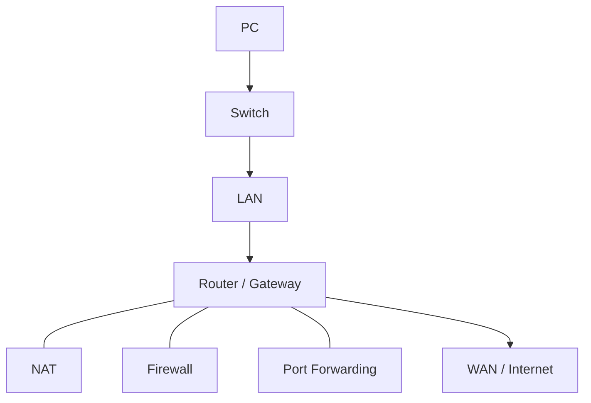

> **Charts and diagrams:** Use fenced `mermaid` blocks for charts, flows, architecture, hierarchies, and relationships. Prefer `flowchart`, `sequenceDiagram`, `stateDiagram-v2`, or `erDiagram` as appropriate. Use clear labels and Obsidian-compatible syntax. Keep runnable code, commands, literal output, payloads, and calculations in their original code formats.

I will give you rough technical notes from videos/courses.

Turn them into a **clear, human-friendly Obsidian Markdown reference**.

The goal is to **teach me the topic**, not just rewrite or summarize my notes.

## 🎯 Main Rules

* Reorganize my notes into the correct learning order.
* Explain the **correct concept directly**.
* Do NOT say things like "your note said..." or "correction to your notes."
* Silently fix mistakes and incomplete information.
* Explain like a good teacher, not like a dictionary.
* Start simple, then go deeper.
* Prioritize:

**Understand → Real-world example → How it works → Technical details → Advanced use**

---

## 🧠 Concepts

For important concepts explain:

### 🌐 Concept Name

Explain naturally in a few paragraphs:

* What it is
* Why we need it
* How it works
* How it connects to previous concepts

Always include a **real-world example** when it helps.

Example:

> 💡 **Real-World Example**
>
> Imagine you have a web server at `192.168.1.50:8080` inside your home LAN.
> You can access it locally, but someone on the Internet cannot directly reach that private IP.
>
> To make it remotely accessible, you can configure port forwarding:
>
> `Public-IP:8080 → 192.168.1.50:8080`
>
> Now the router knows which internal device should receive incoming traffic on port `8080`.

Use practical scenarios like this frequently.

---

## 🔗 Connect Concepts

Do not teach concepts independently when they belong together.

Example:



Then explain the flow in normal language.

Use diagrams where they make the topic easier to visualize.

---

## 🧮 Explain Calculations

If the topic contains numbers, masks, ranges, binary values, formulas, CIDR, sizes, permissions, etc., **show how the value is calculated**.

Do NOT just say:

> `/24 means a 255.255.255.0 subnet mask.`

Explain why:

```text id="8pj4d4"
/24 = first 24 bits are network bits

11111111.11111111.11111111.00000000
    255  .   255  .   255  .    0
```

Then explain:

```text id="e2ogvd"
32 total IPv4 bits
- 24 network bits
= 8 host bits

2^8 = 256 total addresses

Network address:   192.168.1.0
Usable hosts:      192.168.1.1 – 192.168.1.254
Broadcast address: 192.168.1.255
```

Likewise explain `/16`, `/8`, or any other calculation rather than expecting me to memorize the result.

When useful, show the calculation step-by-step.

---

## 💻 Commands

For each command include:

### 💻 `command`

**What it does:**
Explain naturally.

**Structure:**

```bash
command [options]
```

**Example:**

```bash id="bzxwr4"
command example
```

Explain what happens and why I would use it.

Also include when useful:

* Important flags
* Example output
* Explanation of output fields
* Practical examples
* Advanced examples
* Common mistakes

For legacy tools mention the modern alternative:

```text id="1i9p35"
ifconfig → ip
netstat  → ss
```

---

## 🔀 Comparisons

When concepts are easy to confuse, compare them.

Example:

### Switch vs Router

| Switch                              | Router                      |
| ----------------------------------- | --------------------------- |
| Connects devices in a LAN           | Connects different networks |
| Mainly forwards using MAC addresses | Routes using IP addresses   |

Then explain the difference in normal language too.

Do not rely only on tables.

---

## 🧪 Q&A

After major sections add useful questions.

Questions should test understanding, not just memorization.

Example:

```markdown
### 🧪 Interview Q&A

**Q1:** Why does a device need a default gateway?

**Q2:** What happens when the destination is inside the same subnet?

**Q3:** What is the difference between NAT and port forwarding?

**Q4:** Why can `ping 8.8.8.8` work while `ping google.com` fails?
```

Put the answers inside a **collapsed Obsidian callout** so I can answer first without seeing them:

```markdown
> [!answer]- 📋 Answers
>
> **A1:** The default gateway receives traffic destined for networks outside the local subnet.
>
> **A2:** The device communicates locally instead of sending the traffic to the gateway.
>
> **A3:** NAT translates addresses/connections, while port forwarding creates an inbound mapping to a specific internal service.
>
> **A4:** Internet connectivity may work while DNS resolution is failing.
```

Always keep answers hidden/collapsed by default using:

```markdown
> [!answer]-
```

---

## 🌍 Real-World Scenarios

Use realistic scenarios throughout the note.

Do not wait until the end.

For example:

```text id="uf0pb0"
PC:      192.168.1.20
Server:  192.168.1.50
Router:  192.168.1.1
Subnet:  192.168.1.0/24
```

Explain scenarios such as:

* PC → another device in the LAN
* PC → Internet
* Domain → DNS → IP
* Internet → public IP → port forwarding → internal server
* Firewall blocking a service
* Wrong gateway
* Wrong subnet
* DNS failure

Use scenarios to explain **why I would actually care about the concept**.

---

## 🔨 Hands-On Practice

Add a few safe exercises.

For example:

```bash id="3g25or"
ip addr
ip route
ping 192.168.1.1
ping 8.8.8.8
nslookup example.com
ss -ltnp
```

Explain what I should look for and what each command proves.

---

## 📋 End With

### 📋 Quick Reference

Concise cheat sheet.

### 🧠 Things to Remember

Only the highest-value facts.

### 💡 Pro Tips

Practical engineering advice.

### 🔗 Related Topics

Use Obsidian links:

```text id="bpjfov"
[[DNS]]
[[NAT]]
[[Subnetting]]
[[Firewall]]
```

---

## ✍️ Writing Style

Use:

* Natural English
* Short paragraphs
* Practical explanations
* Real-world examples
* Tables when useful
* Mermaid diagrams
* Code blocks
* `> 💡` examples/tips
* `> ⚠️` warnings
* Collapsible Obsidian Q&A

Avoid:

* Dictionary-style one-line definitions
* Huge numbers of tiny sections
* Repeating my original notes
* Saying what was wrong in my notes
* Unexplained jargon
* Giving calculated values without showing how they were calculated
* Advanced details before explaining the basic idea

The note should feel like **an experienced engineer teaching me while creating a long-term reference**.

Output only the finished Markdown.

## Input

**Topic:**
`<TOPIC>`

**Notes:**

```text id="an5o7c"
<PASTE NOTES HERE>
```