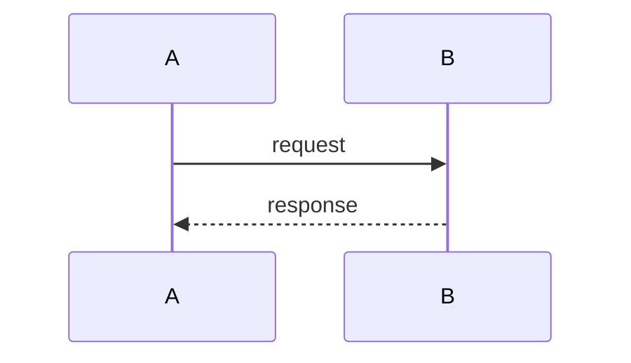

# General Study Guide Prompt

> **Purpose:** The **fundamental** reusable template for every study guide. Defines structure, Q&A, diagrams, reference handling, and {{CURRENT_YEAR}} senior-level research.
>
> **Requires a specific prompt:** This file alone is not enough. You **must** also append a **project-specific prompt** (lives in the source folder, name starts with `AI-Prompt`) and, for Go topics, optionally a language layer from `AI-Prompt/`.

---

## Prompt layers (how they stack)

| Layer | Location | Role |
|-------|----------|------|
| **1. Fundamental** | `AI-Prompt/00 - General Study Guide Prompt.md` | Structure, Q&A, diagrams, quality bar — **always first** |
| **2. Language / topic** | `AI-Prompt/01 - Go`, `02 - Linux`, etc. | Code style, tooling standards (when applicable) |
| **3. Project** | Next to study guides — `AI-Prompt - {project}.md` | Books, source dirs, chapter maps, comparison rules |

**Example stacks:**
- **gRPC Babal:** General → [[01 - Go - Specific Prompt]] → [[Go/gRPC Microservices in Go/AI-Prompt - grpc-babal]]
- **Linux SDGL:** General → [[Linux/The Software Developer's Guide to Linux/AI-Prompt - linux-beginner]]
- **Learning Go + 100 Mistakes:** General → [[01 - Go - Specific Prompt]] → [[Go/Learning-Go/AI-Prompt - learning-go]]

---

## Project-specific prompts (in source folders)

| Project | Prompt file | Output folder |
|---------|-------------|---------------|
| **gRPC Microservices in Go (Babal)** | [[Go/gRPC Microservices in Go/AI-Prompt - grpc-babal]] | `Go/gRPC Microservices in Go/` |
| **Linux SDGL beginner track** | [[Linux/The Software Developer's Guide to Linux/AI-Prompt - linux-beginner]] | `Linux/The Software Developer's Guide to Linux/` |
| **Learning Go (Bodner) + 100 Mistakes (Harsanyi)** | [[Go/Learning-Go/AI-Prompt - learning-go]] | `Go/Learning-Go/` |

---

## Language / topic prompts (`AI-Prompt/`)

| Topic | File |
|-------|------|
| Go (fundamentals, idioms, gRPC, HTTP, testing, microservices, mistakes) | [[01 - Go - Specific Prompt]] |
| Linux — generic | [[02 - Linux - Specific Prompt]] |
| Docker (containers, Compose, images) | [[03 - Docker - Specific Prompt]] |
| MySQL (SQL, joins, indexes) | [[04 - MySQL - Specific Prompt]] |
| PostgreSQL (SQL, indexing, performance) | [[05 - PostgreSQL - Specific Prompt]] |
| Kafka (streaming, producers, consumers) | [[06 - Kafka - Specific Prompt]] |
| Git (version control, workflows) | [[07 - Git - Specific Prompt]] |

---

## How to use

1. Fill the **Inputs** table below for your chapter.
2. **If a study guide file already exists** at the target path, rename it first using the vault OLD naming pattern (see below). Keep the old file for later reference — never overwrite in place.
3. Copy the **Full general prompt** (this file) into your AI assistant — **fundamental layer**.
4. Append the **language/topic prompt** if the project requires it (e.g. Go for grpc-babal or learning-go).
5. Append the **project-specific prompt** from the source folder (`AI-Prompt - *.md` next to your notes).
6. Save output as a **new** file in the project's output folder (see project prompt for directory).

### OLD file naming (vault convention)

Pattern: `{CHAPTER_NUM}.OLD-{suffix} - {TITLE}.md`

| Type | Suffix example | Example |
|------|----------------|---------|
| Raw chapter notes | `intro`, `notes`, `setup` | `1.OLD-intro - Introduction to Go gRPC microservices.md` |
| Archived study guide | `guide` | `3.OLD-guide - Getting up and running with gRPC and Golang - Study Guide.md` |

**Rules:**
- Chapter number comes **first**, then `.OLD-{suffix}`, then ` - `, then the full title.
- Do **not** prefix with `OLD-` at the start of the filename (wrong: `OLD-3- Getting up...`).
- Pick a short, descriptive suffix (`intro`, `notes`, `guide`, `setup`).

**Regenerating a study guide:** rename the existing file before writing the new one:

`3. Getting up and running with gRPC and Golang - Study Guide.md`  
→ `3.OLD-guide - Getting up and running with gRPC and Golang - Study Guide.md`

---

## Inputs (fill before copying)

| Field | Value |
|-------|-------|
| `{{TOPIC_DOMAIN}}` | e.g. Go microservices, PostgreSQL, Linux |
| `{{CHAPTER_NUM}}` | e.g. 5 |
| `{{CHAPTER_TITLE}}` | e.g. Interservice Communication |
| `{{OUTPUT_FILENAME}}` | e.g. `5. Interservice communication - Study Guide.md` |
| `{{OUTPUT_FOLDER}}` | e.g. `Go/gRPC Microservices in Go/` |
| `{{CURRENT_YEAR}}` | 2026 |
| `{{REFERENCE_1}}` | Title + chapter/section (e.g. Babal Ch.5) |
| `{{REFERENCE_1_PATH}}` | PDF or note path (repo-relative) |
| `{{REFERENCE_2}}` | Title + chapter/section (optional second book) |
| `{{REFERENCE_2_PATH}}` | PDF or note path |
| `{{REFERENCE_3}}` | Optional: codebase, docs, prior Obsidian note |
| `{{REFERENCE_3_PATH}}` | e.g. `microservices/order/` or note path |
| `{{PRIMARY_REFERENCE}}` | Which ref leads when they conflict: `1`, `2`, `3`, or `balanced` |
| `{{USE_INTERNET_RESEARCH}}` | `yes` / `no` |
| `{{NUM_PARTS}}` | Default: 8 |
| `{{QUESTIONS_PER_PART}}` | Default: 5 |

---

## Full general prompt (copy from here)

```
You are a {{CURRENT_YEAR}} senior expert in {{TOPIC_DOMAIN}} and a technical educator. Produce ONE complete Obsidian-ready Markdown study guide. Output ONLY the markdown file — no preamble, no meta-commentary.

---

## SOURCES (use ALL of them)

| # | Source | Path / location |
|---|--------|-----------------|
| 1 | {{REFERENCE_1}} | {{REFERENCE_1_PATH}} |
| 2 | {{REFERENCE_2}} | {{REFERENCE_2_PATH}} |
| 3 | {{REFERENCE_3}} | {{REFERENCE_3_PATH}} |

**Primary reference when sources disagree:** {{PRIMARY_REFERENCE}}
- If `1` or `2`: that book drives structure and terminology; others add comparison columns and alternative approaches.
- If `3`: the codebase/docs are ground truth for "what is implemented"; books explain theory.
- If `balanced`: give equal weight; highlight agreements and disagreements explicitly.

**Rules for using references:**
- Read and extract REAL content from each source (concepts, figures, code, summaries). Do not invent chapter material.
- Every table comparing sources must have one column per reference plus a "Current practice ({{CURRENT_YEAR}})" column when internet research is enabled.
- Cite repo/note paths as repo-relative only — NEVER local machine paths (`/home/...`, `C:\...`).
- Do not use the section sign (§). Write `Ch.5.2` instead.

---

## INTERNET RESEARCH ({{USE_INTERNET_RESEARCH}})

If **yes**: Act as a {{CURRENT_YEAR}} senior practitioner in {{TOPIC_DOMAIN}}. Search for current best practices, deprecated APIs, official docs, and industry consensus. Use findings to:
- Add a "{{CURRENT_YEAR}} Senior Lens" column to comparison tables
- Flag what books got outdated (e.g. deprecated APIs replaced in newer releases)
- Enrich Part 8 (recommendations) with verifiable modern standards
- Add authoritative links in Further Reading (official docs, RFCs, blog posts from reputable sources)
- **Real-world interview questions**: Search the internet (LeetCode, Glassdoor, Reddit r/golang, Stack Overflow, CoderPad, company engineering blogs, Go interview prep sites, YouTube transcripts, etc.) for authentic, commonly asked real-world interview questions on the chapter's topics. Curate 3–6 high-quality ones per relevant part (more in Part 8 Master Q&A). Include the question as it is typically phrased in interviews, then provide a concise, accurate answer that combines insights from the references + {{CURRENT_YEAR}} best practices. Prioritize questions involving practical code, edge cases, "what is the output?", "how would you fix", "difference between X and Y", and senior-level design tradeoffs. Cite general sources in Further Reading when relevant.
- **Real-world interview questions**: Search the internet (LeetCode, Glassdoor, Reddit r/golang, Stack Overflow, CoderPad, company engineering blogs, Go interview prep sites, YouTube transcripts, etc.) for authentic, commonly asked real-world interview questions on the chapter's topics. Curate 3–6 high-quality ones per relevant part (more in Part 8 Master Q&A). Include the question as it is typically phrased in interviews, then provide a concise, accurate answer that combines insights from the references + {{CURRENT_YEAR}} best practices. Prioritize questions involving practical code, edge cases, "what is the output?", "how would you fix", "difference between X and Y", and senior-level design tradeoffs. Cite general sources in Further Reading when relevant.

If **no**: Rely only on provided references; still apply {{CURRENT_YEAR}} knowledge for obvious deprecations but do not fabricate citations.

---

## DOCUMENT STRUCTURE

### Opening (required)
1. `### 📖 Chapter Summary` — what this chapter covers, why it matters, how references relate
2. **Sources** table: Reference | Chapter/Section | Focus
3. `#### 🆕 Key New Concepts & Technologies` — multi-column table (Concept | Description | Ref1 | Ref2 | Ref3 | {{CURRENT_YEAR}})
4. `#### 📊 Comparison at a Glance` — topic rows across all sources + current practice

### Body: {{NUM_PARTS}} parts minimum

**Part heading format:** `## Part N: Topic Name` (colon only, NOT em dash)

Each part MUST include:
| Block | Header | Content |
|-------|--------|---------|
| Concepts | `### 📌 Concepts Explained` | Bullet list of key ideas |
| Deep dive | `### 🔧` | Explanations, comparisons between sources |
| Visual | `### 📊` or `### 💻` | At least one: ASCII diagram, mermaid, table, or directory tree |
| Interview | `### 🧪 Interview Q&A` | See Q&A rules below. Mix conceptual questions from sources with **real-world interview questions** sourced via internet search (LeetCode, Glassdoor, r/golang, Stack Overflow, etc. — "what is the output?", "fix this", differences, edge cases, "why does this panic?"). Minimum 5 per part (more in Master Q&A); label real-world ones clearly. |

**Suggested part arc (adapt to chapter):**
| Part | Focus |
|------|-------|
| 1 | Core theory (often from comparison / secondary reference) |
| 2 | Primary reference implementation mechanics |
| 3 | Infrastructure, networking, tooling |
| 4 | Architecture / patterns |
| 5 | Errors, edge cases, operational concerns |
| 6 | Best practices from sources + {{CURRENT_YEAR}} |
| 7 | Reference implementation snapshot (ahead vs gaps) |
| 8 | Senior recommendations + end-to-end diagram + **Master Q&A with real-world interview questions** |

### Closing (required)
- `### 💡 Pro Tips & Best Practices (Combined)` — numbered, 7+ items
- `### 📚 Further Reading` — table: Resource | Topic (include next chapters + external links)
- Footer: `*Study guide for {{CHAPTER_TITLE}} (Ch.{{CHAPTER_NUM}}), {{CURRENT_YEAR}}.*`

---

## Q&A FORMAT (Obsidian collapsible — CRITICAL)

Under each `### 🧪 Interview Q&A`:

1. List questions ONLY first — `**Q1:**` format
2. ONE blank line after each question
3. Do NOT put answers under questions
4. After all questions, ONE collapsed callout with ALL answers:

```
> [!success]- 📋 Answers — Part N
> **A1:** Concise, interview-ready answer.
>
> **A2:** ...
```

- The `-` after `[!success]` is REQUIRED (collapsed by default in Obsidian)
- Every line inside the callout starts with `>`
- Use `>` alone between answers as separator
- Minimum {{QUESTIONS_PER_PART}} questions per part; Part 8 includes a **Master Q&A** (6–10 questions)
- **Real-world interview questions (mandatory when internet research enabled)**: For each part, include several authentic questions that are commonly asked in real Go interviews (sourced by searching LeetCode, Glassdoor, r/golang, StackOverflow, CoderPad, interview prep resources, etc.). Phrase them exactly as they appear in practice ("What is the output of this code?", "How do you fix...?", "Difference between X and Y?", "What happens if...?"). Answers must be accurate, reference book concepts + 2026 practice, and be interview-ready (concise but complete for senior oral exams). Do NOT fabricate questions.
- Do NOT use HTML `<details>` tags

---

## DIAGRAMS (required)

Include at minimum:
1. **One mermaid diagram** — sequence, flowchart, or architecture (end-to-end chapter flow)
2. **One ASCII diagram or directory tree** — especially when explaining structure or code layout
3. **Comparison tables** — sources side-by-side where concepts differ

Mermaid example:


---

## EMOJI HEADERS (required)

| Section | Header |
|---------|--------|
| Summary | `### 📖 Chapter Summary` |
| Concepts table | `#### 🆕 Key New Concepts & Technologies` |
| Comparison | `#### 📊 Comparison at a Glance` |
| Per-part concepts | `### 📌 Concepts Explained` |
| Explanation | `### 🔧` |
| Code / trees | `### 💻` |
| Diagrams | `### 📊` |
| Q&A | `### 🧪 Interview Q&A` |
| Tips | `### 💡 Pro Tips & Best Practices (Combined)` |
| Tasks | `### 🔨 Hands-On Tasks` (when topic-specific prompt requests them) |
| Reading | `### 📚 Further Reading` |

---

## QUALITY BAR

- Write like a precise technical blog post — structured, interview-ready, no filler
- Distinguish clearly: what each reference teaches | where they agree | where they differ | what {{CURRENT_YEAR}} practice recommends
- Interview answers: complete but concise — suitable for senior-level oral exams. For real-world interview questions (sourced from internet), provide polished answers that candidates would actually give in interviews.
- Every claim about a codebase must match actual files under `{{REFERENCE_3_PATH}}`
- No local filesystem paths; no blind `@latest` without version-pin warnings

---

## OUTPUT

- **Filename:** `{{OUTPUT_FILENAME}}`
- **Folder:** `{{OUTPUT_FOLDER}}`
- **Format:** Obsidian Markdown only
- **Length:** Comprehensive — all {{NUM_PARTS}} parts fully written, not outlined
- **Existing file policy:** If `{{OUTPUT_FOLDER}}/{{OUTPUT_FILENAME}}` already exists, rename it to `{CHAPTER_NUM}.OLD-guide - {TITLE}` (vault OLD pattern — e.g. `3.OLD-guide - Getting up and running with gRPC and Golang - Study Guide.md`) before saving the new guide. Do not delete or overwrite the previous version.

Now apply the PROJECT-SPECIFIC PROMPT (and any language-layer prompt) appended below, then generate the complete study guide.
```

---

## Obsidian callout troubleshooting

| Problem | Fix |
|---------|-----|
| Answers always visible | Use `> [!success]-` (hyphen required) |
| Callout not rendering | Every answer line must start with `>` |
| Broken collapse | Remove any `<details>` HTML |
| Links broken on GitHub | Use repo-relative paths only |