[[Brokers/MQTT/HiveMQ 3.1.1/0. MQTT Table of Contents|📚 MQTT Table of Contents]]


> [!toc]- 📑 Contents
>
> - [[#🌐 What Is MQTT?|🌐 What Is MQTT?]]
> - [[#🖥️ Our Broker: Eclipse Mosquitto|🖥️ Our Broker: Eclipse Mosquitto]]
> - [[#🌐 Why MQTT Is Useful for IoT|🌐 Why MQTT Is Useful for IoT]]
> - [[#🪶 MQTT Is Lightweight|🪶 MQTT Is Lightweight]]
> - [[#🌐 Binary Protocol|🌐 Binary Protocol]]
> - [[#↔️ Bidirectional Communication|↔️ Bidirectional Communication]]
> - [[#📦 MQTT Is Data-Agnostic|📦 MQTT Is Data-Agnostic]]
> - [[#📈 MQTT Can Scale to Large Systems|📈 MQTT Can Scale to Large Systems]]
> - [[#🚀 MQTT Is Built for Push Communication|🚀 MQTT Is Built for Push Communication]]
> - [[#🔧 Suitable for Constrained Devices|🔧 Suitable for Constrained Devices]]
> - [[#🧱 MQTT Runs on Top of TCP|🧱 MQTT Runs on Top of TCP]]
> - [[#🌐 Why MQTT Uses TCP|🌐 Why MQTT Uses TCP]]
> - [[#📶 Unreliable Networks vs Reliable Communication|📶 Unreliable Networks vs Reliable Communication]]
> - [[#💓 Heartbeat Mechanism|💓 Heartbeat Mechanism]]
> - [[#🔐 MQTT and TLS|🔐 MQTT and TLS]]
> - [[#🔗 Putting the Concepts Together|🔗 Putting the Concepts Together]]
> - [[#🆚 MQTT Characteristics at a Glance|🆚 MQTT Characteristics at a Glance]]
> - [[#🧪 Understanding Check|🧪 Understanding Check]]
> - [[#🔨 Hands-On Mental Exercise|🔨 Hands-On Mental Exercise]]
> - [[#📋 Quick Reference|📋 Quick Reference]]
> - [[#🧠 Things to Remember|🧠 Things to Remember]]
> - [[#💡 Pro Tips|💡 Pro Tips]]
> - [[#🔗 Related Topics|🔗 Related Topics]]

## 🌐 What Is MQTT?

**MQTT** stands for **Message Queuing Telemetry Transport**.

It is a lightweight messaging protocol designed mainly for:

- **IoT — Internet of Things**
- **M2M — Machine-to-Machine communication**

MQTT is especially useful when devices have:

- limited CPU or RAM
- limited network bandwidth
- unstable network connections
- a need to send small messages efficiently

Typical MQTT devices include:

```
Sensors
Smart meters
ESP32 devices
Vending machines
Industrial controllers
Smart home devices
Vehicle trackers
```

A simple MQTT-based system might look like this:

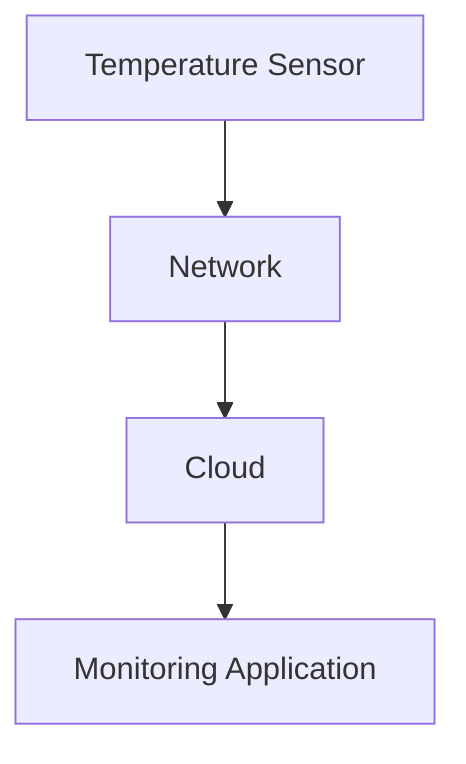

> 💡 **Real-World Example**
> 
> Imagine a vending machine that periodically reports:
> 
> ```
> machine_id = VM-102
> temperature = 5.2°C
> ```
> 
> The vending machine does not need to transfer a large webpage or complicated protocol structure.
> 
> It only needs to send a small message efficiently.
> 
> MQTT is designed for exactly this kind of communication.

---

## 🖥️ Our Broker: Eclipse Mosquitto

**HiveMQ is the course source; Eclipse Mosquitto is the broker used for these exercises.** MQTT concepts transfer between compliant brokers, while configuration names and operational features differ.

Mosquitto supports MQTT 3.1, 3.1.1, and 5.0. This course uses MQTT **3.1.1**, selected explicitly with `-V mqttv311` in the command-line examples. [Eclipse Mosquitto](https://mosquitto.org/)

### 🆓 Free, Open-Source MQTT Brokers

*Project and license information checked on 2026-10-04. Links point to maintained project sources; use their release pages to choose a supported patch version.*

| Broker | Open-source license | Where it fits |
|---|---|---|
| **[Eclipse Mosquitto](https://mosquitto.org/)** | EPL/EDL | Lightweight broker for local development, gateways, and servers; our choice for the labs |
| **[HiveMQ Community Edition](https://github.com/hivemq/hivemq-community-edition)** | Apache 2.0 | Java broker supporting MQTT 3.x and 5; distinguish CE from HiveMQ's commercial offerings |
| **[NanoMQ](https://github.com/nanomq/nanomq)** | MIT | MQTT 3.1.1/5 broker focused on edge and embedded deployments |

These open-source editions can be self-hosted without a broker license purchase; hosting and optional commercial support are separate costs. Mosquitto's **2.1 release line** was introduced in January 2026. See its [release announcement](https://mosquitto.org/blog/2026/01/version-2-1-0-released/) and [downloads](https://mosquitto.org/download/).

**EMQX licensing distinction:** Releases starting at 5.9 use BSL 1.1, a source-available license. Do not treat current EMQX as an unrestricted open-source alternative merely because older versions used Apache 2.0. [EMQX licensing FAQ](https://www.emqx.com/en/content/license-faq)

Start with [[3. MQTT Client–Broker Setup and Connection Flow#🦟 Shared Mosquitto Lab|the shared Mosquitto lab]], then reuse it in the packet, topic, QoS, and session lessons.

---

# 🌐 Why MQTT Is Useful for IoT

IoT devices are very different from normal desktop computers or powerful servers.

An embedded device might have:

```
CPU:        small microcontroller
RAM:        a few hundred KB
Network:    Wi-Fi / cellular
Bandwidth:  limited
Connection: sometimes unstable
```

Using a protocol with a large amount of overhead would waste:

- bandwidth
- memory
- CPU time
- power

MQTT was designed to keep communication relatively simple and lightweight.

This is one of the main reasons MQTT became popular in IoT systems.

---

# 🪶 MQTT Is Lightweight

One of MQTT's important characteristics is its **small protocol overhead**.

MQTT uses a compact **binary protocol**.

The smallest possible MQTT control packet can be only:

```
2 bytes
```

This does **not** mean every MQTT message is only two bytes.

It means MQTT's basic protocol structure can be extremely small compared with protocols that require large text-based headers.

For constrained devices, this can be important.

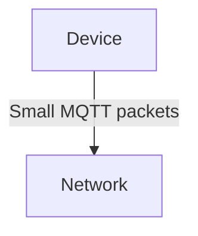

Less protocol overhead can mean:

```
less bandwidth usage
less processing
less data transferred
```

---

## 🌐 Binary Protocol

MQTT is a **binary protocol**.

This means MQTT packets are represented using binary fields rather than being structured as human-readable text.

Conceptually:

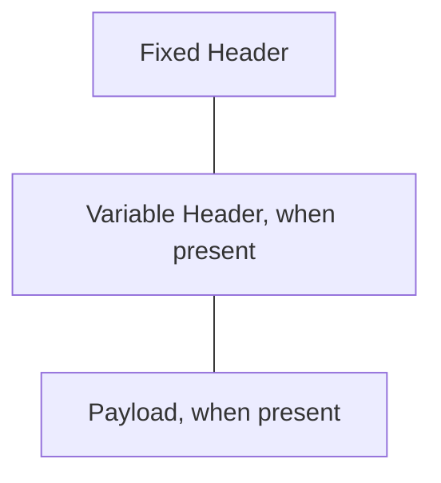

The exact structure depends on the type of MQTT packet.

At this stage, the important idea is simply:

> MQTT tries to represent communication using compact binary structures.

This helps reduce unnecessary network overhead.

---

# ↔️ Bidirectional Communication

MQTT communication is **bidirectional**.

A device can both:

```
send messages
and
receive messages
```

For example, a vending machine might send:

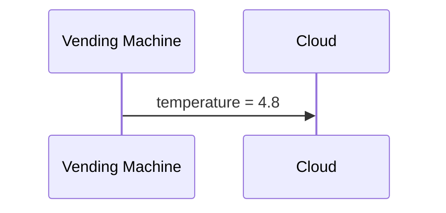

But the cloud might also send something back:

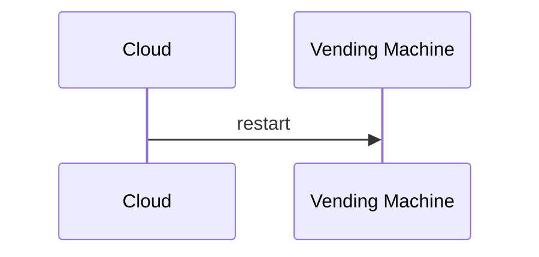

So MQTT is not limited to devices simply uploading sensor data.

Communication can happen in both directions.

> 💡 **Real-World Example**
> 
> A vending machine reports that a product has been sold:
> 
> ```mermaid
> sequenceDiagram
>     participant D as Device
>     participant C as Cloud
>     D->>C: product_id = 54, quantity = 1
> ```
> 
> Later, the server may send a configuration command:
> 
> ```mermaid
> sequenceDiagram
>     participant C as Cloud
>     participant D as Device
>     C->>D: update_price = 25000
> ```
> 
> The same MQTT system can support both directions.

---

# 📦 MQTT Is Data-Agnostic

MQTT does not force your application to use one particular data format.

The data carried inside an MQTT message is generally treated as a sequence of bytes.

Your application decides how those bytes should be interpreted.

For example, you could send:

```
Plain text
JSON
Binary data
Custom binary structures
Protocol Buffers
```

A JSON payload might look like:

```
{
  "temperature": 5.2,
  "door": "closed"
}
```

A very small device might instead send a compact binary representation.

MQTT itself does not require the payload to be JSON.

This property is called being **data-agnostic**.

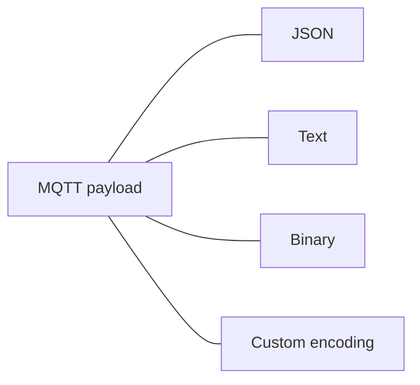

> 💡 MQTT handles the transportation of the message. Your application decides what the payload means.

---

# 📈 MQTT Can Scale to Large Systems

MQTT is commonly used in systems containing many devices.

A deployment might contain:

```
10 devices
100 devices
10,000 devices
1,000,000+ devices
```

The protocol itself was designed with large messaging systems in mind.

For example:

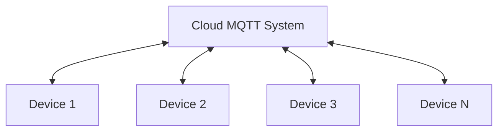

Supporting millions of devices requires much more than just choosing MQTT.

The complete system also depends on things such as:

- server capacity
- network infrastructure
- MQTT server implementation
- message volume
- connection count
- application architecture

But MQTT itself is well suited to large IoT messaging systems.

---

# 🚀 MQTT Is Built for Push Communication

MQTT works very well for **push-based communication**.

In push communication, the sender can transmit new information when it becomes available.

The receiver does not have to repeatedly ask:

```
Anything new?
Anything new?
Anything new?
Anything new?
```

Instead:

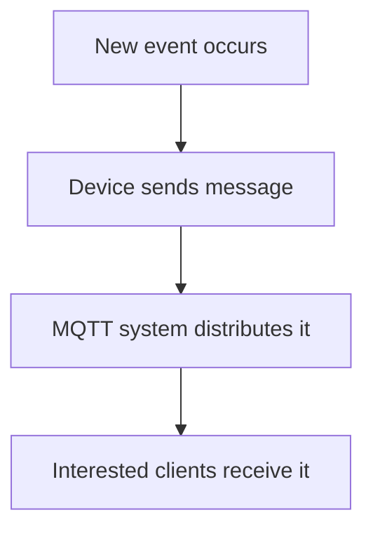

> 💡 **Real-World Example**
> 
> Imagine a vending machine detects that its door was opened.
> 
> Instead of a monitoring server checking the machine every few seconds:
> 
> ```mermaid
> sequenceDiagram
>     participant S as Server
>     participant D as Device
>     loop Repeated polling
>         S->>D: Is door open?
>     end
> ```
> 
> the vending machine can immediately send:
> 
> ```
> door = open
> ```
> 
> The information can then be delivered to other connected applications very quickly.

This makes MQTT useful for systems where events should propagate quickly.

---

# 🔧 Suitable for Constrained Devices

MQTT is commonly used with **constrained devices**.

A constrained device has limited resources such as:

```
CPU
RAM
storage
network bandwidth
battery power
```

For example:

```
ESP32
Small IoT sensors
Embedded Linux devices
Microcontroller-based controllers
```

Because MQTT has relatively small protocol overhead and a simple messaging model, it can work well on such devices.

> 💡 **Real-World Example**
> 
> An ESP32 does not need the same communication stack as a powerful web server.
> 
> If it only needs to send:
> 
> ```
> temperature = 28
> ```
> 
> every few seconds, a lightweight messaging protocol is attractive.

---

# 🧱 MQTT Runs on Top of TCP

MQTT normally runs on top of **TCP**.

The protocol stack can be visualized as:

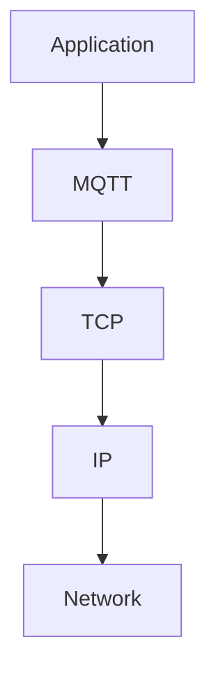

Or simply:

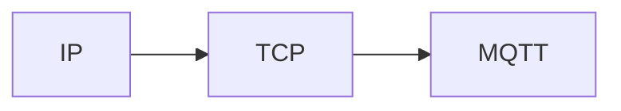

Each layer has a different responsibility.

```
MQTT
Messaging rules

TCP
Reliable ordered byte stream

IP
Moves packets between networks
```

---

## 🌐 Why MQTT Uses TCP

TCP provides important properties for MQTT communication.

TCP provides:

- reliable delivery of the TCP byte stream
- ordered delivery
- retransmission of lost TCP segments
- connection-oriented communication

For example, suppose data is transmitted across the network:


TCP ensures the receiving application sees the bytes in the correct order.

If part of the transmission is lost:


TCP can retransmit the missing data before exposing the ordered byte stream to MQTT.

Conceptually:

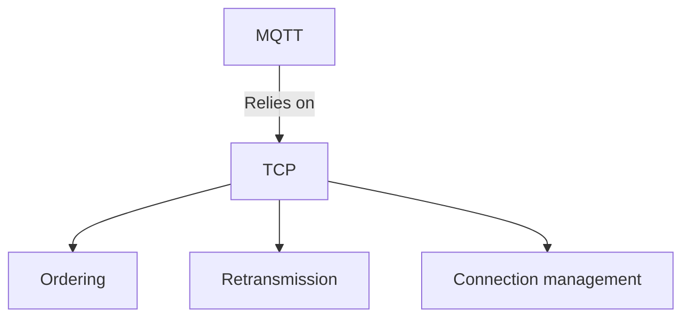

> ⚠️ TCP reliability does not mean the physical network itself is always available.
> 
> Wi-Fi can disconnect, cellular coverage can disappear, routers can restart, and devices can lose power.
> 
> MQTT still needs mechanisms for recognizing when connections disappear.

---

# 📶 Unreliable Networks vs Reliable Communication

IoT devices frequently operate over networks such as:

```
Wi-Fi
4G / LTE
5G
Ethernet
mobile hotspots
industrial networks
```

Some of these connections may disappear temporarily.

For example:

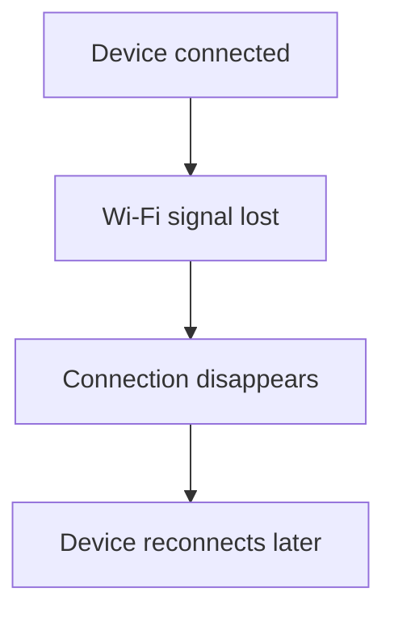

MQTT is designed with these kinds of environments in mind.

TCP gives MQTT a reliable transport while a TCP connection exists.

MQTT then adds messaging and connection-management behavior suitable for IoT applications.

---

# 💓 Heartbeat Mechanism

One important MQTT feature is a mechanism used to detect connection failures.

This is commonly associated with MQTT's **Keep Alive** mechanism.

Imagine this situation:

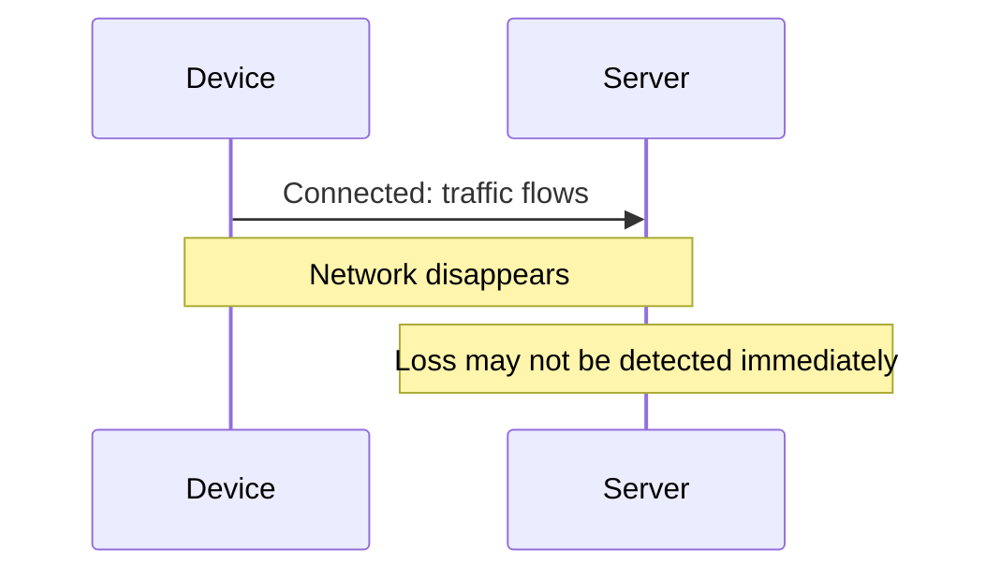

Sometimes a connection can disappear without either side immediately knowing.

For example:

- Wi-Fi signal disappears
- router loses power
- network cable is disconnected
- mobile connection drops
- device freezes

A heartbeat-style mechanism helps determine whether the connection is still alive.

At a high level:

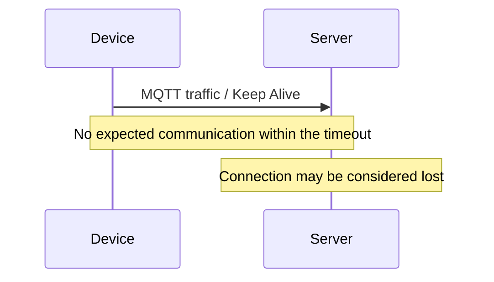

The exact MQTT Keep Alive behavior and packets can be studied in more detail later.

For now, remember:

> MQTT contains a mechanism that helps clients and servers detect dead or lost connections.

---

### 🧪 Interview Q&A

**Q1:** Why is connection-loss detection particularly important for IoT devices?

**Q2:** If MQTT uses TCP, why can an MQTT device still disconnect?

**Q3:** What kind of problems could prevent a server from immediately noticing that a device disappeared?

> [!answer]- 📋 Answers
> 
> **A1:** IoT devices often operate over Wi-Fi, cellular, or other networks where connectivity can disappear unexpectedly. The application needs a way to recognize that a connection is no longer usable.
> 
> **A2:** TCP provides reliable communication while the connection exists, but it cannot prevent Wi-Fi loss, router failures, power loss, or physical network problems.
> 
> **A3:** A device could lose power, Wi-Fi could disappear, a router could fail, or the network path could break without immediately producing normal connection traffic.

---

# 🔐 MQTT and TLS

MQTT communication can also be protected using **TLS**.

The protocol stack then becomes:

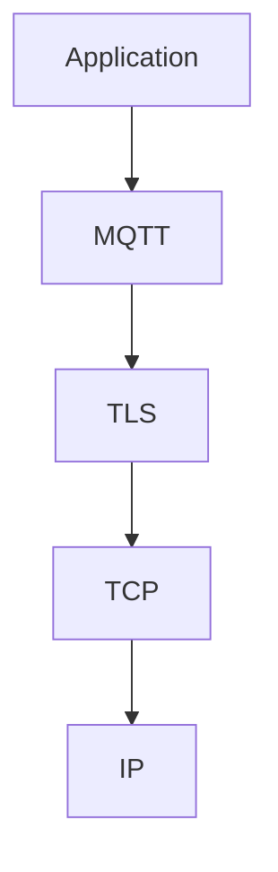

TLS provides encrypted communication between the two endpoints.

Without TLS, someone who can observe the network traffic may potentially inspect MQTT communication depending on the network and configuration.

With TLS:

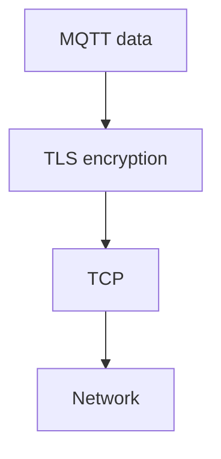

> 💡 **Real-World Example**
> 
> A vending machine sends information to a cloud server:
> 
> ```
> machine_id = 104
> total_sales = 350000
> ```
> 
> MQTT defines how that message participates in the MQTT messaging system.
> 
> TLS can protect that communication while it travels over the network.

TLS itself is not MQTT.

They solve different problems:

|MQTT|TLS|
|---|---|
|Messaging protocol|Security protocol|
|Defines MQTT communication|Encrypts/protects communication|
|Runs above TCP|Also runs above TCP|
|Used by the application|Protects the transport channel|

Combined:

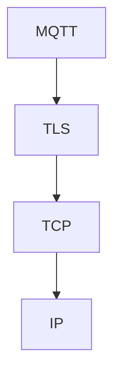

---

# 🔗 Putting the Concepts Together

So far, the complete picture looks like this:

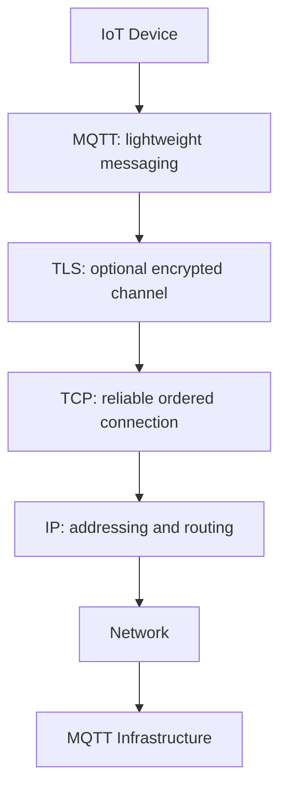

The layers have different jobs:

```mermaid
flowchart TD
    M["MQTT: message exchange"]
    T["TLS: communication protection"]
    C["TCP: reliable ordered connection"]
    I["IP: traffic between endpoints"]
    M --- T
    T --- C
    C --- I
```

Understanding these layers separately is important because problems can happen at different layers.

For example:

```mermaid
flowchart TD
    N0["No IP connectivity"]
    N1["TCP cannot connect"]
    N2["MQTT cannot connect"]
    N0 --> N1
    N1 --> N2
```

Or:

```mermaid
flowchart TD
    N0["IP works"]
    N1["TCP works"]
    N2["TLS fails"]
    N3["Secure MQTT connection fails"]
    N0 --> N1
    N1 --> N2
    N2 --> N3
```

---

# 🆚 MQTT Characteristics at a Glance

|Characteristic|Meaning|
|---|---|
|IoT-oriented|Designed for device messaging|
|Lightweight|Small protocol overhead|
|Binary|Compact binary packet structure|
|Bidirectional|Devices can send and receive|
|Data-agnostic|Payload format is chosen by the application|
|Scalable|Suitable for systems with many connected devices|
|Push-oriented|New events can be delivered without constant polling|
|Constrained-device friendly|Suitable for devices with limited resources|
|TCP-based|Uses TCP's reliable ordered connection|
|Connection monitoring|Includes Keep Alive behavior for detecting dead connections|
|TLS support|Communication can be protected using TLS|

---

# 🧪 Understanding Check

**Q1:** Why is MQTT commonly used in IoT instead of using a much heavier communication protocol?

**Q2:** Does MQTT require messages to contain JSON?

**Q3:** Can an MQTT device only send data, or can it receive data too?

**Q4:** Why is being a binary protocol useful for constrained devices?

**Q5:** What does TCP provide underneath MQTT?

**Q6:** Does TCP guarantee that an IoT device will always remain connected?

**Q7:** What is the purpose of MQTT's heartbeat/Keep Alive mechanism?

**Q8:** What does TLS add to MQTT communication?

> [!answer]- 📋 Answers
> 
> **A1:** MQTT has relatively low protocol overhead and is suitable for devices with limited CPU, memory, bandwidth, or unstable connectivity.
> 
> **A2:** No. MQTT is data-agnostic. The payload could contain JSON, text, binary data, or another encoding.
> 
> **A3:** It can do both. MQTT communication is bidirectional.
> 
> **A4:** Binary protocols can represent protocol information compactly, reducing unnecessary bandwidth and processing overhead.
> 
> **A5:** TCP provides a reliable, ordered byte-stream connection and retransmits lost TCP data when possible.
> 
> **A6:** No. The physical or network connection can still disappear because of Wi-Fi loss, power failure, router failure, cellular problems, and similar issues.
> 
> **A7:** It helps MQTT participants detect connections that are no longer alive.
> 
> **A8:** TLS can encrypt and protect the communication channel used for MQTT traffic.

---

# 🔨 Hands-On Mental Exercise

Consider an ESP32 temperature sensor:

```
ESP32
IP: 192.168.1.50
```

It needs to send:

```
temperature = 27.5
```

to a cloud service.

Think about the layers involved:

```mermaid
flowchart TD
    N0["Application creates temperature data"]
    N1["MQTT handles the message"]
    N2["TLS may encrypt the connection"]
    N3["TCP transports the data reliably"]
    N4["IP carries traffic across networks"]
    N0 --> N1
    N1 --> N2
    N2 --> N3
    N3 --> N4
```

Now imagine the Wi-Fi disappears.

The MQTT application cannot simply assume the device is still connected forever.

Connection monitoring and reconnection logic become important in real IoT systems.

---

# 📋 Quick Reference

```
MQTT = lightweight messaging protocol commonly used for IoT and M2M

Main characteristics:

✓ Lightweight
✓ Binary
✓ Bidirectional
✓ Data-agnostic
✓ Scalable
✓ Push-oriented
✓ Suitable for constrained devices
✓ Runs over TCP
✓ Has connection Keep Alive mechanisms
✓ Can use TLS
```

Protocol stack:

```mermaid
flowchart TD
    N0["MQTT"]
    N1["TCP"]
    N2["IP"]
    N0 --> N1
    N1 --> N2
```

Secure MQTT:

```mermaid
flowchart TD
    N0["MQTT"]
    N1["TLS"]
    N2["TCP"]
    N3["IP"]
    N0 --> N1
    N1 --> N2
    N2 --> N3
```

TCP provides:

```
reliable byte stream
ordered delivery
retransmission
connection management
```

MQTT provides:

```
IoT messaging
small protocol overhead
bidirectional communication
connection monitoring
```

TLS provides:

```
encrypted/protected communication
```

---

# 🧠 Things to Remember

- MQTT was designed with **IoT and M2M communication** in mind.
- MQTT is lightweight because its protocol overhead can be very small.
- MQTT uses a **binary protocol**.
- MQTT communication can work in both directions.
- MQTT does **not** force you to use JSON or another specific payload format.
- MQTT normally runs on **TCP**.
- TCP provides reliable and ordered transport, but the network itself can still disappear.
- MQTT includes mechanisms for detecting dead connections.
- TLS can be placed between MQTT and TCP to protect the connection.

---

# 💡 Pro Tips

> 💡 Do not confuse **TCP reliability** with **network availability**. TCP can reliably transport data over an active connection, but it cannot stop Wi-Fi, cellular service, routers, or devices from failing.

> 💡 Think of MQTT as the **messaging layer**, TCP as the **transport layer**, and TLS as the **security layer**.

> 💡 MQTT being data-agnostic is useful in embedded systems because a tiny device can use a compact binary representation while another application may choose JSON.

> ⚠️ "MQTT is lightweight" does not mean every MQTT system is automatically fast or scalable. The server infrastructure, number of devices, message frequency, payload size, and network architecture also matter.

# 🔗 Related Topics

[[TCP]]

[[IP]]

[[TLS]]

[[IoT]]

[[M2M]]

[[MQTT Keep Alive]]
