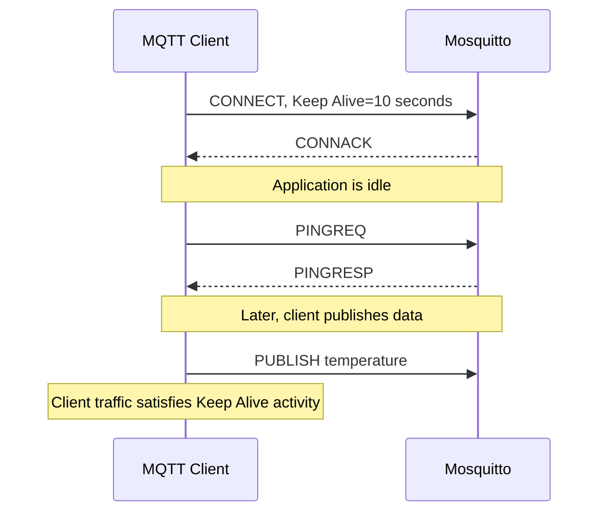
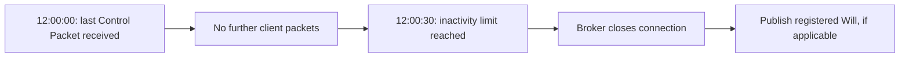
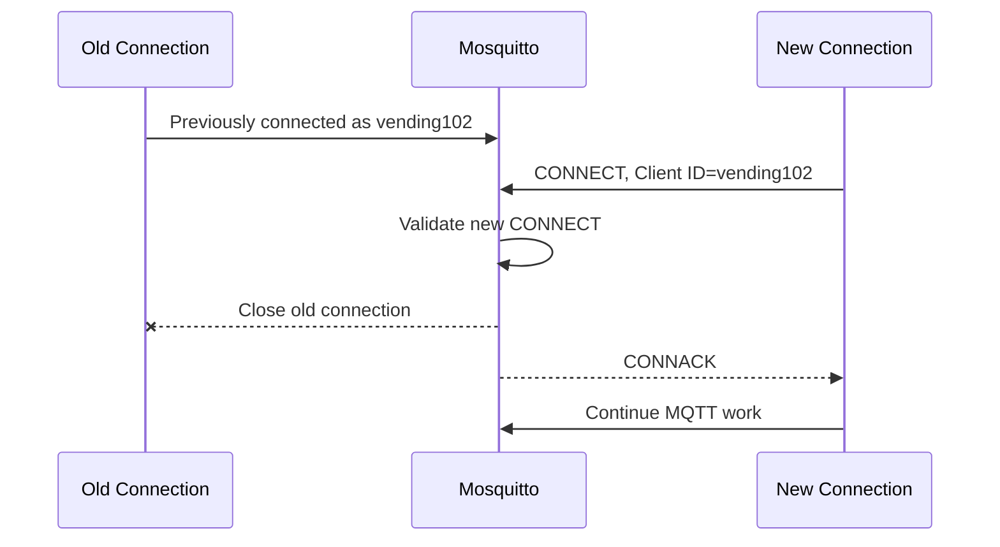

# 💓 MQTT Keep Alive & Client Takeover

[[Brokers/MQTT/HiveMQ 3.1.1/0. MQTT Table of Contents|📚 MQTT Table of Contents]]

> [!toc]- 📑 Contents
>
> - [[#🌐 A TCP Connection Can Look Alive After Failure|🌐 A TCP Connection Can Look Alive After Failure]]
> - [[#🏓 Keep Alive and MQTT Ping Packets|🏓 Keep Alive and MQTT Ping Packets]]
> - [[#⏱️ Calculate the Broker Timeout|⏱️ Calculate the Broker Timeout]]
> - [[#🎛️ Choose a Keep Alive Value|🎛️ Choose a Keep Alive Value]]
> - [[#🔄 Client Takeover Replaces an Old Connection|🔄 Client Takeover Replaces an Old Connection]]
> - [[#🔐 Protect Client Identity|🔐 Protect Client Identity]]
> - [[#🦟 Mosquitto Keep Alive Lab|🦟 Mosquitto Keep Alive Lab]]
> - [[#🆔 Mosquitto Client Takeover Lab|🆔 Mosquitto Client Takeover Lab]]
> - [[#🧪 Understanding Check|🧪 Understanding Check]]
> - [[#🔨 Hands-On Practice|🔨 Hands-On Practice]]
> - [[#📋 Quick Reference|📋 Quick Reference]]
> - [[#🧠 Things to Remember|🧠 Things to Remember]]
> - [[#💡 Pro Tips|💡 Pro Tips]]
> - [[#🔗 Related Topics|🔗 Related Topics]]

## 🌐 A TCP Connection Can Look Alive After Failure

A client can lose its network connection while the broker still believes its TCP connection is open. Without traffic or an error, one side may not immediately discover that the other side has disappeared. This is often described as a **half-open connection**.

**Keep Alive** gives MQTT a way to detect silence. **Client takeover** lets a returning client replace an old connection using the same identity. This lesson uses **MQTT 3.1.1** and **Mosquitto**.

> [!example] 💡 A Vending Machine Changes Networks
>
> The machine loses Wi-Fi, then reconnects through a backup connection.
>
> - 🖥️ **Broker:** may still hold the old connection.
>
> - 🆔 **Device:** reconnects using its existing Client ID, `vending102`.
>
> - 🔄 **Takeover:** the broker closes the old connection and accepts the new one after validating CONNECT.
>
> If the machine never returns, Keep Alive can reveal that its old connection has gone silent.

---

## 🏓 Keep Alive and MQTT Ping Packets

The client supplies a **Keep Alive interval in seconds** in CONNECT. It limits the gap between MQTT Control Packets sent by the client.

If no other packet is being sent, the client sends `PINGREQ`; the broker replies with `PINGRESP`. Both have an empty payload. These are MQTT packets, not the ICMP packets used by the shell's `ping` command.



Publishing frequently can satisfy the requirement without a ping for every interval. A healthy client that only subscribes still needs to send its own MQTT traffic; incoming messages alone do not satisfy its sending obligation.

If the client sends PINGREQ but gets no PINGRESP within a reasonable time, it should close the connection. Its library's response timeout is distinct from the broker's inactivity deadline. [MQTT 3.1.1: Keep Alive](https://docs.oasis-open.org/mqtt/mqtt/v3.1.1/os/mqtt-v3.1.1-os.html)

Keep Alive shows that the MQTT connection is responsive. It does not prove that the machine's payment or refrigeration logic is healthy.

---

## ⏱️ Calculate the Broker Timeout

For nonzero Keep Alive, the broker's inactivity limit is **1.5 × Keep Alive**, measured since the last MQTT Control Packet it received from the client.

For `Keep Alive = 20 seconds`:

1. Calculate `20 × 1.5 = 30 seconds`.

2. Suppose the last Control Packet arrives at `12:00:00`.

3. Without another packet or an earlier detected error, the timeout is reached at `12:00:30`.



The clock is not measured from the last temperature reading or the physical moment Wi-Fi failed. A socket error can reveal the failure sooner. [[9. MQTT Last Will and Testament|Lesson 9]] explains how closing a failed connection can trigger its Will.

---

## 🎛️ Choose a Keep Alive Value

| Choice | Practical effect |
|---|---|
| Shorter interval | Faster silence detection, more idle ping traffic |
| Longer interval | Less idle ping traffic, slower silence detection |
| `0` | Disable MQTT Keep Alive's inactivity mechanism |

Use an interval that suits the device's network, battery constraints, and required detection speed. Keep Alive does not need to equal the sensor's reporting interval: a device publishing every five minutes can send pings between readings.

### 🧮 Why the Maximum Is About 18 Hours

The MQTT 3.1.1 field is an unsigned 16-bit value:

1. Maximum value: `2^16 − 1 = 65,535 seconds`.

2. Hours: `18 × 3,600 = 64,800 seconds`; remainder `735`.

3. Minutes: `12 × 60 = 720 seconds`; remainder `15`.

Therefore, the maximum is **18 hours, 12 minutes, 15 seconds**. This is the field's range, rather than a suggested deployment setting. [MQTT 3.1.1: CONNECT Keep Alive field](https://docs.oasis-open.org/mqtt/mqtt/v3.1.1/os/mqtt-v3.1.1-os.html)

Setting zero does not force a broker to keep the connection forever. Network failures, broker policy, or another connection using the same Client ID can still end it.

---

## 🔄 Client Takeover Replaces an Old Connection

A broker permits only one active connection for a given **Client ID**. When a new valid CONNECT uses an already-connected Client ID, the broker disconnects the existing client. This also applies when the old connection is completely healthy. [MQTT 3.1.1: CONNECT response](https://docs.oasis-open.org/mqtt/mqtt/v3.1.1/os/mqtt-v3.1.1-os.html)



The broker recognizes the Client ID, not proof that the new process is the same physical device.

### 🆔 Accidental Duplicate IDs

If two devices both use `vending102`, each new connection can evict the other. Automatic reconnect can create a repeating disconnect/reconnect loop.

Use **stable IDs per logical client, unique among simultaneously active clients**. Keep the same ID when intentionally resuming that client's session.

### 💾 Takeover and Session Recovery Are Separate

| Mechanism | Question it answers |
|---|---|
| Takeover | Which connection currently owns this Client ID? |
| Persistent session | Which subscriptions and pending exchanges remain? |

In MQTT 3.1.1, `CleanSession = false` requests session continuation, while `CleanSession = true` starts a clean session. Reusing the ID alone does not guarantee queued messages survive. See [[7. Persistent Sessions & Queueing|lesson 7]].

A takeover closes the old connection without receiving its DISCONNECT. Account for that old connection's Will and resulting status messages when designing reconnect behavior; an offline notification can reflect the old connection rather than a failed replacement.

---

## 🔐 Protect Client Identity

A Client ID is an identifier, not a secret or authentication credential. Someone who can connect using another client's ID may disrupt it.

- **Authenticate clients.** Use appropriate credentials or client certificates.

- **Protect transport with TLS.** Encryption and server verification protect the channel; client authentication requires credentials or mutual TLS.

- **Enforce identity rules at the broker.** Restrict which Client IDs each authenticated identity may use. Topic permissions alone do not establish ownership of an ID.

Mosquitto offers `use_username_as_clientid true` for listeners where using the authenticated username as the effective Client ID fits the design. Clients then need usernames, and connections sharing a username also share that ID. This is useful with distinct device identities, rather than one shared account for many devices. [Mosquitto identity setting](https://mosquitto.org/man/mosquitto-conf-5.html)

Keep the following anonymous practice broker local, as configured in the shared lab.

---

## 🦟 Mosquitto Keep Alive Lab

Start [[3. MQTT Client–Broker Setup and Connection Flow#🦟 Shared Mosquitto Lab|the shared broker]] and watch its verbose log. Use Bash or Zsh on Linux or macOS for the process-signal steps.

### 1. Watch for a Will

In **Terminal A**:

```bash
mosquitto_sub -h 127.0.0.1 -p 18883 -V mqttv311 \
  -t 'lab/keepalive/status' -q 1 -v
```

### 2. Start an Idle Client

In **Terminal B**:

```bash
mosquitto_sub -h 127.0.0.1 -p 18883 -V mqttv311 \
  -i labKeepAlive102 -k 10 -t 'lab/keepalive/data' -q 1 -d \
  --will-topic 'lab/keepalive/status' --will-payload 'offline' --will-qos 1 &
keepalive_lab_pid=$!
```

`-k 10` requests a ten-second Keep Alive, and `-d` prints protocol activity. `&` runs the client in the background; `$!` captures its process ID. [Mosquitto subscriber options](https://mosquitto.org/man/mosquitto_sub-1.html)

Wait for successful connection and subscription. Leave it idle long enough to see PINGREQ and PINGRESP in debug output.

✅ The client stays connected without application publications because its MQTT pings continue.

### 3. Suspend Only This Client

Run in the same Terminal B:

```bash
kill -STOP "$keepalive_lab_pid"
```

`SIGSTOP` pauses this lab process without allowing it to send DISCONNECT or close its socket. It cannot generate MQTT pings, although the operating system can still maintain the TCP socket.

✅ After roughly the remaining Keep Alive timeout, the broker log should report timeout/disconnection and Terminal A should receive `offline`. The limit is 15 seconds from the last received client Control Packet; log timing can vary slightly with processing and observation.

This models a silent MQTT client, not a real Wi-Fi outage. Unlike killing the process immediately, it avoids giving the broker an immediate socket-close notification.

### 4. Clean Up the Suspended Process

```bash
kill -KILL "$keepalive_lab_pid"
```

This terminates the specific suspended client captured above. Stop the observer in Terminal A with Ctrl+C. The Will was not retained, so there is no status snapshot to delete.

---

## 🆔 Mosquitto Client Takeover Lab

Keep the same broker running. Here the old client uses a longer Keep Alive so you can reconnect before its inactivity timeout.

### 1. Establish the Old Connection

In **Terminal B**:

```bash
mosquitto_sub -h 127.0.0.1 -p 18883 -V mqttv311 \
  -i labTakeover102 -k 60 -t 'lab/takeover/data' -q 1 -d &
takeover_lab_pid=$!
```

Wait for successful CONNACK and SUBACK, then suspend it:

```bash
kill -STOP "$takeover_lab_pid"
```

### 2. Connect with the Same Client ID

Before the old connection's 90-second inactivity limit, run:

```bash
mosquitto_pub -h 127.0.0.1 -p 18883 -V mqttv311 \
  -i labTakeover102 -t 'lab/takeover/data' -q 1 -m 'replacement connected' -d
```

The publisher intentionally uses the same `-i` value. It should connect, publish, and disconnect normally. [Mosquitto publisher options](https://mosquitto.org/man/mosquitto_pub-1.html)

✅ The broker log should show that the old client connection was closed because the ID was already connected. This happens on the new CONNECT, without waiting for Keep Alive expiry.

The old subscriber process is paused, so it cannot show an immediate debug message or reconnect to take the ID back. The broker log is the useful evidence here.

### 3. Clean Up

```bash
kill -KILL "$takeover_lab_pid"
```

This terminates only the suspended old lab client. No persistent session or retained message was requested in this takeover exercise.

---

## 🧪 Understanding Check

**Q1:** Must a client send PINGREQ every ten seconds if it is already sending MQTT publications every two seconds?

**Q2:** Does incoming broker traffic alone satisfy the client's Keep Alive sending obligation?

**Q3:** If Keep Alive is 40 seconds, what is the broker's inactivity limit?

**Q4:** Does takeover require the old connection to be broken?

**Q5:** Does a valid username/password automatically prove ownership of every Client ID?

> [!answer]- 📋 Answers
>
> **A1:** No. Its outgoing MQTT Control Packets already satisfy the interval requirement.
>
> **A2:** No. The client must send Control Packets; when otherwise idle, it sends PINGREQ.
>
> **A3:** `40 × 1.5 = 60 seconds` since the last Control Packet received from that client.
>
> **A4:** No. An accepted replacement CONNECT with the same ID also evicts a healthy old connection.
>
> **A5:** No. The broker needs rules tying the authenticated identity to permitted Client IDs.

## 🔨 Hands-On Practice

### ⏱️ Recalculate the Silent-Client Timeout

1. Repeat the Keep Alive lab with `-k 20`.

2. Predict the broker's inactivity limit before suspending the process.

✅ `20 × 1.5 = 30 seconds` since its last received Control Packet. Terminate the suspended process afterward using its captured PID.

### 🆔 Compare Different IDs

1. Repeat the takeover lab, but publish using `-i labTakeover103`.

2. Check the broker log immediately after the publisher connects.

✅ The second client does not take over `labTakeover102`. The suspended first client eventually times out if left silent; that later timeout is a separate event.

### 📋 Quick Reference

| Concept | Meaning |
|---|---|
| Keep Alive | Client's MQTT activity interval, supplied in CONNECT |
| PINGREQ / PINGRESP | Idle connection check; empty payloads |
| Broker inactivity limit | `1.5 × Keep Alive`, when nonzero |
| Keep Alive `0` | Disable this MQTT inactivity mechanism |
| Maximum protocol value | 65,535 seconds: 18 h 12 min 15 s |
| Same Client ID on valid new CONNECT | Broker disconnects old connection |
| Persistent session | Separate choice controlled by Clean Session |
| Authentication + identity rules | Protect against unwanted ID use |

### 🧠 Things to Remember

- TCP can look connected after a remote failure; MQTT needs its own activity monitoring.

- A missing application update and a missing MQTT Control Packet are different signals.

- Takeover is useful for reconnecting clients but disruptive when IDs collide.

- MQTT Client IDs are identities, not secrets.

### 💡 Pro Tips

- **Give each logical device a stable, unique ID.** Avoid generating a shared hardcoded ID across devices.

- **Inspect broker and client logs together.** Distinguish timeout, duplicate-ID replacement, and authentication failures.

- **Let the client library manage pings.** Keep its network/event loop responsive so Keep Alive can run.

- **Choose reconnect behavior deliberately.** Duplicate clients with automatic reconnect can repeatedly evict each other.

### 🔗 Related Topics

- [[3. MQTT Client–Broker Setup and Connection Flow|CONNECT and Client IDs]]

- [[7. Persistent Sessions & Queueing|Session Recovery After Reconnection]]

- [[8. MQTT Retained messages|Retained Connection Status]]

- [[9. MQTT Last Will and Testament|Will Publication After Failure Detection]]
