[[Brokers/MQTT/HiveMQ 3.1.1/0. MQTT Table of Contents|📚 MQTT Table of Contents]]

# MQTT Publish/Subscribe Model

> [!toc]- 📑 Contents
>
> - [[#🌐 What Is Publish/Subscribe?|🌐 What Is Publish/Subscribe?]]
> - [[#🧩 The MQTT Broker|🧩 The MQTT Broker]]
> - [[#🔗 Decoupling in Pub/Sub|🔗 Decoupling in Pub/Sub]]
> - [[#📍 Space Decoupling|📍 Space Decoupling]]
> - [[#⏳ Time Decoupling|⏳ Time Decoupling]]
> - [[#⚠️ Important Detail About Time Decoupling|⚠️ Important Detail About Time Decoupling]]
> - [[#🔄 Synchronization Decoupling|🔄 Synchronization Decoupling]]
> - [[#🆚 Synchronous vs Asynchronous Communication|🆚 Synchronous vs Asynchronous Communication]]
> - [[#📈 Scalability|📈 Scalability]]
> - [[#💡 Real-World Scaling Example|💡 Real-World Scaling Example]]
> - [[#🆚 Traditional Client/Server vs Pub/Sub|🆚 Traditional Client/Server vs Pub/Sub]]
> - [[#Traditional Direct Communication|Traditional Direct Communication]]
> - [[#Pub/Sub Communication|Pub/Sub Communication]]
> - [[#🦟 Apply Pub/Sub to Our Mosquitto Broker|🦟 Apply Pub/Sub to Our Mosquitto Broker]]
> - [[#🖥️ Broker Clustering|🖥️ Broker Clustering]]
> - [[#💡 Single Broker vs Broker Cluster|💡 Single Broker vs Broker Cluster]]
> - [[#🔗 How the Concepts Connect|🔗 How the Concepts Connect]]
> - [[#🧪 Interview Q&A|🧪 Interview Q&A]]
> - [[#🧠 Example: Vending Machine System|🧠 Example: Vending Machine System]]
> - [[#📋 Quick Reference|📋 Quick Reference]]
> - [[#🧠 Things to Remember|🧠 Things to Remember]]
> - [[#🔗 Related Topics|🔗 Related Topics]]


## 🌐 What Is Publish/Subscribe?

MQTT uses a **Publish/Subscribe**, or **Pub/Sub**, communication model.

Instead of one client talking directly to another client, MQTT places a **broker** in the middle.

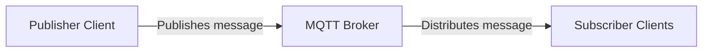

The communication is still **bidirectional** because any MQTT client can potentially publish messages, subscribe to messages, or do both.

So a device is not permanently only a publisher or only a subscriber.

For example:

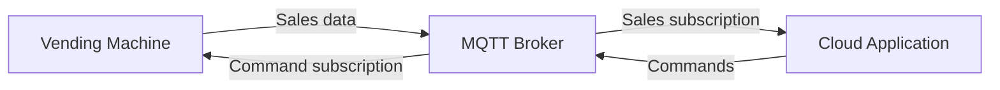

> 💡 **Real-World Example**
> 
> A vending machine can publish:
> 
> ```
> product_sold = A12
> ```
> 
> The cloud application can receive that message.
> 
> Later, the cloud application can publish:
> 
> ```
> restart_machine
> ```
> 
> and the vending machine can receive it.
> 
> Both are MQTT clients. Their role depends on what they are doing with a particular message.

---

# 🧩 The MQTT Broker

The **MQTT broker** sits between publishers and subscribers.

A publisher sends messages to the broker.

Subscribers receive messages from the broker.

The publisher does not need to communicate directly with every subscriber.

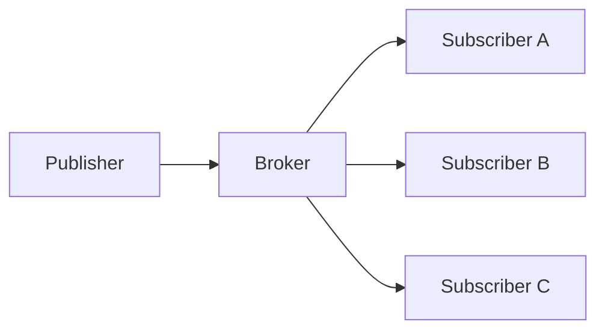

This is an important architectural idea because it separates the sender from the receivers.

Instead of:

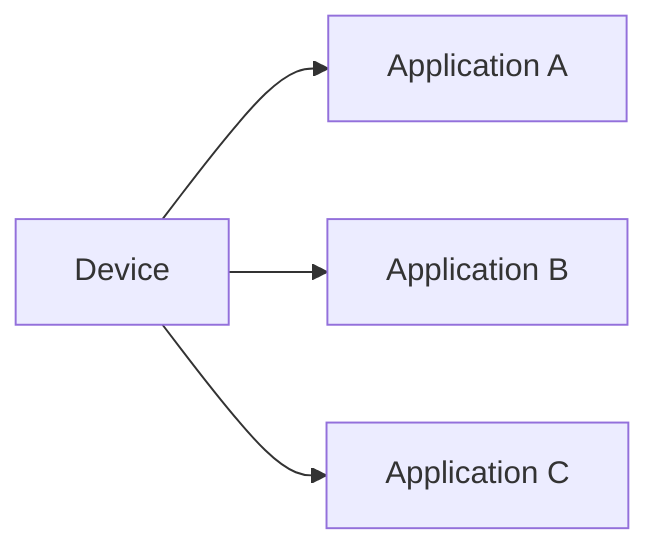

the device only communicates with the broker:

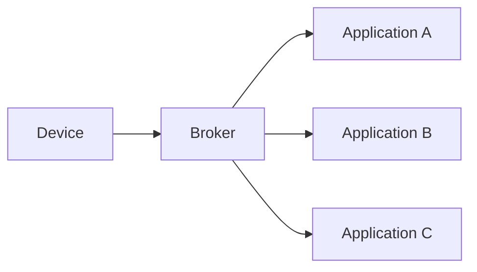

This separation is called **decoupling**.

---

# 🔗 Decoupling in Pub/Sub

One of the biggest advantages of the Pub/Sub model is that publishers and subscribers do not need to be tightly connected to each other.

This can happen in several ways:

```
Space Decoupling
Time Decoupling
Synchronization Decoupling
```

---

# 📍 Space Decoupling

**Space decoupling** means the publisher and subscribers do not need direct knowledge of each other's location.

They do not need to be:

- on the same machine
- on the same LAN
- in the same physical room
- in the same country
- in the same timezone

They communicate through the broker.

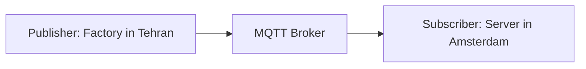

The publisher does not need to know the subscriber's exact address.

The subscriber does not need to connect directly to the publisher either.

Both only need access to the MQTT broker.

> 💡 **Real-World Example**
> 
> Imagine a vending machine deployed in another city.
> 
> ```mermaid
> flowchart LR
>     N0["Vending Machine: Mashhad"]
>     N1["MQTT Broker"]
>     N2["Monitoring Server: Tehran"]
>     N0 --> N1
>     N1 --> N2
> ```
> 
> The vending machine does not need to know where the monitoring server physically exists.
> 
> The broker connects the communication path between them.

This makes distributed IoT systems much easier to design.

---

# ⏳ Time Decoupling

**Time decoupling** means a publisher and subscriber do not necessarily need to be active at exactly the same moment.

Conceptually:

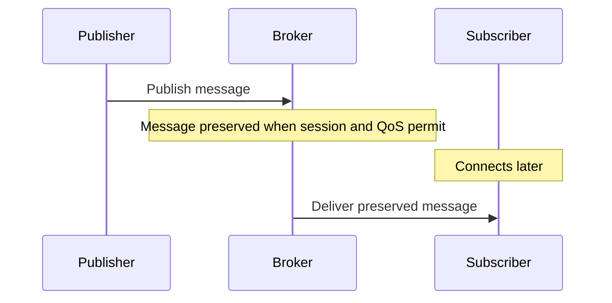

This allows communication to be less dependent on both clients being simultaneously online.

> 💡 **Real-World Example**
> 
> Suppose a machine sends:
> 
> ```
> fault = motor_overheat
> ```
> 
> at:
> 
> ```
> 10:15
> ```
> 
> A monitoring client is temporarily offline.
> 
> If the MQTT messaging configuration supports preserving that message for the subscriber, the subscriber can reconnect later and receive it.

This is useful in IoT because temporary disconnections are common.

For example:

```
Wi-Fi lost
Mobile network unavailable
Device rebooting
Application restarting
```

The main concept is:

> The publisher should not always depend on the subscriber being online at the exact moment the message is produced.

---

# ⚠️ Important Detail About Time Decoupling

Time decoupling does **not** mean that every MQTT message is automatically stored forever.

Whether a disconnected subscriber receives a message later depends on how the MQTT communication is configured.

For now, the important architectural idea is:

```
Publisher
does not need to wait for
Subscriber
```

MQTT provides mechanisms that can support message delivery across temporary disconnects.

The exact mechanisms can be studied later.

---

# 🔄 Synchronization Decoupling

**Synchronization decoupling** means the publisher and subscriber do not need to stop and wait for each other during communication.

Traditional synchronous communication might look like:

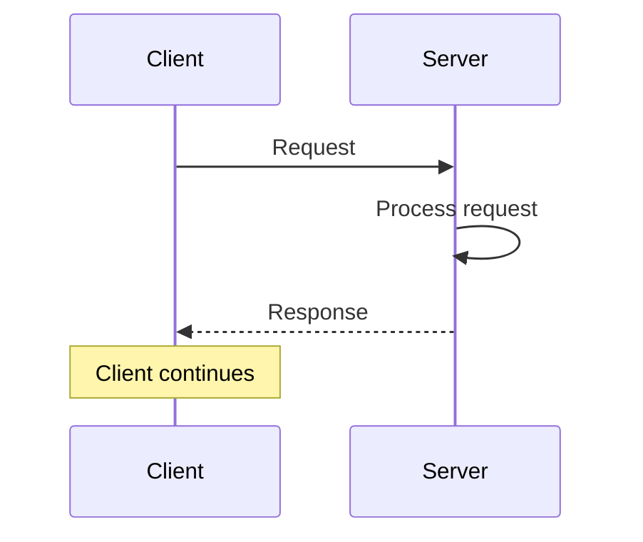

The client may need to wait for the response before continuing.

With asynchronous Pub/Sub communication:

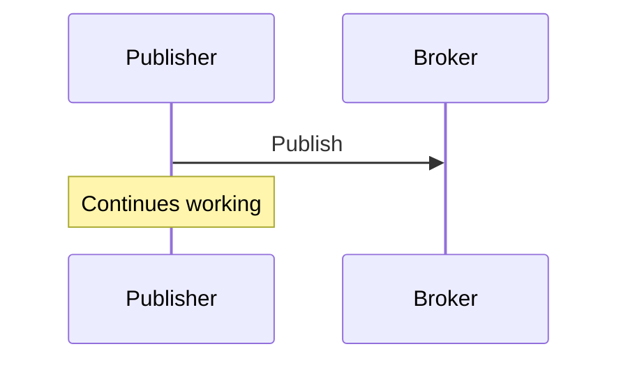

Meanwhile:

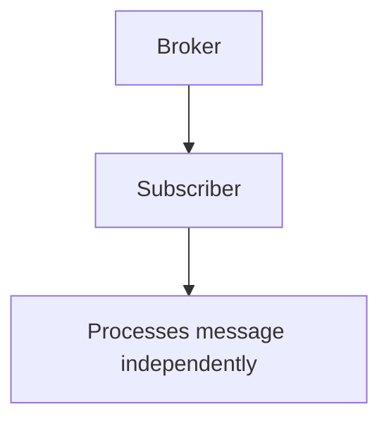

The publisher does not need to wait until the subscriber:

- receives the message
- processes it
- finishes its work
- sends an application-level response

This creates an **asynchronous communication model**.

> 💡 **Real-World Example**
> 
> Imagine a vending machine records a sale.
> 
> It publishes:
> 
> ```
> sale_id = 48125
> ```
> 
> The machine does not need to stop operating while the cloud:
> 
> ```
> updates the database
> calculates reports
> updates dashboards
> sends notifications
> ```
> 
> It can continue serving customers while other systems process the event independently.

---

# 🆚 Synchronous vs Asynchronous Communication

|Synchronous|Asynchronous|
|---|---|
|Sender often waits|Sender can continue|
|Strong timing dependency|Lower timing dependency|
|Request and response are closely connected|Processing can happen independently|
|Common in direct client/server interaction|Common in Pub/Sub systems|

Conceptually:

```
Synchronous

Client ─────request─────► Server
Client ◄────response───── Server
       waits
```

Compared with:

```
Asynchronous Pub/Sub

Publisher ──publish──► Broker
Publisher continues

Broker ──────────────► Subscriber
                       processes later
```

---

# 📈 Scalability

Pub/Sub communication can scale better than a tightly coupled direct client/server design.

Imagine one device needs to send the same information to five applications.

A direct architecture might require:

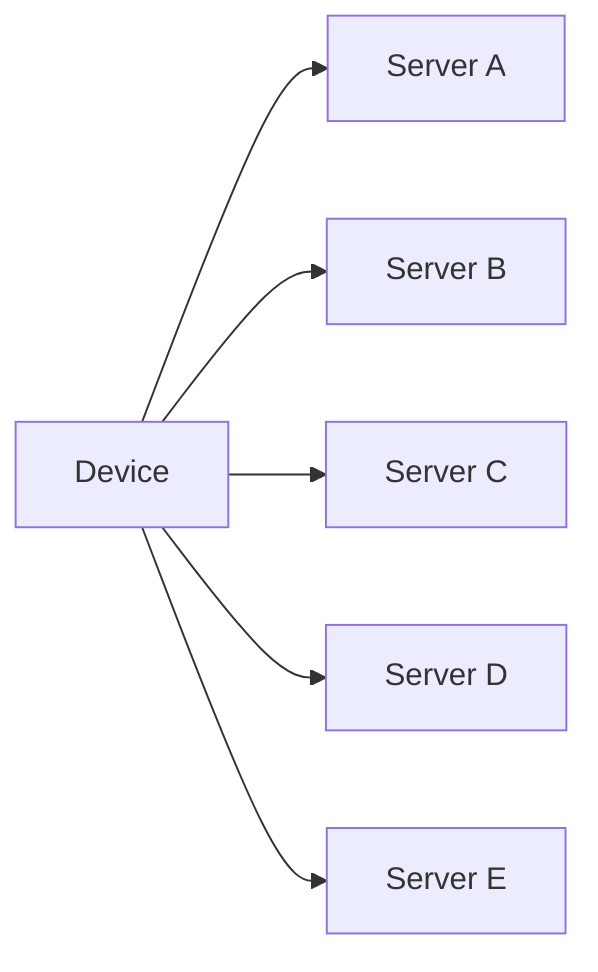

The device now has to manage many direct relationships.

With Pub/Sub:

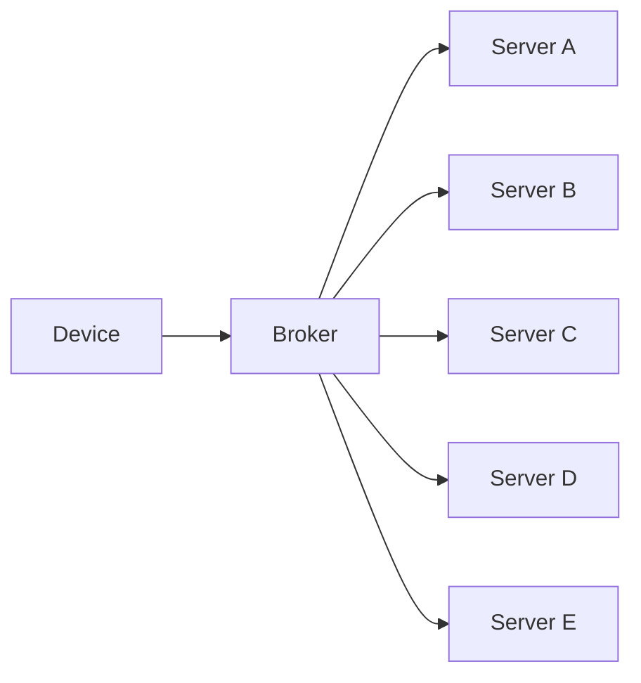

The publisher only communicates with the broker.

This reduces coupling between components.

---

## 💡 Real-World Scaling Example

Imagine:

```
100,000 IoT devices
```

and several services need their data:

```
Monitoring Service
Analytics Service
Alert Service
Database Service
Dashboard Service
```

Direct communication could create a large number of individual connections between devices and backend services.

Pub/Sub provides a cleaner architecture:

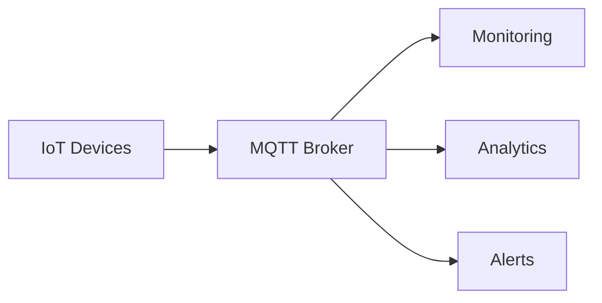

New subscribers can often be added without changing the publisher.

For example, if later you add:

```
Machine Learning Service
```

the IoT device does not necessarily need to know that it exists.

The new service can consume the relevant MQTT messages through the broker.

That is one of the major benefits of decoupled architectures.

---

# 🆚 Traditional Client/Server vs Pub/Sub

## Traditional Direct Communication

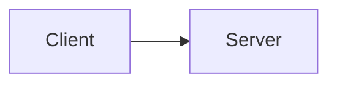

The client usually knows which server it is communicating with.

If several systems need the same data:

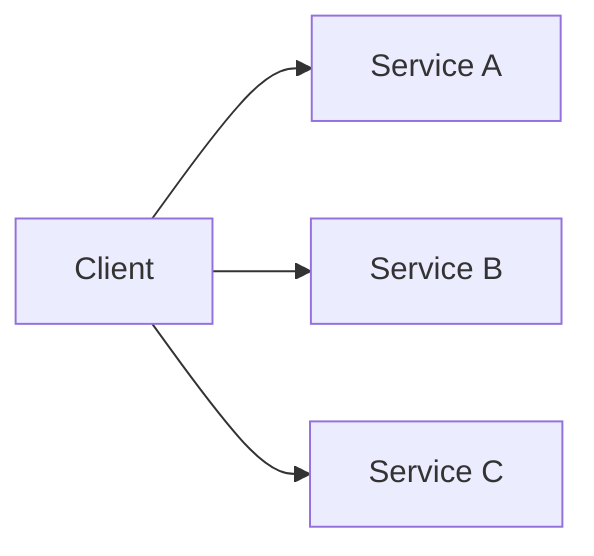

The client becomes more tightly coupled to those services.

---

## Pub/Sub Communication


The publisher mainly needs to know how to reach the broker.

It does not need a direct relationship with every consumer.

This helps systems grow without making each device aware of every backend service.

---

## 🦟 Apply Pub/Sub to Our Mosquitto Broker

In our lab, the central broker is **Mosquitto**. Start it using [[3. MQTT Client–Broker Setup and Connection Flow#🦟 Shared Mosquitto Lab|the shared setup]].

Open two subscriber terminals using the subscription command in [[4. PUB SUB UNSUB#🦟 Mosquitto Publish and Subscribe|the packet lab]]. Give them different Client IDs. Publish one temperature reading: both subscribers should print it, showing one publisher feeding independent consumers.

### 🔗 Bridging vs Clustering

Mosquitto supports **bridges** that forward selected topic traffic between brokers. A bridge does not automatically replicate every client's session or turn two broker processes into one shared session store. The clustering diagrams in this lesson describe an architectural option, not something enabled by launching two Mosquitto instances. [Mosquitto: Bridges](https://mosquitto.org/man/mosquitto-8.html)

For these exercises, use one local broker. Treat failover and shared session storage as a separate deployment design.

---

# 🖥️ Broker Clustering

The broker is a central part of MQTT communication.

With only one broker:

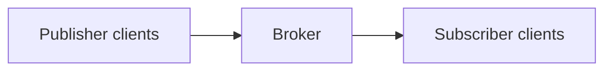

if that broker becomes unavailable, communication can be affected.

This creates a potential **single point of failure**.

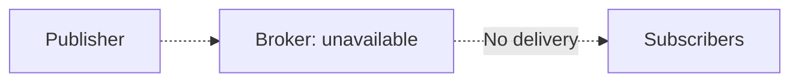

Large systems can use multiple broker servers together.

This is commonly referred to as a **broker cluster**.

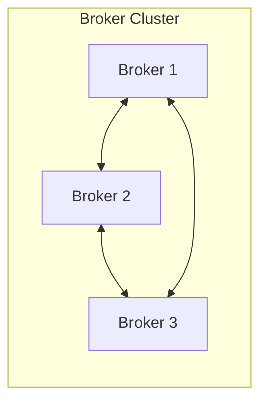

Clients interact with the MQTT infrastructure instead of depending on only one broker process.

This can improve:

```
availability
scalability
fault tolerance
```

---

## 💡 Single Broker vs Broker Cluster

### Single Broker

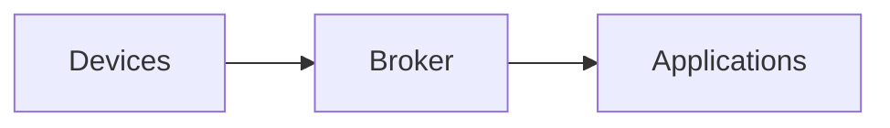

Simple, but the broker is very important.

If it fails:

```mermaid
flowchart LR
    N0["Devices"]
    N1["Broker: unavailable"]
    N2["Applications"]
    N0 -. Cannot connect .-> N1
    N1 -. No delivery .-> N2
```

communication may stop.

---

### Broker Cluster

```mermaid
flowchart LR
    D["Devices"]
    subgraph C["Broker Cluster"]
        B1["Broker 1"]
        B2["Broker 2"]
        B3["Broker 3"]
    end
    A["Applications"]
    D --> B1
    D --> B2
    D --> B3
    B1 --> A
    B2 --> A
    B3 --> A
```

If designed correctly, another broker can continue serving the system when one broker becomes unavailable.

> ⚠️ Having multiple broker servers does not automatically eliminate every failure scenario.
> 
> The cluster itself, networking, load balancers, storage, and configuration must also be designed correctly.

The important concept at this stage is:

> Multiple brokers can be used to improve scalability and reduce dependence on a single broker.

---

# 🔗 How the Concepts Connect

The complete Pub/Sub idea can be visualized like this:

```mermaid
flowchart LR
    N0["Publisher"]
    N1["MQTT Broker"]
    N2["Subscribers"]
    N0 --> N1
    N1 --> N2
    Note["Publisher and subscribers have no direct dependency"]
```

This architecture creates several forms of decoupling:

```
Space Decoupling
Publisher and subscriber do not need direct knowledge
of each other's network location.

Time Decoupling
They do not necessarily need to be online at exactly
the same moment.

Synchronization Decoupling
They do not need to wait for each other while processing.
```

These properties together help make MQTT useful for large distributed IoT systems.

---

# 🧪 Interview Q&A

**Q1:** What is the role of an MQTT broker in Pub/Sub communication?

**Q2:** Does a publisher send messages directly to every subscriber?

**Q3:** What does space decoupling mean?

**Q4:** What does time decoupling mean?

**Q5:** What does synchronization decoupling mean?

**Q6:** Why can Pub/Sub scale better than tightly coupled direct communication?

**Q7:** Why might a large MQTT deployment use a broker cluster?

**Q8:** Can the same MQTT client both publish and subscribe?

> [!answer]- 📋 Answers
> 
> **A1:** The broker sits between publishers and subscribers. Publishers send messages to it, and it distributes those messages to interested subscribers.
> 
> **A2:** No. In MQTT, the publisher normally sends the message to the broker, and the broker handles distribution.
> 
> **A3:** Publisher and subscriber do not need to know or directly connect to each other's physical or network location.
> 
> **A4:** Publisher and subscriber do not necessarily need to be active at exactly the same moment. MQTT mechanisms can support delivering messages across temporary disconnects depending on configuration.
> 
> **A5:** The publisher does not need to wait for the subscriber to receive or process the message. Their work can happen asynchronously.
> 
> **A6:** Publishers can communicate through a broker instead of maintaining direct relationships with every consumer. Additional subscribers can be added with less impact on publishers.
> 
> **A7:** Multiple brokers can improve scalability and availability and reduce dependence on a single broker.
> 
> **A8:** Yes. MQTT clients can publish, subscribe, or perform both roles.

---

# 🧠 Example: Vending Machine System

Consider this architecture:

```mermaid
flowchart LR
    N0["Vending Machine"]
    N1["MQTT Broker"]
    N2["Monitoring Service"]
    N3["Analytics Service"]
    N4["Alerts Service"]
    N0 --> N1
    N1 --> N2
    N1 --> N3
    N1 --> N4
```

The vending machine publishes:

```
sale occurred
temperature changed
door opened
machine error
```

The machine does not need to know:

```
where Monitoring Service runs
where Analytics Service runs
how Alerts Service processes messages
```

It only communicates with the MQTT broker.

If a new service is added:

```
Accounting Service
```

the architecture becomes:

```mermaid
flowchart TD
    N0["MQTT Broker"]
    N1["Monitoring"]
    N2["Analytics"]
    N3["Alerts"]
    N4["Database"]
    N5["Accounting"]
    N0 --> N1
    N0 --> N2
    N0 --> N3
    N0 --> N4
    N0 --> N5
```

The vending machine itself may require no change.

This is the practical value of Pub/Sub decoupling.

---

# 📋 Quick Reference

```mermaid
flowchart LR
    N0["Publisher"]
    N1["MQTT Broker"]
    N2["Subscriber"]
    N0 --> N1
    N1 --> N2
```

Main ideas:

```
Publisher:
sends messages

Broker:
receives and distributes messages

Subscriber:
receives interested messages
```

Three types of decoupling:

```mermaid
flowchart LR
    N0["Space Decoupling"]
    N1["No direct knowledge of client locations"]
    N2["Time Decoupling"]
    N3["Clients need not always be online together"]
    N4["Synchronization Decoupling"]
    N5["Clients need not wait for each other to process"]
    N0 --> N1
    N2 --> N3
    N4 --> N5
```

Scaling:

```mermaid
flowchart LR
    N0["Publisher"]
    N1["Broker"]
    N2["Subscriber 1"]
    N3["Subscriber 2"]
    N4["Subscriber 3"]
    N5["Subscriber N"]
    N0 --> N1
    N1 --> N2
    N1 --> N3
    N1 --> N4
    N1 --> N5
```

High availability:

```mermaid
flowchart LR
    N0["Single broker"]
    N1["Possible single point of failure"]
    N2["Broker cluster"]
    N3["Can improve availability and scalability"]
    N0 --> N1
    N2 --> N3
```

---

# 🧠 Things to Remember

- MQTT uses a **Publish/Subscribe** communication model.
- Publishers and subscribers communicate through an **MQTT broker**.
- The same client can both publish and subscribe.
- Pub/Sub reduces direct dependencies between components.
- **Space decoupling** separates clients by location.
- **Time decoupling** reduces the requirement for clients to be active simultaneously.
- **Synchronization decoupling** allows asynchronous processing.
- Pub/Sub can make distributed systems easier to scale.
- Large MQTT systems can use broker clusters for scalability and availability.
- A broker cluster can reduce dependence on one broker, but the overall infrastructure must still be designed for fault tolerance.

# 🔗 Related Topics

[[MQTT]]

[[Publish Subscribe]]

[[MQTT Broker]]

[[Asynchronous Communication]]

[[Distributed Systems]]

[[Scalability]]

[[High Availability]]
