[[Brokers/MQTT/HiveMQ 3.1.1/0. MQTT Table of Contents|📚 MQTT Table of Contents]]


> [!toc]- 📑 Contents
>
> - [[#🌐 Main Components|🌐 Main Components]]
> - [[#🧩 MQTT Client Libraries|🧩 MQTT Client Libraries]]
> - [[#🖥️ MQTT Clients|🖥️ MQTT Clients]]
> - [[#🖥️ MQTT Broker|🖥️ MQTT Broker]]
> - [[#🦟 Shared Mosquitto Lab|🦟 Shared Mosquitto Lab]]
> - [[#🔌 MQTT Connection Flow|🔌 MQTT Connection Flow]]
> - [[#1. Establish the TCP Connection|1. Establish the TCP Connection]]
> - [[#🔐 Optional TLS Security|🔐 Optional TLS Security]]
> - [[#2. Client Sends the CONNECT Packet|2. Client Sends the CONNECT Packet]]
> - [[#📦 CONNECT Properties|📦 CONNECT Properties]]
> - [[#🆔 Client ID|🆔 Client ID]]
> - [[#🔑 Username and Password|🔑 Username and Password]]
> - [[#🛡️ Authentication and Permissions|🛡️ Authentication and Permissions]]
> - [[#💓 Keep Alive|💓 Keep Alive]]
> - [[#💀 Last Will|💀 Last Will]]
> - [[#📦 CONNECT Packet Overview|📦 CONNECT Packet Overview]]
> - [[#3. Broker Processes the CONNECT Packet|3. Broker Processes the CONNECT Packet]]
> - [[#4. Broker Sends CONNACK|4. Broker Sends CONNACK]]
> - [[#📦 CONNACK Properties|📦 CONNACK Properties]]
> - [[#🔄 Session Present|🔄 Session Present]]
> - [[#✅ Return Code|✅ Return Code]]
> - [[#🔄 Complete MQTT Connection Flow|🔄 Complete MQTT Connection Flow]]
> - [[#🚀 After Successful CONNACK|🚀 After Successful CONNACK]]
> - [[#🔗 Connecting This to Pub/Sub|🔗 Connecting This to Pub/Sub]]
> - [[#🧪 Interview Q&A|🧪 Interview Q&A]]
> - [[#📋 Quick Reference|📋 Quick Reference]]
> - [[#🧠 Things to Remember|🧠 Things to Remember]]
> - [[#🔗 Related Topics|🔗 Related Topics]]

## 🌐 Main Components

A basic MQTT system has two main sides:

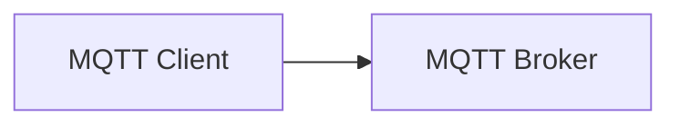

The client is the application or device that connects to the broker.

The broker is the central MQTT server that accepts client connections and handles MQTT communication.

---

# 🧩 MQTT Client Libraries

Applications usually do not implement the MQTT protocol from scratch.

Instead, they use an **MQTT client library**.

One example is:

```
Paho
```

A client library handles MQTT protocol details for your application.

Conceptually:

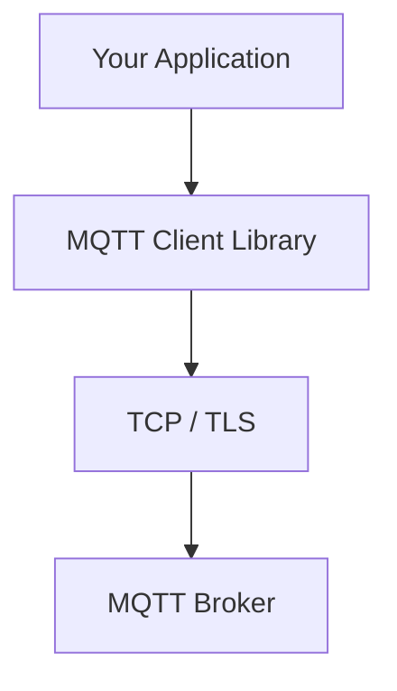

So your application can focus on tasks like:

```
connect
publish
subscribe
disconnect
```

without manually building every MQTT packet.

---

## 💡 Real-World Example

Imagine an IoT device that needs to send temperature data.

The application may use an MQTT client library like Paho:

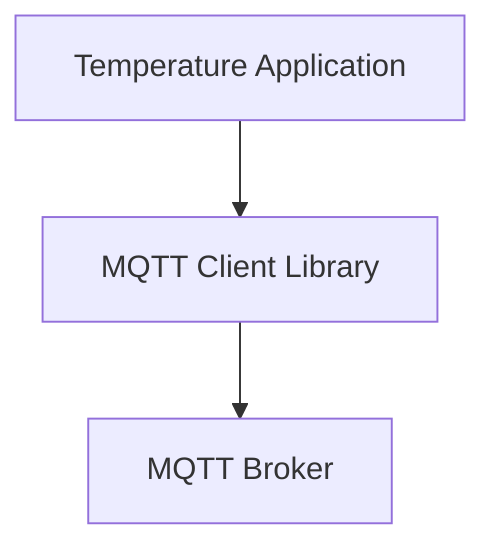

The library handles the MQTT protocol communication with the broker.

---

# 🖥️ MQTT Clients

An **MQTT client** is any application or device that connects to an MQTT broker.

A client may:

```
publish messages
subscribe to messages
or do both
```

For example:

```
ESP32
Mobile App
Backend Service
Desktop Application
IoT Gateway
```

can all act as MQTT clients.

---

# 🖥️ MQTT Broker

The **MQTT broker** accepts connections from MQTT clients.

The broker used in this course lab is:

```
Mosquitto
```

The broker handles communication between connected MQTT clients.

A basic setup looks like:

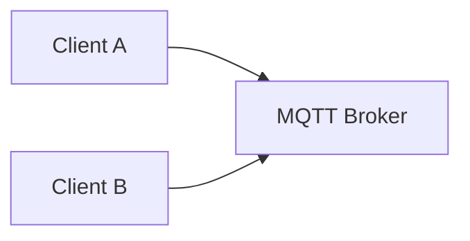

Or with multiple clients:

```
          MQTT Broker
        /      |       \
       /       |        \
      ▼        ▼         ▼
 Client A   Client B   Client C
```

---

## 🦟 Shared Mosquitto Lab

This setup is reused by lessons 4–7. It uses **Mosquitto 2.x** broker/client tools and **MQTT 3.1.1**. Install the broker and the `mosquitto_pub` / `mosquitto_sub` utilities from the [official platform instructions](https://mosquitto.org/download/) first.

Run these exercises on the same machine as the broker, as a normal user. Port `18883` keeps the lab separate from a service already using `1883`.

### 1. Create the Lab Configuration

Create a writable folder and enter it:

```bash
mkdir -p ~/mqtt-lab
cd ~/mqtt-lab
```

Save this as `mosquitto-lab.conf` inside that folder:

```conf
listener 18883 127.0.0.1
allow_anonymous true
persistence false
```

The listener accepts connections only from this computer. Anonymous access is suitable for this isolated lab; a network-facing deployment needs authentication, topic permissions, and TLS. [Mosquitto configuration](https://mosquitto.org/man/mosquitto-conf-5.html)

### 2. Start the Broker

```bash
mosquitto -c mosquitto-lab.conf -v
```

`-c` loads the named broker configuration; `-v` shows broker logs. Keep this terminal running. Stop it with **Ctrl+C** when finished. [Broker command reference](https://mosquitto.org/man/mosquitto-8.html)

### 3. Understand the Client Commands

General forms:

```bash
mosquitto_sub -h HOST -p PORT -V mqttv311 -t 'FILTER' -q QOS
mosquitto_pub -h HOST -p PORT -V mqttv311 -t 'TOPIC' -q QOS -m 'PAYLOAD'
```

| Flag | Meaning |
|---|---|
| `-h`, `-p` | Broker host and port |
| `-V mqttv311` | Use MQTT 3.1.1 |
| `-t` | Subscription filter or publish topic |
| `-q` | Requested subscription QoS or publication QoS |
| `-i` | Client ID |
| `-m` | Message payload for the publisher |
| `-v` on `mosquitto_sub` | Print topic and payload |
| `-d` | Show client protocol debug output |
| `-c` on a client | Disable Clean Session; preserve its broker session |

The broker's `-c FILE` and the client's `-c` have different meanings. [Subscriber options](https://mosquitto.org/man/mosquitto_sub-1.html), [publisher options](https://mosquitto.org/man/mosquitto_pub-1.html).

The following labs assume no personal Mosquitto client configuration overrides these options. If connection behavior is unexpected, inspect client defaults and the broker terminal. `Connection refused` usually means the broker is not listening on the specified address/port; an MQTT authorization rejection means the connection reached a broker but its access policy rejected it.

---

# 🔌 MQTT Connection Flow

Before an MQTT client can publish or subscribe, it first has to establish a connection with the broker.

The flow is:

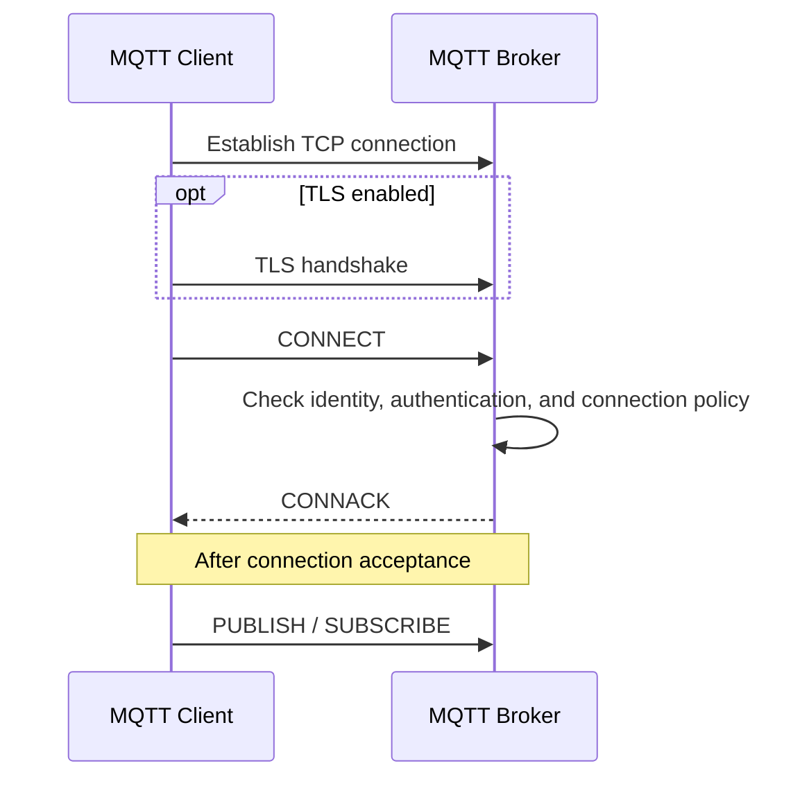

Let's break this down.

---

# 1. Establish the TCP Connection

MQTT runs on top of TCP.

So the first step is:

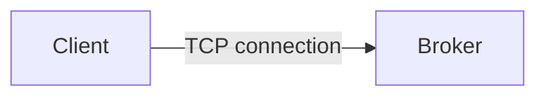

The MQTT protocol cannot begin until this TCP connection exists.

The stack looks like:

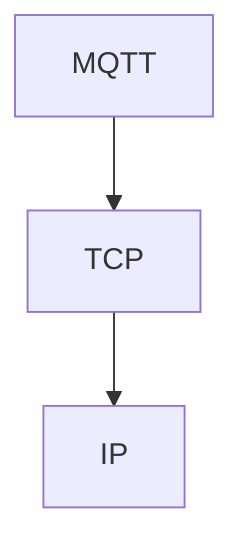

---

# 🔐 Optional TLS Security

TLS can be added to secure the connection.

Then the stack becomes:

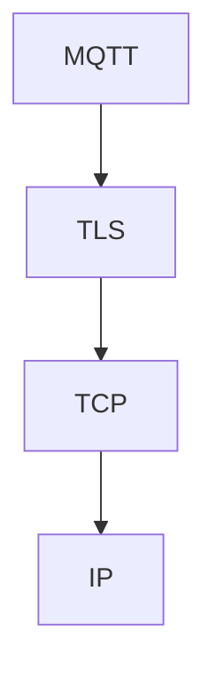

The connection flow becomes:


> 💡 TLS protects the communication channel between the MQTT client and broker.

---

# 2. Client Sends the CONNECT Packet

After the underlying connection is established, the client sends an MQTT:

```
CONNECT
```

packet.

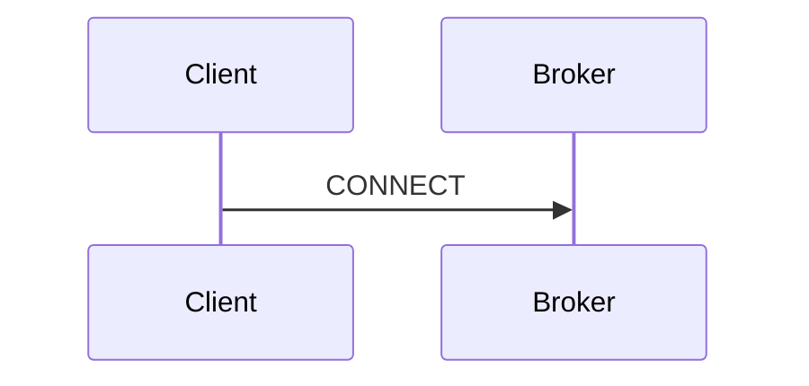

The CONNECT packet contains information the broker needs to establish the MQTT connection.

---

# 📦 CONNECT Properties

Important connection information includes:

```
clientId

username          optional
password          optional

lastWillTopic     optional
lastWillQoS       optional
lastWillMessage   optional
lastWillRetain    optional

keepAlive
```

Each field serves a different purpose.

---

# 🆔 Client ID

The `clientId` identifies the MQTT client.

For example:

```
vending-machine-001
```

or:

```
temperature-sensor-12
```

Conceptually:

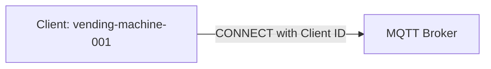

The broker uses this identity to recognize the client connection.

---

## 💡 Real-World Example

A vending machine could connect as:

```
clientId = vending-102
```

Another machine might use:

```
clientId = vending-103
```

This allows the broker to distinguish between the two clients.

---

# 🔑 Username and Password

The client can optionally provide:

```
username
password
```

These can be used for authentication.

For example:

```
username = vending102
password = ********
```

The broker can then check whether the client is allowed to connect.

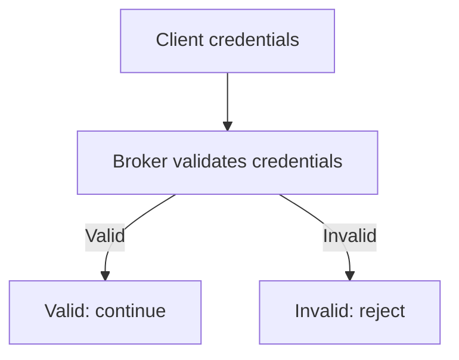

Both fields are optional depending on broker configuration.

---

# 🛡️ Authentication and Permissions

After receiving the CONNECT packet, the broker can check the client.

This can include:

```
Authentication
Permissions
```

Authentication answers:

```
Who is this client?
```

Permissions answer:

```
What is this client allowed to do?
```

For example:

```
Client: vending-102
```

might be allowed to connect and communicate only with specific MQTT resources.

At this stage, the important idea is:

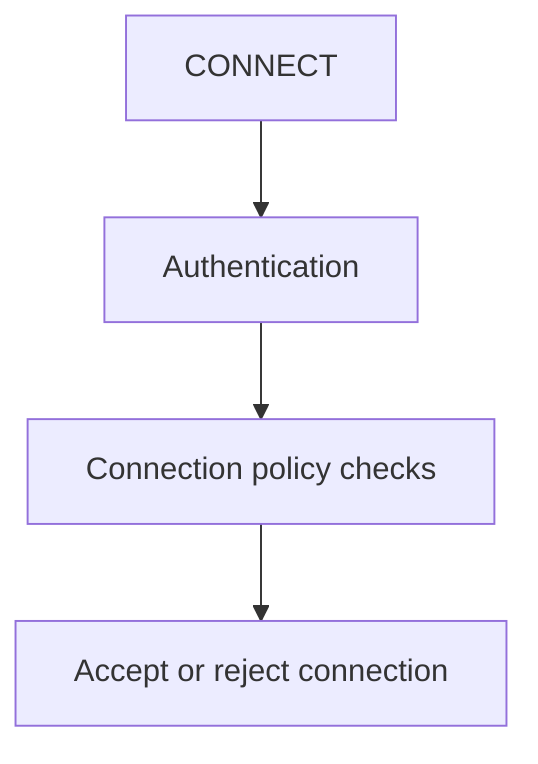

---

# 💓 Keep Alive

The CONNECT packet also contains the:

```
keepAlive
```

value.

This relates to the MQTT connection-health mechanism introduced earlier.

Its purpose is to help determine whether the connection is still alive.

Conceptually:

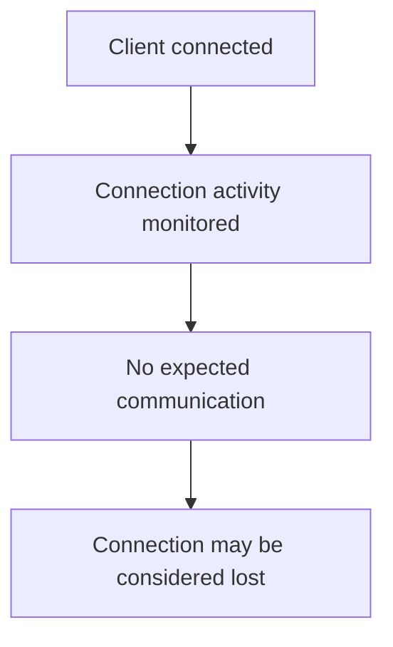

The detailed Keep Alive mechanism can be covered separately.

---

# 💀 Last Will

The CONNECT packet can also contain **Last Will** information.

These fields include:

```
lastWillTopic
lastWillQoS
lastWillMessage
lastWillRetain
```

They are optional.

The basic idea is that the client provides the broker with a message related to an unexpected client disconnection.

Conceptually:

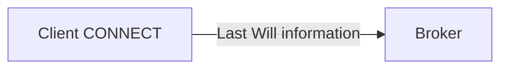

The detailed behavior of the Last Will can be studied later.

For now, the important point is:

> Last Will information is configured when the client connects.

---

# 📦 CONNECT Packet Overview

Conceptually:

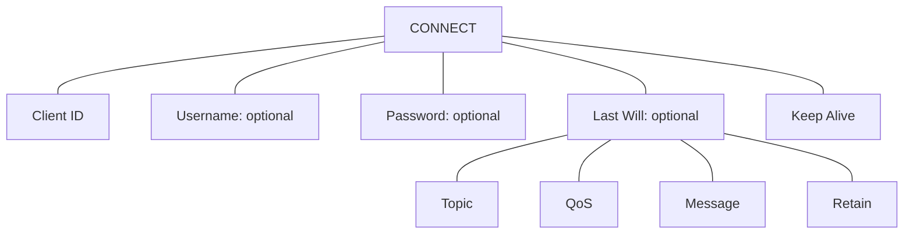

The client sends this information to the broker when starting the MQTT connection.

---

# 3. Broker Processes the CONNECT Packet

After receiving the CONNECT packet, the broker examines the connection information.

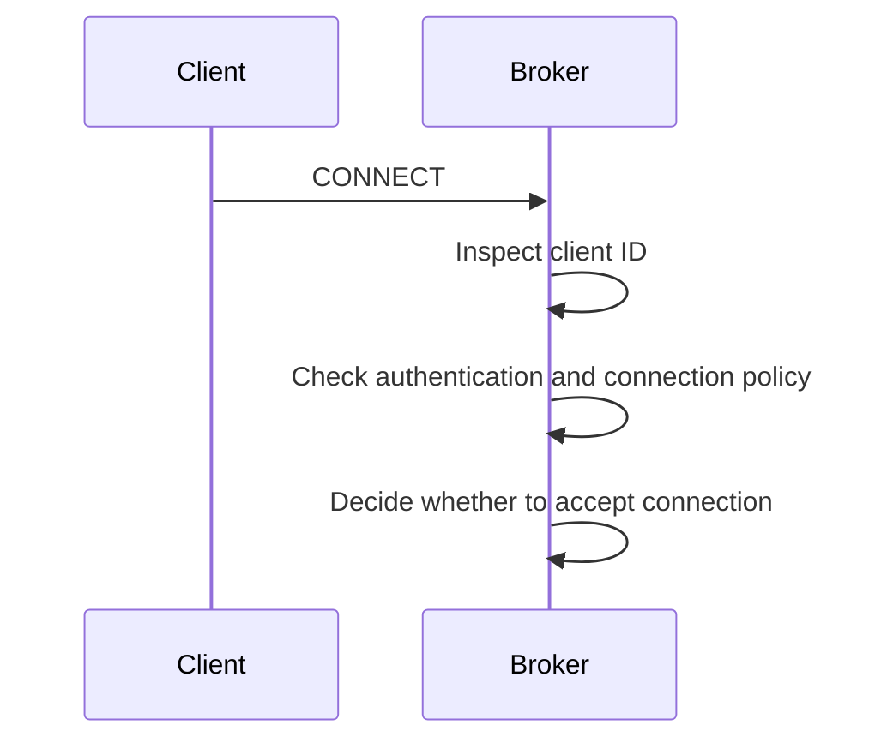

The broker then sends a response.

---

# 4. Broker Sends CONNACK

The broker responds with an MQTT:

```
CONNACK
```

packet.

CONNACK means:

```
Connection Acknowledgement
```

The flow is:

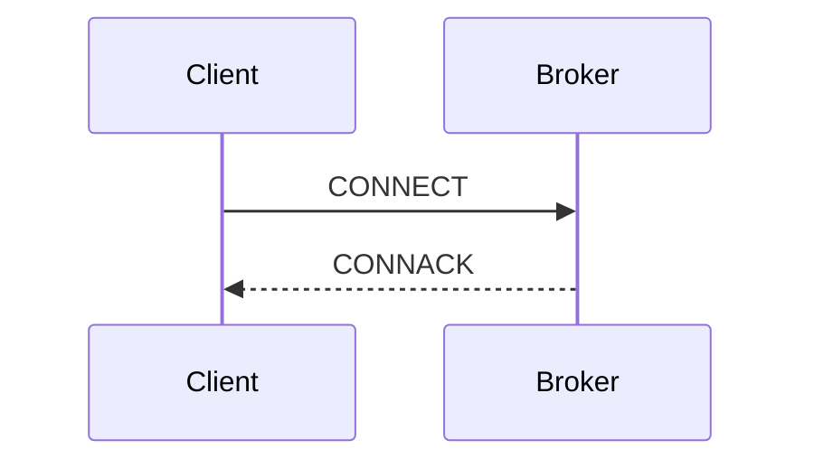

The CONNACK packet tells the client the result of the connection attempt.

---

# 📦 CONNACK Properties

Important CONNACK information includes:

```
sessionPresent
returnCode
```

---

# 🔄 Session Present

The `sessionPresent` field tells the client whether a previous MQTT session is present.

Conceptually:

```
sessionPresent = true
```

means:

```
Broker has session information for this client
```

while:

```
sessionPresent = false
```

means there is no existing session to continue.

Detailed MQTT session behavior can be covered later.

---

# ✅ Return Code

The `returnCode` tells the client whether the connection was accepted or rejected.

Conceptually:

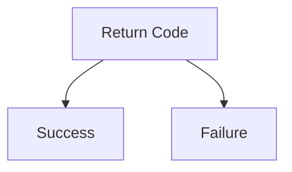

A failure could happen because of something such as authentication or authorization problems.

The basic flow is:

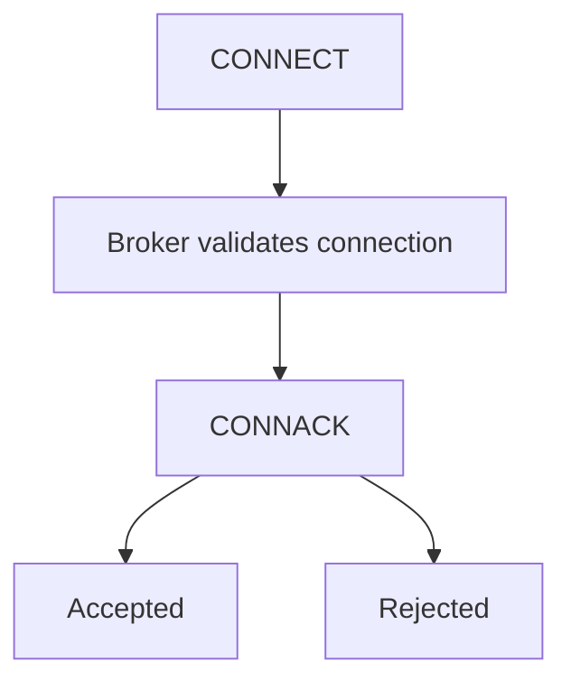

---

# 🔄 Complete MQTT Connection Flow

The whole process looks like this:

```mermaid
sequenceDiagram
    participant L as MQTT Client
    participant R as MQTT Broker
    L->>R: Establish TCP connection
    opt TLS enabled
        L->>R: TLS handshake
    end
    L->>R: CONNECT
    R->>R: Check identity, authentication, and connection policy
    R-->>L: CONNACK
    Note over L,R: After connection acceptance
    L->>R: PUBLISH / SUBSCRIBE
```

Another compact view:

```mermaid
sequenceDiagram
    participant L as MQTT Client
    participant R as MQTT Broker
    L->>R: Establish TCP connection
    opt TLS enabled
        L->>R: TLS handshake
    end
    L->>R: CONNECT
    R->>R: Check identity, authentication, and connection policy
    R-->>L: CONNACK
    Note over L,R: After connection acceptance
    L->>R: PUBLISH / SUBSCRIBE
```

---

# 🚀 After Successful CONNACK

Once the broker accepts the MQTT connection, the client can start doing MQTT work.

For example:

```
PUBLISH
SUBSCRIBE
```

So the order is important:

```mermaid
flowchart TD
    N0["TCP connection"]
    N1["Optional TLS"]
    N2["CONNECT"]
    N3["CONNACK"]
    N4["Publish / Subscribe"]
    N0 --> N1
    N1 --> N2
    N2 --> N3
    N3 --> N4
```

The client should not start normal MQTT publish/subscribe operations before the MQTT connection has been established successfully.

---

# 💡 Real-World Example

Imagine a vending machine connecting to an MQTT broker.

The client configuration might conceptually contain:

```
clientId = vending-001

username = vending001
password = ********

keepAlive = configured value
```

The connection happens like this:

```mermaid
sequenceDiagram
    participant L as Vending Machine
    participant R as MQTT Broker
    L->>R: Establish TCP connection
    opt TLS enabled
        L->>R: TLS handshake
    end
    L->>R: CONNECT (clientId = vending-001, credentials)
    R->>R: Check identity, authentication, and connection policy
    R-->>L: CONNACK
    Note over L,R: After connection acceptance
    L->>R: PUBLISH / SUBSCRIBE
```

If the connection succeeds:

```mermaid
flowchart TD
    N0["Vending Machine"]
    N1["Publish machine data"]
    N2["Subscribe for commands"]
    N0 --> N1
    N0 --> N2
```

---

# 🔗 Connecting This to Pub/Sub

The previous section introduced this architecture:

```mermaid
flowchart LR
    N0["Publisher"]
    N1["Broker"]
    N2["Subscriber"]
    N0 --> N1
    N1 --> N2
```

Now we can add the connection stage:

```mermaid
flowchart LR
    N0["Publisher Client"]
    N1["MQTT Broker"]
    N2["Subscriber Client"]
    N0 -->|CONNECT| N1
    N2 -->|CONNECT| N1
```

Before either client can participate in MQTT Pub/Sub communication, each client establishes its own MQTT connection to the broker.

Then:

```mermaid
flowchart LR
    N0["Publisher"]
    N1["Broker"]
    N2["Subscriber"]
    N0 -->|PUBLISH| N1
    N1 -->|Message| N2
```

---

# 🧪 Interview Q&A

**Q1:** What are the main software components in a basic MQTT system?

**Q2:** What does a library such as Paho provide?

**Q3:** Which connection is established before MQTT communication begins?

**Q4:** Where can TLS be used in the MQTT connection stack?

**Q5:** Which packet starts the MQTT-level connection?

**Q6:** Which packet does the broker send in response?

**Q7:** What is the purpose of the `clientId`?

**Q8:** Are username and password always required?

**Q9:** What does the broker check after receiving CONNECT?

**Q10:** When can the client start publishing or subscribing?

> [!answer]- 📋 Answers
> 
> **A1:** MQTT clients and an MQTT broker.
> 
> **A2:** It provides MQTT client functionality so applications do not have to implement the protocol manually.
> 
> **A3:** A TCP connection.
> 
> **A4:** TLS can secure the communication between MQTT and TCP.
> 
> **A5:** The client sends a CONNECT packet.
> 
> **A6:** The broker sends a CONNACK packet.
> 
> **A7:** It identifies the MQTT client to the broker.
> 
> **A8:** No. They are optional and depend on the broker configuration.
> 
> **A9:** The broker can check authentication and permissions before accepting the connection.
> 
> **A10:** After receiving a successful CONNACK from the broker.

---

# 📋 Quick Reference

Main components:

```
MQTT Client Library
Example: Paho

MQTT Client
Device or application using MQTT

MQTT Broker
Example: Mosquitto
```

Connection flow:

```mermaid
sequenceDiagram
    participant L as MQTT Client
    participant R as MQTT Broker
    L->>R: Establish TCP connection
    opt TLS enabled
        L->>R: TLS handshake
    end
    L->>R: CONNECT
    R->>R: Check identity, authentication, and connection policy
    R-->>L: CONNACK
    Note over L,R: After connection acceptance
    L->>R: PUBLISH / SUBSCRIBE
```

CONNECT information:

```
clientId

username          optional
password          optional

lastWillTopic     optional
lastWillQoS       optional
lastWillMessage   optional
lastWillRetain    optional

keepAlive
```

CONNACK information:

```
sessionPresent
returnCode
```

---

# 🧠 Things to Remember

- MQTT clients use client libraries such as **Paho** to communicate using MQTT.
- **Mosquitto** is an example of an MQTT broker.
- MQTT normally starts by establishing a **TCP connection**.
- **TLS** can protect the connection.
- The MQTT client sends a **CONNECT** packet.
- The broker can check authentication and permissions.
- The broker responds with a **CONNACK** packet.
- The CONNECT packet includes important information such as the client ID and Keep Alive value.
- Username, password, and Last Will information can be optional.
- After a successful CONNACK, the client can start publishing and subscribing.

# 🔗 Related Topics

[[MQTT]]

[[MQTT Broker]]

[[MQTT Client]]

[[Paho]]

[[Mosquitto]]

[[TCP]]

[[TLS]]

[[MQTT CONNECT]]

[[MQTT CONNACK]]

[[MQTT Keep Alive]]

[[MQTT Last Will]]
