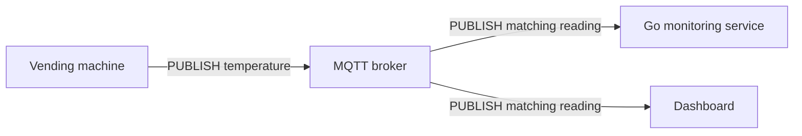
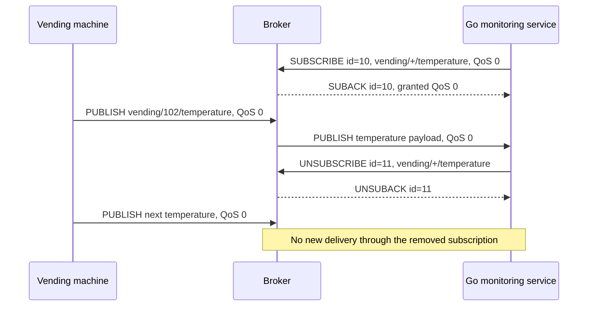

[[Brokers/MQTT/HiveMQ 3.1.1/0. MQTT Table of Contents|📚 MQTT Table of Contents]]

# 📡 MQTT PUBLISH, SUBSCRIBE, and UNSUBSCRIBE

> [!toc]- 📑 Contents
>
> - [[#🌐 Three Operations, One Broker|🌐 Three Operations, One Broker]]
> - [[#📤 PUBLISH: Send a Message|📤 PUBLISH: Send a Message]]
> - [[#📬 SUBSCRIBE: Request One or More Subscriptions|📬 SUBSCRIBE: Request One or More Subscriptions]]
> - [[#✅ SUBACK: Was Each Subscription Granted?|✅ SUBACK: Was Each Subscription Granted?]]
> - [[#🚪 UNSUBSCRIBE: Remove One or More Subscriptions|🚪 UNSUBSCRIBE: Remove One or More Subscriptions]]
> - [[#🦟 Mosquitto Publish and Subscribe|🦟 Mosquitto Publish and Subscribe]]
> - [[#🧪 Understanding Check|🧪 Understanding Check]]
> - [[#🔨 Hands-On Practice|🔨 Hands-On Practice]]
> - [[#📋 Quick Reference|📋 Quick Reference]]
> - [[#🧠 Things to Remember|🧠 Things to Remember]]
> - [[#💡 Pro Tips|💡 Pro Tips]]
> - [[#🔗 Related Topics|🔗 Related Topics]]


## 🌐 Three Operations, One Broker

After connecting to a broker, a client can **publish data**, **subscribe to data**, or **remove a subscription**. The same client can perform all three operations.

- 📤 **`PUBLISH`:** Send a message on a topic.

- 📬 **`SUBSCRIBE`:** Ask the broker to deliver messages matching one or more topic filters.

- 🚪 **`UNSUBSCRIBE`:** Remove one or more of this client's subscriptions.

This reference covers **MQTT 3.1.1**, focusing on packet fields and the publish → subscribe → unsubscribe flow.

> [!example] 💡 Vending-Machine Monitoring
>
> Machine `vending-102` publishes temperature readings on `vending/102/temperature`.
>
> A Go monitoring service subscribes to `vending/+/temperature` to receive readings from multiple machines.
>
> A dashboard can subscribe independently. The machine still sends each reading only to the broker.



The broker also uses **`PUBLISH`** to deliver messages to subscribers. `SUBSCRIBE` registers interest; it does not carry temperature readings.

Connection setup is covered in [[3. MQTT Client–Broker Setup and Connection Flow|Client–Broker Connection Flow]].

---

## 📤 PUBLISH: Send a Message

A published message needs a **topic name** for routing and a **payload** containing the application data.

```text
Topic:   vending/102/temperature
Payload: {"temperature":5.2}
QoS:     1
RETAIN:  0
DUP:     0
```

The broker matches the topic against subscriptions. It does not need to understand the JSON to route the message.

### 📦 Main Packet Fields

| Field | Purpose |
|---|---|
| **Topic Name** | The concrete destination topic, such as `vending/102/temperature`. |
| **Payload** | Application bytes: JSON, text, binary, or another encoding. |
| **QoS** | Delivery level for this particular sender-to-receiver hop. |
| **RETAIN** | Requests retained state when publishing to the broker. |
| **DUP** | Indicates that this PUBLISH may be a retransmission. |
| **Packet Identifier** | Correlates a QoS 1 or 2 exchange with its acknowledgements; absent at QoS 0. |

These fields occupy different parts of an MQTT 3.1.1 packet:

```text
PUBLISH
├── Fixed header
│   ├── Packet type and Remaining Length
│   └── DUP, QoS, RETAIN
├── Variable header
│   ├── Topic Name
│   └── Packet Identifier — only at QoS 1 or 2
└── Payload — application data
```

Publish to a **concrete topic**. Wildcards such as `+` and `#` belong in subscription filters, not PUBLISH topic names. [OASIS: PUBLISH](https://docs.oasis-open.org/mqtt/mqtt/v3.1.1/os/mqtt-v3.1.1-os.html)

### ✅ QoS and Acknowledgements

| QoS | Delivery meaning | Packet exchange on one hop |
|---|---|---|
| `0` | At most once; a message can be lost. | `PUBLISH` only |
| `1` | At least once; duplicates are possible. | `PUBLISH → PUBACK` |
| `2` | Exactly once at the MQTT delivery level. | `PUBLISH → PUBREC → PUBREL → PUBCOMP` |

Each hop has its own exchange:

```text
Machine ── PUBLISH ──► Broker ── PUBLISH ──► Monitoring service
Machine ◄─ PUBACK ─── Broker ◄─ PUBACK ──── Monitoring service
          Hop 1                 Hop 2
```

The machine's `PUBACK` does **not** prove the monitoring service updated its database. Business completion needs an application-level response if the sender must know it happened.

A **Packet Identifier** tracks an outstanding exchange; it is reused after completion. It is different from the Client ID, which identifies the client/session, and from a permanent application event ID.

### 💾 RETAIN and DUP

- **`RETAIN = 1`:** Use for the latest state on a topic.

    - A later subscriber can receive the latest retained temperature without waiting for the next reading.

    - Retained state is not a history of all readings. Publishing a retained message with an empty payload clears that topic's retained message.

- **`DUP = 1`:** This packet may be a retransmission.

    - It does not prove the receiver already saw the earlier attempt.

    - `DUP = 0` does not prove that the application data is unique. At QoS 0, DUP must be `0`.

In MQTT 3.1.1, a retained message delivered because of a new subscription has `RETAIN = 1`; ordinary delivery to an established subscription has `RETAIN = 0`. [OASIS: PUBLISH Flags](https://docs.oasis-open.org/mqtt/mqtt/v3.1.1/os/mqtt-v3.1.1-os.html)

---

## 📬 SUBSCRIBE: Request One or More Subscriptions

`SUBSCRIBE` contains a **Packet Identifier** and one or more **Topic Filter / Requested QoS pairs**. Requested QoS is the maximum delivery level the client asks for on that subscription.

```text
SUBSCRIBE
  Packet Identifier: 10

  1. Filter: vending/+/temperature   Requested QoS: 1
  2. Filter: vending/+/status        Requested QoS: 2
```

Here, `+` matches one topic level. The first filter matches both `vending/102/temperature` and `vending/103/temperature`.

---

## ✅ SUBACK: Was Each Subscription Granted?

The broker evaluates each requested subscription, including its topic permissions and supported QoS. A successful connection does not automatically authorize access to every topic.

The broker answers with **`SUBACK`**, meaning subscription acknowledgement. It returns the **same Packet Identifier** and **one result per filter, in the same order**.

```text
SUBACK
  Packet Identifier: 10
  Return codes: [0x01, 0x80]

  First filter:  accepted, maximum QoS 1
  Second filter: rejected
```

The service can receive temperature readings through the first filter, but this request did not establish the status subscription.

| MQTT 3.1.1 return code | Meaning |
|---|---|
| `0x00` | Accepted, maximum QoS 0 |
| `0x01` | Accepted, maximum QoS 1 |
| `0x02` | Accepted, maximum QoS 2 |
| `0x80` | Subscription failed |

A broker can reject a subscription because of topic authorization or another policy/implementation restriction. MQTT 3.1.1 reports `0x80` without specifying the exact reason; check broker logs or configuration to diagnose it.

A successful result can also grant a lower maximum QoS than requested. For example, requesting QoS 2 and receiving `0x01` means the subscription succeeded with maximum QoS 1. [OASIS: SUBSCRIBE and SUBACK](https://docs.oasis-open.org/mqtt/mqtt/v3.1.1/os/mqtt-v3.1.1-os.html)

### 🔀 Published QoS vs Granted Subscription QoS

For a single matching subscription, the outgoing QoS cannot exceed either the incoming publication QoS or the granted subscription maximum.

For the usual delivery at the highest permitted level:

```text
Published QoS:       2
Granted maximum:    1
Outgoing QoS:       min(2, 1) = 1
```

First, the incoming message permits QoS 2. Then, the subscription caps delivery at QoS 1. The broker forwards at QoS 1 in this example; it may also use a lower level.

Subscribing at QoS 2 cannot upgrade a QoS 0 publication. [OASIS: Subscription Response Rules](https://docs.oasis-open.org/mqtt/mqtt/v3.1.1/os/mqtt-v3.1.1-os.html)

---

## 🚪 UNSUBSCRIBE: Remove One or More Subscriptions

`UNSUBSCRIBE` contains a **Packet Identifier** and one or more **topic filters**, without requested QoS values. The broker acknowledges it with `UNSUBACK` using the same identifier.

```text
UNSUBSCRIBE
  Packet Identifier: 11
  Filters:
    vending/+/temperature
    vending/+/status

UNSUBACK
  Packet Identifier: 11
```

This single request asks to remove both filters. The broker returns one `UNSUBACK` for the request, using identifier `11`; MQTT 3.1.1 does not return a separate result for each filter.

Each filter must match the stored subscription **exactly**. If you subscribed to `vending/+/temperature`, unsubscribing from `vending/102/temperature` does not remove that wildcard subscription.

Removing a subscription:

- Stops new messages being added for delivery through that subscription.

- Keeps the MQTT connection open and leaves other subscriptions intact.

- Does not delete retained data or affect other clients.

Messages already in flight or buffered may still arrive. Another remaining filter, such as `vending/#`, can also keep temperature messages flowing.

In MQTT 3.1.1, `UNSUBACK` has no per-filter result codes and is sent even when no subscription matched. [OASIS: Unsubscribe Rules](https://docs.oasis-open.org/mqtt/mqtt/v3.1.1/os/mqtt-v3.1.1-os.html)

### 📊 Complete Flow

Both clients below already have accepted MQTT connections. QoS 0 keeps the diagram focused on subscription operations.



---

## 🦟 Mosquitto Publish and Subscribe

**Prerequisite:** Start [[3. MQTT Client–Broker Setup and Connection Flow#🦟 Shared Mosquitto Lab|the shared local broker]]. Run the subscriber first in another terminal:

```bash
mosquitto_sub -h 127.0.0.1 -p 18883 -V mqttv311 -i labPacketSub -t 'vending/+/temperature' -q 1 -v -d
```

Wait for SUBACK, then publish from a third terminal:

```bash
mosquitto_pub -h 127.0.0.1 -p 18883 -V mqttv311 -t 'vending/102/temperature' -q 1 -m '{"temperature":5.2}' -d
```

✅ The subscriber prints `vending/102/temperature {"temperature":5.2}`. Debug output exposes SUBSCRIBE/SUBACK and the QoS 1 PUBLISH/PUBACK exchanges. Stop the subscriber with Ctrl+C.

### 🚪 Observe UNSUBSCRIBE

Run the subscription command again with **`-c` added**, keeping Client ID `labPacketSub`. After SUBACK, stop it with Ctrl+C, then run:

```bash
mosquitto_sub -h 127.0.0.1 -p 18883 -V mqttv311 -i labPacketSub -c -U 'vending/+/temperature' -d
```

`-U` removes that exact stored filter. Observe UNSUBACK and stop the client with Ctrl+C. Run the original subscription command without `-c` once more, then stop it, to clear the persistent test session. [Mosquitto unsubscribe option](https://mosquitto.org/man/mosquitto_sub-1.html)

---

## 🧪 Understanding Check

**Q1:** Which packet actually delivers a temperature reading to a subscriber?

**Q2:** You request two subscriptions and receive `[0x01, 0x80]`. What happened?

**Q3:** Can you tell from MQTT 3.1.1 SUBACK whether a failed subscription was denied by permissions?

**Q4:** Why might temperature readings continue after you unsubscribe?

**Q5:** What does UNSUBACK contain when one request removes two filters?

> [!answer]- 📋 Answers
>
> **A1:** PUBLISH, sent by the broker. SUBSCRIBE registers the filter; SUBACK reports the registration result.
>
> **A2:** The first filter succeeded with maximum QoS 1. The second failed; results correspond to filters in request order.
>
> **A3:** No. `0x80` means failure but gives no precise cause. Inspect broker logs and topic authorization rules.
>
> **A4:** Another matching subscription may remain, the wrong filter may have been removed, or already buffered/in-flight messages may still arrive.
>
> **A5:** In MQTT 3.1.1, it contains the matching Packet Identifier and no per-filter result codes. One acknowledgement covers the request, even if a supplied filter did not exist.

---

## 🔨 Hands-On Practice

### 🔎 Trace a Subscription

1. Write two filters in a SUBSCRIBE request: `vending/+/temperature` and `vending/+/status`.

2. Assign both requested QoS 1 and interpret SUBACK results `[0x00, 0x80]`.

3. Decide whether a new publication on each of these topics would match an accepted subscription:

    - `vending/102/temperature`

    - `vending/103/temperature`

    - `vending/102/status`

✅ Both temperature topics match the accepted first filter. Status does not have an accepted subscription from this request. Temperature delivery is capped at QoS 0.

### 🚪 Test Exact Filter Removal

1. Assume your client has both `vending/+/temperature` and `vending/#` subscriptions.

2. Remove only `vending/+/temperature`.

3. Trace a new publication on `vending/102/temperature`.

✅ It still matches `vending/#`. Remove that second filter too if you want to stop future matching deliveries. These exercises need no broker or real device.

---

### 📋 Quick Reference

| Packet | Direction | Main information |
|---|---|---|
| `PUBLISH` | Client → broker or broker → client | Topic, payload, QoS, RETAIN, DUP; identifier at QoS 1/2 |
| `SUBSCRIBE` | Client → broker | Identifier + filter/requested QoS pairs |
| `SUBACK` | Broker → client | Matching identifier + ordered per-filter results |
| `UNSUBSCRIBE` | Client → broker | Identifier + exact filters to remove |
| `UNSUBACK` | Broker → client | Matching identifier; no per-filter result codes |

### 🧠 Things to Remember

- A subscription filter selects messages; the PUBLISH topic names the actual channel.

- QoS applies separately on each delivery hop.

- RETAIN provides latest state, not event history.

- Unsubscribing removes a filter, not the connection.

### 💡 Pro Tips

- **Inspect every SUBACK result.** A multi-filter request can partially succeed.

- **Track the exact filters you register.** This makes unsubscribe behavior predictable.

- **Check broker authorization rules when a subscription fails.** A working connection only confirms permission to connect.

- **Keep requested and granted QoS separate.** SUBACK tells you what the broker actually accepted.

### 🔗 Related Topics

- [[2. PUB SUB|Publish/Subscribe Architecture]]

- [[3. MQTT Client–Broker Setup and Connection Flow|MQTT Connection Flow]]

- [[Brokers/MQTT/basics|Topics, QoS, and Retained Messages]]

- [[1. MQTT Fundamentals  Introduction|MQTT Fundamentals]]
