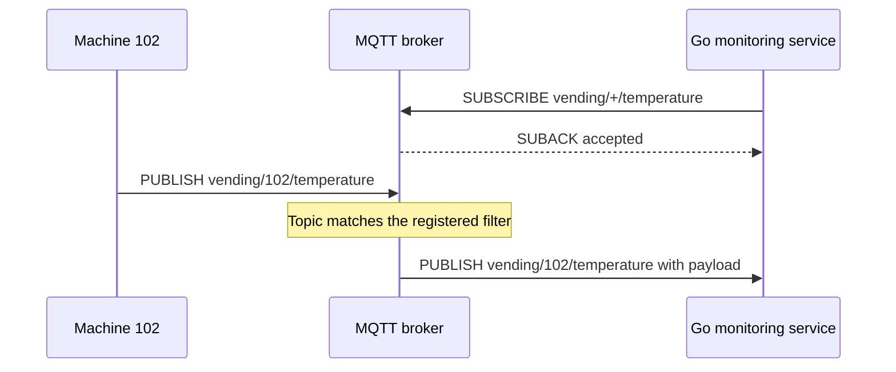

[[Brokers/MQTT/HiveMQ 3.1.1/0. MQTT Table of Contents|📚 MQTT Table of Contents]]

# 📡 MQTT Topics and Subscription Filters

> [!toc]- 📑 Contents
>
> - [[#🌐 Topics Tell the Broker Where a Message Belongs|🌐 Topics Tell the Broker Where a Message Belongs]]
> - [[#🌳 Topic Levels Create a Hierarchy|🌳 Topic Levels Create a Hierarchy]]
> - [[#📬 Wildcards: Subscribe to Groups of Topics|📬 Wildcards: Subscribe to Groups of Topics]]
> - [[#🛠️ Design Topics That Stay Easy to Use|🛠️ Design Topics That Stay Easy to Use]]
> - [[#🦟 Test Topic Matching with Mosquitto|🦟 Test Topic Matching with Mosquitto]]
> - [[#🧪 Understanding Check|🧪 Understanding Check]]
> - [[#🔨 Hands-On Practice|🔨 Hands-On Practice]]
> - [[#📋 Quick Reference|📋 Quick Reference]]
> - [[#🧠 Things to Remember|🧠 Things to Remember]]
> - [[#💡 Pro Tips|💡 Pro Tips]]
> - [[#🔗 Related Topics|🔗 Related Topics]]


## 🌐 Topics Tell the Broker Where a Message Belongs

A **topic name** is a UTF-8 string attached to a published message. The broker compares it with clients' **subscription filters** to decide who should receive that message.

The topic describes the channel; the payload contains the data. These examples use **MQTT 3.1.1**.

> [!example] 💡 Monitoring Vending Machines
>
> Machine `vending-102` publishes:
>
> - **Topic:** `vending/102/temperature`
>
> - **Payload:** `{"temperature":5.2}`
>
> A Go monitoring service subscribes to `vending/+/temperature`, receiving temperature readings from multiple machines.



The subscriber receives the **actual topic name**, so it can distinguish machine `102` from machine `103`. The wildcard belongs to the subscription, not the delivered topic.

| Topic name | Subscription filter |
|---|---|
| Used in `PUBLISH` | Used in `SUBSCRIBE` |
| Identifies one concrete channel | Selects one topic or a group of topics |
| Cannot contain `+` or `#` | May contain valid wildcards |
| `vending/102/temperature` | `vending/+/temperature` |

A filter without wildcards selects the exact topic. Packet exchanges are covered in [[4. PUB SUB UNSUB|PUBLISH, SUBSCRIBE, and UNSUBSCRIBE]].

---

## 🌳 Topic Levels Create a Hierarchy

A forward slash `/` separates **topic levels**. Choose levels that describe the device and the kind of information being exchanged.

```text
vending / 102 / temperature
   │       │        │
 category device  measurement

vending
├── 102
│   ├── temperature
│   ├── status
│   └── commands
└── 103
    ├── temperature
    ├── status
    └── commands
```

This is a naming hierarchy, not a filesystem. MQTT requires no separate topic-creation operation: a client can publish or subscribe to a new topic immediately, subject to broker permissions and limits.

Subscribing before the first publication is valid. Subscribing does not automatically provide earlier messages; retained messages and persistent sessions are separate mechanisms.

Topics are **case-sensitive** and matched without path normalization:

```text
vending/102/temperature
vending/102/Temperature
/vending/102/temperature
vending/102/temperature/
```

These are four distinct topic names. A leading or trailing slash changes the topic rather than being ignored.

---

## 📬 Wildcards: Subscribe to Groups of Topics

Wildcards let a service register a few filters instead of subscribing separately to every device. They match **levels**, not arbitrary substrings.

### ➕ `+`: Exactly One Level

`+` replaces one complete topic level.

```text
Filter: vending/+/temperature

Matches:
  vending/102/temperature
  vending/103/temperature

Does not match:
  vending/102/status
  vending/102/sensors/temperature
```

The second non-match has an extra level. After `+` consumes `102`, the filter expects `temperature`, but the topic has `sensors` next.

- **Valid:** `vending/+/temperature`, `+/102/+`

- **Invalid:** `vending/10+/temperature`

    - `+` must occupy the whole level; it cannot mean “IDs beginning with 10.”

Use this filter when the monitoring service needs the same measurement from every machine.

### 🔢 `#`: The Parent and All Descendant Levels

`#` matches **zero or more remaining levels**. It must be the final character and either stand alone or follow `/`.

```text
Filter: vending/102/#

Matches:
  vending/102
  vending/102/temperature
  vending/102/status
  vending/102/sensors/temperature
```

The parent topic `vending/102` matches too. No child level needs to exist in the published topic.

- **Valid:** `vending/#`, `vending/+/#`, `#`

- **Invalid:** `vending/#/temperature`, `vending/102#`

    - Nothing may follow `#`, and it cannot be appended to a partial level.

Use `vending/102/#` when a diagnostic client needs all message types for machine `102`.

| Filter | What it selects |
|---|---|
| `vending/102/temperature` | One machine's temperature |
| `vending/+/temperature` | Temperature from any machine at that level |
| `vending/102/+` | Exactly one child level under machine 102 |
| `vending/102/#` | Machine 102's parent topic and all descendants |
| `vending/+/#` | Any machine level and its descendants |

`+` keeps the structure precise; `#` includes different depths. Choose the narrowest filter that covers the data your service needs. [OASIS: Topic Wildcards, Ch.4.7.1](https://docs.oasis-open.org/mqtt/mqtt/v3.1.1/os/mqtt-v3.1.1-os.html)

### 🔎 Two Matching Details

**Empty levels count.** Consecutive slashes create an empty level, so `vending//temperature` matches `vending/+/temperature`. Avoid accidental empty levels in your naming convention.

**Root wildcards exclude topics beginning with `$`.** `#` does not match `$SYS/...`; subscribe explicitly to `$SYS/#` if the broker exposes system information there and permits access. The actual system topics depend on the broker. [OASIS: Topics Beginning with `$`, Ch.4.7.2](https://docs.oasis-open.org/mqtt/mqtt/v3.1.1/os/mqtt-v3.1.1-os.html)

---

## 🛠️ Design Topics That Stay Easy to Use

### ✅ Protocol Rules vs Naming Conventions

| MQTT 3.1.1 rule | Practical convention |
|---|---|
| Names and filters must be nonempty UTF-8 strings. | Use short, readable names. |
| Encoded length cannot exceed 65,535 bytes. | Stay far below the limit to reduce overhead. |
| Matching is case-sensitive. | Choose consistent lowercase spelling. |
| Spaces and leading/trailing slashes are valid. | Avoid spaces and unnecessary slashes. |
| Unicode is supported, subject to MQTT UTF-8 restrictions; null is forbidden. | Prefer printable ASCII for simpler tooling and fewer typing mistakes. |

The limit is measured in **UTF-8 bytes**, not simply characters. ASCII characters use one byte each; other characters may use more.

For `vending/102/temperature`:

```text
vending      =  7 bytes
/            =  1 byte
102          =  3 bytes
/            =  1 byte
temperature  = 11 bytes
Total        = 23 bytes
```

This counts the string content, excluding its packet length field and other headers. [OASIS: Topic Usage Rules, Ch.4.7.3](https://docs.oasis-open.org/mqtt/mqtt/v3.1.1/os/mqtt-v3.1.1-os.html)

### 🆔 Include a Stable Device Identifier

Use a predictable pattern:

```text
vending/{device-id}/{message-type}

vending/102/temperature
vending/102/status
vending/102/commands
```

The identifier lets consumers route data to the correct machine and makes authorization easier to scope. It can correspond to the Client ID, but MQTT does not require them to be identical or automatically bind them together.

Keep changing values in the payload:

```text
Prefer:
  Topic:   vending/102/temperature
  Payload: {"temperature":5.2}

Avoid:
  Topic:   vending/102/temperature/5.2
```

A stable topic lets one subscription follow changing readings without creating a new channel for each value.

### 🔐 Scope Subscriptions and Permissions

`#` is valid, but usually too broad for an application. It can produce excessive traffic, unnecessary processing, and unintended access when broker permissions are overly broad.

Prefer `vending/+/temperature` for a temperature service or `vending/102/#` for device-specific diagnostics. Wildcards do **not** bypass authorization: broker rules control what each client may publish to or subscribe to.

MQTT supports large topic namespaces, but millions of topics or matches still require broker capacity. A compact filter reduces subscription registration effort; it does not eliminate routing and delivery costs.

---

## 🦟 Test Topic Matching with Mosquitto

Use [[3. MQTT Client–Broker Setup and Connection Flow#🦟 Shared Mosquitto Lab|the shared local broker]]. Subscribe in one terminal:

```bash
mosquitto_sub -h 127.0.0.1 -p 18883 -V mqttv311 -t 'vending/+/temperature' -v
```

Publish these from another terminal:

```bash
mosquitto_pub -h 127.0.0.1 -p 18883 -V mqttv311 -t 'vending/102/temperature' -m '5.2'
mosquitto_pub -h 127.0.0.1 -p 18883 -V mqttv311 -t 'vending/102/sensors/temperature' -m '5.3'
```

✅ Only the first topic matches. Stop the subscriber, replace its filter with `'vending/102/#'`, restart it, and publish both messages again. Now both match. The publications are not retained, so changing the filter alone does not replay them.

Quote filters so the shell does not interpret special characters. To inspect Mosquitto's own status topics, use this filter in the same subscriber command:

```text
$SYS/broker/#
```

Pass it as `-t '$SYS/broker/#'` with single quotes to preserve the dollar sign. Status updates depend on broker settings. [Mosquitto system topics](https://mosquitto.org/man/mosquitto-8.html)

---

## 🧪 Understanding Check

**Q1:** Can a machine publish to `vending/+/temperature` to send data for every machine?

**Q2:** Does `vending/102/#` match `vending/102` itself?

**Q3:** Why doesn't `vending/+/temperature` match `vending/102/sensors/temperature`?

**Q4:** Are `/vending/102/status` and `vending/102/status` equivalent?

**Q5:** Does embedding `102` in a topic stop another client from publishing as that machine?

> [!answer]- 📋 Answers
>
> **A1:** No. PUBLISH topic names cannot contain wildcards. Publish on a concrete topic such as `vending/102/temperature`.
>
> **A2:** Yes. `#` includes the parent and zero or more descendant levels.
>
> **A3:** `+` matches only one level. After matching `102`, the filter expects `temperature`, but the topic has `sensors` next.
>
> **A4:** No. The leading slash creates a distinct name with an initial empty level.
>
> **A5:** No. Naming provides structure; broker authentication and topic authorization enforce access.

---

## 🔨 Hands-On Practice

### 📬 Choose the Right Filter

1. Consider these published topics:

    ```text
    vending/102/temperature
    vending/103/temperature
    vending/102/status
    vending/102/sensors/temperature
    ```

2. Select a filter for temperature readings at the standard three-level path.

3. Select a filter for everything belonging to machine `102`.

> [!answer]- ✅ Expected Results
>
> `vending/+/temperature` matches the first two topics.
>
> `vending/102/#` matches the first, third, and fourth topics.

### 🔎 Spot Matching Mistakes

1. Decide which filters are valid: `vending/+/status`, `vending/10+/status`, `vending/#/status`.

2. Decide whether `vending/102/+` matches `vending/102`, `vending/102/status`, and `vending/102/`.

> [!answer]- ✅ Expected Results
>
> Only `vending/+/status` is valid. `+` must fill a level, and `#` must be last.
>
> `vending/102/+` matches `vending/102/status` and `vending/102/`, whose final level is empty. It does not match `vending/102`, which has no third level.

These exercises need no broker or real device.

---

### 📋 Quick Reference

| Item | Meaning |
|---|---|
| `/` | Separates topic levels |
| `+` | Matches exactly one complete level |
| `#` | Matches the parent and remaining levels; must be last |
| Topic name | Concrete channel used in PUBLISH |
| Topic filter | Selection pattern used in SUBSCRIBE |
| `$SYS/#` | Explicit filter for broker system topics, when available |
| Case and slashes | Significant; not normalized |

### 🧠 Things to Remember

- Publish concrete names; subscribe with exact names or valid filters.

- Topics need no separate creation step, but permissions still apply.

- `+` matches one level, including an empty one; `#` includes the parent.

- Valid syntax and good naming conventions are different things.

### 💡 Pro Tips

- **Design around your subscription needs.** A consistent device level makes fleet-wide filters simple.

- **Keep topics stable and payloads variable.** This makes routing and retained state easier to manage.

- **Check spelling, case, and slashes when data is missing.** Small differences select different channels.

- **Use narrow filters and explicit authorization.** This controls traffic and access.

### 🔗 Related Topics

- [[4. PUB SUB UNSUB|PUBLISH, SUBSCRIBE, and UNSUBSCRIBE]]

- [[2. PUB SUB|Publish/Subscribe Architecture]]

- [[Brokers/MQTT/basics|MQTT Basics: Topics, QoS, and Retained Messages]]

- [[6. Quality of Service Levels|Quality of Service Levels]]
