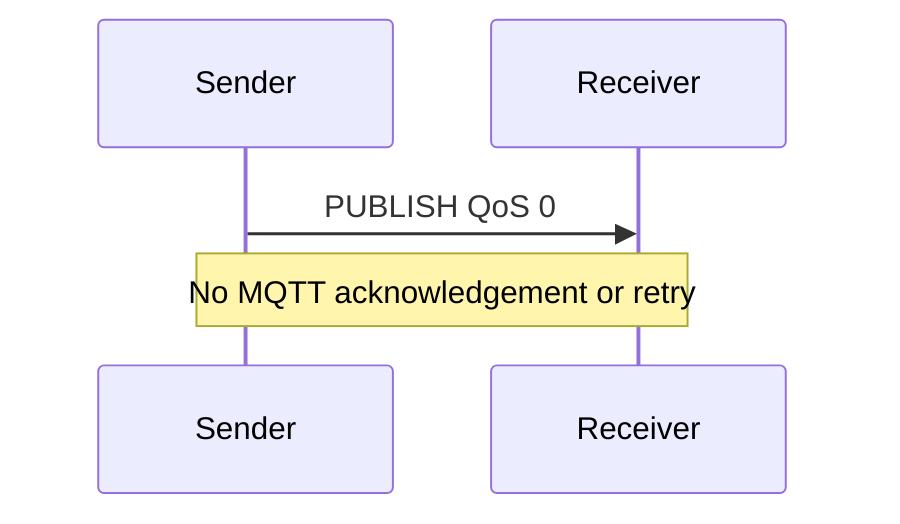
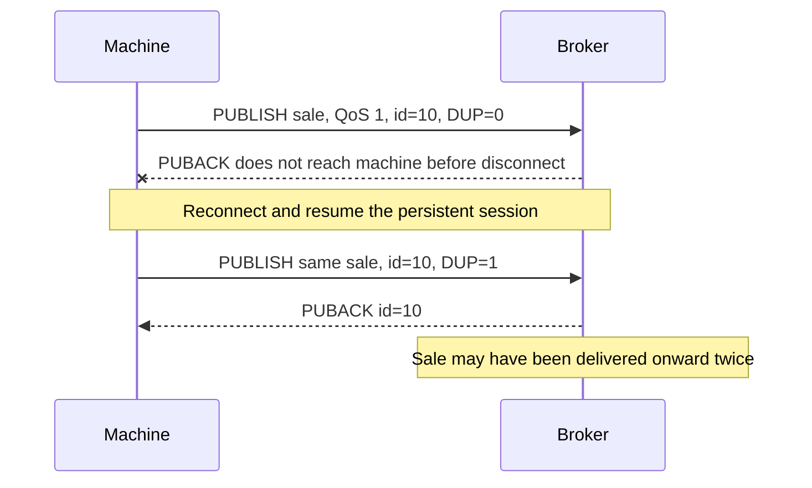

[[Brokers/MQTT/HiveMQ 3.1.1/0. MQTT Table of Contents|📚 MQTT Table of Contents]]

# 📡 MQTT Quality of Service Levels

> [!toc]- 📑 Contents
>
> - [[#🌐 What Does QoS Control?|🌐 What Does QoS Control?]]
> - [[#🔌 Why Do We Need QoS If We Already Have TCP?|🔌 Why Do We Need QoS If We Already Have TCP?]]
> - [[#📤 QoS 0: At Most Once|📤 QoS 0: At Most Once]]
> - [[#✅ QoS 1: At Least Once|✅ QoS 1: At Least Once]]
> - [[#🔒 QoS 2: Exactly Once Delivery|🔒 QoS 2: Exactly Once Delivery]]
> - [[#↔️ QoS Applies Separately on Each Hop|↔️ QoS Applies Separately on Each Hop]]
> - [[#💾 Recovery Needs a Continuing Session|💾 Recovery Needs a Continuing Session]]
> - [[#🎯 Choose the Level That Fits the Message|🎯 Choose the Level That Fits the Message]]
> - [[#🦟 Inspect QoS Exchanges with Mosquitto|🦟 Inspect QoS Exchanges with Mosquitto]]
> - [[#🧪 Understanding Check|🧪 Understanding Check]]
> - [[#🔨 Hands-On Practice|🔨 Hands-On Practice]]
> - [[#📋 Quick Reference|📋 Quick Reference]]
> - [[#🧠 Things to Remember|🧠 Things to Remember]]
> - [[#💡 Pro Tips|💡 Pro Tips]]
> - [[#🔗 Related Topics|🔗 Related Topics]]


## 🌐 What Does QoS Control?

**Quality of Service (QoS)** controls how MQTT delivers a message between one sender and one receiver. It determines whether acknowledgements and protocol state are used, and whether duplicates are possible.

MQTT **3.1.1** provides three levels:

| Level | Delivery guarantee | Main tradeoff |
|---|---|---|
| **QoS 0** | At most once: zero or one delivery | Lowest overhead; messages can be lost |
| **QoS 1** | At least once | Delivery confirmation; duplicates possible |
| **QoS 2** | Exactly once at the MQTT delivery level | More exchanges and stored state |

These guarantees depend on the exchange being able to complete and the required state being preserved. Selecting QoS does not make an unavailable network or lost session recover automatically.

> [!example] 💡 One Machine, Different Message Needs
>
> Machine `vending-102` sends temperature readings every few seconds on `vending/102/temperature`. Losing one reading may be acceptable because another arrives soon: **QoS 0** can fit.
>
> It also publishes sales on `vending/102/sales`. Missing a sale matters, but the backend can deduplicate by `sale_id`: **QoS 1** can fit.
>
> An exchange that specifically requires MQTT to suppress protocol duplicates may use **QoS 2**, accepting the extra overhead.

Choose based on what a missing or repeated message means for the application, rather than always choosing the highest number.

---

## 🔌 Why Do We Need QoS If We Already Have TCP?

TCP gives MQTT a reliable, ordered **byte stream within a connection**. It handles lost network packets and prevents those TCP retransmissions from appearing as duplicate bytes to the receiving application.

But a TCP connection can break while an MQTT exchange is unfinished. The sender may not know whether the receiver accepted the message before the connection disappeared.

```text
Machine sends a sale
        │
        ▼
Broker receives it
        │
        ▼
Connection breaks before the acknowledgement reaches the machine
        │
        ▼
Machine cannot tell: was the sale accepted or not?
```

A new TCP connection does not recover the previous connection's application state. MQTT acknowledgements and stored session state let participants track outstanding exchanges and recover them when the session continues.

TCP confirms transport progress; MQTT tracks message delivery. Neither by itself proves a subscriber finished a database update. [OASIS: Storage, Transport, and QoS, Ch.4.1–4.3](https://docs.oasis-open.org/mqtt/mqtt/v3.1.1/os/mqtt-v3.1.1-os.html)

---

## 📤 QoS 0: At Most Once

QoS 0 is **fire and forget** at the MQTT layer. The sender sends PUBLISH, and the receiver sends no MQTT acknowledgement.



- The PUBLISH has **no Packet Identifier** and uses `DUP = 0`.

- TCP still handles transport retransmissions while the connection works.

- MQTT does not keep this publication pending for acknowledgement or retry it across a broken connection.

For frequent temperature readings, a missed `5.2°C` reading may be harmless if a fresh `5.3°C` reading follows shortly. Use QoS 0 when freshness matters more than collecting every sample.

QoS 0 provides no per-message MQTT confirmation. A client can detect a connection failure, but that does not tell it which unacknowledged QoS 0 messages reached the receiver.

---

## ✅ QoS 1: At Least Once

QoS 1 adds **PUBACK**, the publish acknowledgement. The sender tracks the PUBLISH as outstanding until it receives the matching PUBACK.

```mermaid
sequenceDiagram
    participant S as Sender
    participant R as Receiver
    S->>R: PUBLISH QoS 1, id=10
    R-->>S: PUBACK id=10
    Note over S: Exchange complete; identifier may be reused
```

The **Packet Identifier** connects the acknowledgement to the outstanding exchange. It is a temporary protocol identifier, not a permanent sale ID.

### 🔁 Why Duplicates Can Happen

Suppose the broker receives a sale, but the connection breaks before the machine receives PUBACK. On resuming the session, the machine retransmits the outstanding PUBLISH.



Retrying protects against loss, but the receiver may already have accepted the first copy. **At least once allows more than once.**

MQTT 3.1.1 requires retransmission of outstanding QoS 1/2 exchanges when reconnecting with `CleanSession = 0`. It does not define a universal “retry every N seconds until PUBACK” timer. [OASIS: QoS 1 and Retry, Ch.4.3.2 and Ch.4.4](https://docs.oasis-open.org/mqtt/mqtt/v3.1.1/os/mqtt-v3.1.1-os.html)

### 🆔 Make Business Processing Idempotent

**Idempotent processing** means repeating the same operation has the same business effect as performing it once.

Include a stable identifier in the event:

```json
{
  "sale_id": "vending-102-sale-48125",
  "product_id": "A12",
  "quantity": 1
}
```

The backend can enforce a unique sale ID and record the sale and its inventory change in one database transaction. A repeated event then produces no additional stock deduction.

Do not rely only on `DUP`: it describes a protocol retransmission, not all possible repetitions of a business event. Applications can publish the same sale twice as two new exchanges.

---

## 🔒 QoS 2: Exactly Once Delivery

QoS 2 uses a **four-packet handshake** and stored exchange state to prevent duplicate delivery from protocol retransmissions.

```mermaid
sequenceDiagram
    participant S as Sender
    participant R as Receiver
    S->>R: 1. PUBLISH QoS 2, id=20
    R-->>S: 2. PUBREC id=20
    S->>R: 3. PUBREL id=20
    R-->>S: 4. PUBCOMP id=20
    Note over S: Exchange complete; identifier may be reused
```

1. **PUBLISH:** The sender transmits the message and tracks the exchange.

2. **PUBREC — Publish Received:** The receiver accepts ownership and tracks enough state to suppress duplicate delivery.

3. **PUBREL — Publish Release:** The sender advances to the release phase after receiving PUBREC.

4. **PUBCOMP — Publish Complete:** The receiver confirms completion; the sender can release its remaining exchange state.

All four packets use the same Packet Identifier. The sender keeps state until PUBCOMP rather than considering the exchange finished at PUBREC.

### 🔄 Recovery Follows the Handshake Phase

When a session resumes with its exchange state intact:

| Outstanding phase | What the sender retransmits |
|---|---|
| PUBLISH awaiting PUBREC | PUBLISH with the original identifier and `DUP = 1` |
| PUBREL awaiting PUBCOMP | PUBREL with the original identifier |

Once the sender has sent PUBREL, it must **not restart by resending PUBLISH** for that exchange. The receiver handles repeated packets without delivering the application message again.

The exact point at which the receiver makes the message available for onward delivery can vary by implementation. The guarantee concerns duplicate suppression, not a fixed callback timing. [OASIS: QoS 2, Ch.4.3.3](https://docs.oasis-open.org/mqtt/mqtt/v3.1.1/os/mqtt-v3.1.1-os.html)

### 💡 What Exactly Once Covers

QoS 2 covers one MQTT sender-to-receiver exchange. It does not make an external database update, payment, or physical action part of the protocol transaction.

If the application publishes the same sale twice as two new messages, QoS 2 delivers each publication once. Business event IDs and safe processing still matter.

---

## ↔️ QoS Applies Separately on Each Hop

The publisher-to-broker exchange and broker-to-subscriber exchange are independent:

```text
Machine ── QoS 2 ──► Broker ── QoS 1 ──► Monitoring service
         Exchange A         Exchange B
```

The publication's QoS and the subscription's **granted maximum QoS** limit the second hop. For one matching subscription, at the highest permitted outgoing level:

```text
Incoming publication QoS = 2
Granted subscription QoS = 1
Outgoing delivery QoS    = min(2, 1) = 1
```

First, the incoming message permits QoS 2. Then, the subscription caps delivery at QoS 1. Duplicates are therefore possible on the subscriber hop, despite QoS 2 on the publisher hop.

A QoS 2 subscription cannot upgrade a QoS 0 publication. Check the actual SUBACK result, because granted QoS can be lower than requested.

A publisher receiving PUBACK or PUBCOMP also does not prove that all subscribers completed their work. Use an application-level result message when the publisher needs that confirmation. See [[4. PUB SUB UNSUB|Subscription QoS and Acknowledgements]].

---

## 💾 Recovery Needs a Continuing Session

For MQTT 3.1.1 recovery across connections:

- **Use a stable Client ID and `CleanSession = 0`.** This allows the previous session to continue.

- **Preserve client and broker exchange state.** Process restarts need suitable storage if outstanding messages must survive them.

- **Check that the broker resumed the session.** CONNACK `Session Present` tells the client whether prior broker session state exists.

- **Account for storage limits and policies.** QoS cannot restore messages after the required state has been discarded or corrupted.

With an existing persistent subscription, the broker stores matching QoS 1/2 messages while that subscriber is disconnected. Offline QoS 0 storage is optional, so do not rely on it without checking the implementation.

This differs from the sender's retry mechanism: QoS 0 PUBLISH has no acknowledgement-based recovery, even if a broker separately chooses to queue some QoS 0 messages.

**Retained state** is another mechanism: it supplies the latest retained message on a topic to a new subscription, rather than an entire offline event history. [OASIS: Clean Session and State, Ch.3.1.2.4 and Ch.4.1](https://docs.oasis-open.org/mqtt/mqtt/v3.1.1/os/mqtt-v3.1.1-os.html)

---

## 🎯 Choose the Level That Fits the Message

| Use case | Useful starting choice | Why |
|---|---|---|
| Frequent temperature readings | QoS 0 | Missing one sample is acceptable; low overhead matters |
| Sales or fault events with event IDs | QoS 1 | Acknowledged delivery with manageable duplicate handling |
| Protocol-level duplicate suppression required | QoS 2 | Extra exchange state suppresses MQTT retransmission duplicates |

**QoS 1 is a practical starting point for many important events**, not a protocol-mandated default. Library defaults vary; choose and configure the level explicitly.

For one successful exchange on one hop, without retransmissions:

```text
QoS 0: 1 PUBLISH                         = 1 MQTT packet
QoS 1: 1 PUBLISH + 1 PUBACK               = 2 MQTT packets
QoS 2: 1 PUBLISH + PUBREC + PUBREL + PUBCOMP = 4 MQTT packets
```

These are packet counts, not exact bandwidth multipliers: acknowledgement packets are smaller than a PUBLISH carrying data. QoS 2 adds another handshake phase and more state; actual throughput depends on payload size, latency, and how many exchanges can run concurrently.

---

## 🦟 Inspect QoS Exchanges with Mosquitto

Use [[3. MQTT Client–Broker Setup and Connection Flow#🦟 Shared Mosquitto Lab|the shared local broker]]. Start a subscriber capped at QoS 2:

```bash
mosquitto_sub -h 127.0.0.1 -p 18883 -V mqttv311 -i labQosSub -t 'vending/102/temperature' -q 2 -v -d
```

Publish once at each QoS from another terminal:

```bash
mosquitto_pub -h 127.0.0.1 -p 18883 -V mqttv311 -t 'vending/102/temperature' -q 0 -m 'qos0-reading' -d
mosquitto_pub -h 127.0.0.1 -p 18883 -V mqttv311 -t 'vending/102/temperature' -q 1 -m 'qos1-reading' -d
mosquitto_pub -h 127.0.0.1 -p 18883 -V mqttv311 -t 'vending/102/temperature' -q 2 -m 'qos2-reading' -d
```

✅ Compare the publisher's debug output: no publish acknowledgement at QoS 0, PUBACK at QoS 1, and PUBREC → PUBREL → PUBCOMP at QoS 2. CONNECT/CONNACK and DISCONNECT are separate from those publish exchanges.

Restart the subscriber with `-q 0` and repeat the QoS 2 publication. The publisher still completes QoS 2 with Mosquitto, while the subscriber receives at QoS 0. This demonstrates the independent hops. Stop the subscriber with Ctrl+C. [Publisher debug and QoS options](https://mosquitto.org/man/mosquitto_pub-1.html)

For offline recovery, continue with [[7. Persistent Sessions & Queueing#🦟 Mosquitto Offline Queue Lab|the persistent-session lab]].

---

## 🧪 Understanding Check

**Q1:** Why does TCP reliability not remove the need for MQTT acknowledgements?

**Q2:** The receiver accepted a QoS 1 message, but the sender never received PUBACK. What can happen after session recovery?

**Q3:** A QoS 2 sender sent PUBREL, then disconnected before receiving PUBCOMP. What does it resend?

**Q4:** Does publishing at QoS 2 guarantee a QoS 0 subscriber receives the message exactly once?

**Q5:** Does QoS 2 make a stock deduction happen exactly once in your database?

> [!answer]- 📋 Answers
>
> **A1:** TCP handles the current connection's bytes. After a disconnect, MQTT needs its own state to track which exchanges completed and which remain outstanding.
>
> **A2:** The sender retransmits the outstanding PUBLISH. The receiver may accept another copy, so downstream processing must tolerate duplicates.
>
> **A3:** PUBREL with the original Packet Identifier, assuming the session and exchange state resume. It must not restart that exchange with PUBLISH.
>
> **A4:** No. The broker-to-subscriber hop is capped at QoS 0 and can lose the message.
>
> **A5:** No. MQTT duplicate suppression does not atomically commit external side effects. Use a stable event ID and transactional, idempotent processing.

---

## 🔨 Hands-On Practice

### 🔁 Trace an Interrupted Exchange

1. Draw a QoS 1 exchange for sale `48125` with Packet Identifier `10`.

2. Mark the connection as broken after the receiver accepts PUBLISH but before PUBACK reaches the sender.

3. Resume the persistent session and draw the retransmission. Decide how the backend avoids deducting stock twice.

> [!answer]- ✅ Expected Result
>
> The sender retransmits PUBLISH with identifier `10` and `DUP = 1`. Repeated delivery is possible; deduplicate using the stable sale ID and apply the business change transactionally.

### 🔒 Resume QoS 2 at the Right Phase

1. Draw PUBLISH → PUBREC → PUBREL, using identifier `20` throughout.

2. Interrupt the connection before PUBCOMP reaches the sender.

3. Resume the same session and complete the exchange.

> [!answer]- ✅ Expected Result
>
> The sender retransmits PUBREL with identifier `20`; the receiver responds with PUBCOMP. The application message is not delivered again because of this repeated release phase.

These are safe message-flow exercises and need no broker or real device.

---

### 📋 Quick Reference

| Level | MQTT exchange | When sender finishes | Duplicate delivery from recovery? |
|---|---|---|---|
| QoS 0 | PUBLISH | No acknowledgement tracked | No MQTT retry; loss possible |
| QoS 1 | PUBLISH → PUBACK | Matching PUBACK received | Yes |
| QoS 2 | PUBLISH → PUBREC → PUBREL → PUBCOMP | Matching PUBCOMP received | Suppressed within the exchange |

### 🧠 Things to Remember

- QoS is per hop; publisher QoS and subscriber delivery QoS can differ.

- Recovery across connections needs preserved session and exchange state.

- QoS 1 allows duplicates; QoS 2 prevents protocol duplicates within an exchange.

- An MQTT acknowledgement does not confirm subscriber business processing.

### 💡 Pro Tips

- **Choose QoS per message type.** Telemetry and sales events have different loss costs.

- **Keep business event IDs stable across retries.** Packet Identifiers are temporary and reusable.

- **Check granted subscription QoS.** Requesting QoS 2 does not ensure the broker granted it.

- **Test reconnects and process restarts separately.** An in-memory session can survive a network break while failing to survive a restart.

### 🔗 Related Topics

- [[4. PUB SUB UNSUB|PUBLISH, SUBSCRIBE, and Acknowledgements]]

- [[5. Topics|Topics and Subscription Filters]]

- [[3. MQTT Client–Broker Setup and Connection Flow|Client Identity and Session Present]]

- [[Brokers/MQTT/basics|MQTT Basics: Sessions and Retained Messages]]
