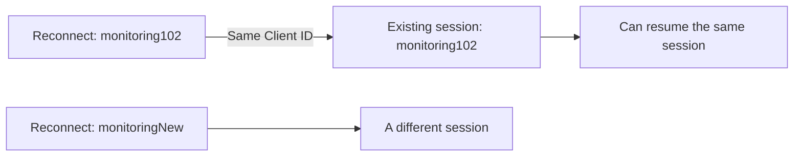
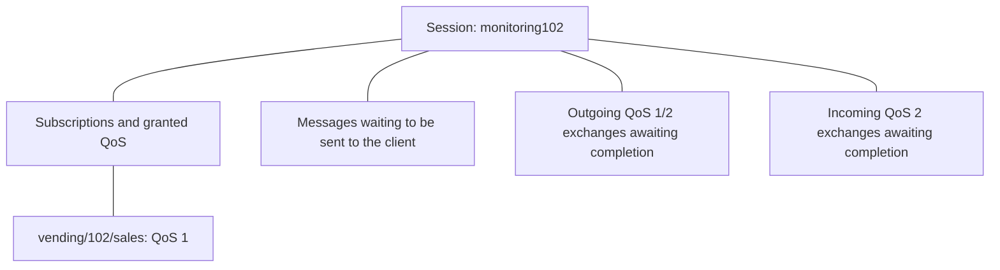
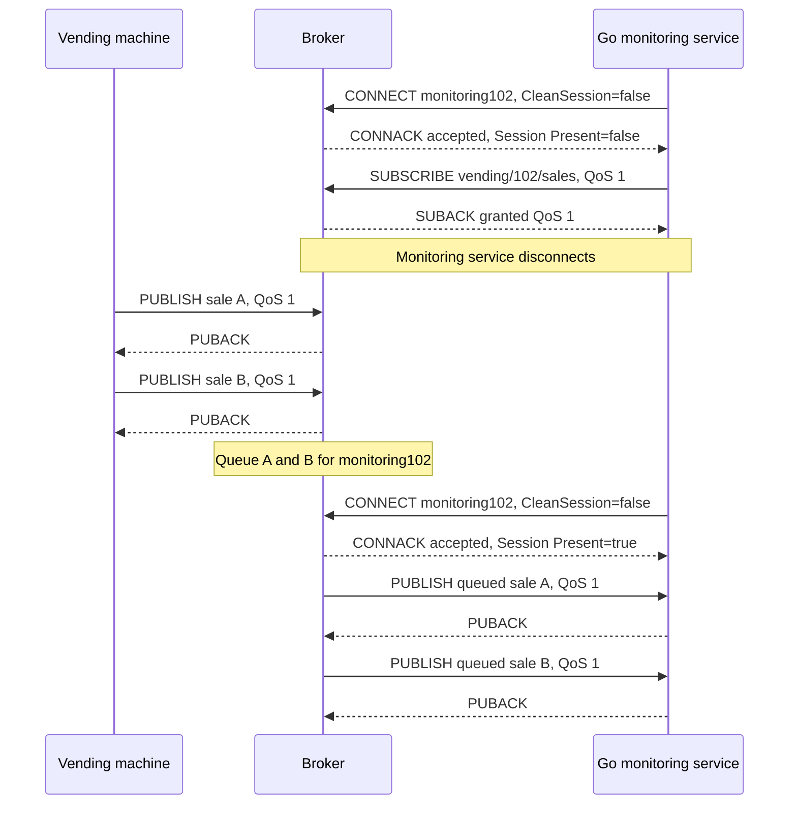
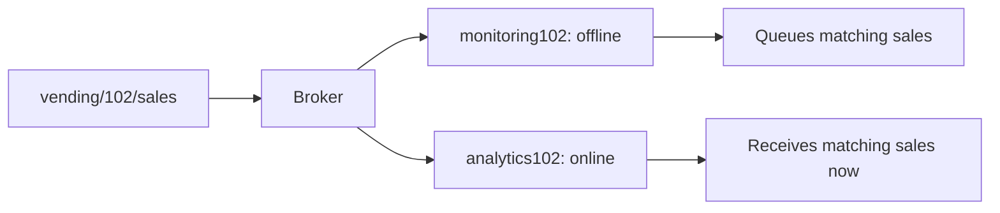

[[Brokers/MQTT/HiveMQ 3.1.1/0. MQTT Table of Contents|📚 MQTT Table of Contents]]

# 📡 MQTT Persistent Sessions & Queueing

> [!toc]- 📑 Contents
>
> - [[#🌐 A Connection Can End While Its Session Continues|🌐 A Connection Can End While Its Session Continues]]
> - [[#🔀 Clean Session vs Persistent Session|🔀 Clean Session vs Persistent Session]]
> - [[#💾 What State Is Preserved?|💾 What State Is Preserved?]]
> - [[#🔄 Resume Through CONNACK Session Present|🔄 Resume Through CONNACK Session Present]]
> - [[#📬 Queueing Is Per Client, Not a Global Topic History|📬 Queueing Is Per Client, Not a Global Topic History]]
> - [[#🎯 Choose Session Behavior for the Workload|🎯 Choose Session Behavior for the Workload]]
> - [[#⏳ Expiry and Queue Limits|⏳ Expiry and Queue Limits]]
> - [[#🦟 Mosquitto Offline Queue Lab|🦟 Mosquitto Offline Queue Lab]]
> - [[#🧪 Understanding Check|🧪 Understanding Check]]
> - [[#🔨 Hands-On Practice|🔨 Hands-On Practice]]
> - [[#📋 Quick Reference|📋 Quick Reference]]
> - [[#🧠 Things to Remember|🧠 Things to Remember]]
> - [[#💡 Pro Tips|💡 Pro Tips]]
> - [[#🔗 Related Topics|🔗 Related Topics]]


## 🌐 A Connection Can End While Its Session Continues

An MQTT **connection** is the current communication link to the broker. A **session** is the state that lets a client continue its MQTT work, including subscriptions and unfinished delivery exchanges.

A **persistent session** keeps that state after the client disconnects. When the client returns, it can resume subscriptions and receive messages queued while it was offline.

This reference uses **MQTT 3.1.1** and its `CleanSession` flag. MQTT 5 expiry terminology is compared near the end.

> [!example] 💡 A Monitoring Service Goes Offline
>
> A Go service connects as `monitoring102`, with `CleanSession = false`, and subscribes to `vending/102/sales` at QoS 1.
>
> The service loses its connection. Machine `vending-102` remains connected and publishes two sales at QoS 1.
>
> The broker queues those matching messages for the service. When `monitoring102` reconnects and resumes its session, the broker delivers the backlog.

The broker reduces the subscriber's need to recreate its subscriptions after each network interruption. The client still has responsibilities: stable identity, local exchange state, reconnect handling, and application processing.

---

## 🔀 Clean Session vs Persistent Session

The client chooses session behavior in the **CONNECT** packet:

| Setting | When connecting | After disconnecting |
|---|---|---|
| `CleanSession = true` | Discard previous session state and start fresh | This connection's session state is discarded |
| `CleanSession = false` | Resume the session for this Client ID, or create one if absent | Keep session state for a later connection |

**Clean Session is a reset at connection time too.** Reconnecting with `true` discards an existing persistent session, including its subscriptions and queued messages.

With `false`, the first connection creates a persistent session. Later connections can resume it, provided that the state still exists.

A normal MQTT DISCONNECT closes the connection; it does not delete a persistent session. [OASIS MQTT 3.1.1: Clean Session, Ch.3.1.2.4](https://docs.oasis-open.org/mqtt/mqtt/v3.1.1/os/mqtt-v3.1.1-os.html)

### 🆔 The Client ID Is the Session Key

Use the **same stable Client ID** each time you reconnect:



A new random ID on every reconnect prevents the client from finding its old session and can leave unused sessions behind.

Give each independently running client its own ID. If a new accepted connection uses an already connected client's ID, the broker disconnects the existing connection. A Client ID identifies the session; authentication establishes who is allowed to use it. [OASIS: Client Identifier and Connection Processing, Ch.3.1.3.1 and Ch.3.1.4](https://docs.oasis-open.org/mqtt/mqtt/v3.1.1/os/mqtt-v3.1.1-os.html)

---

## 💾 What State Is Preserved?

The broker associates session state with the Client ID:



| State | Why it matters |
|---|---|
| Subscriptions | The client can continue receiving matching messages without recreating every filter |
| Queued messages | Matching publications can wait while the subscriber is offline |
| Unfinished QoS exchanges | Delivery can resume using the existing Packet Identifiers and handshake phase |

The **client also stores protocol state**, including its outgoing unacknowledged QoS 1/2 messages and incoming unfinished QoS 2 exchanges. Broker state alone cannot replace missing client state.

“Persistent session” means state survives the connection ending. Surviving a broker or client **process restart** depends on the implementation's storage and configuration; in-memory state alone is insufficient for that requirement.

Retained messages are separate broker state and are not deleted merely because a session ends. [OASIS: Session State and Storage, Ch.3.1.2.4 and Ch.4.1](https://docs.oasis-open.org/mqtt/mqtt/v3.1.1/os/mqtt-v3.1.1-os.html)

---

## 🔄 Resume Through CONNACK Session Present

On a successful connection, the broker's **CONNACK** contains `Session Present`:

| CONNECT setting | Existing session? | Session Present | Client action |
|---|---|---|---|
| `CleanSession = false` | Yes | `true` | Continue the existing session |
| `CleanSession = false` | No | `false` | Establish subscriptions for the new persistent session |
| `CleanSession = true` | Previous state is discarded | `false` | Establish subscriptions for this fresh session |

Check that the connection was accepted before interpreting session recovery. `Session Present = true` means stored session state exists; it does not prove the queue is nonempty or that every expected filter was registered.



This example assumes the session and queue remain intact. With `Session Present = true`, the existing subscription remains usable; a new SUBSCRIBE is needed only when you want to add or change subscriptions.

If `Session Present = false` unexpectedly, handle the connection as a new session and recreate required subscriptions. Also reconcile the client's local protocol state through the library's recovery behavior. [OASIS: Session Present, Ch.3.2.2.2](https://docs.oasis-open.org/mqtt/mqtt/v3.1.1/os/mqtt-v3.1.1-os.html)

---

## 📬 Queueing Is Per Client, Not a Global Topic History

For offline delivery, the subscriber must have **already established a persistent session and matching subscriptions** before disconnecting.

- **Matching QoS 1/2 publications:** The broker must store these for the offline persistent session, subject to stored-state limits and policies.

- **Matching QoS 0 publications:** Offline storage is optional in MQTT 3.1.1. Do not rely on it without verifying the broker's behavior.

- **No matching subscription or no surviving session:** There is no session queue for those messages to enter.

A QoS 0 publication still has no acknowledgement-based retry, even if a broker chooses to store it for offline subscribers. See [[6. Quality of Service Levels|QoS and Recovery]].

Two clients subscribed to the same sales topic have separate delivery state:



If the vending machine itself is offline, it cannot send new sales to the broker. Buffering events generated on that disconnected device requires a local application or library queue; the broker cannot queue messages it has never received.

### 💾 Session Queue vs Retained Message

| Session queue | Retained message |
|---|---|
| Belongs to a specific client's session | Belongs to a topic |
| Preserves pending messages for an existing subscriber | Provides the latest retained state to a new subscription |
| Can contain multiple events | Holds the latest retained message for each topic |
| Lost when that session is deleted | Independent of session deletion |

Use a session queue for missed sales events. Use retained state for something like the machine's latest status. Neither is a permanent event archive.

---

## 🎯 Choose Session Behavior for the Workload

| Client need | Useful choice | Reason |
|---|---|---|
| Live-only dashboard; old readings are unnecessary | Clean session | No offline backlog to maintain |
| Publisher with no required recovery state | Clean session | Simpler lifecycle |
| Subscriber that needs matching events during an outage | Persistent session + QoS 1/2 | Preserves subscriptions and offline delivery state |
| Client with many subscriptions to restore | Persistent session | Avoids rebuilding the unchanged subscription set |
| Publisher needing recovery of unfinished QoS exchanges | Persistent session + client-side state | Recovery matters even without subscriptions |

A persistent session improves delivery continuity; it does not guarantee unlimited retention or successful business processing. QoS 1 backlog delivery may include duplicates, so keep stable event IDs and idempotent processing.

When a client is permanently retired, remove its unused session. In MQTT 3.1.1, a successful connection using the **same Client ID with `CleanSession = true`**, followed by disconnecting, clears the old session. This intentionally discards its queue and subscriptions.

---

## ⏳ Expiry and Queue Limits

Long-lived offline clients can accumulate large queues. Check broker policies for:

- Maximum queued messages or bytes per client.

- Session cleanup after prolonged inactivity.

- Queued-message lifetime and behavior when limits are reached.

- Durable storage across restarts and how backlog delivery is controlled.

**MQTT 3.1.1 has no standard Session Expiry or Message Expiry field.** Any such expiration policy is a broker feature or configuration; verify the selected implementation.

Expiry and quotas help bound storage use. Authentication, topic authorization, and connection limits are also needed to control who can create sessions and produce traffic.

### 🆕 MQTT 5 Separates Three Controls

| MQTT 5 control | Purpose |
|---|---|
| **Clean Start** | Whether to discard an old session when connecting |
| **Session Expiry Interval** | How long session state survives after disconnecting |
| **Message Expiry Interval** | How long an individual application message remains valid for pending delivery |

To resume a session across outages in MQTT 5, use the same Client ID, `Clean Start = false`, and a suitable **nonzero Session Expiry Interval**. With expiry zero or omitted, the session ends when the connection closes.

Session expiry deletes the session state. Message expiry can remove an undelivered message while the session and its subscriptions continue. These are distinct lifetimes. [OASIS MQTT 5: CONNECT and PUBLISH Properties, Ch.3.1.2.11.2 and Ch.3.3.2.3.3](https://docs.oasis-open.org/mqtt/mqtt/v5.0/os/mqtt-v5.0-os.html)

---

## 🦟 Mosquitto Offline Queue Lab

Use [[3. MQTT Client–Broker Setup and Connection Flow#🦟 Shared Mosquitto Lab|the shared broker]] and keep it running throughout this first experiment.

### 1. Establish the Persistent Subscription

```bash
mosquitto_sub -h 127.0.0.1 -p 18883 -V mqttv311 -i labSessionSub -c -t 'vending/102/sales' -q 1 -v -d
```

Wait for SUBACK, then press Ctrl+C. The fixed ID and `-c` request a persistent MQTT 3.1.1 session. [Client session option](https://mosquitto.org/man/mosquitto_sub-1.html)

### 2. Publish While the Subscriber Is Offline

```bash
mosquitto_pub -h 127.0.0.1 -p 18883 -V mqttv311 -t 'vending/102/sales' -q 1 -m '{"sale_id":"A"}'
mosquitto_pub -h 127.0.0.1 -p 18883 -V mqttv311 -t 'vending/102/sales' -q 1 -m '{"sale_id":"B"}'
```

### 3. Reconnect

Run the exact subscriber command from step 1 again.

✅ A and B should arrive without republishing. They were queued, not retained: neither publisher used `-r`. Inspect CONNACK's session information in debug output. The CLI also issues its requested SUBSCRIBE again; that does not mean the broker forgot the saved subscription.

For cleanup, stop the subscriber, run step 1 without `-c`, wait for connection acceptance, and stop it again. This clears the old persistent session.

### 💾 Add Broker Restart Persistence

Stop the lab broker cleanly. In `mosquitto-lab.conf`, replace `persistence false` and add:

```conf
persistence true
persistence_location ./
autosave_interval 30
max_queued_messages 1000
queue_qos0_messages false
persistent_client_expiration 14d
```

Restart from the same `~/mqtt-lab` directory. Repeat steps 1–2, stop the broker with Ctrl+C, restart it, then perform step 3.

| Setting | Meaning in this lab |
|---|---|
| `persistence true` | Built-in disk storage; the broker reloads saved state |
| `persistence_location ./` | Save `mosquitto.db` in the writable launch directory |
| `autosave_interval 30` | Periodic snapshot interval; clean shutdown also saves |
| `max_queued_messages 1000` | Per-client queue cap beyond in-flight messages |
| `queue_qos0_messages false` | Do not queue offline QoS 0; this is the default |
| `persistent_client_expiration 14d` | Remove sessions after this offline period; not per-message expiry |

With `persistence false`, sessions can survive client disconnects while Mosquitto stays running, but not a broker restart. Snapshots do not guarantee every recent change survives an abrupt crash. These are explicit lab settings, not a claim about your installed service configuration. Current Mosquitto docs also describe plugin-based persistence. [Configuration reference](https://mosquitto.org/man/mosquitto-conf-5.html)

---

## 🧪 Understanding Check

**Q1:** What happens if a persistent client reconnects with a new random Client ID?

**Q2:** Does `CleanSession = false` guarantee `Session Present = true`?

**Q3:** Will a client receive all historical messages when it subscribes for the first time?

**Q4:** Does a normal DISCONNECT delete a persistent session?

**Q5:** Can broker session storage preserve sales generated by a machine that cannot reach the broker?

> [!answer]- 📋 Answers
>
> **A1:** It connects to a different session. Its original subscriptions and queue remain associated with the old ID until that session is removed.
>
> **A2:** No. If no stored session exists, the broker creates one and returns Session Present=false. The client must establish its subscriptions.
>
> **A3:** No. Session queues depend on subscriptions already present when publications arrive. A retained message may supply latest state, but not complete history.
>
> **A4:** No. With CleanSession=false, the session survives a normal disconnect too.
>
> **A5:** No. Those events need local buffering until the machine can publish them. Broker queueing serves disconnected subscribers after messages reach the broker.

---

## 🔨 Hands-On Practice

### 📬 Trace an Offline Queue

1. Assume `monitoring102` has a persistent session and a QoS 1 subscription to `vending/102/sales`.

2. Disconnect it, then publish sales A and B at QoS 1 while the machine remains online.

3. Reconnect using the same ID and CleanSession=false. Assume no queue limits, expiry, or state loss occurred.

> [!answer]- ✅ Expected Result
>
> CONNACK reports Session Present=true. The broker delivers queued A and B using the existing subscription; QoS 1 duplicate handling still applies.

### 🔄 Compare Three Reconnects

1. Reconnect with the same ID and CleanSession=false.

2. Reconnect with a different ID and CleanSession=false.

3. Reconnect with the original ID and CleanSession=true.

> [!answer]- ✅ Expected Result
>
> First: resumes the original session if it still exists.
>
> Second: creates or resumes a different session; it cannot retrieve the original queue.
>
> Third: discards the original session and starts fresh, losing its old queue and subscriptions.

These are message-flow exercises and need no broker or real device.

---

### 📋 Quick Reference

| Item | Meaning |
|---|---|
| `CleanSession = false` | Resume or create persistent session state |
| `CleanSession = true` | Discard prior session; keep new state only for this connection |
| Stable Client ID | Identifies the session to resume |
| `Session Present = true` | Broker has previous session state |
| `Session Present = false` | No previous session resumed; establish required subscriptions |
| Offline QoS 1/2 | Queued for existing matching persistent subscriptions |
| Offline QoS 0 | Optional broker storage; not portable to assume |

### 🧠 Things to Remember

- Session lifetime and connection lifetime are different.

- Queueing requires a surviving session and previously registered matching subscriptions.

- Both client and broker have state to preserve for QoS recovery.

- Session queues, retained state, and local publisher buffers solve different problems.

### 💡 Pro Tips

- **Inspect Session Present on every reconnect.** Rebuild subscriptions when the broker has started a new session.

- **Keep Client IDs stable and unique.** Random IDs lose continuity; simultaneous reuse causes connection takeover.

- **Verify queue limits and restart behavior.** Persistent sessions do not imply unlimited disk-backed storage.

- **Plan cleanup for retired clients.** Unused sessions consume resources and may retain obsolete messages.

### 🔗 Related Topics

- [[3. MQTT Client–Broker Setup and Connection Flow|CONNECT, Client ID, and CONNACK]]

- [[4. PUB SUB UNSUB|Subscriptions and Acknowledgements]]

- [[6. Quality of Service Levels|QoS, Retries, and Idempotency]]

- [[Brokers/MQTT/basics|MQTT Basics: Sessions and Retained Messages]]
