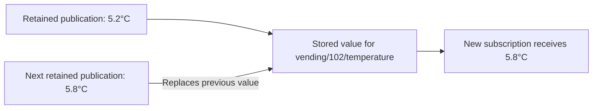
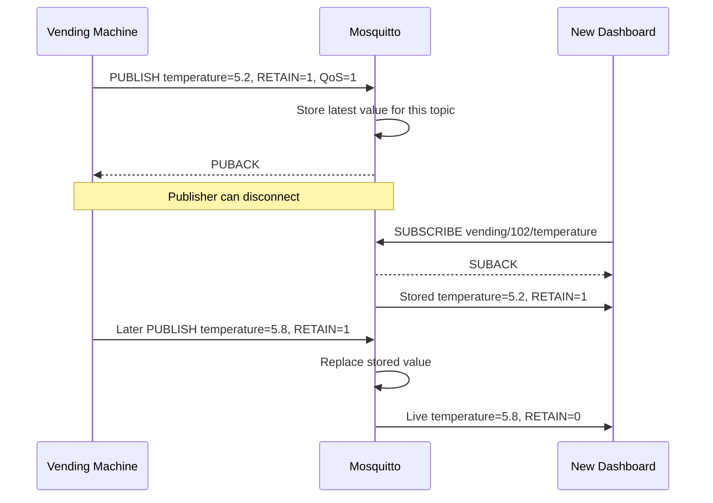
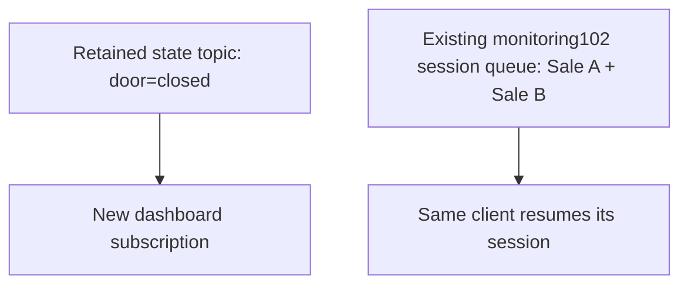
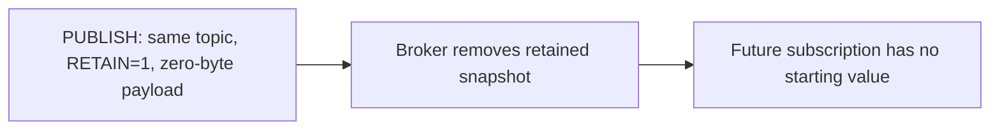

# 📡 MQTT Retained Messages

[[Brokers/MQTT/HiveMQ 3.1.1/0. MQTT Table of Contents|📚 MQTT Table of Contents]]

> [!toc]- 📑 Contents
>
> - [[#🌐 Give New Subscribers a Starting Value|🌐 Give New Subscribers a Starting Value]]
> - [[#💾 One Stored Message per Topic|💾 One Stored Message per Topic]]
> - [[#📬 How Retained Delivery Works|📬 How Retained Delivery Works]]
> - [[#🔀 Retained Messages vs Client Queues|🔀 Retained Messages vs Client Queues]]
> - [[#🗑️ Delete a Retained Message|🗑️ Delete a Retained Message]]
> - [[#🎯 Retain State That Is Safe to Replay|🎯 Retain State That Is Safe to Replay]]
> - [[#🦟 Mosquitto Retained Message Lab|🦟 Mosquitto Retained Message Lab]]
> - [[#🧪 Understanding Check|🧪 Understanding Check]]
> - [[#🔨 Hands-On Practice|🔨 Hands-On Practice]]
> - [[#📋 Quick Reference|📋 Quick Reference]]
> - [[#🧠 Things to Remember|🧠 Things to Remember]]
> - [[#💡 Pro Tips|💡 Pro Tips]]
> - [[#🔗 Related Topics|🔗 Related Topics]]

## 🌐 Give New Subscribers a Starting Value

A **retained message** gives a topic a stored value that the broker can send when a new matching subscription is established. The publisher requests this by setting `RETAIN = 1` on a `PUBLISH` packet.

This reference uses **MQTT 3.1.1** and **Eclipse Mosquitto**.

> [!example] 💡 A Dashboard Opens Between Sensor Updates
>
> A vending machine publishes its temperature every five minutes.
>
> - 📤 **Topic:** `vending/102/temperature`
>
> - 📦 **Payload:** `{"temperature":5.2}`
>
> - 🖥️ **New dashboard:** subscribes two minutes after the last reading.
>
> Without retention, it waits for the next reading. With retention, it starts with the stored reading and then receives live updates.

“Last known good value” is a useful mental model, but the broker does not validate the measurement. A retained reading can be old, incorrect, or published by a faulty device.

---

## 💾 One Stored Message per Topic

Each exact topic has **at most one retained message**. A new nonempty retained publication replaces the previous one.



Different topics keep separate values. A wildcard subscription can therefore receive several retained messages: one for each matching topic with stored state.

| Topic | Example retained payload |
|---|---|
| `vending/102/temperature` | `{"temperature":5.8}` |
| `vending/102/door` | `{"door":"closed"}` |
| `vending/103/temperature` | `{"temperature":6.1}` |

Retention is a snapshot, so it cannot provide yesterday’s readings or every sale. Keep event history in a database or an appropriate event store.

### 🔎 A Normal Publish Leaves the Snapshot Alone

Suppose the broker has retained `5.2`, then receives `6.0` with `RETAIN = 0`.

- Existing matching subscribers receive the live `6.0` publication.

- The retained snapshot remains `5.2`; a new subscription can receive that older value.

Consistently retain updates to a state topic if new subscribers should see its latest published state.

---

## 📬 How Retained Delivery Works

The publisher can disconnect after publishing. A later client connects and **subscribes** to the topic; simply connecting does not request its retained value.



The retained delivery and SUBACK order shown is illustrative; MQTT 3.1.1 allows matching publications before SUBACK.

### 🏷️ Understand the Received RETAIN Flag

In MQTT 3.1.1, a message delivered because of a new subscription has `RETAIN = 1`. A publication forwarded to an existing subscription has `RETAIN = 0`, even if the publisher requested retention.

**Retain and QoS are separate controls.** Retain controls stored state; QoS controls delivery. Retained delivery respects the stored publication QoS and granted subscription QoS. At QoS 0, MQTT 3.1.1 permits the broker to discard retained state; this lab publishes at QoS 1. [MQTT 3.1.1: PUBLISH and RETAIN rules](https://docs.oasis-open.org/mqtt/mqtt/v3.1.1/os/mqtt-v3.1.1-os.html)

Retained state is separate from a client's session. A fresh client can subscribe and receive it without having previously established a persistent session.

### 💽 Retained Does Not Automatically Mean Saved to Disk

The shared lab uses `persistence false`. Mosquitto keeps the snapshot while it runs, but that configuration does not preserve it across a broker restart.

To test restart recovery, use [[7. Persistent Sessions & Queueing#💾 Add Broker Restart Persistence|the persistence setup from lesson 7]]. A clean shutdown saves state when built-in persistence is enabled; an abrupt crash can lose changes made since the last save. [Mosquitto persistence settings](https://mosquitto.org/man/mosquitto-conf-5.html)

---

## 🔀 Retained Messages vs Client Queues

Both can deliver a message after its original publication, but they solve different problems.

| Question | Retained message | Offline client queue |
|---|---|---|
| What owns the state? | Exact topic | A particular client session |
| What is kept? | Latest retained snapshot | Pending deliveries, subject to limits |
| Can a brand-new subscriber benefit? | Yes, through a matching subscription | No previous session queue exists for it |
| Typical use | Initialize a dashboard | Catch up an offline monitoring service |
| Where is the detail explained? | This lesson | Lesson 7 |

For example, a new dashboard needs the machine's **current door state**. A service that missed two sales needs **both pending sale events**, rather than only the most recent sale.



The features can coexist. Design for the application's needs rather than expecting one to replace the other.

---

## 🗑️ Delete a Retained Message

Publish to the **same exact topic** with both:

- `RETAIN = 1`

- A **zero-byte payload**.

This removes the stored snapshot. Existing matching subscribers receive the empty publication normally; future subscriptions receive no retained value for that topic.



Empty JSON `{}`, JSON `null`, and a single space are nonempty payloads, so they replace the snapshot rather than delete it. A zero-byte publish without retention also leaves the snapshot unchanged.

Deletion does not erase values already held in applications or clear a client's offline queue. Subscribers need their own rule for interpreting an empty payload.

---

## 🎯 Retain State That Is Safe to Replay

| Good state candidates | Event or command examples to avoid retaining |
|---|---|
| Latest temperature, with a timestamp | Every individual sale |
| Current door state | “Charge this customer” |
| Current desired configuration | “Restart now” |

A subscriber may act on retained data immediately after subscribing. Retaining a one-time command can cause it to run again when another subscription is established.

For measurements, include a timestamp and let the application decide whether the reading is still fresh. MQTT 3.1.1 has no per-message expiry property; MQTT 5 adds Message Expiry Interval for applications that need broker-managed expiry. [MQTT 5 specification](https://docs.oasis-open.org/mqtt/mqtt/v5.0/os/mqtt-v5.0-os.html)

---

## 🦟 Mosquitto Retained Message Lab

Start [[3. MQTT Client–Broker Setup and Connection Flow#🦟 Shared Mosquitto Lab|the local Mosquitto lab]] first. Keep it running throughout the exercise. Use this disposable practice topic: `lab/retained/vending/102/temperature`.

### 1. Store a Reading Before Any Subscriber Starts

```bash
mosquitto_pub -h 127.0.0.1 -p 18883 -V mqttv311 -t 'lab/retained/vending/102/temperature' -q 1 -r -m '{"temperature":5.2}'
```

`-r` requests retention; `-m` supplies the payload. The host, port, protocol, topic, and QoS flags follow the shared lab conventions. [Publisher options](https://mosquitto.org/man/mosquitto_pub-1.html)

### 2. Subscribe Later

```bash
mosquitto_sub -h 127.0.0.1 -p 18883 -V mqttv311 -t 'lab/retained/vending/102/temperature' -q 1 -v -C 1
```

`-v` prints the topic and payload; `-C 1` exits after one message. [Subscriber options](https://mosquitto.org/man/mosquitto_sub-1.html)

✅ Expected output, without another publication:

```text
lab/retained/vending/102/temperature {"temperature":5.2}
```

### 3. Replace the Snapshot

Run step 1 again with `{"temperature":5.8}`, keeping `-r`. Then repeat step 2.

✅ The fresh subscription receives `5.8`, not a history containing both readings.

### 4. Compare a Live Update

Run step 2 **without `-C 1`** and leave it listening. It first receives the retained `5.8`.

In another terminal, publish without `-r`:

```bash
mosquitto_pub -h 127.0.0.1 -p 18883 -V mqttv311 -t 'lab/retained/vending/102/temperature' -q 1 -m '{"temperature":6.0}'
```

✅ The listening subscriber receives `6.0`. A new subscriber using step 2 still receives the retained `5.8`.

Stop the listening subscriber with **Ctrl+C**.

### 5. Delete and Check

```bash
mosquitto_pub -h 127.0.0.1 -p 18883 -V mqttv311 -t 'lab/retained/vending/102/temperature' -q 1 -r -n
```

`-n` sends a zero-byte payload. Together, `-r -n` clear the snapshot for this topic. [Null payload option](https://mosquitto.org/man/mosquitto_pub-1.html)

Repeat step 2. ✅ It waits silently because there is no retained value and no new publication. Stop it with **Ctrl+C**; this also finishes the lab cleanup.

---

## 🧪 Understanding Check

**Q1:** A machine publishes retained `5.2`, then retained `5.8`. What does a new matching subscription receive?

**Q2:** After retained `5.8`, the machine publishes non-retained `6.0`. What does a new subscription receive?

**Q3:** Does a new client need a persistent session to receive a retained value?

**Q4:** Why does a retained payload of `{}` not delete the stored value?

**Q5:** Can a retained temperature prove the machine is currently online?

> [!answer]- 📋 Answers
>
> **A1:** The latest stored retained value, `5.8`; it does not receive both readings as history.
>
> **A2:** `5.8`. The non-retained publication does not update the stored snapshot.
>
> **A3:** No. It needs a matching subscription and permission to receive the topic.
>
> **A4:** `{}` contains bytes. Deletion requires retention and a zero-byte payload.
>
> **A5:** No. The reading may remain after the publisher disconnects; use timestamps and appropriate device-status handling.

## 🔨 Hands-On Practice

### 📬 Predict a Wildcard Subscription

1. Imagine retained values on `vending/102/temperature` and `vending/103/temperature`.

2. A new dashboard subscribes to `vending/+/temperature`.

3. Predict how many starting values it receives.

✅ Two: one snapshot per matching topic. Do not assume the order of different topics.

### 🗑️ Compare Empty Payloads

1. In the local lab, publish retained `{}` and subscribe with step 2.

2. Clear the topic using `-r -n`, then subscribe again.

✅ The first subscription receives `{}`. The second has no retained starting value. Stop it with Ctrl+C.

### 📋 Quick Reference

| Operation | Meaning |
|---|---|
| Publish with `-r -m 'PAYLOAD'` | Store or replace a retained snapshot |
| New matching subscription | Receive existing retained state |
| Publish without `-r` | Live delivery; leave retained state unchanged |
| Publish with `-r -n` | Delete the retained snapshot |
| Wildcard subscription | Can receive snapshots from multiple topics |
| `persistence false` | Lab state is lost on broker restart |

### 🧠 Things to Remember

- Retained data initializes subscribers; it is not an event history.

- “Latest retained” does not necessarily mean fresh or trustworthy.

- Retention belongs to topics; queues belong to client sessions.

- A connection alone does not request retained data: create a matching subscription.

### 💡 Pro Tips

- **Separate state from events.** Retain current conditions, rather than actions that must not replay.

- **Timestamp readings.** A dashboard can show when the stored measurement was taken.

- **Clear retired state topics.** Otherwise new subscribers may discover obsolete device values.

- **Test fresh subscriptions.** A live listener alone cannot prove which snapshot is stored.

### 🔗 Related Topics

- [[4. PUB SUB UNSUB|PUBLISH Flags and Subscription Operations]]

- [[5. Topics|Topic Names and Wildcard Filters]]

- [[6. Quality of Service Levels|Delivery Guarantees]]

- [[7. Persistent Sessions & Queueing|Client Sessions and Offline Queues]]

- [[Brokers/MQTT/basics#Retained Messages|MQTT Basics: Retained Messages]]
