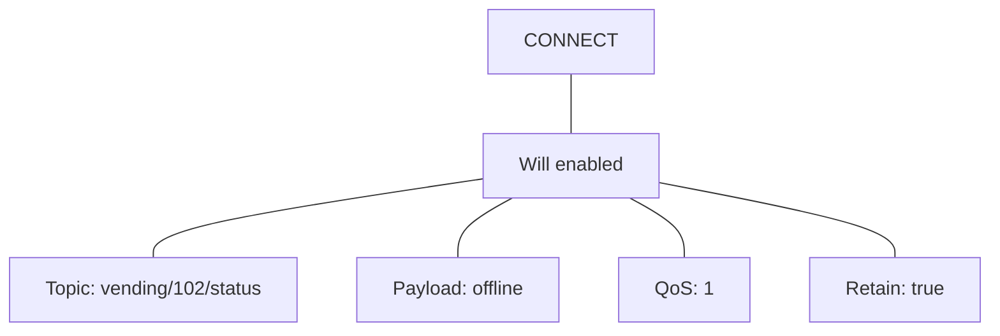
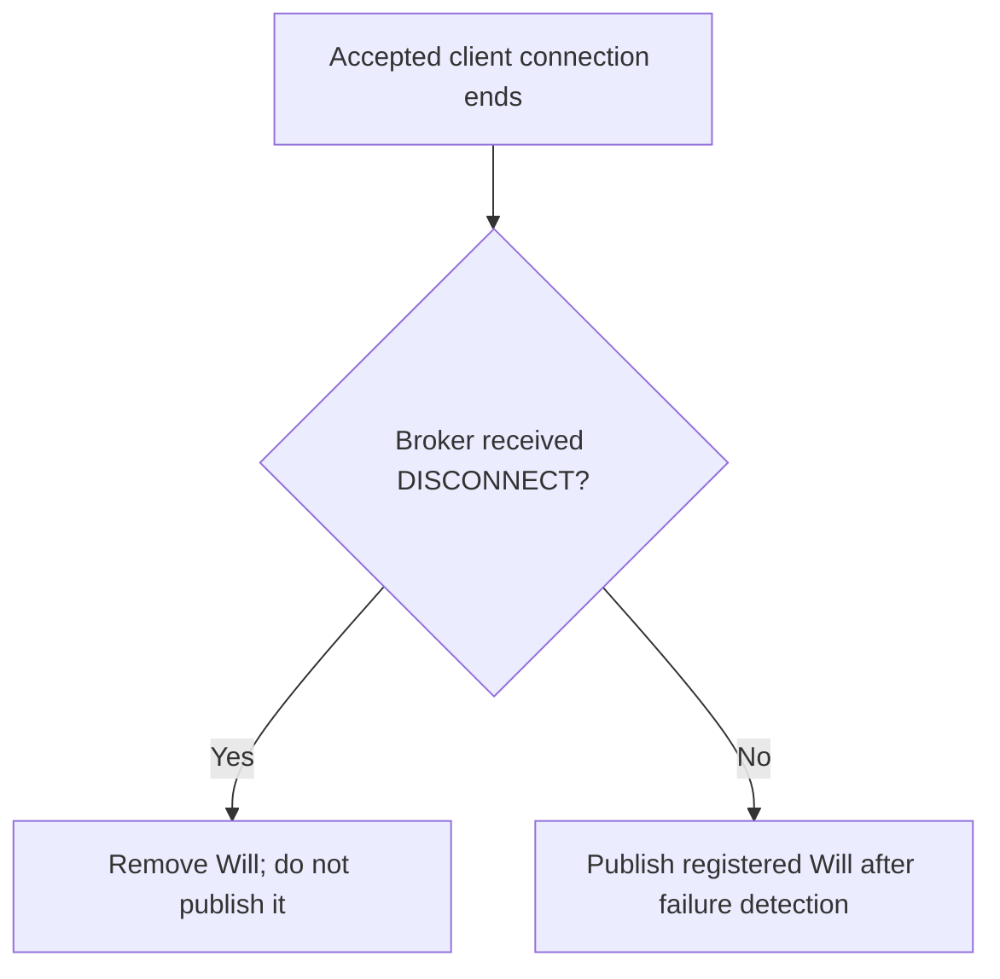
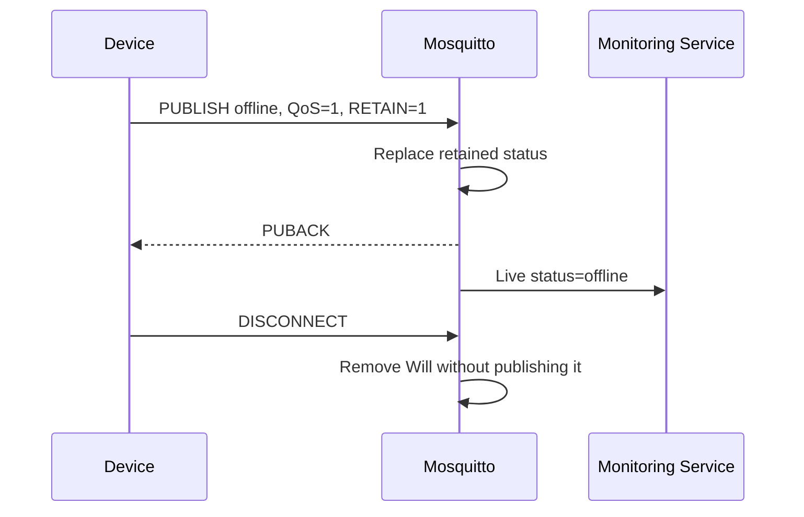

# 📡 MQTT Last Will and Testament

[[Brokers/MQTT/HiveMQ 3.1.1/0. MQTT Table of Contents|📚 MQTT Table of Contents]]

> [!toc]- 📑 Contents
>
> - [[#🌐 Let the Broker Speak When a Client Cannot|🌐 Let the Broker Speak When a Client Cannot]]
> - [[#📦 Configure the Will in CONNECT|📦 Configure the Will in CONNECT]]
> - [[#⚡ When the Broker Publishes the Will|⚡ When the Broker Publishes the Will]]
> - [[#💓 Detection Takes Time|💓 Detection Takes Time]]
> - [[#🟢 Build an Online and Offline Status Topic|🟢 Build an Online and Offline Status Topic]]
> - [[#🦟 Mosquitto Last Will Lab|🦟 Mosquitto Last Will Lab]]
> - [[#🧪 Understanding Check|🧪 Understanding Check]]
> - [[#🔨 Hands-On Practice|🔨 Hands-On Practice]]
> - [[#📋 Quick Reference|📋 Quick Reference]]
> - [[#🧠 Things to Remember|🧠 Things to Remember]]
> - [[#💡 Pro Tips|💡 Pro Tips]]
> - [[#🔗 Related Topics|🔗 Related Topics]]

## 🌐 Let the Broker Speak When a Client Cannot

A **Last Will and Testament (LWT)** is a message a client asks the broker to publish if its connection ends unexpectedly. The client prepares the message when connecting; the **broker** sends it when the failure is detected.

This lesson uses **MQTT 3.1.1** and **Eclipse Mosquitto**.

> [!example] 💡 A Vending Machine Loses Power
>
> The machine normally reports `online` on `vending/102/status`.
>
> - 📝 **Prepared Will:** publish `offline` on the same topic.
>
> - ⚡ **Failure:** the machine loses power and cannot send a final message.
>
> - 🖥️ **Broker:** detects the lost connection and publishes the Will.
>
> - 📬 **Monitoring service:** receives `offline` through its subscription.

The Will payload is application-defined. MQTT does not automatically choose `offline`, explain the cause, or send an email; subscribers decide what to do with the notification.

```mermaid
sequenceDiagram
    participant D as Vending Machine
    participant B as Mosquitto
    participant M as Monitoring Service
    M->>B: SUBSCRIBE vending/102/status
    B-->>M: SUBACK
    D->>B: CONNECT with Will: status=offline
    B-->>D: CONNACK: accepted
    D->>B: PUBLISH status=online
    B->>M: status=online
    Note over D: Power lost; cannot send DISCONNECT
    B->>B: Detect connection failure
    B->>M: Publish Will: status=offline
```

---

## 📦 Configure the Will in CONNECT

The client includes Will information in the **CONNECT packet**. Names such as `lastWillTopic` are library configuration names; the wire protocol uses Will flags and payload fields.

| Setting | Purpose | Example |
|---|---|---|
| Will enabled | Register a Will for this connection | `true` |
| `lastWillTopic` | Exact topic used for the publication | `vending/102/status` |
| `lastWillMessage` | Application payload | `offline` |
| `lastWillQos` | Publication QoS | `1` |
| `lastWillRetain` | Store the published Will as retained state | `true` |



Registering the Will does **not** publish it immediately. Will Retain takes effect when the broker publishes the Will, rather than when CONNECT arrives. To change the Will in MQTT 3.1.1, reconnect with new settings.

Will QoS describes the broker's publication. Each subscriber's granted QoS still affects its delivery, as explained in [[6. Quality of Service Levels|lesson 6]].

---

## ⚡ When the Broker Publishes the Will

| Situation | MQTT 3.1.1 Will behavior |
|---|---|
| Broker detects an I/O error or network failure | Publish the registered Will |
| Client stops communicating beyond the Keep Alive timeout | Close the connection and publish the Will |
| Client closes the network connection without DISCONNECT | Publish the Will |
| Broker closes the connection because of a protocol error | Publish the Will |
| Broker receives a normal DISCONNECT | Remove the Will without publishing it |

These rules apply after the connection has been accepted and a Will registered. They do not require `CleanSession = false`. [MQTT 3.1.1: Will and DISCONNECT rules](https://docs.oasis-open.org/mqtt/mqtt/v3.1.1/os/mqtt-v3.1.1-os.html)



Closing a TCP socket and sending MQTT DISCONNECT are different actions. A process can disappear with its socket closed but without sending the MQTT packet that suppresses its Will.

---

## 💓 Detection Takes Time

A broken connection is not always immediately visible to the broker. A reported socket error may be detected quickly; a silent network failure may require a timeout.

For a nonzero Keep Alive value, MQTT 3.1.1 requires the broker to disconnect a client if it receives no MQTT Control Packet within **1.5 × Keep Alive**.

For `Keep Alive = 10 seconds`:

1. Multiply: `10 × 1.5 = 15`.

2. The timeout is **15 seconds since the last Control Packet received by the broker**.

3. If that timeout reveals a failed connection, the registered Will is published.

This is not a promise of exactly 15 seconds after the physical failure. The broker may detect an error earlier. With Keep Alive set to zero, that inactivity timeout is disabled. [MQTT 3.1.1: Keep Alive](https://docs.oasis-open.org/mqtt/mqtt/v3.1.1/os/mqtt-v3.1.1-os.html)

An idle but healthy client sends `PINGREQ` as needed; having no application publications is not itself a failure.

---

## 🟢 Build an Online and Offline Status Topic

Use one topic for the device's connection status, with a retained value for new dashboards.

| Stage | Who publishes? | Payload | Retain? |
|---|---|---|---|
| Connection accepted | Device | `online` | Yes |
| Unexpected disconnect detected | Broker, using the Will | `offline` | Yes |
| Planned shutdown | Device, before DISCONNECT | `offline` | Yes |

The application should configure the retained `offline` Will **before connecting**, then publish retained `online` after successful connection acceptance.

### 🚪 Handle Planned Shutdown Explicitly

A graceful DISCONNECT suppresses the Will. It does not automatically replace retained `online` with `offline`.



For planned shutdown, wait for the offline publication to complete before disconnecting. On reconnect, publish `online` again. [[8. MQTT Retained messages|Lesson 8]] explains why the latest retained value also initializes new subscribers.

### 🔎 Status Describes the Broker's View

`offline` means the broker detected that this MQTT connection ended unexpectedly. It does not identify whether power, Wi-Fi, a process crash, or another cause was responsible.

Likewise, an active MQTT connection does not prove the device's business functions are healthy. Monitor application behavior separately when needed. If the broker itself is unavailable, observers cannot receive its Will publications at that moment.

---

## 🦟 Mosquitto Last Will Lab

Use [[3. MQTT Client–Broker Setup and Connection Flow#🦟 Shared Mosquitto Lab|the shared local broker]] at `127.0.0.1:18883`. Keep it running. This exercise uses a disposable topic: `lab/lwt/vending/102/status`.

### 1. Watch the Status Topic

In **Terminal A**:

```bash
mosquitto_sub -h 127.0.0.1 -p 18883 -V mqttv311 -t 'lab/lwt/vending/102/status' -q 1 -v
```

Keep the observer running. If this is a repeat experiment, an old retained status may appear first.

### 2. Connect a Client with a Will

In **Terminal B**, using Bash or Zsh:

```bash
mosquitto_sub -h 127.0.0.1 -p 18883 -V mqttv311 \
  -i labVending102 -k 10 -t 'lab/lwt/vending/102/commands' -q 1 -d \
  --will-topic 'lab/lwt/vending/102/status' \
  --will-payload 'offline' --will-qos 1 --will-retain &
lwt_client_pid=$!
```

Wait for successful CONNACK and SUBACK in its debug output before continuing.

| Option | Purpose |
|---|---|
| `-i labVending102` | Identify the simulated device client |
| `-k 10` | Request a 10-second Keep Alive |
| `--will-topic` | Set the publication topic |
| `--will-payload` | Set the message content |
| `--will-qos 1` | Publish the Will at QoS 1 |
| `--will-retain` | Retain the Will when it is published |
| `&` and `$!` | Run in the background and capture this process's PID |

Although this client is subscribing to commands, it can register a Will. A Will is not limited to publisher clients. [Mosquitto subscriber and Will options](https://mosquitto.org/man/mosquitto_sub-1.html)

### 3. Announce Online

Still in Terminal B:

```bash
mosquitto_pub -h 127.0.0.1 -p 18883 -V mqttv311 \
  -t 'lab/lwt/vending/102/status' -q 1 -r -m 'online'
```

✅ Terminal A shows `online`. This separate CLI publication simulates the device application's normal status publication; the Will client does not announce online automatically.

### 4. Simulate a Process Crash

Run in the **same Terminal B** where the PID was captured:

```bash
kill -KILL "$lwt_client_pid"
```

`SIGKILL` terminates that specific lab client without allowing it to send DISCONNECT. It does not stop the broker or observer.

✅ Terminal A should receive `offline` after Mosquitto detects the closed connection. A local process kill can be detected quickly; this does not test the silent-network Keep Alive timeout.

### 5. Check the Retained Will

In Terminal B:

```bash
mosquitto_sub -h 127.0.0.1 -p 18883 -V mqttv311 \
  -t 'lab/lwt/vending/102/status' -q 1 -v -C 1
```

✅ The fresh subscription receives retained `offline` and exits. `-C 1` stops after one message. [Subscriber message-count option](https://mosquitto.org/man/mosquitto_sub-1.html)

### 6. Compare a Graceful Disconnect

Run the Will client from step 2 again **without `&` or the PID assignment**, so it stays in the foreground. After connection acceptance, use **Terminal C** to repeat the `online` publication from step 3.

Press **Ctrl+C** in Terminal B. Check its debug output for sending DISCONNECT.

✅ No Will-generated `offline` should follow. The retained value remains `online`, demonstrating why a planned shutdown must publish its own offline status first.

For a correct planned shutdown, reconnect this client, publish retained `offline` from Terminal C, then press Ctrl+C in Terminal B. In a real device, its application performs both operations.

### 🧹 Clean Up

After stopping the simulated device, remove the retained lab status:

```bash
mosquitto_pub -h 127.0.0.1 -p 18883 -V mqttv311 \
  -t 'lab/lwt/vending/102/status' -q 1 -r -n
```

`-r -n` sends a retained zero-byte payload to clear the snapshot. Stop the observer with Ctrl+C. [Publisher options](https://mosquitto.org/man/mosquitto_pub-1.html)

---

## 🧪 Understanding Check

**Q1:** Who sends the offline Will when the vending machine loses power?

**Q2:** Does registering a retained Will immediately change the topic's retained value?

**Q3:** Why can a graceful shutdown leave retained `online` behind?

**Q4:** Does Will QoS 1 make connection-failure detection instant?

**Q5:** Does receiving `offline` tell you why the machine disconnected?

> [!answer]- 📋 Answers
>
> **A1:** The broker, using the message registered by the device in CONNECT.
>
> **A2:** No. The Will is retained when it is published, not when it is registered.
>
> **A3:** DISCONNECT suppresses the Will but does not update the retained status. The application must publish `offline` before disconnecting.
>
> **A4:** No. QoS controls delivery; failure detection depends on network errors and connection monitoring.
>
> **A5:** No. It indicates the broker's view of the connection; the cause requires additional investigation.

## 🔨 Hands-On Practice

### 🏷️ Compare a Non-Retained Will

1. Repeat the crash experiment without `--will-retain`.

2. Observe the existing status subscriber, then start a fresh subscriber.

✅ The existing subscriber receives live `offline`. A fresh subscriber still sees retained `online`, because the non-retained Will did not replace it. Clear the lab status afterward.

### 💓 Calculate a Timeout

1. A client requests Keep Alive of 20 seconds.

2. Its last MQTT Control Packet reaches the broker at `12:00:00`.

3. Calculate when the broker must disconnect it if no more Control Packets arrive and no earlier network error is detected.

> [!answer]- ✅ Expected Result
>
> `20 × 1.5 = 30 seconds`, giving a timeout at `12:00:30`. This is measured from the last received Control Packet, rather than from the last temperature reading.

### 📋 Quick Reference

| Concept | Remember |
|---|---|
| Will registration | Included in CONNECT |
| Will publication | Broker sends it after unexpected connection loss |
| Normal DISCONNECT | Suppresses the Will in MQTT 3.1.1 |
| Will Retain | Saves the Will as topic state when published |
| Will QoS | Controls publication delivery, not detection speed |
| Online status | Client publishes it after connection acceptance |
| Planned offline status | Client publishes it before DISCONNECT |
| Nonzero Keep Alive timeout | `1.5 × Keep Alive` since the last received Control Packet |

### 🧠 Things to Remember

- The failed device does not have to send its own Will.

- Registration, publication, and retention are separate stages.

- Graceful shutdown needs explicit status handling.

- Connection status is useful, but it does not prove application health.

### 💡 Pro Tips

- **Use a unique device Client ID.** Reusing an ID for another active client can disconnect the first one and disturb status tracking.

- **Scope topic permissions to the device.** Permit its own status and Will topic rather than every device's status.

- **Choose a useful Keep Alive interval.** Balance detection speed with network reliability and traffic.

- **Test both shutdown paths.** A crash test alone misses stale retained status after graceful disconnect.

### 🔗 Related Topics

- [[3. MQTT Client–Broker Setup and Connection Flow|CONNECT, Keep Alive, and Client Identity]]

- [[6. Quality of Service Levels|Will Delivery QoS]]

- [[7. Persistent Sessions & Queueing|Client Sessions and Offline Deliveries]]

- [[8. MQTT Retained messages|Retained Online and Offline Status]]

- [[Brokers/MQTT/basics#Wills|MQTT Basics: Wills]]
