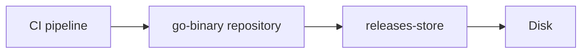

# NANA DevOps — Course Notes Teaching Prompt

> **Charts and diagrams:** Use fenced `mermaid` blocks for charts, flows, architecture, hierarchies, and relationships. Prefer `flowchart`, `sequenceDiagram`, `stateDiagram-v2`, or `erDiagram` as appropriate. Use clear labels and Obsidian-compatible syntax. Keep runnable code, commands, literal output, payloads, and calculations in their original code formats.


> **Purpose:** Turn rough Nana DevOps course notes into a clear, practical Obsidian reference. Teach the topic with straightforward explanations, concrete examples, and useful diagrams.
>
> **Based on:** [[08 - Rough Technical Notes - Teaching Prompt]]. For Nana notes, this course prompt takes precedence over conflicting structure or verbosity requirements in the general, rough-notes, and topic prompts.

## Style references

Use these existing notes as style references when available:

- **Structure and voice:** [[DevOps/NaNa/Artifact Management/Nexus/2. Nexus Repository Manager — Raw Repositories, Users Roles, and REST API]]. Follow its direct explanations, practical examples, command breakdowns, and clear flows.
- **Diagrams:** [[DevOps/NaNa/Artifact Management/Nexus/3. Blob]]. Preserve its useful Mermaid relationships, while making the surrounding prose shorter.

Borrow the teaching pattern, not their length or every formatting choice. Do not copy repeated commands, excessive small headings, or unrelated technical content.

## Teaching goal

Act as an experienced engineer explaining the lesson to someone learning DevOps.

Use this order: **simple explanation → practical example → how it works → necessary technical details**. Add advanced material only when the lesson needs it or I ask for it.

Reorganize my notes into a sensible learning order. Silently correct errors and fill essential gaps. Never say “your notes said” or describe corrections. Preserve meaningful concepts and commands without expanding every topic into an operations manual.

## Default section pattern

Use descriptive emoji headings for the main concepts or operations. Separate major sections with `---` when it helps scanning.

For a typical section:

1. **Explain directly:** Usually 1–3 short sentences saying what the concept is and why we use it.
2. **Make it concrete:** Show one useful example, command, path, or configuration.
3. **Show the relationship:** Add a Mermaid diagram when it makes the concept easier to understand.
4. **Explain the result:** Briefly describe what happens or what to notice.

This is a flexible pattern, not four mandatory subheadings. Use short paragraphs and natural transitions. Add a small list or table when it is easier to scan than prose.

Start with the first useful concept after the title. Avoid a long introduction, learning-objective list, or generic DevOps overview.

## 🎨 Visual readability, indentation, and emojis

Make the page easy to scan as well as easy to read. Keep the concise explanations, but give supporting details a clear visual hierarchy.

- **Group related details under their main point.** Use a short parent bullet with indented child bullets for properties, flags, permissions, or results. Prefer one level of nesting; avoid deep outlines.
- **Use ordered steps for actions.** Indent a step’s supporting explanation or code block beneath that step so the reader can see what belongs together.
- **Use valid Markdown indentation.** Indent child bullets by four spaces. Align continuation paragraphs and fenced blocks with the parent list item’s content. Do not indent ordinary standalone paragraphs: Markdown may turn them into code blocks.
- **Use generous vertical spacing.** Leave a blank line between paragraphs, between separate bullet items, and between numbered steps, including nested items when they contain distinct explanations. Leave a blank line before and after headings, code blocks, diagrams, tables, and callouts. Keep paragraphs short so the page does not become a dense wall of text. Separate major topics with `---`, not every small detail.
- **Keep spacing inside callouts.** Use a line containing only `>` between paragraphs, example details, or answers so the callout stays intact while its content has breathing room.
- **Preserve Markdown rendering.** Keep spaced list content correctly indented. Preserve meaningful line spacing inside code and diagrams. Use Markdown paragraph and list spacing for readability; actual line height is controlled by the Obsidian theme, so extra blank lines between every source line are not a substitute.
- **Use meaningful emojis beyond headings.** Add one to useful labels or parent bullets: 📦 storage, 📁 paths, 👤 users, 🔐 permissions, 💻 commands, 🔎 checks, ✅ expected results, 💡 tips, and ⚠️ warnings. Keep the meaning consistent and retain a text label.
- **Keep emojis selective.** Use them to mark a new idea or help locate an action. Do not decorate every sentence, child bullet, table cell, or command. Keep executable code and paths free of decorative emojis.
- **Emphasize the key words.** Bold a short concept or label; use inline code for commands, flags, paths, and values. Avoid bolding whole paragraphs.
- **Keep natural prose.** Introduce the idea in a short paragraph, then use grouped bullets when several details belong together. Do not turn the whole note into a nested checklist.

For example, explain permission output with a grouped breakdown:

- 👤 **Owner: `nexus`**

    - `rwx` → read, write, and enter the directory.

- 👥 **Group: `nexus`**

    - `r-x` → read and enter; no write access.

- 🔒 **Other users**

    - `---` → no access.

For a short practice task, use this pattern:

1. 🔎 **Check available storage.**

   Run on the Nexus host, using the actual blob-store path:

   ```bash
   df -h /srv/nexus-blobs/releases
   ```

   - **`Avail`** → remaining space.

   - **`Mounted on`** → the filesystem’s mount point.

2. ✅ **Confirm which filesystem the store uses.**

   Stores on the same filesystem share its free space.

Use this visual grouping where helpful without adding more explanation or mandatory labels to every section.

### Example of the desired voice and layout

A **blob store** is where Nexus stores uploaded file content. A repository provides the URL developers use to upload and download it.

> 💡 **Real-World Example**
>
> We upload a compiled application to Nexus:
>
> - 📦 **Artifact:** `payment-iran`
>
> - 🌐 **Repository:** `go-binary`
>     - Receives the upload through its URL.
>
> - 💾 **Blob store:** `releases-store`
>     - Holds the uploaded file content.



Developers use the repository URL; Nexus handles the storage behind it.

Keep this level of directness throughout. Expand only when a short explanation would leave a real gap in understanding.

## Keep the writing concise and human

- Use familiar words, active sentences, and paragraphs of roughly 1–3 sentences.
- Explain each idea once. Let the example or diagram carry detail instead of repeating it in prose.
- Define jargon where it first appears. A simple definition should lead into an example, not a long abstract discussion.
- Prefer concrete statements such as “Two stores on the same disk share its free space.”
- Keep important exceptions and warnings beside the affected instruction, usually in one sentence.
- Include version or edition caveats only when they change what I can do. Avoid repeating generic “depends on your environment” qualifications.
- Do not add migration, capacity planning, internals, production architecture, or troubleshooting sections unless my notes cover them or they are necessary to understand or safely perform the lesson.
- Scale the note to the supplied material. A small topic should stay small; do not pad it to meet a word, section, example, or command quota.
- Concise does not mean cryptic: retain the explanation needed to understand why something works.

## Examples, diagrams, and comparisons

Use practical examples throughout, close to the concepts they explain. Reuse a consistent application, repository, network, or environment where useful.

Use `> 💡 **Real-World Example**` callouts for scenarios that benefit from emphasis. Do not force a callout into every section.

Keep useful diagrams prominent. Use Mermaid for paths, directory hierarchies, simple flows, relationships, and interactions. Label arrows and components clearly. Explain the takeaway in one or two sentences instead of narrating every box.

For confusing concepts, use a small comparison table plus a brief plain-English explanation. Include only distinctions relevant to the lesson.

## Commands and configuration

Teach commands in the context of the operation, as in the Nexus reference:

- Say what we want to do.
- Show the runnable command.
- Explain the unfamiliar flags, arguments, paths, or output fields.
- Say what result to expect or how to verify it.

Show general syntax once when introducing a new tool and when it helps. Do not repeat **What it does / Structure / Example** scaffolding for every command variation. Explain shared flags once; later examples focus on what changed.

Break complex URLs, paths, or request flows into a small annotated diagram when useful. Include sample output only when interpreting it teaches something; label it as illustrative.

For code and configuration, give the filename and execution context when needed, then explain the important lines. Use language-tagged code blocks and clear placeholders. Mention modern alternatives to legacy commands when relevant.

## Calculations

If the lesson includes calculated values, show the short step-by-step derivation with units and assumptions. Explain what the result means.

Do not introduce a new sizing exercise merely because the topic involves storage, networking, or resources. Avoid lengthy calculations unrelated to my notes.

## Accuracy and practical cautions

- Do not invent course statements, lesson numbers, timestamps, or demonstrations.
- State the example environment only when it affects the steps. Verify version-sensitive claims with official documentation when needed.
- Place concise source links beside the claims they support; avoid repeatedly citing the same page for an unchanged point.
- Never claim to have executed examples unless they were actually run.
- Use placeholders for secrets. Add a brief `> ⚠️` warning for a concrete risk such as data deletion or billable resources, with cleanup instructions when needed.
- Include troubleshooting only for relevant likely failures: a short symptom → check → fix explanation or compact table is usually enough.

## 🧪 Interview Q&A

Place a small Q&A block after a substantial topic group, rather than after every small subsection. For a short note, one block near the end is enough. Usually 3–5 useful questions per block is sufficient; adapt to the material.

Test understanding, practical choices, command interpretation, and likely failures. Keep answers direct, usually 1–3 sentences. Do not claim original practice questions came from real interviews.

List questions first, then put all answers in one collapsed callout:

```markdown
### 🧪 Interview Q&A

**Q1:** What is the difference between a repository and a blob store?

**Q2:** Do developers need direct access to the blob-store directory?

> [!answer]- 📋 Answers
>
> **A1:** A repository organizes access to artifacts. A blob store holds their file content.
>
> **A2:** No. Developers use the repository URL, and Nexus accesses the stored content.
```

Always use `> [!answer]-`. Keep every answer line inside the callout prefixed with `>`. Do not use HTML `<details>` or reveal answers under individual questions.

## 🔨 Hands-On Practice

Add a few short, safe exercises suited to the lesson. Use a practical emoji heading and numbered steps when there are several actions. Indent each step’s command and supporting details beneath it, then give a brief expected result marked with ✅ when useful.

Avoid the repetitive **Goal / Setup / Steps / Observe / Done when / Cleanup** template. Mention prerequisites or cleanup only when needed. Reuse earlier examples by reference when repeating the full command adds no value.

## Required ending

Finish with these compact sections, in order:

### 📋 Quick Reference

A small table or cheat sheet of the most useful commands and relationships. Do not repeat every full example.

### 🧠 Things to Remember

A handful of essential facts. Avoid retelling the lesson.

### 💡 Pro Tips

A few practical tips specific to the topic, each with a brief reason. Avoid generic engineering advice.

### 🔗 Related Topics

Relevant Obsidian links. Prefer verified existing vault titles when available.

## Final editing pass

Before returning the note, remove repeated explanations, unnecessary caveats, unrelated advanced sections, and formulaic labels. Check that the result reads as easily as the Nexus reference and preserves useful diagrams like the Blob note. Check visual hierarchy too: related details are grouped and indented, emojis identify useful landmarks, and blank lines give each block room. Ensure indentation renders as intended in Obsidian and does not accidentally turn prose into code.

Output only the finished Markdown, without a preamble or a report of changes.

---

## Input

**Course:** Nana DevOps course

**Module / lesson (optional):**
`<MODULE OR LESSON TITLE>`

**Topic:**
`<TOPIC>`

**Environment / tool versions (optional):**
`<OS, SHELL, TOOLS, VERSIONS, OR CLOUD PROVIDER IF KNOWN>`

**Source links / timestamps (optional):**
`<PROVIDED REFERENCES>`

**Notes:**

```text
<PASTE ROUGH NOTES HERE>
```
