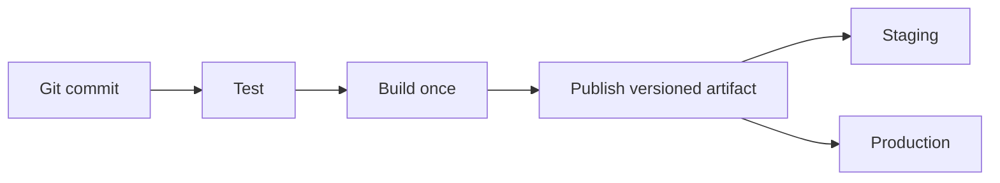

# 📦 Artifact Management

[[DevOps/NaNa/0. Nana DevOps Table of Contents|📚 Nana DevOps Table of Contents]]

An **artifact** is an output we distribute or deploy: a compiled binary, container image, firmware file, or package. Git stores the source; an artifact registry stores the built result.

Staging and production should receive the same tested artifact. Rebuilding separately can produce different results even from the same source commit.

## 🧭 Choose a Learning Path

### Gitea

Use this path to publish images and binaries alongside projects already hosted in Gitea.

| Reference | Focus |
|---|---|
| [[DevOps/NaNa/Artifact Management/Gitea/1 - Packages and Artifact Management\|1. Packages and Artifact Management]] | Ownership, repository links, package types, binaries |
| [[DevOps/NaNa/Artifact Management/Gitea/2 - Docker Container Registry\|2. Docker Container Registry]] | Login, tag, push, pull, digests, deployment |
| [[DevOps/NaNa/Artifact Management/Gitea/3 - Build and Publish Images with CI\|3. Build and Publish Images with CI]] | Secrets, runner requirements, automatic publishing and linking |
| [[DevOps/NaNa/Artifact Management/Gitea/4 - Storage Cleanup and Troubleshooting\|4. Storage, Cleanup, and Troubleshooting]] | Physical storage, capacity, retention, common failures |

### Nexus

Use this path to learn a dedicated artifact manager, including hosted, proxy, and group repositories.

| Reference | Focus |
|---|---|
| [[DevOps/NaNa/Artifact Management/Nexus/1. Artifact and Artifact Repo\|1. Artifacts and Artifact Repositories]] | Artifact concepts and Nexus repository types |
| [[DevOps/NaNa/Artifact Management/Nexus/2. Nexus Repository Manager — Raw Repositories, Users Roles, and REST API\|2. Raw Repositories, Users, Roles, and REST API]] | Publish and retrieve binaries |
| [[DevOps/NaNa/Artifact Management/Nexus/3. Blob\|3. Blob Stores]] | Repository content and underlying storage |
| [[DevOps/NaNa/Artifact Management/Nexus/4. Cleanup Policy\|4. Cleanup Policies]] | Retention and reclaiming space |

## 🔀 Gitea or Nexus?

| Need | Practical choice |
|---|---|
| Publish your team's Docker images from Gitea CI | Start with Gitea's container registry |
| Distribute binaries, ZIPs, or firmware | Gitea Generic packages or Nexus Raw repositories |
| Explore hosted/proxy/group dependency management | Follow the Nexus references |

Gitea's registry can cover internal publication without operating another service. Nexus offers dedicated repository-management features; choose it when those features solve a concrete requirement. Do not assume Gitea's hosted registry provides Nexus's proxy/group behavior. See [Gitea package formats](https://docs.gitea.com/1.27/usage/packages/overview/) and [Nexus formats](https://help.sonatype.com/en/formats.html).

### 💻 Server Resources

Sonatype's current **XS Nexus Repository profile** recommends **4 vCPU and 16 GiB RAM** for roughly 100 sustained requests per second. This is a workload profile, not a universal minimum for every learning installation. Database resources may be additional, and disk capacity depends on retained artifacts. [Nexus system requirements](https://help.sonatype.com/en/sonatype-nexus-repository-system-requirements.html)

Gitea has different resource needs. If Git hosting, database, CI builds, and applications share a server, include all of them in the resource budget. The [[DevOps/NaNa/Artifact Management/Gitea/4 - Storage Cleanup and Troubleshooting|Gitea storage reference]] explains CPU, RAM, and disk inspection commands.

### 📋 Quick Reference

| Relationship | Meaning |
|---|---|
| Git → build | Source becomes an artifact |
| CI → registry | Publish a reusable result |
| Registry → deployment | Retrieve the selected result |

### 🧠 Things to Remember

- Publishing an image does not update running containers.

- Keep artifact identity traceable to its commit and CI run.

### 💡 Pro Tips

- Start with one successful manual upload before automating it.

- Keep production and rollback versions outside disposable-build cleanup rules.

### 🔗 Related Topics

- [[DevOps/NaNa/Docker/4. Docker Workflow in Real projects|Docker Workflow in Real Projects]]

- [[DevOps/NaNa/Docker/5. Docker Compose|Docker Compose]]
