# 📦 Artifacts, Artifact Repositories, and Nexus Repository

When software is developed, the source code is only the beginning.

At some point, the source code is **built into something that can actually be installed, deployed, or distributed**. That output is called an **artifact**.

A typical software delivery flow looks like this:

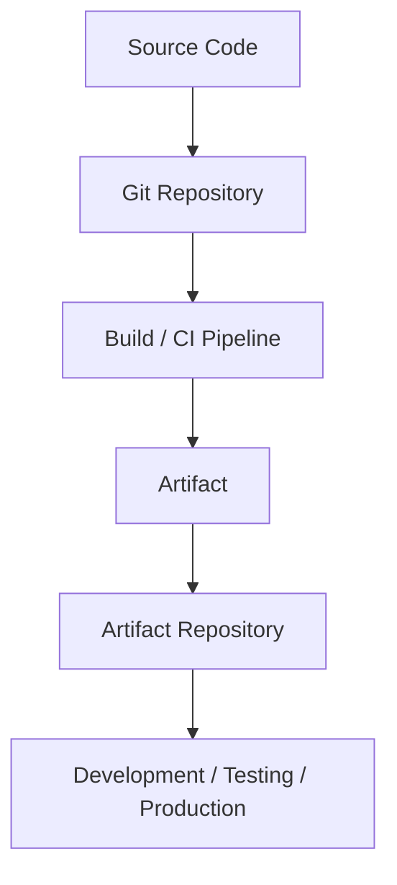

For example:

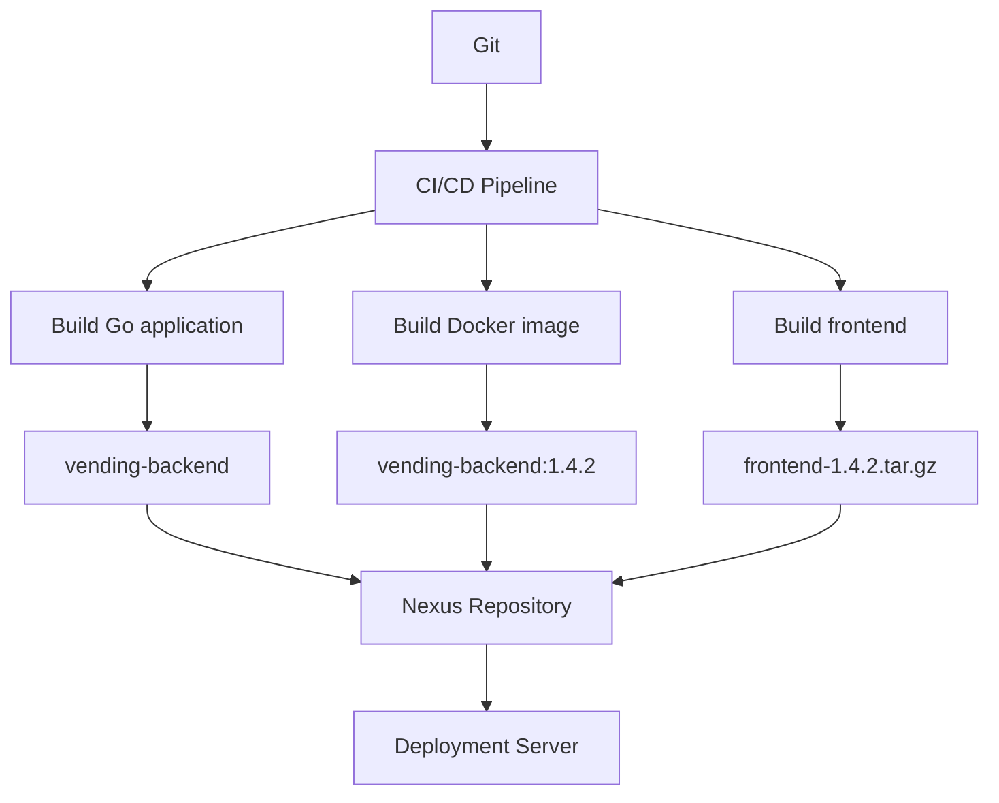

---

# 🌐 Artifact

An **artifact** is a file or package produced by the software development/build process that can later be stored, distributed, installed, or deployed.

The important distinction is:

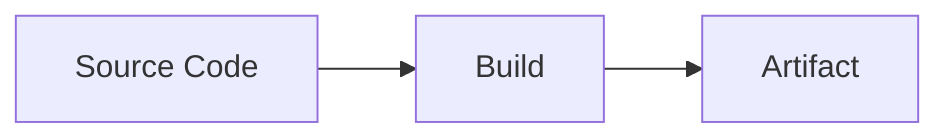

For example, this:

```
main.go
```

is source code.

After compiling:

```
go build -o vending-backend
```

the resulting:

```
vending-backend
```

binary is an artifact.

Artifacts can take many forms:

|Technology|Example Artifact|
|---|---|
|C/C++|executable binary, `.so`, `.a`|
|Go|compiled executable|
|Java|`.jar`, `.war`|
|Python|`.whl`, package|
|Node.js|npm package|
|Linux|`.deb`, `.rpm`|
|Docker|container image|
|Firmware|`.bin`, `.hex`|
|Frontend|`.zip`, `.tar.gz`, compiled static files|

> 💡 **Real-World Example**
> 
> Imagine your vending backend has version:
> 
> ```
> v1.5.0
> ```
> 
> Git contains the source code:
> 
> ```
> projects/vending-backend/
> ```
> 
> CI builds it:
> 
> ```
> go build -o vending-backend
> ```
> 
> The result:
> 
> ```
> vending-backend-1.5.0
> ```
> 
> is the artifact that can be deployed to servers.

An artifact does **not necessarily need to be one single file**.

For example, a Docker image consists internally of layers and metadata, but from the deployment perspective it behaves as a versioned deployable artifact:

```
robotmarket/vending-backend:1.5.0
```

---

# 🌐 Why We Need an Artifact Repository

You could technically build an application and manually copy it somewhere:

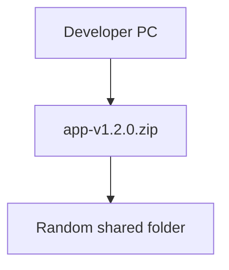

This quickly becomes difficult to manage.

Questions appear:

```
Which version is production using?

Where is version 1.3.2?

Who uploaded this file?

Can developers overwrite releases?

Which Docker image belongs to this Git commit?

Can we automatically delete builds older than 90 days?

Can CI download dependencies without accessing the Internet directly?
```

An **artifact repository** solves these problems.

It provides centralized storage and management for artifacts such as:

```
Application binaries
Docker images
npm packages
Maven packages
Python packages
Linux packages
Firmware images
Libraries
Build outputs
```

Instead of:

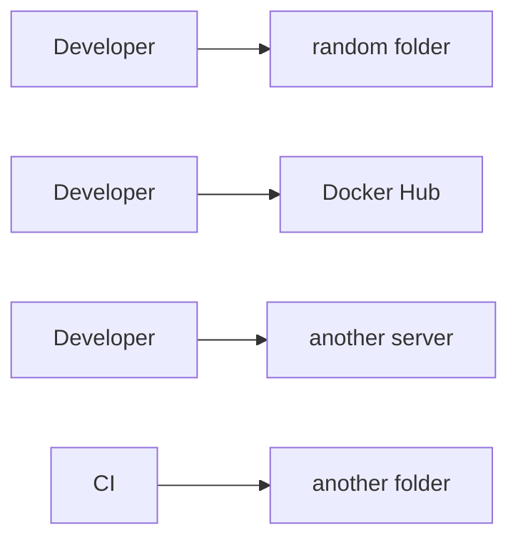

you can have:

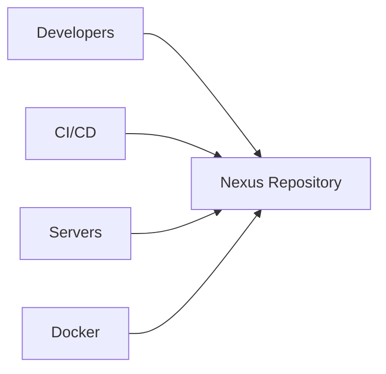

Nexus Repository supports multiple repository formats and the core repository types **hosted, proxy, and group**. [Sonatype Help](https://help.sonatype.com/en/formats.html?utm_source=chatgpt.com)

---

# 🌐 Nexus Repository

**Sonatype Nexus Repository** is an artifact repository manager.

It can store your company's artifacts and also act as an intermediary between developers and external repositories.

For example:

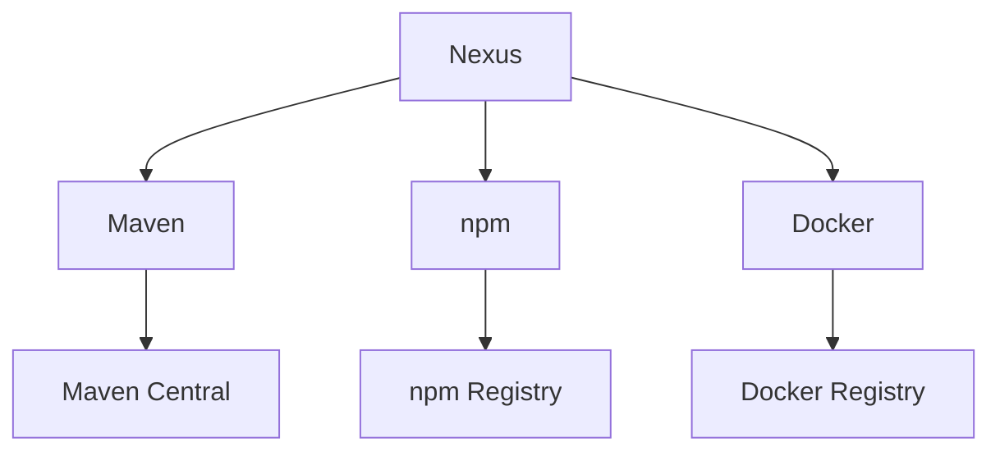

Nexus provides useful repository-management features such as:

- authentication
- users and roles
- repository-level permissions
- hosted repositories
- proxy repositories
- repository groups
- multiple package formats
- artifact retention and cleanup
- centralized dependency storage

Permissions can be restricted to particular repositories and operations such as read, browse, add, edit, or delete. [Sonatype Help](https://help.sonatype.com/en/privileges.html?utm_source=chatgpt.com)

---

# 🌐 The Three Important Nexus Repository Types

The most important Nexus concept to understand is:

```
Hosted
Proxy
Group
```

They solve three different problems.

---

## 🏠 Hosted Repository

A **hosted repository** stores artifacts that **you or your company publish**.

Think:

```
"This belongs to us."
```

For example:

```
vending-backend:1.0.0
vending-backend:1.1.0
device-firmware:2.3.1
robotmarket-ui:4.2.0
```

Architecture:

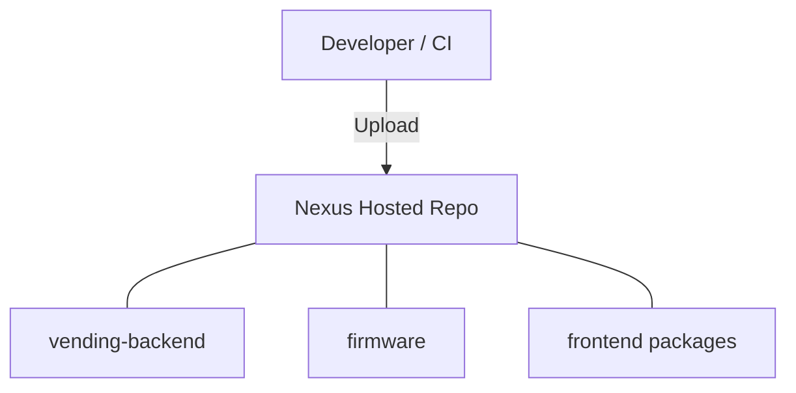

> 💡 **Real-World Example**
> 
> Your CI pipeline builds:
> 
> ```
> vending-backend-1.7.0.tar.gz
> ```
> 
> Instead of copying it manually to a production server, CI uploads it to:
> 
> ```mermaid
> flowchart TD
>     N0["Nexus"]
>     N1["vending-releases"]
>     N2["vending-backend"]
>     N3["1.7.0"]
>     N0 --- N1
>     N1 --- N2
>     N2 --- N3
> ```
> 
> The production deployment process can then download exactly version `1.7.0`.

Sonatype calls this repository type **Hosted**, not "Host". [Sonatype Help](https://help.sonatype.com/en/configurable-repository-fields.html?utm_source=chatgpt.com)

---

## 🌐 Proxy Repository

A **proxy repository** represents an external repository through Nexus.

For example:

```
npmjs.org
Maven Central
PyPI
Docker Registry
```

Instead of developers accessing them directly:

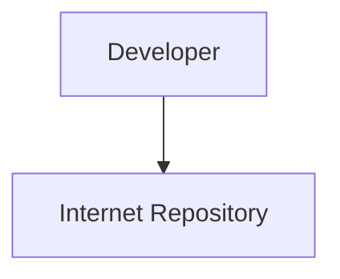

they use:

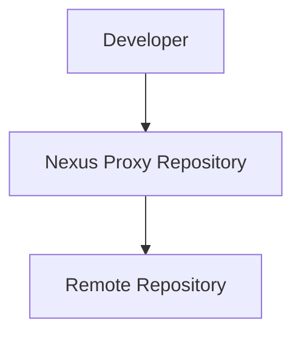

The useful part is caching.

Suppose a developer requests:

```
package-X version 2.4
```

The first request might look like:

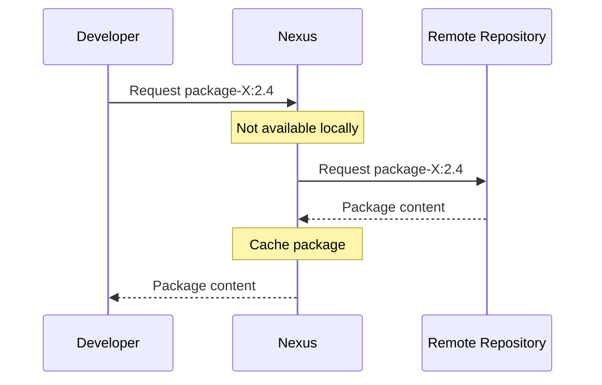

Later another developer requests the same package:

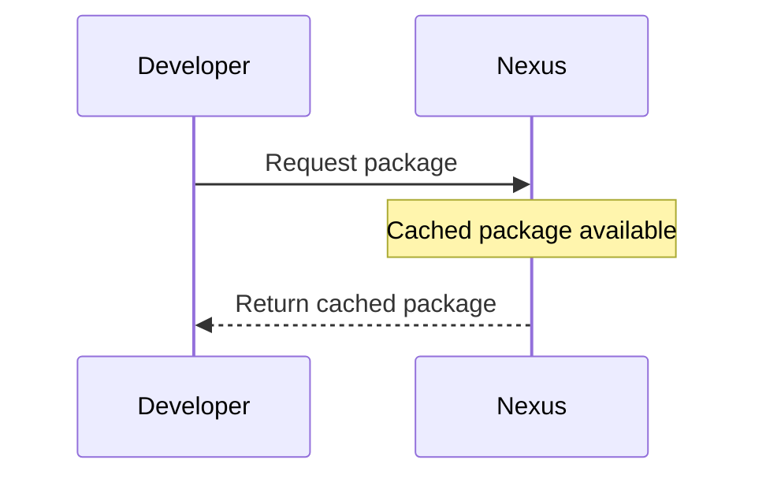

Nexus therefore reduces repeated downloads and gives the company a central point through which external dependencies can be accessed.

### Example

Instead of configuring Maven to use:

```
https://repo.maven.apache.org/
```

developers might use something similar to:

```
https://nexus.example.com/repository/maven-central/
```

Nexus knows that this proxy repository points toward Maven Central.

---

# 🌐 Why Proxy Repositories Are Useful

Caching is only one advantage.

A proxy repository also creates an organizational boundary:

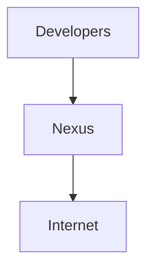

rather than:

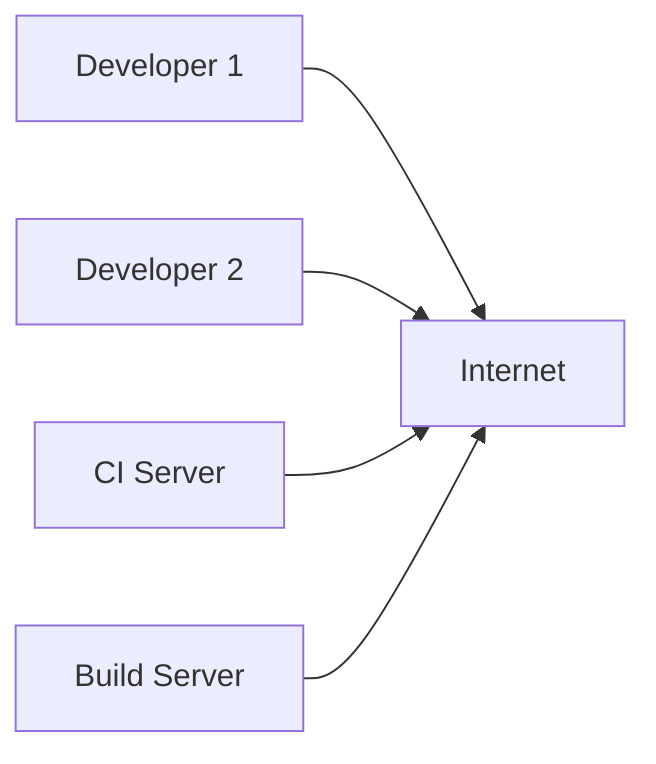

This can make dependency access more centralized and controllable.

> 💡 **Real-World Example**
> 
> Imagine 20 CI jobs repeatedly downloading a 500 MB dependency.
> 
> Without a proxy:
> 
> ```mermaid
> flowchart LR
>     N0["CI #1"]
>     N1["CI #2"]
>     N2["CI #3"]
>     N3["Internet"]
>     N0 -->|500 MB| N3
>     N1 -->|500 MB| N3
>     N2 -->|500 MB| N3
> ```
> 
> With Nexus:
> 
> ```mermaid
> sequenceDiagram
>     participant C as CI
>     participant N as Nexus
>     participant I as Internet
>     C->>N: First request
>     N->>I: Download 500 MB
>     I-->>N: Package content
>     N-->>C: Package content
>     C->>N: Later request
>     N-->>C: Return cached package
> ```
> 
> The dependency usually does not need to be downloaded from the upstream repository every time.

---

# 🌐 Hosted vs Proxy Repository

These two are easy to confuse.

|Hosted|Proxy|
|---|---|
|Stores your artifacts|Represents an external repository|
|Your CI uploads to it|Nexus downloads/cache artifacts from upstream|
|Used for internal packages/releases|Used for third-party dependencies|
|Example: company Docker images|Example: Docker Hub proxy|
|Example: company Maven library|Example: Maven Central proxy|

A simple rule:

```
Hosted = OUR artifacts

Proxy  = THEIR artifacts
```

---

# 🌐 Group Repository

A **group repository** combines several compatible Nexus repositories behind **one URL**.

Instead of developers configuring:

```
company-releases
company-snapshots
maven-central-proxy
third-party
```

separately, Nexus can expose:

```
maven-public
```

which represents several repositories.

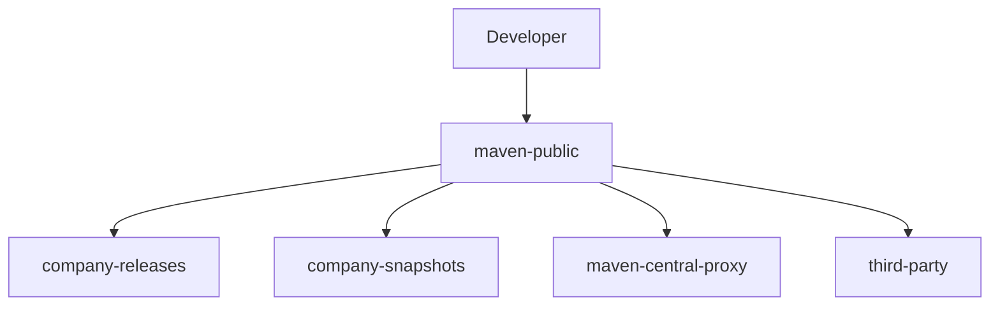

The developer only needs:

```
https://nexus.example.com/repository/maven-public/
```

rather than four repository URLs.

Nexus searches the repositories in the group according to their configured order, so group ordering can matter. [Sonatype Help](https://help.sonatype.com/en/repository-types.html?utm_source=chatgpt.com)

> 💡 **Real-World Example**
> 
> Suppose your Java project needs both:
> 
> ```
> robotmarket-device-sdk
> ```
> 
> which your company created, and:
> 
> ```
> spring-framework
> ```
> 
> from Maven Central.
> 
> You could configure:
> 
> ```mermaid
> flowchart TD
>     N0["maven-public"]
>     N1["maven-releases"]
>     N2["maven-snapshots"]
>     N3["maven-central-proxy"]
>     N0 --- N1
>     N0 --- N2
>     N0 --- N3
> ```
> 
> Maven only needs to know about `maven-public`.

---

# 🔗 How Hosted, Proxy, and Group Fit Together

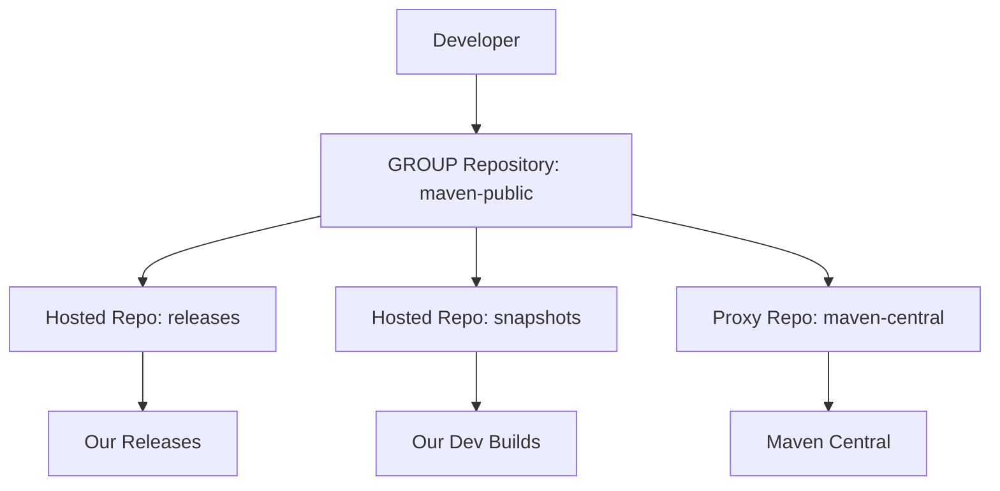

Think of the three types as:

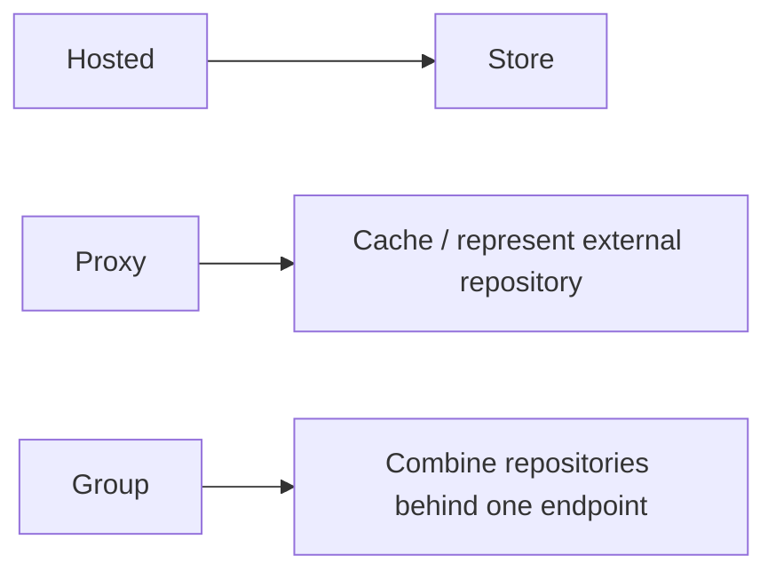

---

## 🧪 Interview Q&A

**Q1:** What is the main difference between source code and an artifact?

**Q2:** Why would a company use Nexus instead of storing build files in shared folders?

**Q3:** What is the difference between a hosted and proxy repository?

**Q4:** Why would developers use a group repository?

**Q5:** If an npm dependency is not cached by Nexus, what can a proxy repository do?

> [!answer]- 📋 Answers
> 
> **A1:** Source code is the code developers write. An artifact is an output created from the development/build process that can be distributed, installed, or deployed.
> 
> **A2:** Nexus provides centralized artifact storage, versioning workflows, access control, repository organization, cleanup policies, and support for package managers.
> 
> **A3:** A hosted repository contains artifacts published by your organization, while a proxy repository represents an external repository and caches artifacts retrieved from it.
> 
> **A4:** A group repository allows developers to access several repositories through one URL.
> 
> **A5:** Nexus can retrieve the requested dependency from its configured upstream repository, cache it, and return it to the client.

---

# 🌐 Organizing Company Artifacts

It is normally better not to throw every internal artifact into one giant repository.

Artifacts usually have different lifecycles.

For example:

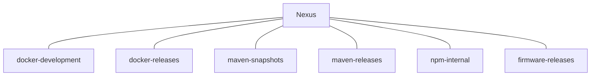

The exact structure depends on the package format and your workflow.

---

# 🌐 Snapshot / Development Builds

Development artifacts change frequently.

For example:

```
backend:1.8.0-dev
backend:1.8.0-feature-login
backend:1.8.0-SNAPSHOT
```

They usually have a shorter lifetime.

A CI system might generate many of them:

```
Build #100
Build #101
Build #102
Build #103
...
Build #850
```

Keeping all of these forever wastes storage.

So cleanup rules might eventually remove old development artifacts.

---

# 🌐 Release Artifacts

Release artifacts represent versions that have been intentionally released.

For example:

```
1.0.0
1.1.0
1.2.0
2.0.0
```

A useful engineering principle is:

> ⚠️ A published release should generally be treated as **immutable**.

If:

```
backend:1.3.0
```

has already been released, do not silently replace its contents with another build.

Instead publish:

```
backend:1.3.1
```

This makes deployments reproducible.

You want:

```
Version 1.3.0 today
=
Version 1.3.0 six months later
```

rather than having the same version point to changing software.

---

# 🌐 Development vs Snapshot vs Release

The exact naming depends on the ecosystem, but conceptually:

|Repository|Purpose|
|---|---|
|Development|Temporary/internal development builds|
|Snapshot|Continuously changing pre-release builds|
|Release|Stable versioned artifacts|

For example:

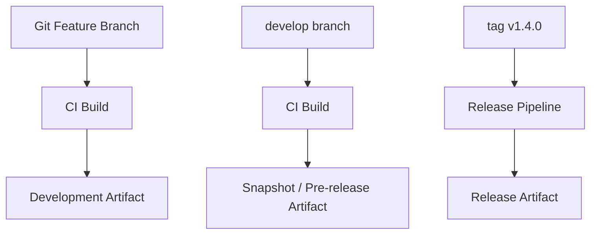

---

# 🌐 Cleanup Policies

Artifact repositories can become very large.

Imagine a CI pipeline creates:

```
100 MB per build
```

and runs:

```
20 builds/day
```

Storage consumption:

```
100 MB × 20
= 2,000 MB/day
≈ 2 GB/day
```

After 30 days:

```
2 GB × 30
= 60 GB
```

And that is just one project.

Therefore artifact repositories usually need retention or cleanup rules.

For example:

```mermaid
flowchart LR
    N0[""]
    N1["delete after 30 days"]
    N2[""]
    N3["retain recent versions"]
    N4[""]
    N5["retain according to release policy"]
    N0 --> N1
    N2 --> N3
    N4 --> N5
```

Nexus supports cleanup policies that can be associated with proxy and hosted repositories. [Sonatype Help](https://help.sonatype.com/en/cleanup-policies.html?utm_source=chatgpt.com)

> ⚠️ Be significantly more careful with cleanup rules on release repositories than with temporary CI artifacts.

---

# 🌐 Nexus Users, Roles, and Permissions

Nexus should not be treated as:

```
everyone = admin
```

Instead:

```mermaid
flowchart TD
    N0["User"]
    N1["Role"]
    N2["Privileges"]
    N3["Repositories / Nexus operations"]
    N0 --> N1
    N1 --> N2
    N2 --> N3
```

For example:

```mermaid
flowchart LR
    N0["developer"]
    N1["read artifacts"]
    N2["ci-publisher"]
    N3["read artifacts"]
    N4["upload artifacts"]
    N5["nexus-admin"]
    N6["administrative access"]
    N0 --> N1
    N2 --> N3
    N2 --> N4
    N5 --> N6
```

The principle is:

```
Give each account only the permissions it needs.
```

This is the **principle of least privilege**.

---

# 🌐 Two Different Nexus Users

There are two kinds of "users" that are easy to confuse.

## 1. Linux Nexus Service User

This is the operating-system account that runs Nexus itself.

For example:

```
nexus
```

Instead of:

```mermaid
flowchart TD
    N0["root"]
    N1["Nexus"]
    N0 --> N1
```

use:

```mermaid
flowchart TD
    N0["nexus"]
    N1["Nexus"]
    N0 --> N1
```

This limits what the Nexus process can access on the operating system if something goes wrong.

---

## 2. Nexus Application Users

These are accounts inside Nexus.

For example:

```
admin
developer
ci-publisher
deployment-server
```

They authenticate to the Nexus application and receive Nexus roles/privileges.

So:

```
Linux user "nexus"
        ≠
Nexus application user "developer"
```

They solve completely different problems.

---

# 🌐 Running Nexus Without Root

When manually installing Nexus on Linux, it is good practice to create a dedicated service account rather than running the application as `root`.

Conceptually:

```mermaid
flowchart TD
    N0["Linux"]
    N1["root"]
    N2["jonas"]
    N3["nexus"]
    N4["runs Nexus Repository"]
    N0 --- N1
    N0 --- N2
    N0 --- N3
    N3 --- N4
```

The Nexus installation and data directories that need to be accessed by Nexus must have appropriate ownership and permissions.

Common layouts can include an application directory and a separate Nexus data directory such as:

```
/opt/nexus/

/opt/sonatype-work/
```

The exact directories depend on the installation method and Nexus version.

---

### 💻 `useradd`

**What it does:**

Creates a Linux user.

A service account could be created with something similar to:

```
sudo useradd --system --create-home nexus
```

The exact options depend on your desired Linux configuration.

---

### 💻 `chown`

**What it does:**

Changes ownership of files/directories.

**Structure:**

```
chown [options] user:group path
```

For example:

```
sudo chown -R nexus:nexus /opt/nexus
sudo chown -R nexus:nexus /opt/sonatype-work
```

This gives the `nexus` service account ownership of those directories.

> ⚠️ Do not blindly run recursive `chown` commands on production systems. First verify which directories actually belong to the Nexus installation.

---

# 🌐 Do Not Store Nexus Credentials in Source Code

A CI/CD system may need a Nexus account such as:

```
ci-publisher
```

with permission to upload artifacts.

Its credentials should not be written directly inside:

```
Dockerfile
application code
Git repository
shell script committed to Git
```

Avoid:

```
NEXUS_PASSWORD=mySuperSecretPassword
```

inside a committed file.

Instead use your CI/CD secret mechanism or a secret manager.

Conceptually:

```mermaid
flowchart TD
    N0["Secret Manager / CI Secret"]
    N1["CI Pipeline"]
    N2["Nexus"]
    N0 --> N1
    N1 --> N2
```

The username itself may not always be secret, but passwords, API tokens, and other credentials should be protected.

---

# 🌐 Nexus with CI/CD

This is where an artifact repository becomes especially useful.

Consider this pipeline:

```mermaid
flowchart TD
    N0["Developer"]
    N1["Git Push"]
    N2["Gitea"]
    N3["CI Pipeline"]
    N4["Test"]
    N5["Build"]
    N6["Package"]
    N7["Nexus"]
    N8["Deployment"]
    N9["Production"]
    N0 --> N1
    N1 --> N2
    N2 --> N3
    N3 --> N4
    N4 --> N5
    N5 --> N6
    N6 --> N7
    N7 --> N8
    N8 --> N9
```

For example:

```mermaid
flowchart TD
    N0["Commit: a83f92e"]
    N1["CI builds: vending-backend-1.4.2"]
    N2["Nexus: vending-releases/vending-backend/1.4.2"]
    N3["Production downloads: vending-backend:1.4.2"]
    N0 --> N1
    N1 --> N2
    N2 --> N3
```

This gives you a traceable path:

```
Git Commit
    ↕
Version
    ↕
Artifact
    ↕
Deployment
```

That is much safer than rebuilding source code manually during deployment.

---

# 🌐 Nexus and Docker

Nexus can also be used as a Docker registry.

For your own images:

```mermaid
flowchart TD
    N0["Docker Build"]
    N1["Nexus Hosted Docker Repository"]
    N2["Deployment Server"]
    N0 --> N1
    N1 --> N2
```

For example:

```
vending-backend:1.0.0
vending-backend:1.1.0
vending-backend:1.2.0
```

You can also configure proxy repositories for remote container registries supported by your Nexus configuration.

Conceptually:

```mermaid
flowchart TD
    N0["Docker Client"]
    N1["Nexus"]
    N2["Hosted"]
    N3["Company Docker images"]
    N4["Proxy"]
    N5["External registry"]
    N0 --> N1
    N1 --> N2
    N2 --> N3
    N1 --> N4
    N4 --> N5
```

And a group can provide one endpoint over compatible Docker repositories.

---

# 🌐 Nexus and Different Languages

Nexus does not only store generic `.zip` files.

Repositories have a **format**.

Examples include:

```
Maven
npm
Docker
PyPI
NuGet
APT
Go
Raw
```

The available repository types can vary depending on the format. Nexus's current documentation lists supported formats and whether each supports proxy, hosted, and group repositories. [Sonatype Help](https://help.sonatype.com/en/formats.html?utm_source=chatgpt.com)

A company might therefore have:

```mermaid
flowchart TD
    N0["Nexus"]
    N1["Docker"]
    N2["docker-hosted"]
    N3["docker-proxy"]
    N4["docker-group"]
    N5["npm"]
    N6["npm-hosted"]
    N7["npm-proxy"]
    N8["npm-group"]
    N9["Maven"]
    N10["maven-releases"]
    N11["maven-snapshots"]
    N12["maven-central"]
    N13["maven-public"]
    N14["Raw"]
    N15["firmware-releases"]
    N0 --- N1
    N1 --- N2
    N1 --- N3
    N1 --- N4
    N0 --- N5
    N5 --- N6
    N5 --- N7
    N5 --- N8
    N0 --- N9
    N9 --- N10
    N9 --- N11
    N9 --- N12
    N9 --- N13
    N0 --- N14
    N14 --- N15
```

A **Raw repository** can be useful for arbitrary files that do not belong to a specialized package format.

For example:

```mermaid
flowchart TD
    N0["firmware/"]
    N1["vending-controller/"]
    N2["1.0.0/"]
    N3["firmware.bin"]
    N4["1.1.0/"]
    N5["firmware.bin"]
    N0 --- N1
    N1 --- N2
    N2 --- N3
    N1 --- N4
    N4 --- N5
```

---

# 🔗 Complete Example Architecture

A practical company setup might look like:

```mermaid
flowchart TD
    N0["Developers"]
    N1["Gitea"]
    N2["CI/CD Runner"]
    N3["Run Tests"]
    N4["Build App"]
    N5["Create Artifact"]
    N6["Nexus"]
    N7["Hosted Repos"]
    N8["Proxy Repos"]
    N9["Group Repos"]
    N10["releases"]
    N11["snapshots"]
    N12["Internet repositories"]
    N13["Single endpoint for developers"]
    N0 --> N1
    N1 --> N2
    N2 --> N3
    N2 --> N4
    N4 --> N5
    N5 --> N6
    N6 --> N7
    N6 --> N8
    N6 --> N9
    N7 --> N10
    N7 --> N11
    N8 --> N12
    N9 --> N13
```

For Docker:

```mermaid
flowchart TD
    N0["CI"]
    N1["docker-hosted"]
    N2["Nexus"]
    N3["Production Server"]
    N4["Application"]
    N0 -->|docker push| N1
    N1 --> N2
    N2 --> N3
    N3 -->|docker pull| N4
```

For dependencies:

```mermaid
flowchart TD
    N0["Developer"]
    N1["npm-group"]
    N2["npm-hosted"]
    N3["npm-proxy"]
    N4["npm registry"]
    N0 -->|npm install| N1
    N1 --> N2
    N1 --> N3
    N3 --> N4
```

---

## 🧪 Interview Q&A

**Q1:** Why should Nexus usually run under its own Linux account rather than `root`?

**Q2:** Is a Linux `nexus` user the same thing as a Nexus application account?

**Q3:** Why should release artifacts generally not be overwritten?

**Q4:** Why would temporary CI artifacts need cleanup policies?

**Q5:** Where should Nexus passwords or publishing tokens used by CI be stored?

> [!answer]- 📋 Answers
> 
> **A1:** Running Nexus under a dedicated account limits the operating-system permissions available to the Nexus process and follows the principle of least privilege.
> 
> **A2:** No. The Linux account controls the Nexus process at the OS level. Nexus application users control authentication and authorization inside Nexus Repository.
> 
> **A3:** An immutable release makes deployments reproducible. If `1.2.0` changes after publication, two deployments of "the same version" could contain different software.
> 
> **A4:** CI can produce hundreds or thousands of temporary builds, which can consume large amounts of storage if nothing removes them.
> 
> **A5:** In the CI/CD platform's secret storage or a dedicated secret-management system rather than inside source code.

---

# 🔨 Hands-On Practice

## Exercise 1 — Identify Artifacts

Suppose your project contains:

```
main.go
Dockerfile
README.md
backend
backend.tar.gz
robotmarket/backend:1.2.0
```

Try to identify which entries are source files and which can represent build/deployment artifacts.

> [!answer]- 📋 Answer
> 
> `main.go`, `Dockerfile`, and `README.md` belong to the source/project configuration.
> 
> `backend`, `backend.tar.gz`, and the Docker image `robotmarket/backend:1.2.0` can represent artifacts.

---

## Exercise 2 — Design Repositories

Imagine your company needs:

```
Internal Docker images
Docker Hub images
Internal Maven libraries
Maven Central dependencies
Firmware .bin files
```

A possible design is:

```
docker-hosted
docker-proxy
docker-group

maven-releases
maven-snapshots
maven-central-proxy
maven-public

firmware-releases
```

Then ask yourself:

```
Which should CI upload to?

Which should developers download from?

Which repositories need aggressive cleanup?

Which repositories should contain immutable releases?
```

---

## Exercise 3 — Check Nexus Directory Ownership

On Linux:

```
ls -ld /opt/nexus
```

and, if your installation uses it:

```
ls -ld /opt/sonatype-work
```

Look at:

```
owner
group
permissions
```

You might see something similar to:

```
drwxr-xr-x nexus nexus ...
```

The important idea is that Nexus should be able to access the files it requires without needing unrestricted root privileges.

---

# 📋 Quick Reference

|Concept|Meaning|
|---|---|
|Artifact|Build/package output that can be distributed or deployed|
|Artifact Repository|Central system for storing/managing artifacts|
|Nexus Repository|Artifact repository manager from Sonatype|
|Hosted Repository|Stores artifacts published by your organization|
|Proxy Repository|Represents/caches an external repository|
|Group Repository|Combines several repositories behind one endpoint|
|Snapshot|Frequently changing pre-release artifact|
|Release|Stable versioned artifact|
|Cleanup Policy|Rules for removing artifacts that should no longer be retained|
|Linux Nexus User|OS account used to run Nexus|
|Nexus User|Account inside Nexus used for authentication/authorization|
|Role|Collection of privileges|
|Privilege|Permission to perform a Nexus operation|
|Raw Repository|Repository for files without a specialized package format|

The three repository types are easiest to remember as:

```
HOSTED
"Our stuff lives here."

PROXY
"External stuff comes through here."

GROUP
"Several repositories appear through one URL."
```

---

# 🧠 Things to Remember

An artifact is the **output of a build/package process**, not simply the source code.

```mermaid
flowchart LR
    N0["Source"]
    N1["Build"]
    N2["Artifact"]
    N0 --> N1
    N1 --> N2
```

Nexus sits between development, CI/CD, dependencies, and deployment:

```mermaid
flowchart LR
    N0["Git"]
    N1["CI/CD"]
    N2["Nexus"]
    N3["Deployment"]
    N0 --> N1
    N1 --> N2
    N2 --> N3
```

The core Nexus repository types are:

```
Hosted = company artifacts

Proxy  = external repositories

Group  = one endpoint for several repositories
```

Keep stable releases separate from disposable development builds where appropriate.

Treat released versions as immutable whenever possible:

```mermaid
flowchart TD
    N0["1.0.0: keep original artifact"]
    N1["Bug found"]
    N2["Publish 1.0.1"]
    N0 --> N1
    N1 --> N2
```

Run Nexus using an appropriately restricted service account rather than unnecessarily running the application as `root`.

Use Nexus roles and privileges so developers, CI systems, and administrators receive only the access they need.

Never commit Nexus passwords or publishing credentials into Git.

---

# 💡 Pro Tips

Use meaningful artifact versions:

```
1.0.0
1.1.0
1.1.1
2.0.0
```

instead of relying only on names such as:

```
latest
final
final2
final-real
new-build
```

Whenever possible, keep enough metadata to trace:

```mermaid
flowchart TD
    N0["Artifact Version"]
    N1["Git Commit"]
    N2["CI Build"]
    N3["Deployment"]
    N0 --> N1
    N1 --> N2
    N2 --> N3
```

Separate artifacts according to lifecycle. Temporary builds can have aggressive retention policies, while production releases usually deserve much stricter retention.

Expose **group repositories** to developers when appropriate so repository topology can change without every developer having to edit their package-manager configuration.

For CI/CD, create a dedicated account such as:

```
ci-publisher
```

rather than giving the pipeline an administrator account.

---

# 🔗 Related Topics

[[CI-CD]]

[[Git]]

[[Docker]]

[[Docker Registry]]

[[Semantic Versioning]]

[[Build Systems]]

[[Package Managers]]

[[Linux Permissions]]

[[Principle of Least Privilege]]

[[Secrets Management]]

[[HashiCorp Vault]]


