# 📦 Nexus: Raw Repositories, Users, Roles, and REST API

[[DevOps/NaNa/0. Nana DevOps Table of Contents|📚 Nana DevOps Table of Contents]]

> [!toc]- 📑 Contents
>
> - [[#🌐 Raw Repository|🌐 Raw Repository]]
> - [[#👤 Nexus Users and Roles|👤 Nexus Users and Roles]]
> - [[#🌐 Nexus REST API|🌐 Nexus REST API]]
> - [[#💻 curl|💻 `curl`]]
> - [[#📋 Listing Nexus Repositories|📋 Listing Nexus Repositories]]
> - [[#💻 List all repositories|💻 List all repositories]]
> - [[#🧩 Listing Components of a Repository|🧩 Listing Components of a Repository]]
> - [[#⬆️ Uploading a File into a Raw Repository|⬆️ Uploading a File into a Raw Repository]]
> - [[#💻 Upload binary|💻 Upload binary]]
> - [[#⬇️ Downloading from a Raw Repository|⬇️ Downloading from a Raw Repository]]
> - [[#🔀 REST API Endpoint vs Repository Content Endpoint|🔀 REST API Endpoint vs Repository Content Endpoint]]
> - [[#🌍 Practical Release Scenario|🌍 Practical Release Scenario]]
> - [[#🔨 Hands-On Practice|🔨 Hands-On Practice]]
> - [[#📋 Quick Reference|📋 Quick Reference]]
> - [[#🧠 Things to Remember|🧠 Things to Remember]]
> - [[#💡 Pro Tips|💡 Pro Tips]]
> - [[#🔗 Related Topics|🔗 Related Topics]]


 
## 🌐 Raw Repository

A **Raw repository** in Nexus is a general-purpose repository for storing almost any type of file.

Unlike format-specific repositories such as Maven, npm, Docker, or NuGet, a Raw repository does not require files to follow a specific package format or metadata structure.

This makes it useful for things such as:

- Compiled binaries
- Firmware files
- ZIP archives
- Configuration files
- Release artifacts
- Scripts
- Documentation packages
- Custom application files

> 💡 **Real-World Example**
> 
> Imagine we compile a Go service called `payment-iran`.
> 
> The result is simply an executable:
> 
> ```
> build/payment-iran
> ```
> 
> We want to store releases like:
> 
> ```mermaid
> flowchart TD
>     N0["payment-iran/"]
>     N1["0.1.0/"]
>     N2["payment-iran"]
>     N3["0.2.0/"]
>     N4["payment-iran"]
>     N5["1.0.0/"]
>     N6["payment-iran"]
>     N0 --- N1
>     N1 --- N2
>     N0 --- N3
>     N3 --- N4
>     N0 --- N5
>     N5 --- N6
> ```
> 
> A Nexus **Raw repository** is suitable because we can upload the binary directly and organize it using our own directory structure.

A format-specific repository may impose rules about how artifacts must be packaged or structured. A Raw repository gives us much more freedom.

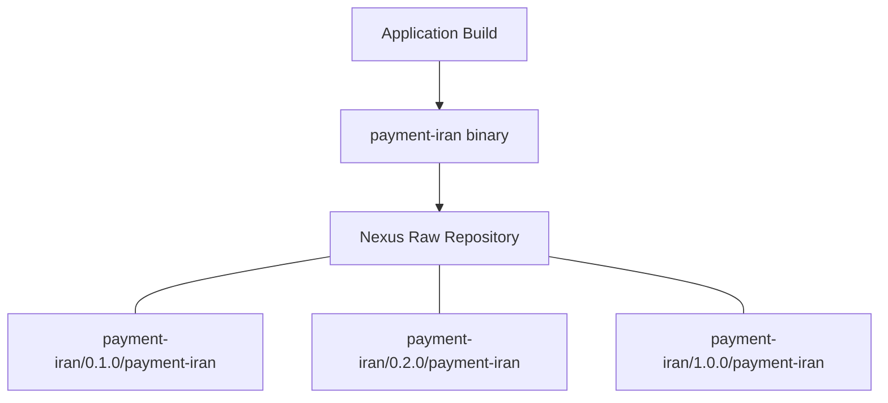

The path itself becomes part of how we organize our artifacts.

---

## 👤 Nexus Users and Roles

Nexus supports **users**, **roles**, and **privileges**.

The basic relationship is:

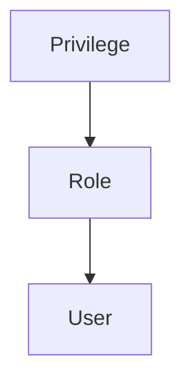

A **privilege** defines a specific permission.

For example:

```
read repository
upload artifact
delete artifact
browse repository
```

A **role** groups several privileges together.

A **user** can then be assigned one or more roles.

This is better than manually assigning every permission to every user.

> 💡 **Real-World Example**
> 
> Suppose Nexus contains:
> 
> ```
> go-binary
> frontend-builds
> firmware
> production-releases
> ```
> 
> A backend developer may need:
> 
> ```
> read/write → go-binary
> read       → production-releases
> no access  → firmware
> ```
> 
> Instead of configuring those permissions directly for every backend developer, we can create a role such as:
> 
> ```
> backend-developer
> ```
> 
> Then assign the appropriate repository privileges to that role.

The structure could look like this:

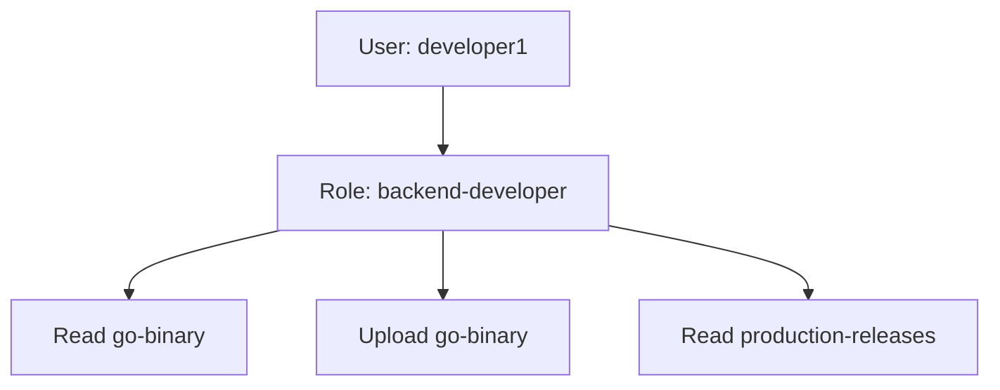

Another user might receive a completely different role:

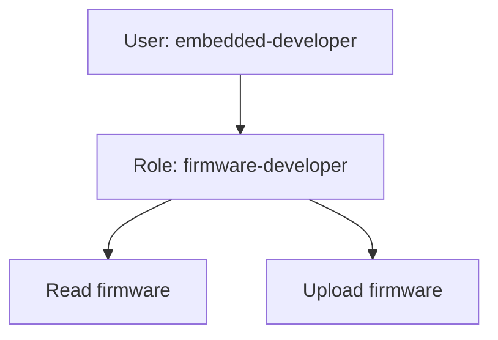

This gives Nexus **repository-based access control**.

### 🧪 Interview Q&A

**Q1:** Why should we use roles instead of assigning permissions individually?

**Q2:** Can two users have access to different repositories?

**Q3:** What is the relationship between a privilege, role, and user?

> [!answer]- 📋 Answers
> 
> **A1:** Roles let us group permissions once and reuse them across multiple users, making access management easier and less error-prone.
> 
> **A2:** Yes. Different roles can grant privileges for different repositories.
> 
> **A3:** Privileges define permissions, roles group those privileges, and users receive roles.

---

# 🌐 Nexus REST API

Nexus provides a **REST API** that allows other applications, scripts, CI/CD systems, and administrators to interact with Nexus programmatically.

Instead of performing everything through the web interface, we can send HTTP requests.

Typical operations include:

```
List repositories
List repository components
Upload files
Download files
Inspect repository content
Manage Nexus resources
```

This becomes especially useful in automation.

For example:

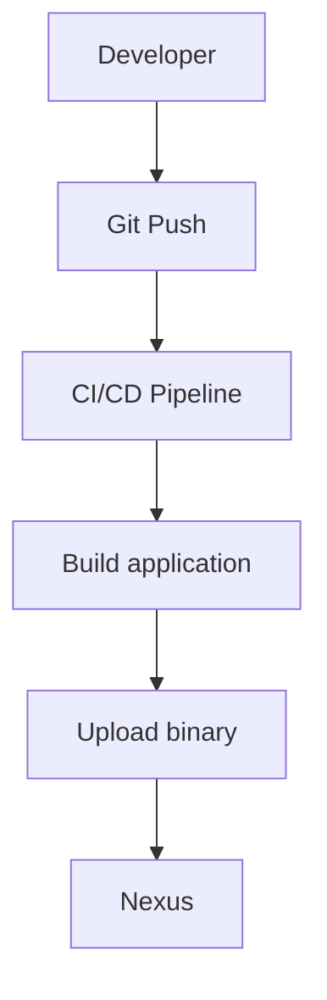

Instead of manually opening Nexus and uploading every release, the CI/CD pipeline can use HTTP requests.

---

# 💻 `curl`

`curl` is commonly used to communicate with the Nexus REST API and repositories.

General structure:

```
curl [options] URL
```

Two important options in these examples are:

```
-u    username/password authentication
-X    HTTP method
```

For Nexus:

```
curl -u 'username:password' \
  -X GET \
  "http://localhost:8081/..."
```

> ⚠️ Avoid placing real Nexus passwords directly inside scripts or Git repositories. Use environment variables, CI/CD secrets, or another secret-management mechanism.

For example:

```
export NEXUS_USER="admin"
export NEXUS_PASSWORD="your-password"
```

Then:

```
curl -u "$NEXUS_USER:$NEXUS_PASSWORD" ...
```

---

# 📋 Listing Nexus Repositories

## 💻 List all repositories

```
curl -u "$NEXUS_USER:$NEXUS_PASSWORD" \
  -X GET \
  "http://localhost:8081/service/rest/v1/repositories"
```

### What it does

This sends an HTTP `GET` request to Nexus asking for the repositories configured on the server.

The endpoint is:

```
/service/rest/v1/repositories
```

The request flow is:

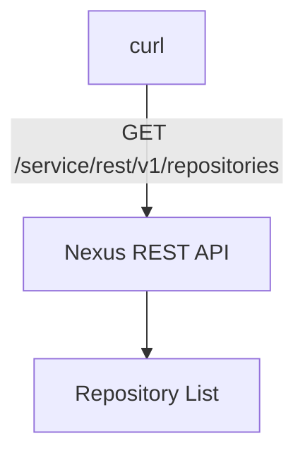

The response is normally JSON containing information about the repositories.

A simplified example might look like:

```
[
  {
    "name": "go-binary",
    "format": "raw",
    "type": "hosted"
  },
  {
    "name": "firmware",
    "format": "raw",
    "type": "hosted"
  }
]
```

This is useful when a script needs to discover which repositories exist.

---

# 🧩 Listing Components of a Repository

Nexus uses the concept of **components** to represent artifacts stored in repositories.

To query components from a specific repository:

```
curl -u "$NEXUS_USER:$NEXUS_PASSWORD" \
  -X GET \
  "http://localhost:8081/service/rest/v1/components?repository=go-binary"
```

The important part is:

```
repository=go-binary
```

This is a **query parameter** telling Nexus:

> Return components belonging to the `go-binary` repository.

The request can be visualized as:

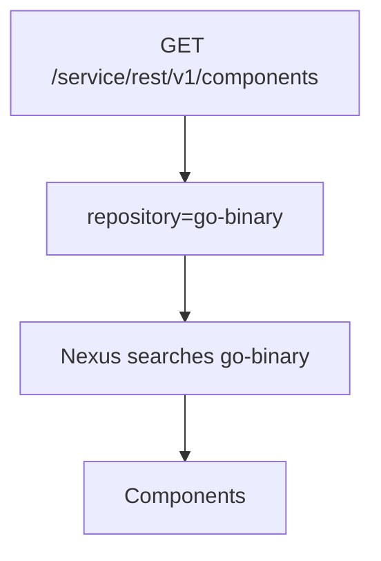

A component may contain one or more associated assets/files depending on the repository format.

> 💡 **Real-World Example**
> 
> Suppose `go-binary` contains:
> 
> ```
> payment-iran/0.1.0/payment-iran
> payment-iran/0.2.0/payment-iran
> notification/1.0.0/notification
> ```
> 
> The Components API can be used by a script to inspect the repository rather than browsing it manually through the Nexus web UI.

---

# ⬆️ Uploading a File into a Raw Repository

A particularly simple way to upload files into a **Raw hosted repository** is to send an HTTP `PUT` request directly to the desired repository path.

## 💻 Upload binary

```
curl -u "$NEXUS_USER:$NEXUS_PASSWORD" \
  -X PUT \
  "http://localhost:8081/repository/go-binary/payment-iran/0.1.0/payment-iran" \
  --upload-file build/payment-iran
```

### What it does

The local file is:

```
build/payment-iran
```

The destination URL is:

```
/repository/go-binary/payment-iran/0.1.0/payment-iran
```

Breaking it apart:

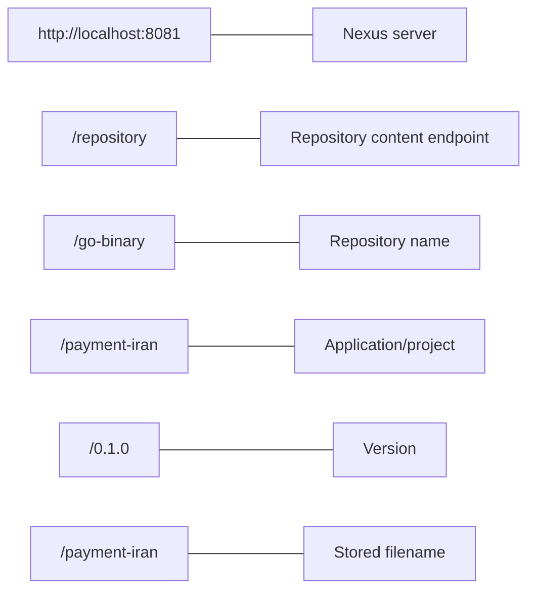

So:

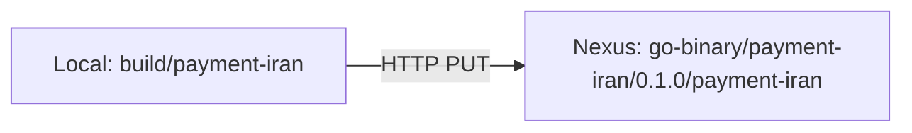

### `--upload-file`

The option:

```
--upload-file build/payment-iran
```

tells `curl`:

> Read this local file and send its contents as the HTTP request body.

The equivalent shorter option is:

```
-T build/payment-iran
```

So this can also be written as:

```
curl -u "$NEXUS_USER:$NEXUS_PASSWORD" \
  -X PUT \
  -T build/payment-iran \
  "http://localhost:8081/repository/go-binary/payment-iran/0.1.0/payment-iran"
```

---

# ⬇️ Downloading from a Raw Repository

Because Raw repositories expose files through repository paths, downloading is also straightforward.

For example:

```
curl -u "$NEXUS_USER:$NEXUS_PASSWORD" \
  -o payment-iran \
  "http://localhost:8081/repository/go-binary/payment-iran/0.1.0/payment-iran"
```

Here:

```
-o payment-iran
```

means:

> Save the downloaded response as a local file named `payment-iran`.

The flow becomes:

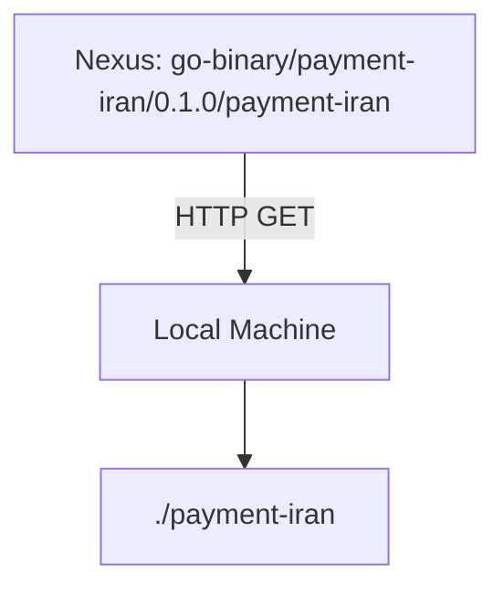

---

# 🔀 REST API Endpoint vs Repository Content Endpoint

These two URL styles are easy to confuse.

### REST API

Example:

```
/service/rest/v1/repositories
```

or:

```
/service/rest/v1/components
```

These endpoints are primarily used to **query or manage Nexus information**.

Example:

```
curl \
  "http://localhost:8081/service/rest/v1/repositories"
```

### Repository Content URL

Example:

```
/repository/go-binary/payment-iran/0.1.0/payment-iran
```

This points directly to content inside a repository.

Example:

```
curl -X PUT \
  --upload-file build/payment-iran \
  "http://localhost:8081/repository/go-binary/payment-iran/0.1.0/payment-iran"
```

So conceptually:

|Purpose|Example|
|---|---|
|Nexus REST API|`/service/rest/v1/...`|
|Repository files|`/repository/<repository-name>/...`|

A useful way to remember it is:

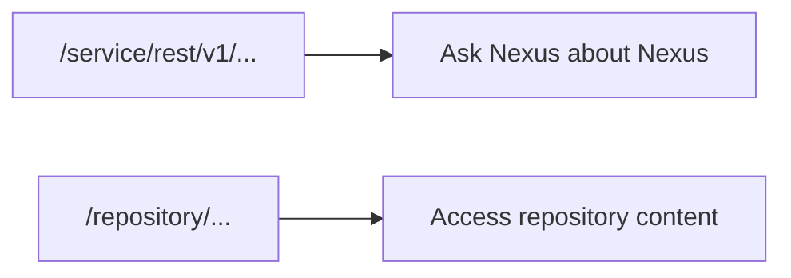

---

# 🌍 Practical Release Scenario

Assume we build:

```
payment-iran
```

Version:

```
0.1.0
```

Repository:

```
go-binary
```

First build the program:

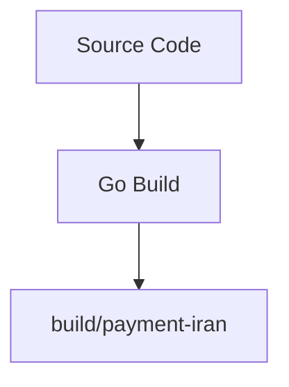

Then upload:

```
curl -u "$NEXUS_USER:$NEXUS_PASSWORD" \
  -X PUT \
  "http://localhost:8081/repository/go-binary/payment-iran/0.1.0/payment-iran" \
  --upload-file build/payment-iran
```

Nexus now contains:

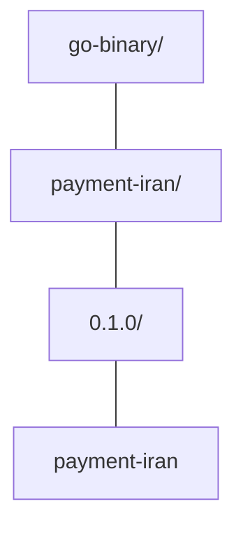

Later we release:

```
0.2.0
```

Upload it as:

```
curl -u "$NEXUS_USER:$NEXUS_PASSWORD" \
  -X PUT \
  "http://localhost:8081/repository/go-binary/payment-iran/0.2.0/payment-iran" \
  --upload-file build/payment-iran
```

Now:

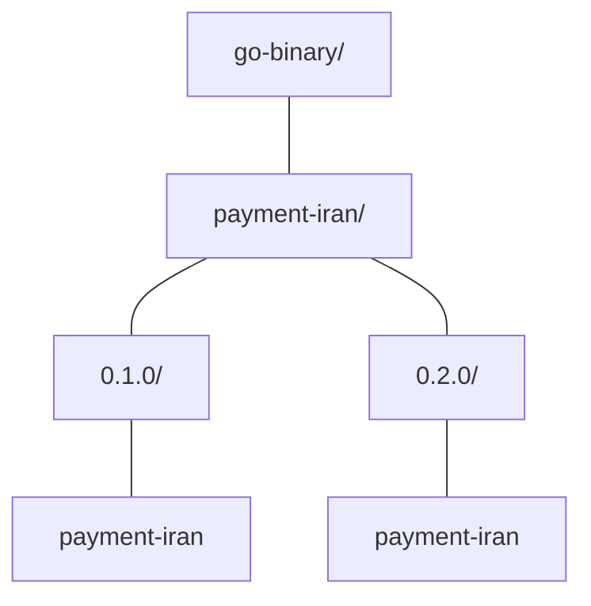

This gives us a simple release history.

---

## 🧪 Interview Q&A

**Q1:** Why would we use a Raw repository for a compiled Go binary?

**Q2:** What is the difference between `GET` and `PUT` in these examples?

**Q3:** What does `--upload-file` do?

**Q4:** What is the difference between `/service/rest/v1/...` and `/repository/...`?

**Q5:** Why might a CI/CD pipeline use the Nexus REST API?

> [!answer]- 📋 Answers
> 
> **A1:** A Raw repository can store arbitrary files directly, making it suitable for standalone compiled binaries and other artifacts that do not need a package-specific format.
> 
> **A2:** `GET` retrieves information or files, while `PUT` sends content to a specific destination.
> 
> **A3:** It tells `curl` to read a local file and send its contents as the HTTP request body.
> 
> **A4:** `/service/rest/v1/...` accesses Nexus REST API operations, while `/repository/...` accesses actual repository content.
> 
> **A5:** It allows builds, uploads, downloads, and repository queries to be automated instead of performed manually.

---

# 🔨 Hands-On Practice

### 1. List all repositories

```
curl -u "$NEXUS_USER:$NEXUS_PASSWORD" \
  -X GET \
  "http://localhost:8081/service/rest/v1/repositories"
```

Look for:

```
name
format
type
```

Confirm that your Raw repository exists.

---

### 2. List components from `go-binary`

```
curl -u "$NEXUS_USER:$NEXUS_PASSWORD" \
  -X GET \
  "http://localhost:8081/service/rest/v1/components?repository=go-binary"
```

Check whether Nexus returns artifacts belonging to that repository.

---

### 3. Upload a test binary

```
curl -u "$NEXUS_USER:$NEXUS_PASSWORD" \
  -X PUT \
  "http://localhost:8081/repository/go-binary/payment-iran/0.1.0/payment-iran" \
  --upload-file build/payment-iran
```

Then open Nexus and verify that this path exists:

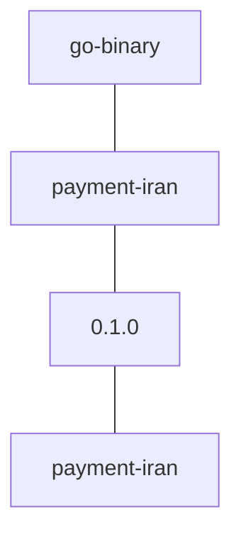

---

### 4. Download the binary

```
curl -u "$NEXUS_USER:$NEXUS_PASSWORD" \
  -o payment-iran \
  "http://localhost:8081/repository/go-binary/payment-iran/0.1.0/payment-iran"
```

Then inspect it:

```
ls -lh payment-iran
```

---

# 📋 Quick Reference

|Operation|Method|Endpoint|
|---|---|---|
|List repositories|`GET`|`/service/rest/v1/repositories`|
|List components|`GET`|`/service/rest/v1/components?repository=<repo>`|
|Upload Raw file|`PUT`|`/repository/<repo>/<path>`|
|Download Raw file|`GET`|`/repository/<repo>/<path>`|

### List repositories

```
curl -u "$NEXUS_USER:$NEXUS_PASSWORD" \
  -X GET \
  "http://localhost:8081/service/rest/v1/repositories"
```

### List repository components

```
curl -u "$NEXUS_USER:$NEXUS_PASSWORD" \
  -X GET \
  "http://localhost:8081/service/rest/v1/components?repository=go-binary"
```

### Upload

```
curl -u "$NEXUS_USER:$NEXUS_PASSWORD" \
  -X PUT \
  "http://localhost:8081/repository/go-binary/payment-iran/0.1.0/payment-iran" \
  --upload-file build/payment-iran
```

### Download

```
curl -u "$NEXUS_USER:$NEXUS_PASSWORD" \
  -o payment-iran \
  "http://localhost:8081/repository/go-binary/payment-iran/0.1.0/payment-iran"
```

---

# 🧠 Things to Remember

- **Raw repositories** are useful when you want to store arbitrary files without package-format restrictions.
- A compiled Go binary can be stored directly in a Raw repository.
- Nexus access control is generally organized as:


- Roles allow different users to have different repository permissions.
- Nexus exposes a REST API for automation.
- `GET` retrieves information or content.
- `PUT` can upload a file to a Raw repository path.
- `/service/rest/v1/...` is used for Nexus API operations.
- `/repository/...` accesses actual repository content.
- Organizing binaries by application and version makes releases much easier to manage:

```
application/version/file
```

---

# 💡 Pro Tips

> 💡 Use versioned repository paths such as:
> 
> ```
> payment-iran/0.1.0/payment-iran
> payment-iran/0.2.0/payment-iran
> payment-iran/1.0.0/payment-iran
> ```
> 
> instead of repeatedly overwriting one file.

> ⚠️ Do not commit commands containing real Nexus passwords into Git.

Prefer:

```
curl -u "$NEXUS_USER:$NEXUS_PASSWORD" ...
```

instead of:

```
curl -u 'username:real-password' ...
```

> 💡 In CI/CD, store Nexus credentials using the CI system's secret or credential storage rather than directly inside build scripts.

# 🔗 Related Topics

[[Nexus Repository Manager]]

[[Artifact Repository]]

[[CI-CD]]

[[REST API]]

[[curl]]

[[Authentication and Authorization]]

[[Roles and Permissions]]

[[Semantic Versioning]]
