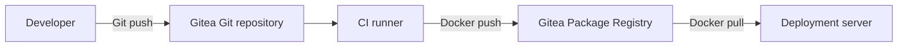
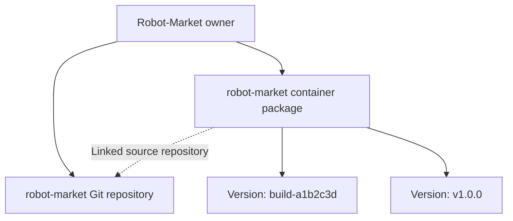

# 📦 Gitea Packages and Artifact Management

[[DevOps/NaNa/Artifact Management/0. Artifact Management|📚 Artifact Management]]

> [!toc]- 📑 Contents
>
> - [[#🌐 One Server, Different Responsibilities|🌐 One Server, Different Responsibilities]]
> - [[#👤 Packages Belong to an Owner|👤 Packages Belong to an Owner]]
> - [[#🔗 Link a Package to Its Repository|🔗 Link a Package to Its Repository]]
> - [[#📦 Choose the Right Format|📦 Choose the Right Format]]
> - [[#⬆️ Publish a Standalone Binary|⬆️ Publish a Standalone Binary]]
> - [[#🧪 Understanding Check|🧪 Understanding Check]]
> - [[#🔨 Hands-On Practice|🔨 Hands-On Practice]]
> - [[#📋 Quick Reference|📋 Quick Reference]]
> - [[#🧠 Things to Remember|🧠 Things to Remember]]
> - [[#💡 Pro Tips|💡 Pro Tips]]
> - [[#🔗 Related Topics|🔗 Related Topics]]

## 🌐 One Server, Different Responsibilities

Gitea hosts Git repositories and includes a **Package Registry**. Docker/OCI images are one supported format; Generic packages store arbitrary files such as compiled binaries.

> 💡 **Real-World Example**
>
> Our source lives in `Robot-Market/robot-market` on `git.my-rm.com`.
>
> CI builds an image, publishes it to Gitea, and a deployment server pulls that image later.



The runner builds the application. Gitea stores the source and package. These roles can run on separate machines.

## 👤 Packages Belong to an Owner

A package belongs to a **user or organization**. A repository link connects it to the source project.



Find packages through **Profile → Packages**, or the organization's **Packages** page. For our example:

[Robot-Market packages](https://git.my-rm.com/Robot-Market/-/packages)

This is separate from general Gitea settings. A successful login alone does not create a package; an upload does.

The credential account needs access to the package owner. For an organization, use an account authorized to publish there. Linking is a source association, not a privacy control: check owner visibility and package access separately. [Package ownership and access](https://docs.gitea.com/1.27/usage/packages/overview/)

## 🔗 Link a Package to Its Repository

After uploading, open **package → Settings → repository selection**, choose the source repository under the same owner, and save.

The package then appears in the repository's **Packages** tab. The association applies to the whole package and its versions. Matching the image name to the repository name does not establish the link by itself.

For automation, CI can request:

```text
POST /api/v1/packages/{owner}/container/{image}/-/link/{repository}
```

`container` is the package type. See the [Gitea package API](https://docs.gitea.com/api/1.27/operations/tags/package/) and the complete workflow in [[DevOps/NaNa/Artifact Management/Gitea/3 - Build and Publish Images with CI|Build and Publish Images with CI]].

## 📦 Choose the Right Format

| Output | Format | Publish using |
|---|---|---|
| Container image | Container | `docker push` |
| Executable, firmware, ZIP | Generic | HTTP upload with `curl` |
| JavaScript library | npm | npm client |
| Java library | Maven | Maven or Gradle |

A compiled Go executable is a **Generic package** here. A Go module is a source dependency and uses the Go package workflow instead.

Also distinguish **Actions artifacts** from registry packages: Actions artifacts retain job outputs such as reports, while registry packages provide distribution endpoints. Use the registry for an application image that deployment servers need to pull.

## ⬆️ Publish a Standalone Binary

Assume a trusted build already produced `build/payment-iran-linux-amd64`. Run from the application repository root in **Bash**, with `curl` installed. The filename states the target OS and architecture.

Create a personal access token in **Profile → Settings → Applications** with package **Read and Write** access. Enter it without putting the literal value in shell history:

```bash
GITEA_USER='Robot-Market'
read -rsp 'Gitea publishing token: ' GITEA_TOKEN
printf '\n'

BASE='https://git.my-rm.com/api/packages/Robot-Market/generic/payment-iran/1.0.0'

curl --fail-with-body --show-error \
  --user "$GITEA_USER:$GITEA_TOKEN" \
  --upload-file build/payment-iran-linux-amd64 \
  "$BASE/payment-iran-linux-amd64"
```

- 🔐 **`read -rsp`** reads a hidden token: `-r` preserves backslashes, `-s` hides input, and `-p` displays the prompt.

- ⬆️ **`--upload-file`** sends the local file using HTTP PUT.

- 🔎 **`--fail-with-body`** makes HTTP errors fail the command while preserving the response explanation. It requires curl 7.76 or newer; use `--fail` on older clients.

- 📁 **URL path** identifies the owner, format, package name, version, and filename.

Success returns HTTP **201**. Uploading the same filename to the same version again returns **409 Conflict**; publish a new version for changed release content. [Generic package operations](https://docs.gitea.com/1.27/usage/packages/generic/)

Download it into a separate local file:

```bash
curl --fail-with-body --show-error \
  --user "$GITEA_USER:$GITEA_TOKEN" \
  --output payment-iran-downloaded \
  "$BASE/payment-iran-linux-amd64"

sha256sum build/payment-iran-linux-amd64 payment-iran-downloaded
unset GITEA_TOKEN
```

`--output` selects the destination filename. Matching SHA-256 hashes confirm equal bytes; they do not prove who built the binary or whether it is safe to execute. `unset` removes the token variable from this shell.

For distribution, publish a checksum file alongside the executable. Deployment accounts should use a separate token with package **Read** access.

## 🧪 Understanding Check

**Q1:** Why can an image appear in Profile → Packages but not in a repository?

**Q2:** Does linking a package make it private?

**Q3:** Should a compiled Go executable use the Go module registry?

> [!answer]- 📋 Answers
>
> **A1:** Packages belong to an owner. Link the package to its source repository to show it in that repository's package list.
>
> **A2:** No. Check owner visibility and package access separately.
>
> **A3:** Use Generic packages for executables. The Go module registry serves Go dependencies.

## 🔨 Hands-On Practice

1. 🔎 **Locate an existing package.**

   Open its owner's Packages page and identify its format and versions.

2. 🔗 **Link a learning package to its source repository.**

   Use the package's Settings, then check the repository's Packages tab.

3. 📦 **Choose a distribution format.**

   Explain why an application image uses Container while a firmware file can use Generic.

### 📋 Quick Reference

| Item | Meaning |
|---|---|
| Profile / organization → Packages | Owner's published packages |
| Package → Settings | Associate with a repository |
| `/api/packages/...` | Format-specific upload/download |
| `/api/v1/packages/...` | Registry management API |
| Container vs Generic | Images vs arbitrary files |

### 🧠 Things to Remember

- A Git push uploads source; a Docker push uploads an image.

- Owner, repository, package, and version are distinct concepts.

- Use a new version for changed release content.

### 💡 Pro Tips

- Align package names with repositories to make discovery easier.

- Include platform information in binary filenames.

- Put CI credentials in Actions secrets rather than committed scripts.

### 🔗 Related Topics

- [[DevOps/NaNa/Artifact Management/Gitea/2 - Docker Container Registry|Docker Container Registry]]

- [[DevOps/NaNa/Artifact Management/Gitea/3 - Build and Publish Images with CI|Build and Publish Images with CI]]

- [[DevOps/NaNa/Artifact Management/Nexus/2. Nexus Repository Manager — Raw Repositories, Users Roles, and REST API|Nexus Raw Repositories and REST API]]
