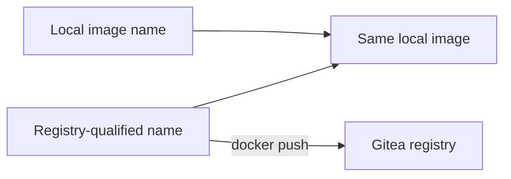

# 🐳 Gitea Docker Container Registry

[[DevOps/NaNa/Artifact Management/0. Artifact Management|📚 Artifact Management]]

> [!toc]- 📑 Contents
>
> - [[#🌐 Registry Address and Image Names|🌐 Registry Address and Image Names]]
> - [[#🔐 Log In to the Registry|🔐 Log In to the Registry]]
> - [[#🏷️ Tag an Existing Image|🏷️ Tag an Existing Image]]
> - [[#⬆️ Push and Find the Image|⬆️ Push and Find the Image]]
> - [[#⬇️ Pull and Deploy|⬇️ Pull and Deploy]]
> - [[#🔎 Tags and Digests|🔎 Tags and Digests]]
> - [[#🧪 Understanding Check|🧪 Understanding Check]]
> - [[#🔨 Hands-On Practice|🔨 Hands-On Practice]]
> - [[#📋 Quick Reference|📋 Quick Reference]]
> - [[#🧠 Things to Remember|🧠 Things to Remember]]
> - [[#💡 Pro Tips|💡 Pro Tips]]
> - [[#🔗 Related Topics|🔗 Related Topics]]

## 🌐 Registry Address and Image Names

Gitea's container registry accepts Docker/OCI images through the Gitea hostname. Its built-in registry does not require a separate registry container or dedicated port.

```text
registry[:port]/owner/image:tag
```

For our application:

```text
git.my-rm.com/robot-market/robot-market:2026-09-29_07-35-56-0381c8b
```

- 🌐 **Registry:** `git.my-rm.com`.

- 👤 **Owner:** `robot-market`, the lowercase form of `Robot-Market`.

- 📦 **Image:** `robot-market`.

- 🏷️ **Tag:** `2026-09-29_07-35-56-0381c8b`.

Use lowercase for the **owner/image path**. Your login username can remain `Robot-Market`. Docker rejects uppercase repository paths before contacting Gitea.

For a nonstandard port, include it consistently, such as `git.example.com:3000/team/app:v1`. Do not include `https://` or `/v2/` in Docker image names or the login address. [Gitea container registry](https://docs.gitea.com/1.27/usage/packages/container/)

## 🔐 Log In to the Registry

Run on the machine that will push or pull:

```bash
docker login git.my-rm.com
```

Enter the Gitea username and a personal access token with package **Read and Write** access for publishing. For private-image downloads, use package **Read** access. The account also needs access to the package owner.

✅ `Login Succeeded` confirms authentication. It does not prove an image was uploaded or that the account may publish under every organization.

### Where Are Credentials Saved?

Docker uses the current account's client configuration. For a root shell, its default location is `/root/.docker/config.json`.

Without a credential helper, credentials are encoded rather than encrypted. Use a credential helper for persistent logins and a temporary isolated configuration in CI. [Docker credential storage](https://docs.docker.com/reference/cli/docker/login/)

`docker login` and `sudo docker login` use different account configurations. A deployment service needs credentials in its own execution context.

Remove this account's saved registry login with:

```bash
docker logout git.my-rm.com
```

This does not revoke the token or delete published images.

## 🏷️ Tag an Existing Image

List this Docker daemon's local images:

```bash
docker image ls
```

`docker images` is another spelling. `docker image` alone displays help because it requires a subcommand.

Add a registry-qualified name to the existing image:

```bash
docker tag \
  robot-market:2026-09-29_07-35-56-0381c8b \
  git.my-rm.com/robot-market/robot-market:2026-09-29_07-35-56-0381c8b
```

The first argument is the **existing source image**; the second is its **additional name**. Tagging does not rebuild the image, duplicate its layers, or affect running containers. [Docker image tag](https://docs.docker.com/reference/cli/docker/image/tag/)



## ⬆️ Push and Find the Image

Upload the registry-qualified image:

```bash
docker push git.my-rm.com/robot-market/robot-market:2026-09-29_07-35-56-0381c8b
```

✅ Look for a final `digest: sha256:...` line. `Layer already exists` means shared content does not need another upload.

Open **Profile → Packages** for `Robot-Market`:

[Open published packages](https://git.my-rm.com/Robot-Market/-/packages)

To show it under the source repository, select that repository in **package → Settings**. See [[DevOps/NaNa/Artifact Management/Gitea/1 - Packages and Artifact Management|Package Ownership and Linking]].

> [!tip] Local and registry images are separate
>
> `docker image ls` lists local images, not Gitea's registry contents.
>
> Removing a local image does not delete its published package.

## ⬇️ Pull and Deploy

On a deployment server, authenticate if required, then download the selected version:

```bash
docker pull git.my-rm.com/robot-market/robot-market:2026-09-29_07-35-56-0381c8b
```

Pulling does not start an application or replace an existing container.

For an existing Compose deployment, edit the application's `image:` field in its existing Compose file:

```yaml
# Fragment of the existing compose.yaml
services:
  backend:
    image: git.my-rm.com/robot-market/robot-market:2026-09-29_07-35-56-0381c8b
```

Preserve its ports, environment, networks, and volumes. This fragment is not a complete application deployment.

From that Compose project's directory, using its normal `-f` and `-p` options if applicable:

```bash
docker compose config --quiet
docker compose pull backend
docker compose up -d --no-deps backend
docker compose ps backend
docker compose logs --tail 50 backend
```

- 🔎 **`config --quiet`** validates the resolved configuration.

- ⬇️ **`pull backend`** downloads the service image without starting it. [Compose pull](https://docs.docker.com/reference/cli/docker/compose/pull/)

- 🚀 **`up -d --no-deps backend`** applies the service change in the background without starting dependencies. Recreating a single container can briefly interrupt service.

- ✅ **`ps` and `logs`** help confirm startup; also check the application's health endpoint or normal operation.

This is a deliberate deployment step. The CI example in the next note stops after publication and linking.

## 🔎 Tags and Digests

A **tag** is a readable name pointing to image content. A **digest** identifies the registry manifest content, including an image index for multi-platform images.

| Reference | Purpose |
|---|---|
| `app:latest` | Convenient moving name |
| `app:20261008-120000-a1b2c3d` | Readable build identity |
| `app@sha256:<full-digest>` | Exact published manifest content |

A timestamp-and-commit tag helps tracing but can still be moved by an authorized publisher. Keep release tags unchanged by policy and record full digests for deployments and rollback.

An application digest does not pin database state; migrations need their own rollback planning.

## 🧪 Understanding Check

**Q1:** Why can login succeed while push fails?

**Q2:** Does tagging copy the image layers?

**Q3:** Does pushing or pulling update a running application?

> [!answer]- 📋 Answers
>
> **A1:** Authentication may succeed while the image path is invalid, the image is missing locally, or publishing permission is insufficient.
>
> **A2:** No. It adds a reference to the existing image.
>
> **A3:** No. Deployment must update the container using the selected image.

## 🔨 Hands-On Practice

1. 🏷️ **Tag a small existing test image.**

   Use a disposable package such as `registry-practice` under an owner you can publish to.

2. ⬆️ **Push and verify.**

   Confirm the final digest and find the package through the owner's profile.

3. ⬇️ **Pull from a second test machine.**

   Confirm the version downloads. Leave production containers unchanged during this exercise.

### 📋 Quick Reference

| Command | Effect |
|---|---|
| `docker login HOST` | Authenticate this client account |
| `docker image ls` | List local images |
| `docker tag SOURCE TARGET` | Add a local image name |
| `docker push TARGET` | Upload to registry |
| `docker pull TARGET` | Download from registry |
| `docker logout HOST` | Remove local saved login |

### 🧠 Things to Remember

- Lowercase paths avoid `repository name must be lowercase`.

- Tag an existing image under its new name before pushing it.

- Publishing, linking, and deployment are separate operations.

### 💡 Pro Tips

- Check connectivity with a small test image before uploading a large build.

- Save the full image reference and digest in deployment records.

- Keep credentials out of Dockerfiles and image build arguments.

### 🔗 Related Topics

- [[DevOps/NaNa/Artifact Management/Gitea/3 - Build and Publish Images with CI|Build and Publish Images with CI]]

- [[DevOps/NaNa/Artifact Management/Gitea/4 - Storage Cleanup and Troubleshooting|Storage, Cleanup, and Troubleshooting]]

- [[DevOps/NaNa/Docker/5. Docker Compose|Docker Compose]]
