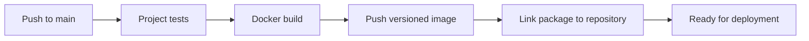
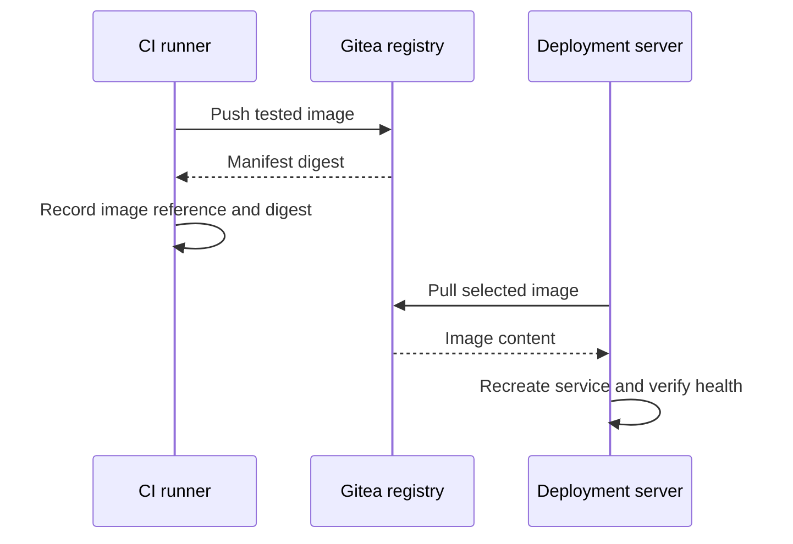

# ⚙️ Build and Publish Gitea Images with CI

[[DevOps/NaNa/Artifact Management/0. Artifact Management|📚 Artifact Management]]

> [!toc]- 📑 Contents
>
> - [[#🌐 Turn the Manual Upload into a Pipeline|🌐 Turn the Manual Upload into a Pipeline]]
> - [[#🧰 Prepare the Runner|🧰 Prepare the Runner]]
> - [[#🔐 Create Publishing Credentials|🔐 Create Publishing Credentials]]
> - [[#📝 Create the Workflow|📝 Create the Workflow]]
> - [[#✅ Verify the First Run|✅ Verify the First Run]]
> - [[#🚀 Add Deployment as a Separate Stage|🚀 Add Deployment as a Separate Stage]]
> - [[#🧪 Understanding Check|🧪 Understanding Check]]
> - [[#🔨 Hands-On Practice|🔨 Hands-On Practice]]
> - [[#📋 Quick Reference|📋 Quick Reference]]
> - [[#🧠 Things to Remember|🧠 Things to Remember]]
> - [[#💡 Pro Tips|💡 Pro Tips]]
> - [[#🔗 Related Topics|🔗 Related Topics]]

## 🌐 Turn the Manual Upload into a Pipeline

CI runs the same build and publishing operations after a trusted change reaches the release branch. The pipeline derives the image owner and name from the source repository, then explicitly links the package back to it.



For `Robot-Market/robot-market`, the published name becomes:

```text
git.my-rm.com/robot-market/robot-market:build-20261008-120000-42-a1b2c3d
```

The package appears in **Profile → Packages** and, after linking, in the source repository's **Packages** tab. Publishing does not deploy the application.

## 🧰 Prepare the Runner

A **runner** executes jobs; the Gitea server queues them and displays results. Enable Actions for the repository and register an appropriate runner. [Runner overview](https://docs.gitea.com/runner/)

This example assumes:

- 📁 **Application repository root** contains a working `Dockerfile` and `.dockerignore`.

- 🏷️ **Runner label:** `ubuntu-latest` is registered for a Linux job environment.

- 💻 **Job tools:** Bash, Git, Node.js for the checkout action, Docker CLI, and curl 7.76+.

- 🐳 **Docker access:** the job can reach a Docker daemon capable of building Linux images for the deployment platform.

- 🌐 **Connectivity:** the job and daemon can reach `git.my-rm.com`; the runner can fetch the checkout action and required build images.

A label is only a match between job and runner configuration. Writing `runs-on: ubuntu-latest` does not install Docker or provision a GitHub-hosted machine.

Check these commands **inside the actual job environment**, not only on the host:

```bash
docker version
docker info
curl --version
```

`docker version` should show both Client and Server. A CLI alone is insufficient. With container jobs, the runner's own daemon access does not automatically prove the job container has access.

A dedicated build daemon or a deliberately configured Docker socket connection are common choices. A host Docker socket grants extensive host control: give it only to trusted build jobs, preferably on a dedicated runner. Do not expose a Docker daemon over unauthenticated public TCP.

## 🔐 Create Publishing Credentials

1. 👤 **Choose the publishing account.**

   For an organization repository, use a dedicated account authorized to publish under that organization. For a personal registry, use its owner account.

2. 🔑 **Generate a personal access token.**

   Open **Profile → Settings → Applications**. Give the token package **Read and Write** permission. The account must also be allowed to link packages to the target repository.

3. 📁 **Add repository Actions secrets.**

   Open **Repository → Settings → Actions → Secrets** and add:

   | Secret | Value |
   |---|---|
   | `REGISTRY_USERNAME` | Username of the token owner |
   | `REGISTRY_TOKEN` | Publishing token |

Secret values become available through expressions such as `${{ secrets.REGISTRY_TOKEN }}`. Organization secrets can be shared with selected repositories when several projects publish images. [Gitea Actions secrets](https://docs.gitea.com/1.27/usage/actions/secrets/)

> [!important] Use a publishing token for this workflow
>
> Gitea's 1.27 comparison documentation says the built-in `GITEA_TOKEN` cannot publish registry packages. A workflow permission such as `packages: write` alone does not fix that limitation.
>
> Use the saved personal access token here. See [package authorization limitations](https://docs.gitea.com/1.27/usage/actions/comparison/#package-repository-authorization).

The login account and image owner can differ: `ci-publisher` can publish to `robot-market` only when its account permissions allow it.

## 📝 Create the Workflow

In the **application repository**, create:

```text
.gitea/workflows/publish-image.yml
```

The example publishes on pushes to `main`. Change that branch if your project uses a different release branch. It assumes a single image whose name matches its repository.

Place your project's real test steps before the build/publish step, or make this job depend on an existing test job. For an existing pipeline, integrate these operations after successful tests instead of adding a second independent build that could publish failed code.

```yaml
name: Publish Docker image

on:
  push:
    branches:
      - main

jobs:
  publish:
    runs-on: ubuntu-latest

    steps:
      - name: Checkout source
        uses: https://github.com/actions/checkout@v4

      # Add the project's test steps here before publication.
      # If tests live in another job, use needs: with that job's name.

      - name: Build, push, and link image
        shell: bash
        env:
          REGISTRY_USERNAME: ${{ secrets.REGISTRY_USERNAME }}
          REGISTRY_TOKEN: ${{ secrets.REGISTRY_TOKEN }}
          SOURCE_REPOSITORY: ${{ gitea.repository }}
          COMMIT_SHA: ${{ gitea.sha }}
          RUN_ID: ${{ gitea.run_id }}
        run: |
          set -euo pipefail

          REGISTRY='git.my-rm.com'
          OWNER="${SOURCE_REPOSITORY%%/*}"
          REPO="${SOURCE_REPOSITORY#*/}"
          IMAGE_OWNER="${OWNER,,}"
          IMAGE_NAME="${REPO,,}"

          TAG="build-$(date -u +%Y%m%d-%H%M%S)-${RUN_ID}-${COMMIT_SHA:0:7}"
          IMAGE="$REGISTRY/$IMAGE_OWNER/$IMAGE_NAME:$TAG"

          # Keep this job's registry credentials separate from host logins.
          DOCKER_CONFIG="$(mktemp -d)"
          export DOCKER_CONFIG
          trap 'rm -rf "$DOCKER_CONFIG"' EXIT

          docker version
          printf '%s' "$REGISTRY_TOKEN" |
            docker login "$REGISTRY" \
              --username "$REGISTRY_USERNAME" \
              --password-stdin

          docker build \
            --label "org.opencontainers.image.source=https://$REGISTRY/$SOURCE_REPOSITORY" \
            --label "org.opencontainers.image.revision=$COMMIT_SHA" \
            --tag "$IMAGE" \
            .

          docker push "$IMAGE"

          curl --fail-with-body --silent --show-error \
            --request POST \
            --header "Authorization: token $REGISTRY_TOKEN" \
            "https://$REGISTRY/api/v1/packages/$OWNER/container/$IMAGE_NAME/-/link/$REPO"

          echo "Published and linked: $IMAGE"
```

### What the Important Lines Do

- 🛑 **`set -euo pipefail`** stops on command failure, unset variables, and failures inside pipelines.

- 📁 **Repository parsing** splits `Robot-Market/robot-market` at `/`.

    - `${SOURCE_REPOSITORY%%/*}` keeps the owner.

    - `${SOURCE_REPOSITORY#*/}` keeps the repository name.

    - `${OWNER,,}` and `${REPO,,}` convert them to lowercase using Bash.

- 🏷️ **Tag construction** combines a UTC timestamp, CI run ID, and the first seven commit characters.

    - `date -u` uses UTC; `%Y%m%d-%H%M%S` produces `20261008-120000`.

    - `build-` marks disposable CI builds for retention rules.

- 🔐 **`mktemp -d` and `DOCKER_CONFIG`** isolate Docker credentials in a newly created directory. The `EXIT` trap removes only that directory when the shell exits; abrupt runner loss may bypass the trap, so runner cleanup still matters.

- 🔑 **`--password-stdin`** reads the token from standard input instead of a command argument. Keep shell tracing (`set -x`) disabled around credentials.

- 🐳 **`docker build --tag ... .`** uses the repository root as the build context. The two labels record source location and full commit identity.

    - The source label provides metadata; this guide uses the API call to establish the Gitea repository link explicitly.

- 🔗 **`curl --request POST`** links the package after it exists. `--silent --show-error` suppresses progress while retaining errors; `--fail-with-body` fails the step for HTTP errors.

    - The URL uses the original Gitea owner/repository names and the lowercase image name.

    - The target repository must belong to the same owner. Gitea's 1.27.3 implementation returns **201** after linking. [Link endpoint implementation](https://raw.githubusercontent.com/go-gitea/gitea/v1.27.3/routers/api/v1/packages/package.go)

The checkout action uses a major-version tag for readability. For production, pin third-party actions to reviewed commit SHAs and deliberately update them. If external fetching is unavailable, mirror the action into Gitea and reference that mirror.

## ✅ Verify the First Run

1. 🔎 **Open Repository → Actions.**

   Confirm the job reaches the intended runner and the checkout succeeds.

2. 📦 **Read the push output.**

   Record the final digest and the full `Published and linked` image reference.

3. 🔗 **Open the repository's Packages tab.**

   Confirm the package is linked and the new version is listed.

4. ⬇️ **Pull from a separate test machine.**

   Use the exact reference printed by the job, authenticating with a read-only deployment token if required.

If push succeeds but linking fails, the image is already published. Fix the link permission/path and repeat the link request; rebuilding is unnecessary.

This workflow is a teaching example. Validate its runner tools, Docker access, branch, Dockerfile, and project-specific tests before treating it as a production pipeline.

## 🚀 Add Deployment as a Separate Stage

Publication makes the artifact available. A deployment stage selects the image, downloads it, updates the service, and verifies health.



Pass the exact reference or digest to deployment rather than asking deployment to guess the newest tag. Keep the previous production reference for rollback. CI write credentials and deployment read credentials should be separate.

For multiple application images in one repository, assign distinct package names and link each package to the same repository. Adjust the Dockerfile/build context for each image.

## 🧪 Understanding Check

**Q1:** Why is `runs-on: ubuntu-latest` insufficient to guarantee Docker builds work?

**Q2:** Why does the workflow lowercase the image path but preserve the original repository names for the API?

**Q3:** What should happen if push succeeds and linking fails?

**Q4:** Why should deployment consume the published artifact instead of rebuilding it?

> [!answer]- 📋 Answers
>
> **A1:** The registered label selects an environment. That environment still needs the tools and a reachable Docker daemon.
>
> **A2:** Docker requires lowercase repository paths. The API identifies the Gitea owner and source repository directly.
>
> **A3:** The image remains published. Correct and retry linking, then verify the package association.
>
> **A4:** Rebuilding can change dependencies or other inputs. Deploying the tested artifact preserves the tested result.

## 🔨 Hands-On Practice

1. 🧰 **Use a learning repository and runner.**

   Confirm a small Dockerfile builds locally and check Docker access inside the job.

2. 🔐 **Add its publishing secrets and workflow.**

   Push a harmless change to the configured branch after adding the relevant test gate.

3. ✅ **Trace the result.**

   Connect the source commit, Actions run, image tag, package link, and pull result. Do not add a production deployment during this exercise.

### 📋 Quick Reference

| Item | Purpose |
|---|---|
| `.gitea/workflows/*.yml` | Repository Actions workflows |
| `REGISTRY_TOKEN` | Secret holding publishing PAT |
| `gitea.repository` | Owner/repository identity |
| `gitea.sha` | Commit used for the build |
| `DOCKER_CONFIG` | Isolated Docker client credentials |
| API link after push | Show package under source repository |

### 🧠 Things to Remember

- Run actual project tests before publishing deployable builds.

- A runner container and a job container are different execution contexts.

- Publication success does not mean deployment success.

### 💡 Pro Tips

- Use `.dockerignore` to exclude `.git`, local secrets, and unrelated build outputs from the build context.

- Publish from trusted branches; keep publishing secrets away from untrusted pull-request jobs.

- Keep full digests with release records and use stable release tags alongside CI build tags when promoting a release.

- If a build already exists in CI, tag and push that same result instead of building twice.

### 🔗 Related Topics

- [[DevOps/NaNa/Artifact Management/Gitea/2 - Docker Container Registry|Docker Container Registry]]

- [[DevOps/NaNa/Artifact Management/Gitea/4 - Storage Cleanup and Troubleshooting|Storage, Cleanup, and Troubleshooting]]

- [[DevOps/NaNa/Docker/6. Dockerfile|Dockerfile]]
