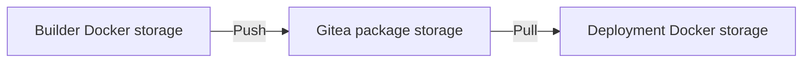
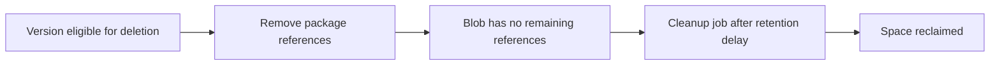

# 💾 Gitea Registry Storage, Cleanup, and Troubleshooting

[[DevOps/NaNa/Artifact Management/0. Artifact Management|📚 Artifact Management]]

> [!toc]- 📑 Contents
>
> - [[#🌐 Where Does an Image Actually Live?|🌐 Where Does an Image Actually Live?]]
> - [[#📁 Find the Physical Storage Path|📁 Find the Physical Storage Path]]
> - [[#🔎 Check Server Hardware and Capacity|🔎 Check Server Hardware and Capacity]]
> - [[#🧹 Retention and Reclaiming Space|🧹 Retention and Reclaiming Space]]
> - [[#🛠️ Common Failures|🛠️ Common Failures]]
> - [[#💾 Back Up More Than Git Repositories|💾 Back Up More Than Git Repositories]]
> - [[#🧪 Understanding Check|🧪 Understanding Check]]
> - [[#🔨 Hands-On Practice|🔨 Hands-On Practice]]
> - [[#📋 Quick Reference|📋 Quick Reference]]
> - [[#🧠 Things to Remember|🧠 Things to Remember]]
> - [[#💡 Pro Tips|💡 Pro Tips]]
> - [[#🔗 Related Topics|🔗 Related Topics]]

## 🌐 Where Does an Image Actually Live?

There are three different locations to distinguish:

| Location | Contains |
|---|---|
| Builder's Docker daemon | Local images and build cache |
| Gitea package storage | Published image blobs and related package data |
| Deployment server's Docker daemon | Pulled images and running containers |



Cleaning a runner's local Docker cache does not clean Gitea's registry. Deleting a registry package does not remove an already pulled image from deployment hosts.

## 📁 Find the Physical Storage Path

Gitea's default package storage base is `packages/`. The full location depends on its application data path, storage configuration, and container mounts. It may also use an object-storage backend. [Storage configuration](https://docs.gitea.com/1.27/administration/config-cheat-sheet/)

Do not assume every installation uses `/data/gitea/packages`. Rootless Docker installations commonly mount data at **`/var/lib/gitea`**, while the regular Docker image uses a different layout. [Rootless installation](https://docs.gitea.com/1.27/installation/install-with-docker-rootless/)

On the Docker host, list container names and images:

```bash
docker ps --format 'table {{.Names}}	{{.Image}}'
```

`--format` prints only useful fields. Identify the Gitea container, then substitute its name for `GITEA_CONTAINER` below:

```bash
docker inspect GITEA_CONTAINER \
  --format '{{range .Mounts}}{{println .Type .Source "->" .Destination}}{{end}}'
```

This read-only command shows host sources and container destinations without printing container environment values.

For example, a bind mount might show:

```text
bind /srv/gitea/data -> /var/lib/gitea
```

If the configured local package path is `/var/lib/gitea/packages`, its host path in that example is `/srv/gitea/data/packages`. Confirm the effective data path and package storage settings in `app.ini` and deployment environment overrides before relying on this mapping.

For a named volume, the inspect result identifies its storage source. Inspect its mountpoint and capacity without editing Docker-managed files.

> ⚠️ Do not manually delete package blob files. Use Gitea's package operations so references and stored content remain consistent.

## 🔎 Check Server Hardware and Capacity

Run these read-only commands on the Linux server:

```bash
lscpu
free -h
lsblk -o NAME,SIZE,TYPE,FSTYPE,MOUNTPOINTS
```

- 💻 **`lscpu`** shows CPU model and available CPU topology. On a VM, these are the resources exposed to the guest.

- 🧠 **`free -h`** shows readable RAM totals. `available` is more useful than `free` alone because Linux uses memory for cache.

- 💾 **`lsblk -o ...`** selects disk size, type, filesystem, and mount information.

Check the filesystem containing the verified Gitea data path:

```bash
df -h /srv/gitea/data
```

Replace that example with the actual host path. Read **`Avail`** for remaining capacity and **`Mounted on`** for the filesystem supplying it. Checking only `/` can miss a separate data disk.

On a quiet server, estimate the directory's current disk usage:

```bash
du -sh /srv/gitea/data/packages
```

`du -s` summarizes the directory; `-h` uses readable units. This scan can take time for a large registry. Package UI sizes may not equal the actual disk usage because blobs can be shared.

To inspect local Docker storage separately:

```bash
docker system df
```

This reports local image, container, volume, and build-cache usage. It does not query the registry's package inventory.

### CPU and RAM: Registry vs Builds

A registry receives and serves files; image compilation happens on the runner. A Go build or frontend compilation can consume considerably more CPU/RAM than an idle registry.

If Gitea, database, runner, proxy, and applications share one server, budget for their combined peak use. Nexus sizing does not directly describe Gitea's needs. Measure actual concurrent jobs, transfers, and storage growth before expanding the server.

## 🧹 Retention and Reclaiming Space

Gitea can share identical blobs between packages. Removing package versions removes references first; unreferenced blobs are reclaimed later by the package cleanup job, subject to its `OLDER_THAN` setting.



Shared blobs remain while another package still references them. Deleting a version therefore does not guarantee an immediate matching drop in disk usage.

### Example: Disposable CI Builds

Under the package owner's cleanup settings, prepare a **Container** rule:

| Setting | Example |
|---|---|
| Apply pattern to full package name | Off: match version only |
| Keep most recent | 10 |
| Keep versions matching | `v.+` |
| Remove versions older than | 14 days |
| Remove versions matching | `build-.+` |

This targets older `build-...` versions while retaining the recent set and `v...` releases. Gitea's container cleanup rules also preserve `latest`. Preview the affected versions before enabling the rule. [Package cleanup behavior](https://docs.gitea.com/1.27/usage/packages/storage/)

> ⚠️ Preserve deployed and rollback versions explicitly.
>
> A running container may continue after registry deletion, but a fresh deployment or restart on another host may need to pull the image again. A digest cannot retrieve content that has been deleted.

Version patterns are matched as complete expressions; do not add `^` and `$` anchors. If full package-name matching is enabled instead, the pattern must include the package name and `/` before the version.

## 🛠️ Common Failures

| Symptom | Check and fix |
|---|---|
| `repository name must be lowercase` | Lowercase the registry image's owner/name path; keep the login username as required |
| Local tag does not exist | Run `docker image ls`; tag the existing image with the exact target before pushing |
| Login succeeds, push denied | Verify token package-write scope and the account's permissions under the target owner |
| Package absent from repository | Check Profile/organization → Packages, then link its source repository |
| Job cannot connect to Docker | Check the daemon from inside the job, not only inside the runner or host |
| Job says `docker: command not found` | Its job image lacks Docker CLI; provide a suitable job environment |
| TLS or DNS error | Check resolution and certificate trust from the actual client/job and daemon environment |
| HTTP 413 or upload timeout | Inspect reverse-proxy upload limits/timeouts and Gitea's configured package limits |
| Push succeeds, link returns 404 | Check owner, `container` type, exact image name, target repository, access, and installed API availability |
| Old app still running | Publication does not deploy; update its configured image and recreate the service |
| Cleanup ran, disk still full | Check shared blobs, cleanup delay, and whether local runner storage is the real consumer |

A registry connectivity check from the affected client:

```bash
curl --include https://git.my-rm.com/v2/
```

`--include` displays response headers. HTTP **200** or an authentication challenge such as **401** can show the registry endpoint is reachable; **401** alone is not evidence of a failed deployment. An HTML login page suggests routing/proxy problems rather than a normal registry API response.

Inspect recent Gitea logs on its Docker host:

```bash
docker logs --tail 100 GITEA_CONTAINER
```

`--tail 100` limits output to recent lines. Also inspect the reverse-proxy logs when failures occur before Gitea receives the upload. Redact credentials before sharing diagnostic output.

## 💾 Back Up More Than Git Repositories

A useful recovery plan covers **Gitea database, configuration, Git repositories, and package storage**. Package metadata and blobs need a consistent recovery point; copying only Git repositories does not preserve published images.

Follow the backup method appropriate to the database and storage backend. Test restoring a learning package and pulling its image, rather than assuming a successful file copy proves recovery. See [Gitea backup and restore](https://docs.gitea.com/1.27/administration/backup-and-restore/).

## 🧪 Understanding Check

**Q1:** Why can deleting a package fail to free space immediately?

**Q2:** Does `docker system df` show every image published to Gitea?

**Q3:** Why preserve an image that is already running in production?

> [!answer]- 📋 Answers
>
> **A1:** Blob references are removed first. Shared or recently unreferenced content remains until eligible for cleanup.
>
> **A2:** No. It reports the selected Docker daemon's local storage.
>
> **A3:** Recovery, scaling, and rollback may require a fresh pull. Existing local copies do not guarantee availability elsewhere.

## 🔨 Hands-On Practice

1. 📁 **Trace a mount.**

   Inspect the Gitea container and map its configured local data directory to the host path.

2. 🔎 **Compare storage views.**

   Check `df -h` for that path and `docker system df`. Explain which reports filesystem capacity and which reports local Docker usage.

3. 🧹 **Preview a learning cleanup rule.**

   Confirm it excludes release versions and required rollback builds. Leave production rules unchanged until the preview matches the retention plan.

### 📋 Quick Reference

| Command / location | Purpose |
|---|---|
| `lscpu`, `free -h` | CPU and RAM overview |
| `lsblk -o ...` | Disk and mount layout |
| `df -h PATH` | Filesystem capacity |
| `du -sh PATH` | Directory disk usage |
| `docker system df` | Local Docker usage |
| Owner's cleanup settings | Preview package version retention |

### 🧠 Things to Remember

- Container paths and host paths differ; inspect actual mounts.

- Builder cache, registry blobs, and deployment images have separate lifecycles.

- Cleanup must preserve the ability to redeploy and roll back.

### 💡 Pro Tips

- Alert on the registry's actual data filesystem before it fills.

- Keep build tags recognizable so cleanup rules can target disposable versions.

- Separate heavy builds from the Gitea host when job activity harms Git or registry responsiveness.

- Test restoring package storage along with database metadata.

### 🔗 Related Topics

- [[DevOps/NaNa/Artifact Management/Gitea/2 - Docker Container Registry|Docker Container Registry]]

- [[DevOps/NaNa/Artifact Management/Gitea/3 - Build and Publish Images with CI|Build and Publish Images with CI]]

- [[DevOps/NaNa/Artifact Management/Nexus/3. Blob|Nexus Blob Stores]]

- [[DevOps/NaNa/Artifact Management/Nexus/4. Cleanup Policy|Nexus Cleanup Policies]]

- [[DevOps/NaNa/Docker/7. Docker Volume|Docker Volumes]]
