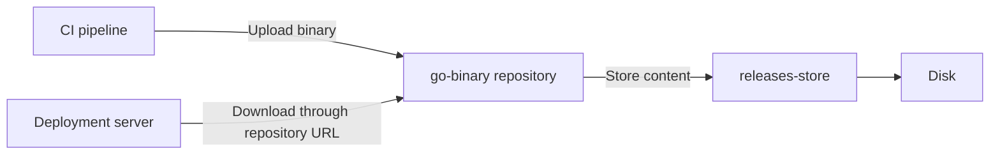

# 📦 Nexus Blob Stores

## 🌐 What Is a Blob Store?

A **blob store** is where Nexus stores uploaded file content. A **repository** provides the URL and access rules developers use to upload and download it.

**BLOB** stands for **Binary Large Object**. Think of it as file content stored as bytes: an executable, ZIP archive, package, or even a text file.

> 💡 **Real-World Example**
>
> We upload a compiled application to Nexus:
>
> - 📦 **Artifact:** `payment-iran/1.0.0/payment-iran`
>
> - 🌐 **Repository:** `go-binary`
>
>     - Receives the upload through its URL.
>
> - 💾 **Blob store:** `releases-store`
>
>     - Holds the uploaded file content.



Developers use the repository URL; Nexus handles the storage behind it. They do not need direct access to the blob-store directory.

| Repository | Blob store |
|---|---|
| Organizes access to artifacts | Holds their file content |
| Has a repository URL and permissions | Uses a storage location, such as a directory |
| Example: `go-binary` | Example: `releases-store` |

Nexus manages the relationship between repository entries and stored content. See Sonatype’s [Storage Guide](https://help.sonatype.com/en/storage-guide.html).

---

## 🔗 Which Repositories Use Which Store?

A normal hosted or proxy repository selects **one blob store**. Several repositories can share that same store.

```text
go-binary ──────────┐
                   ├── releases-store ── /srv/nexus-blobs/releases
frontend-builds ───┘

npm-proxy ───────────── cache-store ───── /srv/nexus-blobs/cache
```

The repositories are grouped by purpose:

- 📦 **`releases-store`**

    - Stores content from `go-binary` and `frontend-builds`.

- 📦 **`cache-store`**

    - Stores packages that `npm-proxy` downloads from an upstream repository.

Separate stores help organize storage, but **two directories on the same filesystem still share its free space**. Creating another store does not create another disk or reserve capacity for it.

---

## 🔒 Blob-Store Settings and Deletion

Choose the store’s name, type, and path carefully before using it. Some settings are fixed after creation.

- 📁 **Storage path**

    - Cannot be changed through normal blob-store editing.

- 🔔 **Soft quota**

    - Can be adjusted; it sets an alert threshold, not a storage reservation.

- 🔒 **Deletion**

    - Is blocked while a repository or blob store group references the store.

See Sonatype’s [Blob Stores](https://help.sonatype.com/en/blob-stores.html) documentation.

```text
go-binary → releases-store
                 │
                 └── Still referenced: deletion is blocked
```

These configuration restrictions do not prevent uploading new artifacts. Repository content can grow normally; whether you may overwrite an existing artifact depends on the repository’s deployment policy.

> ⚠️ Do not rename, edit, or delete Nexus-managed blob files manually. Use Nexus operations so its stored content and database records remain consistent.

---

## 👤 The Nexus User Needs Directory Access

For a file-based blob store, the **Linux account running Nexus** must be able to read and write its storage directory and traverse its parent directories. This is separate from the user who signs into the Nexus web interface.

> 💡 **Real-World Example**
>
> Nexus runs as the Linux user `nexus`, but `/srv/nexus-blobs/releases` is writable only by `root`. An upload can fail even when you sign into the website as an administrator.

💻 **Inspect directory access** on the Nexus Linux host:

```bash
ls -ld /srv /srv/nexus-blobs /srv/nexus-blobs/releases
```

Replace the example paths with your actual storage path.

- 🔎 **Command flags**

    - `-l` → show ownership and permissions.

    - `-d` → inspect each directory itself, rather than its contents.

Illustrative output for the final directory:

```text
drwxr-x--- 2 nexus nexus 4096 Oct 1 10:00 /srv/nexus-blobs/releases
```

- 👤 **Owner: `nexus`**

    - `rwx` → read, write, and enter the directory.

- 👥 **Group: `nexus`**

    - `r-x` → read and enter; no write access.

- 🔒 **Other users**

    - `---` → no access.

Parent directories must also allow the Nexus service account to traverse them.

If uploads report permission errors, compare the directory permissions with the actual service account, correct the specific access problem, and retry a small test upload. Web-administrator privileges do not fix Linux permissions.

---

## 📏 Plan the Number and Size of Stores

Before creating stores, decide **which repositories share storage**, **how much content they will retain**, and **where that capacity comes from**.

| Decision | What to consider |
|---|---|
| How many stores? | Start with a clear purpose for each store; one per repository is not required |
| Which repositories share one? | Similar retention and storage needs can make sharing simpler |
| How much space? | Current content, expected growth, and how long artifacts remain |
| Which storage location? | Available capacity and whether other stores share the same filesystem |

For example, keeping release binaries and temporary build artifacts in separate stores can make their different storage needs easier to track. The separation provides independent capacity only if the underlying storage is also separated appropriately.

### 🧮 Estimate Retained Content

Suppose `go-binary` retains **100 releases**, each containing a **50 MiB** binary:

```text
100 releases × 50 MiB = 5,000 MiB
1 GiB = 1,024 MiB
5,000 ÷ 1,024 ≈ 4.9 GiB of artifact content
```

Allow additional room for growth and other stored data. This estimates the artifacts, not the entire Nexus installation.

💻 **Check available capacity** on the filesystem containing the store:

```bash
df -h /srv/nexus-blobs/releases
```

`-h` displays human-readable sizes.

- 🔎 **Read the output**

    - `Avail` → space still available.

    - `Mounted on` → the filesystem’s mount point.

The result covers the whole filesystem, including other directories using it.

### 🔔 Soft Quota vs Actual Capacity

A **soft quota** warns when usage exceeds a threshold or remaining space falls below one. It **does not stop uploads or reserve space**. See the soft-quota section in [Blob Stores](https://help.sonatype.com/en/blob-stores.html).

For example, an alert at 80 GB used on a 100 GB volume gives you time to act. Uploads may continue after the alert, so the volume can still fill.

---

### 🧪 Interview Q&A

**Q1:** Why do developers use a repository URL instead of accessing the blob-store directory?

**Q2:** Can `go-binary` and `frontend-builds` use the same blob store?

**Q3:** Why might an upload fail even when you are logged in as a Nexus administrator?

**Q4:** Does creating two blob stores on the same filesystem give each independent free space?

**Q5:** Why should you plan the storage path before creating a blob store, and can you delete it while a repository uses it?

> [!answer]- 📋 Answers
>
> **A1:** Nexus handles repository access, permissions, and locating content. The storage directory is managed by Nexus.
>
> **A2:** Yes. Each repository selects one store, and multiple repositories can select the same one.
>
> **A3:** The Linux account running Nexus may lack access to the storage directory. Web permissions and filesystem permissions are separate.
>
> **A4:** No. Both directories consume the same filesystem’s capacity, so growth in one can affect the other.
>
> **A5:** The path cannot be changed through normal editing after creation. Nexus blocks deleting a store while it is still referenced, so choose its location and repository assignments carefully.

## 🔨 Hands-On Practice

### 🔗 Trace a Repository to Its Store

Use your learning Nexus instance and leave its settings unchanged.

1. 🌐 **Open a hosted or proxy repository.**

   Find its selected blob store in the repository configuration.

2. 📦 **Inspect that store in Blob Stores settings.**

   Note its name, type, and location. Check whether another repository selects it too.

   ✅ You can now connect a repository’s upload URL to its storage target.

### 🔎 Check Permissions and Free Space

For a file-based store, run these checks on the Nexus Linux host using its actual path.

1. 👤 **Inspect access.**

   Run the earlier `ls -ld` example for the store and its parent directories.

   - Identify the owner and group.

   - Compare their permissions with the account running Nexus.

2. 📦 **Inspect capacity.**

   Run the earlier `df -h` example for the same path.

   - Find `Avail` and `Mounted on`.

   - If you have another file store, check whether it uses the same filesystem.

   ✅ You can identify who can access the directory and which filesystem supplies its space. Neither command changes the storage.

---

### 📋 Quick Reference

| Concept or check | Meaning |
|---|---|
| Repository → blob store | Logical access → stored content |
| Several repositories → one store | Sharing is supported |
| Referenced store | Cannot be deleted while still in use |
| `ls -ld DIRECTORY` | Inspect directory ownership and permissions |
| `df -h PATH` | Inspect the containing filesystem’s capacity |
| Soft quota | Alert threshold; uploads can continue |

### 🧠 Things to Remember

- The Nexus service account needs storage access independently of web users.

- Separate stores do not automatically mean separate disks or reserved space.

- Choose paths and repository assignments carefully before storing artifacts.

- Estimate retained content and leave room for growth.

### 💡 Pro Tips

- Use meaningful names such as `releases-store` so assignments are easy to understand.

- Check which filesystem a path belongs to before assuming it adds capacity.

- Set storage alerts early enough to investigate before uploads start failing.

### 🔗 Related Topics

- [[DevOps/NaNa/Artifact-Management/1. Artifact and Artifact Repo|Artifacts and Artifact Repositories]]

- [[DevOps/NaNa/Artifact-Management/2. Nexus Repository Manager — Raw Repositories, Users-Roles, and REST API|Nexus Repositories, Users, and REST API]]

- [[Ownership-Permission|Linux Ownership and Permissions]]
