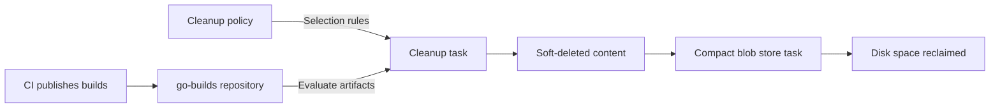

# 🧹 Nexus Cleanup Policies

## 🌐 Why Do We Need Cleanup?

CI pipelines keep publishing artifacts. Without a retention plan, yesterday’s test binaries can occupy space long after the team stops using them.

A **cleanup policy** describes which artifacts are eligible for removal. A **scheduled task** runs the cleanup operation.

> 💡 **Real-World Example**
>
> Our `payment-iran` pipeline uploads temporary binaries to a Raw repository named `go-builds`.
>
> - 📦 **Temporary builds:** Keep them for 7 days.
>
> - 🔎 **Cleanup check:** Run every night.
>
> - 🔒 **Production releases:** Store them separately in `go-binary`, with a retention period that supports rollback.

The policy answers **“what can be removed?”** The schedule answers **“when do we check?”**



This reference uses **self-hosted Nexus Repository 3 with a file-based blob store**. Object stores can use different removal mechanisms.

---

## 🎯 Choose What to Remove

Nexus offers these criteria, depending on repository format:

| Criterion | Meaning |
|---|---|
| **Component age** | Hosted: time since upload/update. Proxy: time since first download. |
| **Component usage** | Time since last download; never-downloaded content uses its published/updated date. |
| **Release type** | Select releases or prereleases/snapshots where supported. |
| **Asset name matcher** | Filter names or paths with a regular expression. |

Within one policy, enabled conditions use **AND**. Separate applied policies can each select content for deletion; another policy does not protect it. Preview the selection before running cleanup. See [Sonatype’s Cleanup Policies](https://help.sonatype.com/en/cleanup-policies.html).

### 📦 Example: Old and Unused Builds

Suppose our example policy selects builds that are:

- **Older than 30 days**, AND

- **Not downloaded for 14 days**.

| Build | Age | Time since last download | Eligible? |
|---|---:|---:|---|
| `payment-iran/build-101` | 45 days | 20 days | ✅ Both conditions match |
| `payment-iran/build-102` | 45 days | 2 days | No: recently downloaded |
| `payment-iran/build-103` | 10 days | 8 days | No: too new |

Adding a second policy that selects **all builds older than 7 days** would make all three eligible. The first policy’s usage condition would no longer protect `build-102`.

💡 Choose **age** when temporary content has a fixed useful lifetime. Choose **usage** when recent downloads indicate ongoing use. A production artifact can still matter even if nobody has downloaded it recently—for example, a rollback version.

---

## ⚙️ Create and Assign the Policy

The Classic UI separates policy creation from repository assignment:

```text
Settings
├── Repository
│   ├── Cleanup Policies           ← define rules
│   └── Repositories → go-builds
│       └── Cleanup                ← apply rules
└── System
    └── Tasks                     ← control execution
```

1. 🧹 **Create a policy.**

   Open **Settings → Repository → Cleanup Policies → Create Cleanup Policy**.

   Example configuration:

   ```text
   Name:           raw-builds-7d
   Format:         raw
   Component age:  7 days
   ```

2. 🔎 **Preview `go-builds`.**

   Review the proposed deletion list, then save.

3. 🔗 **Assign the policy.**

   Open **Repositories → go-builds → Cleanup**, move `raw-builds-7d` to the applied list, and save.

In Nexus One UI, use **Settings → Cleanup Policies**. See the [official workflow](https://help.sonatype.com/en/cleanup-policies.html). Merely creating the example rule leaves it unattached.

---

## 🗓️ Retention Period vs Execution Interval

These are two independent settings:

| Requirement | Setting to change |
|---|---|
| Keep temporary builds for 7 days | Policy age criterion: `7` |
| Keep them for 2 weeks | Policy age criterion: `2 × 7 = 14` days |
| Keep them for about a month | Policy age criterion: `30` days |
| Keep them for about 6 months | Policy age criterion: `180` days |
| Check every day/week/month | Cleanup task frequency |

**30 days is an approximation of a month; 180 days is an approximation of six months.** Calendar months have different lengths.

> 💡 **Example: Why Scheduling Matters**
>
> Imagine a build becomes eligible just after Monday’s cleanup finishes.
>
> - With a daily schedule, the next check is roughly one day away.
>
> - With a weekly schedule, the next check is roughly seven days away.
>
> The retention threshold stays the same. A less frequent check can leave eligible builds stored longer.

### 🔧 Where to Set the Schedule

Open **Settings → System → Tasks** and locate **Admin - Cleanup repositories using their associated policies**. Nexus creates this task automatically; its documented default is daily at **01:00 server time**. Edit its frequency rather than assuming it already matches your needs. Built-in frequencies include Manual, Once, Hourly, Daily, Weekly, Monthly, and Advanced. See [Sonatype’s Tasks](https://help.sonatype.com/en/tasks.html).

- 🗓️ **Every day:** Choose Daily and a quiet time.

- 🗓️ **Once a week:** Choose Weekly and the desired weekday.

- 🗓️ **Once a month:** Choose Monthly, preferably a date such as the 1st that exists in every month.

- 🗓️ **Every six calendar months:** Use an Advanced expression for two specified months.

The cleanup service processes repositories using their assigned policies. It does not give each policy its own independent timer. If two repositories need different retention, use different policies; first consider a shared daily check.

### 💻 Advanced Schedule Syntax

Nexus documents a seconds-first cron expression with an optional year:

```text
seconds minutes hours day-of-month month day-of-week [year]
```

These examples run at **02:00**, according to the task scheduler’s timezone:

| Schedule | Expression |
|---|---|
| Every day | `0 0 2 * * ?` |
| Every Monday | `0 0 2 ? * MON` |
| First day of each month | `0 0 2 1 * ?` |
| January 1 and July 1 | `0 0 2 1 1,7 ?` |
| Last day of each month | `0 0 2 L * ?` |

For the six-month example:

```text
0  0  2  1  1,7  ?
│  │  │  │   │   └── no specific weekday
│  │  │  │   └────── January and July
│  │  │  └────────── first day of the month
│  │  └───────────── hour 02
│  └──────────────── minute 00
└─────────────────── second 00
```

`*` means every allowed value. `?` leaves one day field unspecified. `L` in the day-of-month field means the last day. Check the displayed next execution after saving. See the [Quartz CronTrigger tutorial](https://www.quartz-scheduler.org/documentation/quartz-2.3.0/tutorials/crontrigger.html).

### ⏱️ What About Every Two Weeks?

**Exactly every 14 days is not a standard cron calendar pattern.** A day-of-month step such as `1/14` resets each month; it does not preserve a continuous two-week interval.

```text
January 1 → January 15 → January 29 → February 1
              14 days       14 days       3 days
```

For **14-day retention**, set the policy to `14` and check daily. For an exact **two-week execution interval**, use an external scheduler that tracks an anchor date and invokes the existing task through Nexus’s task API. Quartz distinguishes interval triggers from cron triggers in its [two-week scheduling example](https://www.quartz-scheduler.org/documentation/quartz-2.2.2/cookbook/BiWeeklyTrigger.html).

---

## 💾 Soft Delete vs Reclaiming Space

**Soft deletion** removes content from normal repository use but leaves stored bytes awaiting removal. **Compaction** permanently removes eligible soft-deleted blobs and returns space to the filesystem. Sonatype recommends combining policies with compaction in [Keeping Disk Usage Low](https://help.sonatype.com/en/keeping-disk-usage-low.html).

| Stage | Can clients use the removed artifact normally? | Are its bytes still stored? |
|---|---|---|
| Before cleanup | Yes | Yes |
| After soft deletion | No | Yes |
| After hard deletion | No | No |

1. 🧹 **Let repository cleanup finish.**

   Check the cleanup task’s result in **System → Tasks**.

2. 💾 **Create a compaction task for the file blob store.**

   Choose **Create task → Admin - Compact blob store**, select the store used by `go-builds`, and set a schedule or Manual frequency.

3. ✅ **Run compaction after successful cleanup.**

   Allow enough time for cleanup to finish; an arbitrary one-hour gap is not a guarantee of completion. Verify both task results.

The [compact task](https://help.sonatype.com/en/tasks.html) permanently removes soft-deleted files. A blob store shared by several repositories contains their deleted content too.

> ⚠️ Treat cleanup as data deletion. Practice on disposable artifacts; soft deletion is not a convenient undo button. Never remove Nexus-managed blob files with filesystem commands.

---

## 🧪 Understanding Check

**Q1:** Does a 7-day policy running weekly guarantee deletion exactly seven days after upload?

**Q2:** Why could an old build downloaded yesterday survive one policy but be removed by another?

**Q3:** Why can artifacts disappear from Browse while disk usage stays high?

**Q4:** Does `0 0 2 1/14 * ?` mean every two weeks forever?

> [!answer]- 📋 Answers
>
> **A1:** No. The age rule controls eligibility, and the next scheduled check controls when cleanup happens.
>
> **A2:** An age-and-usage policy can spare it, while an age-only policy can independently select it. Applied policies do not override one another with protection rules.
>
> **A3:** Cleanup can soft-delete content before its stored bytes are removed. Check compaction for the relevant file blob store.
>
> **A4:** No. The day-of-month sequence resets at month boundaries, producing uneven gaps.

## 🔨 Hands-On Practice

Use an isolated test repository containing only disposable files.

1. 🧹 **Create an unattached policy.**

   Use `raw-test-7d`, format `raw`, and an age threshold of `7` days. Preview the test repository without running cleanup.

   ✅ Freshly uploaded files should not qualify under this age-only rule.

2. 🔗 **Inspect assignment.**

   Apply the policy only to the test repository. Reopen its Cleanup section and confirm the applied policy name.

3. 🗓️ **Inspect execution.**

   Locate the cleanup service and inspect its enabled state, frequency, and next run. Remember that this service can affect other repositories with assigned policies.

4. 💾 **Connect storage to cleanup.**

   Find the test repository’s blob store, then inspect whether a compaction task targets it. Do not run compaction on a shared production store for this exercise.

   Remove the test policy assignment when finished if you do not want ongoing cleanup.

---

### 📋 Quick Reference

| Need | Go to / use |
|---|---|
| Define selection rules | Repository → Cleanup Policies |
| Apply a rule | Repositories → selected repository → Cleanup |
| Control timing | System → Tasks |
| Two-week retention | `14` days |
| Six-month calendar execution | `0 0 2 1 1,7 ?` |
| Reclaim file-store space | Admin - Compact blob store |

### 🧠 Things to Remember

- **Eligibility and execution are separate.**

- **Multiple policies can broaden deletion.**

- **A cleanup result and a disk-space result are different checks.**

### 💡 Pro Tips

- Name policies by purpose and threshold, such as `raw-builds-7d`, so their intent is visible during assignment.

- Keep temporary builds separate from rollback releases so a short retention rule has a clear scope.

- Review every applied policy together before changing one; a restrictive rule cannot neutralize a broader rule.

### 🔗 Related Topics

- [[3. Blob|Nexus Blob Stores]]

- [[2. Nexus Repository Manager — Raw Repositories, Users-Roles, and REST API]]

- [[1. Artifact and Artifact Repo]]
