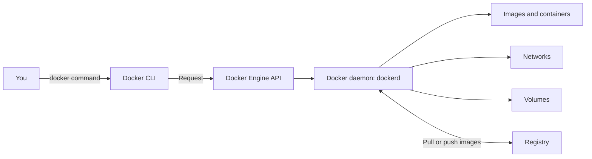
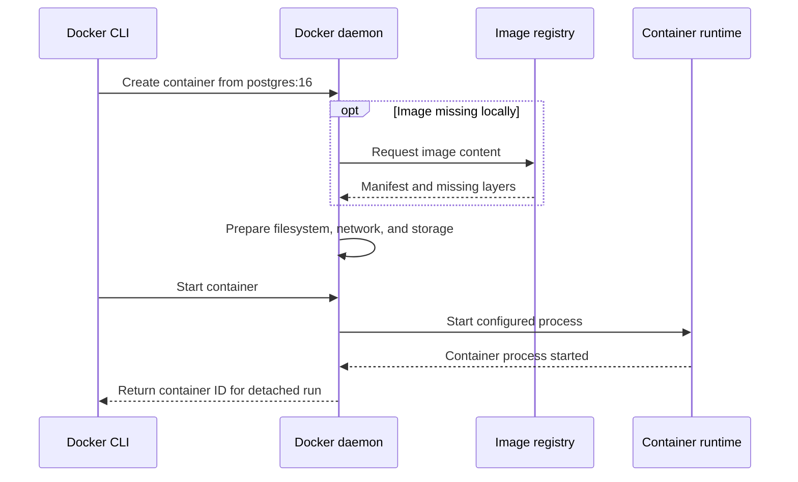
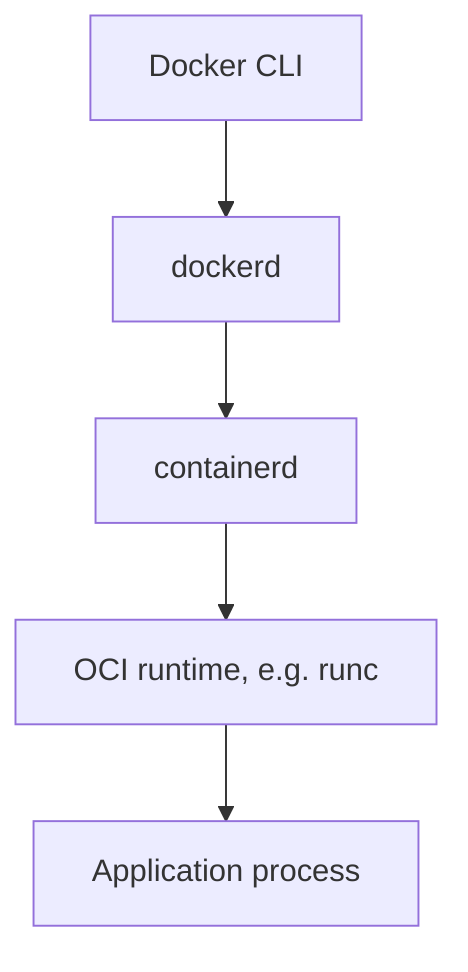
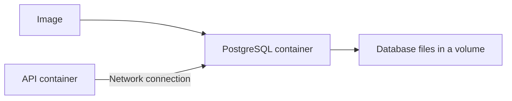

# 🐳 Docker Architecture and Components

[[DevOps/NaNa/0. Nana DevOps Table of Contents|📚 Nana DevOps Table of Contents]]

> [!toc]- 📑 Contents
>
> - [[#🌐 Docker Connects Several Tools|🌐 Docker Connects Several Tools]]
> - [[#🔗 CLI → API → Daemon|🔗 CLI → API → Daemon]]
> - [[#⚙️ What Happens When You Run a Container?|⚙️ What Happens When You Run a Container?]]
> - [[#📦 Building, Storage, and Networking|📦 Building, Storage, and Networking]]
> - [[#🔨 Hands-On Practice|🔨 Hands-On Practice]]
> - [[#📋 Quick Reference|📋 Quick Reference]]
> - [[#🧠 Things to Remember|🧠 Things to Remember]]
> - [[#💡 Pro Tips|💡 Pro Tips]]
> - [[#🔗 Related Topics|🔗 Related Topics]]


## 🌐 Docker Connects Several Tools

Containers existed before Docker. Docker made them easier to use by bringing image building, distribution, container management, networking, and storage into one workflow.

**Docker Engine** uses a client-server design: the command-line client sends requests to an API, and the server carries them out. See [Docker Engine](https://docs.docker.com/engine/).

> 💡 **Real-World Example**
>
> You type `docker run` to start PostgreSQL. The CLI sends the request; the Docker daemon coordinates image retrieval, container creation, networking, and startup.
>
> The CLI is the control tool. The application runs on the host managed by the daemon.

---

## 🔗 CLI → API → Daemon



| Component | Responsibility |
|---|---|
| **CLI: `docker`** | Turns your commands into API requests and displays results |
| **Engine API** | Defines operations clients can request |
| **Daemon: `dockerd`** | Manages Docker objects and coordinates the work |

The API is an interface exposed by the daemon, rather than a separate server you must start. On Linux, a local CLI commonly connects through a Unix socket. It can also connect to a remote daemon, so containers do not necessarily run on the computer where you type the command. See [Docker architecture](https://docs.docker.com/get-started/docker-overview/#docker-architecture).

---

## ⚙️ What Happens When You Run a Container?

Using the PostgreSQL example from [[DevOps/NaNa/Docker/1. Container|Containers, Images, and Virtual Machines]]:



This is a simplified flow. A locally available image is reused by default; container creation and startup are separate operations combined by `docker run`. See [`docker run`](https://docs.docker.com/reference/cli/docker/container/run/).

### 🧩 Runtime Responsibilities

Docker uses **containerd** for container lifecycle management. A low-level OCI runtime such as **runc** sets up the isolated process environment and starts the process. **OCI** means Open Container Initiative; its specifications let different tools work with standard container formats.



containerd handles tasks such as image transfer, storage, and execution. Docker supplies the broader developer workflow around it. See [containerd](https://containerd.io/) and its [runc integration](https://github.com/containerd/containerd/blob/main/docs/RUNC.md).

---

## 📦 Building, Storage, and Networking

These capabilities solve different parts of deployment:

- 🏗️ **Image building**

    - A Dockerfile describes how to assemble an image. Docker’s build tooling uses **BuildKit**, the build backend, to execute build steps and reuse cached work. See [BuildKit](https://docs.docker.com/build/buildkit/).

- 💾 **Volumes**

    - Hold data outside a container’s writable layer. Replacing a database container should not require throwing away its database files.

- 🌐 **Networks**

    - Connect containers and control how services are reached. Publishing a port provides a path from the host to a container service.



The image supplies software; the volume holds persistent data; the network carries requests. See Docker’s [object overview](https://docs.docker.com/get-started/docker-overview/#docker-objects).

### 🔀 Docker vs Other Container Tools

| Tool | Main role |
|---|---|
| **Docker Engine** | Manage containers, images, networks, and volumes through an API |
| **containerd** | Manage container execution, lifecycle, and image content |
| **CRI-O** | Provide Kubernetes with a runtime through its Container Runtime Interface |
| **Buildah** | Build container images without requiring the Docker daemon |

They occupy different parts of the workflow. For example, Buildah can produce an OCI image that a compatible runtime later runs. See the official [CRI-O project](https://cri-o.io/) and [Buildah](https://buildah.io/).

---

### 🧪 Interview Q&A

**Q1:** If the Docker CLI is installed, does that prove containers can run?

**Q2:** Does the Engine API need a separate server process from `dockerd`?

**Q3:** Why do Docker and containerd both appear in the architecture?

**Q4:** What should survive replacing a PostgreSQL container?

> [!answer]- 📋 Answers
>
> **A1:** No. The CLI also needs access to a working daemon, either local or remote.
>
> **A2:** No. The daemon exposes the Engine API and handles its requests.
>
> **A3:** Docker coordinates the broader workflow; containerd handles runtime tasks, using a low-level runtime to start isolated processes.
>
> **A4:** Its database data. Store it in persistent storage, such as a volume, and attach that storage to the replacement container.

## 🔨 Hands-On Practice

These inspection commands leave your Docker objects unchanged.

1. 💻 **Check the client and server.**

   ```bash
   docker version
   ```

   ✅ Look for both **Client** and **Server** sections. A connection error means the CLI cannot reach its configured daemon; check that the daemon is running and that the selected connection is correct. See [`docker version`](https://docs.docker.com/reference/cli/docker/version/).

2. 🌐 **Identify the selected connection.**

   ```bash
   docker context show
   docker context ls
   ```

   A **context** stores connection settings. `show` prints the selected context; `ls` lists contexts and endpoints. Environment variables or explicit CLI flags can override the configured selection. See [`docker context`](https://docs.docker.com/reference/cli/docker/context/).

3. 🔎 **Inspect what the server manages.**

   ```bash
   docker info
   docker network ls
   docker volume ls
   ```

   `info` reports server configuration and object counts. The two `ls` commands list networks and volumes, helping connect the architecture to actual Docker objects.

---

### 📋 Quick Reference

| Item | Purpose |
|---|---|
| `docker` | Command-line client |
| Engine API | Client-to-daemon interface |
| `dockerd` | Docker server |
| containerd → OCI runtime | Lifecycle management → isolated process startup |
| BuildKit | Image build backend |
| `docker version` | Check client and server versions/connectivity |
| `docker context ls` | Inspect configured daemon connections |
| `docker info` | Inspect server configuration |

### 🧠 Things to Remember

- Commands go through an API; the daemon coordinates the work.

- Your client can control containers on another host.

- Building an image and running a container are separate responsibilities.

- Persistent storage has a lifecycle separate from the container.

### 💡 Pro Tips

- Check the context before changing containers, especially when you use remote servers.

- Use `docker version` first when commands fail; it separates client availability from server connectivity.

- Learn the component roles before learning alternate tools, so you know which part of the workflow each replaces.

### 🔗 Related Topics

- [[DevOps/NaNa/Docker/1. Container|Containers, Images, and Virtual Machines]]

- [[DevOps/NaNa/Linux/Networking|Linux Networking]]

- [[DevOps/NaNa/Artifact Management/Nexus/3. Blob|Nexus Blob Stores]]
