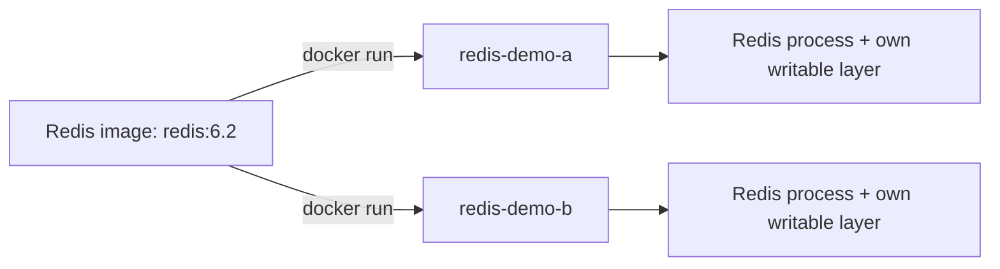
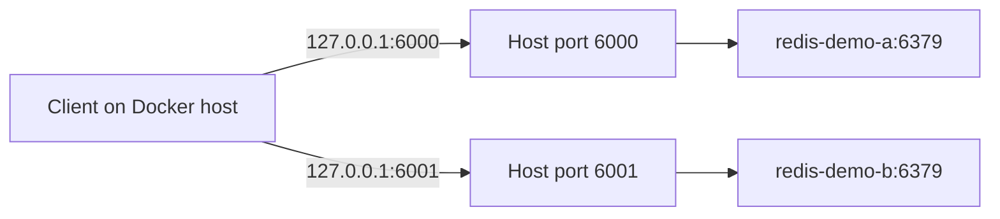
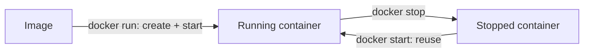

# 🐳 Docker Basic Commands

[[DevOps/NaNa/0. Nana DevOps Table of Contents|📚 Nana DevOps Table of Contents]]

> [!toc]- 📑 Contents
>
> - [[#📦 Images and Containers|📦 Images and Containers]]
> - [[#⬇️ Download and List Images|⬇️ Download and List Images]]
> - [[#▶️ Create and Run a Container|▶️ Create and Run a Container]]
> - [[#🔎 List Containers|🔎 List Containers]]
> - [[#🌐 Host Ports and Container Ports|🌐 Host Ports and Container Ports]]
> - [[#⏹️ Stop and Start the Same Container|⏹️ Stop and Start the Same Container]]
> - [[#🛠️ Debug with Logs and exec|🛠️ Debug with Logs and exec]]
> - [[#🧪 Interview Q&A|🧪 Interview Q&A]]
> - [[#🔨 Hands-On Practice|🔨 Hands-On Practice]]
> - [[#📋 Quick Reference|📋 Quick Reference]]
> - [[#🧠 Things to Remember|🧠 Things to Remember]]
> - [[#💡 Pro Tips|💡 Pro Tips]]
> - [[#🔗 Related Topics|🔗 Related Topics]]

## 📦 Images and Containers

An **image** packages an application and the files it needs. A **container** is an instance created from that image, with its own processes, writable filesystem layer, and runtime settings.

For example, one Redis image can create two independent Redis containers. Each container has its own name and configuration; stopping one does not stop the other.

| Image | Container |
|---|---|
| Template used to create instances | Instance that can be running or stopped |
| Example: `redis:6.2` | Example: `redis-demo-a` |
| Listed with `docker images` | Listed with `docker ps -a` |



A container does not need a published host port to run. Publishing a port gives a client a way to reach its application through the Docker host. See [Running containers](https://docs.docker.com/engine/containers/run/).

---

## ⬇️ Download and List Images

Use `docker pull` to download an image without starting a container:

```bash
docker pull redis:6.2
docker images
```

- 📦 **`redis`** → image repository name.

- 🏷️ **`6.2`** → image tag, selecting the Redis 6.2 release line for these course examples.

- 🔎 **`docker images`** → lists images stored by the Docker daemon, including repository, tag, image ID, and size.

Without a tag, `docker pull redis` requests `redis:latest`. **`latest` is a tag name**, not a guarantee of a particular version. A release tag makes the example clearer; tags can still change, whereas a digest identifies exact image content. See [Pull an image](https://docs.docker.com/reference/cli/docker/image/pull/).

---

## ▶️ Create and Run a Container

The general command is:

```bash
docker run [OPTIONS] IMAGE [COMMAND] [ARG...]
```

Run Redis in the foreground:

```bash
docker run redis:6.2
```

Docker creates a **new container** and starts its default application. If the image is missing locally, Docker pulls it first. Your terminal remains attached to the application's output.

For a service you want to leave running while you use the terminal, use detached mode:

```bash
docker run -d --name redis-demo-a -p 127.0.0.1:6000:6379 redis:6.2
```

- 💻 **`-d`** → runs detached and prints the container ID.

- 🏷️ **`--name redis-demo-a`** → gives the container a memorable name.

- 🌐 **`-p 127.0.0.1:6000:6379`** → maps host port `6000` on the loopback address to container port `6379`.

Detached mode frees your terminal; the container still stops if its main application exits. See [docker run](https://docs.docker.com/reference/cli/docker/container/run/).

> 💡 **Real-World Example**
>
> Your development application runs on the Docker host and needs Redis. Start `redis-demo-a` in the background, then configure the application to connect to `127.0.0.1:6000`.
>
> Redis continues listening on `6379` inside the container.

---

## 🔎 List Containers

```bash
docker ps
docker ps -a
```

**`docker ps`** lists running containers. **`docker ps -a`** includes stopped containers. These commands only display information; they do not start anything. See [List containers](https://docs.docker.com/reference/cli/docker/container/ls/).

Illustrative output:

```text
CONTAINER ID   IMAGE       COMMAND                  CREATED          STATUS         PORTS                      NAMES
ab12cd34ef56   redis:6.2   "docker-entrypoint.s…"   2 minutes ago    Up 2 minutes   127.0.0.1:6000->6379/tcp    redis-demo-a
```

| Field | What to notice |
|---|---|
| `CONTAINER ID` | Identifier; a unique prefix can be used in commands |
| `IMAGE` | Image used to create the container |
| `COMMAND` | Startup command; long values may be shortened |
| `STATUS` | `Up` means running; `Exited` means stopped |
| `PORTS` | Exposed ports and published host mappings |
| `NAMES` | Friendly name to use with `stop`, `start`, `logs`, and `exec` |

---

## 🌐 Host Ports and Container Ports

The **host port** is the entry point on the machine running Docker. The **container port** is where the application listens inside its container.

Port publishing uses this order:

```text
-p [HOST_IP:]HOST_PORT:CONTAINER_PORT

-p 127.0.0.1:6000:6379
   └ host IP ┘ host  container
```

To run a second Redis instance alongside `redis-demo-a`:

```bash
docker run -d --name redis-demo-b -p 127.0.0.1:6001:6379 redis:6.2
```



With normal bridge networking, both containers can listen on `6379` because they have separate network environments. The host mappings use different ports, so they do not compete for the same host address and TCP port.

The mapping **forwards traffic**; it does not reconfigure Redis to listen on `6000` or `6001`.

> ⚠️ **Keep local practice local.**
>
> `-p 6000:6379` publishes on all host interfaces by default. Use `-p 127.0.0.1:6000:6379` for these local exercises. Docker versions before 28.0.0 have a documented localhost-publishing limitation affecting peers on the same local network.

See [Port publishing and mapping](https://docs.docker.com/engine/network/port-publishing/).

### 🔎 Read a port mapping

```text
127.0.0.1:8081->8081/tcp
```

For the Nexus example, this means **host `127.0.0.1:8081` → container TCP port `8081`**. Matching numbers are convenient, but not required.

An entry such as `6379/tcp` alone shows an exposed container port, without a published host mapping.

---

## ⏹️ Stop and Start the Same Container

```bash
docker stop redis-demo-a
docker ps -a
docker start redis-demo-a
```

`docker stop` asks the main process to shut down, then forcibly stops it if the shutdown timeout expires. It leaves the container available for reuse. See [docker stop](https://docs.docker.com/reference/cli/docker/container/stop/).

`docker start` starts that **existing container** with its saved settings, including its name and port mapping. It starts the application again; it does not resume the old process's memory. See [docker start](https://docs.docker.com/reference/cli/docker/container/start/).



| Command | Use it when… |
|---|---|
| `docker run` | You want a new container and its initial configuration |
| `docker stop` | You want to shut down an existing container |
| `docker start` | You want to run a stopped container again |

Running the earlier `docker run --name redis-demo-a ...` command again does not restart it. Docker tries to create another container, and the existing name causes a conflict—even if that container is stopped.

To change the published ports, create a replacement container with the new mapping. `docker start` does not accept new `-p` settings.

---

## 🛠️ Debug with Logs and exec

### 📜 Read application logs

```bash
docker logs redis-demo-a
docker logs --tail 50 -f redis-demo-a
```

`docker logs` reads captured application output from standard output and standard error; it does not automatically read arbitrary log files inside the container.

- **`--tail 50`** → starts with the last 50 lines.

- **`-f`** → follows new log output.

Press **Ctrl+C** to end log following; the container keeps running. Logs can also help explain why a container exited. See [docker logs](https://docs.docker.com/reference/cli/docker/container/logs/).

### 💻 Run a command inside the container

`docker exec` starts an additional command in an already running container:

```bash
docker exec redis-demo-a redis-cli ping
```

✅ Expected response: `PONG`. Here, `redis-cli` runs **inside** the container and contacts Redis on its internal port `6379`. This checks Redis itself, rather than the published host-port path.

For an interactive shell:

```bash
docker exec -it redis-demo-a /bin/sh
```

- **`-i`** → keeps standard input open so you can type.

- **`-t`** → allocates a terminal for the session.

- **`/bin/sh`** → shell executable inside the container.

Run these commands inside that shell:

```sh
pwd
ls
exit
```

`exit` closes this additional shell; Redis keeps running. You can use `/bin/bash` instead if the image includes it. Minimal images may have only `sh`, or no shell at all. See [docker exec](https://docs.docker.com/reference/cli/docker/container/exec/).

### 🚧 Common problems

| Symptom | Check and action |
|---|---|
| Container is missing from `docker ps` | Use `docker ps -a`, then check its logs if it exited |
| Name is already in use | Locate the existing container; use `docker start` to reuse it or choose a different name |
| Host port is already allocated | Check existing mappings and host services; select a free host port |
| `exec` says the container is not running | Check its status and start it; inspect logs if it exits again |
| `/bin/bash` is missing | Try `/bin/sh`; available tools depend on the image |

---

## 🧪 Interview Q&A

**Q1:** Why can two Redis containers both listen on `6379`, while publishing both to `127.0.0.1:6000` causes a conflict?

**Q2:** A container disappeared from `docker ps` after you stopped it. Was it deleted?

**Q3:** How does `docker start redis-demo-a` differ from running its original `docker run` command again?

**Q4:** Does `-p 6000:6379` make Redis listen on `6000` inside the container?

**Q5:** Why does exiting a shell created with `docker exec` leave Redis running?

> [!answer]- 📋 Answers
>
> **A1:** Each container has its own network environment, so their internal ports are independent. Both host mappings would compete for the same host address and TCP port; use different host ports.
>
> **A2:** No. A normal stopped container remains visible in `docker ps -a` and can be started again.
>
> **A3:** `start` reuses the existing container and configuration. `run` creates a new container; reusing the existing name causes a conflict.
>
> **A4:** No. Docker forwards traffic from host port `6000` to Redis on container port `6379`.
>
> **A5:** The shell is an additional process. Exiting it ends that session, while Redis remains the container's main process.

---

## 🔨 Hands-On Practice

Use a running Docker Engine and the disposable examples above. Run Docker commands from your host terminal; choose other names or host ports if these are already in use.

1. 📦 **Create the two Redis containers.**

   Use the `docker run` examples for `redis-demo-a` and `redis-demo-b`, then check:

   ```bash
   docker ps
   ```

   ✅ Both should be running, with host ports `6000` and `6001` mapped to their own internal `6379` ports.

2. ⏹️ **Stop and reuse the first container.**

   ```bash
   docker stop redis-demo-a
   docker ps
   docker ps -a
   docker start redis-demo-a
   ```

   ✅ Only `redis-demo-b` appears in the running list while the first is stopped. Starting `redis-demo-a` reuses its ID and mapping.

3. 🔎 **Check the application and inspect its environment.**

   ```bash
   docker exec redis-demo-a redis-cli ping
   docker logs --tail 20 redis-demo-a
   docker exec -it redis-demo-a /bin/sh
   ```

   Run `pwd`, `ls`, and `exit` in the shell, then `docker ps` back on the host.

   ✅ `PONG` confirms Redis responds internally. Exiting the shell leaves the container running.

4. 🧹 **Clean up the disposable containers.**

   ```bash
   docker stop redis-demo-a redis-demo-b
   docker rm redis-demo-a redis-demo-b
   ```

   `docker rm` removes the stopped containers; the downloaded image remains available.

   > ⚠️ Remove only these practice containers. Removal deletes their writable layers; manage database data with persistent storage when you need to keep it.

---

### 📋 Quick Reference

| Goal | Command |
|---|---|
| Download image | `docker pull redis:6.2` |
| List local images | `docker images` |
| Create background container | `docker run -d --name redis-demo-a -p 127.0.0.1:6000:6379 redis:6.2` |
| List running containers | `docker ps` |
| Include stopped containers | `docker ps -a` |
| Stop / start existing container | `docker stop NAME` / `docker start NAME` |
| Read recent logs | `docker logs --tail 50 NAME` |
| Follow logs | `docker logs -f NAME` |
| Open shell | `docker exec -it NAME /bin/sh` |
| Check Redis internally | `docker exec NAME redis-cli ping` |
| Remove stopped practice container | `docker rm NAME` |

### 🧠 Things to Remember

- **`run` creates; `start` reuses.** A stopped container still exists.

- **`-d` belongs to `docker run`.** `docker ps` only lists containers.

- **Port order is host → container.** Publishing a port does not change the application's listening port.

- **Container lifetime follows its main process.** An `exec` shell is an additional process.

### 💡 Pro Tips

- **Use descriptive names** so you can inspect a container without copying its ID.

- **Check status before debugging inside it:** `docker ps -a` explains why `exec` may fail.

- **Use `--tail` for logs** to focus on recent events before following new output.

- **Use explicit image tags** for clear examples; use a digest when exact image identity matters.

### 🔗 Related Topics

- [[DevOps/NaNa/Docker/1. Container|Containers, Images, and Virtual Machines]]

- [[DevOps/NaNa/Docker/2. Docker Architecture And its Components|Docker Architecture and Components]]

- [[DevOps/NaNa/Linux/Networking|Linux Networking]]

- [[DevOps/NaNa/Artifact Management/Nexus/2. Nexus Repository Manager — Raw Repositories, Users Roles, and REST API|Nexus Repository Manager]]
