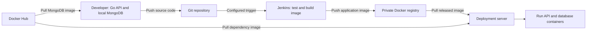
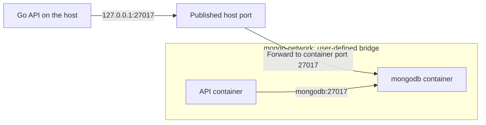

# 🐳 Docker Workflow in Real Projects

[[DevOps/NaNa/0. Nana DevOps Table of Contents|📚 Nana DevOps Table of Contents]]

> [!toc]- 📑 Contents
>
> - [[#🔄 From Development to Deployment|🔄 From Development to Deployment]]
> - [[#📦 Source Code, Images, and Registries|📦 Source Code, Images, and Registries]]
> - [[#🌐 Container Names vs Published Ports|🌐 Container Names vs Published Ports]]
> - [[#💻 Run MongoDB for Local Development|💻 Run MongoDB for Local Development]]
> - [[#🔎 Inspect the Network and Follow Logs|🔎 Inspect the Network and Follow Logs]]
> - [[#🧪 Interview Q&A|🧪 Interview Q&A]]
> - [[#🔨 Hands-On Practice|🔨 Hands-On Practice]]
> - [[#📋 Quick Reference|📋 Quick Reference]]
> - [[#🧠 Things to Remember|🧠 Things to Remember]]
> - [[#💡 Pro Tips|💡 Pro Tips]]
> - [[#🔗 Related Topics|🔗 Related Topics]]

## 🔄 From Development to Deployment

Docker lets developers run dependencies locally and package their application as an **image**. A deployment server downloads that image and starts a **container** from it.

> 💡 **Real-World Example**
>
> You develop a Go API that stores records in MongoDB. MongoDB runs in Docker; the Go API initially runs directly on your laptop.
>
> After you push the application code to Git, Jenkins tests it, builds an application image, and pushes that image to a private registry. A deployment step tells the server which image to pull and run.



1. 💻 **Develop locally.**

   Pull a database image instead of manually installing the database on your laptop.

2. 🌿 **Push code to version control.**

   A configured webhook or polling rule starts the CI pipeline. A local commit alone does not notify Jenkins.

3. 🏗️ **Test and build.**

   **CI — continuous integration** checks the code and produces the application image. The Go executable becomes part of that image.

4. 📦 **Publish the release.**

   Push the image to a private registry, such as a Docker hosted repository in Nexus.

5. 🚀 **Deploy.**

   The deployment process pulls the selected image and creates or replaces the application container, supplying configuration, networking, and storage.

**CD** can mean **continuous delivery**, where a release is ready for deployment and may require approval, or **continuous deployment**, where successful releases deploy automatically.

---

## 📦 Source Code, Images, and Registries

These repositories hold different things:

| Location | What it stores | Example |
|---|---|---|
| Git repository | Source code, Dockerfile, pipeline configuration | Go API project |
| Docker registry | Images packaged for distribution | `registry.example.com/team/go-api:1.0.0` |
| Running container | An instance created from an image | The deployed API process |

A Go executable can be an artifact on its own. In this Docker workflow, the **release artifact is the application image**, including the executable and its runtime files.

Nexus supports several repository formats. Docker clients need a **Docker registry endpoint**; the Raw repository URL used for uploading arbitrary files is a different interface.

### 🏗️ Build → Push → Pull → Run

This is an **illustrative release sequence**. It assumes the project already has a working Dockerfile, the private registry exists, and the relevant machines have authenticated with `docker login`.

On the CI runner, from the project directory:

```bash
docker build -t registry.example.com/team/go-api:1.0.0 .
docker push registry.example.com/team/go-api:1.0.0
```

- **`build`** creates the image; `-t` gives it a registry, repository, and tag. The final `.` selects the current directory as the build context.

- **`push`** uploads that tagged image. Replace `registry.example.com` with your actual registry endpoint. See [`docker image push`](https://docs.docker.com/reference/cli/docker/image/push/).

On the deployment server:

```bash
docker pull registry.example.com/team/go-api:1.0.0
docker run -d --name go-api registry.example.com/team/go-api:1.0.0
```

`pull` downloads the image; `run` creates and starts a container. The final command shows the basic relationship—an actual deployment also supplies the application's required settings and connections.

Pushing an image does **not** update a running container. The deployment process must select the new release and replace the container.

---

## 🌐 Container Names vs Published Ports

For containers on the same **user-defined bridge network**, Docker provides name resolution: an API container can reach a database named `mongodb` at `mongodb:27017`.

The default network named `bridge` does not provide the same automatic container-name resolution. These bridge networks connect containers on **one Docker host**. See [Docker bridge networks](https://docs.docker.com/engine/network/drivers/bridge/).



| Where the client runs | Database address in this example |
|---|---|
| Directly on the Docker host | `127.0.0.1:27017` through the published port |
| In a container on `mongo-network` | `mongodb:27017` |
| On another computer | A reachable Docker-host address and published port; the local-only binding below does not allow this |

**`localhost` refers to the environment where the client runs.** Inside an API container, `localhost` points to that API container—not to MongoDB or the Docker host. See [Docker's networking overview](https://docs.docker.com/engine/network/).

Container-to-container traffic on this network uses the **container port** and does not require `-p`. Publishing a port provides a convenient host entry point, especially when the Go API runs directly on your laptop.

### 🔌 Read a Port Mapping

```bash
-p 127.0.0.1:27018:27017
```

- **`127.0.0.1`** → bind the published port to the host's loopback address.

- **`27018`** → port the host application connects to.

- **`27017`** → port MongoDB listens on inside the container.

With this mapping, the host API uses `127.0.0.1:27018`; another container still uses `mongodb:27017`.

> ⚠️ Omitting the host IP, as in `-p 27017:27017`, publishes on all host interfaces by default. Use a loopback binding for this local database exercise. Docker releases before 28.0.0 have a same-LAN caveat for loopback publishing; see [port publishing](https://docs.docker.com/engine/network/port-publishing/).

---

## 💻 Run MongoDB for Local Development

Run these examples in a terminal connected to your **local Docker Engine**. Use unused object names and a free host port.

### 🌐 Create the Network

```bash
docker network ls
docker network create mongo-network
```

`ls` lists networks. `create NAME` creates a user-defined bridge network by default. Creating the network does not start any containers.

### 🔐 Prepare Database Settings

Create a local file named **`mongo.env`** and replace the password placeholder before running the container:

```dotenv
MONGO_INITDB_ROOT_USERNAME=admin
MONGO_INITDB_ROOT_PASSWORD=<LOCAL_LAB_PASSWORD>
```

These are settings recognized by the **official `mongo` image**, rather than universal Docker variables. Together they enable authentication and create a root user in the `admin` authentication database when the data directory is fresh. See the [official MongoDB image documentation](https://hub.docker.com/_/mongo).

Keep this file out of Git. The root account is for this local exercise; an application should use a separate user with only its required permissions.

### 🐳 Start the Container

```bash
docker run -d \
  --name mongodb \
  --network mongo-network \
  -p 127.0.0.1:27017:27017 \
  --env-file mongo.env \
  --mount type=volume,source=mongo-data,target=/data/db \
  mongo:8.0
```

| Part | Purpose |
|---|---|
| `-d` | Run in the background |
| `--name mongodb` | Set the container name |
| `--network mongo-network` | Join the network created above |
| `-p 127.0.0.1:27017:27017` | Publish a local host entry point |
| `--env-file mongo.env` | Read environment settings from the file |
| `--mount type=volume,...` | Store database files in the named volume `mongo-data` |
| `mongo:8.0` | Select the MongoDB 8.0 image series |

If needed, Docker creates the named volume and downloads a missing image. `mongo:8.0` is a version-series tag, not an immutable image identity; use a digest when a release must identify exact image content.

**`-e NAME=value`** passes one environment variable directly. For example, `-e MONGO_INITDB_ROOT_USERNAME=admin` sets the same username as the file. Variable spelling must match the image documentation exactly.

The backslashes join the lines into one shell command. Each `\` must be the final character on its line.

> 💾 **Persistent data**
>
> Removing the container leaves `mongo-data` available for a replacement container.
>
> Initialization variables do not change existing database users when that volume already contains a database. Changing `mongo.env` alone does not reset the stored password.

---

## 🔎 Inspect the Network and Follow Logs

Check the container and its network membership:

```bash
docker ps
docker network inspect mongo-network
```

`ps` shows running containers. `network inspect NAME` shows network details, including attached containers. Look for `mongodb` in the network's `Containers` section.

Follow MongoDB output:

```bash
docker logs --tail 50 -f mongodb
```

- **`--tail 50`** starts with the last 50 log lines.

- **`-f` / `--follow`** keeps streaming new output.

- **`mongodb`** identifies the container whose logs you want.

Press **Ctrl+C** to stop following; the database continues running. Docker displays the container's standard output and standard error. See [`docker container logs`](https://docs.docker.com/reference/cli/docker/container/logs/).

An `Up` status shows that the container is running. A successful database command is a stronger check that MongoDB is ready to accept connections.

| Symptom | Check → next action |
|---|---|
| Container exited | Use `docker ps -a` and `docker logs mongodb` to inspect the startup error |
| Host port is occupied | Change only the host port, for example to `127.0.0.1:27018:27017` |
| Container client cannot resolve `mongodb` | Check that both containers joined `mongo-network` |
| Authentication fails | Check the password, the `admin` authentication database, and whether the volume was initialized previously |

---

## 🧪 Interview Q&A

**Q1:** What is stored in Git, and what is pushed to the Docker registry?

**Q2:** Does publishing a new image automatically update the deployed application?

**Q3:** Why can a host API use `127.0.0.1:27017`, while a container API uses `mongodb:27017`?

**Q4:** If the mapping changes to `27018:27017`, which address changes?

**Q5:** Why might a new `MONGO_INITDB_ROOT_PASSWORD` value fail to change the database password?

> [!answer]- 📋 Answers
>
> **A1:** Git stores the project source and build instructions. The registry stores the built application image.
>
> **A2:** No. A deployment step must pull the selected release and replace the application container.
>
> **A3:** The host uses the published port. The container uses Docker name resolution and MongoDB's internal port on their shared user-defined network.
>
> **A4:** The host client now uses port `27018`. A client on the shared network still uses `mongodb:27017`.
>
> **A5:** Those settings initialize a fresh database. An existing database in the volume retains its stored users and passwords.

## 🔨 Hands-On Practice

Use the local MongoDB setup above. These checks need Docker and access to download the image; the examples have not been executed as part of this note.

1. 🔎 **Confirm the setup.**

   Run `docker ps` and `docker network inspect mongo-network`.

   ✅ Find `mongodb` running and attached to `mongo-network`.

2. 🌐 **Connect from a second container by name.**

   Once MongoDB finishes starting, run a temporary database client:

   ```bash
   docker run --rm -it --network mongo-network mongo:8.0 \
     mongosh --host mongodb --port 27017 \
     --username admin --authenticationDatabase admin \
     --eval 'db.runCommand({ping: 1})' --password
   ```

   Enter the password from `mongo.env` when prompted. `--rm` removes the client container after it exits; `-it` allows interactive password entry. `--eval` runs the database command. See [MongoDB Shell options](https://www.mongodb.com/docs/mongodb-shell/reference/options/).

   ✅ A response containing `ok: 1` confirms that name resolution, connectivity, and authentication worked. This connection uses `mongodb:27017`, bypassing the published host port.

3. 🧹 **Remove the lab containers and network when finished.**

   ```bash
   docker stop mongodb
   docker rm mongodb
   docker network rm mongo-network
   ```

   These commands stop and remove the database container, then remove its network. They retain `mongo-data`.

   > ⚠️ To discard the lab database permanently, run `docker volume rm mongo-data` only after confirming you no longer need its contents.

---

### 📋 Quick Reference

| Operation or relationship | Command / address |
|---|---|
| List networks | `docker network ls` |
| Create a bridge network | `docker network create mongo-network` |
| Check membership | `docker network inspect mongo-network` |
| Pass one setting | `-e NAME=value` |
| Load settings from a file | `--env-file mongo.env` |
| Publish a port | `-p HOST_IP:HOST_PORT:CONTAINER_PORT` |
| Host → MongoDB in this lab | `127.0.0.1:27017` |
| Shared-network container → MongoDB | `mongodb:27017` |
| Follow recent logs | `docker logs --tail 50 -f mongodb` |
| Release flow | Build image → push → pull → create container |

### 🧠 Things to Remember

- **Source code and images have different repositories.**

- **A registry push needs a separate deployment step.**

- **User-defined bridge networks provide container-name resolution.**

- **Host clients use the published host port; peer containers use the container port.**

- **Database data and initialized credentials survive container replacement when the volume is retained.**

### 💡 Pro Tips

- Tag application images with a release version or commit identifier so you can trace them to source code. Avoid relying on `latest` for release selection.

- Use container names instead of copying container IP addresses; IP addresses can change when containers are recreated.

- Publish the database port only when a host client needs it. Peer containers can connect through their shared network.

- Keep development credentials out of the repository and use an application-specific database user beyond the lab.

### 🔗 Related Topics

- [[DevOps/NaNa/Docker/1. Container|Containers and Images]]

- [[DevOps/NaNa/Docker/2. Docker Architecture And its Components|Docker Architecture and Components]]

- [[DevOps/NaNa/Docker/3. Basic Commands|Docker Basic Commands]]

- [[DevOps/NaNa/Artifact Management/Nexus/1. Artifact and Artifact Repo|Artifacts and Artifact Repositories]]

- [[DevOps/NaNa/Artifact Management/Nexus/2. Nexus Repository Manager — Raw Repositories, Users Roles, and REST API|Nexus Repository Manager]]

- [[DevOps/NaNa/Linux/Networking|Linux Networking]]
