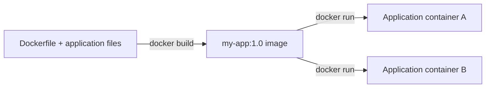
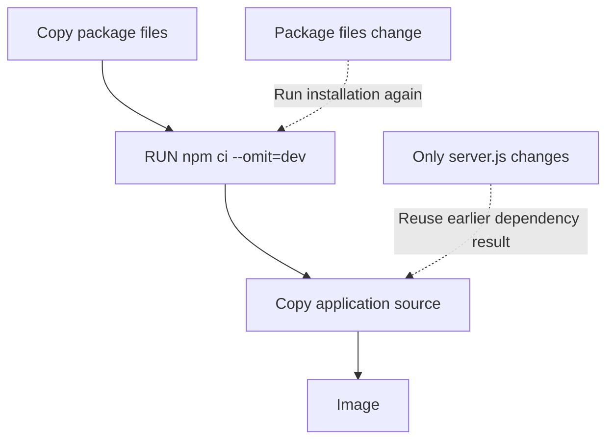

# 🐳 Dockerfile — Build Your Own Image

[[DevOps/NaNa/0. Nana DevOps Table of Contents|📚 Nana DevOps Table of Contents]]

> [!toc]- 📑 Contents
>
> - [[#🧩 From Application Files to a Docker Image|From Application Files to a Docker Image]]
> - [[#💻 A Complete Node.js Example|A Complete Node.js Example]]
> - [[#🔍 Read the Dockerfile|Read the Dockerfile]]
> - [[#📁 Build Context and COPY|Build Context and COPY]]
> - [[#⚡ Dependency Installation and Build Cache|Dependency Installation and Build Cache]]
> - [[#▶️ RUN vs CMD vs ENTRYPOINT|RUN vs CMD vs ENTRYPOINT]]
> - [[#🎛️ Configure the Container at Runtime|Configure the Container at Runtime]]
> - [[#🔨 Hands-On Practice|Hands-On Practice]]
> - [[#🧪 Interview Q&A|Interview Q&A]]
> - [[#📋 Quick Reference|Quick Reference]]
> - [[#🧠 Things to Remember|Things to Remember]]
> - [[#💡 Pro Tips|Pro Tips]]
> - [[#🔗 Related Topics|Related Topics]]

## 🧩 From Application Files to a Docker Image

A **Dockerfile** is the recipe Docker reads to build an image. It selects a base environment, adds your files, and defines how the application starts.

> 💡 **Real-World Example**
>
> Your Node.js application needs Node and its source files. Package them into `my-app:1.0`, then run containers from that image on machines with a compatible Docker environment.
>
> You do not need to install Node directly on each host.



The **image** is the packaged template; a **container** is an instance created from it. Dockerfile instructions assemble the image during a build, while the configured startup command runs when a container starts. See Docker's [Dockerfile overview](https://docs.docker.com/build/concepts/dockerfile/).

---

## 💻 A Complete Node.js Example

Create a new practice directory named **`dockerfile-lab`** outside the vault. Treat that directory as the **project root** and run this lesson's commands there. You need Docker Engine running; local Node is not required for this example.

Create these three files at the project root:

### 📄 `server.js`

```javascript
const http = require('node:http');

const port = Number(process.env.PORT || 3000);
const message = process.env.APP_MESSAGE || 'Hello from Docker';

http.createServer((req, res) => {
  res.writeHead(200, { 'Content-Type': 'text/plain' });
  res.end(`${message}\n`);
}).listen(port, '0.0.0.0', () => {
  console.log(`Listening on port ${port}`);
});
```

This uses Node's built-in HTTP module, so it needs no downloaded packages. It reads configuration from environment variables and listens on all container network interfaces so published traffic can reach it.

### 📄 `Dockerfile`

```dockerfile
FROM node:24-alpine

WORKDIR /home/app

ENV PORT=3000

COPY --chown=node:node server.js ./

USER node

EXPOSE 3000

CMD ["node", "server.js"]
```

### 📄 `.dockerignore`

```text
node_modules
.git
.env
.env.*
*.log
```

This keeps local dependencies, Git history, environment files, and logs out of the build context. See [build context and .dockerignore](https://docs.docker.com/build/concepts/context/).

---

## 🔍 Read the Dockerfile

The usual syntax is **`INSTRUCTION arguments`**. Uppercase instruction names improve readability; Docker also accepts lowercase instruction names.

| Line | What it means here |
|---|---|
| `FROM node:24-alpine` | Begin with Node 24 packaged on Alpine Linux |
| `WORKDIR /home/app` | Create this directory if needed and use it as the working directory |
| `ENV PORT=3000` | Store a default environment variable in the image |
| `COPY --chown=node:node server.js ./` | Copy the source into `/home/app`, owned by the image's `node` user and group |
| `USER node` | Run following build commands and the container's application as this non-root user |
| `EXPOSE 3000` | Document the intended container port; it does not publish it |
| `CMD ["node", "server.js"]` | Define the default startup command |

`WORKDIR` makes a separate `RUN mkdir -p /home/app` unnecessary here. Relative destinations such as `./` use the current working directory.

The base image supplies Node, npm, and Alpine user-space tools. A plain `alpine` image does not include Node. Linux containers use the host's Linux kernel, or a Linux VM's kernel with Docker Desktop; a base image does not boot its own kernel.

Instructions must use tools available in the selected image. For example, an Alpine-based image uses `apk` for packages; it does not normally provide Ubuntu's `apt`. See the [Dockerfile reference](https://docs.docker.com/reference/dockerfile/).

---

## 📁 Build Context and COPY

Build the image from the project root:

```bash
docker build -t my-app:1.0 .
```

- 📦 **`-t my-app:1.0`** gives the resulting image a name and tag.

- 📁 **`.`** selects the current directory as the **build context**, the files available to the builder.

- 📄 **`Dockerfile`** is the default instruction file in that context.

For ordinary local copies, `COPY` reads from the build context, not from arbitrary paths on your computer:

```dockerfile
COPY ./app /home/app
```

This copies the **contents** of the context's `app` directory into `/home/app` in the image. It does not make a live connection between the two directories.

```dockerfile
COPY . /home/app
```

This copies the context contents, subject to `.dockerignore`. If you later edit a host file, rebuild the image and recreate the container to use that change. A live host-directory mount is covered in [[DevOps/NaNa/Docker/7. Docker Volume|Docker Volume]].

To select a differently named Dockerfile:

```bash
docker build -f Dockerfile.dev -t my-app:dev .
```

Here `-f` selects the instruction file; the final `.` still selects the context. Create `Dockerfile.dev` before using this variation. See Docker's [build-context documentation](https://docs.docker.com/build/concepts/context/).

---

## ⚡ Dependency Installation and Build Cache

Real applications often have dependencies described by `package.json` and locked by `package-lock.json`. For an existing Node project with both files, this is an alternative Dockerfile:

```dockerfile
FROM node:24-alpine

WORKDIR /home/app

COPY package.json package-lock.json ./
RUN npm ci --omit=dev

COPY --chown=node:node . .

USER node
EXPOSE 3000
CMD ["node", "server.js"]
```

Use this version only when the project has those package files and can run directly from `server.js` without a separate compilation step. Keep the earlier `.dockerignore`.

- 📦 **`npm ci`** installs from the lockfile and fails if it disagrees with `package.json`.

- 🧹 **`--omit=dev`** leaves development dependencies out of the installed tree. Runtime dependencies must be listed under `dependencies`.

This gives controlled dependency versions rather than automatically selecting the newest packages on every build. See the [npm ci documentation](https://docs.npmjs.com/cli/v11/commands/npm-ci/).

Docker can reuse cached build results. Copy package files **before** the frequently changing source so editing `server.js` does not invalidate dependency installation.



A `RUN npm install` step can also be cached. Docker does not query npm to decide whether an unchanged `RUN` needs refreshing. `--no-cache` forces build steps to run again; `--pull` separately checks for a newer base image. See [build cache invalidation](https://docs.docker.com/build/cache/invalidation/).

```bash
docker build --pull --no-cache -t my-app:1.1 .
```

Use this when you deliberately want a fresh build. It is usually unnecessary for every source change.

---

## ▶️ RUN vs CMD vs ENTRYPOINT

| Instruction | When it acts | Typical purpose |
|---|---|---|
| `RUN` | During image build | Install packages or generate build output |
| `CMD` | When the container starts | Supply a default command or default arguments |
| `ENTRYPOINT` | When the container starts | Select the main executable |

`RUN npm ci` prepares the image. `CMD ["node", "server.js"]` starts the application later. Running the server with `RUN` would start it during the build and could prevent the build from finishing.

The brackets form a JSON array: each quoted string is a separate argument. This **exec form** runs the program without inserting a shell. Only the final `CMD` takes effect; it does not have to be the last physical line in the file.

A command after the image name replaces `CMD`:

```bash
docker run --rm my-app:1.0 node --version
```

This prints Node's version instead of starting the server. `--rm` removes this temporary container after it exits.

An alternative startup configuration is:

```dockerfile
ENTRYPOINT ["node"]
CMD ["server.js"]
```

With that configuration, `docker run --rm my-app:1.0 --version` passes `--version` to Node, replacing the default `server.js` argument. See [CMD and ENTRYPOINT interaction](https://docs.docker.com/reference/dockerfile/#understand-how-cmd-and-entrypoint-interact).

---

## 🎛️ Configure the Container at Runtime

Keep changing settings outside the image when possible:

```bash
docker run -d --name dockerfile-lab \
  -p 127.0.0.1:3000:3000 \
  -e APP_MESSAGE="Hello from runtime configuration" \
  my-app:1.0
```

- ▶️ **`-d`** runs in the background; **`--name`** gives the container a readable name.

- 🌐 **`-p 127.0.0.1:3000:3000`** publishes host loopback port `3000` to container port `3000`.

- 🎛️ **`-e APP_MESSAGE=...`** supplies a value when creating the container.

The application reads `APP_MESSAGE`; setting an arbitrary variable has no effect unless the application uses it. Runtime environment settings can override `ENV` defaults. To change them on an existing container, recreate it with the new settings.

For a Compose service, the equivalent setting goes beneath `environment`:

```yaml
services:
  app:
    image: my-app:1.0
    ports:
      - "127.0.0.1:3000:3000"
    environment:
      APP_MESSAGE: "Hello from Compose"
```

This is an alternative `compose.yaml` for the already-built image. Stop the earlier container before using it, since both publish host port `3000`. See [[DevOps/NaNa/Docker/5. Docker Compose|Docker Compose]].

Inspect the running container's environment with:

```bash
docker exec dockerfile-lab env
```

`exec` runs a command in an existing running container. `env` prints its environment; avoid sharing that output when it contains credentials.

> 🔐 Do not bake database passwords into `ENV`, `ARG`, or copied files. Keep secrets out of the image; for builds that need credentials, use build secret mounts. Version tags such as `24-alpine` can move; use a digest when an exact base image is required. See Docker's [build best practices](https://docs.docker.com/build/building/best-practices/).

---

## 🔨 Hands-On Practice

1. 📦 **Build the dependency-free example.**

   Create the three files from the first example in `dockerfile-lab`, then run `docker build -t my-app:1.0 .` there.

   ✅ A successful build produces `my-app:1.0`. No local npm installation is needed.

2. 🌐 **Start and inspect it.**

   Run the earlier `docker run -d` command, then:

   ```bash
   docker logs --tail 20 dockerfile-lab
   curl http://127.0.0.1:3000
   ```

   `logs --tail 20` shows the last 20 log lines. `curl` requests the published endpoint.

   ✅ Expect `Listening on port 3000` in the logs and `Hello from runtime configuration` in the response. If port `3000` is occupied, publish `127.0.0.1:3001:3000` and request host port `3001`.

3. 🧹 **Remove the lab container when finished.**

   ```bash
   docker stop dockerfile-lab
   docker rm dockerfile-lab
   ```

   `stop` stops the application; `rm` removes its container. The image remains available for another run.

---

## 🧪 Interview Q&A

**Q1:** Does `RUN` start the application whenever a container starts?

**Q2:** Why does `COPY package.json package-lock.json ./` come before copying source?

**Q3:** Does `COPY . .` keep host files synchronized with the container?

**Q4:** Why does `EXPOSE 3000` still need a `-p` option for host access?

**Q5:** Must a password change require rebuilding the image?

> [!answer]- 📋 Answers
>
> **A1:** No. `RUN` executes during image build. `CMD` and `ENTRYPOINT` define container startup behavior.
>
> **A2:** It lets Docker reuse the dependency-installation result when only source files change.
>
> **A3:** No. It copies files during the build. Later host edits require a rebuild, or a bind mount for a development workflow.
>
> **A4:** `EXPOSE` documents the intended port. `-p` creates the host-to-container port mapping.
>
> **A5:** No. Supply credentials through runtime configuration or a secret mechanism and recreate the container when necessary. Do not embed them in the image.

### 📋 Quick Reference

| Task | Instruction / command |
|---|---|
| Select base image | `FROM node:24-alpine` |
| Set working directory | `WORKDIR /home/app` |
| Execute a build step | `RUN npm ci --omit=dev` |
| Set default startup command | `CMD ["node", "server.js"]` |
| Build from current directory | `docker build -t my-app:1.0 .` |
| Supply runtime configuration | `docker run -e NAME=value IMAGE` |
| Run a temporary command | `docker run --rm my-app:1.0 node --version` |
| Inspect logs | `docker logs --tail 20 dockerfile-lab` |

### 🧠 Things to Remember

- A Dockerfile builds an image; containers start from that image.

- Build commands use the image's environment and available tools.

- The final build argument selects the context that `COPY` reads.

- Dependency installation can be cached; rebuilding does not mean downloading the latest packages.

### 💡 Pro Tips

- Copy only what the application needs; `.dockerignore` keeps unnecessary and sensitive files out of the context.

- Use exec-form startup commands for direct process execution and clearer argument handling.

- Keep stable dependency steps before frequently changing source files to speed up rebuilds.

- Use multi-stage builds when compilation requires tools that the final runtime does not need.

### 🔗 Related Topics

- [[DevOps/NaNa/Docker/1. Container|Containers and Images]]

- [[DevOps/NaNa/Docker/3. Basic Commands|Docker Basic Commands]]

- [[DevOps/NaNa/Docker/5. Docker Compose|Docker Compose]]

- [[DevOps/NaNa/Docker/7. Docker Volume|Docker Volume]]

- [[DevOps/NaNa/Linux/ENV|Environment Variables]]
