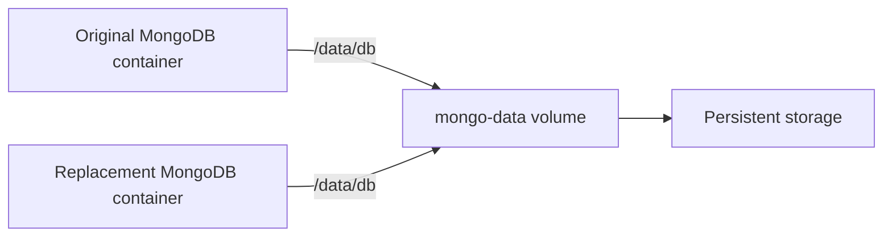
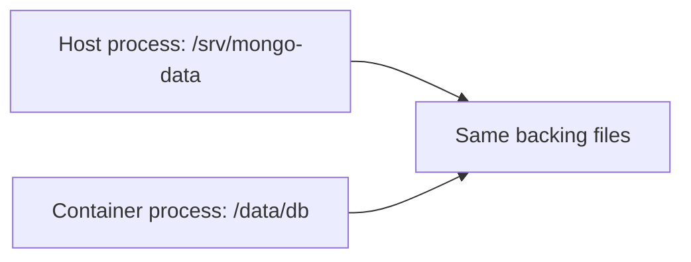
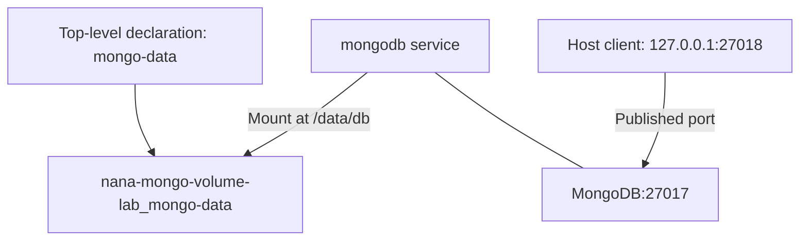

# 💾 Docker Volume — Keep Data Beyond a Container

[[DevOps/NaNa/0. Nana DevOps Table of Contents|📚 Nana DevOps Table of Contents]]

> [!toc]- 📑 Contents
>
> - [[#🧩 Why Containers Need Persistent Storage|Why Containers Need Persistent Storage]]
> - [[#📦 Named Volumes, Anonymous Volumes, and Bind Mounts|Named Volumes, Anonymous Volumes, and Bind Mounts]]
> - [[#🔗 What a Mount Actually Does|What a Mount Actually Does]]
> - [[#💻 Read the Mount Syntax|Read the Mount Syntax]]
> - [[#🍃 MongoDB Storage in Compose|MongoDB Storage in Compose]]
> - [[#📁 Where Docker Stores Volumes|Where Docker Stores Volumes]]
> - [[#🔄 Storage Lifecycle and Deletion|Storage Lifecycle and Deletion]]
> - [[#🔨 Hands-On Practice|Hands-On Practice]]
> - [[#🧪 Interview Q&A|Interview Q&A]]
> - [[#📋 Quick Reference|Quick Reference]]
> - [[#🧠 Things to Remember|Things to Remember]]
> - [[#💡 Pro Tips|Pro Tips]]
> - [[#🔗 Related Topics|Related Topics]]

## 🧩 Why Containers Need Persistent Storage

A container has a **writable layer** for changes made while it exists. Stopping and restarting the **same container** keeps that layer; removing the container removes it.

A **volume** stores data outside that layer, allowing a replacement container to reuse it. Docker manages the volume as a separate resource. See Docker's [storage overview](https://docs.docker.com/engine/storage/).

> 💡 **Real-World Example**
>
> MongoDB writes database files to `/data/db`. You replace its container to use a newer image, while mounting the same `mongo-data` volume at `/data/db`.
>
> The replacement reads the existing database files from that volume. A compatible database version is still required.



Only files written **inside the mounted path** go into that storage. Mounting `/data/db` does not persist every file elsewhere in the container.

---

## 📦 Named Volumes, Anonymous Volumes, and Bind Mounts

The `-v` option supports three common forms:

| Storage choice | Example mount argument | Who selects the backing location? | Typical use |
|---|---|---|---|
| **Named volume** | `mongo-data:/data/db` | Docker manages storage under a chosen volume name | Database data reused across containers |
| **Anonymous volume** | `/data/db` | Docker manages storage under a generated name | Temporary or image-declared storage |
| **Bind mount** | `/srv/mongo-data:/data/db` | You select a host path | Host-managed files or configuration |

Named and anonymous volumes use the same volume mechanism. A stable name makes it easier to inspect, reuse, and deliberately remove the correct storage.

Named volumes are a useful default for database data because Docker manages their location and exposes commands for attaching and inspecting them. They reduce dependence on a particular host directory layout. See [Docker volumes](https://docs.docker.com/engine/storage/volumes/).

A bind mount is useful when you want direct control of a host directory, such as source files you edit during development. It depends on that host path and its permissions. See [bind mounts](https://docs.docker.com/engine/storage/bind-mounts/).

> 💡 A named volume is not automatically a production storage system. With the ordinary local configuration, data remains on one Docker host. You still need backups and storage suited to your deployment.

---

## 🔗 What a Mount Actually Does

A mount makes backing storage accessible at a path inside the container. It does **not** maintain two independent copies of a directory.

For a bind mount:



A write through either path changes those backing files, subject to permissions. An application may cache data, but there is no separate Docker synchronization step.

- 📁 **Mounting over an existing directory hides its underlying image files.**

    - A bind mount shows the host directory's contents at that path.

    - An empty volume normally receives existing contents from the container's target directory on first use. An already populated volume shows its own contents instead. See [mounting a volume over existing data](https://docs.docker.com/engine/storage/volumes/#mounting-a-volume-over-existing-data).

- 🔐 **A mount does not bypass filesystem permissions.**

    - The container process still needs suitable access as its effective user and group.

    - A read-only mount prevents writes through that container mount.

For configuration files, a read-only bind mount is often useful:

```bash
docker run --rm \
  --mount type=bind,src="$(pwd)/config",dst=/config,readonly \
  alpine:3.22 ls -l /config
```

Run this in a practice directory containing an existing **`config`** subdirectory. `$(pwd)` expands to its absolute host path, `readonly` prevents container writes, and `ls -l /config` lists the mounted contents. `--rm` removes the temporary container after the command exits.

> ⚠️ A writable bind mount gives the container access to change or delete the mounted host files. Use a dedicated practice directory; avoid mounting sensitive host directories unnecessarily.

---

## 💻 Read the Mount Syntax

General short syntax:

```text
-v SOURCE:CONTAINER_PATH[:OPTIONS]
```

The source is either a volume name or a host path. The container path must be absolute. Adding `:ro` makes the mount read-only.

### 📦 A Named Volume

For a plain-file storage example using Alpine:

```bash
docker volume create nana-volume-lab
docker run --rm \
  -v nana-volume-lab:/data \
  alpine:3.22 ls -l /data
```

`volume create` creates the named storage. `-v nana-volume-lab:/data` mounts it at `/data`; the image name comes after the Docker options, followed by the command to run.

The longer equivalent mount argument is:

```text
--mount type=volume,src=nana-volume-lab,dst=/data
```

### 📁 A Bind Mount

```bash
mkdir -p ./volume-bind-lab
docker run --rm \
  --mount type=bind,src="$(pwd)/volume-bind-lab",dst=/data \
  alpine:3.22 ls -l /data
```

`mkdir -p` creates the dedicated host directory if needed. With `--mount`, a missing bind source normally causes an error; `-v` instead creates a missing host source as a directory. This difference helps explain unexpected empty-directory mounts. See [bind mount syntax](https://docs.docker.com/engine/storage/bind-mounts/#syntax).

### 🏷️ An Anonymous Volume

The short mount form is just the destination:

```text
-v /data
```

Docker chooses the volume's name. It can persist after ordinary container removal, but a new unrelated container does not automatically know which generated volume to reuse. `docker run --rm` removes associated anonymous volumes when the container is removed; named volumes are retained. See [named and anonymous volumes](https://docs.docker.com/engine/storage/volumes/#named-and-anonymous-volumes).

---

## 🍃 MongoDB Storage in Compose

Create a separate local practice directory named **`mongo-volume-lab`** outside the vault. Save these two files there, and run Compose commands from that project root.

### 📄 `compose.yaml`

```yaml
name: nana-mongo-volume-lab

services:
  mongodb:
    image: mongo:8.0
    ports:
      - "127.0.0.1:27018:27017"
    environment:
      MONGO_INITDB_ROOT_USERNAME: admin
      MONGO_INITDB_ROOT_PASSWORD: "${MONGO_ROOT_PASSWORD:?Set MONGO_ROOT_PASSWORD in .env}"
    volumes:
      - mongo-data:/data/db

volumes:
  mongo-data:
    driver: local
```

### 🔐 `.env`

```dotenv
MONGO_ROOT_PASSWORD=<CHOOSE_A_LOCAL_LAB_PASSWORD>
```

Replace the placeholder before starting. Keep `.env` out of Git by adding it to `.gitignore`.

The two `volumes` sections have different jobs:

- 📦 **Top-level `volumes`** declares `mongo-data` as a named resource.

    - It aligns with `services`, using spaces for YAML indentation.

- 🔗 **Service-level `volumes`** attaches that resource to MongoDB at `/data/db`.

    - Mount the image's documented data path; an arbitrary directory will not capture the database files.

- ⚙️ **`driver: local`** selects Docker's built-in local volume driver.

    - Without extra driver options, it uses Docker-managed storage on the daemon host. It is the default and can be omitted.

Compose creates and reuses the project-scoped volume **`nana-mongo-volume-lab_mongo-data`**. See [Compose volume declarations](https://docs.docker.com/reference/compose-file/volumes/).



`27018` is the host port; MongoDB still listens on container port `27017`. This avoids the `27017` host mapping used in lesson 5. If host port `27018` is occupied too, choose another free host port.

MongoDB initializes the root user when its data directory is fresh. Changing `.env` later does not change the password already stored in the database. See the [MongoDB image documentation](https://hub.docker.com/_/mongo).

Validate, start, and inspect the service:

```bash
docker compose config -q
docker compose up -d
docker compose ps
docker compose logs --tail 30 mongodb
```

`config -q` validates without printing resolved values. `up -d` creates and starts the service in the background. `ps` shows its state; `logs --tail 30` shows recent startup output. Running status alone does not prove the database is ready; the practice below checks it directly.

---

## 📁 Where Docker Stores Volumes

Ask Docker for the actual location instead of memorizing one operating-system path:

```bash
docker volume ls
docker volume inspect nana-mongo-volume-lab_mongo-data
```

`ls` lists volumes. `inspect` returns details including `Name`, `Driver`, and `Mountpoint`.

For a conventional rootful Linux Engine using the default data directory, a local volume commonly looks like:

```text
/var/lib/docker/volumes/nana-mongo-volume-lab_mongo-data/_data
```

The parent directory uses the **volume's name**; named volumes do not need a separate random hash. Anonymous volumes typically have a generated name.

That path is on the **Docker daemon's machine**. Docker Desktop's Linux containers store volumes inside its Linux VM, including on macOS and Windows. Rootless Engine and custom daemon data directories can use different locations. Inspecting a remote Docker context reports the remote daemon's storage. See [volume inspection](https://docs.docker.com/engine/storage/volumes/#inspect-a-volume) and Docker's [storage overview](https://docs.docker.com/engine/storage/).

> 💡 Use Docker mounts and database tools to access data. Avoid directly editing MongoDB's raw data files under `_data`, especially while MongoDB is running.

---

## 🔄 Storage Lifecycle and Deletion

| Operation | Container writable layer | Named volume data |
|---|---|---|
| Stop/start or restart the same container | Retained | Retained |
| Remove container with ordinary `docker rm` | Removed | Retained |
| `docker compose down` | Removed with service containers | Retained |
| `docker compose down -v` | Removed with service containers | Declared managed volumes removed |
| `docker volume rm NAME` | Does not remove a container | Deletes the selected unused volume |

Ordinary `down` removes project containers and networks. The next `up` reconnects to the same named volume when the project name and volume declaration are unchanged. External volumes are never removed by Compose, including with `down -v`. See [`docker compose down`](https://docs.docker.com/reference/cli/docker/compose/down/).

Anonymous volumes left after `down` are not automatically reattached by the next `up`, which is another reason to use a stable named volume for database data.

> ⚠️ Deleting a volume deletes its stored data. A volume is also not a backup: deleting database records, losing the host disk, or corrupting files can still lose data.

---

## 🔨 Hands-On Practice

### 1. 📦 Prove Persistence with a Plain File

Use a new local practice directory and the dedicated volume name below. Docker must be running. These commands download Alpine if it is missing.

```bash
docker volume create nana-volume-lab
docker run --rm \
  --mount type=volume,src=nana-volume-lab,dst=/data \
  alpine:3.22 sh -c 'echo "volume survives" > /data/check.txt'
```

`sh -c` runs the quoted shell command inside the container. `>` writes the message to `/data/check.txt` on the volume. The temporary container exits and is removed.

Read the file from a **new container**:

```bash
docker run --rm \
  --mount type=volume,src=nana-volume-lab,dst=/data,readonly \
  alpine:3.22 cat /data/check.txt
```

✅ Expect `volume survives`. This proves the data outlived the first container. The second container only needs read access, so its mount uses `readonly`.

When finished with this disposable test data:

```bash
docker volume rm nana-volume-lab
```

This deletes only the named test volume. Docker refuses normal removal while a container still references it.

### 2. 🍃 Prove MongoDB Survives Recreation

1. ▶️ **Prepare and start the Compose example.**

   Create its `compose.yaml` and `.env`, replace the password, and run the validation/start commands from `mongo-volume-lab`.

2. 📝 **Write a document through MongoDB.**

   ```bash
   docker compose exec mongodb mongosh \
     --username admin --authenticationDatabase admin --password
   ```

   `exec` selects the running `mongodb` service. `mongosh` opens its database shell; `--password` prompts for the password rather than putting it in the command line. If MongoDB is still initializing, wait for its startup logs and retry.

   At the database prompt, run:

   ```javascript
   use volume_lab
   db.checks.insertOne({ message: "database survives" })
   db.checks.findOne({ message: "database survives" })
   exit
   ```

   `use` selects the database, `insertOne` adds a document, `findOne` reads it, and `exit` closes the shell.

   ✅ The returned document proves an authenticated database write and read succeeded.

3. 🔄 **Recreate the container and check again.**

   ```bash
   docker compose down
   docker compose up -d
   ```

   Reopen `mongosh` with the same command and password, then run:

   ```javascript
   use volume_lab
   db.checks.findOne({ message: "database survives" })
   exit
   ```

   ✅ The document should still exist because Compose reused the volume. Finish with ordinary `docker compose down` to keep the lab's database data.

---

## 🧪 Interview Q&A

**Q1:** Does restarting a container erase its writable layer?

**Q2:** Does a bind mount copy files between host and container after each edit?

**Q3:** Why is a named volume easier to reuse than an anonymous volume?

**Q4:** What does `driver: local` mean in the Compose example?

**Q5:** Why might a database appear empty even though its old volume still exists?

> [!answer]- 📋 Answers
>
> **A1:** No. Restarting the same container retains its layer. Removing the container removes that layer.
>
> **A2:** No. Both paths access the same backing files through the mount. Permissions and application caching still affect access and visibility.
>
> **A3:** Its stable name lets you explicitly attach the same storage to a replacement container. Anonymous volumes have generated names that unrelated new containers do not automatically reuse.
>
> **A4:** Docker's built-in local volume driver handles the storage. Without extra options, it uses Docker-managed storage on the daemon host.
>
> **A5:** The replacement may mount a different volume, use a different Compose project name, or mount the wrong data path. Check the actual container mounts and project-scoped volume name.

### 📋 Quick Reference

| Task | Command / setting |
|---|---|
| Named volume mount | `-v NAME:/container/path` |
| Bind mount | `--mount type=bind,src=/host/path,dst=/container/path` |
| Anonymous volume mount | `-v /container/path` |
| Read-only short syntax | `-v NAME:/container/path:ro` |
| Create / list volumes | `docker volume create NAME` / `docker volume ls` |
| Inspect actual location | `docker volume inspect NAME` |
| MongoDB data mount | `mongo-data:/data/db` |
| Remove Compose containers; retain named data | `docker compose down` |
| Delete project-managed volumes too | `docker compose down -v` — deletes data |

### 🧠 Things to Remember

- Container removal and volume removal are separate operations.

- Persistent data must be written to the correct mounted directory.

- A mount exposes backing storage; it does not synchronize two separate copies.

- Docker-managed storage still needs permissions, backups, and enough disk space.

### 💡 Pro Tips

- Keep a stable Compose project name so recreation selects the intended volume.

- Prefer read-only mounts for configuration or consumers that only need to read.

- Check image documentation for the exact data directory before adding a mount.

- Use database-aware backup tools for live databases; copying active raw files can produce an inconsistent backup.

### 🔗 Related Topics

- [[DevOps/NaNa/Docker/1. Container|Containers and Images]]

- [[DevOps/NaNa/Docker/3. Basic Commands|Docker Basic Commands]]

- [[DevOps/NaNa/Docker/5. Docker Compose|Docker Compose]]

- [[DevOps/NaNa/Docker/6. Dockerfile|Dockerfile]]

- [[DevOps/NaNa/Linux/Ownership Permission|Ownership and Permissions]]
