# 🌿 Git Branching, Merge, Rebase, and Team Workflow

[[DevOps/NaNa/0. Nana DevOps Table of Contents|📚 Nana DevOps Table of Contents]]

> [!toc]- 📑 Contents
>
> - [[#🌿 One Branch per Feature or Bug Fix|🌿 One Branch per Feature or Bug Fix]]
> - [[#🚀 Pushing a New Branch|🚀 Pushing a New Branch]]
> - [[#🔄 Our Development Flow|🔄 Our Development Flow]]
> - [[#🏷️ Release Branches and Versioning|🏷️ Release Branches and Versioning]]
> - [[#🔎 Pull Request / Merge Request Review|🔎 Pull Request / Merge Request Review]]
> - [[#⚔️ Git Merge Conflicts|⚔️ Git Merge Conflicts]]
> - [[#1️⃣ feature/user Changes the Code|1️⃣ `feature/user` Changes the Code]]
> - [[#2️⃣ feature/product Also Changed the Same Code|2️⃣ `feature/product` Also Changed the Same Code]]
> - [[#3️⃣ feature/product Tries to Merge|3️⃣ `feature/product` Tries to Merge]]
> - [[#🧠 Why Three Versions Matter|🧠 Why Three Versions Matter]]
> - [[#✅ Changes That Usually Do Not Conflict|✅ Changes That Usually Do Not Conflict]]
> - [[#🌐 Local and Remote Branches|🌐 Local and Remote Branches]]
> - [[#🚫 Why git push Can Be Rejected|🚫 Why `git push` Can Be Rejected]]
> - [[#🔀 Option 1: git pull with Merge|🔀 Option 1: `git pull` with Merge]]
> - [[#🧹 Option 2: git pull --rebase|🧹 Option 2: `git pull --rebase`]]
> - [[#💻 git pull -r|💻 `git pull -r`]]
> - [[#🔀 Git Merge vs Rebase|🔀 Git Merge vs Rebase]]
> - [[#🔀 Using Merge|🔀 Using Merge]]
> - [[#🧹 Using Rebase|🧹 Using Rebase]]
> - [[#🧠 Rebase Does Not Replace develop|🧠 Rebase Does Not Replace `develop`]]
> - [[#⚔️ Rebase Conflicts|⚔️ Rebase Conflicts]]
> - [[#🛑 Cancel a Rebase|🛑 Cancel a Rebase]]
> - [[#⚠️ Rebase and Shared Branches|⚠️ Rebase and Shared Branches]]
> - [[#🔄 git fetch vs git pull|🔄 `git fetch` vs `git pull`]]
> - [[#🌍 Practical Feature Workflow|🌍 Practical Feature Workflow]]
> - [[#🌿 Git Tracking, Stash, History, and Reset|🌿 Git Tracking, Stash, History, and Reset]]
> - [[#🗑️ git rm — Remove Files from Git|🗑️ `git rm` — Remove Files from Git]]
> - [[#🧠 git rm --cached — Stop Tracking Without Deleting|🧠 `git rm --cached` — Stop Tracking Without Deleting]]
> - [[#📦 git stash — Temporarily Store Changes|📦 `git stash` — Temporarily Store Changes]]
> - [[#🔍 Using Stash to Debug Your Own Changes|🔍 Using Stash to Debug Your Own Changes]]
> - [[#💻 Important Stash Commands|💻 Important Stash Commands]]
> - [[#📜 git log — View Commit History|📜 `git log` — View Commit History]]
> - [[#🌳 A Better Commit History View|🌳 A Better Commit History View]]
> - [[#⏪ Checking an Old Commit|⏪ Checking an Old Commit]]
> - [[#🌿 Create a Branch from an Old Commit|🌿 Create a Branch from an Old Commit]]
> - [[#🎯 Understanding HEAD|🎯 Understanding `HEAD`]]
> - [[#💥 git reset --hard|💥 `git reset --hard`]]
> - [[#What Does --hard Mean?|What Does `--hard` Mean?]]
> - [[#checkout vs reset --hard|`checkout` vs `reset --hard`]]
> - [[#⚠️ Resetting Already-Pushed Commits|⚠️ Resetting Already-Pushed Commits]]
> - [[#🔄 How These Commands Work Together|🔄 How These Commands Work Together]]

A good Git workflow keeps features and bug fixes isolated, makes code review easier, and keeps `develop` and `main` stable.

A practical flow looks like this:

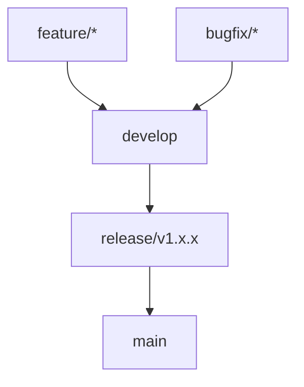

The basic idea is:

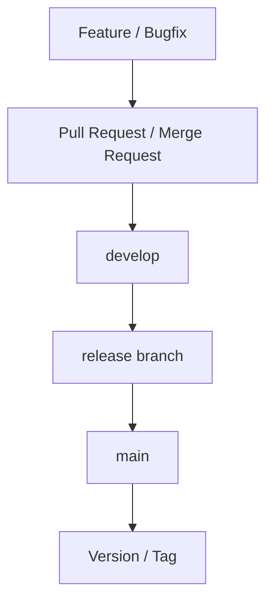

---

# 🌿 One Branch per Feature or Bug Fix

Do not develop unrelated changes directly on `develop` or `main`.

Create a separate branch for each piece of work.

Examples:

```text
feature/user-login
feature/product-search
feature/payment-system

bugfix/user-auth-error
bugfix/payment-timeout
bugfix/product-price
```

For example:

```bash
git switch develop
git pull
git switch -c bugfix/user-auth-error
```

Now all commits related to the authentication bug stay isolated inside:

```text
bugfix/user-auth-error
```

This makes the branch easier to:

- review
    
- test
    
- merge
    
- revert
    
- understand later
    

> 💡 **Real-World Example**
> 
> Imagine two developers are working simultaneously:
> 
> ```mermaid
> flowchart LR
>     N0["Developer A"]
>     N1["feature/user"]
>     N2["Developer B"]
>     N3["feature/product"]
>     N0 --> N1
>     N2 --> N3
> ```
> 
> Their unfinished work does not interfere with each other because each feature has its own branch.

---

# 🚀 Pushing a New Branch

When you create a branch locally:

```bash
git switch -c feature/user
```

the branch does not automatically exist on the remote repository.

If you run:

```bash
git push
```

Git usually tells you that the branch has no upstream branch and gives you a command similar to:

```bash
git push --set-upstream origin feature/user
```

or the shorter form:

```bash
git push -u origin feature/user
```

### What `-u` means

`-u` means:

```text
--set-upstream
```

It connects:

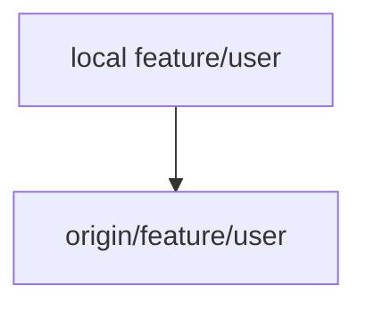

After that, you can normally use:

```bash
git push
```

and:

```bash
git pull
```

without specifying the branch every time.

---

# 🔄 Our Development Flow

Features and bug fixes first go into `develop`.

For example:

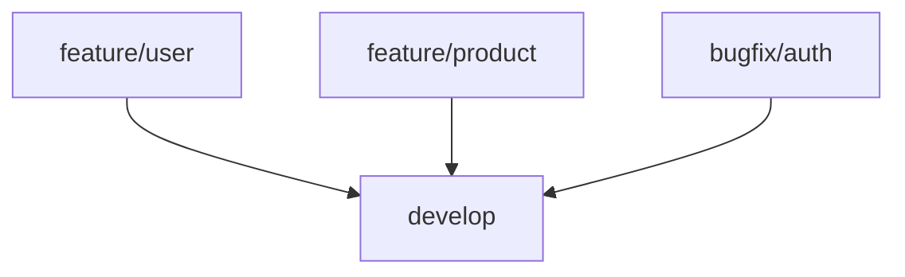

At the end of the sprint, a release branch is created from `develop`.

For example:

```text
release/v1.4.0
```

The flow becomes:

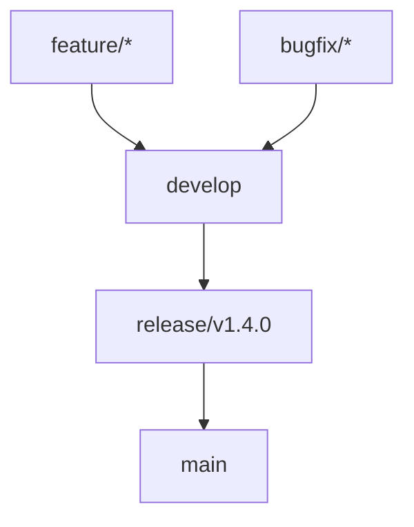

A more complete history might look like:

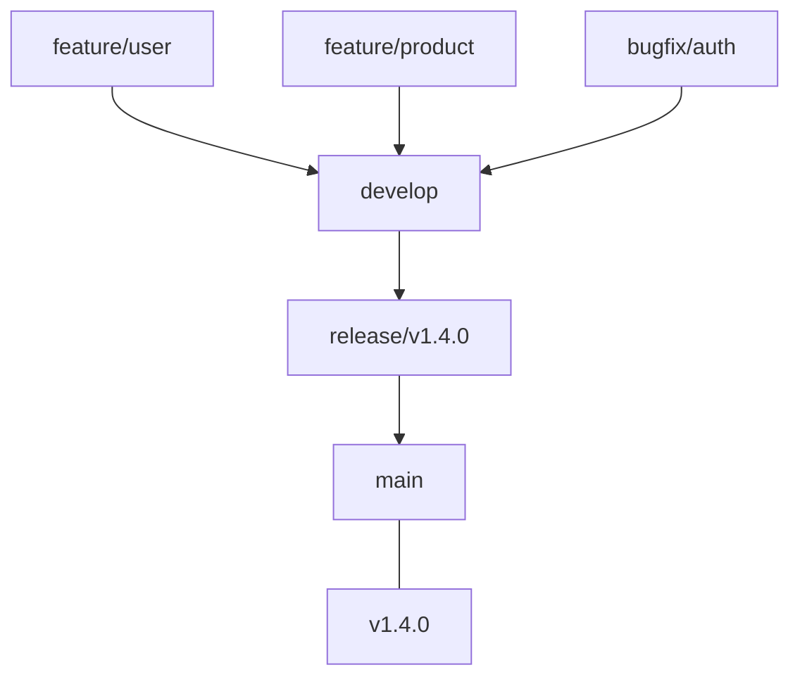

---

# 🏷️ Release Branches and Versioning

When the sprint is ready for release, create a versioned release branch.

For example:

```bash
git switch develop
git pull
git switch -c release/v1.4.0
```

The release branch can be used for final:

- testing
    
- release-specific fixes
    
- version changes
    
- documentation changes
    
- deployment preparation
    

When everything is ready:

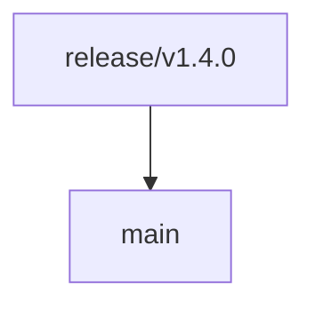

The final release can then be tagged:

```bash
git tag v1.4.0
git push origin v1.4.0
```

A tag gives an exact Git commit a meaningful version:

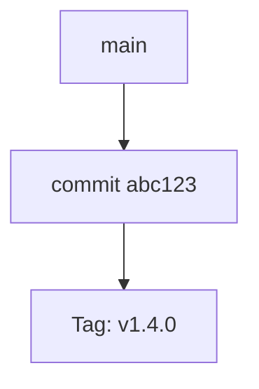

---

# 🔎 Pull Request / Merge Request Review

Before a feature or bug fix is merged into `develop`, it should go through a:

```text
Pull Request (PR)
```

or:

```text
Merge Request (MR)
```

depending on the Git hosting platform.

The workflow is:

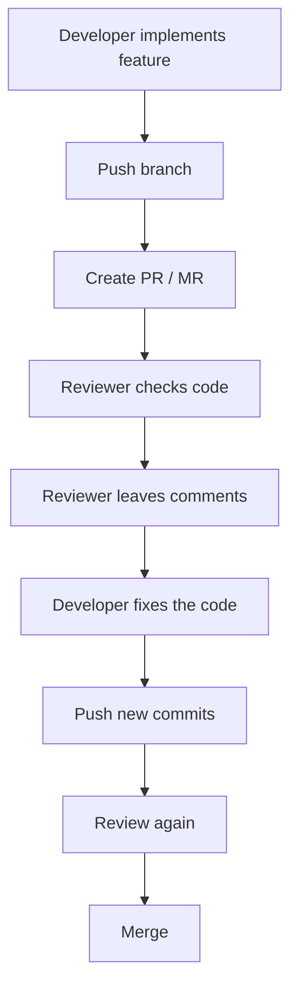

An important team rule is:

> When reviewing another developer's code, leave comments explaining the problem instead of silently changing their implementation yourself.

For example, instead of directly rewriting:

```cpp
if (user != nullptr) {
    login(user);
}
```

a reviewer might comment:

```text
Can this condition be moved into authenticateUser() so authentication
logic stays in one place?
```

The original developer then implements the change.

This helps the developer understand:

- what was wrong
    
- why it should change
    
- how the team expects the code to be structured
    

Code review therefore becomes part of the learning process, not only a gate before merging.

---

# ⚔️ Git Merge Conflicts

A Git merge conflict happens when Git cannot automatically decide which change should be kept.

Assume these branches exist:

```text
develop
feature/user
feature/product
```

Both feature branches originally came from the same `develop` commit:

```text
A---B   develop
     \
      feature/user
      feature/product
```

At commit `B`, suppose the code contains:

```go
timeout := 30
```

---

## 1️⃣ `feature/user` Changes the Code

Inside:

```text
feature/user
```

the developer changes:

```go
timeout := 30
```

to:

```go
timeout := 60
```

Then the branch is merged into `develop`.

```bash
git switch develop
git merge feature/user
```

There is no conflict because `develop` had not independently changed the same code.

Now:

```text
develop:

timeout := 60
```

Conceptually:

```text
A---B---------U---M   develop
     \
      P               feature/product
```

---

## 2️⃣ `feature/product` Also Changed the Same Code

Meanwhile, `feature/product` was created from the older commit `B`.

It changed:

```go
timeout := 30
```

to:

```go
timeout := 120
```

Now Git effectively sees:

```text
Common ancestor:

timeout := 30


develop:

timeout := 60


feature/product:

timeout := 120
```

Both branches changed the same original line differently.

---

## 3️⃣ `feature/product` Tries to Merge

Eventually:

```bash
git switch develop
git merge feature/product
```

Git compares three versions:

```text
Common ancestor
develop
feature/product
```

It sees:

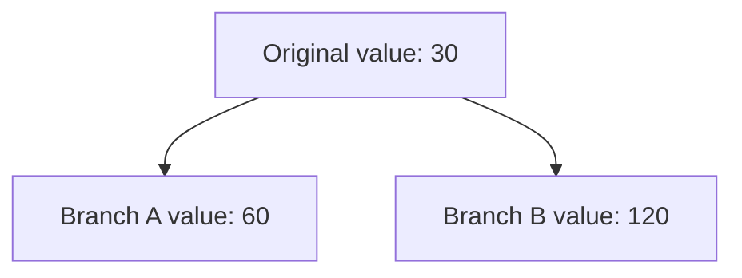

Git cannot know which one is logically correct.

Therefore it produces a conflict:

```go
<<<<<<< HEAD
timeout := 60
=======
timeout := 120
>>>>>>> feature/product
```

A developer must decide the final code.

For example:

```go
timeout := 120
```

Then mark the conflict as resolved:

```bash
git add .
git commit
```

---

# 🧠 Why Three Versions Matter

A conflict is easier to understand when you realize Git is not simply comparing two files.

Git usually considers:

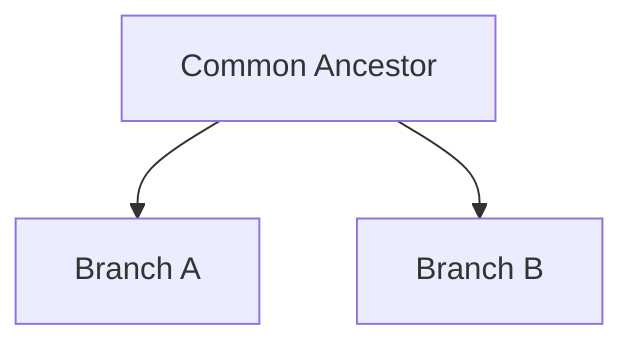

Example:

```text
Original:

timeout = 30
```

Then:

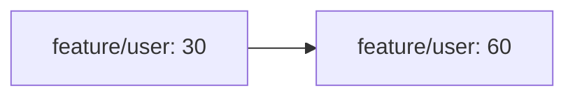

and:

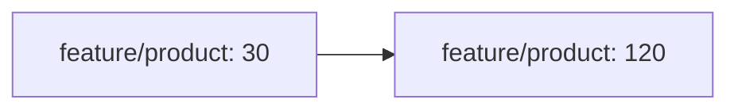

Because both branches changed the same original content differently, Git needs a human decision.

---

# ✅ Changes That Usually Do Not Conflict

Suppose one branch changes:

```go
timeout := 30
```

while another changes:

```go
maxRetries := 5
```

If these changes do not overlap, Git can usually combine them automatically:

```go
timeout := 60
maxRetries := 10
```

So a merge conflict does **not** simply mean:

```text
two developers changed the same file
```

Two developers can modify the same file without creating a conflict.

The important issue is usually:

```text
overlapping incompatible changes
```

---

# 🌐 Local and Remote Branches

Git usually has both local and remote-tracking branches.

For example:

```text
develop
```

is your local branch.

While:

```text
origin/develop
```

represents your local knowledge of the remote `develop` branch.

Conceptually:

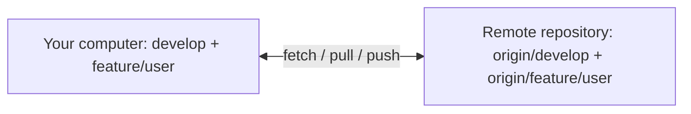

---

# 🚫 Why `git push` Can Be Rejected

Imagine both your computer and the remote repository start here:

```text
A---B
```

You create a commit locally:

```text
A---B---L
        local
```

But another developer pushes first:

```text
A---B---R
        remote
```

Now the histories have diverged:

```text
        L   local
       /
A---B
       \
        R   remote
```

If you try:

```bash
git push
```

Git may reject the push because pushing `L` would not simply move the remote branch forward.

The remote contains commit `R`, which your local branch does not yet contain.

You first need to integrate the remote changes.

---

# 🔀 Option 1: `git pull` with Merge

You can run:

```bash
git pull
```

Conceptually, Git performs:

```text
git fetch
+
git merge
```

Before:

```text
        L
       /
A---B
       \
        R
```

After:

```text
        L
       / \
A---B     M
       \ /
        R
```

`M` is a merge commit.

Then you can push:

```bash
git push
```

---

# 🧹 Option 2: `git pull --rebase`

A cleaner alternative for many personal feature branches is:

```bash
git pull --rebase
```

The short form is:

```bash
git pull -r
```

Instead of creating a merge commit, Git fetches the remote commits and replays your local commits on top.

Before:

```text
        L
       /
A---B
       \
        R
```

After rebase:

```text
A---B---R---L'
```

Your original commit:

```text
L
```

is recreated as:

```text
L'
```

because it now has a different parent.

The history stays linear:

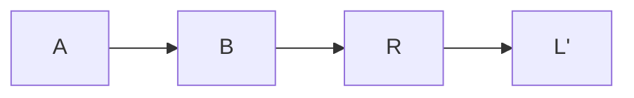

instead of:

```text
      L
     / \
A---B   M
     \ /
      R
```

---

# 💻 `git pull -r`

### What it does

```bash
git pull -r
```

is equivalent to:

```bash
git pull --rebase
```

Conceptually:

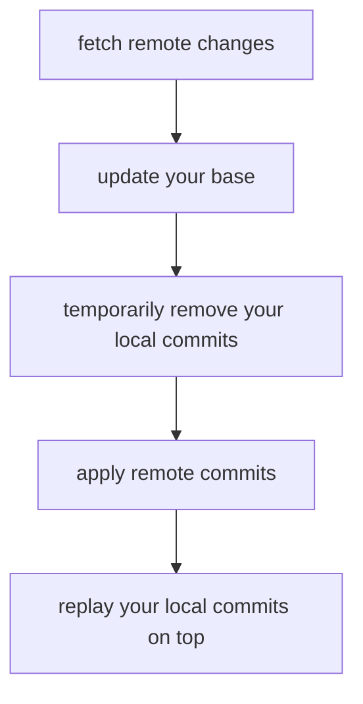

Example:

Before:

```text
Remote:

A---B---C


Local:

A---B---D---E
```

After:

```bash
git pull -r
```

you get:

```text
A---B---C---D'---E'
```

Instead of creating a merge commit.

---

# 🔀 Git Merge vs Rebase

Assume:

```text
A---B---C---D   develop
     \
      E---F     feature/product
```

`develop` has moved forward while the feature branch still comes from the older commit `B`.

---

## 🔀 Using Merge

From the feature branch:

```bash
git switch feature/product
git merge develop
```

Git combines the two histories.

```text
A---B---C---D
     \       \
      E---F---M
```

`M` is a merge commit.

Merge:

- preserves existing commit history
    
- does not rewrite `E` or `F`
    
- creates a merge commit
    
- clearly shows that two histories were joined
    

---

# 🧹 Using Rebase

Instead:

```bash
git switch feature/product
git rebase develop
```

Git temporarily takes:

```text
E
F
```

and replays them after `D`.

Before:

```text
A---B---C---D
     \
      E---F
```

After:

```text
A---B---C---D---E'---F'
```

Notice:

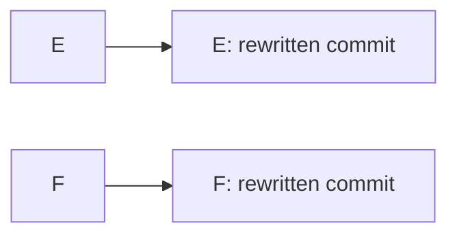

These are new commits.

Their changes may be the same, but their commit hashes change because their history changed.

---

# 🧠 Rebase Does Not Replace `develop`

One important point:

```bash
git switch feature/product
git rebase develop
```

does **not** erase or replace `develop`.

`develop` remains:

```text
A---B---C---D
```

Git changes the feature branch:

```text
Before:

A---B
     \
      E---F


develop:

A---B---C---D
```

into:

```text
A---B---C---D---E'---F'
                \
                 feature/product
```

Think of rebase as:

> Move my work so that it looks like I started from the latest version of `develop`.

---

# ⚔️ Rebase Conflicts

Rebase applies your commits one by one.

Suppose your feature has:

```text
E
F
G
```

Git starts replaying them:

```text
E ✅
F ❌ conflict
G not applied yet
```

The rebase pauses.

You resolve the file manually.

Then:

```bash
git add .
```

and continue:

```bash
git rebase --continue
```

This tells Git:

> The current conflict has been resolved. Continue replaying the remaining commits.

Git continues:

```text
E' ✅
F' ✅
G' ✅
```

If another conflict appears during `G`, Git pauses again.

Resolve it:

```bash
git add .
git rebase --continue
```

Repeat until the rebase finishes.

---

# 🛑 Cancel a Rebase

If the rebase becomes confusing or you want to return to the original state:

```bash
git rebase --abort
```

Git restores the branch to how it looked before the rebase started.

This is extremely useful when learning rebase.

---

# ⚠️ Rebase and Shared Branches

Because rebase recreates commits, commit hashes change.

For example:


Therefore rebasing a branch that multiple developers are already using can cause unnecessary confusion.

A useful rule is:

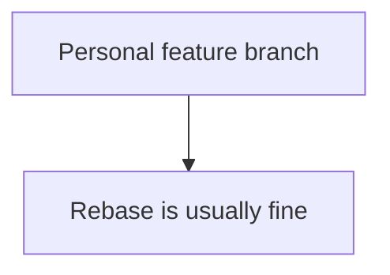

while:

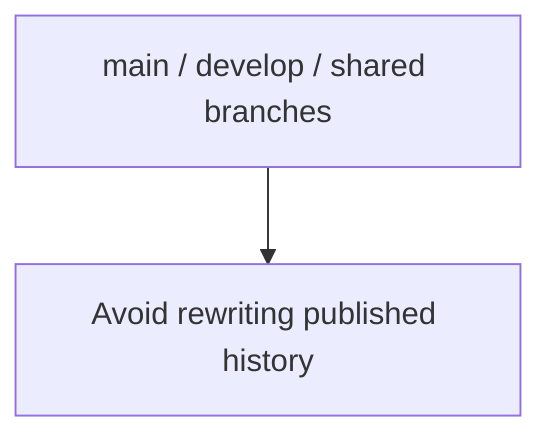

For your own feature branch, this workflow is useful:

```bash
git switch feature/product
git fetch origin
git rebase origin/develop
```

This updates your feature branch using the latest remote `develop`.

---

# 🔄 `git fetch` vs `git pull`

These commands are related but not identical.

|Command|Downloads Remote Changes|Changes Current Branch|
|---|--:|--:|
|`git fetch`|✅|❌|
|`git pull`|✅|✅|
|`git pull --rebase`|✅|✅|

### `git fetch`

```bash
git fetch origin
```

Updates your knowledge of branches such as:

```text
origin/develop
origin/main
```

but does not immediately modify your current branch.

This is useful because you can inspect remote changes first.

---

### `git pull`

Usually behaves roughly like:

```text
git fetch
+
git merge
```

---

### `git pull --rebase`

Behaves roughly like:

```text
git fetch
+
git rebase
```

---

# 🌍 Practical Feature Workflow

A normal task might begin with:

```bash
git switch develop
git pull
git switch -c feature/user-auth
```

Work normally:

```bash
git add .
git commit -m "Add user authentication"
```

Push the new branch:

```bash
git push -u origin feature/user-auth
```

Create a PR/MR:

```mermaid
flowchart TD
    N0["feature/user-auth"]
    N1["develop"]
    N0 --> N1
```

If `develop` changes while you are working:

```bash
git fetch origin
git rebase origin/develop
```

If there is a conflict:

```bash
# fix files

git add .
git rebase --continue
```

Then push your branch.

If you previously pushed the branch before rebasing, the commit hashes have changed. In that situation, use Git's safer force-push form:

```bash
git push --force-with-lease
```

> ⚠️ Prefer `--force-with-lease` over plain `--force`. It adds protection against accidentally overwriting remote work you have not seen.

---

# 🧪 Interview Q&A

**Q1:** Why should each bug fix or feature have its own branch?

**Q2:** What does `git push -u origin feature/user` do?

**Q3:** Why can Git reject a push when another developer has pushed first?

**Q4:** What is the difference between `git pull` and `git pull -r`?

**Q5:** Why can two developers modify the same file without causing a conflict?

**Q6:** Why does rebase change commit hashes?

**Q7:** What does `git rebase --continue` do?

**Q8:** Why should published `main` or `develop` history generally not be rebased?

> [!answer]- 📋 Answers
> 
> **A1:** It isolates unrelated changes, making review, testing, merging, reverting, and debugging easier.
> 
> **A2:** It pushes the local branch to `origin` and configures the remote branch as its upstream, allowing future `git push` and `git pull` commands to work without repeatedly specifying the remote branch.
> 
> **A3:** The remote branch contains commits that the local branch does not have. Git prevents a normal push from overwriting that newer history.
> 
> **A4:** Normal `git pull` commonly integrates remote changes using a merge, while `git pull -r` rebases local commits on top of the updated remote branch and avoids an unnecessary merge commit.
> 
> **A5:** Git can often merge changes automatically when they affect different lines or non-overlapping sections. Conflicts usually occur when incompatible changes overlap.
> 
> **A6:** A commit hash depends partly on its parent commit. Rebase gives the commit a new parent, so Git creates a new commit with a different hash.
> 
> **A7:** It tells Git that the current rebase conflict has been resolved and that Git should continue replaying the remaining commits.
> 
> **A8:** Rebase rewrites commit history. Rewriting commits that other developers already use can make their local histories diverge and complicate collaboration.

---

# 🔨 Hands-On Practice

Create a test repository:

```bash
mkdir git-practice
cd git-practice

git init
```

Create an initial file:

```bash
echo "timeout=30" > config.txt

git add .
git commit -m "Initial config"
```

Create `develop`:

```bash
git switch -c develop
```

Create the first feature:

```bash
git switch -c feature/user
```

Change:

```text
timeout=30
```

to:

```text
timeout=60
```

Commit:

```bash
git add .
git commit -m "Change user timeout"
```

Merge it:

```bash
git switch develop
git merge feature/user
```

You can then create another branch from an older state and experiment with changing the same line differently to see how Git reports conflicts.

Useful commands while experimenting:

```bash
git status
git log --oneline --graph --all
git branch
```

A particularly useful visualization is:

```bash
git log --oneline --graph --decorate --all
```

It lets you actually see branches, merges, and rebases.

---

# 📋 Quick Reference

|Task|Command|
|---|---|
|Create feature branch|`git switch -c feature/name`|
|Create bugfix branch|`git switch -c bugfix/name`|
|Push new branch|`git push -u origin branch-name`|
|Download remote state|`git fetch origin`|
|Pull using merge|`git pull`|
|Pull using rebase|`git pull -r`|
|Rebase on latest develop|`git rebase origin/develop`|
|Mark conflict resolved|`git add .`|
|Continue rebase|`git rebase --continue`|
|Cancel rebase|`git rebase --abort`|
|Merge branch|`git merge branch-name`|
|View Git graph|`git log --oneline --graph --decorate --all`|
|Safer push after rebase|`git push --force-with-lease`|
|Create release branch|`git switch -c release/v1.4.0`|
|Create release tag|`git tag v1.4.0`|
|Push tag|`git push origin v1.4.0`|

---

# 🧠 Things to Remember

```mermaid
flowchart TD
    N0["One feature / bug"]
    N1["One branch"]
    N0 --> N1
```

```mermaid
flowchart TD
    N0["feature/*"]
    N1["bugfix/*"]
    N2["develop"]
    N3["release/version"]
    N4["main"]
    N0 --> N2
    N1 --> N2
    N2 --> N3
    N3 --> N4
```

A merge conflict usually means:

```mermaid
flowchart TD
    N0["same original code"]
    N1["changed differently / on different branches"]
    N2["Git cannot safely choose"]
    N0 --> N1
    N1 --> N2
```

Merge:

```text
combines histories
```

Rebase:

```text
replays your commits on a newer base
```

And:

```bash
git pull -r
```

means:

```text
fetch remote changes
+
rebase local commits on top
```

---

# 💡 Pro Tips

Before starting a new feature, update `develop`:

```bash
git switch develop
git pull
```

Then create the branch:

```bash
git switch -c feature/my-feature
```

Before creating the final PR/MR, synchronize your branch with the latest remote `develop`:

```bash
git fetch origin
git rebase origin/develop
```

Use:

```bash
git status
```

whenever Git seems confusing. It usually tells you whether you are:

- merging
    
- rebasing
    
- resolving conflicts
    
- ahead of remote
    
- behind remote
    

And use:

```bash
git log --oneline --graph --decorate --all
```

whenever you want to understand what actually happened to the repository history.

During code review, explain problems through PR/MR comments and allow the original developer to implement the fix whenever practical. This keeps ownership clear and turns review into a learning process.

---

# 🔗 Related Topics

[[Git]]

[[Git Branches]]

[[Git Merge]]

[[Git Rebase]]

[[Git Merge Conflicts]]

[[Git Pull Requests]]

[[Git Tags]]

[[Semantic Versioning]]

[[CI-CD]]

# 🌿 Git Tracking, Stash, History, and Reset

These commands are useful when you need to control **what Git tracks**, temporarily save unfinished work, inspect old commits, or move your branch back to an earlier state.

---

## 🗑️ `git rm` — Remove Files from Git

### 💻 `git rm`

**What it does:**

Normally, `git rm` removes a file from **both**:

1. Git's tracked files
    
2. Your actual working directory
    

```bash
git rm filename
```

For example:

```bash
git rm config.txt
```

After this command:

```text
Git repository:   config.txt removed
Your disk:        config.txt removed
```

The removal is also automatically **staged**, so you can commit it:

```bash
git commit -m "Remove config file"
```

### Removing a directory

Use `-r` for directories:

```bash
git rm -r directory/
```

---

## 🧠 `git rm --cached` — Stop Tracking Without Deleting

This is especially useful when you accidentally committed something that should have been in `.gitignore`.

```bash
git rm --cached filename
```

The important difference is:

```mermaid
flowchart TD
    N0["git rm filename"]
    N1["Remove from Git"]
    N2["Delete from your disk"]
    N3["git rm --cached filename"]
    N4["Remove from Git"]
    N5["Keep on your disk"]
    N0 --> N1
    N0 --> N2
    N3 --> N4
    N3 --> N5
```

### 💡 Real-World Example

Suppose you accidentally committed:

```text
.env
```

Then later you add this to `.gitignore`:

```gitignore
.env
```

But Git **still tracks the file**.

Why?

Because `.gitignore` only prevents **untracked files** from being added. It does not automatically stop tracking files Git already knows about.

Use:

```bash
git rm --cached .env
git commit -m "Stop tracking .env"
```

Now:

```text
.env exists locally ✅
.env is ignored ✅
.env is no longer tracked by Git ✅
```

---

### Stop Tracking a Directory

```bash
git rm -r --cached directory/
```

Example:

```bash
git rm -r --cached node_modules/
```

---

### Reapply `.gitignore` to the Whole Repository

Sometimes many files are already tracked before you update `.gitignore`.

You can remove everything from the Git index:

```bash
git rm -r --cached .
```

Then add files again:

```bash
git add .
```

Git will now respect `.gitignore`.

Finally:

```bash
git commit -m "Apply gitignore rules"
```

> ⚠️ `--cached` is very important here. Without it:
> 
> ```bash
> git rm -r .
> ```
> 
> Git would also remove the files from your working directory.

---

## 📦 `git stash` — Temporarily Store Changes

Imagine you are working on:

```text
feature/user-login
```

You changed several files, but the feature is not ready to commit.

Suddenly, you need to switch to:

```text
develop
```

to investigate a bug.

Instead of creating an unnecessary temporary commit, use:

```bash
git stash
```

Git temporarily stores your changes and returns your working directory close to the current `HEAD` state.

```mermaid
flowchart TD
    N0["HEAD / Last Commit"]
    N1["Working changes: login.cpp + user.cpp"]
    N2["git stash"]
    N3["Last Commit: restored working state"]
    N4["Stash: login.cpp + user.cpp changes"]
    N0 --- N1
    N1 --> N2
    N2 --> N3
    N2 --> N4
```

Now you can safely switch branches:

```bash
git switch develop
```

Later return:

```bash
git switch feature/user-login
```

and restore the changes:

```bash
git stash pop
```

---

## 🔍 Using Stash to Debug Your Own Changes

`git stash` is also useful when you want to check whether your recent **uncommitted changes** caused a bug.

Suppose:

```mermaid
flowchart LR
    N0["Last Commit"]
    N1["application works"]
    N2["You modify code"]
    N3["bug appears"]
    N0 --> N1
    N2 --> N3
```

You can run:

```bash
git stash
```

Then test the project again.

If the bug disappears, your uncommitted changes are probably related.

Restore them with:

```bash
git stash pop
```

> 💡 A stash does **not normally mean changes since some arbitrary earlier commit**.
> 
> It primarily stores your current staged and unstaged modifications relative to `HEAD`.

---

## 💻 Important Stash Commands

### Save changes

```bash
git stash
```

A clearer modern form is:

```bash
git stash push
```

With a description:

```bash
git stash push -m "User login work"
```

### See saved stashes

```bash
git stash list
```

Example:

```text
stash@{0}: On feature/user: User login work
stash@{1}: On develop: Database test
```

### Restore and remove the stash

```bash
git stash pop
```

### Restore but keep the stash

```bash
git stash apply
```

Difference:

```mermaid
flowchart TD
    N0["git stash pop"]
    N1["Restore changes"]
    N2["Remove stash"]
    N3["git stash apply"]
    N4["Restore changes"]
    N5["Keep stash"]
    N0 --> N1
    N1 --> N2
    N3 --> N4
    N4 --> N5
```

### Include untracked files

By default, newly created untracked files are not included.

Use:

```bash
git stash -u
```

or:

```bash
git stash push -u
```

---

## 📜 `git log` — View Commit History

`git log` shows the history of commits.

```bash
git log
```

Example:

```text
commit a7f83c12e...
Author: Ryan
Date:   ...

    Fix user authentication

commit 41bc9832a...
Author: Ryan
Date:   ...

    Add login API

commit f82ba21c1...
Author: Ryan
Date:   ...

    Initial project
```

Each commit has a unique identifier called a **commit hash**:

```text
a7f83c12e...
```

You usually only need the first several characters:

```bash
git show a7f83c1
```

---

## 🌳 A Better Commit History View

A very useful command is:

```bash
git log --oneline --graph --decorate --all
```

Example:

```text
* 91a82cd (HEAD -> develop) Fix database bug
* 62bc177 Add user validation
| * b15ca20 (feature/product) Add products
|/
* 29ff313 Initial API
```

This makes branches and commits much easier to understand.

---

## ⏪ Checking an Old Commit

Suppose your history is:

```mermaid
flowchart LR
    N0["A"]
    N1["B"]
    N2["C"]
    N3["D"]
    N4["HEAD"]
    N0 --> N1
    N1 --> N2
    N2 --> N3
    N4 --> N3
```

You want to inspect commit `B`.

You can use:

```bash
git checkout <commit-hash>
```

Example:

```bash
git checkout 41bc983
```

However, modern Git makes the intention clearer with:

```bash
git switch --detach 41bc983
```

Now:

```mermaid
flowchart LR
    N0["A"]
    N1["B"]
    N2["C"]
    N3["D"]
    N4["HEAD"]
    N5["develop"]
    N0 --> N1
    N1 --> N2
    N2 --> N3
    N4 --> N1
    N5 --> N3
```

Your branch has **not moved**.

You are simply looking at an old snapshot.

This state is called:

```text
detached HEAD
```

---

## 🌿 Create a Branch from an Old Commit

If you inspect an old commit and decide:

> I want to start development from here.

Use:

```bash
git switch -c new-branch <commit-hash>
```

Example:

```bash
git switch -c old-version-fix 41bc983
```

Now you have:

```mermaid
flowchart LR
    N0["A"]
    N1["B"]
    N2["C"]
    N3["D"]
    N4["old-version-fix"]
    N5["develop"]
    N0 --> N1
    N1 --> N2
    N2 --> N3
    N4 --> N1
    N5 --> N3
```

You can safely make new commits from that point.

---

## 🎯 Understanding `HEAD`

`HEAD` represents your **current checked-out commit/reference**.

Normally:

```mermaid
flowchart LR
    N0["A"]
    N1["B"]
    N2["C"]
    N3["D"]
    N4["develop"]
    N5["HEAD"]
    N0 --> N1
    N1 --> N2
    N2 --> N3
    N4 --> N3
    N5 --> N4
```

So:

```text
HEAD
```

means:

```text
current commit
```

`HEAD~1` means:

```text
one commit before HEAD
```

`HEAD~2` means:

```text
two commits before HEAD
```

For example:

```mermaid
flowchart LR
    N0["A"]
    N1["B"]
    N2["C"]
    N3["D"]
    N4["HEAD"]
    N5["HEAD~1"]
    N6["HEAD~2"]
    N7["HEAD~3"]
    N0 --> N1
    N1 --> N2
    N2 --> N3
    N4 --> N3
    N5 --> N2
    N6 --> N1
    N7 --> N0
```

---

# 💥 `git reset --hard`

`git reset --hard` is much more destructive than simply checking out an old commit.

Suppose:

```mermaid
flowchart LR
    N0["A"]
    N1["B"]
    N2["C"]
    N3["D"]
    N4["HEAD"]
    N0 --> N1
    N1 --> N2
    N2 --> N3
    N4 --> N3
```

Run:

```bash
git reset --hard HEAD~1
```

The branch moves back one commit:

```mermaid
flowchart LR
    N0["A"]
    N1["B"]
    N2["C"]
    N3["HEAD"]
    N4["D: removed from branch history"]
    N0 --> N1
    N1 --> N2
    N3 --> N2
```

Run:

```bash
git reset --hard HEAD~3
```

and the branch moves three commits backward.

---

## What Does `--hard` Mean?

Git conceptually has several areas:

```mermaid
flowchart TD
    N0["Commit / HEAD"]
    N1["Git Index / Staging Area"]
    N2["Working Directory"]
    N0 --> N1
    N1 --> N2
```

`git reset --hard` changes all of them to match the target commit.

For example:

```bash
git reset --hard HEAD~1
```

means roughly:

```text
Move branch to HEAD~1
        +
Reset staging area
        +
Reset working directory
```

Therefore local modifications can be **permanently lost**.

> ⚠️ Before using `git reset --hard`, run:
> 
> ```bash
> git status
> ```
> 
> If you have important uncommitted work, consider:
> 
> ```bash
> git stash
> ```
> 
> first.

---

## `checkout` vs `reset --hard`

These are easy to confuse.

Assume:

```mermaid
flowchart LR
    N0["A"]
    N1["B"]
    N2["C"]
    N3["D"]
    N4["develop"]
    N5["HEAD"]
    N0 --> N1
    N1 --> N2
    N2 --> N3
    N4 --> N3
```

If you run:

```bash
git switch --detach B
```

you are basically saying:

> Let me inspect the repository as it existed at B.

The `develop` branch remains at `D`.

But:

```bash
git reset --hard B
```

while on `develop` means:

> Move `develop` itself back to B and make my files match B.

So:

|Command|Main purpose|
|---|---|
|`git switch --detach HASH`|Inspect an old commit|
|`git switch -c branch HASH`|Start a branch from an old commit|
|`git reset --hard HASH`|Move the current branch back to that commit|

---

## ⚠️ Resetting Already-Pushed Commits

Be especially careful with:

```bash
git reset --hard
```

when commits have already been pushed to a shared branch such as:

```text
develop
main
```

Rewriting shared history can cause problems for other developers.

For shared history, another command is often more appropriate:

```bash
git revert <commit>
```

`git revert` does **not delete the old commit**.

Instead it creates a new commit that reverses its changes:

```mermaid
flowchart LR
    N0["A"]
    N1["B"]
    N2["C: introduced bug"]
    N3["D: reverses C"]
    N0 --> N1
    N1 --> N2
    N2 --> N3
```

This is safer for shared branches because the history remains intact.

---

# 🔄 How These Commands Work Together

A realistic workflow might look like this:

```mermaid
flowchart TD
    N0["Working on feature/user: unfinished changes"]
    N1["git stash"]
    N2["git switch develop: investigate problem"]
    N3["git log: find older commit"]
    N4["git switch --detach HASH: test old version"]
    N5["git switch develop"]
    N6["git switch feature/user"]
    N7["git stash pop"]
    N0 --> N1
    N1 --> N2
    N2 --> N3
    N3 --> N4
    N4 --> N5
    N5 --> N6
    N6 --> N7
```

Notice that you can investigate old code without destroying your current branch history.

---

## 🧪 Interview Q&A

**Q1:** What is the difference between `git rm file` and `git rm --cached file`?

**Q2:** Why doesn't adding an already-tracked file to `.gitignore` automatically stop Git from tracking it?

**Q3:** What is the difference between `git stash pop` and `git stash apply`?

**Q4:** What does `HEAD~3` mean?

**Q5:** What is the difference between checking out an old commit and `git reset --hard` to that commit?

**Q6:** Why is `git reset --hard` dangerous on a shared branch?

> [!answer]- 📋 Answers
> 
> **A1:** `git rm file` removes the file from Git and your working directory. `git rm --cached file` removes it only from Git's index while keeping the local file.
> 
> **A2:** `.gitignore` mainly controls which untracked files Git should ignore. Files already tracked remain tracked until explicitly removed from the index.
> 
> **A3:** Both restore stashed changes, but `pop` normally removes the stash afterward while `apply` keeps it.
> 
> **A4:** It means the commit three first-parent generations before the current `HEAD`.
> 
> **A5:** Checking out/switching to an old commit lets you inspect that snapshot without moving your normal branch. `reset --hard` moves the current branch to that commit and resets the index and working tree.
> 
> **A6:** It rewrites the branch's history. If other developers already have those commits, their history can diverge from the rewritten remote history.

---

# 🔨 Hands-On Practice

Create a test repository:

```bash
mkdir git-test
cd git-test
git init
```

Create a file:

```bash
echo "hello" > test.txt
git add test.txt
git commit -m "Add test file"
```

Add it to `.gitignore`:

```bash
echo "test.txt" >> .gitignore
```

Notice that Git still tracks it.

Now:

```bash
git rm --cached test.txt
```

Check:

```bash
git status
```

The physical file still exists:

```bash
ls
```

This demonstrates exactly why `--cached` is useful.

---

# 📋 Quick Reference

|Goal|Command|
|---|---|
|Remove tracked file and local file|`git rm file`|
|Stop tracking file, keep locally|`git rm --cached file`|
|Stop tracking directory|`git rm -r --cached dir/`|
|Reapply `.gitignore` rules|`git rm -r --cached . && git add .`|
|Temporarily save changes|`git stash`|
|Stash including untracked files|`git stash -u`|
|List stashes|`git stash list`|
|Restore + remove stash|`git stash pop`|
|Restore + keep stash|`git stash apply`|
|Show commit history|`git log`|
|Compact graphical history|`git log --oneline --graph --decorate --all`|
|Inspect old commit|`git switch --detach HASH`|
|Create branch from commit|`git switch -c branch HASH`|
|Go back one commit destructively|`git reset --hard HEAD~1`|
|Go back five commits destructively|`git reset --hard HEAD~5`|
|Undo a shared commit safely|`git revert HASH`|

# 🧠 Things to Remember

- `.gitignore` does **not** automatically untrack files already committed.
    
- `git rm --cached` removes something from Git tracking while keeping it locally.
    
- Normal `git rm` removes the file from both Git and your filesystem.
    
- `git stash` is ideal for temporarily storing unfinished work.
    
- `git log` lets you inspect commits and obtain their hashes.
    
- `HEAD` represents your current checked-out position.
    
- `HEAD~1` means one commit before `HEAD`.
    
- Checking out an old commit is very different from resetting your branch to it.
    
- `git reset --hard` can destroy uncommitted work.
    
- Prefer `git revert` over rewriting history when undoing commits already shared with other developers.
    

# 💡 Pro Tips

Before destructive Git commands, check:

```bash
git status
git log --oneline --graph --decorate -10
```

If you're unsure whether you need your current changes:

```bash
git stash push -u -m "Safety backup"
```

Then perform your experiment.

For Git history, this command is worth memorizing:

```bash
git log --oneline --graph --decorate --all
```

It gives you a much clearer mental picture of branches and commits than plain `git log`.

# 🔗 Related Topics

[[Git Branches]]  
[[Git Merge]]  
[[Git Rebase]]  
[[Git Merge Conflicts]]  
[[Git Ignore]]  
[[Git Revert]]  
[[Git Stash]]  
[[Git Commit History]]
