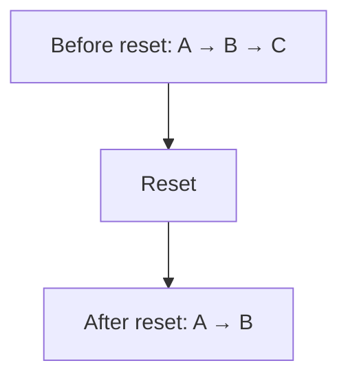
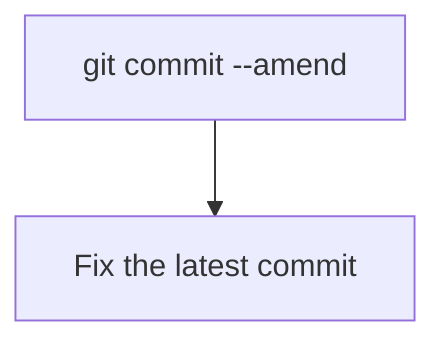
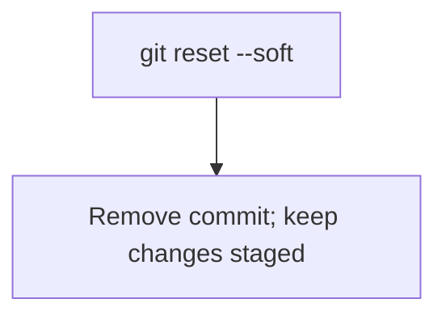
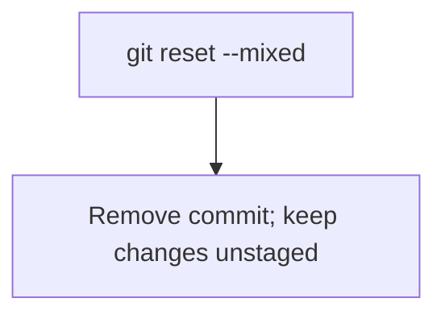
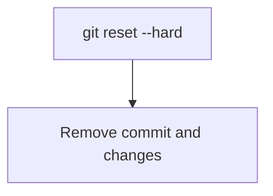
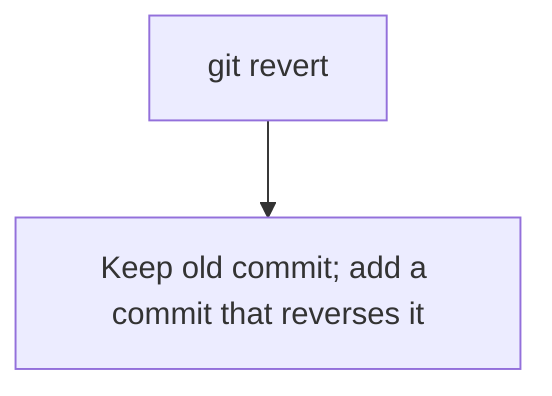
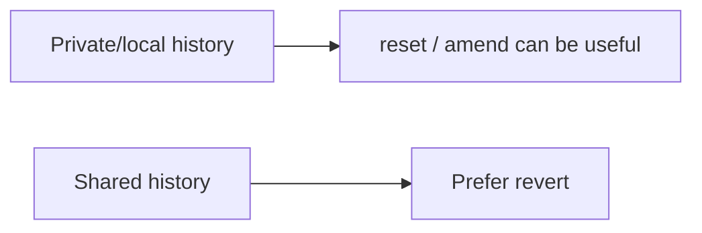

# 🔄 Git Editing, Removing, and Reverting Commits

[[DevOps/NaNa/0. Nana DevOps Table of Contents|📚 Nana DevOps Table of Contents]]

> [!toc]- 📑 Contents
>
> - [[#🧠 Understanding HEAD|🧠 Understanding `HEAD`]]
> - [[#🌐 git commit --amend — Edit the Last Commit|🌐 `git commit --amend` — Edit the Last Commit]]
> - [[#💻 git commit --amend|💻 `git commit --amend`]]
> - [[#🌐 git reset --soft — Remove Commits but Keep Their Changes Staged|🌐 `git reset --soft` — Remove Commits but Keep Their Changes Staged]]
> - [[#💻 git reset --soft|💻 `git reset --soft`]]
> - [[#💡 Real-World Example|💡 Real-World Example]]
> - [[#⚠️ --soft Is Not the Default|⚠️ `--soft` Is Not the Default]]
> - [[#🌐 git reset --mixed — Keep Changes but Unstage Them|🌐 `git reset --mixed` — Keep Changes but Unstage Them]]
> - [[#🌐 git reset --hard — Remove Commits and Their Changes|🌐 `git reset --hard` — Remove Commits and Their Changes]]
> - [[#💻 git reset --hard|💻 `git reset --hard`]]
> - [[#🌐 Removing an Already-Pushed Commit|🌐 Removing an Already-Pushed Commit]]
> - [[#⚠️ Why Force Push Is Dangerous|⚠️ Why Force Push Is Dangerous]]
> - [[#💡 Prefer --force-with-lease|💡 Prefer `--force-with-lease`]]
> - [[#🌐 git revert — Safely Undo a Commit|🌐 `git revert` — Safely Undo a Commit]]
> - [[#💻 git revert|💻 `git revert`]]
> - [[#💡 Real-World Team Example|💡 Real-World Team Example]]
> - [[#🔀 reset vs revert|🔀 `reset` vs `revert`]]
> - [[#🔀 reset --soft vs commit --amend|🔀 `reset --soft` vs `commit --amend`]]
> - [[#🧪 Interview Q&A|🧪 Interview Q&A]]
> - [[#🔨 Hands-On Practice|🔨 Hands-On Practice]]
> - [[#📋 Quick Reference|📋 Quick Reference]]
> - [[#🧠 Things to Remember|🧠 Things to Remember]]
> - [[#💡 Pro Tips|💡 Pro Tips]]
> - [[#🔗 Related Topics|🔗 Related Topics]]


Git gives you several ways to fix commit history, but they behave very differently.

The main commands are:

```text
git commit --amend
git reset --soft
git reset --mixed
git reset --hard
git revert
```

The important question is:

> Do you want to **rewrite history**, or do you want to **undo something while preserving history**?

---

# 🧠 Understanding `HEAD`

Before using `reset`, understand what `HEAD` means.

`HEAD` normally points to your current commit.

```text
A --- B --- C --- D
                  ↑
                 HEAD
```

You can reference earlier commits relative to `HEAD`:

```text
HEAD~1    one commit before HEAD
HEAD~2    two commits before HEAD
HEAD~3    three commits before HEAD
```

For example:

```text
A --- B --- C --- D
      ↑           ↑
   HEAD~2        HEAD
```

So:

```bash
git reset --soft HEAD~2
```

moves the branch back two commits.

---

# 🌐 `git commit --amend` — Edit the Last Commit

Use `git commit --amend` when you just created a commit and realize you need to change something.

You can:

- change the commit message
    
- add forgotten files
    
- remove something from the commit
    
- modify files and include those changes
    

## 💻 `git commit --amend`

**What it does:**

Replaces the latest commit with a new corrected commit.

```bash
git commit --amend
```

For example:

```bash
git commit -m "Add login page"
```

Then you realize you forgot a file:

```bash
git add login.css
git commit --amend
```

Conceptually:

```text
Before:

A --- B --- C
            ↑
           HEAD

After amend:

A --- B --- C'
             ↑
            HEAD
```

`C` is replaced by a new commit `C'`.

Even if the contents look almost identical, the amended commit gets a **different commit hash**.

### Change only the commit message

```bash
git commit --amend -m "Add user login page"
```

### Add forgotten changes without changing the message

```bash
git add forgotten-file.cpp
git commit --amend --no-edit
```

> ⚠️ If the commit has already been pushed and other developers may have based work on it, amending it rewrites shared history.

---

# 🌐 `git reset --soft` — Remove Commits but Keep Their Changes Staged

`git reset --soft` moves your branch pointer backward but keeps the removed commits' file changes.

It also keeps those changes in the **staging area**.

## 💻 `git reset --soft`

**Structure:**

```bash
git reset --soft HEAD~<number>
```

Example:

```bash
git reset --soft HEAD~1
```

Suppose you have:

```text
A --- B --- C
            ↑
           HEAD
```

Run:

```bash
git reset --soft HEAD~1
```

Now:

```text
A --- B
      ↑
     HEAD

Changes from C:
✅ still exist
✅ still staged
❌ C is no longer part of the branch history
```

You can now modify the files and create a new commit:

```bash
vim file.cpp
git add file.cpp
git commit -m "Better implementation"
```

Result:

```text
A --- B --- C'
```

---

## 💡 Real-World Example

Imagine you made three small commits:

```text
A
|
B  Add login form
|
C  Fix login button
|
D  Fix login validation
```

You decide they should have been one clean commit.

Run:

```bash
git reset --soft HEAD~3
```

Git moves back before those three commits, but all their changes stay staged.

Now create one commit:

```bash
git commit -m "Implement login system"
```

Result:

```text
Before:

A --- B --- C --- D

After:

A --- E
```

`E` contains the combined changes.

---

# ⚠️ `--soft` Is Not the Default

The default mode of `git reset` is actually:

```bash
git reset --mixed
```

These two commands are equivalent:

```bash
git reset HEAD~1
```

```bash
git reset --mixed HEAD~1
```

But they are **not** equivalent to:

```bash
git reset --soft HEAD~1
```

The difference is the staging area.

|Command|Commit removed|Changes kept|Changes staged|
|---|--:|--:|--:|
|`git reset --soft`|✅|✅|✅|
|`git reset --mixed`|✅|✅|❌|
|`git reset --hard`|✅|❌|❌|

---

# 🌐 `git reset --mixed` — Keep Changes but Unstage Them

`--mixed` is the default `git reset` behavior.

```bash
git reset HEAD~1
```

is the same as:

```bash
git reset --mixed HEAD~1
```

Suppose:

```text
A --- B --- C
```

Run:

```bash
git reset HEAD~1
```

Now `C` is removed from the branch history, but its changes remain in your working directory.

They are **not staged**.

```text
Commit C:
❌ removed from history

Changes:
✅ remain in files
❌ not staged
```

You can inspect them:

```bash
git status
```

Then choose what to stage again:

```bash
git add file1.cpp
git add file2.cpp
```

---

# 🌐 `git reset --hard` — Remove Commits and Their Changes

`git reset --hard` is much more destructive.

## 💻 `git reset --hard`

```bash
git reset --hard HEAD~1
```

It moves the branch backward and resets both:

- staging area
    
- working directory
    

Suppose:

```text
A --- B --- C
            ↑
           HEAD
```

Run:

```bash
git reset --hard HEAD~1
```

Result:

```text
A --- B
      ↑
     HEAD
```

The changes introduced by `C` disappear from your current files as well.

> ⚠️ `git reset --hard` can destroy uncommitted work. Always check `git status` before using it.

---

# 🌐 Removing an Already-Pushed Commit

Suppose your remote branch contains:

```text
A --- B --- C
            ↑
         origin/feature
```

You want commit `C` completely removed from the branch history.

Locally:

```bash
git reset --hard HEAD~1
```

Now:

```text
Local:

A --- B

Remote:

A --- B --- C
```

A normal push will usually be rejected because your local history is now behind/different from the remote history.

You would need to rewrite the remote branch history.

```bash
git push --force
```

After that:

```text
Local:

A --- B

Remote:

A --- B
```

Commit `C` is no longer part of the branch's visible history.

---

# ⚠️ Why Force Push Is Dangerous

Imagine another developer already pulled:

```text
A --- B --- C
```

and created:

```text
A --- B --- C --- D
```

Meanwhile you do:

```bash
git reset --hard HEAD~1
git push --force
```

Remote becomes:

```text
A --- B
```

Now the other developer's history contains commits based on `C`, while the remote history has been rewritten.

This creates unnecessary confusion and potentially lost remote work.

Therefore avoid rewriting history on shared branches such as:

```text
main
develop
release/*
```

and branches where multiple developers are actively working.

History rewriting is more appropriate for your own feature branch before other people depend on it.

---

# 💡 Prefer `--force-with-lease`

If rewriting your own remote branch is necessary, this is usually safer than plain `--force`:

```bash
git push --force-with-lease
```

Instead of blindly overwriting the remote branch, Git checks whether the remote branch is still where you expect it to be.

If someone else has pushed new work, the operation is rejected.

So prefer:

```bash
git push --force-with-lease
```

over:

```bash
git push --force
```

when possible.

---

# 🌐 `git revert` — Safely Undo a Commit

`git revert` works differently from `git reset`.

Instead of removing an existing commit, it creates a **new commit that reverses its changes**.

## 💻 `git revert`

**Structure:**

```bash
git revert <commit-hash>
```

Example:

```bash
git revert a8d394f
```

Suppose:

```text
A --- B --- C
            ↑
         bad commit
```

Running:

```bash
git revert C
```

creates another commit:

```text
A --- B --- C --- D
```

Where:

```text
C = introduced some changes
D = reverses the changes introduced by C
```

The original commit still exists.

The history clearly shows both:

```text
C  Add broken authentication logic
D  Revert "Add broken authentication logic"
```

Then push normally:

```bash
git push
```

No force push is required.

---

# 💡 Real-World Team Example

Suppose `develop` contains:

```text
A --- B --- C --- D
```

Commit `C` introduced a bug.

Other developers have already pulled the branch and continued working.

Using:

```bash
git reset --hard
git push --force
```

would rewrite their shared history.

Instead:

```bash
git revert <commit-C-hash>
git push
```

produces:

```text
A --- B --- C --- D --- E
```

where `E` reverses `C`.

Nothing disappears from history, so every developer can simply:

```bash
git pull
```

and continue working.

This is why `git revert` is normally preferred for commits that already exist on shared branches.

---

# 🔀 `reset` vs `revert`

These commands may both appear to "undo a commit", but their philosophy is very different.

|`git reset`|`git revert`|
|---|---|
|Moves branch history backward|Creates a new commit|
|Can remove commits from visible history|Keeps previous commits|
|Can rewrite history|Preserves history|
|Force push may be needed after pushing|Normal push works|
|Good for local/private cleanup|Good for shared branches|
|`--hard` can discard changes|Does not rewrite previous commits|

Think about it like this:



versus:

```text
REVERT:

A --- B --- C
              \
               D = undo C

A --- B --- C --- D
```

---

# 🔀 `reset --soft` vs `commit --amend`

These are also related but useful in different situations.

### Use `git commit --amend`

When you only need to fix the **most recent commit**.

Example:

```bash
git add missing-file.cpp
git commit --amend --no-edit
```

### Use `git reset --soft`

When you want to rebuild one or multiple recent commits.

Example:

```bash
git reset --soft HEAD~3
git commit -m "Combine authentication changes"
```

---

# 🧪 Interview Q&A

**Q1:** What is the difference between `git reset --soft HEAD~1` and `git reset HEAD~1`?

**Q2:** Why is `git revert` safer for shared branches?

**Q3:** Does `git revert` delete the original commit?

**Q4:** Why might you need a force push after `git reset`?

**Q5:** What is the difference between `git reset --hard` and `git reset --soft`?

**Q6:** Why is `git push --force-with-lease` safer than `git push --force`?

**Q7:** What happens to the commit hash after `git commit --amend`?

> [!answer]- 📋 Answers
> 
> **A1:** `git reset --soft HEAD~1` keeps the removed commit's changes staged. Plain `git reset HEAD~1` uses `--mixed`, which keeps the changes but unstages them.
> 
> **A2:** `git revert` creates a new commit instead of rewriting existing history, so developers who already pulled the branch do not suddenly have incompatible history.
> 
> **A3:** No. The original commit remains in history. Git creates another commit that reverses its changes.
> 
> **A4:** After resetting a commit that already exists on the remote, your local branch history no longer matches the remote history. Updating the remote requires rewriting its branch history.
> 
> **A5:** `--soft` removes the commit but preserves and stages its changes. `--hard` resets the commit, staging area, and working directory, removing those changes from your current files.
> 
> **A6:** `--force-with-lease` checks whether someone else changed the remote branch before overwriting it. Plain `--force` can overwrite those changes without that protection.
> 
> **A7:** Amend creates a new commit, so the commit hash changes.

---

# 🔨 Hands-On Practice

Create a small test repository:

```bash
mkdir git-reset-test
cd git-reset-test
git init
```

Create the first commit:

```bash
echo "version 1" > test.txt
git add test.txt
git commit -m "Version 1"
```

Create another:

```bash
echo "version 2" >> test.txt
git add test.txt
git commit -m "Version 2"
```

Check history:

```bash
git log --oneline
```

Now try:

```bash
git reset --soft HEAD~1
```

Check:

```bash
git status
```

Notice that the last commit disappeared, but its changes are still staged.

Recommit:

```bash
git commit -m "Improved version 2"
```

Then experiment with:

```bash
git reset HEAD~1
```

and compare:

```bash
git status
```

The changes now remain but are unstaged.

> ⚠️ Practice `git reset --hard` only inside a disposable repository until you are comfortable with exactly what it removes.

---

# 📋 Quick Reference

|Goal|Command|
|---|---|
|Edit latest commit|`git commit --amend`|
|Add forgotten staged files to last commit|`git commit --amend --no-edit`|
|Remove 1 commit, keep changes staged|`git reset --soft HEAD~1`|
|Remove 3 commits, keep changes staged|`git reset --soft HEAD~3`|
|Remove commit, keep changes unstaged|`git reset HEAD~1`|
|Remove commit and changes|`git reset --hard HEAD~1`|
|Safely undo an existing commit|`git revert <commit-hash>`|
|Rewrite your own remote branch|`git push --force-with-lease`|

---

# 🧠 Things to Remember











The most important team rule is:



---

# 💡 Pro Tips

Before using destructive Git commands, inspect your situation:

```bash
git status
git log --oneline --graph --decorate -10
```

For your own feature branch, rewriting commits before opening or merging a PR can help create a clean history.

For shared branches such as:

```text
main
develop
release/*
```

prefer preserving history with:

```bash
git revert
```

If you must rewrite a remote branch you control, prefer:

```bash
git push --force-with-lease
```

instead of plain:

```bash
git push --force
```

And remember: `git reset` without a mode means `--mixed`, **not `--soft`**.

---

# 🔗 Related Topics

[[Git Branches]]

[[Git Merge]]

[[Git Merge Conflicts]]

[[Git Rebase]]

[[Git Pull and Push]]

[[Git Commit History]]

[[Git Recovery and Reflog]]
