# Networking Fundamentals

[[DevOps/NaNa/0. Nana DevOps Table of Contents|📚 Nana DevOps Table of Contents]]

> [!toc]- 📑 Contents
>
> - [[#🌐 The Big Picture|🌐 The Big Picture]]
> - [[#🌐 IP Addresses|🌐 IP Addresses]]
> - [[#🌐 IPv4|🌐 IPv4]]
> - [[#IPv4 Address Range|IPv4 Address Range]]
> - [[#🌐 Public vs Private IPv4 Addresses|🌐 Public vs Private IPv4 Addresses]]
> - [[#🌐 LAN — Local Area Network|🌐 LAN — Local Area Network]]
> - [[#🌐 Switch|🌐 Switch]]
> - [[#🌐 Router|🌐 Router]]
> - [[#Switch vs Router|Switch vs Router]]
> - [[#🌐 WAN — Wide Area Network|🌐 WAN — Wide Area Network]]
> - [[#🌐 Default Gateway|🌐 Default Gateway]]
> - [[#Local Destination vs Remote Destination|Local Destination vs Remote Destination]]
> - [[#🌐 Subnets|🌐 Subnets]]
> - [[#How /24 Becomes 255.255.255.0|How `/24` Becomes `255.255.255.0`]]
> - [[#/24 Address Calculation|`/24` Address Calculation]]
> - [[#🌐 NAT — Network Address Translation|🌐 NAT — Network Address Translation]]
> - [[#NAT Example|NAT Example]]
> - [[#🌐 Ports|🌐 Ports]]
> - [[#Common Ports|Common Ports]]
> - [[#Can Two Applications Use the Same Port?|Can Two Applications Use the Same Port?]]
> - [[#🌐 Firewall|🌐 Firewall]]
> - [[#Firewall vs NAT|Firewall vs NAT]]
> - [[#🌐 Port Forwarding|🌐 Port Forwarding]]
> - [[#Port Forwarding Example|Port Forwarding Example]]
> - [[#🌐 DNS — Domain Name System|🌐 DNS — Domain Name System]]
> - [[#🌐 Domain Names|🌐 Domain Names]]
> - [[#🌐 Top-Level Domains — TLDs|🌐 Top-Level Domains — TLDs]]
> - [[#🌐 ICANN|🌐 ICANN]]
> - [[#🌐 Subdomains|🌐 Subdomains]]
> - [[#🌐 Fully Qualified Domain Name — FQDN|🌐 Fully Qualified Domain Name — FQDN]]
> - [[#🌐 How DNS Resolution Works|🌐 How DNS Resolution Works]]
> - [[#Step 1 — Application Requests a Name|Step 1 — Application Requests a Name]]
> - [[#Step 2 — Recursive Resolver|Step 2 — Recursive Resolver]]
> - [[#🌐 Root DNS Servers|🌐 Root DNS Servers]]
> - [[#🌐 TLD DNS Servers|🌐 TLD DNS Servers]]
> - [[#🌐 Authoritative DNS Server|🌐 Authoritative DNS Server]]
> - [[#🌐 Complete DNS Resolution Example|🌐 Complete DNS Resolution Example]]
> - [[#🌐 DNS Caching|🌐 DNS Caching]]
> - [[#🌐 DNS Records|🌐 DNS Records]]
> - [[#🌐 Putting Everything Together|🌐 Putting Everything Together]]
> - [[#Scenario 1 — PC → Local Server|Scenario 1 — PC → Local Server]]
> - [[#Scenario 2 — PC → Internet|Scenario 2 — PC → Internet]]
> - [[#Scenario 3 — Domain → Website|Scenario 3 — Domain → Website]]
> - [[#Scenario 4 — DNS Is Broken|Scenario 4 — DNS Is Broken]]
> - [[#Scenario 5 — Wrong Default Gateway|Scenario 5 — Wrong Default Gateway]]
> - [[#Scenario 6 — Firewall Blocking a Service|Scenario 6 — Firewall Blocking a Service]]
> - [[#💻 Networking Commands|💻 Networking Commands]]
> - [[#💻 ip|💻 `ip`]]
> - [[#💻 ip route|💻 `ip route`]]
> - [[#💻 ifconfig|💻 `ifconfig`]]
> - [[#💻 ping|💻 `ping`]]
> - [[#💻 nslookup|💻 `nslookup`]]
> - [[#💻 ss|💻 `ss`]]
> - [[#💻 netstat|💻 `netstat`]]
> - [[#💻 ps aux|💻 `ps aux`]]
> - [[#🔨 Hands-On Networking Practice|🔨 Hands-On Networking Practice]]
> - [[#🧪 Interview Q&A|🧪 Interview Q&A]]
> - [[#🧪 DNS Q&A|🧪 DNS Q&A]]
> - [[#📋 Quick Reference|📋 Quick Reference]]
> - [[#🧠 Things to Remember|🧠 Things to Remember]]
> - [[#💡 Pro Tips|💡 Pro Tips]]
> - [[#🔗 Related Topics|🔗 Related Topics]]


## 🌐 The Big Picture

A network lets devices communicate with each other.

At the simplest level, your computer may communicate with another device inside the same local network. At a larger scale, your local network connects through a router to other networks and eventually to the Internet.

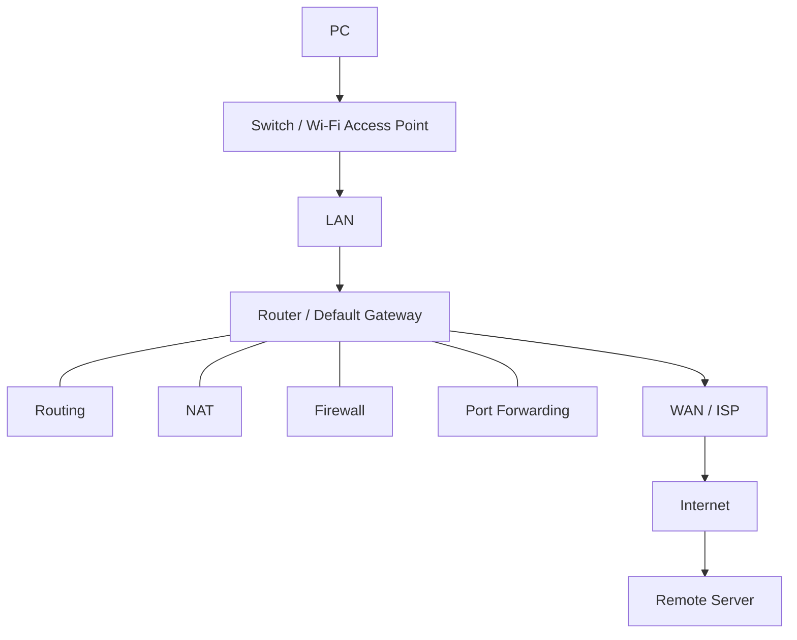

Understanding networking becomes much easier when you think about the journey of a packet:

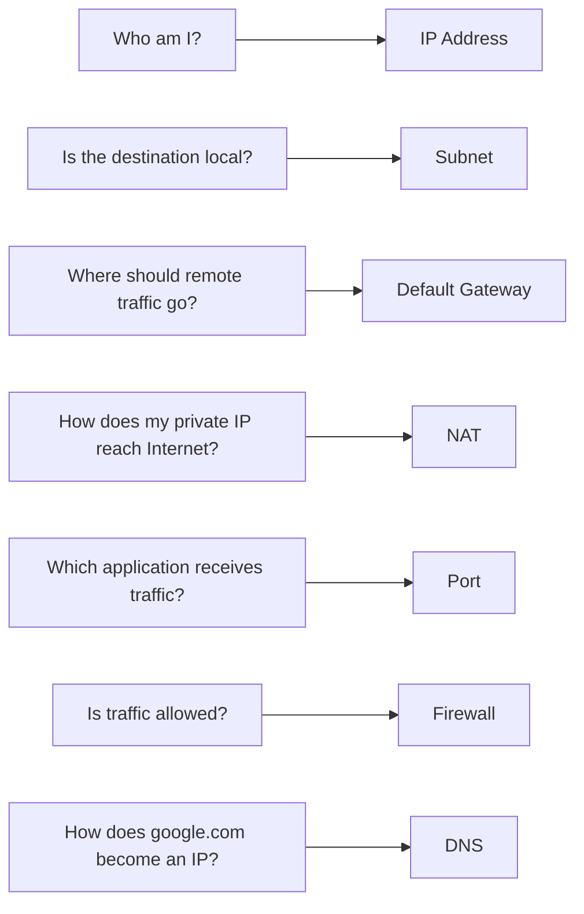

---

# 🌐 IP Addresses

An **IP address** identifies a network interface so that IP packets can be delivered to it.

For example:

```text
192.168.1.20
```

You can think of an IP address like a network address for a device.

> 💡 **Real-World Example**
> 
> Imagine your LAN contains:
> 
> ```text
> Router:  192.168.1.1
> PC:      192.168.1.20
> Server:  192.168.1.50
> ```
> 
> If the PC wants to communicate with the server, it sends packets toward:
> 
> ```text
> 192.168.1.50
> ```

An IP address does **not necessarily identify the entire physical device**.

A computer can have several network interfaces:

```text
Ethernet
Wi-Fi
VPN
Docker bridge
Loopback
```

Each interface may have its own IP address.

---

# 🌐 IPv4

IPv4 addresses contain **32 bits**.

They are normally displayed as four decimal numbers:

```text
192.168.1.20
```

Each number represents **8 bits**, called an **octet**.

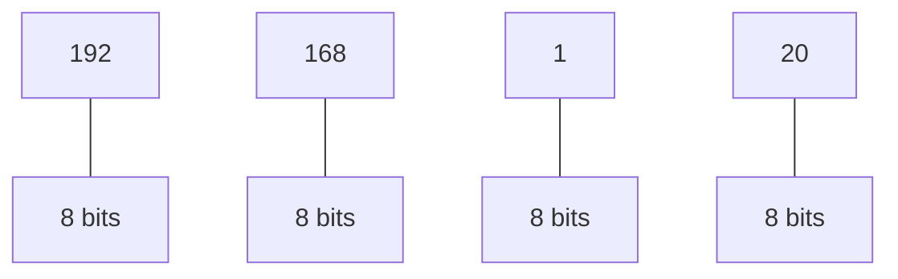

Therefore:

```text
8 + 8 + 8 + 8 = 32 bits
```

Each octet can contain values from:

```text
0 → 255
```

because:

```text
8 bits

2^8 = 256 possible values

0 through 255
```

---

## IPv4 Address Range

The full IPv4 address space goes from:

```text
0.0.0.0
```

to:

```text
255.255.255.255
```

The theoretical number of IPv4 addresses is:

```text
2^32
=
4,294,967,296
```

Not all of these addresses can be assigned to normal Internet hosts because many ranges are reserved for special purposes.

---

# 🌐 Public vs Private IPv4 Addresses

IPv4 addresses can broadly be divided into **public** and **private** addresses.

Private addresses are commonly used inside LANs.

The three private IPv4 ranges are:

```text
10.0.0.0/8

172.16.0.0/12

192.168.0.0/16
```

Examples:

```text
10.20.30.40
172.16.5.10
192.168.1.20
```

These addresses are not normally routed directly across the public Internet.

Public IP addresses are globally routable addresses used on the Internet.

> 💡 **Real-World Example**
> 
> Your network may look like:
> 
> ```mermaid
> flowchart TD
>     N0["PC: 192.168.1.20"]
>     N1["Router: LAN 192.168.1.1 / WAN Public IP"]
>     N2["Internet"]
>     N0 --> N1
>     N1 --> N2
> ```
> 
> The computer uses a private IP internally while the router communicates with the Internet using its WAN-side address.

---

# 🌐 LAN — Local Area Network

A **LAN** is a network covering a relatively limited area such as:

```text
Home
Office
Laboratory
Data-center segment
Factory
```

Example:

```text
192.168.1.0/24 LAN

Router      192.168.1.1
PC          192.168.1.20
Laptop      192.168.1.30
Server      192.168.1.50
Printer     192.168.1.100
```

Devices inside the same subnet can normally communicate directly at the local network level.

---

# 🌐 Switch

A switch connects devices inside an Ethernet LAN.

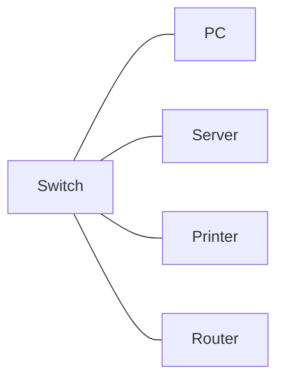

A typical Ethernet switch mainly forwards traffic using **MAC addresses**.

It learns which MAC addresses are reachable through which physical ports.

For example:

```text
MAC Address          Switch Port
AA:AA:AA:AA:AA:01   Port 1
AA:AA:AA:AA:AA:02   Port 2
AA:AA:AA:AA:AA:03   Port 3
```

If traffic needs to reach a known MAC address, the switch forwards the Ethernet frame toward the appropriate port.

---

# 🌐 Router

A router connects **different IP networks**.

A common home router connects:

```text
LAN
192.168.1.0/24
```

to:

```text
ISP / Internet
```

Conceptually:

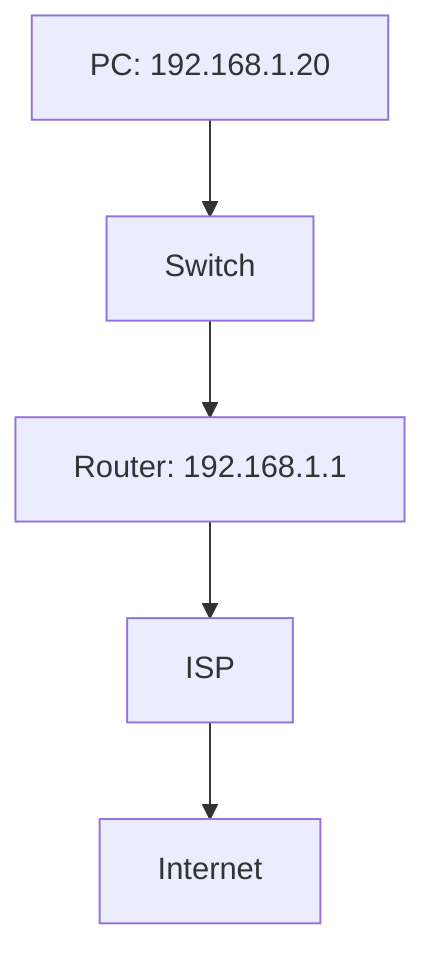

Routers make forwarding decisions using destination IP addresses and routing tables.

---

## Switch vs Router

|Switch|Router|
|---|---|
|Primarily connects devices in a LAN|Connects different networks|
|Mainly forwards Ethernet frames using MAC addresses|Routes IP packets using IP addresses|
|Usually operates mainly at Layer 2|Operates mainly at Layer 3|
|Keeps local devices connected|Determines where traffic goes between networks|

The important distinction is:

```text
Switch → inside a Layer-2 network

Router → between IP networks
```

---

# 🌐 WAN — Wide Area Network

A **WAN** connects networks over larger geographic areas.

For a home or small office, the router's WAN side usually connects toward the ISP.

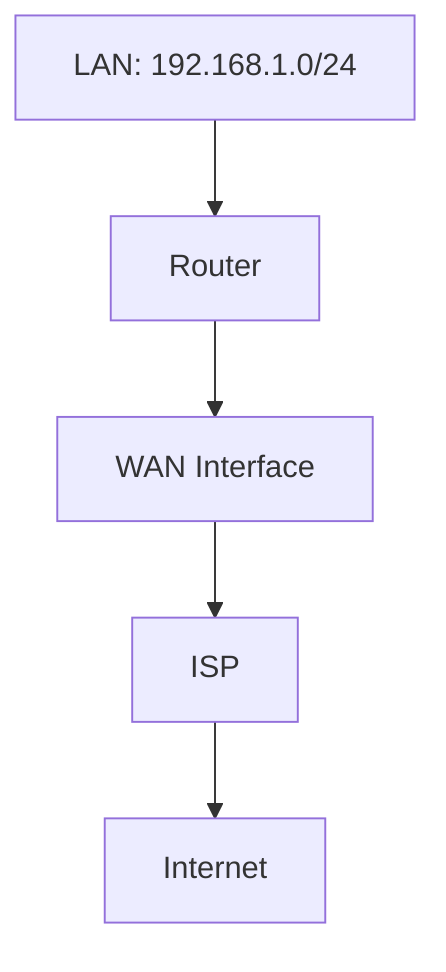

The Internet itself can be viewed as a massive interconnected collection of networks.

---

# 🌐 Default Gateway

A **default gateway** is the router a device sends packets to when the destination is outside its directly connected networks.

For example:

```text
PC IP:      192.168.1.20
Subnet:     192.168.1.0/24
Gateway:    192.168.1.1
```

Suppose the PC wants to contact:

```text
192.168.1.50
```

That address belongs to the local subnet, so the PC communicates locally.

But suppose it wants to contact:

```text
8.8.8.8
```

That address is not inside:

```text
192.168.1.0/24
```

so the PC sends the packet toward its default gateway:

```text
192.168.1.1
```

The router then determines where the packet should go next.

---

## Local Destination vs Remote Destination

```text
PC
192.168.1.20/24
```

Destination:

```text
192.168.1.50
```

Same subnet:


Destination:

```text
8.8.8.8
```

Different network:

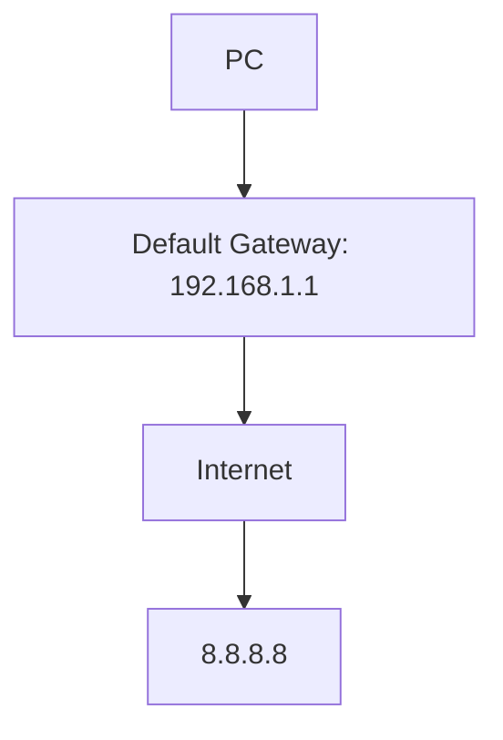

This is one of the most important networking concepts to understand.

---

# 🌐 Subnets

A subnet determines which part of an IP address identifies the **network** and which part identifies a **host/interface inside that network**.

For example:

```text
192.168.1.20/24
```

The `/24` is called the **CIDR prefix length**.

IPv4 contains:

```text
32 total bits
```

A `/24` means:

```text
24 network bits
8 host bits
```

because:

```text
32 - 24 = 8
```

---

## How `/24` Becomes `255.255.255.0`

A `/24` subnet mask contains 24 `1` bits followed by 8 `0` bits:

```text
11111111.11111111.11111111.00000000
```

Convert each octet from binary:

```text
11111111 = 255
11111111 = 255
11111111 = 255
00000000 = 0
```

Therefore:

```text
/24

=

255.255.255.0
```

---

## `/24` Address Calculation

Take:

```text
192.168.1.0/24
```

There are:

```text
32 total IPv4 bits
-24 network bits
----------------
 8 host bits
```

The number of possible addresses is:

```text
2^8 = 256
```

Therefore:

```text
Network address:   192.168.1.0
Usable hosts:      192.168.1.1 – 192.168.1.254
Broadcast address: 192.168.1.255
```

Traditionally:

```text
256 total addresses
- 1 network address
- 1 broadcast address
=
254 usable host addresses
```

> 💡 **Real-World Example**
> 
> If your PC is:
> 
> ```text
> 192.168.1.20/24
> ```
> 
> then addresses such as:
> 
> ```text
> 192.168.1.50
> 192.168.1.100
> ```
> 
> are inside the same subnet.
> 
> But:
> 
> ```text
> 192.168.2.50
> ```
> 
> is outside that `/24`, so it normally requires routing.

---

# 🌐 NAT — Network Address Translation

NAT modifies IP addressing information as packets pass through a network device.

In home and office networks, the most familiar form lets many internal private addresses share one public IPv4 address.

Example:

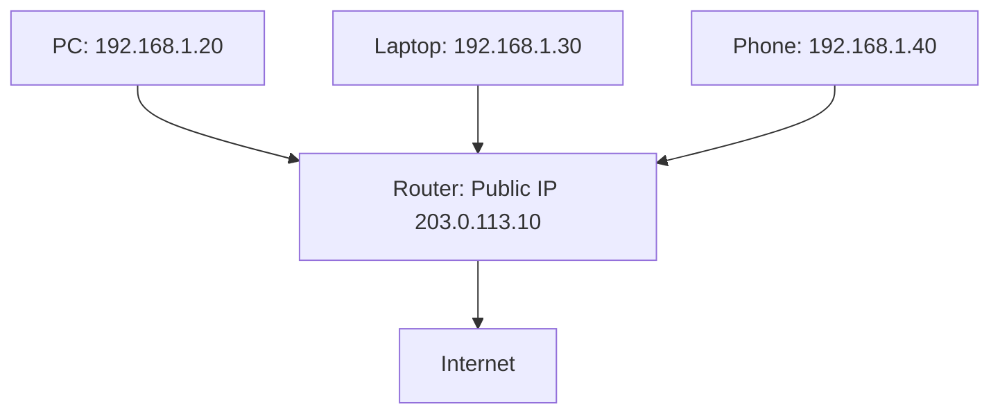

All three devices can communicate with the Internet while externally appearing to use the router's public IP.

For outbound Internet connections, home routers commonly use a technique called **NAPT/PAT**, where both IP addresses and transport-layer port numbers are used to track multiple simultaneous connections.

---

## NAT Example

Suppose your PC creates a connection:

```text
192.168.1.20:51500
```

to:

```text
93.184.216.34:443
```

The router may translate it to something conceptually like:

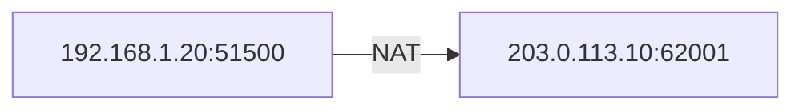

The router remembers the mapping:

```text
203.0.113.10:62001
        ↔
192.168.1.20:51500
```

When reply traffic returns, the router knows which internal connection should receive it.

---

# 🌐 Ports

An IP address identifies a network interface.

A **port number** helps identify the transport-layer endpoint used by an application or service.

For TCP and UDP:

```text
Port range:

0 – 65535
```

A connection can therefore involve:

```text
IP address + protocol + port
```

For example:

```text
192.168.1.50:443/TCP
```

---

## Common Ports

|Service|Default Port|
|---|--:|
|SSH|22/TCP|
|DNS|53/UDP and TCP|
|HTTP|80/TCP|
|HTTPS|443/TCP|
|MySQL|3306/TCP|
|PostgreSQL|5432/TCP|

These are conventions/defaults. Services can often be configured to listen on different ports.

---

## Can Two Applications Use the Same Port?

Usually, two applications cannot simultaneously bind the exact same combination such as:

```text
Same local IP
Same transport protocol
Same port
```

For example, this generally conflicts:

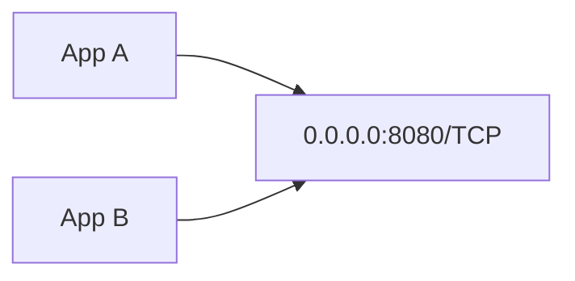

But the same port number can exist in different contexts.

For example:

```text
192.168.1.10:8080
192.168.1.20:8080
```

Those are different hosts.

Or:

```text
192.168.1.10:8080/TCP
192.168.1.10:8080/UDP
```

TCP and UDP have separate port spaces.

Binding rules can become more advanced when multiple local addresses, socket options, containers, proxies, or load balancers are involved.

---

# 🌐 Firewall

A firewall controls which network traffic is allowed or denied according to rules.

A firewall can inspect information such as:

```text
Source IP
Destination IP
Protocol
Source port
Destination port
Connection state
Network interface
```

Example rule:

```text
Allow TCP
Destination port 443
```

Another:

```text
Allow SSH port 22
only from 192.168.1.0/24
```

Conceptually:

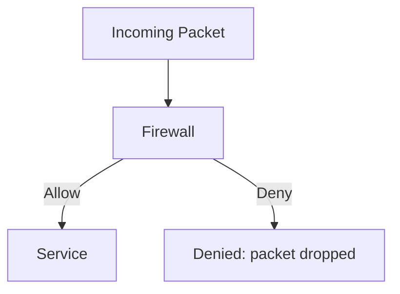

---

## Firewall vs NAT

These concepts are related but different.

|NAT|Firewall|
|---|---|
|Translates addressing/connection information|Controls whether traffic is allowed|
|Often enables private hosts to share public IPv4|Enforces network security rules|
|Maintains translation mappings|Maintains filtering/state rules|

A router often performs both, which is why they are easy to confuse.

---

# 🌐 Port Forwarding

Port forwarding creates a mapping for incoming connections so traffic arriving at a router can be sent to a particular internal device and port.

Suppose you have:

```text
Web Server:
192.168.1.50:8080
```

Users on your LAN can access:

```text
http://192.168.1.50:8080
```

But the private IP:

```text
192.168.1.50
```

is not directly reachable from the public Internet.

You could configure:

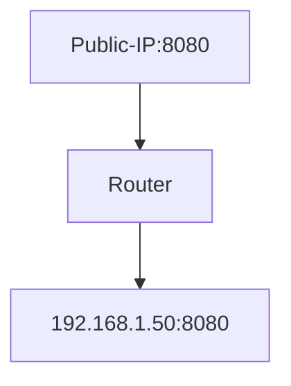

Now incoming traffic matching that forwarding rule can be translated and delivered to the internal server, assuming upstream routing, firewall rules, ISP behavior, and the service configuration also permit it.

---

## Port Forwarding Example

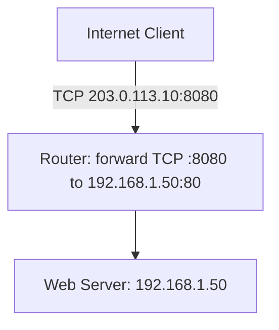

The external and internal ports do not necessarily need to be the same.

For example:

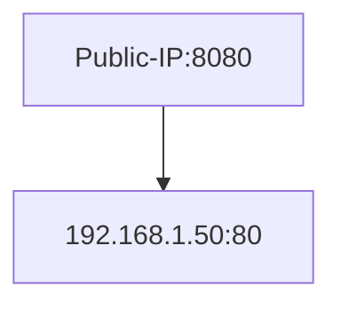

---

# 🌐 DNS — Domain Name System

DNS translates human-friendly domain names into information computers need, especially IP addresses.

For example:

```text
example.com
```

may resolve to an IPv4 address using an `A` DNS record.

Instead of remembering:

```text
93.184.216.34
```

you use:

```text
example.com
```

DNS provides the mapping.

---

# 🌐 Domain Names

A domain name has a hierarchical structure.

For example:

```text
git.my-rm.com
```

Break it apart:


---

# 🌐 Top-Level Domains — TLDs

The final part of a domain name is the **Top-Level Domain**.

Examples include:

```text
.com
.org
.net
.edu
.gov
.mil
```

Country-code TLDs include:

```text
.de
.ir
.us
.uk
.fr
```

These are commonly called **ccTLDs**.

---

# 🌐 ICANN

**ICANN** stands for:

```text
Internet Corporation for Assigned Names and Numbers
```

ICANN coordinates important parts of the global domain-name and Internet identifier system.

It does not operate every DNS server or directly answer normal DNS queries.

Instead, it participates in the overall coordination of things such as:

```text
DNS root
Top-level domains
Domain-name policy/coordination
IP number resource coordination through the IANA functions
```

---

# 🌐 Subdomains

A subdomain allows you to organize services under a domain.

Suppose you own:

```text
my-rm.com
```

You could create:

```text
www.my-rm.com
git.my-rm.com
api.my-rm.com
cloud.my-rm.com
vpn.my-rm.com
```

They could point to the same server or completely different infrastructure.

For example:

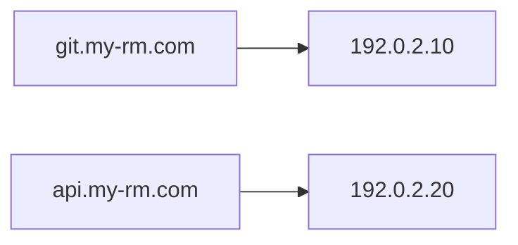

DNS simply maps names to records. The services do not have to physically exist on the same machine.

---

# 🌐 Fully Qualified Domain Name — FQDN

An **FQDN** identifies a name using its complete position in the DNS hierarchy.

For example:

```text
git.my-rm.com
```

Conceptually, the absolute DNS name includes the DNS root:

```text
git.my-rm.com.
```

Notice the trailing dot:

```text
.
```

That dot represents the DNS root.

Applications usually allow you to omit it:

```text
git.my-rm.com
```

but DNS internally works with the hierarchy:

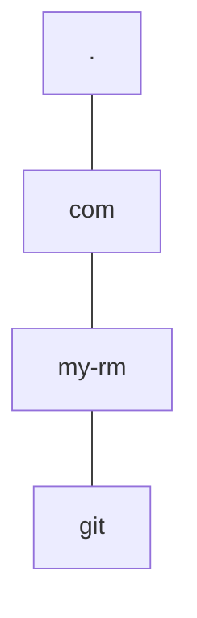

---

# 🌐 How DNS Resolution Works

Suppose you enter:

```text
www.example.com
```

into your browser.

The complete process looks approximately like this:

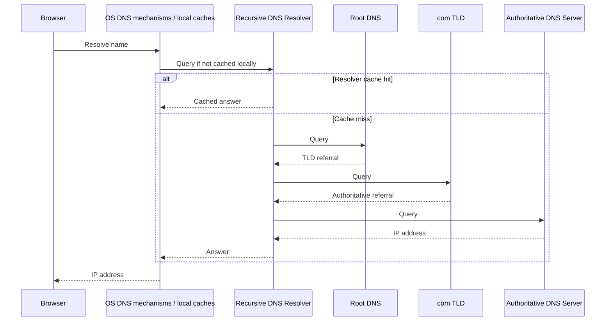

The important distinction is that your computer normally does **not personally query all of the root, TLD, and authoritative servers**.

It normally asks a configured **recursive resolver** to perform that work.

That resolver might belong to:

```text
Your router
Your ISP
Your company
Cloudflare
Google
Quad9
Another DNS provider
```

---

## Step 1 — Application Requests a Name

Your browser needs the address for:

```text
www.example.com
```

It asks the operating system's name-resolution facilities.

Caches may be checked along the way.

---

## Step 2 — Recursive Resolver

If the answer is not already available locally, the request normally reaches a recursive DNS resolver.

Example resolver IPs include:

```text
1.1.1.1
8.8.8.8
```

The recursive resolver checks its own cache.

If it already knows the answer and the cached DNS record has not expired, it returns it immediately.

Otherwise it begins resolving the name.

---

# 🌐 Root DNS Servers

The resolver can begin by asking a DNS root server.

Conceptually:

```text
Where can I find information about www.example.com?
```

The root server usually does **not** return the final website IP address.

Instead, it provides information directing the resolver toward the appropriate TLD DNS infrastructure.

For:

```text
www.example.com
```

the relevant TLD is:

```text
.com
```

---

# 🌐 TLD DNS Servers

The recursive resolver then queries the `.com` DNS servers.

Conceptually:

```text
Who is authoritative for example.com?
```

The TLD infrastructure provides a referral toward the authoritative name servers for the domain.

For example:

```text
ns1.example-dns.com
ns2.example-dns.com
```

---

# 🌐 Authoritative DNS Server

The authoritative name server stores DNS information for the domain or zone it is authoritative for.

The resolver asks:

```text
What is the A record for www.example.com?
```

The authoritative server might answer:

```text
www.example.com
A
192.0.2.50
```

The recursive resolver returns that result to your system.

Your browser can now create a network connection toward the returned address.

---

# 🌐 Complete DNS Resolution Example

```text
User enters:

https://www.example.com
```

Flow:

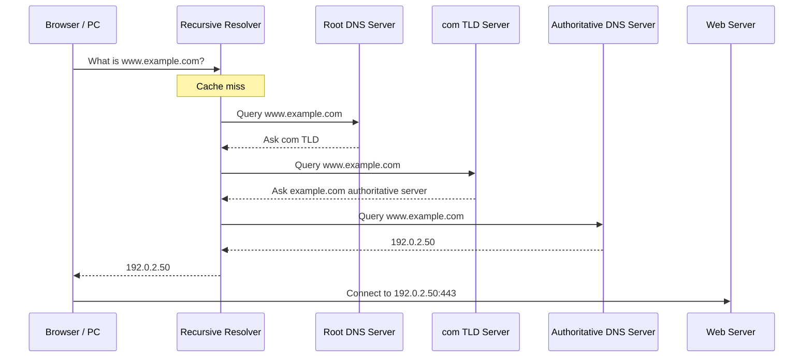

DNS finds the address.

TCP/IP then handles communication with that address.

HTTPS/TLS handles secure communication with the web server.

These are separate stages.

---

# 🌐 DNS Caching

Performing the complete DNS hierarchy lookup every time would be wasteful.

DNS therefore uses caching.

The result may be cached by several components, such as:

```text
Application
Operating system
Local DNS caching service
Recursive resolver
```

DNS records include a value called:

```text
TTL
```

which means:

```text
Time To Live
```

Suppose:

```text
www.example.com
A
192.0.2.50
TTL = 3600
```

A caching resolver can generally reuse that result for:

```text
3600 seconds
=
60 minutes
=
1 hour
```

until the cached record expires.

This is one reason DNS changes do not always appear everywhere immediately.

---

# 🌐 DNS Records

DNS stores much more than only IPv4 addresses.

Important record types include:

|Record|Purpose|
|---|---|
|`A`|Maps a name to IPv4|
|`AAAA`|Maps a name to IPv6|
|`CNAME`|Creates a hostname alias|
|`MX`|Identifies mail servers|
|`NS`|Identifies authoritative name servers|
|`TXT`|Stores arbitrary text, often for verification/security|
|`PTR`|Reverse DNS mapping|

Example:

```text
api.example.com
A
192.0.2.20
```

Another:

```text
www.example.com
CNAME
web.example.com
```

---

# 🌐 Putting Everything Together

Consider this network:

```text
PC:       192.168.1.20
Server:   192.168.1.50
Router:   192.168.1.1
Subnet:   192.168.1.0/24
DNS:      1.1.1.1
```

---

## Scenario 1 — PC → Local Server

You access:

```text
http://192.168.1.50:8080
```

The PC compares:

```text
192.168.1.50
```

against its subnet.

Both addresses belong to:

```text
192.168.1.0/24
```

so the traffic stays local.

Conceptually:

```mermaid
flowchart TD
    N0["PC: 192.168.1.20"]
    N1["Switch"]
    N2["Server: 192.168.1.50:8080"]
    N0 --> N1
    N1 --> N2
```

The default gateway is not used for routing that IP packet because the destination is local.

---

## Scenario 2 — PC → Internet

The PC wants:

```text
8.8.8.8
```

That is not inside:

```text
192.168.1.0/24
```

so the packet goes toward:

```text
192.168.1.1
```

Flow:

```mermaid
flowchart TD
    N0["PC: 192.168.1.20"]
    N1["Router / Gateway: 192.168.1.1"]
    N2["Routing"]
    N3["NAT"]
    N4["Firewall"]
    N5["ISP"]
    N6["Internet"]
    N7["8.8.8.8"]
    N0 --> N1
    N1 --- N2
    N1 --- N3
    N1 --- N4
    N1 --> N5
    N5 --> N6
    N6 --> N7
```

---

## Scenario 3 — Domain → Website

You enter:

```text
https://example.com
```

First:

```mermaid
flowchart TD
    N0["example.com"]
    N1["DNS"]
    N2["IP address"]
    N0 --> N1
    N1 --> N2
```

Then:

```mermaid
flowchart TD
    N0["PC"]
    N1["Gateway"]
    N2["Internet"]
    N3["Web Server:443"]
    N0 --> N1
    N1 --> N2
    N2 --> N3
```

DNS resolution and network communication are related but separate processes.

---

## Scenario 4 — DNS Is Broken

Suppose:

```bash
ping 8.8.8.8
```

works.

But:

```bash
ping example.com
```

fails with a name-resolution error.

This strongly suggests:

```text
IP connectivity works
Gateway probably works
Internet routing probably works
NAT probably works

BUT

DNS resolution may be failing
```

This is why engineers often test an IP address separately from a domain name.

---

## Scenario 5 — Wrong Default Gateway

Suppose:

```text
PC:      192.168.1.20/24
Gateway: 192.168.10.1
```

The configured gateway is not on the PC's directly connected `/24` network.

You may still be able to communicate with:

```text
192.168.1.50
```

because it is local.

But Internet access will likely fail because traffic cannot correctly reach the expected router.

---

## Scenario 6 — Firewall Blocking a Service

Suppose a server is listening on:

```text
192.168.1.50:8080
```

but the firewall blocks TCP port `8080`.

The server may be running perfectly, yet clients still cannot connect.

The flow becomes:

```mermaid
flowchart TD
    N0["Client"]
    N1["Network"]
    N2["Firewall"]
    N3["Server:8080"]
    N0 --> N1
    N1 --> N2
    N2 -. Blocked .-> N3
```

This distinction is useful when troubleshooting:

```text
Is the application running?

Is it listening on the expected address/port?

Can packets reach the host?

Does the firewall allow them?
```

---

# 💻 Networking Commands

## 💻 `ip`

`ip` is the modern Linux tool for inspecting and configuring interfaces, IP addresses, and routes.

It largely replaces older tools such as:

```text
ifconfig → ip
route    → ip route
```

### Show Interfaces and IP Addresses

```bash
ip addr
```

Short form:

```bash
ip a
```

Example output:

```text
2: enp5s0: <BROADCAST,MULTICAST,UP,LOWER_UP>
    inet 192.168.1.20/24 brd 192.168.1.255
```

Important fields:

```text
enp5s0
```

Network interface name.

```text
192.168.1.20
```

IPv4 address.

```text
/24
```

Subnet prefix.

```text
192.168.1.255
```

Broadcast address.

---

## 💻 `ip route`

Displays the routing table.

```bash
ip route
```

Example:

```text
default via 192.168.1.1 dev enp5s0

192.168.1.0/24 dev enp5s0
src 192.168.1.20
```

The important line is:

```text
default via 192.168.1.1
```

This means:

> If no more specific route matches the destination, send traffic to `192.168.1.1`.

That is your default gateway.

---

# 💻 `ifconfig`

`ifconfig` is an older command used to inspect or configure network interfaces.

```bash
ifconfig
```

It may still appear in tutorials and older Linux environments.

Modern Linux administration usually prefers:

```bash
ip addr
```

So remember:

```text
ifconfig → legacy

ip addr → modern
```

---

# 💻 `ping`

`ping` commonly tests IP reachability using ICMP Echo Request and Echo Reply messages.

### Structure

```bash
ping destination
```

Example:

```bash
ping 192.168.1.1
```

This tests whether the gateway responds.

Another:

```bash
ping 8.8.8.8
```

This can help test external IP connectivity.

Another:

```bash
ping example.com
```

This requires name resolution first, so it also indirectly exercises DNS.

Example output:

```text
64 bytes from 8.8.8.8:
icmp_seq=1
ttl=117
time=20.4 ms
```

Important fields:

```text
icmp_seq
```

Packet sequence number.

```text
ttl
```

IP Time To Live remaining in the received packet.

```text
time
```

Round-trip latency.

> ⚠️ A failed `ping` does not always mean the destination is offline. Firewalls may block ICMP while allowing other services such as HTTPS.

---

# 💻 `nslookup`

`nslookup` queries DNS.

### Structure

```bash
nslookup domain
```

Example:

```bash
nslookup example.com
```

Possible output:

```text
Name:    example.com
Address: 93.184.216.34
```

You can also query a specific resolver:

```bash
nslookup example.com 1.1.1.1
```

This asks:

```text
Cloudflare's 1.1.1.1 resolver
```

instead of simply using your machine's normal configured resolver.

For deeper DNS investigation, `dig` is often preferred by administrators.

```text
nslookup → simple DNS testing

dig      → detailed DNS investigation
```

---

# 💻 `ss`

`ss` displays network sockets.

It is the modern replacement for many common `netstat` uses.

```text
netstat → older tool

ss      → modern tool
```

A very useful command is:

```bash
ss -ltnp
```

Break it down:

```text
-l  listening sockets
-t  TCP
-n  show numeric addresses/ports
-p  show process information when permitted
```

Example output:

```text
LISTEN 0 511 0.0.0.0:80    0.0.0.0:* users:(("nginx",pid=1500))
LISTEN 0 128 0.0.0.0:22    0.0.0.0:* users:(("sshd",pid=800))
```

This tells you:

```text
nginx → listening on TCP 80
sshd  → listening on TCP 22
```

This is extremely useful when debugging:

> "My service is running, but I can't connect to it."

First check whether it is actually listening.

---

# 💻 `netstat`

`netstat` historically displays sockets, connections, routes, and other network information.

Example:

```bash
netstat -tulpn
```

But on modern Linux systems:

```text
netstat → ss
```

is the preferred transition.

---

# 💻 `ps aux`

`ps` is a **process-management command**, not specifically a networking command.

```bash
ps aux
```

It lists running processes.

This is still useful when debugging network services.

For example:

```bash
ps aux | grep nginx
```

You may discover:

```text
nginx is running
```

Then use:

```bash
ss -ltnp
```

to determine whether it is actually listening on the expected network port.

The two tools answer different questions:

```text
ps
→ Is the process running?

ss
→ Is the process listening on a socket?
```

---

# 🔨 Hands-On Networking Practice

Assume your computer is connected to a normal LAN.

Start with:

```bash
ip addr
```

Find your active interface and IPv4 address.

Look for something similar to:

```text
192.168.x.x/24
```

Then:

```bash
ip route
```

Find:

```text
default via ...
```

That tells you the default gateway.

---

Now test the gateway:

```bash
ping 192.168.1.1
```

Use the actual gateway from `ip route`.

If that works, you have basic local connectivity toward the router.

---

Now test Internet IP connectivity:

```bash
ping 8.8.8.8
```

If this works, packets are reaching the Internet.

---

Now test DNS:

```bash
nslookup example.com
```

Then:

```bash
ping example.com
```

If:

```bash
ping 8.8.8.8
```

works but domain resolution fails, investigate DNS.

---

Check listening TCP services:

```bash
ss -ltnp
```

Look for lines such as:

```text
0.0.0.0:22
127.0.0.1:5432
0.0.0.0:8080
```

These addresses matter.

For example:

```text
127.0.0.1:8080
```

means a service is listening only on the loopback interface.

Other machines generally cannot connect to that socket directly.

By contrast:

```text
0.0.0.0:8080
```

means the service is bound to all IPv4 local interfaces unless other restrictions apply.

---

# 🧪 Interview Q&A

**Q1:** Why does a computer need a default gateway?

**Q2:** What happens when the destination IP belongs to the same subnet?

**Q3:** What is the main difference between a switch and a router?

**Q4:** Why are private IPv4 addresses normally not directly reachable from the Internet?

**Q5:** What does NAT commonly accomplish on a home router?

**Q6:** What is the difference between NAT and a firewall?

**Q7:** What does `/24` mean?

**Q8:** How many total addresses exist in a normal IPv4 `/24` subnet?

**Q9:** Why can `ping 8.8.8.8` work while `ping example.com` fails?

**Q10:** What is the purpose of port forwarding?

> [!answer]- 📋 Answers
> 
> **A1:** The default gateway receives packets whose destinations are outside the device's directly connected networks and routes them onward.
> 
> **A2:** The device sends the traffic locally rather than routing the IP packet through the default gateway.
> 
> **A3:** A switch primarily connects and forwards between devices at Layer 2 using MAC addresses, while a router forwards IP packets between different Layer-3 networks.
> 
> **A4:** Private IPv4 ranges are intentionally not globally routed on the public Internet. A router commonly uses NAT when those devices access the Internet.
> 
> **A5:** It commonly translates connections from multiple private internal addresses so they can share a public IPv4 address.
> 
> **A6:** NAT translates addressing/connection information. A firewall decides whether network traffic should be permitted.
> 
> **A7:** `/24` means the first 24 bits of the 32-bit IPv4 address are the network prefix bits.
> 
> **A8:** `32 - 24 = 8` host bits, so `2^8 = 256` total addresses.
> 
> **A9:** Reaching `8.8.8.8` only requires working IP connectivity. Reaching `example.com` first requires DNS to convert the name into an IP address, so DNS may be broken even while Internet routing works.
> 
> **A10:** Port forwarding maps incoming traffic arriving at a router's address and port to a particular host and port on an internal network.

---

# 🧪 DNS Q&A

**Q1:** Does your PC normally contact a DNS root server directly for every lookup?

**Q2:** What does a DNS root server normally return when resolving `example.com`?

**Q3:** What does a `.com` TLD server know?

**Q4:** Which server normally provides the actual DNS records for a domain?

**Q5:** Why is DNS caching important?

**Q6:** What does DNS TTL control?

**Q7:** What is the difference between an `A` and `AAAA` record?

**Q8:** What is an FQDN?

> [!answer]- 📋 Answers
> 
> **A1:** Usually no. The device normally asks a configured recursive resolver, which performs or obtains the remaining resolution.
> 
> **A2:** It typically returns a referral toward the DNS infrastructure responsible for the appropriate top-level domain, such as `.com`.
> 
> **A3:** It can provide delegation information pointing toward the authoritative name servers for domains beneath that TLD.
> 
> **A4:** An authoritative DNS server for the relevant DNS zone.
> 
> **A5:** It avoids repeating expensive DNS queries and significantly reduces lookup latency and DNS infrastructure load.
> 
> **A6:** TTL tells caching resolvers how long a DNS record may generally remain cached before it needs refreshing.
> 
> **A7:** `A` stores an IPv4 address, while `AAAA` stores an IPv6 address.
> 
> **A8:** A Fully Qualified Domain Name represents a host or name using its complete location in the DNS hierarchy, such as `git.my-rm.com.`.

---

# 📋 Quick Reference

```text
IP Address
    Identifies an IP interface/location on a network

IPv4
    32-bit addressing system

LAN
    Local Area Network

WAN
    Wide Area Network

Switch
    Connects devices on a Layer-2 network
    Primarily forwards using MAC addresses

Router
    Connects IP networks
    Routes using destination IP addresses

Default Gateway
    Router used when no more specific route exists

Subnet
    Determines which addresses belong to an IP network

/24
    24 network bits
    8 host bits
    255.255.255.0

NAT
    Translates network addressing/connection information

Firewall
    Allows or blocks traffic according to rules

Port
    TCP/UDP endpoint number
    Range: 0–65535

Port Forwarding
    Maps incoming router traffic to an internal host/service

DNS
    Domain Name System

Recursive Resolver
    Performs DNS resolution on behalf of clients

Root DNS
    Refers resolver toward the correct TLD

TLD DNS
    Refers resolver toward authoritative DNS servers

Authoritative DNS
    Supplies authoritative DNS records

FQDN
    Complete DNS name

TTL
    Determines DNS cache lifetime
```

---

# 🧠 Things to Remember

The most important packet-routing decision on a host is:

```mermaid
flowchart TD
    N0["Is the destination local?"]
    N1["Communicate on local network"]
    N2["Use a route, often the default gateway"]
    N0 -->|Yes| N1
    N0 -->|No| N2
```

Keep these concepts separate:

```text
IP       → where the network interface is

Subnet   → which network addresses are considered local

Gateway  → where remote traffic goes

Port     → which TCP/UDP endpoint/application receives traffic

DNS      → converts names into DNS data such as IP addresses

NAT      → translates connection/address information

Firewall → controls which traffic is allowed

Port Forwarding
         → creates an inbound mapping toward an internal service
```

And remember this troubleshooting sequence:

```mermaid
flowchart TD
    N0["ip addr: do I have an IP?"]
    N1["ip route: are gateway/routes correct?"]
    N2["ping gateway: can I reach the router?"]
    N3["ping external IP: can I reach Internet?"]
    N4["nslookup domain: does DNS work?"]
    N5["ss -ltnp: is the service listening?"]
    N6["Firewall / NAT / forwarding: is traffic allowed and mapped?"]
    N0 --> N1
    N1 --> N2
    N2 --> N3
    N3 --> N4
    N4 --> N5
    N5 --> N6
```

---

# 💡 Pro Tips

When troubleshooting networking, test one layer at a time. Do not immediately blame DNS, the firewall, or the application.

For example:

```mermaid
flowchart TD
    N0["Can I reach the host?"]
    N1["Can I reach the port?"]
    N2["Is the application listening?"]
    N3["Does DNS resolve?"]
    N4["Is the firewall allowing traffic?"]
    N0 --> N1
    N1 --> N2
    N2 --> N3
    N3 --> N4
```

Use IP addresses during troubleshooting to separate **DNS problems** from **network-connectivity problems**.

Use:

```bash
ip addr
ip route
ss
```

instead of relying primarily on older commands:

```text
ifconfig
route
netstat
```

When a service works locally but not remotely, always check what address it is bound to:

```text
127.0.0.1:8080
```

and:

```text
0.0.0.0:8080
```

mean very different things.

Finally, do not treat NAT as a security system by itself. Firewall policy is what should explicitly control allowed and denied traffic.

---

# 🔗 Related Topics

[[IPv4]]

[[IPv6]]

[[Subnetting]]

[[CIDR]]

[[MAC Address]]

[[ARP]]

[[Routing]]

[[Routing Table]]

[[Default Gateway]]

[[NAT]]

[[PAT]]

[[Firewall]]

[[Port Forwarding]]

[[TCP]]

[[UDP]]

[[ICMP]]

[[DNS]]

[[DNS Records]]

[[DNS Resolution]]

[[DHCP]]

[[VLAN]]

[[OSI Model]]

[[TCP-IP Model]]

[[HTTP]]

[[HTTPS]]

[[TLS]]

[[Reverse Proxy]]
