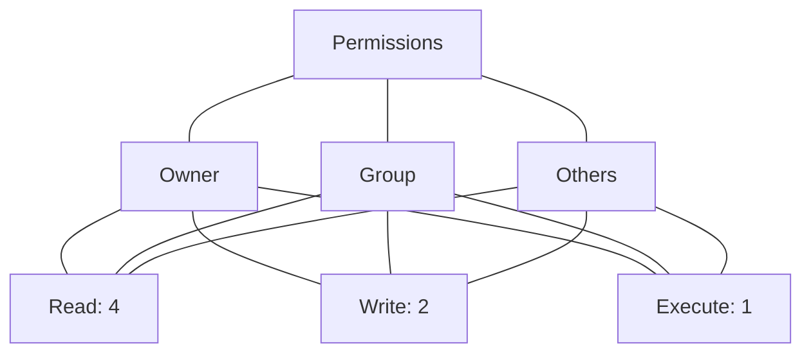

Here's a comprehensive Obsidian-friendly markdown documentation for Linux file ownership and permissions:

# 📁 Linux File Ownership & Permissions

## 🔐 Understanding & Managing Access Control

---

## 1️⃣ Viewing Ownership & Permissions: `ls -l`

### 📋 Structure
```bash
ls -l [file/directory]
```

### 🔍 Output Breakdown
```bash
-rwxr-xr-- 1 john developers 4096 Jan 15 10:30 script.sh
│││││││││  │ │    │          │    │       │
│││││││││  │ │    │          │    │       └── Filename
│││││││││  │ │    │          │    └── Modification time
│││││││││  │ │    │          └── Size in bytes
│││││││││  │ │    └── Group owner
│││││││││  │ └── User owner
│││││││││  └── Hard link count
││││││││└── Others permissions (r-x)
│││││││└── Group permissions (rwx)
││││││└── Owner permissions (rwx)
││││└── File type (- = regular, d = directory, l = symlink)
```

### 💡 Examples
```bash
# List current directory with details
ls -l

# List specific file
ls -l /etc/passwd

# List directory itself (not contents)
ls -ld /home/john
```

### 🚀 Advanced Use Cases
```bash
# List all files including hidden
ls -la

# Human-readable sizes
ls -lh

# Sort by time (newest first)
ls -lt

# Show inode numbers
ls -li
```

---

## 2️⃣ File Types & Permission Characters

### 📂 File Types (First Character)
| Character | Meaning |
|-----------|---------|
| `-` | Regular file |
| `d` | Directory |
| `l` | Symbolic link |
| `c` | Character device |
| `b` | Block device |
| `s` | Socket |
| `p` | Named pipe |

### 🔤 Permission Characters
| Character | Permission | Effect on File | Effect on Directory |
|-----------|------------|----------------|---------------------|
| `r` | Read | View contents | List files |
| `w` | Write | Modify contents | Create/delete files |
| `x` | Execute | Run as program | Enter directory |
| `-` | None | No permission | No permission |

---

## 3️⃣ Changing Ownership: `chown`

### 📋 Structure
```bash
sudo chown [options] [owner][:group] file/directory
```

### 💡 Examples
```bash
# Change owner only
sudo chown john file.txt

# Change owner and group
sudo chown john:developers file.txt

# Change group only (using colon)
sudo chown :developers file.txt

# Recursively change directory and contents
sudo chown -R john:developers /project
```

### 🚀 Advanced Use Cases
```bash
# Change ownership to match another file
sudo chown --reference=template.txt newfile.txt

# Change only if current owner matches
sudo chown --from=oldowner john file.txt

# Preserve root ownership for system files
sudo chown root:root /etc/config.conf
```

---

## 4️⃣ Changing Group Only: `chgrp`

### 📋 Structure
```bash
sudo chgrp [options] groupname file/directory
```

### 💡 Examples
```bash
# Change group
sudo chgrp developers file.txt

# Recursively change group
sudo chgrp -R developers /project

# Change group using reference
sudo chgrp --reference=template.txt newfile.txt
```

### 🚀 Advanced Use Cases
```bash
# Change group and follow symlinks
sudo chgrp -h developers symlink

# Verbose output for multiple files
sudo chgrp -v developers *.txt
```

---

## 5️⃣ Understanding Permission Blocks

### 📊 Visualization


### 💡 Example Analysis
```bash
drwxrwxr-x  2 john developers 4096 Jan 15 10:30 project/
```
- `d`: It's a directory
- `rwx` (owner: john): Full access
- `rwx` (group: developers): Full access
- `r-x` (others): Read and execute (can list contents, enter, but not modify)

---

## 6️⃣ Changing Permissions: `chmod` (Symbolic Mode)

### 📋 Structure
```bash
chmod [who][operator][permissions] file
```

### 👥 Who (Target)
| Symbol | Meaning |
|--------|---------|
| `u` | User (owner) |
| `g` | Group |
| `o` | Others |
| `a` | All (u+g+o) |

### ➕➖ Operators
| Operator | Meaning |
|----------|---------|
| `+` | Add permission |
| `-` | Remove permission |
| `=` | Set exact permission |

### 💡 Examples
```bash
# Remove write permission for group
chmod g-w file.txt

# Add execute for owner
chmod u+x script.sh

# Remove all permissions for others
chmod o-rwx file.txt

# Add read for everyone
chmod a+r file.txt

# Set exact permissions
chmod u=rwx,g=rx,o= file.txt
```

### 🚀 Advanced Use Cases
```bash
# Multiple changes at once
chmod u+rwx,g+rx,o-rwx file.txt

# Copy permissions from another file
chmod --reference=template.txt newfile.txt

# Recursive change for directories
chmod -R g+rwX directory/   # X = execute only if directory or already executable
```

---

## 7️⃣ Changing Permissions: `chmod` (Numeric Mode)

### 🔢 Numeric Values
| Number | Permissions | Binary |
|--------|-------------|--------|
| 0 | `---` | 000 |
| 1 | `--x` | 001 |
| 2 | `-w-` | 010 |
| 3 | `-wx` | 011 |
| 4 | `r--` | 100 |
| 5 | `r-x` | 101 |
| 6 | `rw-` | 110 |
| 7 | `rwx` | 111 |

### 📋 Structure
```bash
chmod [owner][group][others] file
```

### 💡 Examples
```bash
# Full permissions for everyone (dangerous!)
chmod 777 file.txt

# Owner full, group read, others none
chmod 740 file.txt

# Common settings
chmod 755 script.sh    # Owner rwx, group/others rx
chmod 644 file.txt     # Owner rw, group/others r
chmod 600 secret.txt   # Owner rw only
```

### 🚀 Advanced Use Cases
```bash
# Set default permissions for new files (umask)
umask 022   # Results in 755 for dirs, 644 for files

# Recursive with specific directories vs files
find . -type d -exec chmod 755 {} \;
find . -type f -exec chmod 644 {} \;

# Special bits
chmod 4755 file   # SetUID (run as owner)
chmod 2755 file   # SetGID
chmod 1755 dir    # Sticky bit (only owner can delete)
```

---

## 📊 Quick Reference Table

| Command | Purpose | Example |
|---------|---------|---------|
| `ls -l` | View ownership & permissions | `ls -l file.txt` |
| `chown` | Change owner & group | `sudo chown john:dev file.txt` |
| `chgrp` | Change group only | `sudo chgrp dev file.txt` |
| `chmod u+x` | Add execute for owner | `chmod u+x script.sh` |
| `chmod g-w` | Remove write for group | `chmod g-w file.txt` |
| `chmod o=` | Remove all for others | `chmod o= file.txt` |
| `chmod 755` | Set numeric permissions | `chmod 755 script.sh` |

---

## 🎯 Pro Tips

> [!TIP] **Use `=` carefully**  
> `chmod g=r` sets group to read-only, removing write/execute even if they existed before.

> [!WARNING] **`chmod 777` is dangerous**  
> It gives everyone full control. Use only for temporary testing, never on production.

> [!NOTE] **Directory execute permission**  
> Without `x` on a directory, users cannot `cd` into it or access files inside, even if they have read permission.

> [!IMPORTANT] **Ownership changes require sudo**  
> Only root can change file ownership. Regular users can change group only if they belong to the target group.

---

## 🔐 Security Best Practices

- 🔒 Use **least privilege**: Give only necessary permissions.
- 📁 Set directories to `755` and files to `644` as defaults.
- 🚫 Avoid `777`; use groups to manage shared access.
- 🛡️ Use `chown root:root` for system configuration files.
- 📝 Regularly audit with `ls -l` and `find` for unusual permissions.

---

This reference covers the essentials of Linux file ownership and permissions. Keep it handy in your Obsidian vault for quick lookup! 📚


