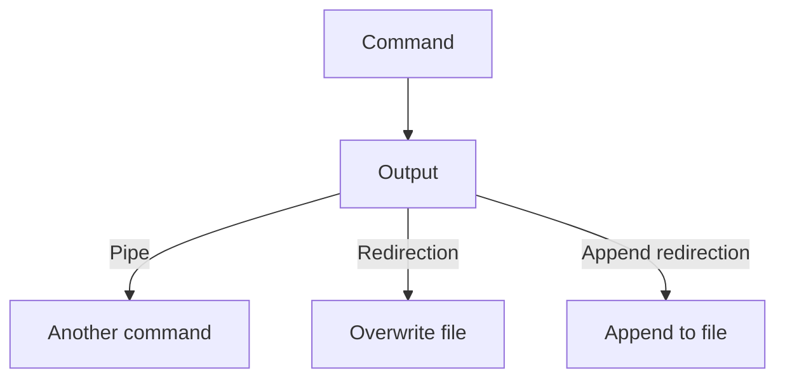
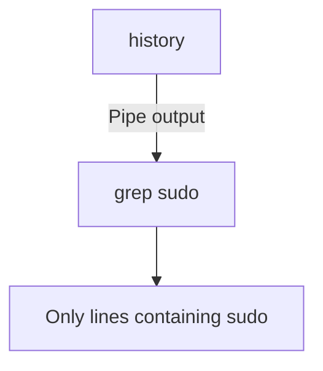
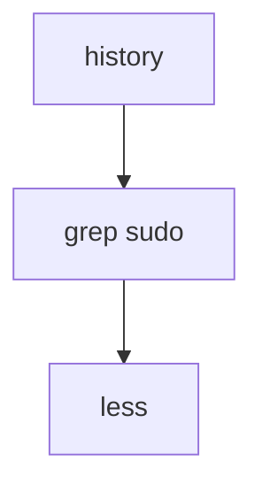
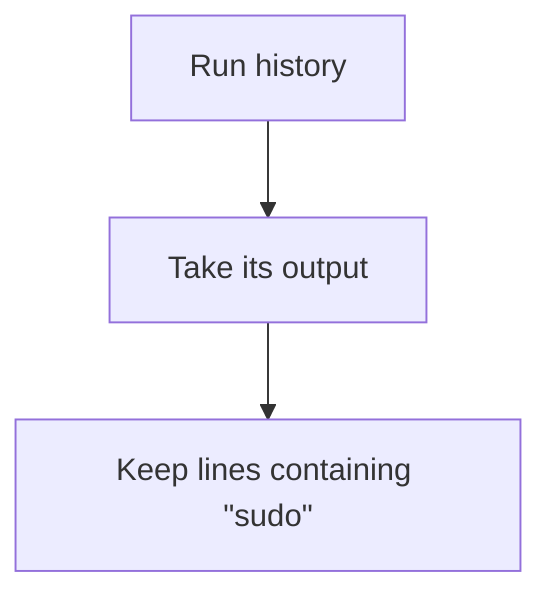
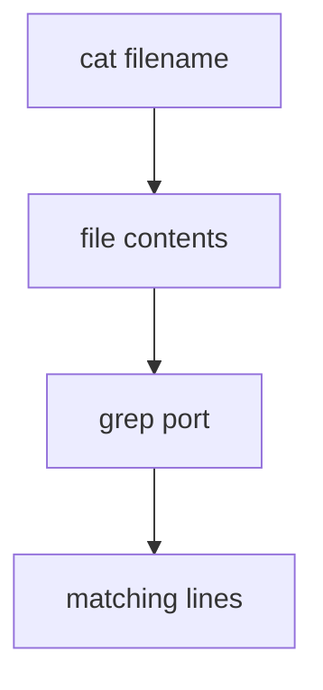
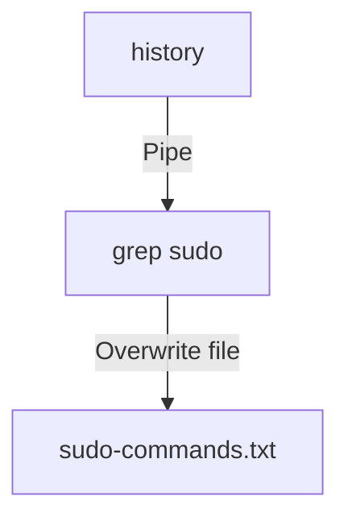
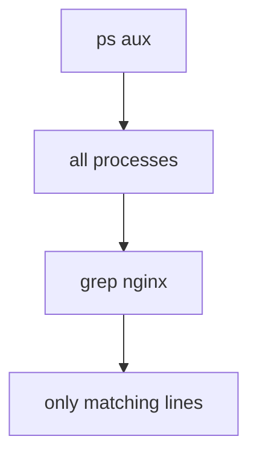
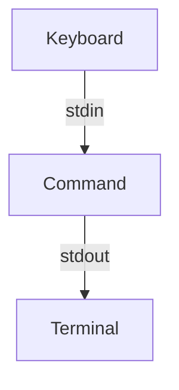

# 🔀 Linux Pipes, grep, less, and Output Redirection

[[DevOps/NaNa/0. Nana DevOps Table of Contents|📚 Nana DevOps Table of Contents]]

> [!toc]- 📑 Contents
>
> - [🌐 Pipes `|`](#%F0%9F%8C%90%20Pipes%20%7C)
> - [[#📖 less|📖 `less`]]
> - [[#💻 less|💻 `less`]]
> - [[#⌨️ Useful less Keys|⌨️ Useful `less` Keys]]
> - [[#🔍 grep|🔍 `grep`]]
> - [[#💻 grep|💻 `grep`]]
> - [[#🔗 Using grep with Pipes|🔗 Using `grep` with Pipes]]
> - [[#Searching for Multiple Words|Searching for Multiple Words]]
> - [[#📄 Searching Inside Files|📄 Searching Inside Files]]
> - [[#🧰 Useful grep Options|🧰 Useful `grep` Options]]
> - [[#-i — Ignore Case|`-i` — Ignore Case]]
> - [[#-n — Show Line Numbers|`-n` — Show Line Numbers]]
> - [[#-v — Show Lines That Do NOT Match|`-v` — Show Lines That Do NOT Match]]
> - [[#-r — Search Recursively|`-r` — Search Recursively]]
> - [[#Combining Options|Combining Options]]
> - [[#🧪 Pipe + grep Example|🧪 Pipe + `grep` Example]]
> - [[#➡️ Output Redirection|➡️ Output Redirection]]
> - [[#📄 > — Redirect and Overwrite|📄 `>` — Redirect and Overwrite]]
> - [[#⚠️ Important: > Overwrites|⚠️ Important: `>` Overwrites]]
> - [[#➕ >> — Redirect and Append|➕ `>>` — Redirect and Append]]
> - [🔀 `|` vs `>` vs `>>`](#%F0%9F%94%80%20%7C%20vs%20%3E%20vs%20%3E%3E)
> - [[#🌍 Real-World Scenario: Searching Logs|🌍 Real-World Scenario: Searching Logs]]
> - [[#🌍 Real-World Scenario: Finding Commands You Used Before|🌍 Real-World Scenario: Finding Commands You Used Before]]
> - [[#🌍 Real-World Scenario: Inspecting Processes|🌍 Real-World Scenario: Inspecting Processes]]
> - [[#🧠 Understanding Standard Input and Output|🧠 Understanding Standard Input and Output]]
> - [[#🧪 Interview Q&A|🧪 Interview Q&A]]
> - [[#🔨 Hands-On Practice|🔨 Hands-On Practice]]
> - [[#Exercise 1 — Browse Command History|Exercise 1 — Browse Command History]]
> - [[#Exercise 2 — Search History|Exercise 2 — Search History]]
> - [[#Exercise 3 — Save Search Results|Exercise 3 — Save Search Results]]
> - [[#Exercise 4 — Append More Results|Exercise 4 — Append More Results]]
> - [[#Exercise 5 — Search a File Directly|Exercise 5 — Search a File Directly]]
> - [[#📋 Quick Reference|📋 Quick Reference]]
> - [[#🧠 Things to Remember|🧠 Things to Remember]]
> - [[#💡 Pro Tips|💡 Pro Tips]]
> - [[#🔗 Related Topics|🔗 Related Topics]]


Linux commands become much more powerful when you combine them.

Instead of running one command and manually copying its output into another command, the shell lets you connect commands together.

The most important tools for this are:

```text
|    Pipe output into another command
>    Redirect output into a file and overwrite it
>>   Redirect output into a file and append to it
```

A typical command flow looks like this:



---

# 🌐 Pipes `|`

A **pipe** takes the standard output of one command and sends it directly to the standard input of another command.

```bash
command1 | command2
```

The first command produces data.

The second command receives that data and processes it.

> 💡 **Real-World Example**
> 
> Suppose `history` prints hundreds of previous commands, but you only want commands containing `sudo`.
> 
> Instead of reading the entire history manually:
> 
> ```bash
> history | grep sudo
> ```
> 
> `history` generates the output, and `grep` filters it.

The flow is:



You can chain several commands together:

```bash
history | grep sudo | less
```

Here:



1. `history` produces your command history.
    
2. `grep sudo` keeps only lines containing `sudo`.
    
3. `less` lets you browse those results page by page.
    

---

# 📖 `less`

`less` lets you read long text one screen at a time.

This is especially useful for large files or command output.

## 💻 `less`

**What it does:**

Opens text in an interactive pager so you can move forward, backward, and search without printing everything at once.

**Structure:**

```bash
less filename
```

**Example:**

```bash
less /var/log/syslog
```

Instead of filling the terminal with the entire file, `less` opens an interactive viewer.

You can also send output from another command into it:

```bash
history | less
```

Or:

```bash
cat filename | less
```

However, when reading a file directly, this is simpler:

```bash
less filename
```

instead of:

```bash
cat filename | less
```

Both work, but `cat` is unnecessary in this case.

> ⚠️ `cat` reads files. It does not normally display the contents of a directory.
> 
> To list a directory, use:
> 
> ```bash
> ls dirname
> ```

## ⌨️ Useful `less` Keys

|Key|Action|
|---|---|
|`Space`|Next page|
|`b`|Previous page|
|`↓` / `j`|Move down|
|`↑` / `k`|Move up|
|`g`|Go to beginning|
|`G`|Go to end|
|`/text`|Search forward|
|`n`|Next search result|
|`N`|Previous search result|
|`q`|Quit|

### Example

Open a log:

```bash
less /var/log/syslog
```

Then search for `error`:

```text
/error
```

Press:

```text
n
```

to move to the next occurrence.

---

# 🔍 `grep`

`grep` searches text and prints lines that match a pattern.

The name historically comes from:

```text
Global Regular Expression Print
```

In everyday Linux usage, think of it simply as:

> **Search through text and show matching lines.**

---

## 💻 `grep`

**Structure:**

```bash
grep [options] "pattern" filename
```

### Example

```bash
grep port config.txt
```

This prints every line in `config.txt` containing:

```text
port
```

---

# 🔗 Using `grep` with Pipes

One of the most common Linux patterns is:

```bash
command | grep pattern
```

For example:

```bash
history | grep sudo
```

This means:



---

## Searching for Multiple Words

When the search pattern contains spaces, quote it:

```bash
history | grep "sudo chmod"
```

This searches for the exact sequence:

```text
sudo chmod
```

Without quotes:

```bash
history | grep sudo chmod
```

the shell would treat `chmod` as another argument rather than part of the search pattern.

So this is the safe habit:

```bash
grep "multiple words"
```

---

# 📄 Searching Inside Files

You can pipe `cat` into `grep`:

```bash
cat filename | grep port
```

This works:



But `grep` can read a file directly:

```bash
grep port filename
```

So this is generally preferred:

```bash
grep port config.txt
```

instead of:

```bash
cat config.txt | grep port
```

The direct form is shorter and communicates the intention more clearly.

---

# 🧰 Useful `grep` Options

## `-i` — Ignore Case

```bash
grep -i error logfile.txt
```

This can match:

```text
error
Error
ERROR
eRrOr
```

---

## `-n` — Show Line Numbers

```bash
grep -n error logfile.txt
```

Example output:

```text
34:Database connection error
82:Network error
```

The numbers tell you where each matching line appears.

---

## `-v` — Show Lines That Do NOT Match

```bash
grep -v debug logfile.txt
```

This prints all lines except those containing `debug`.

---

## `-r` — Search Recursively

Search through files inside a directory and its subdirectories:

```bash
grep -r "database" ./project
```

Useful when searching source code or configuration files.

For example:

```bash
grep -r "192.168.1.10" /etc
```

searches files under `/etc` for that IP address.

---

## Combining Options

Options can usually be combined:

```bash
grep -rin "error" ./project
```

This means:

```text
-r → recursive
-i → case-insensitive
-n → show line numbers
```

---

# 🧪 Pipe + `grep` Example

Suppose your history contains:

```text
101 sudo apt update
102 git status
103 sudo chmod 755 script.sh
104 docker ps
105 sudo systemctl restart nginx
```

Run:

```bash
history | grep sudo
```

Result:

```text
101 sudo apt update
103 sudo chmod 755 script.sh
105 sudo systemctl restart nginx
```

Run:

```bash
history | grep "sudo chmod"
```

Result:

```text
103 sudo chmod 755 script.sh
```

The first command generates the data, and `grep` filters it.

---

# ➡️ Output Redirection

Normally, commands print their output to the terminal.

For example:

```bash
history
```

prints your command history on screen.

Redirection lets you send that output somewhere else, usually into a file.

There are two important operators:

```text
>    overwrite
>>   append
```

---

# 📄 `>` — Redirect and Overwrite

`>` sends command output into a file.

```bash
command > filename
```

For example:

```bash
history | grep sudo > sudo-commands.txt
```

The flow is:



The matching lines are written into:

```text
sudo-commands.txt
```

instead of being printed to the terminal.

## ⚠️ Important: `>` Overwrites

Suppose `sudo-commands.txt` currently contains:

```text
sudo apt update
sudo apt upgrade
```

Then you run:

```bash
echo "sudo reboot" > sudo-commands.txt
```

The old contents are removed.

The file now contains only:

```text
sudo reboot
```

So think:

```text
> = replace file contents
```

---

# ➕ `>>` — Redirect and Append

`>>` also sends output into a file, but it keeps the existing contents.

```bash
command >> filename
```

Example:

```bash
history | grep chmod >> sudo-commands.txt
```

If the file already contains:

```text
sudo apt update
sudo apt upgrade
```

and the new output is:

```text
sudo chmod 755 script.sh
```

the result becomes:

```text
sudo apt update
sudo apt upgrade
sudo chmod 755 script.sh
```

Think:

```text
>> = add to the end
```

---

# 🔀 `|` vs `>` vs `>>`

These operators are related, but they do different jobs.

|Operator|Meaning|Sends output to|
|---|---|---|
|`\|`|Pipe|Another command|
|`>`|Redirect + overwrite|File|
|`>>`|Redirect + append|File|

Example:

```bash
history | grep sudo > sudo-commands.txt
```

There are two different operations happening here:


`|` connects:


while `>` connects:


---

# 🌍 Real-World Scenario: Searching Logs

Imagine your application produces a large log file:

```text
app.log
```

You want to find database errors.

You could run:

```bash
grep -i "database error" app.log
```

If there are hundreds of matches:

```bash
grep -i "database error" app.log | less
```

Now you can inspect them page by page.

If you want to save them:

```bash
grep -i "database error" app.log > database-errors.txt
```

If you later want to add more results without deleting the old ones:

```bash
grep -i "connection failed" app.log >> database-errors.txt
```

This pattern appears constantly in Linux administration.

---

# 🌍 Real-World Scenario: Finding Commands You Used Before

Suppose you remember running a `chmod` command but cannot remember the exact syntax.

Run:

```bash
history | grep chmod
```

Maybe you get:

```text
103 sudo chmod 755 deploy.sh
221 chmod +x backup.sh
315 sudo chmod 600 ~/.ssh/authorized_keys
```

Now you can find the command instead of reconstructing it from memory.

For more specific results:

```bash
history | grep "sudo chmod"
```

---

# 🌍 Real-World Scenario: Inspecting Processes

Suppose you want to see whether `nginx` appears in the process list:

```bash
ps aux | grep nginx
```

Conceptually:



This pipe-and-filter pattern is extremely common in shell usage.

---

# 🧠 Understanding Standard Input and Output

Pipes and redirection make more sense once you understand that Linux commands usually work with streams.

The three standard streams are:

```text
stdin   → Standard Input
stdout  → Standard Output
stderr  → Standard Error
```

A simple command normally looks like:



A pipe changes where `stdout` goes:


A redirect changes it to a file:


This is why Unix commands can be combined so effectively: many programs read text from standard input and write text to standard output.

---

# 🧪 Interview Q&A

**Q1:** What does the pipe operator `|` do?

**Q2:** What is the difference between `>` and `>>`?

**Q3:** Why would you use `less` instead of simply printing a large file with `cat`?

**Q4:** What does this command do?

```bash
history | grep "sudo chmod" > chmod-history.txt
```

**Q5:** Why is this usually preferable?

```bash
grep port config.txt
```

instead of:

```bash
cat config.txt | grep port
```

**Q6:** What happens if `results.txt` already exists and you run:

```bash
grep error app.log > results.txt
```

> [!answer]- 📋 Answers
> 
> **A1:** `|` sends the standard output of the command on the left into the standard input of the command on the right.
> 
> **A2:** `>` replaces the destination file's contents, while `>>` keeps the existing contents and adds new output to the end.
> 
> **A3:** `less` provides interactive navigation, searching, forward/backward movement, and does not dump the entire file onto the terminal at once.
> 
> **A4:** `history` produces command history, `grep` keeps lines containing `sudo chmod`, and `>` writes those matching lines into `chmod-history.txt`, replacing any existing contents.
> 
> **A5:** `grep` can read files directly, so using `cat` adds an unnecessary command.
> 
> **A6:** The previous contents of `results.txt` are replaced by the new matching lines.

---

# 🔨 Hands-On Practice

## Exercise 1 — Browse Command History

```bash
history | less
```

Try:

```text
Space
b
/search
n
q
```

Observe how `less` lets you navigate without filling the terminal.

---

## Exercise 2 — Search History

```bash
history | grep sudo
```

Then try:

```bash
history | grep "sudo apt"
```

Notice how the second search is more specific.

---

## Exercise 3 — Save Search Results

```bash
history | grep sudo > sudo-commands.txt
```

Check the file:

```bash
less sudo-commands.txt
```

---

## Exercise 4 — Append More Results

```bash
history | grep chmod >> sudo-commands.txt
```

Then inspect it again:

```bash
less sudo-commands.txt
```

The old contents should still exist, with the new results added at the bottom.

---

## Exercise 5 — Search a File Directly

Create a test file:

```bash
printf "HTTP port 80\nHTTPS port 443\nSSH port 22\n" > ports.txt
```

Search for `port`:

```bash
grep port ports.txt
```

Search specifically for SSH:

```bash
grep SSH ports.txt
```

Show line numbers:

```bash
grep -n port ports.txt
```

---

# 📋 Quick Reference

|Task|Command|
|---|---|
|Pipe output into another command|`command1 \| command2`|
|View a file page by page|`less filename`|
|Previous page in `less`|`b`|
|Next page in `less`|`Space`|
|Quit `less`|`q`|
|Search inside `less`|`/text`|
|Search command output|`command \| grep pattern`|
|Search a file|`grep pattern filename`|
|Search multiple words|`grep "multiple words" filename`|
|Ignore case|`grep -i pattern filename`|
|Show line numbers|`grep -n pattern filename`|
|Recursive search|`grep -r pattern directory`|
|Overwrite a file with output|`command > file`|
|Append output to a file|`command >> file`|
|Find previous `sudo` commands|`history \| grep sudo`|
|Save matching history|`history \| grep sudo > sudo-commands.txt`|

---

# 🧠 Things to Remember

```text
|  → send output to another command

>  → send output to a file and overwrite it

>> → send output to a file and append to it
```

`grep` filters text:

```bash
history | grep sudo
```

`less` lets you inspect long output comfortably:

```bash
history | less
```

For files, prefer:

```bash
grep pattern filename
```

over unnecessary pipelines such as:

```bash
cat filename | grep pattern
```

And always be careful with:

```bash
>
```

because it can erase the previous contents of an existing file.

---

# 💡 Pro Tips

When troubleshooting Linux systems, combining small commands is often more useful than searching for one huge command that does everything.

For example:

```bash
history | grep ssh | less
```

or:

```bash
grep -rin "error" ./project | less
```

Build pipelines one step at a time.

First test:

```bash
history
```

Then:

```bash
history | grep sudo
```

Only after confirming the output should you redirect it:

```bash
history | grep sudo > sudo-commands.txt
```

This is especially important with `>` because it overwrites files.

---

# 🔗 Related Topics

[[Linux Standard Input Output]]

[[Linux Shell]]

[[Linux File Descriptors]]

[[grep]]

[[less]]

[[cat]]

[[Linux Redirection]]

[[Linux Regular Expressions]]

[[Linux Logs]]

[[Shell Scripting]]
 >  
