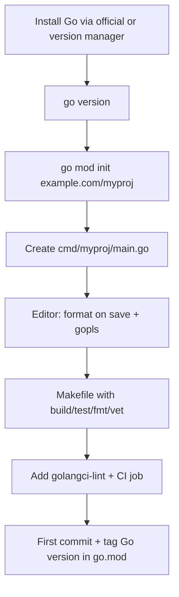

### 📖 Chapter Summary

Chapter 1 of *Learning Go* (Bodner) focuses on getting a productive, idiomatic Go development environment running. It covers installing the Go toolchain, the core `go` commands (`build`, `fmt`, `vet`), creating your first module, choosing an editor, using Makefiles for automation, the Go compatibility promise, and how to stay current.

The chapter sets the foundation: Go tooling is deliberately simple and scriptable. The goal is not just "hello world" but understanding how Go expects you to work so that later chapters on types, concurrency, and testing feel natural.

*100 Go Mistakes* (Harsanyi) does not have a dedicated "setup" chapter, but early mistakes around project organization (#12–#16) and linters (#16) are directly relevant. Many developers start with ad-hoc directories, skip formatting/linting, or misuse `init()` — problems that start at environment and project creation time.

Together the sources answer: *How do I set up Go correctly from day one so idiomatic habits become automatic?*

**Sources**

| Reference | Chapter / Section | Focus |
|-----------|-------------------|-------|
| Learning Go (Bodner) | Ch.1 — Setting Up Your Go Environment | Toolchain install, `go` commands, modules, editors, Makefiles, compatibility |
| 100 Go Mistakes (Harsanyi) | Ch.2 (esp. #12–#16) + tooling mentions | Project organization, avoiding utility packages, package naming, documentation, linters |
| Internet (2026) | Go releases, official docs, golangci-lint, workspaces | Current installation methods, `go env`, module workspace mode, vuln checking, modern editor integrations |

#### 🆕 Key New Concepts & Technologies

| **Concept / Technology** | **Short Description** | **Bodner** | **Harsanyi** | **2026** |
|:--|:--|:--|:--|:--|
| **Go module** | The unit of dependency management and build (`go.mod`) | Core of first program; `go mod init` | Indirect (project org) | Default everywhere; workspaces for multi-module |
| **go fmt / gofmt** | Canonical formatting (no config) | Run manually or via editor on save | Linting includes formatting | Still `gofmt`; editors + `golangci-lint` run it |
| **go vet** | Static checks for common bugs | Early in workflow | Complements linters | Part of `go test` + `golangci-lint` |
| **go build** | Compile package or produce binary | Basic usage shown | — | `go build -trimpath`, build tags, `-ldflags` |
| **Makefile** | Automation for common dev tasks | Recommended for real projects | Not directly discussed | Still popular; also `just`, mage, or `go run` scripts |
| **Linters** | Tools that catch style + correctness issues | Mentioned as part of healthy setup | #16 Not using linters | `golangci-lint` (with 10+ linters) is standard |
| **Compatibility promise** | Go 1.x will not break existing code | Explicitly covered | — | Still holds; plus "Go 2" strategy via new semantics (1.22+) |

#### 📊 Comparison at a Glance

| Topic | Learning Go (Bodner) Ch.1 | 100 Go Mistakes (Harsanyi) | Current practice (2026) |
|-------|---------------------------|----------------------------|-------------------------|
| **First step** | `go mod init` + simple `main.go` | Start with clean package layout early | Same + `go work` for monorepos |
| **Formatting** | `go fmt` / editor integration | Implied by linter advice | On-save + CI (`gofmt -l -s`) |
| **Static analysis** | `go vet` | #16: run linters or suffer | `go vet` + `staticcheck` + `golangci-lint` |
| **Project root** | One module per repo typically | #12 project misorganization | Clear `cmd/`, `internal/`, `api/` |
| **Automation** | Makefile for build/test | Not covered | Makefiles or task runners still common |
| **Staying current** | `go install` or distro packages | — | `go install golang.org/dl/go1.xx@latest`; version managers (`gvm`, `asdf`) |
| **Init functions** | Not recommended for most code | #3 Misusing `init()` | Almost never in application code |

---

## Part 1: Why Tooling Matters in Go

### 📌 Concepts Explained

- **Tooling is part of the language experience** — Go ships with a small, powerful, consistent set of commands. You are expected to use them.
- **No configuration for formatting** — `gofmt` style is the only style. This eliminates bike-shedding.
- **Modules replaced GOPATH** — every project declares its identity and dependencies in `go.mod`.
- **The compatibility promise** — you can upgrade the Go version with very high confidence that your code will keep compiling.

### 🔧 Bodner — The Minimal Productive Setup

Bodner walks through:

1. Installing the official Go distribution (or using a package manager).
2. Verifying with `go version`.
3. Creating a module: `go mod init example.com/myapp`
4. Writing a tiny `main.go`.
5. Using `go build`, `go fmt`, `go vet`.
6. Editor choice: VS Code (with Go extension) or GoLand are highlighted; the Playground for quick experiments.
7. Makefiles as the pragmatic way to remember the commands you actually run.

The message: make the right thing (format, vet, build) the easy thing.

### 🔧 Harsanyi — Early Organizational Debt

Although Harsanyi focuses on code-level mistakes, he warns that bad project layout and skipping linters create long-term pain:

- Starting without a clear package structure (#12)
- Creating "utils" or "helpers" packages too early (#13)
- Ignoring package name collisions (#14)
- Missing documentation (#15)
- Not running linters from the beginning (#16)

Ch.1 of Bodner is the perfect place to form the habits that prevent these.

### 📊 Diagram — Minimal Go Project After `go mod init`

```
myapp/
├── go.mod
├── go.sum          # after first dependency
├── Makefile
├── README.md
├── cmd/
│   └── myapp/
│       └── main.go
├── internal/
│   └── ...
└── .github/
    └── workflows/
        └── ci.yml
```

---

## Part 2: The Core Go Commands

### 📌 Concepts Explained

- `go build` — compiles a package or produces a binary.
- `go fmt` — formats code (alias to `gofmt -l -w` in modules).
- `go vet` — runs the Go vet tool for suspicious constructs.

### 🔧 Command Details (Bodner)

```bash
# Initialize
go mod init github.com/you/myapp

# Build a binary (creates ./myapp or myapp.exe)
go build ./cmd/myapp

# Format (usually wired to editor)
go fmt ./...

# Vet
go vet ./...

# Run tests (covered more in Ch.15)
go test ./...
```

Bodner emphasizes that these commands are fast and meant to be used constantly.

### 💻 Common 2026 Refinements

```bash
# Modern, reproducible builds
go build -trimpath -ldflags="-s -w" ./cmd/myapp

# Vet + build tags example
go vet -tags=integration ./...

# Format check in CI (fail if not formatted)
gofmt -l -s .
```

---

## Part 3: Harsanyi Pitfalls That Start at Setup Time

### 📌 Concepts Explained

Many "code" mistakes have roots in how the project was initialized.

### 🔧 Relevant Early Mistakes

- **#3 Misusing init functions** — `init()` runs automatically. Easy to hide side effects (DB connections, config loading) before `main`. Bodner’s examples avoid them.
- **#12 Project misorganization** — flat `main.go` + everything in root quickly becomes unmaintainable. Bodner shows `cmd/` + `internal/`.
- **#16 Not using linters** — `go fmt` and `go vet` are only the beginning. Without `golangci-lint` or equivalent you miss a huge class of bugs.

Harsanyi repeatedly shows that small hygiene failures early become expensive later.

### 🧪 Interview Q&A

**Q1:** What is the difference between `go fmt` and `gofmt`?

**Q2:** Why does Bodner recommend a Makefile even for small projects?

**Q3:** What is the risk of putting application code directly under the module root instead of `cmd/` + `internal/`?

**Q4:** Name two problems that `go vet` catches that the compiler does not.

**Q5:** According to Harsanyi, what is the most common reason teams end up with "utils" packages?

**Q6:** (Real-world) What does `go mod init` do, and why is it required before using most modern Go tooling and dependency management?

**Q7:** (Real-world) In a coding interview, an interviewer shows you code that runs `go build` successfully but fails `go vet`. What kinds of issues might `go vet` be catching?

> [!success]- 📋 Answers — Part 3
> **A1:** `go fmt` is the module-aware wrapper; it formats packages. `gofmt` is the underlying tool and can be used on individual files. In practice use `go fmt ./...` or let your editor call it.
>
> **A2:** It documents the exact commands the team runs (`build`, `test`, `generate`, `lint`). New contributors (and future you) don’t have to remember flags or sequences.
>
> **A3:** Everything becomes part of the public API of the module. Internal implementation details leak and you lose the protection of the `internal/` directory.
>
> **A4:** Unreachable code after `return`, struct field tags that don’t match, printf-style format mismatches, and certain nil pointer patterns.
>
> **A5:** Developers create a grab-bag for "things that don’t obviously belong anywhere else" instead of thinking about cohesion and package boundaries.
>
> **A6:** `go mod init <module-path>` creates the `go.mod` file that declares the module name and minimum Go version. Without it, you cannot use `go get`, `go mod tidy`, import paths as modules, or many other modern commands. It replaced the old GOPATH mode.
>
> **A7:** `go vet` catches issues the compiler accepts but that are likely bugs: format string/argument mismatches (e.g. `Printf` without args), struct tag problems, unreachable code, and some nil dereference patterns. `golangci-lint` + `staticcheck` catch even more.

---

## Part 4: Choosing Tools & Editor Integration

### 📌 Concepts Explained

Go works great with minimal setup. The language expects you to rely on the official tools rather than heavy frameworks.

### 🔧 Bodner Recommendations

- **VS Code + Go extension** — free, excellent, uses `gopls` (the official language server).
- **GoLand** — full-featured commercial IDE from JetBrains with deep refactoring and debugger.
- **The Go Playground** — perfect for sharing snippets and quick experiments (but remember it has limits and older Go version sometimes).

He also shows a minimal but useful `Makefile`:

```makefile
.PHONY: build test fmt vet

build:
	go build ./cmd/myapp

test:
	go test ./...

fmt:
	go fmt ./...

vet:
	go vet ./...
```

### 💻 2026 Reality

Most teams standardize on:

- Editor + `gopls` + format-on-save
- `golangci-lint` (includes `govet`, `staticcheck`, `errcheck`, `gosimple`, etc.)
- `go install golang.org/dl/go1.XX@latest` for managing multiple versions
- GitHub Actions or similar that run `go test -race ./...` and lint on every push

---

## Part 5: The Go Compatibility Promise & Staying Current

### 📌 Concepts Explained

Go promises that Go 1 programs will continue to compile and run with newer 1.x releases (with very rare documented exceptions).

Bodner explains how this promise works and why it is valuable for long-lived projects.

### 🔧 Staying Up-to-Date (Bodner + 2026)

- Use official downloads or `golang.org/dl`
- Read the release notes (they are excellent)
- Use `go list -m -versions` and `go get` carefully
- New in recent years: `go env GOWORK`, workspaces, `go list -m -u`, `govulncheck`

Harsanyi does not cover this area directly but the same principle applies: small consistent upgrades + linters beat big risky jumps.

---

## Part 6: Combined Best Practices

### 💡 Pro Tips & Best Practices (Combined)

1. Always start new projects with `go mod init` using a full module path (even for experiments).
2. Wire `go fmt` and `go vet` into your editor on save and into CI.
3. Add a `Makefile` (or equivalent) early — document the commands you actually use.
4. Put application entrypoints under `cmd/<name>/main.go`.
5. Use `internal/` aggressively to hide implementation packages.
6. Run a real linter (`golangci-lint`) from day one — don’t wait until the codebase is large.
7. Avoid `init()` functions in application code. Explicit `main()` setup is almost always clearer.
8. Pin Go version in `go.mod` (`go 1.23`) and in CI.
9. Use the Go Playground for questions and teaching, but develop real code locally.
10. Read the release notes when you upgrade the toolchain.

---

## Part 7: 2026 Snapshot — What Has Changed Since the Books

### ✅ Ahead of the books / Current strengths

| Area | Status |
|------|--------|
| Module workspaces | Mature — great for monorepos and replacing replace directives |
| `golangci-lint` | Default choice; easy to configure with `.golangci.yml` |
| Structured logging | `log/slog` (stable) — many projects moved off other loggers |
| Vulnerability checking | `govulncheck` integrated into the toolchain |
| Format & lint speed | Extremely fast even on huge repos |

### ⚠️ Gaps vs 2026 senior standards (for a brand new project)

| Gap | Risk | Priority |
|-----|------|----------|
| Relying only on `go fmt` + `go vet` | Misses many classes of bugs caught by staticcheck/errcheck | 🟡 Medium |
| No CI enforcement of formatting + lint | Inconsistent code over time | 🔴 High |
| Using `init()` for wiring | Hidden global state, hard to test, surprising order | 🔴 High |
| Flat package layout from the start | Refactoring pain later | 🟡 Medium |
| Not using `go work` when juggling multiple modules | Tedious replace directives | 🟡 Medium |

---

## Part 8: Senior Recommendations + Master Q&A

### 📊 Diagram — Recommended First-Week Setup Flow



### 🧪 Interview Q&A — Master

**Q1:** Why does Go put so much emphasis on a single canonical formatter with no configuration?

**Q2:** What problem does the `internal/` directory solve that a simple convention cannot?

**Q3:** A teammate writes a package called `utils`. What does Harsanyi say about this, and what should you do instead?

**Q4:** Explain the difference between `go build` and `go install`. When would you use each?

**Q5:** Your `init()` function opens a database connection. What can go wrong and what is the idiomatic alternative?

**Q6:** How has the story around multiple Go versions improved since 2024?

**Q7:** Name three checks that `golangci-lint` typically runs beyond `go vet`.

**Q8:** A new developer on your team skips `go fmt`. What is the long-term cost according to the philosophy in these books?

**Q9:** (Real-world interview) What is the purpose of `go mod tidy` and `go mod vendor`? When would you run them in a CI pipeline?

**Q10:** (Real-world interview) An interviewer asks: "Walk me through what happens when you run `go run main.go` in a new directory." What key steps and files are involved?

> [!success]- 📋 Answers — Part 8
> **A1:** It removes all arguments about style. The entire ecosystem looks roughly the same. This dramatically reduces cognitive load when reading other people’s Go code.
>
> **A2:** The compiler enforces that code outside the module tree cannot import packages under `internal/`. It is a hard visibility boundary, not just documentation.
>
> **A3:** Harsanyi calls these "utility packages" a common anti-pattern (#13). They become dumping grounds. Instead, create packages named after what they actually do (e.g. `validate`, `format`, `httpclient`).
>
> **A4:** `go build` compiles a package or writes a binary in the current directory. `go install` installs the binary to `$GOPATH/bin` (or `$GOBIN`) and is the modern way to install tools (`go install tool@version`).
>
> **A5:** Order of `init()` execution is hard to reason about across packages. Database connection should be created explicitly in `main()` (or a dedicated `NewStore` function) and passed via dependency injection.
>
> **A6:** `golang.org/dl` + version manager tools, plus `go work` and clearer release notes. You can easily test against multiple Go versions.
>
> **A7:** Typical enabled linters include `errcheck`, `gosimple`, `staticcheck`, `ineffassign`, `typecheck`, `unused`, `revive`, `gofumpt` (style), and many others depending on config.
>
> **A8:** The codebase slowly diverges in style. Reviews waste time on formatting. New contributors copy the inconsistent style. Automated enforcement from day one prevents the problem entirely.
>
> **A9:** `go mod tidy` cleans up `go.mod`/`go.sum` by adding missing and removing unused dependencies. `go mod vendor` (less common now) creates a `vendor/` directory for reproducible builds. In CI you typically run `go mod tidy` (and check that nothing changed) before `go test` or `go build` to ensure the module graph is clean.
>
> **A10:** It initializes module mode if needed (looks for `go.mod`), resolves the package, downloads dependencies if necessary, compiles, and runs the resulting temporary binary. Key files: `go.mod` (required), any `go.sum`, and source files. No permanent binary is left behind (unlike `go build`).

### 🔨 Hands-On Tasks

#### Task 1: Create a Clean Starting Project
**Goal:** Initialize a module with proper layout and automation.
**Files:** `cmd/myapp/main.go`, `Makefile`, `.golangci.yml` (optional)
**Steps:**
1. `go mod init github.com/yourname/myapp`
2. Create `cmd/myapp/main.go` that prints a greeting.
3. Add a Makefile with `build`, `test`, `fmt`, `vet`, `lint` targets.
4. Run `go fmt ./... && go vet ./...`
5. (Optional) Install golangci-lint and run it.
**Done when:** `make build` succeeds and `make fmt` reports nothing to change.

#### Task 2: Catch a Classic Mistake Early
**Goal:** Demonstrate one Harsanyi mistake that can be prevented at setup time.
**Files:** A small package + test
**Steps:**
1. Create a package that (incorrectly) uses an `init()` to set a global DB handle.
2. Write a test that fails or behaves strangely because of hidden state.
3. Refactor to explicit constructor.
4. Add the refactored version to your Makefile test target.
**Done when:** Tests are deterministic and you can explain why the `init()` version was fragile.

---

### 📚 Further Reading

| Resource | Topic |
|----------|-------|
| Learning Go (Bodner) Ch.2 | Predeclared types — next fundamentals |
| 100 Go Mistakes Ch.2 | Continue with #1 shadowing and project organization |
| [Go documentation — Installing Go](https://go.dev/doc/install) | Official install instructions |
| [Go documentation — Modules](https://go.dev/doc/modules/version-numbers) | How modules and versions work |
| [golangci-lint](https://golangci-lint.run/) | The standard Go linter aggregator |
| [Effective Go](https://go.dev/doc/effective_go) | Official style and idioms |
| [Go by Example](https://gobyexample.com/) | Quick annotated examples |
| [govulncheck](https://go.dev/blog/vuln) | Vulnerability detection |

*Study guide for Setting Up Your Go Environment (Ch.1), 2026.*

### 🤖 Regenerate this guide

1. [[AI Prompt/00 - General Study Guide Prompt]] — fill Inputs (Bodner = Ref 1, Harsanyi = Ref 2, Internet = Ref 3, PRIMARY = 1)
2. [[Go/AI Prompt - Go]] — append Go code/tree requirements
3. [[Go/Learning Go/AI Prompt - learning go]] — append this project prompt
