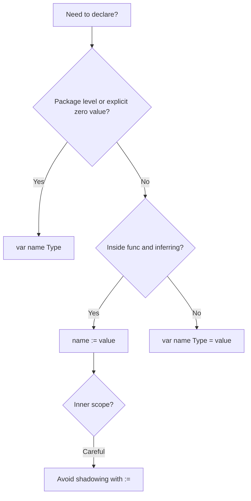

### 📖 Chapter Summary

Chapter 2 of *Learning Go* (Bodner) dives into Go’s predeclared (built-in) types and how to declare and initialize variables and constants. It emphasizes Go’s explicit zero values, the distinction between typed and untyped literals, when to use `var` vs `:=`, typed vs untyped constants, and practical naming rules. The chapter teaches developers to think about the zero value and explicitness, which are central to writing clear, bug-resistant Go.

*100 Go Mistakes* (Harsanyi) reinforces these topics with concrete pitfalls: unintended variable shadowing (#1), confusion with octal literals (#17), integer overflows (#18), and floating-point misunderstandings (#19). These mistakes frequently appear when developers are still internalizing Go’s type and declaration rules.

This chapter answers: *How do I declare and use Go’s fundamental types idiomatically, avoid subtle bugs from the start, and understand why Go makes certain choices?*

**Sources**

| Reference | Chapter / Section | Focus |
|-----------|-------------------|-------|
| Learning Go (Bodner) | Ch.2 — Predeclared Types and Declarations | Zero values, literals (typed/untyped), numeric types, bool, string/rune, `var` vs `:=`, `const`, naming, explicit conversion |
| 100 Go Mistakes (Harsanyi) | Ch.2 (#1), Ch.3 (#17–#19) | Shadowing, octal literals, overflows, floating-point gotchas |
| Internet (2026) | Go spec, Effective Go updates, `math` package, generics impact on numeric code | Modern numeric handling, `slices`/`maps` helpers (later chapters), `cmp` package |

#### 🆕 Key New Concepts & Technologies

| **Concept / Technology** | **Short Description** | **Bodner** | **Harsanyi** | **2026** |
|:--|:--|:--|:--|:--|
| **Zero value** | Default value for any declared but uninitialized variable | Core theme for every type | Implicit in many numeric/slice mistakes | Still foundational; use it deliberately |
| **Untyped literals** | Literals without explicit type until used in context | Detailed explanation | Related to #17 octal confusion | Same; powerful with constants and generics |
| **var vs :=** | Two declaration styles with different scoping and inference rules | Clear decision guide | #1 Shadowing often involves `:=` | Prefer `:=` inside functions; document intent |
| **Typed vs untyped const** | Constants can be untyped until used | Recommended pattern | Less direct coverage | Still excellent for flexibility + iota |
| **byte / rune** | Aliases: `byte` = `uint8`, `rune` = `int32` (Unicode code point) | Covered with strings | Numeric literal pitfalls | Use `rune` when you mean character |
| **Explicit conversion** | Required between most numeric types | Required for safety | Overflow risks | Same; watch for truncation |

#### 📊 Comparison at a Glance

| Topic | Learning Go (Bodner) | 100 Go Mistakes (Harsanyi) | Current practice (2026) |
|-------|----------------------|----------------------------|-------------------------|
| **Zero value** | Explicit and useful; design around it | Source of many subtle bugs when ignored | Same; document when zero value is invalid |
| **Integer literals** | Prefer base 10; use `_` for readability; avoid bare leading `0` | #17: octal confusion from leading 0 | Same + `0o777` for octal |
| **var vs :=** | `var` for package level or when type matters; `:=` inside functions | #1: shadowing via `:=` in inner scopes | `:=` dominant in functions; `var` for zero-value intent |
| **Floating point** | Use `float64` by default; never for money | #19: not understanding floating points | Same; use `decimal` modules or integers for currency |
| **Constants** | Untyped constants are powerful and flexible | Limited direct discussion | Unyped + iota for enums still preferred |

---

## Part 1: The Predeclared Types and the Zero Value

### 📌 Concepts Explained

- **Predeclared types**: Built into the language — no import needed (`bool`, numeric types, `string`, plus special names `byte`, `rune`, `int`, `uint`, `uintptr`).
- **Zero value**: Every type has a well-defined zero value. Declaring a variable without assigning gives it this value. This eliminates uninitialized-variable bugs common in C/C++.
- **Explicitness**: Go favors being explicit about types and conversions.

### 🔧 Bodner — Zero Values by Type

Bodner systematically covers the zero value for each category:

- `bool` → `false`
- Integer types (all sizes, `int`, `uint`, `byte`, `rune`) → `0`
- Floating point → `0.0` (or `0`)
- `string` → `""` (empty string)
- Complex → `0 + 0i`
- Pointers, slices, maps, channels, functions, interfaces → `nil`

The zero value is not “nothing” — it is a valid, usable value. Code should be written so that the zero value is either correct or clearly invalid (in which case you validate).

### 🔧 Why This Matters (Harsanyi Angle)

Many numeric and slice mistakes in Harsanyi stem from not accounting for the zero value or assuming a variable has been explicitly set.

### 📊 ASCII Table — Common Zero Values

```
Type          | Zero Value     | Notes
--------------|----------------|--------------------------------
bool          | false          |
int / uint*   | 0              | Use int by default
float64       | 0.0            | Never use for money
string        | ""             |
*rune / []T   | nil            | Different from empty slice ""
map[K]V       | nil            | Cannot read/write without make
```

---

## Part 2: Literals — Typed and Untyped

### 📌 Concepts Explained

- **Literal**: An explicitly written value (`42`, `3.14`, `'a'`, `"hello"`, `` `raw` ``).
- **Untyped literals**: Most literals start without a type. Go assigns a default type only when the context requires one.
- Integer literals default to `int`.
- Floating-point literals default to `float64`.
- Rune literals are untyped until assigned.

### 🔧 Bodner — Literal Forms

**Integer literals** (base 10 preferred):
```go
// Good
x := 1_234_567          // readable
y := 0xFF               // hex
z := 0o777              // octal (preferred form)

// Avoid
bad := 0777             // bare leading zero = octal, confusing (Harsanyi #17)
```

**Floating point**:
```go
f := 6.02e23
f2 := 0x1.2p3           // hex float
```

**Rune**:
```go
r := 'a'
r2 := '\n'
r3 := '\u4E2D'          // '中'
```

**String**:
```go
s := "interpreted\n"
raw := `raw
string`
```

Bodner stresses: use underscores for readability. Use `0o` / `0x` / `0b` prefixes explicitly.

### 🔧 Harsanyi — The Octal Trap (#17)

Harsanyi highlights how a leading zero without a letter prefix silently creates an octal literal:

```go
// Mistake (Harsanyi #17)
mode := 0777            // octal 511, not decimal 777

// Better
mode := 0o777
```

This is especially dangerous with file permissions or bit masks.

---

## Part 3: Numeric Types and Choosing the Right One

### 📌 Concepts Explained

Go has many numeric types for good reason: binary formats, network protocols, and performance sometimes require exact sizes.

### 🔧 Bodner Rules for Choosing Integers

1. Specific size or signedness required by format/protocol → use exact type (`int32`, `uint64`, etc.).
2. Library function that must work for any integer → use generics (Ch.8).
3. Everything else → just use `int`.

`byte` is an alias for `uint8` (use `byte` for text/bytes). `rune` is an alias for `int32` (Unicode code point).

`int` and `uint` are platform-dependent (usually 64-bit on modern machines) — never assume size without conversion.

### 🔧 Operators and Cautions

- Arithmetic: `+ - * / %` (integer division truncates toward zero)
- Bitwise: `& | ^ &^ << >>`
- Compound: `+=` etc.
- Division by zero → panic (integers) or `Inf`/`NaN` (floats)

**Floating point warning (Bodner + Harsanyi #19)**:
```go
// Never do this for money
price := 19.99
```

Use integers (cents) or a decimal library.

### 💻 Code Example — Numeric Choices

```go
// Learning Go (Bodner) style
func process(size int) { ... }           // default choice

// When you need exact size
func readHeader(r io.Reader) (magic uint32, err error) { ... }

// Harsanyi warning example
func setMode(m int) {
    // if caller passes 0777 thinking decimal...
}
```

---

## Part 4: Booleans, Strings, Runes, and Explicit Conversion

### 📌 Concepts Explained

- `bool`: only `true` / `false`. Zero value `false`.
- `string`: immutable sequence of bytes (usually UTF-8). Zero value `""`.
- `rune`: represents a Unicode code point (`int32`).

### 🔧 Bodner — Strings and Runes Preview

Bodner gives a taste here (full treatment in Ch.3/13):
```go
s := "hello"
for i, r := range s {
    fmt.Println(i, r)   // byte index, rune value
}
```

### 🔧 Explicit Type Conversion

Go requires explicit conversion between most numeric types:

```go
var x int = 10
var y int32 = int32(x)   // required
```

No implicit conversions (except untyped constants).

---

## Part 5: var vs := and Scoping

### 📌 Concepts Explained

Two ways to declare and initialize:

- `var name type = value` (or just `var name type`)
- `name := value` (short declaration — type inferred)

### 🔧 Bodner Guidance

- Use `var` at package level.
- Use `var` when you want the zero value explicitly.
- Use `:=` inside functions for most cases.
- You can only use `:=` when at least one new variable is being declared on the left.

### 🔧 Harsanyi — #1 Unintended Variable Shadowing (Critical)

This is one of the most important mistakes in the book for this chapter:

```go
// Common mistake
func main() {
    x := 10
    if true {
        x := 20          // NEW x shadows outer x!
        fmt.Println(x)   // 20
    }
    fmt.Println(x)       // 10 (surprise!)
}
```

The `:=` inside the inner block declares a **new** variable. This is extremely common with `err`, loop variables, and `if` short declarations.

**Correct pattern**:
```go
if err := doSomething(); err != nil { ... }  // scoped to if
```

Bodner and Harsanyi together teach: be deliberate about scope and declaration style.

### 🧪 Interview Q&A

**Q1:** Explain variable shadowing in Go and give a code example that demonstrates the bug.

**Q2:** (Real-world) Walk through this code. What is printed and why?
```go
func main() {
    i := 10
    if i > 5 {
        i := 20
        fmt.Println(i)
    }
    fmt.Println(i)
}
```

**Q3:** When is it safe to use `:=` inside an `if` or `for` short declaration?

> [!success]- 📋 Answers — Part 5
> **A1:** Shadowing occurs when `:=` in an inner scope declares a new variable with the same name as one in an outer scope. The outer variable is untouched. Very common source of bugs with `err` and loop vars.
>
> **A2:** Prints `20` then `10`. The inner `i := 20` creates a new `i` that shadows the outer one for the duration of the `if` block.
>
> **A3:** Safe when the short declaration is the only declaration in that scope (e.g. `if err := foo(); err != nil`). It limits the variable's lifetime and avoids accidental shadowing of outer variables.

---

## Part 6: Constants and Naming

### 📌 Concepts Explained

Constants are declared with `const`. They can be typed or (more powerfully) untyped.

### 🔧 Bodner — Untyped Constants

```go
const (
    x = 10          // untyped integer constant
    y = "hello"     // untyped string
)

var i int = x       // works
var f float64 = x   // also works
```

Untyped constants give flexibility. Typed constants are useful when you want to force a specific type.

`iota` is introduced here for creating related constants (full use often in later chapters).

### 🔧 Naming Rules (Bodner)

- Use `camelCase` (or `CamelCase` for exported).
- Acronyms are usually all-caps (`HTTP`, `URL`, `ID`).
- Short names are fine for small scopes (`i`, `r`, `f`).
- Avoid single-letter names for package-level or long-lived variables.
- Don’t stutter (`customerCustomerID` → `customerID`).

Harsanyi adds warnings about package name collisions and documentation.

---

## Part 7: 2026 Snapshot — Types & Declarations

### ✅ Ahead of the books

| Area | Status |
|------|--------|
| Numeric literal syntax | `0o`, `0b`, `_` separators well established |
| `slices` / `maps` packages | Later chapters, but reduce need for some manual numeric work |
| `cmp` package | Ordered comparison helpers (Go 1.21+) |

### ⚠️ Gaps vs 2026 senior standards

| Gap | Risk | Priority |
|-----|------|----------|
| Using `float64` for money | Precision disasters | 🔴 High |
| Relying on bare `0777` octal | Silent wrong values | 🟡 Medium |
| Shadowing with `:=` in conditionals | Very hard-to-find bugs | 🔴 High |
| Assuming `int` size | Portability / overflow on 32-bit | 🟡 Medium |

---

## Part 8: Senior Recommendations + Master Q&A

### 📊 Diagram — Declaration Decision Tree (Mermaid)



### 🧪 Interview Q&A — Master

**Q1:** What is the zero value of a `string`? Of a `[]byte`?

**Q2:** Why does Go have both `int` and `int64`?

**Q3:** Show the difference between these two blocks and explain the output:
```go
x := 10
if true {
    x := 5
    fmt.Println(x)
}
fmt.Println(x)
```

**Q4:** What is wrong with `mode := 0777` for file permissions?

**Q5:** When should you use a typed constant vs an untyped constant?

**Q6:** Why can’t you compare two `float64` values with `==` for equality in most cases?

**Q7:** What does `rune` represent and why is it an `int32`?

**Q8:** How does `:=` enable shadowing, and what is the recommended defense?

**Q9:** (Real-world) Can constants be computed at runtime in Go? Give an example of what is and is not allowed.

**Q10:** (Real-world) What is the zero value of an interface in Go, and why does it matter for error handling or nil checks?

> [!success]- 📋 Answers — Part 8
> **A1:** `string` → `""`. `[]byte` (slice) → `nil`.
>
> **A2:** `int` is the “natural” size for the platform (usually 64-bit). `int64` guarantees 64 bits. You must explicitly convert between them.
>
> **A3:** The inner `x := 5` declares a new variable that shadows the outer one. Output is `5` then `10`. Use `=` (assignment) if you meant to update the outer variable.
>
> **A4:** It is an octal literal (511 decimal). Use `0o777` for clarity (Harsanyi #17).
>
> **A5:** Untyped when you want the constant to work in multiple numeric contexts. Typed when you want to enforce a specific type (or use with `iota` for a typed set).
>
> **A6:** Floating point is approximate. Use an epsilon comparison or avoid floats for values that must be exact.
>
> **A7:** A Unicode code point. `rune` is an alias for `int32`. It lets you work with characters rather than bytes.
>
> **A8:** `:=` in an inner block can declare a new variable with the same name. Defenses: use `=` when reassigning, limit scope of short declarations, or use linters that detect shadowing.
>
> **A9:** No — constants must be known at compile time. Allowed: numeric/string/rune literals, `iota` expressions, `len`/`cap` of array literals, etc. Not allowed: `const z = x + y` where x and y are variables (runtime values).
>
> **A10:** The zero value of an interface is `nil` (typed nil vs untyped is subtle). An interface holding a nil concrete value is not equal to `nil`. This trips up error returns: `return nil, someError` vs returning a typed nil error. Always return untyped `nil` for errors when no error.

### 🔨 Hands-On Tasks

#### Task 1: Literal Hygiene + Shadowing Fix
**Goal:** Practice correct literals and spot/fix shadowing.
**Files:** `types.go` + `_test.go`
**Steps:**
1. Write a small program using `0o`, `0x`, `_` separators, and a raw string.
2. Intentionally introduce a shadowing bug with `:=` inside an `if`.
3. Add a test that would have caught the logic error.
4. Fix using proper assignment or better scoping.
**Done when:** `go test -race` passes and `go fmt ./...` is clean.

#### Task 2: Choose the Right Type
**Goal:** Apply Bodner’s three rules for integer selection.
**Steps:**
1. Write three small functions: one for a network protocol field (`uint16`), one generic-friendly, and one everyday counter using `int`.
2. Add comments explaining the choice per Bodner’s rules.
3. Write a test that demonstrates overflow behavior with a too-small type.
**Done when:** Code is readable and the comments match the rules in the book.

---

### 📚 Further Reading

| Resource | Topic |
|----------|-------|
| Learning Go (Bodner) Ch.3 | Composite Types — next major step (slices, maps, structs) |
| 100 Go Mistakes Ch.2 + Ch.3 | Continue with #2 nested code, more data type mistakes |
| [Go Spec — Numeric types](https://go.dev/ref/spec#Numeric_types) | Authoritative ranges and rules |
| [Effective Go — Names](https://go.dev/doc/effective_go#names) | Naming conventions |
| [The Floating Point Guide](https://floating-point-gui.de/) | Why floats are tricky |
| Go by Example — Constants, Variables | Quick runnable examples |

*Study guide for Predeclared Types and Declarations (Ch.2), 2026.*

### 🤖 Regenerate this guide

1. [[AI Prompt/00 - General Study Guide Prompt]] — fill Inputs (Bodner = Ref 1, Harsanyi = Ref 2, Internet = Ref 3, PRIMARY = 1)
2. [[Go/AI Prompt - Go]] — append Go code/tree requirements
3. [[Go/Learning Go/AI Prompt - learning go]] — append this project prompt
