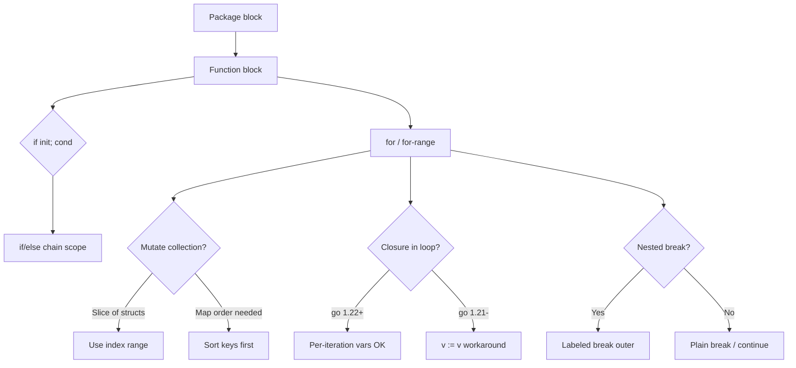

### 📖 Chapter Summary

Chapter 4 of *Learning Go* (Bodner) explains how Go organizes code with **blocks** and **scopes**, why **shadowing** happens, and how to use the language’s control structures (`if`, `for`, `switch`, `break`/`continue`, labels, and rarely `goto`). The chapter is where declaration rules from Ch.2 meet real control flow: short declarations in `if` init statements, four forms of `for`, and the subtle semantics of `for-range` over slices, maps, and strings.

*100 Go Mistakes* (Harsanyi) treats this chapter as high-impact territory: unintended variable shadowing (#1), unnecessary nested code (#2), and a cluster of range-loop traps (#30–#35) — copied elements, argument evaluation order, pointer elements, map iteration assumptions, `break` behavior in nested loops, and `defer` inside loops.
*Go in Practice* (2nd ed., Ch.2) overlaps only partially: enum-style `switch` for languages and `flag.Parse()` ordering — production patterns that sit alongside Bodner’s control-flow fundamentals, not a full replacement for them.

This chapter answers: *How does Go’s block structure shape variable lifetime, and how do I write loops and branches without the classic footguns?*

**Sources**

| Reference | Chapter / Section | Focus |
|-----------|-------------------|-------|
| Learning Go (Bodner) | Ch.4 — Blocks, Shadows, and Control Structures | Package/file/function/universe blocks, shadowing, `if` init, four `for` forms, `for-range`, `switch`, `break`/`continue`/labels, `goto`, map iteration randomization |
| 100 Go Mistakes (Harsanyi) | Ch.2 (#1–#2), Ch.4 (#30–#35) | Shadowing, flattening nested code, range-loop semantics and control-flow traps |
| Go in Practice (2nd ed.) | Ch.2 — Building a command-line application (§2.1) | Enum `switch` for languages, `flag.Parse()` order (partial overlap) |
| Internet (2026) | Go 1.22+ loop semantics, Go spec, `govulncheck`, shadow linters | Per-iteration loop variables, `go.mod` `go` directive, static analysis |

#### 🆕 Key New Concepts & Technologies

| **Concept / Technology** | **Short Description** | **Bodner** | **Harsanyi** | **Go in Practice** | **2026** |
|:--|:--|:--|:--|:--|:--|
| **Block / scope** | Lexical region where a name is visible | Package, file, function, universe blocks | #1 shadowing from inner blocks | — | Same model; linters flag shadowing |
| **Shadowing** | Inner declaration hides outer name with same identifier | `:=` in inner scopes | #1 unintended shadowing | — | `govet` shadow analyzer; explicit `=` when reassigning |
| **if init statement** | `if x := f(); x > 0 { }` limits variable lifetime | Core idiom for errors and lookups | #2 — flatten instead of deep nesting | — | Still the standard error-handling prelude |
| **for (4 forms)** | C-style, condition-only, infinite, `for-range` | All four documented | #30–#32 range pitfalls | — | Go 1.22+ per-iteration loop vars |
| **for-range copy** | Range copies slice/array elements by value | Explicit warning | #30 copied elements | — | Use index + `&s[i]` or `for i := range` when mutating |
| **Map iteration** | Order is randomized (implementation-defined) | Do not assume sorted order | #33 map iteration assumptions | — | Same; use sorted keys slice if order matters |
| **switch** | Expression or type switch; no fall-through by default | Cleaner than C `switch` | #34 break in nested loops | Ch.2 — enum `switch` for languages | `switch` still preferred over long `if` chains |
| **break / continue / labels** | Control inner vs outer loops | Labels for clarity | #34 break only exits innermost loop | — | Prefer labels or refactor over `goto` |
| **goto** | Rare; jumps within function | Mentioned as last resort | — | — | Avoid except generated code / rare cleanup |
| **Loop variable semantics** | One variable per iteration vs shared | Go 1.22 change noted | #30–#32 historically required `v := v` | — | Controlled by `go` directive in `go.mod` |

#### 📊 Comparison at a Glance

| Topic | Learning Go (Bodner) | 100 Go Mistakes (Harsanyi) | Go in Practice (2nd ed.) Ch.2 | Current practice (2026) |
|-------|----------------------|----------------------------|-------------------------------|-------------------------|
| **Blocks** | Lexical scopes nest predictably | #1 shadowing via `:=` | — | Enable `shadow` / `govet` checks in CI |
| **if init** | Scope limited to `if`/`else` chain | #2 reduce nesting with early return | — | `if err := fn(); err != nil` everywhere |
| **Nested depth** | Keep branches shallow | #2 unnecessary nested code | — | Guard clauses + `continue`/`break` |
| **C-style for** | `for i := 0; i < n; i++` | — | — | Same; prefer `for i := range` when index-only |
| **for-range slices** | Copies element value | #30 mutation fails on value copy | — | Index or pointer to element when mutating |
| **for-range maps** | Random iteration order | #33 never assume order | — | Collect keys, `slices.Sort`, then iterate |
| **for-range strings** | Index = byte offset, value = rune | Related string mistakes in Ch.5 | — | `for _, r := range s` for runes; mind byte indices |
| **break in nested loops** | Labels disambiguate target | #34 `break` only inner loop | — | Named labels or extract function |
| **defer in loop** | Deferred calls stack until function exit | #35 defer inside loops | — | Call cleanup inline or wrap loop body in func |
| **Enum dispatch** | `switch` on constants | — | `switch userLanguage { case English: ... }` | `switch` + `slices.Contains` validation |
| **Loop variables** | Go 1.22 per-iteration semantics | #31–#32 closure/range bugs | — | Set `go 1.22` in `go.mod`; no `v := v` hack |

---

## Part 1: Blocks & Shadowing Philosophy

### 📌 Concepts Explained

Go is organized into **lexical blocks**. A block is the set of declarations between matching `{` and `}`.

Bodner describes four block levels:

| Block | Scope | Examples |
|-------|-------|----------|
| **Universe** | Entire program | Predeclared identifiers (`int`, `len`, `true`) |
| **Package** | All files in one package | Package-level `var`, `const`, `func`, `type` |
| **File** | One `.go` file | `import` names |
| **Function** | One function body | Parameters, locals, inner blocks (`if`, `for`) |

**Shadowing** occurs when an inner block declares a name that already exists in an outer block. The inner name **hides** the outer one for the duration of the inner block. The outer variable is unchanged.

Go’s philosophy: **short lifetimes reduce bugs**. Blocks exist so you can limit how long a name is visible. Shadowing is a feature of lexical scoping — but accidental shadowing (especially with `err`) is one of Go’s most common logic bugs.

### 🔧 Bodner — Blocks Create Scope

```go
package main

import "fmt"

var x = 10 // package block

func main() { // function block
    x := 20 // shadows package x inside main only
    fmt.Println(x) // 20

    if x > 15 { // if block
        x := 30 // shadows main's x
        fmt.Println(x) // 30
    }
    fmt.Println(x) // 20 — inner if x is gone
}
```

The `:=` operator **declares** when at least one new name appears on the left. That is the root of most shadowing.

### 🔧 Harsanyi — #1 Unintended Variable Shadowing

```go
// Learning Go (Bodner) — recommended: scope err to the if
if err := save(); err != nil {
    return err
}

// Common mistake (Harsanyi #1) — outer err never assigned
var err error
if err := save(); err != nil { // NEW err shadows outer err
    log.Println(err)
}
return err // always nil!

// Go in Practice (2nd ed.) — no direct recipe for shadowing
// —

// 2026 senior standard — enable govet shadow; use = when reassigning
err = save() // assignment, not declaration
if err != nil {
    return err
}
```

**Defenses:**
- Use `=` when you mean to update an existing variable.
- Keep short declarations in the smallest scope (`if` init, inner `for`).
- Run `go vet` / `staticcheck` with shadow checks in CI.

### 🧪 Interview Q&A

**Q1:** Name the four block levels Bodner describes and give an example of each.

**Q2:** (Real-world) What prints from this code and why?
```go
count := 0
for i := 0; i < 3; i++ {
    count := count + 1 // shadow
    fmt.Println(count)
}
fmt.Println(count)
```

> [!success]- 📋 Answers — Part 1
> **A1:** Universe (predeclared `int`), package (`var x`), file (`import "fmt"`), function (`func main` locals and inner `if`/`for` blocks).
>
> **A2:** Prints `1`, `2`, `3`, then `0`. The inner `count :=` declares a new variable each iteration; the outer `count` stays `0`. Use `count = count + 1` or `count++` to update the outer variable.

---

## Part 2: if/else Scoping — The Init Statement Pattern

### 📌 Concepts Explained

Go’s `if` can include an **init statement** before the condition:

```go
if init; condition {
    // body
} else if condition2 {
    // ...
} else {
    // ...
}
```

Variables declared in the init statement are scoped to the **entire** `if`/`else if`/`else` chain — including `else` branches. This is deliberate: the variable exists only for the decision and its branches.

### 🔧 Bodner — Init Statement Idioms

```go
// Comma-ok with maps (from Ch.3, used in control flow)
if val, ok := m["key"]; ok {
    fmt.Println(val)
}

// Error check — most common init pattern
if err := doWork(); err != nil {
    return fmt.Errorf("doWork: %w", err)
}

// Limit expensive work to the branch that needs it
if f, err := os.Open(path); err != nil {
    return err
} else {
    defer f.Close()
    // use f
}
```

The init statement keeps `err`, `ok`, and temporary values from polluting the surrounding function.

### 🔧 Harsanyi — #2 Unnecessary Nested Code

Deep `if` nesting hurts readability. Harsanyi recommends **guard clauses** (early return/continue) and init statements to flatten logic:

```go
// Learning Go (Bodner) — flat with init + early return
func process(path string) error {
    f, err := os.Open(path)
    if err != nil {
        return err
    }
    defer f.Close()

    if stat, err := f.Stat(); err != nil {
        return err
    } else if stat.IsDir() {
        return fmt.Errorf("%s is a directory", path)
    }
    // happy path at low indentation
    return nil
}

// Common mistake (Harsanyi #2) — arrow of doom
func processBad(path string) error {
    f, err := os.Open(path)
    if err == nil {
        if stat, err := f.Stat(); err == nil {
            if !stat.IsDir() {
                // deeply nested happy path
            }
        }
    }
    return nil
}

// Go in Practice (2nd ed.) — —
// —

// 2026 senior standard — same flattening; pair with structured errors
```

### 🧪 Interview Q&A

**Q1:** What is the scope of a variable declared in an `if` init statement?

**Q2:** Show the comma-ok idiom inside an `if` init for a map lookup.

> [!success]- 📋 Answers — Part 2
> **A1:** The entire `if`/`else if`/`else` chain. It is not visible before the `if` or after the closing brace.
>
> **A2:** `if v, ok := m[key]; ok { /* use v */ }`.

---

## Part 3: Harsanyi Pitfalls — Range & Control Flow (#1, #2, #30–#35)

### 📌 Concepts Explained

Harsanyi groups the most damaging control-structure mistakes around **range loops** and **misunderstood control transfer**. Bodner covers the mechanics; Harsanyi shows what breaks in production.

| Mistake | Core issue |
|---------|------------|
| **#1** Shadowing | `:=` in inner scope hides outer variable |
| **#2** Nested code | Deep `if` ladders obscure happy path |
| **#30** Copied elements | `for-range` copies slice/array element by value |
| **#31** Argument evaluation | Range expression evaluated once; loop vars reused pre-1.22 |
| **#32** Pointer elements | Taking address of range value copies into same slot |
| **#33** Map iteration | Order is random; not stable across runs |
| **#34** Break behavior | `break` exits only the innermost `for`/`switch`/`select` |
| **#35** Defer in loop | `defer` runs at **function** exit, not iteration end |

### 🔧 #30 — Elements Copied in Range Loops

```go
type Person struct{ Name string }

people := []Person{{"Alice"}, {"Bob"}}

// Learning Go (Bodner) — mutate via index
for i := range people {
    people[i].Name = strings.ToUpper(people[i].Name)
}

// Common mistake (Harsanyi #30) — p is a copy
for _, p := range people {
    p.Name = strings.ToUpper(p.Name) // mutates copy only
}

// Go in Practice (2nd ed.) — —
// —

// 2026 senior standard — index range or pointer slice
for i := range people {
    people[i].Name = strings.ToUpper(people[i].Name)
}
```

### 🔧 #31–#32 — Argument Evaluation & Pointer Elements

```go
// #31: range expression evaluated once
data := []int{1, 2, 3}
for i, v := range data {
    _ = i
    data = append(data, 99) // can affect iteration (Bodner warns)
    _ = v
}

// #32: address of range variable
var ptrs []*int
nums := []int{10, 20, 30}
for _, n := range nums {
    ptrs = append(ptrs, &n) // all pointers may point at same stack slot
}

// Learning Go (Bodner) / 2026 fix
for i := range nums {
    ptrs = append(ptrs, &nums[i])
}
```

### 🔧 #33 — Map Iteration Assumptions

```go
m := map[string]int{"b": 2, "a": 1, "c": 3}

// Common mistake (Harsanyi #33) — assuming sorted output
for k, v := range m {
    fmt.Println(k, v) // order varies between runs
}

// Learning Go (Bodner) / 2026 — collect keys, sort, iterate
keys := make([]string, 0, len(m))
for k := range m {
    keys = append(keys, k)
}
slices.Sort(keys)
for _, k := range keys {
    fmt.Println(k, m[k])
}
```

### 🔧 #34 — Break Behavior

```go
// Common mistake (Harsanyi #34) — break only exits inner loop
outer:
for i := 0; i < 3; i++ {
    for j := 0; j < 3; j++ {
        if i*j > 2 {
            break // exits j loop only, not i
        }
    }
}

// Learning Go (Bodner) — labeled break
outer:
for i := 0; i < 3; i++ {
    for j := 0; j < 3; j++ {
        if i*j > 2 {
            break outer
        }
    }
}
```

### 🔧 #35 — Defer Inside Loops

```go
// Common mistake (Harsanyi #35) — all defers run at function return
func processAll(paths []string) error {
    for _, path := range paths {
        f, err := os.Open(path)
        if err != nil {
            return err
        }
        defer f.Close() // stacks N defers; files stay open until func ends
    }
    return nil
}

// Learning Go (Bodner) / 2026 — inline close or helper function
func processOne(path string) error {
    f, err := os.Open(path)
    if err != nil {
        return err
    }
    defer f.Close()
    // work
    return nil
}

for _, path := range paths {
    if err := processOne(path); err != nil {
        return err
    }
}
```

---

## Part 4: for Loops — All Four Forms

### 📌 Concepts Explained

Go has **one** loop keyword: `for`. Bodner documents four forms:

| Form | Syntax | Use case |
|------|--------|----------|
| **C-style** | `for init; cond; post { }` | Classic counted loop |
| **Condition-only** | `for condition { }` | Like `while` in other languages |
| **Infinite** | `for { }` | Event loops; exit with `break`/`return` |
| **for-range** | `for k, v := range x { }` | Slices, arrays, maps, strings, channels |

There is no `do-while`, `foreach` keyword, or `while` keyword.

### 🔧 Bodner — Four Forms in Code

```go
// 1. C-style
for i := 0; i < 10; i++ {
    fmt.Println(i)
}

// 2. Condition-only (while-style)
n := 1
for n < 100 {
    n *= 2
}

// 3. Infinite with break
for {
    if done() {
        break
    }
}

// 4. for-range (see Part 5 for edge cases)
for i, v := range []int{1, 2, 3} {
    fmt.Println(i, v)
}
```

### 🔧 Go in Practice — Ch.2: Enum Switch After Flags (partial)

GiP Ch.2 validates a language flag, then dispatches with `switch` — a control-structure pattern that pairs with Bodner’s `for`/`switch` chapter:

```go
// Learning Go (Bodner) — switch on typed constants
type language string

const (
    English language = "en"
    Spanish         = "sp"
)

switch userLanguage {
case English:
    fmt.Println("Hello")
case Spanish:
    fmt.Println("Hola")
default:
    log.Fatalf("unknown language %q", userLanguage)
}

// Common mistake (Harsanyi #2) — nested if-else chain
if userLanguage == English {
    // ...
} else if userLanguage == Spanish {
    // ...
} else {
    // ...
}

// Go in Practice (2nd ed.) Ch.2 — flag.Parse() before reading flag values
flag.StringVar(&userLanguage, "lang", "en", "language")
flag.Parse() // must run before *lang or userLanguage is read

// 2026 senior standard — validate with slices.Contains before switch
if !slices.Contains([]string{"en", "sp", "fr", "de"}, string(userLanguage)) {
    log.Fatalf("invalid language")
}
```

### 🧪 Interview Q&A

**Q1:** List Bodner’s four `for` forms. Which is Go’s equivalent of `while`?

**Q2:** When would you use an infinite `for` loop instead of `for range`?

> [!success]- 📋 Answers — Part 4
> **A1:** C-style, condition-only, infinite, for-range. Condition-only (`for cond`) is the `while` equivalent.
>
> **A2:** Event loops, servers, channel receivers (`for { select { ... } }`), or when termination is not tied to a collection’s length.

---

## Part 5: for-range Edge Cases — Maps, Strings, Copy Behavior

### 📌 Concepts Explained

`for-range` is deceptively simple. Bodner highlights edge cases that Harsanyi (#30–#33) turns into production bugs.

**Slices and arrays:**
- Iteration is by **index** and **value**.
- The value is a **copy** of the element (for slices/arrays of structs, mutating `v` does nothing to the slice).
- You may omit index or value: `for i := range s`, `for _, v := range s`, `for range s`.

**Maps:**
- Iteration order is **randomized** (intentionally, for security/fairness).
- If you delete a key not yet reached, it won’t appear. If you add keys during iteration, they **may or may not** appear in the current pass.

**Strings:**
- `for i, r := range s` — `i` is the **byte index** of the rune’s first byte; `r` is the **rune** (Unicode code point).
- A single “character” may span multiple bytes; indices skip by rune width, not by 1.

**Channels:**
- `for v := range ch` receives until the channel is closed.

### 🔧 Bodner — Copy Behavior & String Iteration

```go
// Slice: value is copied
nums := []int{1, 2, 3}
for _, v := range nums {
    v *= 10 // does not change nums
}

// String: byte index + rune
s := "a🙂b"
for i, r := range s {
    fmt.Printf("byte=%d rune=%q\n", i, r)
}
// byte=0 rune='a'
// byte=1 rune='🙂'  (3-byte UTF-8 sequence)
// byte=4 rune='b'

// Map: random order
for k, v := range map[string]int{"x": 1, "y": 2} {
    fmt.Println(k, v)
}
```

### 🔧 Four-Way Comparison — Range Mutation

```go
// Learning Go (Bodner) — correct slice mutation
for i := range items {
    items[i].Active = true
}

// Common mistake (Harsanyi #30)
for _, item := range items {
    item.Active = true
}

// Go in Practice (2nd ed.) — —
// —

// 2026 senior standard — Go 1.22: loop vars are per-iteration (see Part 7)
for _, item := range items {
    item.Active = true // still a copy of struct value — index fix still required
}
```

**Important:** Go 1.22 fixes **loop variable reuse across iterations** (closures/goroutines), but it does **not** change the fact that `for-range` over slices copies element **values**.

### 🧪 Interview Q&A

**Q1:** Does `for _, v := range slice` let you mutate slice elements in place? Why or why not?

**Q2:** (Real-world) You need deterministic map output for a CLI report. What do you do?

> [!success]- 📋 Answers — Part 5
> **A1:** No for struct elements — `v` is a copy. For `[]int`, `v` is a copy of the int (assigning to `v` does not update the slice). Use index: `slice[i] = ...`.
>
> **A2:** Extract keys into a `[]string`, sort with `slices.Sort`, iterate keys and look up values. Never rely on map iteration order.

---

## Part 6: switch, break/continue, Labels, and goto

### 📌 Concepts Explained

**switch** in Go is safer than C:
- Cases **do not fall through** by default (no accidental cascade).
- Use `fallthrough` explicitly when you want the next case to run.
- Two forms: **expression switch** (`switch x { case 1: }`) and **type switch** (`switch v := x.(type)`).
- A **switch with no expression** (`switch { case x > 0: }`) is a clean alternative to long `if-else` chains.

**break** exits the innermost `for`, `switch`, or `select`. **continue** skips to the next iteration of the innermost `for`.

**Labels** name a loop or switch so `break label` / `continue label` target an outer construct.

**goto** jumps to a label in the same function. Bodner and modern style guides treat it as a last resort — prefer refactor, helper functions, or labeled `break`.

### 🔧 Bodner — switch and Control Transfer

```go
// Expression switch — no fall-through
switch day := time.Now().Weekday(); day {
case time.Saturday, time.Sunday:
    fmt.Println("weekend")
default:
    fmt.Println("weekday")
}

// Tagless switch (if-else replacement)
switch {
case score >= 90:
    grade = "A"
case score >= 80:
    grade = "B"
default:
    grade = "F"
}

// Type switch
switch v := anyValue.(type) {
case int:
    fmt.Println("int", v)
case string:
    fmt.Println("string", v)
default:
    fmt.Printf("unknown %T\n", v)
}

// Labeled break (Harsanyi #34 fix)
Search:
for x := 0; x < len(grid); x++ {
    for y := 0; y < len(grid[x]); y++ {
        if grid[x][y] == target {
            break Search
        }
    }
}
```

### 🔧 Go in Practice — Enum switch (Ch.2)

```go
// Learning Go (Bodner) — switch on constants
switch lang {
case English, Spanish, French:
    greet(lang)
default:
    return fmt.Errorf("unsupported: %s", lang)
}

// Common mistake — stringly-typed if ladder without default handling
if lang == "en" { /* ... */ } else if lang == "sp" { /* ... */ }

// Go in Practice (2nd ed.) Ch.2 — switch after flag.Parse + validation
flag.Parse()
switch userLanguage {
case English:
    fmt.Println("Hello")
case Spanish:
    fmt.Println("Hola")
}

// 2026 senior standard — exhaustive switch with typed consts + compiler-friendly default
```

### 🔧 goto — Rare but Legal

```go
// Bodner: goto allowed within function; cannot jump into new scopes
func cleanup() error {
    f, err := os.Open("data.txt")
    if err != nil {
        return err
    }
    defer f.Close()

    // Prefer labeled break or helper over goto in application code
    // goto is occasionally seen in generated parsers or error cleanup
    return nil
}
```

Senior guidance: if you reach for `goto`, first try labeled `break`, extract a function, or use `defer` in a small helper (watch #35).

### 🧪 Interview Q&A

**Q1:** Does Go’s `switch` fall through to the next case by default?

**Q2:** How do you break out of an outer loop from a nested loop?

> [!success]- 📋 Answers — Part 6
> **A1:** No. Each case runs only its statements unless you use `fallthrough`.
>
> **A2:** Use a label on the outer loop and `break OuterLabel`, or refactor the inner loop into a function that returns a bool.

---

## Part 7: 2026 Snapshot — Control Structures

### ✅ Ahead of the books

| Area | Bodner / Harsanyi / GiP | 2026 status |
|------|-------------------------|-------------|
| Loop variable semantics | Bodner notes Go 1.22; Harsanyi #31–#32 pre-1.22 workarounds | Per-iteration `i`, `v` by default when `go 1.22+` in `go.mod` |
| `go` directive | — | `go 1.22` (or later) opts into new loop semantics project-wide |
| Shadow detection | Harsanyi #1 | `go vet -shadow` (via analysis tools), `staticcheck`, `golangci-lint` shadow linter |
| Map sorting | Bodner + Harsanyi #33 | `slices.Sort` on keys slice (Go 1.21+) |
| Enum validation | GiP Ch.2 `slices.Contains` | Still standard before `switch` dispatch |
| Security scanning | — | `govulncheck` in CI alongside linters |

### ⚠️ Gaps vs 2026 senior standards

| Gap | Risk | Priority |
|-----|------|----------|
| Code compiled with `go 1.21` semantics | Closure/range bugs resurrect | 🔴 High |
| Mutating `for _, v := range` struct slice | Silent no-op mutations | 🔴 High |
| Assuming map iteration order | Flaky tests, wrong reports | 🔴 High |
| `defer` inside loops | File/socket leaks until func returns | 🟡 Medium |
| Deep nested `if` instead of guard clauses | Unmaintainable error paths | 🟡 Medium |

### 🔧 Go 1.22 Loop Variables — Before and After

```go
// Pre-Go 1.22 (or go.mod: go 1.21) — shared loop variable
funcs := []func(){}
for _, v := range []int{1, 2, 3} {
    funcs = append(funcs, func() { fmt.Println(v) }) // all print 3
}

// Workaround (Harsanyi #31 era)
for _, v := range []int{1, 2, 3} {
    v := v // shadow per iteration
    funcs = append(funcs, func() { fmt.Println(v) })
}

// 2026 — go.mod: go 1.22 (or later)
// Each iteration gets fresh i, v — no shadow hack needed
for _, v := range []int{1, 2, 3} {
    funcs = append(funcs, func() { fmt.Println(v) }) // 1, 2, 3
}
```

Set the directive explicitly:

```go
// go.mod
module example.com/app

go 1.22
```

Tooling to adopt:
```bash
go vet ./...
govulncheck ./...
golangci-lint run --enable=govet,staticcheck
```

---

## Part 8: Senior Recommendations + Master Q&A

### 📊 Diagram — Block Nesting & Control Flow (Mermaid)



### 🧪 Interview Q&A — Master

**Q1:** Explain the four block levels in Go and how shadowing interacts with `:=`.

**Q2:** What is the scope of a variable declared in an `if` init statement?

**Q3:** (Real-world) Why does this fail to uppercase names, and how do you fix it?
```go
people := []Person{{"alice"}, {"bob"}}
for _, p := range people {
    p.Name = strings.ToUpper(p.Name)
}
```

**Q4:** What changed about loop variables in Go 1.22, and how does `go.mod` control it?

**Q5:** Why is iterating a map with `for k, v := range m` unsuitable for sorted output?

**Q6:** What is the difference between `break` and `break Outer` in nested loops?

**Q7:** Why is `defer f.Close()` inside a `for` loop over files dangerous?

**Q8:** When iterating `for i, r := range "a🙂b"`, what do `i` and `r` represent?

> [!success]- 📋 Answers — Part 8
> **A1:** Universe, package, file, and function blocks. Inner blocks (`if`, `for`) nest inside function blocks. `:=` declares a new variable when any name on the left is new, which can shadow an outer name without modifying it.
>
> **A2:** The entire `if`/`else if`/`else` chain. Not visible outside that statement.
>
> **A3:** `p` is a copy of each `Person` struct. Fix: `for i := range people { people[i].Name = strings.ToUpper(people[i].Name) }`.
>
> **A4:** Go 1.22 creates a distinct loop variable per iteration (fixes closure bugs). The `go` directive in `go.mod` selects language version semantics; set `go 1.22` or later to use per-iteration variables.
>
> **A5:** Map iteration order is intentionally randomized and unstable. Collect keys, sort, then look up values.
>
> **A6:** Plain `break` exits only the innermost `for`/`switch`/`select`. `break Outer` exits the labeled outer loop.
>
> **A7:** All `defer` calls stack and run when the **function** returns, not each iteration. Files stay open until the function ends — use per-iteration helper with its own `defer` or close explicitly.
>
> **A8:** `i` is the byte offset in the UTF-8 string where the rune starts. `r` is the Unicode code point (rune). Multi-byte runes advance `i` by more than 1.

### 🔨 Hands-On Tasks

#### Task 1: Shadowing Detective + Flatten Nested Logic
**Goal:** Reproduce Harsanyi #1 and #2 bugs, then fix with Bodner idioms.
**Files:** `control_shadow_test.go`
**Steps:**
1. Write a function where `var err error` and `if err := work(); err != nil` leaves outer `err` nil — add a test that fails.
2. Fix using assignment (`err = work()`) or by returning inside the `if`.
3. Rewrite a 4-level nested `if` ladder as guard clauses with early `return`.
4. Enable `go vet` on the package and confirm no shadow warnings remain.
**Done when:** Tests pass, nesting depth ≤ 2 on the happy path, and `go vet ./...` is clean.

#### Task 2: Range Gotchas + Go 1.22 Loop Semantics
**Goal:** Demonstrate #30–#35 and the Go 1.22 closure fix.
**Files:** `range_demo_test.go`
**Steps:**
1. Show struct slice mutation failing with `for _, v := range` and fix with index.
2. Build `[]func()` in a loop printing values — verify behavior matches your `go.mod` `go` directive.
3. Iterate a map twice; assert order can differ (or sort keys for stable test).
4. Write nested loops where plain `break` fails; fix with a label.
5. Compare `defer` in loop vs per-file helper function using `t.TempDir()` and open files.
**Done when:** All tests document expected behavior in comments and pass on `go 1.22+`.

---

### 📚 Further Reading

| Resource | Topic |
|----------|-------|
| Learning Go (Bodner) Ch.5 | Functions — closures, defer, variadic (builds on control flow) |
| 100 Go Mistakes (Harsanyi) Ch.4 | Full #30–#35 range/control coverage |
| 100 Go Mistakes (Harsanyi) Ch.2 | #1 shadowing, #2 nested code (cross-ref Ch.2 guide) |
| Go in Practice (2nd ed.) Ch.2 | CLI flags, enum `switch`, `flag.Parse()` ordering |
| [Go Spec — Blocks](https://go.dev/ref/spec#Blocks) | Authoritative scope rules |
| [Go Spec — For statements](https://go.dev/ref/spec#For_statements) | All four loop forms |
| [Go 1.22 Release Notes — Loop var change](https://go.dev/doc/go1.22) | Per-iteration semantics |
| [Effective Go — Control structures](https://go.dev/doc/effective_go#control-structures) | Official idioms |
| [Go Blog — Loopvar experiment](https://go.dev/blog/loopvar-preview) | Rationale for Go 1.22 change |

*Study guide for Blocks, Shadows, and Control Structures (Ch.4), 2026.*

### 🤖 Regenerate this guide

1. [[AI Prompt/00 - General Study Guide Prompt]] — fill Inputs (Bodner = Ref 1, Harsanyi = Ref 2, Internet = Ref 3, PRIMARY = 1; supplement = Go in Practice PDF)
2. [[Go/AI Prompt - Go]] — append Go code/tree requirements
3. [[Go/Learning Go/AI Prompt - learning go]] — append this project prompt (four-column tables: Bodner | Harsanyi | Go in Practice | 2026)