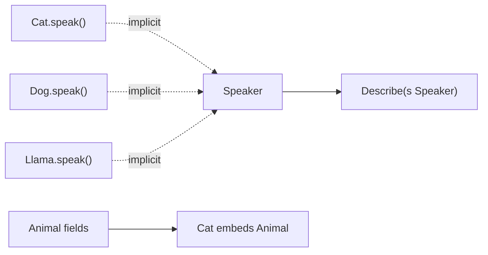

### 📖 Chapter Summary

Chapter 7 of *Learning Go* (Bodner) is Go’s answer to OOP: **named types**, **methods** (value vs pointer receivers), **embedding** for composition, and **interfaces** for polymorphism without inheritance. Bodner stresses that Go has no classes or subclassing — behavior attaches to types via methods, and contracts are satisfied **implicitly** at compile time. The chapter covers producer-side interface design, the empty interface (`any`), type assertions, type switches, how **function types** can satisfy interfaces, and **typed constants** with `iota`.

*100 Go Mistakes* (Harsanyi) warns against interface over-engineering: interface pollution (#5), defining interfaces on the consumer side instead of the producer (#6), returning interfaces from constructors (#7), overusing `any` (#8), embedding footguns (#10), and notes **functional options** (#11) as a related constructor pattern.
*Go in Practice* (2nd ed., Ch.3) applies these ideas in production: the `Animal` interface with `Cat`/`Dog`/`Llama`, implicit implementation, `NewCat()` factories, JSON struct tags on exported fields, and composition over classical OOP inheritance.

This chapter is where Go’s “accept interfaces, return structs” philosophy becomes concrete — and where misuse of `any` or bloated interfaces creates unmaintainable APIs.

**Sources**

| Reference | Chapter / Section | Focus |
|-----------|-------------------|-------|
| Learning Go (Bodner) | Ch.7 — Types, Methods, and Interfaces | Type declarations, methods, embedding, interfaces, `any`, assertions, type switches, function types, `iota` |
| 100 Go Mistakes (Harsanyi) | Ch.2 #5–#8, #10–#11 | Interface pollution, producer-side, returning interfaces, `any`, embedding, functional options |
| Go in Practice (2nd ed.) | Ch.3 — Structs, interfaces, and generics | `Animal` pattern, Cat/Dog/Llama, `NewCat()`, JSON tags, OOP vs composition |
| Internet (2026) | Effective Go, generics (Go 1.18+) | Small interfaces, accept interfaces/return structs, generics vs reflection |

#### 🆕 Key New Concepts & Technologies

| **Concept / Technology** | **Short Description** | **Bodner** | **Harsanyi** | **Go in Practice** | **2026** |
|:--|:--|:--|:--|:--|:--|
| **Type declaration** | `type Name underlying` creates distinct named type | `type Celsius float64` | — | Struct types for domain models | Same; use for domain safety |
| **Methods** | Functions with receivers: `func (r T) M()` | Value vs pointer receivers | #42 (Ch.6) receiver choice | `(a Animal) speak()` | Pointer when mutating; value when small/immutable |
| **Embedding** | Anonymous struct field promotes fields/methods | Composition over inheritance | #10 embedding problems | Composition vs OOP inheritance | Prefer named fields for mutexes/sync types |
| **Interfaces** | Method set = contract; implicit satisfaction | Producer-side design | #5–#7 interface mistakes | `Animal` + `speak()` pattern | Keep interfaces small (1–3 methods) |
| **`any` / empty interface** | `interface{}` alias; holds any value | Type assertions required to use | #8 `any` says nothing | Avoid unless truly dynamic | Prefer generics or concrete types |
| **Type assertion** | `v, ok := i.(T)` extracts concrete type | Single-value and comma-ok forms | — | — | Always comma-ok unless panic OK |
| **Type switch** | `switch v := i.(type)` dispatches on dynamic type | Cleaner than assertion chains | — | — | Still idiomatic for multi-type dispatch |
| **Function types → interfaces** | Func with matching signature satisfies interface | `Adder` pattern | — | — | Same; used in `http.HandlerFunc` |
| **`iota` + typed constants** | Enumerations with distinct constant types | `type Status int` + `iota` | — | Ch.2 enums preview | `String()` via `go:generate stringer` |

#### 📊 Comparison at a Glance

| Topic | Learning Go (Bodner) | 100 Go Mistakes (Harsanyi) | Go in Practice (2nd ed.) Ch.3 | Current practice (2026) |
|-------|----------------------|----------------------------|-------------------------------|-------------------------|
| **Type declarations** | Named types are distinct from underlying | — | Domain structs + JSON tags | Use for units, IDs, status enums |
| **Methods / receivers** | Value copies; pointer mutates | #42 value vs pointer | `(a Animal) speak()` read-only | Pointer receiver when mutating |
| **Embedding** | Promoted fields/methods | #10 mutex embedding leaks API | Composition over inheritance | Named `mu sync.Mutex` field |
| **Interfaces** | Implicit; define at producer | #5 pollution, #6 consumer-side | `Animal` interface pattern | 1–2 method interfaces |
| **Return types** | Prefer concrete structs | #7 don’t return interfaces | `NewCat()` returns `*Animal` | Accept interfaces, return structs |
| **`any`** | Escape hatch for unknown types | #8 overuse hides contracts | Rare in GiP examples | Generics replace many `any` uses |
| **Type assertions** | `v, ok := i.(T)` | — | — | Comma-ok; type switch for many types |
| **Function types** | Satisfy interfaces with same signature | — | — | `http.HandlerFunc`, middleware |
| **Constants** | `iota` + typed enums | — | Flag/enum patterns in Ch.2 | `stringer`, exhaustive switches |

---

## Part 1: Type Declarations and Named Types

### 📌 Concepts Explained

- A **type declaration** creates a new named type with the same underlying representation: `type UserID int` is not interchangeable with `int` without conversion.
- Named types enable **method attachment** — only types declared in your package (or based on local types) can have new methods.
- Type declarations document intent: `Celsius` vs `Fahrenheit` both underlying `float64` but are not assignable to each other without `Celsius(f)`.
- Struct types are the primary way to group data; methods add behavior without classes.

### 🔧 Bodner — Named Types and Method Attachment

```go
// Learning Go (Bodner) — distinct named types; methods on local types only
type Celsius float64
type Fahrenheit float64
// f = c // compile error — distinct types even if both are float64

func (c Celsius) String() string { return fmt.Sprintf("%.1f°C", c) }

type MyInt int
func (m MyInt) Double() MyInt { return m * 2 }
```

### 🔧 Go in Practice — Domain Struct with Exported Fields

```go
// Go in Practice (2nd ed.) Ch.3 — exported fields + JSON tags
type Animal struct {
    Name           string  `json:"animal_name"`
    ScientificName string  `json:"scientific_name"`
    Weight         float32 `json:"animal_average_weight"`
}
```

---

## Part 2: Methods — Value vs Pointer Receivers

### 📌 Concepts Explained

- A **method** is a function with a **receiver**: `func (r ReceiverType) MethodName(args) returns`.
- **Value receiver** `(t T)` — operates on a copy; mutations do not affect the caller’s value.
- **Pointer receiver** `(t *T)` — operates on the original; mutations persist; avoids copying large structs.
- Go automatically takes address or dereferences when calling methods — `p.Inc()` works whether `p` is `T` or `*T` (unless `T` is already a pointer type).
- **Consistency rule:** if any method on `T` needs a pointer receiver, most teams use pointer receivers for all methods on `T`.
- **Nil receiver:** pointer-receiver methods can be called on `nil` if the method guards against nil (Harsanyi #45 preview).

### 🔧 Bodner / GiP / Harsanyi — Receivers

```go
// Learning Go (Bodner) — value read, pointer mutate
type Counter struct{ n int }
func (c Counter) Value() int { return c.n }
func (c *Counter) Inc()     { c.n++ }

// Go in Practice (2nd ed.) Ch.3 — value receiver read-only
func (a Animal) speak() string { return "generic animal sound" }

// Harsanyi #42 — value receiver on mutator is a silent no-op
func (a Animal) SetWeight(w float32)  { a.Weight = w }  // wrong
func (a *Animal) SetWeight(w float32) { a.Weight = w }  // correct
```

### 🧪 Interview Q&A

**Q1:** When should you use a value receiver vs a pointer receiver?

**Q2:** Can you call a pointer-receiver method on a value (and vice versa)?

**Q3:** What happens if a pointer-receiver method is called on a `nil` receiver?

> [!success]- 📋 Answers — Part 2
> **A1:** Value receiver for small, immutable types or read-only methods. Pointer receiver when mutating state, when the struct is large, or when consistency demands all methods use `*T`.
>
> **A2:** Yes — Go automatically takes `&v` or dereferences `*p` at the call site when the receiver type does not match exactly.
>
> **A3:** The call compiles. If the method dereferences the receiver without a nil check, it panics (Harsanyi #45). Guard with `if a == nil { return ... }` when nil is valid.

---

## Part 3: Embedding and Composition

### 📌 Concepts Explained

- **Embedding** places an anonymous struct (or interface) field inside another struct: `type Server struct { http.Server }`.
- Embedded fields’ **methods and fields are promoted** — outer type can call them as if they were declared on the outer type.
- Go uses **composition**, not inheritance — there is no `extends`, no method overriding, no virtual dispatch on embedded types.
- Embedding is for **convenience and delegation**, not for modeling “is-a” hierarchies.
- **Interface embedding** combines method sets: `type ReadWriter interface { Reader; Writer }`.

### 🔧 Bodner — Struct Embedding and Promotion

```go
// Learning Go (Bodner) — promoted fields and methods
type Person struct {
    FirstName string
    LastName  string
}

type Employee struct {
    Person        // embedded — fields promoted
    EmployeeNumber int
}

e := Employee{
    Person: Person{FirstName: "Perry", LastName: "Mason"},
    EmployeeNumber: 42,
}
fmt.Println(e.FirstName) // promoted — same as e.Person.FirstName
```

### 🔧 Harsanyi #10 — Embedding Problems

```go
// Common mistake — embedding sync.Mutex exposes Lock/Unlock on public API
type Cache struct {
    sync.Mutex // promoted Lock/Unlock — callers can lock YOUR cache
    data map[string]string
}

// Better — named field hides lock from promoted API
type SafeCache struct {
    mu   sync.Mutex
    data map[string]string
}
func (c *SafeCache) Get(key string) (string, bool) {
    c.mu.Lock()
    defer c.mu.Unlock()
    v, ok := c.data[key]
    return v, ok
}
```

### 🔧 Go in Practice — Composition vs OOP Inheritance

GiP Ch.3: embed shared fields, expose behavior via methods/interfaces — no base-class overrides.

```go
type Cat struct { Animal; Indoor bool }
func NewCat(name string, weight float32, indoor bool) *Cat {
    return &Cat{Animal: Animal{Name: name, Weight: weight}, Indoor: indoor}
}
func (c Cat) speak() string { return "meow" }
```

---

## Part 4: Interfaces — Implicit Satisfaction and Producer-Side Design

### 📌 Concepts Explained

- An **interface** is a set of method signatures. A type **satisfies** an interface implicitly — no `implements` keyword.
- Satisfaction is **compile-time**: if `T` has all methods in the interface’s method set, `T` is assignable to the interface.
- **Producer-side interfaces** (Harsanyi #6): define interfaces where they are **used** (consumer) vs where they are **implemented** (producer). Go convention: define small interfaces at the **consumer** package — but Bodner/Harsanyi agree the interface should describe what the **caller needs**, not every method a type happens to have.
- **Interface pollution (#5):** creating interfaces before you need them, or with too many methods, makes testing and refactoring harder.
- **Returning interfaces (#7):** constructors should return concrete types (`*Cat`, `*Server`); accept interfaces as parameters.

### 🔧 Bodner / Go in Practice — Implicit Implementation

```go
// Learning Go (Bodner) + GiP Ch.3 — no implements keyword
type Speaker interface { speak() string }

type Dog struct{ Animal }
func (d Dog) speak() string { return "woof" }

type Llama struct{ Animal }
func (l Llama) speak() string { return "????" }

func Describe(s Speaker) string { return s.speak() }
// Dog and Llama satisfy Speaker at compile time — no declaration needed
```

### 🔧 Harsanyi #5 — Interface Pollution

```go
// Common mistake — interface with one implementation, defined too early
type UserService interface {
    GetUser(id string) (*User, error)
    CreateUser(u *User) error
    UpdateUser(u *User) error
    DeleteUser(id string) error
    SendEmail(id string) error // unrelated method bloating interface
}
// Only *userService implements it — premature abstraction

// Better — small consumer-side interface where needed
type UserGetter interface {
    GetUser(id string) (*User, error)
}
```

### 🔧 Harsanyi #6 / #7 — Producer-Side and Return Structs

```go
// Common mistake (#6) — huge interface in producer package forcing implementers
// Common mistake (#7) — constructor returns interface, hiding concrete type
func NewServer() ServerInterface { return &httpServer{} }

// 2026 senior standard — return concrete, accept interface
func NewServer() *httpServer { return &httpServer{} }

func HandleLog(w Logger) { /* accepts small interface */ }
type Logger interface { Log(msg string) }
```

### 🔧 Harsanyi #11 — Functional Options (Related)

```go
// Harsanyi #11 — pairs with concrete returns (#7)
type Option func(*Server)
func WithTimeout(d time.Duration) Option { return func(s *Server) { s.timeout = d } }
func NewServer(addr string, opts ...Option) *Server { /* apply opts */ return &Server{addr: addr} }
```

---

## Part 5: `any`, Type Assertions, and Type Switches

### 📌 Concepts Explained

- The **empty interface** `interface{}` (alias **`any`** since Go 1.18) can hold any value — all types satisfy it.
- Values in an interface are stored as **(type, data)** pairs — you must **assert** the concrete type to use it.
- **Type assertion** `v := i.(T)` panics on failure; **comma-ok** `v, ok := i.(T)` returns `ok == false` safely.
- **Type switch** `switch v := i.(type)` dispatches on the dynamic type — cleaner than long assertion chains.
- Overusing `any` (#8) removes compile-time safety — prefer generics or concrete types when the set of types is known.

### 🔧 Bodner / Harsanyi / 2026 — Assertions and Safer Alternatives

```go
// Learning Go (Bodner) — comma-ok vs panic
var i any = "hello"
s := i.(string)                    // OK
// n := i.(int)                    // panic
n, ok := i.(int)                   // ok == false

func describe(i any) string {      // type switch
    switch v := i.(type) {
    case int:    return fmt.Sprintf("int(%d)", v)
    case string: return fmt.Sprintf("string(%q)", v)
    default:     return fmt.Sprintf("unknown(%T)", v)
    }
}

// Harsanyi #8 — any erases contracts; 2026 — prefer generics
func Contains[T comparable](<slice []T, target T>) bool {
    for _, v := range slice { if v == target { return true } }
    return false
}
```

---

## Part 6: Function Types, Interfaces, and Typed Constants (`iota`)

### 📌 Concepts Explained

- A **function type** can satisfy an interface if its signature matches — no extra wrapper struct needed.
- Classic example: `http.HandlerFunc` implements `http.Handler` via a `ServeHTTP` method defined on the function type.
- **Typed constants** with `iota` create enumerated types with distinct identity: `type Status int; const Pending Status = iota`.
- `iota` resets to 0 in each `const` block and increments per line — express bitmasks, states, and ordered enums.
- Function types bridging to interfaces is how middleware, callbacks, and strategy dispatch stay lightweight.

### 🔧 Bodner — Function Types and `iota` Enums

```go
// Learning Go (Bodner) — function type satisfies interface (same as http.HandlerFunc)
type Adder interface { Add(a, b int) int }
type AddFunc func(a, b int) int
func (f AddFunc) Add(a, b int) int { return f(a, b) }

// Typed constants with iota
type Status int
const (
    StatusPending Status = iota
    StatusActive
    StatusClosed
)

type Permission uint
const (
    PermRead Permission = 1 << iota // 1, 2, 4
    PermWrite
    PermExecute
)
```

---

## Part 7: 2026 Snapshot — Types, Methods, and Interfaces

### ✅ Ahead of the books

| Area | Bodner / Harsanyi / GiP | 2026 status |
|------|-------------------------|-------------|
| Implicit interfaces | Bodner Ch.7 | Still core; no `implements` keyword |
| Small interfaces | Harsanyi #5–#6 | `io.Reader`, `fmt.Stringer` — 1 method ideal |
| Accept interfaces, return structs | Harsanyi #7; Bodner | Universal senior guidance |
| `any` alias | Bodner `interface{}` | Prefer `any` spelling; still avoid overuse (#8) |
| Generics | Bodner Ch.8 | Replace `any` + type switch for known type sets |
| Functional options | Harsanyi #11 | `NewServer(opts...)` for complex config |
| JSON struct tags | GiP Ch.3 | Standard for APIs; `omitzero` (Go 1.24+) |
| Embedding | Bodner; Harsanyi #10 | Named mutex fields; don't expose `Lock` on API |

### ⚠️ Gaps vs 2026 senior standards

| Gap | Risk | Priority |
|-----|------|----------|
| Interface pollution (#5) | Untestable god-interfaces, tight coupling | 🔴 High |
| Returning interfaces from constructors (#7) | Hides concrete type, blocks extension | 🔴 High |
| Embedding `sync.Mutex` anonymously (#10) | Leaked lock API, accidental deadlocks | 🔴 High |
| `any` + unchecked type assertions (#8) | Runtime panics in production | 🔴 High |
| Value receiver on mutating methods (#42) | Silent no-op mutations | 🟡 Medium |
| `iota` enums without `String()` | Opaque debug output | 🟡 Medium — use `stringer` |
| OOP-style inheritance modeling | Wrong mental model for Go | 🟡 Medium — compose instead |

**2026 rule of thumb:** define interfaces where you **consume** behavior (function parameters), return **structs** or **pointers to structs**, and reach for **generics** before `any` + reflection.

---

## Part 8: Senior Recommendations + Master Q&A

### 📊 Diagram — Interface Satisfaction and Embedding (Mermaid)



### 🧪 Interview Q&A — Master

**Q1:** How does Go’s approach to OOP differ from Java/C#?

**Q2:** What is implicit interface satisfaction? When is a type *not* assignable to an interface?

**Q3:** Explain value vs pointer receivers. When must you use `*T`?

**Q4:** What does embedding promote? Why is `sync.Mutex` embedding dangerous (#10)?

**Q5:** What is interface pollution (#5) and producer-side interface design (#6)?

**Q6:** Why should constructors return concrete types, not interfaces (#7)?

**Q7:** When is `any` appropriate (#8)? What is safer?

**Q8:** Explain type assertion vs type switch. When does assertion panic?

**Q9:** How can a function type satisfy an interface? Give a stdlib example.

**Q10:** (Real-world) Design a small `Animal` zoo API: `NewCat()`, `Speaker` interface, and JSON export — what do you return vs accept?

> [!success]- 📋 Answers — Part 8
> **A1:** No classes, inheritance, or `extends`. Behavior via methods on types; polymorphism via interfaces; composition via embedding. Structs hold data; interfaces define behavior contracts.
>
> **A2:** A type satisfies an interface if it has all methods in the interface’s method set — no declaration required. Not assignable if a method is missing, has the wrong signature, or (for pointer receivers) the method set requires `*T` but you pass `T`.
>
> **A3:** Value receiver copies; pointer receiver mutates and avoids large copies. Use `*T` when mutating fields or when consistency requires pointer receivers for the type.
>
> **A4:** Embedded fields’ methods and fields are promoted to the outer type. Embedding `sync.Mutex` promotes `Lock`/`Unlock` to the outer type’s public API — callers can lock internal state (#10). Use named `mu sync.Mutex` field instead.
>
> **A5:** Pollution = interfaces with too many methods or only one implementer, defined too early. Producer-side = interface describes what a **caller** needs (often in consumer package), not every method a struct has.
>
> **A6:** Returning `*Cat` lets callers use concrete methods and type switches; returning `Speaker` hides useful API and complicates extension. Accept `Speaker` as a **parameter** when you only need `speak()`.
>
> **A7:** `any` when the type is truly unknown (JSON `map[string]any`, logging attributes, fmt). Safer: generics `func F[T any](<t T>)`, concrete structs, or small interfaces.
>
> **A8:** Assertion `i.(T)` extracts one type; panics if dynamic type mismatches (without comma-ok). Type switch dispatches on many types cleanly. Prefer `v, ok := i.(T)` in production paths.
>
> **A9:** Define a method on the function type with matching signature. `http.HandlerFunc` has `ServeHTTP` → satisfies `http.Handler`. Bodner’s `AddFunc` pattern is the same idea.
>
> **A10:** Return `*Cat` / `*Dog` from `NewCat()` / `NewDog()`; accept `Speaker` (or `func Describe(s Speaker)`) at boundaries needing only `speak()`. Export struct fields + `json` tags for API serialization (GiP Ch.3).

### 🔨 Hands-On Tasks

#### Task 1: Animal Zoo — Interfaces + Embedding + Factories
**Goal:** Build the GiP-style `Animal` pattern with implicit interfaces and constructor factories.
**Files:** `zoo/zoo.go` + `zoo/zoo_test.go`
**Steps:**
1. Define `Animal` struct with exported fields and JSON tags; embed it in `Cat`, `Dog`, `Llama`.
2. Implement `speak()` on each type; define `Speaker` interface with one method.
3. Implement `NewCat(name, weight, indoor)` returning `*Cat` (concrete, not interface).
4. Write `Describe(s Speaker) string` and table-test all three animals with `t.Run`.
5. `json.Marshal` a `Cat` and assert tagged field names appear in output.
**Done when:** Tests pass; you can explain why `NewCat` returns `*Cat` not `Speaker` (#7).

#### Task 2: Type Switch Logger + `iota` Status + HandlerFunc
**Goal:** Practice `any` safely, typed enums, and function-type-as-interface.
**Files:** `dispatch/dispatch.go` + test
**Steps:**
1. Implement `LogValue(v any) string` using a **type switch** (int, string, bool, default).
2. Add comma-ok assertion test proving wrong assertion would fail safely.
3. Define `type Status int` with `iota` constants and a `String()` method.
4. Implement `type HandlerFunc func() error` satisfying `Runner` interface `{ Run() error }`.
5. Refactor one `any`-based helper to a **generic** `First[T any](<s []T>) (T, bool)` (#8 / 2026).
**Done when:** Type switch covers all cases; `Status.String()` works; `HandlerFunc` satisfies `Runner` without boilerplate struct.

---

### 📚 Further Reading

| Resource | Topic |
|----------|-------|
| Learning Go (Bodner) Ch.8 | Generics — reduces `any` and interface+reflection patterns |
| Learning Go (Bodner) Ch.6 | Pointers — deepens receiver and embedding semantics |
| 100 Go Mistakes Ch.2 #5–#8 | Interface pollution, producer-side, returning interfaces, `any` |
| 100 Go Mistakes Ch.2 #10–#11 | Embedding problems, functional options |
| 100 Go Mistakes Ch.6 #42–#45 | Receiver choice, nil receiver panics |
| Go in Practice (2nd ed.) Ch.3 | Animal interface, JSON tags, composition, generics preview |
| [Effective Go — Interfaces](https://go.dev/doc/effective_go#interfaces) | Implicit satisfaction, small interfaces |
| [Go Blog — Laws of Reflection](https://go.dev/blog/laws-of-reflection) | When reflection/`any` is unavoidable |
| [Go 1.18 Release Notes — generics](https://go.dev/doc/go1.18) | Type parameters vs empty interface |

*Study guide for Types, Methods, and Interfaces (Ch.7), 2026.*

### 🤖 Regenerate this guide

1. [[AI Prompt/00 - General Study Guide Prompt]] — fill Inputs (Bodner = Ref 1, Harsanyi = Ref 2, Internet = Ref 3, PRIMARY = 1; supplement = Go in Practice PDF)
2. [[Go/AI Prompt - Go]] — append Go code/tree requirements
3. [[Go/Learning Go/AI Prompt - learning go]] — append this project prompt (four-column tables: Bodner | Harsanyi | Go in Practice | 2026)