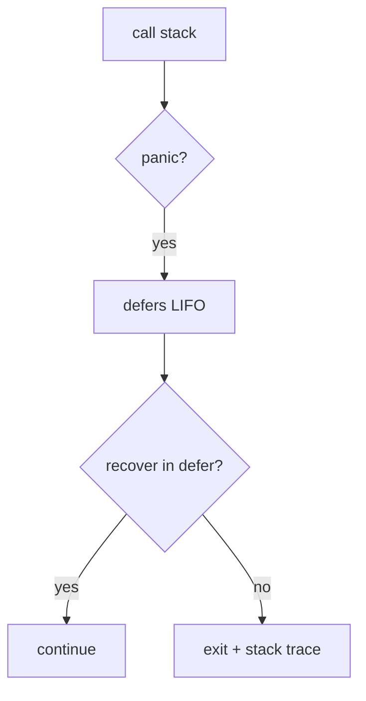

### 📖 Chapter Summary

Chapter 9 of *Learning Go* (Bodner) covers Go's error model: the `error` interface, `errors.New` and `fmt.Errorf`, sentinel errors, custom error types, wrapping with `%w`, `errors.Is` and `errors.As`, `errors.Join`, the defer-wrapping pattern, and `panic`/`recover` (reserved for programmer bugs and mandatory init failures — not normal control flow).

*100 Go Mistakes* (Harsanyi Ch.7): #48 panicking inappropriately, #49 when to wrap vs transform (`%v`), #50 checking error **type** with type switches instead of `errors.As`, #51 checking error **value** with `==` instead of `errors.Is`, #52 handling twice (log + return), #53 not handling (`_ =` required), #54 defer errors (`rows.Close()` masking `Scan`).
*Go in Practice* (2nd ed., Ch.4): bubble-up errors, custom types, `ErrDivideByZero` sentinel, panic-with-error, recover via defer, **panics in goroutines are not recovered by the parent**.

**Sources**

| Reference | Chapter / Section | Focus |
|-----------|-------------------|-------|
| Learning Go (Bodner) | Ch.9 — Errors | Strings, sentinels, custom types, `%w`, `Join`, `Is`/`As`, defer wrap, panic/recover |
| 100 Go Mistakes (Harsanyi) | Ch.7 (#48–#54) | Panic, wrap vs transform, `As`/`Is`, handle once, `_` ignore, defer errors |
| Go in Practice (2nd ed.) | Ch.4 — Handling errors and panics | Bubble-up, custom types, panic/recover, goroutine panics |
| Internet (2026) | `errors.Join`, `slog`, `errgroup` preview | Multi-error validation, structured logging, never panic in libraries |

#### 🆕 Key New Concepts & Technologies

| **Concept / Technology** | **Short Description** | **Bodner** | **Harsanyi** | **Go in Practice** | **2026** |
|:--|:--|:--|:--|:--|:--|
| **`error` interface** | `Error() string`; nil = success | Last return value convention | — | `Concat` returns `(string, error)` | Check before using result |
| **String errors** | `errors.New` / `fmt.Errorf` | Lowercase, no trailing `.` | — | `errors.New("no strings supplied")` | `%w` for wrapping |
| **Sentinel errors** | `var ErrX = errors.New(...)` | `Err` prefix; rare; public API | #51 — `errors.Is` not `==` | `ErrDivideByZero` | Reuse `io.EOF`, `sql.ErrNoRows` |
| **Custom error types** | Struct + extra fields | `StatusErr`, `Unwrap()` | #50 — `errors.As` | `ParseError` line/column | Return `error`, not concrete type |
| **Wrapping `%w`** | Preserve source in chain | `fmt.Errorf("ctx: %w", err)` | #49 context vs coupling | Bubble-up | Default internal propagation |
| **Transform `%v`** | Context, hide source | API boundary pattern | #49 break coupling | — | Hide implementation details |
| **`errors.Is` / `As`** | Walk unwrap chain | Replace `==`/type switch | #50, #51 mandatory | — | Custom `Is` for pattern match |
| **`errors.Join`** | Merge errors (Go 1.20+) | `ValidatePerson` | — | — | Validation + defer cleanup |
| **Defer error wrap** | Named returns + defer | DRY uniform prefix | #54 defer overrides | `defer tx.Rollback()` | Pair with `errgroup` |
| **panic / recover** | Programmer bugs only | Not exceptions | #48 `MustCompile` | Recover in defer | Never panic in libraries |

#### 📊 Comparison at a Glance

| Topic | Learning Go (Bodner) | 100 Go Mistakes (Harsanyi) | Go in Practice (2nd ed.) | Current practice (2026) |
|-------|----------------------|----------------------------|--------------------------|-------------------------|
| **Create errors** | `errors.New`, `fmt.Errorf` | — | Document return contract | `slog` on handle at boundary |
| **Sentinel check** | `==` only when unwrapped | #51 `errors.Is` | `ErrDivideByZero` | Always `errors.Is` with `%w` |
| **Type check** | `errors.As` | #50 type switch breaks | Custom type logic | `errors.As(err, &v)` only |
| **Wrapping** | `%w` preserves chain | #49 wrap vs `%v` hide | Bubble to one handler | Wrap internal; transform at edge |
| **Handle once** | Return or log | #52 no log+return | Top-level handler | `slog.Error` once |
| **Ignore** | `_ = fn()` | #53 blank identifier | Warn on `_` for errors | `_` + rationale comment |
| **Defer errors** | Named result defer wrap | #54 Close masks Scan | `defer tx.Rollback()` | Prioritize primary err |
| **panic** | Bugs, `MustCompile` | #48 not normal flow | `precheckDivide` vs `divide` | Libraries: recover → `error` |
| **Multi-error** | `errors.Join` | — | — | Forms + defer `Join` |

---

## Part 1: Errors Are Values — The Go Way

### 📌 Concepts Explained

- Go has **no exceptions**. Functions return `(result, error)`; check `err != nil` before using the result.
- **`error`** is a built-in interface: `Error() string`. `nil` means success.
- Bodner's layout rule: business logic **unindented**; error handling **indented** in `if` — golden path is obvious.
- Messages: lowercase, no trailing punctuation (stdlib convention).

### 🔧 Bodner — Basics and String Errors

```go
func calcRemainderAndMod(n, d int) (int, int, error) {
    if d == 0 {
        return 0, 0, errors.New("denominator is 0")
    }
    return n / d, n % d, nil
}

func doubleEven(i int) (int, error) {
    if i%2 != 0 {
        return 0, fmt.Errorf("%d isn't an even number", i) // runtime detail
    }
    return i * 2, nil
}
```

### 🔧 Go in Practice — Bubble-Up

```go
// GiP Ch.4 — errors propagate to a single authority
func Concat(parts ...string) (string, error) {
    if len(parts) == 0 {
        return "", errors.New("no strings supplied") // zero value + error
    }
    return strings.Join(parts, " "), nil
}

func main() {
    result, err := Concat(os.Args[1:]...)
    if err != nil {
        fmt.Printf("Error: %s\n", err)
        return
    }
    fmt.Printf("Concatenated: '%s'\n", result)
}
```

---

## Part 2: Sentinel Errors and Custom Error Types

### 📌 Concepts Explained

- **Sentinels** — `var ErrNotFound = errors.New("...")` signal specific states. `Err` prefix; exported = permanent API commitment.
- **Custom types** — structs with metadata (`Status`, `Field`). Always return **`error`**, not the concrete type.
- **Nil trap** — `return StatusErr{}` is **non-nil** (interface holds typed zero value). Fix: `return nil` or `var err error`.

### 🔧 Bodner — Sentinel and Custom Type

```go
// Sentinel — == only when function returns it directly (no wrap)
_, err := zip.NewReader(r, size)
if err == zip.ErrFormat { fmt.Println("not a zip") }

type StatusErr struct {
    Status  Status
    Message string
    Err     error // for Unwrap chain
}
func (se StatusErr) Error() string { return se.Message }
func (se StatusErr) Unwrap() error { return se.Err }
```

### 🔧 Nil Trap + GiP Sentinel

```go
// BUG: return StatusErr{} → err != nil even when flag false (interface typed zero)
// FIX: return nil explicitly, or var err error

var ErrDivideByZero = errors.New("can't divide by zero") // GiP Ch.4
```

---

## Part 3: Wrapping — `%w`, `Join`, and Defer Pattern

### 📌 Concepts Explained

- **`fmt.Errorf("...: %w", err)`** preserves source for `Is`/`As` — error **tree**.
- **`%v`** transforms: adds context, **hides** source — use at API boundaries (Harsanyi #49).
- **`errors.Join`** merges multiple errors (validation, defer cleanup).
- **Defer wrap** — named `err` + defer re-wraps with uniform prefix (Bodner).

### 🔧 Bodner — Wrap, Join, Defer

```go
func fileChecker(name string) error {
    f, err := os.Open(name)
    if err != nil {
        return fmt.Errorf("in fileChecker: %w", err)
    }
    f.Close()
    return nil
}

func ValidatePerson(p Person) error {
    var errs []error
    if p.FirstName == "" { errs = append(errs, errors.New("FirstName empty")) }
    if p.LastName == ""  { errs = append(errs, errors.New("LastName empty")) }
    if len(errs) > 0 { return errors.Join(errs...) }
    return nil
}

func DoSomeThings(v1 int, v2 string) (_ string, err error) {
    defer func() {
        if err != nil { err = fmt.Errorf("in DoSomeThings: %w", err) }
    }()
    val3, err := doThing1(v1)
    if err != nil { return "", err }
    return doThing3(val3, v2)
}
```

### 🔧 Harsanyi #49 — Wrap vs Transform

| Option | Context | Source available | Use when |
|--------|---------|------------------|----------|
| `return err` | No | Yes | No context needed |
| `fmt.Errorf` `%w` | Yes | Yes | Internal propagation |
| `fmt.Errorf` `%v` | Yes | No | Hide implementation |
| Custom type | Yes | If accessible | Mark for HTTP status etc. |

---

## Part 4: `errors.Is` and `errors.As` — #50 and #51

### 📌 Concepts Explained

- With `%w`, **`==` and type switches on the outer error fail**.
- **`errors.Is(err, target)`** — sentinel **values** (`sql.ErrNoRows`, `ErrFoo`).
- **`errors.As(err, &target)`** — custom **types**; second arg must be pointer.
- Expected errors → sentinels; unexpected → custom types (Harsanyi).

### 🔧 #50 — Type Switch vs `errors.As`

```go
type transientError struct{ err error }
func (t transientError) Error() string {
    return fmt.Sprintf("transient: %v", t.err)
}

// Common mistake (Harsanyi #50) — breaks after wrap refactor
func handlerBad(w http.ResponseWriter, r *http.Request) {
    _, err := getAmount(id)
    if err != nil {
        switch err.(type) {
        case transientError: // NEVER matches fmt.Errorf("...: %w", transientError{...})
            http.Error(w, err.Error(), 503)
        default:
            http.Error(w, err.Error(), 400)
        }
    }
}

// Fix — errors.As walks the chain
func handlerGood(w http.ResponseWriter, r *http.Request) {
    _, err := getAmount(id)
    if err != nil {
        var te transientError
        if errors.As(err, &te) {
            http.Error(w, err.Error(), 503)
        } else {
            http.Error(w, err.Error(), 400)
        }
    }
}
```

### 🔧 #51 — `==` vs `errors.Is`

```go
// Common mistake (Harsanyi #51)
if err == sql.ErrNoRows { /* never true if wrapped */ }

// 2026 senior standard
if errors.Is(err, sql.ErrNoRows) { /* works through %w chain */ }
if errors.Is(err, os.ErrNotExist) { /* Bodner fileChecker example */ }

// WRONG with wrapped errors          // RIGHT
if err == ErrNotFound { }             if errors.Is(err, ErrNotFound) { }
if _, ok := err.(MyError); ok { }      var me MyError
switch err.(type) { case MyError: }   if errors.As(err, &me) { }
```

---

## Part 5: Handling Discipline — #52, #53, #54

### 📌 Concepts Explained

- **#52** — handle once: logging **is** handling. Wrap for context; log at boundary only.
- **#53** — ignore with `_ = notify()`, never bare `notify()`. Add rationale comment (not `// ignore error`).
- **#54** — defer `Close()` can overwrite `Scan` error via named result. Prioritize primary err.

### 🔧 Harsanyi #52 — Log Once, Wrap Below

```go
// Common mistake — duplicate logs under concurrency
func validate(lat float32) error {
    if lat > 90 {
        log.Printf("invalid latitude: %f", lat)
        return fmt.Errorf("invalid latitude: %f", lat)
    }
    return nil
}
func GetRouteBad(lat float32) (Route, error) {
    if err := validate(lat); err != nil {
        log.Println("failed to validate") // second log!
        return Route{}, err
    }
    return Route{}, nil
}

// Better — wrap at boundary; caller logs once
func GetRouteGood(lat float32) (Route, error) {
    if err := validate(lat); err != nil {
        return Route{}, fmt.Errorf("validate source: %w", err)
    }
    return Route{}, nil
}
```

### 🔧 Harsanyi #54 — Defer Close Masks Scan Error

```go
// Common mistake — Close nil overwrites Scan error
func getBalanceBad(db *sql.DB, id string) (float32, error) {
    rows, err := db.Query(q, id)
    if err != nil { return 0, err }
    defer func() { err = rows.Close() }() // named err always wins
    var bal float32
    if rows.Next() {
        if err := rows.Scan(&bal); err != nil { return 0, err }
        return bal, nil
    }
    return 0, nil
}

// Fix — prioritize primary error
func getBalanceGood(db *sql.DB, id string) (bal float32, err error) {
    rows, err := db.Query(q, id)
    if err != nil { return 0, err }
    defer func() {
        if closeErr := rows.Close(); err != nil {
            if closeErr != nil {
                slog.Warn("close after error", "closeErr", closeErr)
            }
            return
        }
        err = closeErr
    }()
    if rows.Next() {
        if err = rows.Scan(&bal); err != nil { return 0, err }
        return bal, nil
    }
    return 0, nil
}
```

### 🔧 Transaction Defer Rollback (GiP / Bodner Ch.5)

```go
func UpdateAccount(ctx context.Context, db *sql.DB, id string, delta int) error {
    tx, err := db.BeginTx(ctx, nil)
    if err != nil { return fmt.Errorf("begin: %w", err) }
    defer tx.Rollback() // no-op after Commit(); safe on panic

    if _, err := tx.ExecContext(ctx,
        "UPDATE accounts SET balance = balance + $1 WHERE id = $2", delta, id); err != nil {
        return fmt.Errorf("update: %w", err)
    }
    return tx.Commit()
}
```

---

## Part 6: Panic, Recover, and Goroutines (#48)

### 📌 Concepts Explained

- **panic** — stops flow; defers run LIFO; exits unless **recover** in defer catches it.
- **When to panic** (#48): programmer errors (`invalid HTTP status`), mandatory deps (`regexp.MustCompile`), `init` registration (`sql.Register`).
- **recover** only inside **defer**. Go 1.21+: `panic(nil)` → `PanicNilError`.
- **Libraries** must not panic across public API — recover, return `error` (Bodner).
- **GiP**: parent defer **does not** catch child goroutine panics.

### 🔧 Error vs Panic — GiP Divide Example

```go
var ErrDivideByZero = errors.New("can't divide by zero")

func precheckDivide(a, b int) (int, error) {
    if b == 0 { return 0, ErrDivideByZero } // expected → error
    return a / b, nil
}
func divide(a, b int) int {
    return a / b // unguarded → panic: integer divide by zero
}
```

### 🔧 Recover + Library Boundary + Goroutine Panic

```go
// Libraries: recover panics, return error — never crash callers
func (s *Service) Process(req Request) (err error) {
    defer func() {
        if r := recover(); r != nil {
            err = fmt.Errorf("internal panic: %v", r)
            slog.Error("panic recovered", "panic", r)
        }
    }()
    return s.processInternal(req)
}

// GiP Ch.4 — parent defer does NOT catch child goroutine panic; recover inside worker
go func() {
    defer func() { if r := recover(); r != nil { slog.Error("worker", "r", r) } }()
    doWork()
}()
```

---

## Part 7: 2026 Snapshot

### ✅ Ahead of the books

| Area | Books | 2026 |
|------|-------|------|
| `%w` + `Is`/`As` | Bodner; Harsanyi #50–#51 | staticcheck enforces |
| `errors.Join` | Bodner Go 1.20 | Validation + defer aggregation |
| Log + return | Harsanyi #52 | `slog` once at handler |
| Library panic | Bodner warns | Recover → `error` |
| Goroutine panic | GiP Ch.4 | `errgroup` preview (Ch.12) |

### ⚠️ Gaps vs 2026 senior standards

| Gap | Risk | Priority |
|-----|------|----------|
| `==`/type switch on wrapped err | Wrong status/retry | 🔴 High |
| Panic for business logic | Process crash | 🔴 High |
| Log at every layer | Unreadable logs | 🔴 High |
| Defer Close overwrites err | Lost root cause | 🔴 High |
| Panic in library API | Crashes callers | 🔴 High |

### 🔧 2026 Patterns

```go
// slog at boundary
if err != nil {
    slog.Error("request failed", "op", "GetUser", "id", id, "err", err)
    return fmt.Errorf("get user %s: %w", id, err)
}

// errgroup preview (Ch.12)
g, ctx := errgroup.WithContext(ctx)
g.Go(func() error { return fetchA(ctx) })
g.Go(func() error { return fetchB(ctx) })
if err := g.Wait(); err != nil {
    return fmt.Errorf("parallel fetch: %w", err)
}

// defer cleanup with Join
defer func() {
    if closeErr := f.Close(); closeErr != nil {
        err = errors.Join(err, fmt.Errorf("close: %w", closeErr))
    }
}()
```

---

## Part 8: Senior Recommendations + Master Q&A

### 📊 Diagram — Wrap Chain (ASCII)

```
os.Open → *PathError (ErrNotExist)
    → fmt.Errorf("fileChecker: %w") → wrapError
errors.Is(outer, ErrNotExist) → true
outer == ErrNotExist            → false (BUG)
```

### 📊 Diagram — Panic Unwind (Mermaid)



### 🧪 Interview Q&A — Master

**Q1:** What is the `error` interface and why is `nil` success?

**Q2:** Sentinel error vs custom error type — when each?

**Q3:** `%w` vs `%v` in `fmt.Errorf`?

**Q4:** Why does `err == sql.ErrNoRows` fail after wrapping?

**Q5:** Why does `switch err.(type) { case transientError: }` break after `%w` refactor?

**Q6:** What is Harsanyi #52 and the fix?

**Q7:** Correct `defer rows.Close()` when `Scan` can fail?

**Q8:** When is panic appropriate? What must libraries do?

**Q9:** Why don't parent defers recover goroutine panics?

> [!success]- 📋 Answers — Part 8
> **A1:** `Error() string` interface. `nil` = no failure (interface zero value). Check before using results.
>
> **A2:** Sentinels for **expected** conditions (`ErrNoRows`). Custom types for **unexpected** failures needing metadata (field, status, line).
>
> **A3:** `%w` preserves source for `Is`/`As` — internal propagation. `%v` hides source — API boundaries, prevent coupling.
>
> **A4:** `==` compares outer wrapper only. `errors.Is` recursively unwraps the chain.
>
> **A5:** Outer error is `wrapError`, not `transientError`. `errors.As` finds wrapped types anywhere in chain.
>
> **A6:** Don't log and return same error at multiple layers. Wrap with `%w` below; log once at top.
>
> **A7:** `closeErr := rows.Close()` in defer; if `err != nil` keep it and log `closeErr`; else `err = closeErr`.
>
> **A8:** Programmer bugs, invalid API use, mandatory init (`MustCompile`). Libraries recover and return `error`.
>
> **A9:** Each goroutine has its own stack. Parent defers run only when parent returns/panics — not on child panic.

### 🔨 Hands-On Tasks

#### Task 1: Custom Error + Wrap Chain Test
**Goal:** Sentinel + custom type + `%w` wrap + `Is`/`As` tests that fail on `==`/type switch.
**Files:** `errlab/store.go` + `errlab/store_test.go`
**Steps:**
1. `var ErrNotFound = errors.New("not found")` and `type ValidationError struct{ Field string }`.
2. `Get(id)` returns `ValidationError` for `""`, `ErrNotFound` for `"missing"`.
3. `Fetch(id)` wraps: `fmt.Errorf("fetch %s: %w", id, err)`.
4. Table-test with `errors.Is`/`errors.As` — add test proving `==` fails on wrapped `ErrNotFound`.
**Done when:** `go test ./errlab/...` passes; you can explain `==` vs `Is`.

---

### 📚 Further Reading

| Resource | Topic |
|----------|-------|
| Learning Go (Bodner) Ch.10 | Exporting `Err` as package API |
| 100 Go Mistakes Ch.7 | #48–#54 |
| 100 Go Mistakes Ch.10 | #78–#79 SQL close (extends #54) |
| Go in Practice (2nd ed.) Ch.4 | Custom errors, panic/recover, goroutines |
| [Go Blog — Go 1.13 errors](https://go.dev/blog/go1.13-errors) | `%w`, `Is`, `As` |
| [[Go/Learning Go/5. Functions - Study Guide]] | `(T, error)`, defer, transaction preview |

*Study guide for Errors (Ch.9), 2026.*

### 🤖 Regenerate this guide

1. [[AI Prompt/00 - General Study Guide Prompt]] — fill Inputs (Bodner = Ref 1, Harsanyi = Ref 2, Internet = Ref 3, PRIMARY = 1; supplement = Go in Practice PDF)
2. [[Go/AI Prompt - Go]] — append Go code/tree requirements
3. [[Go/Learning Go/AI Prompt - learning go]] — append this project prompt (four-column tables: Bodner | Harsanyi | Go in Practice | 2026)