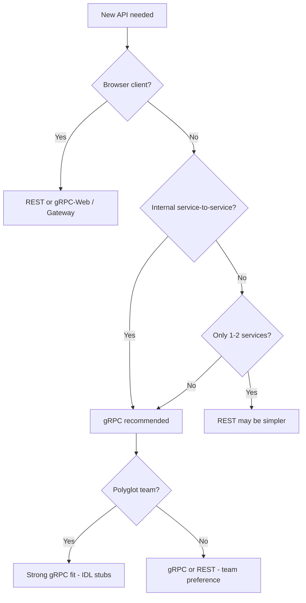
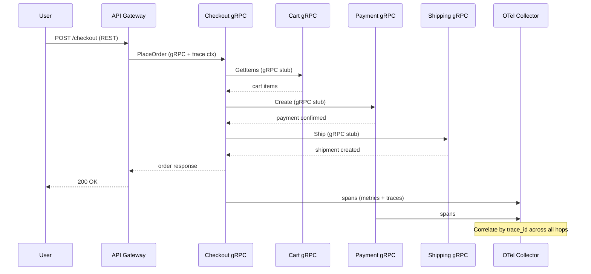

### 📖 Chapter Summary

Chapter 1 sets the stage for everything that follows. Babal (*gRPC Microservices in Go*, Ch.1) introduces **why gRPC fits microservices**: Protobuf serialization, HTTP/2 transport, automatic stub generation, fault-tolerance hooks, TLS, and streaming. It contrasts REST vs RPC, explains when gRPC is the right choice, and previews the book's **production-grade e-commerce architecture** (Fig 1.1): five business-capability services on Kubernetes with CI/CD, observability, and an API gateway.

Shuiskov (*Microservices with Go, 2nd Edition*, Ch.1) complements this with **microservice theory**: what a microservice is, monolith pain points, pros/cons, when to split (and when not to), and **Go's role** as a cloud-native language (native binaries, fast cold start, CNCF ecosystem dominance).

Together, these chapters answer: *Why microservices? Why gRPC? Why Go? What does production look like?* This guide maps both books side-by-side and adds a **2026 senior lens** on tooling (`grpc.NewClient`, Buf, OpenTelemetry) that neither book fully covers in Ch.1.

**Sources**

| Reference | Chapter / Section | Focus |
|-----------|-------------------|-------|
| Babal | Ch.1 — Introduction to Go gRPC microservices | gRPC benefits, REST vs RPC, production diagram |
| Shuiskov | Ch.1 — Introduction to Microservices | Microservice definition, monolith vs MS, Go advantages |
| Repo | `https://github.com/huseyinbabal/microservices` | Book companion code (Order, Payment, proto module) |

---

#### 🆕 Key New Concepts & Technologies

| **Concept / Technology** | **Short Description** | **Babal** | **Shuiskov** | **Repo** | **2026** |
|:--|:--|:--|:--|:--|:--|
| **gRPC** | High-performance RPC framework over HTTP/2 | Core topic; Google OSS, built-in LB/tracing/TLS | Introduced in Ch.5 (sync comm) | Used for Order↔Payment | Still default for internal sync RPC |
| **Protocol Buffers** | Language-neutral binary serialization (IDL) | Ch.1.1 performance; detail in Ch.3 | Ch.4 serialization | Shared `microservices-proto` module | Manage with **Buf** (lint + breaking) |
| **HTTP/2** | Multiplexing, header compression, server push | Built into gRPC transport | Mentioned via gRPC | Implicit in all stubs | HTTP/3 emerging; gRPC still HTTP/2 |
| **gRPC Stub** | Generated client proxy implementing remote methods | Ch.1.1 codegen; Fig 1.1 stubs | Gateway pattern in Ch.5 | `PaymentServiceClient` | Import versioned proto modules |
| **Microservices** | Loosely coupled services by business capability | Five services in Fig 1.1 | Formal definition + pros/cons | Order + Payment (+ more in book) | Start monolith; split on boundaries |
| **Idempotency** | Safe retries without side effects | Ch.1.1 fault tolerance | Ch.5 best practice | Deferred to later chapters | Idempotency keys on `Create` RPCs |
| **Kubernetes** | Container orchestration runtime | Ch.1.4.2; service discovery by name | Ch.8 deployments | Docker Compose + K8s manifests | Still standard; also ECS/Fargate |
| **Observability triad** | Metrics, logs, traces | Ch.1.4.4; detail in Ch.9 | Ch.12 telemetry | OTel on Payment (later) | OpenTelemetry everywhere from day one |
| **API Gateway** | Public-facing auth, rate limit, routing | Ch.1.4.5 NGINX Ingress | Not in Ch.1 | Not in early chapters | Kong, Envoy, or gRPC-Gateway |

---

#### 📊 Comparison at a Glance

| Topic | Babal Ch.1 | Shuiskov Ch.1 | Repo / Book project | Current practice (2026) |
|-------|------------|---------------|---------------------|-------------------------|
| **Primary focus** | gRPC as communication layer | Microservice architecture model | Hands-on Order/Payment flow | Both + production hardening |
| **When to split** | Business capabilities (Fig 1.1) | Don't split too early; clear boundaries first | E-commerce decomposition | Same; add domain-driven design |
| **Go rationale** | Fast compile, K8s binaries | Native binary, cold start, CNCF | Go throughout | Unchanged; still top MS language |
| **Serialization** | Protobuf (compact binary) | Covered in Ch.4 | Shared proto module | Buf + pinned module versions |
| **Public API** | REST via gateway / gRPC-Web | Not in Ch.1 | API gateway in architecture | gRPC-Gateway or Connect RPC |
| **Client creation** | Preview only (Ch.5 detail) | `grpc.Dial` in later chapters | `grpc.NewClient` in updated repo | `grpc.NewClient` + OTel handler |
| **Observability** | Prometheus, Jaeger preview | Telemetry in Part 3 | Partial OTel | OTel SDK + Collector standard |

---

## Part 1: Microservices Foundations

### 📌 Concepts Explained

- **Microservice**: An independently deployable service responsible for a specific **business capability** (search, cart, payments).
- **Monolith**: Single deployable unit — simple early on, painful at scale (slow builds, full redeploys, uniform scaling).
- **Business-capability decomposition**: Split by what the business does (Shipping, Payment), not by org chart alone.
- **Network calls replace in-process calls**: Every cross-service interaction becomes a remote call with failure modes.
- **Design for failure**: Assume timeouts, partial failures, and retries from day one.

### 🔧 Shuiskov — What Is a Microservice?

Shuiskov defines microservices as *a collection of services, each responsible for part of application logic defined by a business capability*. An online marketplace might have independent search, cart, payment, and order-history services — each potentially owned by a different team.

**Monolith pain points (Shuiskov):**

| Problem | Impact |
|---------|--------|
| Large app size | Minutes-to-hours build/deploy cycles |
| Coupled deployments | Can't ship one feature without full release |
| Higher blast radius | One bug in a shared library affects everything |
| Uniform scaling | Must scale entire 16 GB app for one 2 GB module |
| Vertical ceiling | Eventually hits CPU/RAM limits on one machine |

**When monoliths still win (Shuiskov):** loosely defined product, narrow scope, latency-sensitive in-process calls (e.g. trading).

### 🔧 Babal — The Network Shift

Babal frames the same transition from the gRPC angle: in a monolith, Checkout calls Payment via a class method; in microservices, that becomes a **network call** (TCP/HTTP/gRPC). gRPC's built-in TLS, connection pooling, and stub generation reduce the pain of that shift.

### 📊 Diagram — Monolith vs Microservices

```
MONOLITH                           MICROSERVICES (Babal Fig 1.1)
┌─────────────────────────┐        ┌──────────┐  gRPC  ┌──────────┐
│  Checkout ──► Payment   │        │ Checkout │───────►│ Payment  │
│  (in-process call)      │        └────┬─────┘        └──────────┘
│  Cart, Shipping, User   │             │ gRPC
└─────────────────────────┘        ┌────▼─────┐  gRPC  ┌──────────┐
                                   │   Cart   │        │ Shipping │
                                   └──────────┘        └──────────┘
```

### 🧪 Interview Q&A

**Q1:** How does Shuiskov define a microservice?

**Q2:** Name three reasons a monolith becomes painful at scale.

**Q3:** When should you *not* start with microservices?

**Q4:** What replaces an in-process method call in a microservice architecture?

**Q5:** What is "blast radius" in the context of monoliths?

> [!success]- 📋 Answers — Part 1
> **A1:** An independently deployable service responsible for a specific part of application logic, usually aligned with a business capability (e.g. payments, search).
>
> **A2:** Slow builds/deploys; inability to deploy parts independently; must scale the entire application for one hot module; higher blast radius from shared code; vertical scaling limits.
>
> **A3:** When the product is loosely defined, may change significantly, has narrow scope, or has strict in-process latency requirements (Shuiskov: "don't introduce microservices too early").
>
> **A4:** A remote network call — typically HTTP/REST, gRPC, or async messaging — with corresponding error handling, timeouts, and observability.
>
> **A5:** A defect in widely shared code (library, utility) can crash or corrupt behavior across the entire monolith simultaneously, rather than isolating failure to one service.

---

## Part 2: Why gRPC for Microservices

### 📌 Concepts Explained

- **Performance**: Protobuf binary serialization + HTTP/2 multiplexing = smaller payloads, lower latency.
- **Code generation**: Define messages/services once in `.proto` IDL; generate stubs for Go, Java, Python, etc.
- **Interoperability**: Server in Java, client in Python — same `.proto`, different generated stubs.
- **Fault tolerance**: Idempotent operations enable safe retries; retry policies and circuit breakers (Ch.6).
- **Security**: HTTP/2 over TLS encouraged by default.
- **Streaming**: Unary, client streaming, server streaming, bidirectional — one persistent connection.

### 🔧 Babal — Five Benefits (Ch.1.1)

| Benefit | Mechanism | Why it matters |
|---------|-----------|----------------|
| Performance | Protobuf + HTTP/2 | Compact messages; multiplexed streams |
| Codegen / interop | IDL → stubs per language | No shared-model antipattern across polyglot services |
| Fault tolerance | Idempotency + retry policies | Network failures are normal in distributed systems |
| Security | TLS / ALTS / token auth | Encrypt and authenticate service-to-service traffic |
| Streaming | Server/client/bidi streams | Pagination, live feeds, bulk upload without REST polling |

**Stub definition (Babal):** A generated client-side object implementing the same methods as the remote service — a local proxy for inter-service communication.

### 🔧 Shuiskov — gRPC in Context

Shuiskov introduces gRPC formally in Ch.5 (Synchronous Communication), but Ch.1 establishes that microservices need **clear, efficient APIs**. gRPC's contract-first `.proto` files enforce API boundaries — a natural fit for fine-grained microservice APIs.

### 💻 Minimal Protobuf Contract (Babal preview → Ch.3 detail)

```protobuf
// proto/payment/v1/payment.proto
syntax = "proto3";

package payment.v1;

service PaymentService {
  rpc Create(CreatePaymentRequest) returns (CreatePaymentResponse);
}

message CreatePaymentRequest {
  string order_id = 1;
  int64 amount_cents = 2;
  string currency = 3;
}

message CreatePaymentResponse {
  string payment_id = 1;
  string status = 2;
}
```

### 💻 Generated Stub Usage — Book vs 2026

```go
// Babal (book, Ch.5 preview)
conn, err := grpc.Dial(paymentURL, grpc.WithInsecure())

// Repo (updated companion)
conn, err := grpc.NewClient(paymentURL, grpc.WithTransportCredentials(insecure.NewCredentials()))

// 2026 senior standard
conn, err := grpc.NewClient(paymentURL,
    grpc.WithTransportCredentials(credentials.NewTLS(tlsConfig)),
    grpc.WithStatsHandler(otelgrpc.NewClientHandler()),
)
defer conn.Close()

client := paymentv1.NewPaymentServiceClient(conn)
resp, err := client.Create(ctx, &paymentv1.CreatePaymentRequest{...})
```

### 📊 Four RPC Types (Shuiskov Ch.5, previewed in Babal Ch.1.1.5)

| Type | Flow | Example |
|------|------|---------|
| Unary | 1 req → 1 resp | Charge payment |
| Client streaming | N req → 1 resp | Bulk file upload |
| Server streaming | 1 req → N resp | Log tail, paginated results |
| Bidirectional | N ↔ N | Live chat, collaborative edit |

### 🧪 Interview Q&A

**Q1:** Why is Protobuf faster than JSON for inter-service communication?

**Q2:** What is a gRPC stub and who generates it?

**Q3:** What makes an operation idempotent? Give an example.

**Q4:** Name the four gRPC streaming modes.

**Q5:** Why does Babal warn against shared request/response libraries across microservices?

> [!success]- 📋 Answers — Part 2
> **A1:** Protobuf serializes to a compact binary format with a known schema — no text parsing, smaller payloads, faster marshal/unmarshal on both client and server.
>
> **A2:** A generated client proxy that implements the remote service's methods locally. Generated by `protoc` (or Buf) from `.proto` service definitions.
>
> **A3:** Calling it multiple times with the same parameters produces the same result. Example: `DELETE /users/42` or a payment refund with the same idempotency key.
>
> **A4:** Unary, client streaming, server streaming, bidirectional streaming.
>
> **A5:** Shared libraries create tight coupling across services and break polyglot independence. Sandi Metz: "Duplication is far cheaper than the wrong abstraction." gRPC solves this with IDL + per-service generated stubs.

---

## Part 3: REST vs RPC and When to Choose gRPC

### 📌 Concepts Explained

- **REST**: Resource-oriented, JSON/XML over HTTP/1.1 (HTTP/2 possible with custom setup).
- **gRPC**: Procedure-oriented, Protobuf over HTTP/2 (built-in).
- **Browser support**: REST is universal; gRPC needs gRPC-Web proxy or alternative.
- **Contract evolution**: gRPC requires proto compatibility rules; REST JSON is more ad-hoc.
- **Polyglot + SDK generation**: gRPC stubs auto-generated; REST needs Swagger Codegen or hand-written clients.

### 🔧 Babal — REST vs RPC (Ch.1.2)

| Aspect | gRPC (RPC) | REST (JSON/XML) |
|--------|------------|-----------------|
| Payload | Compact binary (Protobuf) | Human-readable text (JSON) |
| Protocol | HTTP/2 (built-in) | Primarily HTTP/1.1 |
| Latency | Very low | Higher (text parsing, connection overhead) |
| Browsers | Minimal (needs proxy) | Universal native support |
| Streaming | Native bidirectional | Limited to request-response |
| Codegen | Built-in stubs | Requires framework (Swagger, etc.) |
| Readability | Binary (not human-readable) | JSON easy to inspect/debug |

### 🔧 When to Use gRPC (Babal Ch.1.3 + Shuiskov Ch.1)

**Choose gRPC when:**
- Internal service-to-service communication (backend-to-backend)
- Low latency and strict contracts matter
- Polyglot environment (Go server, Python client, etc.)
- You need streaming or efficient binary payloads
- Contract testing via generated client compile failures on proto changes

**Choose REST when:**
- Browser-facing public APIs
- Human-readable debugging is critical
- Simple apps with 1–2 services (proto maintenance overhead not worth it)
- Consumers lack gRPC SDKs and you don't want to share `.proto` files

**Hybrid (Babal):** gRPC internally + API gateway or gRPC-Web for public REST consumers. Alternatives: Twirp (Protobuf + JSON/HTTP), Connect RPC.

### 📊 Decision Flowchart



### 🧪 Interview Q&A

**Q1:** Why is REST still dominant for public APIs?

**Q2:** Can REST use HTTP/2? How does gRPC differ?

**Q3:** When is gRPC overkill?

**Q4:** What is gRPC-Web and why is it needed?

**Q5:** How does proto-based codegen act as a contract test?

> [!success]- 📋 Answers — Part 3
> **A1:** Universal browser support, human-readable JSON, mature tooling, and no proxy layer required for web clients.
>
> **A2:** Yes, REST can use HTTP/2 with custom server config, but it's not default. gRPC has HTTP/2 built-in with multiplexing, streaming, and Protobuf as standard — not optional add-ons.
>
> **A3:** Simple startup projects with one or two services where maintaining `.proto` files and codegen pipelines costs more than the benefit (Babal Ch.1.3).
>
> **A4:** A browser-compatible proxy that translates between gRPC-Web (HTTP/1.1) and native gRPC (HTTP/2), since browsers can't speak native gRPC directly.
>
> **A5:** When service definitions change, regenerated client stubs fail to compile or tests break on the consumer side — catching incompatible API changes before runtime.

---

## Part 4: Production-Grade Architecture Overview

### 📌 Concepts Explained

- **E-commerce reference architecture (Babal Fig 1.1)**: Five business-capability services on Kubernetes.
- **Service boundaries**: Product, Cart, Checkout, Payment, Shipping — each owns its data and API.
- **Stub-driven communication**: Checkout uses generated gRPC stubs for Cart, Payment, Shipping.
- **CI/CD**: Automate proto generation, builds, tests, and deployments on every push.
- **Cloud-native artifacts**: Container images deployed to K8s (or equivalent) runtimes.

### 🔧 Babal — Fig 1.1 Architecture

```
┌─────────────────────────────────────────────────────────────────┐
│                        CI/CD (GitHub Actions)                    │
│  Source → Build → Test → Proto codegen → Docker image → Deploy  │
└─────────────────────────────────────────────────────────────────┘
                              │
┌─────────────────────────────▼───────────────────────────────────┐
│              KUBERNETES (Cloud Container Runtime)                │
│                                                                  │
│  ┌─────────┐   ┌──────────┐   ┌──────────┐   ┌──────────────┐  │
│  │ Product │   │   Cart   │   │ Checkout │   │   Payment    │  │
│  │ service │   │  service │   │  service │   │   service    │  │
│  └─────────┘   └────┬─────┘   └────┬─────┘   └──────────────┘  │
│                     │              │ gRPC stubs                 │
│                     └──────────────┼──────────────┐              │
│                                    ▼              ▼              │
│                              ┌──────────┐   ┌──────────┐        │
│                              │ Shipping │   │ Payment  │        │
│                              │  service │   │ gateway  │        │
│                              └──────────┘   └──────────┘        │
│                                                                  │
│  ┌─────────────┐  ┌──────────────────────────────────────────┐  │
│  │ API Gateway │  │ Observability: metrics, logs, traces     │  │
│  └─────────────┘  └──────────────────────────────────────────┘  │
└─────────────────────────────────────────────────────────────────┘
```

### 🔧 Shuiskov — Microservice Benefits in Production

| Benefit | Production impact |
|---------|-------------------|
| Independent deploy cadence | Ship Payment fix without redeploying Cart |
| Horizontal scaling | Scale Product service during peak traffic only |
| Fault isolation | Shipping outage doesn't take down Product search |
| Cross-language support | Payment in Go, ML recommendation in Python |
| Cost optimization | Right-size resources per service |

### 💻 Book Project Directory Tree (companion repo)

```
microservices/
├── order/
│   ├── cmd/main.go
│   ├── internal/
│   │   ├── application/core/api/
│   │   ├── ports/
│   │   └── adapters/
│   │       ├── grpc/
│   │       └── payment/
│   └── deployment/
├── payment/
│   ├── cmd/main.go
│   ├── internal/
│   │   ├── application/core/api/
│   │   └── adapters/grpc/
│   └── deployment/
└── (proto module published separately)
```

### 🧪 Interview Q&A

**Q1:** How does Babal decompose the e-commerce system in Fig 1.1?

**Q2:** What role do gRPC stubs play in the Checkout service?

**Q3:** Why store `.proto` files in VCS alongside source code?

**Q4:** What is the difference between CI and CD in this architecture?

**Q5:** Name two Shuiskov benefits that directly reduce operational cost.

> [!success]- 📋 Answers — Part 4
> **A1:** Five services by business capability: Product (search/list), Cart (basket), Checkout (orchestrates cart + payment + shipping), Payment (charge via gateway like Stripe), Shipping (fulfillment).
>
> **A2:** Checkout imports generated stubs for Cart, Payment, and Shipping as Go module dependencies — calling remote methods as if they were local.
>
> **A3:** Proto files are the API contract source of truth; VCS tracks changes, enables CI stub regeneration, and supports contract testing on every push.
>
> **A4:** CI continuously builds and tests (quality gate); CD deploys passing artifacts to UAT/production environments (rolling, canary, or blue-green).
>
> **A5:** Independent horizontal scaling (don't scale everything for one hot service) and hardware flexibility (GPU nodes for ML, RAM-heavy nodes for cache).

---

## Part 5: Infrastructure Pillars — Kubernetes and CI/CD

### 📌 Concepts Explained

- **Container runtime**: Each microservice runs in a container; K8s orchestrates deployment, scaling, and networking.
- **Service discovery by name**: K8s DNS resolves `payment:8081` — no external registry required at small scale.
- **Independent resource config**: Product service gets more CPU/memory than Shipping.
- **CI/CD automation**: Proto codegen, tests, vulnerability scans, image builds on every merge.
- **Deployment strategies**: Rolling update, blue-green, canary — with rollback on metric spikes.

### 🔧 Babal — Kubernetes as Runtime (Ch.1.4.2)

gRPC clients need a server address. In Kubernetes, the **Service name** is the address — e.g. `payment.default.svc.cluster.local`. With consistent naming conventions, consumer services integrate without Consul or custom discovery (at moderate scale).

**Scaling example:** Product service gets higher replica count and resource requests than Shipping because most customer traffic is browse/search, not fulfillment.

### 🔧 Babal — CI/CD Pipeline (Ch.1.4.3)

| Automated step | Purpose |
|----------------|---------|
| Proto stub generation | Regenerate Go/Java/Python stubs on `.proto` change |
| Unit + integration tests | Catch regressions before merge |
| Static analysis + vulnerability scan | Security and code quality gates |
| Docker image build + tag | Immutable deployable artifact |
| Deploy to UAT → production | Controlled promotion with rollback |

> A green CI check is not enough — verify coverage thresholds, integration tests against real dependencies (MySQL, K8s), and contract tests between services.

### 🔧 Shuiskov — Embrace Automation (Ch.1)

"Investing in solid automation is absolutely necessary" — more independent components demand stricter integration checks. This aligns directly with Babal's CI/CD emphasis.

### 💻 Kubernetes Service + Deployment Sketch

```yaml
# payment/deployment/k8s/service.yaml
apiVersion: v1
kind: Service
metadata:
  name: payment
spec:
  selector:
    app: payment
  ports:
    - port: 8081
      targetPort: 8081
---
apiVersion: apps/v1
kind: Deployment
metadata:
  name: payment
spec:
  replicas: 3
  template:
    spec:
      containers:
        - name: payment
          image: payment:1.2.0
          resources:
            requests:
              cpu: "100m"
              memory: "128Mi"
```

### 💻 CI Stub Generation (bash)

```bash
# Run in CI on every proto change (2026: prefer Buf)
buf generate
go test ./...
go build -o bin/payment ./cmd
docker build -t payment:${GIT_SHA} .
```

### 🧪 Interview Q&A

**Q1:** How does Kubernetes simplify gRPC service discovery?

**Q2:** What should a CI pipeline verify beyond "build passes"?

**Q3:** Why can Product and Shipping have different replica counts?

**Q4:** What deployment strategies does Babal mention?

**Q5:** What is Shuiskov's guidance on automation for microservices?

> [!success]- 📋 Answers — Part 5
> **A1:** Kubernetes Services provide stable DNS names; gRPC clients dial `service-name:port` and the cluster routes to healthy pod endpoints — no hardcoded IPs.
>
> **A2:** Unit test coverage thresholds, integration tests (DB, third-party APIs), contract tests between services, static analysis, vulnerability scanning, and proto compatibility checks.
>
> **A3:** Microservices scale independently — Product gets most browse traffic; Shipping is lower volume. Scaling everything uniformly (monolith pattern) wastes resources.
>
> **A4:** Rolling update, blue-green deployment, and canary deployment — with rollback triggered by error-rate or latency alerts.
>
> **A5:** Automation is mandatory, not optional — independent components require strict integration checks to maintain reliability across the distributed system.

---

## Part 6: Observability, Security, and Public Access

### 📌 Concepts Explained

- **Monitoring vs observability**: Monitoring watches system state; observability enables debugging unknown failures.
- **Three pillars**: Metrics (numerical), logs (events), traces (request journey across services).
- **Trace propagation**: Inject trace IDs at API gateway; follow one checkout across 4–5 services.
- **TLS**: gRPC encourages HTTP/2 over SSL/TLS for service-to-service encryption.
- **API gateway**: Auth, rate limiting, and REST-to-gRPC bridging for public consumers.

### 🔧 Babal — Observability (Ch.1.4.4)

A successful API response doesn't guarantee health — **latency within the request lifecycle** matters. Trace IDs in headers let you group spans for one customer checkout across Cart → Checkout → Payment → Shipping.

| Signal | Tool (book) | Use case |
|--------|-------------|----------|
| Metrics | Prometheus | Memory > 80%, request rate, error rate |
| Logs | Elastic Stack | Application anomalies, error patterns |
| Traces | Jaeger (Ch.9) | Interservice call hierarchy, latency bottlenecks |

### 🔧 Babal — Public Access (Ch.1.4.5)

API gateways enforce:
- Authentication / authorization
- Rate limiting (prevent resource exhaustion)
- Consistent endpoint naming for documentation
- Optional SDK generation for consumers

In Kubernetes: NGINX Ingress controller with auth and rate-limit config.

### 🔧 Shuiskov — Design for Failure (Ch.1)

Build assuming network timeouts, client errors, and partial failures. This pairs with Babal's idempotency and retry preview (detail in Ch.6).

### 💻 Trace ID Middleware (Go preview — Ch.9 detail)

```go
// middleware/tracing.go
func TracingUnaryInterceptor(ctx context.Context, req any, info *grpc.UnaryServerInfo, handler grpc.UnaryHandler) (any, error) {
    ctx, span := tracer.Start(ctx, info.FullMethod)
    defer span.End()
    return handler(ctx, req)
}
```

### 📊 Observability Stack (2026)

| Layer | Babal Ch.1/9 | 2026 standard |
|-------|--------------|---------------|
| Instrumentation | OTel interceptor (Ch.9) | `otelgrpc` stats handlers on client + server |
| Collector | OTel Collector | OTel Collector → backends |
| Metrics | Prometheus | Prometheus or Grafana Cloud |
| Traces | Jaeger | Jaeger or Tempo |
| Logs | Elastic Stack | Loki or OpenSearch |

### 🧪 Interview Q&A

**Q1:** What is the difference between monitoring and observability?

**Q2:** Why inject trace IDs at the API gateway?

**Q3:** How does gRPC handle security at the transport layer?

**Q4:** What risks does an API gateway mitigate for public access?

**Q5:** Why can a "200 OK" response still indicate a problem?

> [!success]- 📋 Answers — Part 6
> **A1:** Monitoring tells you known metrics/thresholds are breached; observability lets you explore and debug unknown issues by correlating metrics, logs, and traces.
>
> **A2:** The gateway is the entry point — injecting trace context there ensures every downstream service (Cart, Payment, etc.) shares the same trace ID for end-to-end analysis.
>
> **A3:** gRPC encourages HTTP/2 over TLS (SSL/TLS) to encrypt and authenticate traffic; ALTS and token-based auth are also supported (Ch.6 detail).
>
> **A4:** Unlimited public requests without throttling cause resource exhaustion; gateways add rate limiting, auth, and consistent API surface.
>
> **A5:** High end-to-end latency across downstream services can still return success — the customer waits too long even though each individual RPC succeeded.

---

## Part 7: Reference Implementation Snapshot (2026)

### 📌 Concepts Explained

- **Book companion repo**: `https://github.com/huseyinbabal/microservices` implements Order + Payment (subset of Fig 1.1).
- **Hexagonal architecture**: Introduced in Babal Ch.4 — ports and adapters pattern used in repo.
- **Gap analysis**: What the book/repo covers vs what 2026 production demands on day one.

### 🔧 Ahead of the Books

| Area | Status |
|------|--------|
| Shared proto module | Versioned `microservices-proto` — not copy-pasted `.pb.go` |
| `grpc.NewClient` | Repo updated from deprecated `grpc.Dial` |
| Docker Compose networking | Local multi-service dev environment |
| Hexagonal layout | `ports/` + `adapters/` separation in Order service |
| OpenTelemetry (partial) | Payment service instrumented in later repo commits |

### ⚠️ Gaps vs 2026 Senior Standards

| Gap | Risk | Priority |
|-----|------|----------|
| No idempotency keys on `Create` RPCs | Duplicate charges on retry | 🔴 High |
| Context not propagated end-to-end (Order port) | Broken deadlines/traces | 🔴 High |
| OTel only on Payment | Blind spots in Order and cross-service traces | 🟡 Medium |
| No Buf lint/breaking in CI | Accidental proto breaking changes | 🟡 Medium |
| `grpc.Dial` in book text | New readers copy deprecated API | 🟡 Medium |
| No gRPC health service | K8s probes can't check gRPC readiness | 🟡 Medium |
| TLS not enabled by default in early chapters | Unencrypted inter-service traffic in dev | 🟡 Medium |

### 💻 Repo vs Book — Client Connection

| Source | Pattern |
|--------|---------|
| Babal (book text) | `grpc.Dial(url, grpc.WithInsecure())` |
| Repo (updated) | `grpc.NewClient(url, grpc.WithTransportCredentials(...))` |
| 2026 standard | `grpc.NewClient` + TLS + `otelgrpc.NewClientHandler()` |

### 📊 Book Roadmap vs Repo Coverage

| Babal Fig 1.1 Service | Book coverage | Repo (early) |
|-----------------------|---------------|--------------|
| Product | Architecture only | Not in repo |
| Cart | Architecture only | Not in repo |
| Checkout | → Order service | `microservices/order` ✓ |
| Payment | Full Ch.4–5 | `microservices/payment` ✓ |
| Shipping | Architecture only | Not in repo |

### 🧪 Interview Q&A

**Q1:** What is the Babal companion repo and what does it implement?

**Q2:** Why is a versioned proto module better than copying generated files?

**Q3:** What is the highest-priority gap in the repo vs 2026 standards?

**Q4:** How does the repo structure reflect hexagonal architecture?

**Q5:** Which Fig 1.1 services are architecture-only in the book's early chapters?

> [!success]- 📋 Answers — Part 7
> **A1:** GitHub repo `huseyinbabal/microservices` — companion code for the Manning book, implementing Order and Payment services with gRPC and hexagonal architecture.
>
> **A2:** Versioned modules let consumers pin `v0.2.0`, get reproducible builds, and detect breaking changes via module tags — copying `.pb.go` files creates drift and merge conflicts.
>
> **A3:** Missing idempotency on payment `Create` — retries after network timeout can double-charge without deduplication keys.
>
> **A4:** `internal/ports/` defines driven interfaces (e.g. `Payment`); `internal/adapters/` implements them (gRPC client to Payment service); `application/core/` holds domain logic.
>
> **A5:** Product, Cart, and Shipping appear in Fig 1.1 but are implemented in later book chapters or architecture discussion only — repo starts with Order + Payment.

---

## Part 8: Senior Go Developer Recommendations

### 📌 Concepts Explained

- **Start simple, split deliberately**: Monolith or modular monolith first; extract services at clear domain boundaries.
- **gRPC for internal, REST/gRPC-Web for external**: Hybrid is the industry norm.
- **Contract-first APIs**: `.proto` in VCS, Buf for lint/breaking, pinned module versions.
- **Observability from day one**: OTel traces on every gRPC handler and client.
- **Security by default**: TLS between services; never `WithInsecure()` outside local dev.

### 🔧 Combined Recommendations

| # | Recommendation | Babal | Shuiskov | 2026 |
|---|----------------|-------|----------|------|
| 1 | Use gRPC for internal sync RPC | Ch.1 core thesis | Ch.5 detail | Unchanged |
| 2 | Decompose by business capability | Fig 1.1 | Ch.1 definition | Add DDD bounded contexts |
| 3 | Automate proto codegen in CI | Ch.1.4.3 | "Embrace automation" | Use Buf, not raw `protoc` |
| 4 | Design for failure + idempotency | Ch.1.1.3 | Ch.1 + Ch.5 | Idempotency keys mandatory |
| 5 | Propagate `context.Context` | Ch.6 preview | Ch.2 context section | OTel baggage + deadlines |
| 6 | Don't ship org-chart microservices | — | "Don't ship hierarchy" | Domain-driven boundaries |
| 7 | Invest in integration testing | Ch.1.4.3 | Ch.1 best practice | testcontainers + bufconn |
| 8 | Use `grpc.NewClient` | Book uses `Dial` | Book uses `Dial` | Deprecated `Dial` removed in grpc-go |

### 📊 Sequence Diagram — Chapter 1 End-to-End Vision



### 🧪 Master Interview Q&A

**Q1:** Summarize why Go + gRPC + microservices is a common 2026 stack.

**Q2:** What are the three pillars of observability and why do microservices need all three?

**Q3:** When would you choose REST over gRPC for a new internal service?

**Q4:** What does "design for failure" mean practically in Ch.1 terms?

**Q5:** A junior dev asks "should we microservice everything on day one?" — what do you say?

> [!success]- 📋 Answers — Master Q&A
> **A1:** Go compiles to small native binaries with fast cold start (ideal for K8s). gRPC provides contract-first, high-performance inter-service RPC with codegen. Microservices enable independent scaling, deployment, and team ownership — the combination dominates cloud-native backends.
>
> **A2:** Metrics (what is happening numerically), logs (what the application recorded), traces (how one request flowed across services). Microservices multiply failure points — you need all three correlated to debug distributed issues.
>
> **A3:** When the consumer is browser-only with no gRPC-Web infra, when the team lacks proto/codegen experience for a 1-service MVP, or when human-readable ad-hoc JSON exploration is the primary debugging workflow.
>
> **A4:** Assume every network call can fail, timeout, or partially succeed. Use idempotent operations, retry policies with backoff, circuit breakers, deadlines via `context.Context`, and structured error codes — not try/catch around local calls.
>
> **A5:** No. Start monolith or modular monolith (Shuiskov + Babal). Split when you have clear business boundaries, pain from deploy/scale coupling, and automation ready. Premature decomposition adds network complexity without benefit.

---

### 💡 Pro Tips & Best Practices (Combined)

1. **Internal gRPC, external REST** — use an API gateway or gRPC-Gateway; don't expose raw gRPC to browsers.
2. **Never copy `.pb.go` files** — publish and import versioned proto modules.
3. **Use Buf from project start** — `buf lint`, `buf breaking`, reproducible `buf generate`.
4. **Replace `grpc.Dial` with `grpc.NewClient`** — `Dial` is deprecated in modern grpc-go.
5. **Add OTel handlers on day one** — `otelgrpc.NewServerHandler()` + `NewClientHandler()`; cheaper than retrofitting.
6. **Decompose by business capability, not team name** — Shuiskov's "don't ship hierarchy" rule.
7. **Automate proto codegen in CI** — stub drift between services is a top source of production incidents.
8. **Register gRPC health service** — enables proper Kubernetes liveness/readiness probes.
9. **Fast-fail on missing config** — Babal Ch.1.4: crash at startup if `DATA_SOURCE_URL` is absent.
10. **Pin dependency versions** — proto modules, gRPC libs, and Go toolchain — not `@latest` in production.

---

### 🔨 Hands-On Tasks

#### Task 1: Scaffold a minimal gRPC hello service with Buf
**Goal:** Experience contract-first development — the foundation Babal builds on in Ch.3–4.
**Files:** New project `hello-grpc/` (local sandbox; not the book repo)
**Steps:**
1. `brew install buf` (or `go install github.com/bufbuild/buf/cmd/buf@latest`)
2. `buf config init` → add `buf.yaml` with `lint: STANDARD` and `breaking: FILE`
3. Create `proto/hello/v1/hello.proto` with a `SayHello` unary RPC
4. Add `buf.gen.yaml` targeting `protocolbuffers/go` + `grpc/go`
5. Run `buf generate` and implement server in `cmd/server/main.go` using `grpc.NewServer()`
6. Call with `grpcurl -plaintext localhost:50051 hello.v1.HelloService/SayHello`
**Done when:** `grpcurl` returns a response and `buf lint` passes with zero warnings.

#### Task 2: Compare REST vs gRPC payload and latency
**Goal:** Validate Babal Ch.1.1 performance claims with measurable evidence.
**Files:** Local `hello-grpc/` server + a simple `net/http` JSON endpoint serving the same data
**Steps:**
1. Implement identical `Hello` data as gRPC (Protobuf) and REST (JSON) endpoints
2. Use `grpcurl` and `curl` to call each 100 times; compare response sizes (`wc -c`)
3. Optional: use `hey` or `ghz` for basic throughput comparison
4. Record results in a table: format | payload bytes | avg latency
**Done when:** You can explain to a colleague why Protobuf + HTTP/2 reduces overhead, with numbers from your test.

---

### 📚 Further Reading

| Resource | Topic |
|----------|-------|
| Babal Ch.2 | Monolith vs microservices, scale cube, saga patterns |
| Babal Ch.3 | Protocol Buffers, stub generation, proto compatibility |
| Shuiskov Ch.2 | Go idioms, project structure, movie microservices scaffold |
| Shuiskov Ch.4 | Serialization formats (Protobuf deep dive) |
| [gRPC official docs](https://grpc.io/docs/languages/go/) | Go quick start, core concepts |
| [Buf docs](https://buf.build/docs) | Lint, breaking changes, code generation |
| [gRPC performance guide](https://grpc.io/docs/guides/performance/) | Connection pooling, keepalive |
| [microservices.io](https://microservices.io) | Patterns catalog (Shuiskov Ch.1 reference) |
| [Martin Fowler — Microservices](https://martinfowler.com/articles/microservices.html) | Foundational article |
| [grpc-go anti-patterns](https://github.com/grpc/grpc-go/blob/master/Documentation/anti-patterns.md) | `Dial` deprecation, client lifecycle |

---

### 🤖 Regenerate this guide

1. [[AI Prompt/00 - General Study Guide Prompt]] — fill Inputs table, copy full prompt
2. [[Go/AI Prompt - Go]] — append Go-specific instructions
3. [[Go/gRPC Microservices in Go/AI Prompt - grpc babal]] — append Babal/Shuiskov/internet source hierarchy

---

*Study guide for Introduction to Go gRPC Microservices (Ch.1), 2026.*