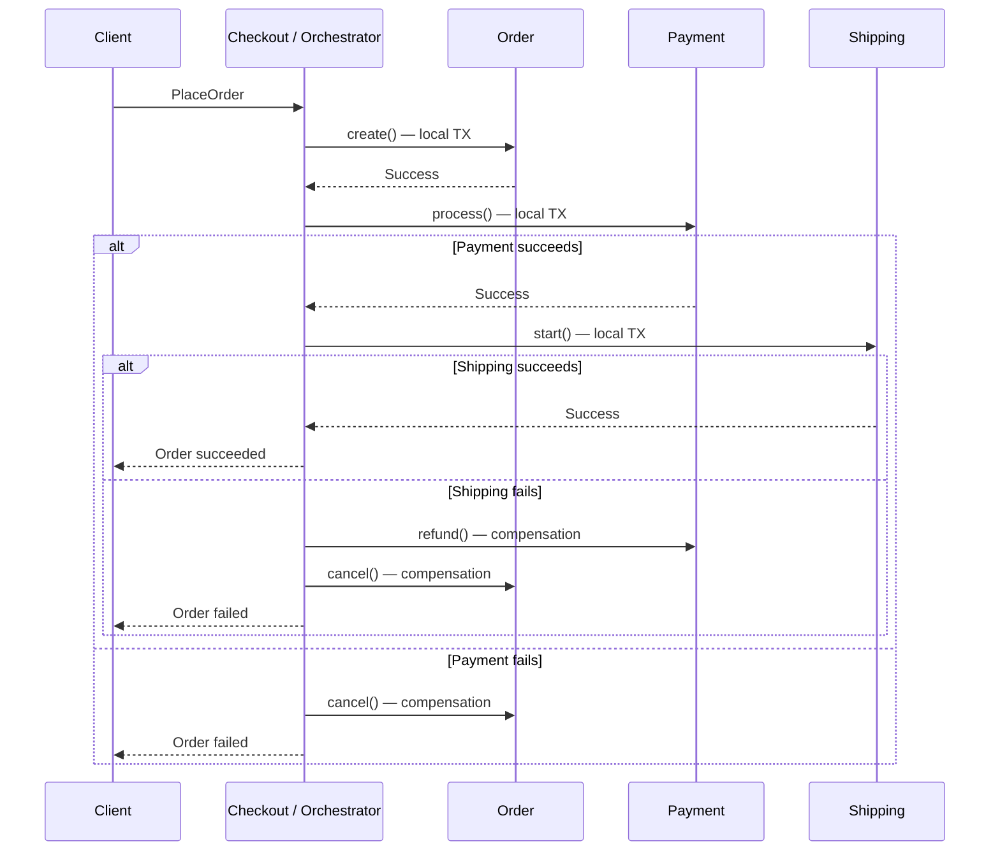
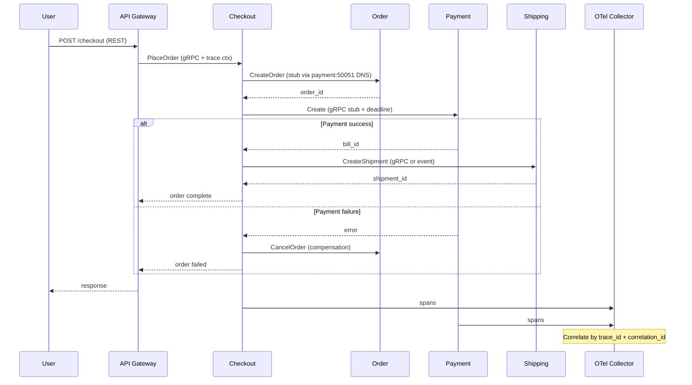

### 📖 Chapter Summary

Chapter 2 bridges microservices architecture theory with gRPC as the communication fabric. Babal (*gRPC Microservices in Go*, Ch.2) explains why teams move from monoliths to microservices, introduces the **Scale Cube** (X/Y/Z axes), covers the loss of ACID transactions across services, and presents **Saga patterns** (choreography vs orchestration) for distributed consistency. It also covers service discovery models and previews the **five-step gRPC workflow** (proto → stubs → server → client → run) that Ch.3 expands.

Shuiskov (*Microservices with Go, 2nd Edition*, Ch.1) provides the broader theory: definitions of microservices by business capability, monolith pain points (build times, coupled deploys, blast radius, uniform scaling), when *not* to split, and Go's strengths for cloud-native workloads. Service discovery appears in Shuiskov Ch.3; saga/eventual consistency in later distributed-systems chapters.

Internet sources (2026) add modern defaults: `grpc.NewClient` (replacing deprecated `grpc.Dial`), Buf for contract governance, Kubernetes-native DNS discovery, gRPC health service for probes, and practical saga patterns using outbox + events or orchestrators like Temporal.

This chapter answers: *When do microservices make sense? How do we scale in three dimensions? How do we keep data consistent without distributed transactions? How do services find each other? Why does gRPC fit the resulting communication patterns?*

**Sources**

| Reference | Chapter / Section | Focus |
|-----------|-------------------|-------|
| Babal | Ch.2 — gRPC meets microservices | Monolith→MS, scale cube, sagas, discovery, gRPC 5-step workflow |
| Shuiskov | Ch.1 — Introduction to Microservices; Ch.3 — Service Discovery (partial) | MS definition, monolith pros/cons, discovery models |
| Repo | `https://github.com/huseyinbabal/microservices` | Order → Payment gRPC stub, K8s service names |
| Internet (2026) | gRPC docs, microservices.io, Buf, K8s | `grpc.NewClient`, `buf breaking`, K8s DNS + health, saga patterns |

---

#### 🆕 Key New Concepts & Technologies

| **Concept / Technology** | **Short Description** | **Babal** | **Shuiskov** | **Repo** | **2026** |
|:--|:--|:--|:--|:--|:--|
| **Monolith** | Single deployable unit containing all modules | Pain points: slow builds, full redeploys, uniform scaling | Core definition + when it still wins | — | Start here; split deliberately |
| **Microservice** | Independently deployable service for one business capability | Y-axis scaling; business-capability split | Formal definition + team ownership | Order + Payment services | DDD bounded contexts |
| **Scale Cube** | 3D model: X (clone), Y (split by function), Z (partition data) | Fig 2.1; Y-axis = microservices | Ch.1 scaling discussion | K8s Deployments per service | Still the canonical mental model |
| **Saga** | Sequence of local transactions coordinated by events or orchestrator | Choreography vs Orchestrator; compensation | Eventual consistency; avoid 2PC | Sync gRPC in Order→Payment (saga later) | Outbox + events or Temporal |
| **Choreography** | Decentralized: each service publishes events to trigger the next | Fig 2.3–2.4; command channel + pub/sub | — | — | Correlation IDs mandatory |
| **Orchestration** | Centralized coordinator drives steps and compensation | Fig 2.5; request/response style | — | — | Preferred for complex flows |
| **Service Discovery** | Finding service locations (IP:port) at runtime | Client-side vs server-side; K8s by name | Ch.3 registry models | `payment` K8s Service DNS | K8s DNS + gRPC health service |
| **gRPC 5-step workflow** | Define proto → generate stubs → server → client → run | Core Ch.2.5; detail in Ch.3 | Sync comm in Ch.5 | `microservices-proto` module | Buf + pinned modules |
| **gRPC Stub** | Generated client proxy making remote calls feel local | Fig 2.8; `NewPaymentClient` | Client patterns in Ch.5 | `payment.NewPaymentClient(conn)` | Versioned proto module import |
| **Sync vs async comm** | Request/response vs event-driven | gRPC = sync; saga events = async | Ch.5 sync; later async chapters | Order→Payment is sync gRPC | Hybrid: gRPC internal, events for sagas |

---

#### 📊 Comparison at a Glance

| Topic | Babal Ch.2 | Shuiskov Ch.1 / Ch.3 | Repo | Current practice (2026) |
|-------|------------|----------------------|------|-------------------------|
| **When to split** | After monolith pain (builds, deploys, scaling) | Don't split too early; clear boundaries first | E-commerce decomposition | Modular monolith first |
| **Scaling model** | Scale Cube (X/Y/Z) | Monolith uniform scaling pain | Per-service K8s Deployments | X + Y + selective Z |
| **Data consistency** | Saga (choreo or orch) instead of 2PC | Eventual consistency; avoid distributed tx | Sync gRPC only (no saga yet) | Saga + idempotency keys |
| **Service location** | K8s DNS by name; client vs server discovery | Registry + LB models (Ch.3) | `payment:50051` in config | K8s DNS + health probes |
| **Communication contract** | Proto first (preview → Ch.3) | Explicit APIs; sync vs async framework | Shared `microservices-proto` | Buf lint + breaking in CI |
| **Client creation** | `grpc.Dial` in Listing 2.2 | `grpc.Dial` in later chapters | Still `grpc.Dial` + OTel interceptor | `grpc.NewClient` + OTel handler |
| **Saga style** | Both choreo and orch with compensation | Event-driven eventual consistency | Not implemented in early repo | Orchestrator for complex flows |

---

## Part 1: Monolith vs Microservices — The Transition

### 📌 Concepts Explained

- **Monolithic Architecture**: All modules packaged into one distributable artifact (WAR/JAR for Java, single binary for Go). Simple tech stack and navigation at the start.
- **Microservice Architecture**: Collection of loosely coupled services, each focused on a **business capability**, independently deployable and scalable.
- **Network boundary**: In-process method calls become remote calls (TCP/HTTP/gRPC). Latency, partial failure, timeouts, and retries become first-class concerns.
- **Blast radius**: A bug in shared code inside a monolith can affect the entire application at once.
- **Uniform scaling**: A monolith forces you to scale the whole application even when only one module is hot.
- **Periodic assessment**: Babal recommends reassessing whether microservices fit after you understand business domains.

### 🔧 Shuiskov — Microservice Definition and Monolith Pain

Shuiskov defines a microservice as an independently deployable unit responsible for a specific part of application logic, typically aligned to a business capability (e.g., payments, search, ratings).

**Common monolith pains (Shuiskov + Babal):**

| Problem | Monolith Impact | Microservice Benefit |
|---------|-----------------|----------------------|
| Build & test time | Grows with codebase; IDEs slow down | Small services build and test in seconds |
| Deployment coupling | Any change requires full redeploy | Independent release cycles |
| Resource waste | Scale entire 16 GB app for one 2 GB module | Scale only the hot service |
| Blast radius | One bad change affects everything | Failure isolated to one service |
| Tech stack lock-in | One language/runtime for all | Polyglot when it makes sense |
| Multi-team friction | Flaky tests from other teams block deploys | Teams own their service lifecycle |

**When monoliths still win (Shuiskov):** early product with unclear boundaries, small team, latency-sensitive in-process calls, or when operational overhead of microservices would slow you down more than the monolith does.

### 🔧 Babal — The Network Shift (Ch.2.1–2.3)

Babal emphasizes that moving to microservices replaces simple class method calls with network communication. In a monolith, Checkout calls Payment via an in-process method; in microservices, that becomes a **network call** over TCP/HTTP/gRPC. gRPC mitigates much of the pain with generated stubs, built-in load balancing hooks, tracing, health checking, and TLS.

**Microservice characteristics (Babal Ch.2.3):**

- Loosely coupled, independently deployable and scalable
- Focused on business capabilities
- Dedicated team ownership per service or service group
- No long-term technology stack commitment
- Partial failure: one service down does not necessarily stop others

### 📊 Diagram — Monolith vs Microservices (Y-axis Scaling)

```
MONOLITH (everything together)          MICROSERVICES (Babal Fig 1.1 style)
┌───────────────────────────────┐       ┌──────────┐   gRPC    ┌──────────┐
│  Checkout calls Payment       │       │ Checkout │ ────────► │ Payment  │
│  (in-process, fast, fragile)  │       └────┬─────┘           └──────────┘
│  Cart + Shipping + Product    │            │ gRPC
│  One binary, one deploy       │       ┌────▼─────┐   gRPC    ┌──────────┐
└───────────────────────────────┘       │   Cart   │           │ Shipping │
                                        └──────────┘           └──────────┘
                                        (each = own DB, own deploy, own scale)
```

### 🧪 Interview Q&A

**Q1:** How does Shuiskov define a microservice?

**Q2:** List three concrete pains that appear as a monolith grows.

**Q3:** What does "uniform scaling" mean and why is it wasteful?

**Q4:** What replaces an in-process method call when you move to microservices?

**Q5:** According to both books, when should you *not* start with microservices?

**Q6 (real-world):** "We're a 3-person startup building an MVP. Should we use microservices?" — What do you say?

> [!success]- 📋 Answers — Part 1
> **A1:** A collection of services, each responsible for part of application logic defined by a business capability. They are independently deployable and scalable.
>
> **A2:** Slow builds and tests, full-application redeploys for small changes, uniform scaling (scale everything to help one module), high blast radius from shared code, and eventual vertical scaling limits.
>
> **A3:** You must scale the entire monolith even if only one functional area (e.g. Payment) needs more resources. Scaling a 16 GB process just because the 2 GB payment module is hot is wasteful.
>
> **A4:** A remote network call (gRPC, HTTP, or async message). This introduces latency, partial failure, timeouts, retries, and the need for distributed consistency strategies.
>
> **A5:** When the product is early/ill-defined, the team is small, boundaries are unclear, or you have strict in-process latency requirements. Start monolithic, understand domains, then split.
>
> **A6:** No. Start with a well-structured monolith or modular monolith. Three people cannot operate five services, five databases, and distributed tracing effectively. Split when you have clear boundaries and real pain — not before.

---

## Part 2: The Scale Cube — Three Dimensions of Scaling

### 📌 Concepts Explained

- **X-axis scaling**: Horizontal duplication — run N identical copies behind a load balancer (each instance has access to all data).
- **Y-axis scaling**: Functional decomposition — split the application by business capability (microservices).
- **Z-axis scaling**: Data partitioning — each instance owns a subset of the data (sharding, tenancy, geographic splits).
- **Kubernetes X-axis**: Babal points to K8s Service + Pod resources for load-balanced replicas (detail in Ch.8).

### 🔧 Babal — Scale Cube Applied (Ch.2.2, Fig 2.1)

Babal uses Martin Fowler's Scale Cube to explain why microservices are primarily **Y-axis scaling**. You split the monolith along business capabilities rather than just cloning it.

| Axis | Mechanism | Drawback | Microservice link |
|------|-----------|----------|-------------------|
| X | Clone entire app N times | All instances need full dataset; codebase complexity unchanged | K8s replicas per service |
| Y | Split by feature/capability | Operational overhead of many services | **This is microservices** |
| Z | Partition data per instance | Repartition complexity on recovery | Per-tenant or regional shards |

### 🔧 Shuiskov — Horizontal Scaling Contrast

Shuiskov notes that microservices are easier and often cheaper to scale horizontally because you scale only the resource-heavy parts. Monolithic applications are resource-heavy on every instance.

### 📊 ASCII — Scale Cube (Babal Fig 2.1)

```
          Z (data partition)
             ^
             |
   +---------+---------+
  /                   /|
 /     Y (split)     / |
+---------+---------+  |
|                   |  |   X (clone / duplicate)
|   Microservices   | /
|   (Y-axis)        |/
+-------------------+
```

### 💻 Directory Tree — Per-Service Scaling on Kubernetes

```
deployment/
├── order/
│   ├── deployment.yaml      # replicas: 3, resources: 256Mi/500m
│   └── service.yaml         # ClusterIP order:50051
├── payment/
│   ├── deployment.yaml      # replicas: 5 (hot path — scale X-axis)
│   └── service.yaml         # ClusterIP payment:50051
└── shipping/
    ├── deployment.yaml      # replicas: 2
    └── service.yaml
```

### 🧪 Interview Q&A

**Q1:** What does each axis of the Scale Cube represent?

**Q2:** Why is Y-axis scaling the primary driver for adopting microservices?

**Q3:** Give an example of Z-axis scaling in an e-commerce system.

**Q4:** How does Kubernetes make X-axis scaling practical for microservices?

**Q5:** Can you combine all three axes?

**Q6 (real-world):** "Our Payment service needs 5× the CPU of Shipping. How does the Scale Cube help you explain the fix?"

> [!success]- 📋 Answers — Part 2
> **A1:** X = run more identical copies (horizontal scaling). Y = split the application into services by function/business capability. Z = partition data so each instance owns only a slice.
>
> **A2:** Y-axis is functional decomposition. Instead of cloning the whole monolith, you split it so that only the hot or complex parts can be scaled, deployed, and reasoned about independently.
>
> **A3:** Sharding orders by customer region or by tenant ID so that each Order service instance only holds data for a subset of customers.
>
> **A4:** You define a Deployment with replicas > 1 and a Service in front. Kubernetes handles rolling updates, health checks, and load balancing. You can set different replica counts and resource requests per microservice.
>
> **A5:** Yes. A well-designed system often uses X (replicas), Y (separate services), and selective Z (sharded data stores) together.
>
> **A6:** Y-axis already separated Payment from Shipping. Now apply X-axis: scale Payment Deployment replicas to 5 while Shipping stays at 1–2. You avoid cloning the entire monolith 5× just to handle payment load.

---

## Part 3: Distributed Consistency — Saga Patterns

### 📌 Concepts Explained

- **The problem**: Each microservice owns its own database. A single ACID transaction across services is no longer possible (Babal Ch.2.3.1).
- **2PC vs Saga**: Two-phase commit coordinates distributed atomic transactions but blocks resources and scales poorly. Sagas use a sequence of **local transactions** with compensation on failure.
- **Saga**: Each service updates its own DB, then publishes an event/message triggering the next local transaction.
- **Compensation**: "Undo" operations executed bottom-up when a later step fails (Babal Fig 2.5).
- **Sync vs async**: Babal's summary — pub/sub and command channels are **async**; gRPC request/response is **sync**. Order creation sagas can use either.

### 🔧 Choreography-based Saga (Babal Ch.2.3.3, Fig 2.3–2.4)

Each service performs its local transaction and emits a domain event. Other services listen and react.

| Mechanism | How it works | Drawback |
|-----------|--------------|----------|
| **Command channel** | Publisher sends message directly to next service with `replyToChannel` | Publisher must know next service location |
| **Pub/Sub** | Publisher broadcasts domain event; subscribers consume | Broker can be single point of failure |

**Completion signaling**: Domain object status updates, client polling, or WebSocket.

**Correlation ID** (Babal Fig 2.4): Required to trace one business transaction across events.

```json
{
  "data": { "customer_id": 435, "product_id": 123 },
  "reply_to": "order_events",
  "correlation_id": "12-423-233"
}
```

### 🔧 Orchestrator-based Saga (Babal Ch.2.3.4, Fig 2.5)

A dedicated orchestrator tells participants what to do step by step using command channels or request/response.

- Success at each step → proceed to next step.
- Failure → run **compensation transactions bottom-up** (e.g., Shipping fails → `Payment:refund()` then `Order:cancel()`).
- Babal notes the book's Order flow will use request/response (gRPC) style for saga steps.

### 🔧 Shuiskov — Eventual Consistency Alternative

Shuiskov (distributed systems chapter) describes sagas as a sequence of independent actions with eventual consistency — e.g., charge account → emit success event → grant movie access. Compensation (refund) is required when a later step fails. Avoid distributed transactions whenever possible.

### 📊 Saga Style Comparison

| Aspect | Choreography | Orchestration |
|--------|--------------|---------------|
| Control | Decentralized; no central coordinator | Central orchestrator owns flow |
| Complexity | Simple for small flows; hard to track as services grow | Easier for complex workflows + compensation |
| Coupling | Loosely coupled via events | Participants controlled by orchestrator |
| Failure handling | Services handle own rollbacks/events | Orchestrator explicitly triggers compensation |
| Babal | Fig 2.3–2.4 event channels | Fig 2.5 Create Order Saga |

### 📊 Mermaid — Orchestrator Saga (Babal Fig 2.5 style)



### 🧪 Interview Q&A

**Q1:** Why can't microservices use a single ACID transaction across services?

**Q2:** Define a Saga in one sentence.

**Q3:** What is the key difference between choreography and orchestration?

**Q4:** What is a compensation transaction? Give an example in the Order/Payment/Shipping flow.

**Q5:** Why are correlation IDs critical in saga implementations?

**Q6 (real-world):** "What's the difference between 2PC and Saga? When would you pick each?"

> [!success]- 📋 Answers — Part 3
> **A1:** Each service owns its private database. Distributed transactions (2PC) are slow, block resources, and have poor failure modes at scale. Sagas give you eventual consistency instead.
>
> **A2:** A Saga is a sequence of local transactions where each participant updates only its own database and then publishes an event or message to trigger the next step (or compensation on failure).
>
> **A3:** Choreography is decentralized — services react to events published by others. Orchestration uses a central coordinator that explicitly drives the sequence of steps and compensation.
>
> **A4:** An "undo" operation. Example: if Shipping fails after Payment succeeded, the orchestrator triggers Payment refund and Order cancel — executed bottom-up.
>
> **A5:** A single business transaction (one "order placement") touches many services and events. A correlation ID lets you trace the entire flow in logs and traces.
>
> **A6:** 2PC tries for atomic all-or-nothing across services — high latency, blocking, fragile at scale. Saga accepts eventual consistency with explicit compensation. Pick 2PC rarely (strong consistency requirements, few participants); pick Saga for virtually all microservice workflows.

---

## Part 4: Service Discovery

### 📌 Concepts Explained

- **Service Discovery**: Managing and exposing service locations (IP + port) so decoupled services can find each other at runtime (Babal Ch.2.4).
- **Client-side discovery**: Services self-register; clients query the registry directly (Fig 2.6).
- **Server-side discovery**: Clients connect via a load balancer that queries the registry (Fig 2.7).
- **Kubernetes native**: Built-in DNS — access any service by name (Babal Ch.2.4; detail Ch.8).

### 🔧 Babal & Shuiskov — Discovery Models

| Model | Client behavior | Registry interaction | Examples |
|-------|-----------------|----------------------|----------|
| Client-side | Queries registry, picks instance | Direct | Netflix Eureka, Consul |
| Server-side | Connects to LB/router | LB queries registry | NGINX, AWS ELB, K8s Service |
| Platform-native | Uses DNS name | Platform manages endpoints | Kubernetes CoreDNS |

Shuiskov Ch.3 expands registry data structures and adoption steps. Babal emphasizes that on Kubernetes, you typically skip custom registries and use Service DNS names.

### 🔧 2026 — gRPC Health Service

Register `grpc.health.v1.Health` so Kubernetes readiness/liveness probes and load balancers know an instance can serve RPCs — not just that the process is alive.

### 📊 Comparison — Discovery Models (three sources)

| Aspect | Babal | Shuiskov Ch.3 | 2026 Practice |
|--------|-------|---------------|---------------|
| K8s approach | DNS by service name | Registry + LB models | K8s DNS + optional service mesh |
| Client complexity | Low on K8s | Higher with client-side | Prefer platform; client LB when needed |
| Health checks | Mentioned via gRPC features | Registry health | gRPC health service standard |
| Multi-cluster | Not in Ch.2 | Consul/etcd patterns | xDS, mesh, or multi-cluster DNS |

### 💻 Directory Tree — K8s Service Discovery Layout

```
order/
├── deployment.yaml
│   # env: PAYMENT_SERVICE_URL=payment:50051
├── service.yaml
│   # metadata.name: order
│   # spec.ports: 50051
payment/
├── deployment.yaml
├── service.yaml
│   # metadata.name: payment  ← DNS: payment.default.svc.cluster.local
```

### 🧪 Interview Q&A

**Q1:** Explain the difference between client-side and server-side service discovery.

**Q2:** How does Kubernetes provide service discovery "for free"?

**Q3:** Why should gRPC services implement the standard health service?

**Q4:** What are the downsides of client-side discovery at scale?

**Q5:** When might you still choose an explicit registry (Consul) over pure K8s DNS?

**Q6 (real-world):** "Order service needs to call Payment. How do you configure the address in Kubernetes?"

> [!success]- 📋 Answers — Part 4
> **A1:** Client-side: the caller queries the registry and chooses an instance. Server-side: the caller connects to a load balancer or router that hides the registry and instance selection.
>
> **A2:** You create a Kubernetes Service. Inside the cluster, the service name resolves via CoreDNS to the current set of healthy endpoints. Callers use `payment:50051` (short name) or the FQDN.
>
> **A3:** The health service lets orchestrators and load balancers know whether the gRPC server is actually serving traffic. K8s can use gRPC health probes for readiness.
>
> **A4:** Every client must maintain registry connections, caches, and load-balancing logic. This duplicates effort and increases the chance of hot-spotting or stale views.
>
> **A5:** Multi-cluster, cross-cloud, or when you need advanced features (health checks beyond gRPC, traffic splitting, or service mesh features not provided by the platform).
>
> **A6:** Deploy Payment with a K8s Service named `payment` on port 50051. Configure Order with `PAYMENT_SERVICE_URL=payment:50051`. The gRPC client dials that DNS name — no hard-coded pod IPs.

---

## Part 5: gRPC Workflow, Protobuf, and Stubs

### 📌 Concepts Explained

Babal presents a five-step workflow (Ch.2.5) that turns a `.proto` contract into working client/server code:

1. Define messages and services in `.proto` files.
2. Generate stubs (`protoc` or Buf).
3. Implement the server logic behind the generated interfaces.
4. Implement the client using the generated stub.
5. Run the services.

The **stub** (Fig 2.8) is a generated client-side proxy implementing the same methods as the remote service — network calls feel like local function calls.

**Marshalling**: Converting a Go struct to a byte array for wire transmission (Babal Ch.2.5.1).

### 💻 Protobuf Contract — Babal Ch.2.5.1

```protobuf
// proto/payment/v1/payment.proto
syntax = "proto3";

option go_package = "github.com/huseyinbabal/microservices-proto/golang/payment";

message CreatePaymentRequest {
  int64 user_id = 1;
  double price = 2;
}

message CreatePaymentResponse {
  int64 bill_id = 1;
}

service Payment {
  rpc Create(CreatePaymentRequest) returns (CreatePaymentResponse) {}
}
```

### 💻 Stub Generation — Book vs 2026

```bash
# Babal (book) — raw protoc
protoc \
  --go_out=. \
  --go_opt=paths=source_relative \
  --go-grpc_out=. \
  --go-grpc_opt=paths=source_relative \
  payment.proto

# 2026 recommended — Buf
buf lint
buf breaking --against '.git#branch=main'
buf generate
```

### 💻 Client Connection — Babal vs Repo vs 2026

```go
// Babal (book, Listing 2.2)
conn, err := grpc.Dial(*serverAddr, opts...)
defer conn.Close()
payment := pb.NewPaymentClient(conn)
result, err := payment.Create(ctx, &pb.CreatePaymentRequest{})

// Repo (order/internal/adapters/payment/payment.go — verified)
conn, err := grpc.Dial(paymentServiceUrl,
    grpc.WithTransportCredentials(insecure.NewCredentials()),
    grpc.WithUnaryInterceptor(otelgrpc.UnaryClientInterceptor()),
)
client := payment.NewPaymentClient(conn)

// 2026 senior standard
conn, err := grpc.NewClient(paymentServiceUrl,
    grpc.WithTransportCredentials(credentials.NewTLS(tlsConfig)),
    grpc.WithStatsHandler(otelgrpc.NewClientHandler()),
)
defer conn.Close()
client := paymentv1.NewPaymentClient(conn)
ctx, cancel := context.WithTimeout(ctx, 5*time.Second)
defer cancel()
_, err = client.Create(ctx, &paymentv1.CreatePaymentRequest{...})
```

### 💻 Four RPC Streaming Modes (Babal Ch.2.5.2, preview → Ch.5)

```protobuf
service Payment {
  // Unary — 1 req → 1 resp
  rpc Create(CreatePaymentRequest) returns (CreatePaymentResponse) {}

  // Server streaming — 1 req → stream of responses
  rpc ListPayments(ListRequest) returns (stream Payment) {}

  // Client streaming — stream of reqs → 1 resp
  rpc BatchCreate(stream CreatePaymentRequest) returns (BatchResult) {}

  // Bidirectional — stream ↔ stream
  rpc Reconcile(stream ReconcileRequest) returns (stream ReconcileResponse) {}
}
```

### 💻 Directory Tree — Proto Module Layout (Ch.3 preview)

```
microservices-proto/
├── buf.yaml
├── buf.gen.yaml
├── golang/
│   └── payment/
│       ├── payment.pb.go
│       └── payment_grpc.pb.go
└── proto/
    └── payment/
        └── v1/
            └── payment.proto
```

### 🔧 Context and Timeouts (Babal Ch.2.5.3)

Every generated RPC method accepts `context.Context` as the first parameter — even though it is not in the `.proto` file. Always derive a context with deadline or timeout. Pending orders that sit for hours signal incorrect communication patterns.

### 🧪 Interview Q&A

**Q1:** What is a gRPC stub?

**Q2:** Why does every generated RPC method accept a `context.Context`?

**Q3:** Walk through Babal's five steps to get a working gRPC service and client.

**Q4:** When would you choose server streaming vs client streaming?

**Q5:** What happens if you forget to propagate context deadlines across service boundaries?

**Q6 (real-world):** "What's the difference between `grpc.Dial` and `grpc.NewClient`?"

> [!success]- 📋 Answers — Part 5
> **A1:** A generated client object that implements the service interface locally. Method calls on the stub are transparently turned into network RPCs with serialization, transport, and error handling.
>
> **A2:** Context carries deadlines, cancellation signals, and request-scoped values (trace IDs, auth). The protoc plugin injects it automatically so consumers can enforce timeouts and propagate tracing.
>
> **A3:** 1) Write `.proto` (messages + service). 2) Run codegen (`protoc` or `buf generate`). 3) Implement the server interface. 4) Create client with `grpc.NewClient` and call methods on the generated stub. 5) Deploy and run.
>
> **A4:** Server streaming when the server has bulk data to push (logs, search results). Client streaming when the client uploads many items and the server returns a single summary. Bidi for interactive protocols.
>
> **A5:** The call may hang forever, leak resources, or produce inconsistent saga state. Always derive a context with timeout and pass it through the call chain.
>
> **A6:** `grpc.Dial` is deprecated — it could block and eagerly connect. `grpc.NewClient` is lazy (connects on first RPC), is the documented API in grpc-go v1.64+, and should be paired with OTel handlers and proper credentials.

---

## Part 6: Combined Best Practices and Trade-offs

### 📌 Concepts Explained

- **Start monolithic, split deliberately**: Both Babal and Shuiskov agree — understand business capabilities first.
- **Hybrid communication**: gRPC for synchronous inter-service calls; events for saga choreography.
- **Design for failure**: Timeouts, retries, idempotency, compensation — network calls are not method calls.
- **Contract-first**: `.proto` in VCS; never copy `.pb.go` between services.

### 🔧 Monolith vs Microservice Trade-off Table (Babal Ch.2.1)

| Aspect | Monolithic | Microservice |
|--------|------------|--------------|
| Development | Simple stack; easy navigation | Polyglot; best tool per service |
| Deployment | Single artifact | Independent release cycles |
| Testing | Slow; small change → full suite | Faster per-service verification |
| Data consistency | Simple ACID transactions | Sagas; eventual consistency |
| Scaling | Uniform (wasteful) | Per-service X/Y/Z |

### 🔧 Sync vs Async Decision (Babal summary + Shuiskov Ch.5 preview)

| Style | Mechanism | When to use |
|-------|-----------|-------------|
| Sync (gRPC) | Request/response stub call | Immediate result needed; Order→Payment charge |
| Async (events) | Pub/sub or command channel | Saga steps; decoupled reactions; fan-out |

### 📊 Three-Source Comparison — Communication Stack

| Topic | Babal | Shuiskov | 2026 |
|-------|-------|----------|------|
| Internal RPC | gRPC-first | gRPC in Ch.5 sync | gRPC + Connect as alternative |
| Saga transport | Events or gRPC orchestration | Event-driven eventual consistency | Outbox pattern + message broker |
| Discovery | K8s DNS emphasis | Registry models Ch.3 | K8s DNS + health service |
| Codegen | `protoc` flags | Directory-based `protoc` | Buf lint + breaking |

### 🧪 Interview Q&A

**Q1:** What is the main data consistency trade-off when leaving a monolith?

**Q2:** When should you use async events instead of a gRPC call between services?

**Q3:** Why does Babal warn that pending orders for hours signal a problem?

**Q4:** How do field numbers in Protobuf affect backward compatibility?

**Q5:** What is the "command channel" pattern in choreography sagas?

**Q6 (real-world):** "Checkout calls Payment synchronously, then publishes a Shipping event. Is this a valid hybrid?"

> [!success]- 📋 Answers — Part 6
> **A1:** You lose single-database ACID transactions. You gain independent scaling and deployment but must implement sagas with compensation and accept eventual consistency.
>
> **A2:** When you need loose coupling, fan-out to multiple consumers, or when the caller does not need an immediate response. Saga steps that trigger downstream work are classic async cases.
>
> **A3:** It usually means missing timeouts, no compensation on failure, or a broken saga step — the order is stuck in an intermediate state without resolution.
>
> **A4:** Field numbers are permanent wire identifiers. Changing or reusing a number breaks compatibility. Use `reserved` when removing fields.
>
> **A5:** The publisher sends a message directly to a specific next service, including a `replyToChannel` so the consumer can report back. The publisher must know where the next service is.
>
> **A6:** Yes. Sync gRPC for steps needing immediate confirmation (payment authorization); async events for steps that can proceed independently (shipping notification). Many production systems use this hybrid.

---

## Part 7: Companion Repo Snapshot (2026)

### 📌 Concepts Explained

- **Book companion repo**: `https://github.com/huseyinbabal/microservices` implements Order + Payment (subset of Fig 1.1).
- **Proto module**: `https://github.com/huseyinbabal/microservices-proto` — versioned contracts, not copy-pasted `.pb.go`.
- **Ch.2 preview in repo**: Order calls Payment via generated stub; saga/compensation not yet implemented.

### 🔧 Ahead of the Books

| Area | Status |
|------|--------|
| Shared proto module | `microservices-proto` imported as Go module |
| Hexagonal layout (Ch.4) | `order/internal/ports/` + `adapters/payment/` |
| OTel on Payment client | `otelgrpc.UnaryClientInterceptor()` in payment adapter |
| K8s manifests | `deployment.yaml` per service with Service DNS names |
| E2E test scaffold | `e2e/create_order_e2e_test.go` |

### ⚠️ Gaps vs 2026 Senior Standards

| Gap | Risk | Priority |
|-----|------|----------|
| `grpc.Dial` still in payment adapter | Readers copy deprecated API | 🔴 High |
| No saga/compensation in Order flow | Inconsistent state on Payment failure | 🔴 High |
| No idempotency keys on `Create` RPCs | Duplicate charges on retry | 🔴 High |
| No gRPC health service | K8s probes can't verify RPC readiness | 🟡 Medium |
| No Buf breaking checks in CI | Accidental proto breaking changes | 🟡 Medium |
| Context not always propagated end-to-end | Broken deadlines/traces in Order | 🟡 Medium |
| `grpc.Dial` in Babal book text (Listing 2.2) | New readers copy deprecated pattern | 🟡 Medium |

### 💻 Repo Layout — Order → Payment Path

```
microservices/
├── order/
│   ├── cmd/main.go
│   └── internal/
│       ├── application/core/     # domain logic
│       ├── ports/
│       │   └── payment.go        # Payment port interface
│       └── adapters/
│           ├── grpc/             # gRPC server for Order
│           └── payment/
│               └── payment.go    # gRPC client stub → Payment service
├── payment/
│   ├── cmd/main.go
│   └── internal/adapters/grpc/   # Payment gRPC server
└── e2e/
    └── create_order_e2e_test.go
```

### 🧪 Interview Q&A

**Q1:** What does the companion repo implement relative to Babal Ch.2?

**Q2:** Where in the repo does Order call Payment?

**Q3:** What is the highest-priority gap vs 2026 standards?

**Q4:** Why is a separate `microservices-proto` module better than copying `.pb.go` files?

**Q5:** Does the repo demonstrate saga patterns from Babal Ch.2?

> [!success]- 📋 Answers — Part 7
> **A1:** Order and Payment services with gRPC stub communication, hexagonal ports/adapters, K8s deployment manifests, and a shared proto module — previewing Ch.2's stub model but not full saga orchestration.
>
> **A2:** `order/internal/adapters/payment/payment.go` — creates a `PaymentClient` stub and calls `Create` via gRPC.
>
> **A3:** Missing saga compensation — if Payment fails after Order is created, there is no automatic cancel/refund flow as Babal Fig 2.5 describes.
>
> **A4:** Versioned modules let consumers pin releases, detect breaking changes via tags, and avoid merge conflicts from copied generated files.
>
> **A5:** No. Ch.2 saga patterns are theoretical in the repo at this stage; Order→Payment is a synchronous gRPC call without orchestrated compensation.

---

## Part 8: Senior Recommendations and End-to-End View

### 📌 Concepts Explained

- **Assess before splitting**: Periodic product assessment (Babal) — split when builds, deploys, or scaling hurt productivity.
- **Scale Cube vocabulary**: Use X/Y/Z language with your team for architecture discussions.
- **Saga compensation is not optional**: Every forward step needs a defined undo.
- **gRPC for sync, events for saga fan-out**: Hybrid is production-normal.
- **Modern client lifecycle**: `grpc.NewClient` + TLS + OTel + health service from day one.

### 🔧 Combined Recommendations

| # | Recommendation | Babal | Shuiskov | 2026 |
|---|----------------|-------|----------|------|
| 1 | Start monolith; split on business boundaries | Ch.2.3 assessment | Ch.1 "don't split early" | Modular monolith pattern |
| 2 | Use Scale Cube vocabulary | Fig 2.1 | Ch.1 scaling | Unchanged |
| 3 | Saga with compensation, not 2PC | Ch.2.3 | Eventual consistency | Outbox + idempotency |
| 4 | K8s DNS for discovery | Ch.2.4 | Ch.3 models | + gRPC health service |
| 5 | Contract-first proto in VCS | Ch.2.5 | Ch.4 serialization | Buf lint + breaking |
| 6 | `context.Context` on every RPC | Ch.2.5.3 | Ch.2 context | OTel trace propagation |
| 7 | Replace `grpc.Dial` | Listing 2.2 | `Dial` in examples | `grpc.NewClient` |
| 8 | Correlate saga steps | Fig 2.4 correlation ID | — | Trace ID + correlation ID |

### 📊 Mermaid — Checkout Flow: Discovery, Sync gRPC, Saga Compensation



### 🧪 Master Interview Q&A

**Q1:** A new team wants to jump straight to microservices for a greenfield product. What is your recommendation and why?

**Q2:** Your Checkout service calls Order then Payment. Payment fails after Order succeeds. Describe two ways to handle this and the trade-offs.

**Q3:** Explain why `grpc.NewClient` is preferred over `grpc.Dial` in 2026 code.

**Q4:** You have Checkout → Order → Payment → Shipping. Compare saga choreography vs orchestration for this flow.

**Q5:** How would you implement "find Payment service instances" in Kubernetes without an external registry?

**Q6:** What is the role of field numbers vs field names in Protobuf, and why does it matter for evolving contracts?

**Q7:** Give an example of Z-axis scaling applied to the Order service.

**Q8:** Your logs show a saga left data inconsistent. What observability features would have helped debug it?

**Q9 (real-world):** "Difference between X-axis and Y-axis scaling?" — Answer as in a system design interview.

**Q10 (real-world):** "How do you handle distributed transactions in microservices?" — Answer without saying "use 2PC."

> [!success]- 📋 Answers — Master Q&A
> **A1:** Start with a well-structured monolith. Microservices add operational and cognitive overhead. Split only when you have clear boundaries, deployment pain, or independent scaling needs (Shuiskov: "don't introduce microservices too early").
>
> **A2:** **Choreography:** Order emits `OrderCreated`; Payment listens and charges; on failure Payment emits `PaymentFailed`; Order listens and cancels. **Orchestration:** Checkout drives steps and explicitly calls `Order.cancel()` on Payment failure. Choreography is more decoupled but harder to trace; orchestration is clearer for compensation.
>
> **A3:** `grpc.Dial` is deprecated in grpc-go v1.64+. `grpc.NewClient` is lazy (connects on first RPC), avoids blocking dial behavior, and is the documented API. Pair with `otelgrpc.NewClientHandler()` and TLS credentials.
>
> **A4:** Choreography: each service reacts to events; compensation logic scattered. Good for 2–3 services. Orchestration: one component owns the state machine (Babal Fig 2.5); compensation is explicit and bottom-up. Preferred when flows have 4+ steps or complex branching.
>
> **A5:** Create a Kubernetes Service named `payment` on port 50051. Inside the cluster, `payment:50051` resolves via CoreDNS. Client: `grpc.NewClient("payment:50051", opts...)`.
>
> **A6:** Field numbers are permanent wire identifiers. Field names are for humans and generated code only. Changing or reusing a field number breaks wire compatibility. Use `reserved` when removing fields.
>
> **A7:** Shard Order data by `user_id % N` or by geographic region. Each shard instance owns only its slice of orders — Z-axis on top of Y-axis decomposition.
>
> **A8:** Distributed tracing (trace ID on every RPC and event), correlation IDs in saga messages (Babal Fig 2.4), structured logs with service + span, and metrics on saga success/failure/compensation latency.
>
> **A9:** X-axis = horizontal duplication (run N identical copies behind a load balancer). Y-axis = functional decomposition (split monolith into services by business capability). Microservices are primarily Y-axis; X-axis scales each service independently.
>
> **A10:** Use the Saga pattern: a sequence of local transactions, each in one service's database, with compensation (undo) on failure. Accept eventual consistency. Use idempotency keys, correlation IDs, and outbox pattern for reliable event delivery. Avoid 2PC except in rare strong-consistency cases.

---

### 💡 Pro Tips & Best Practices (Combined)

1. **Start monolithic** — split along clear business capability boundaries only when pain justifies the cost (Babal Ch.2.3 + Shuiskov Ch.1).
2. **Use Scale Cube language** with your team: "We need Y-axis here" or "This data should be Z-partitioned."
3. **Design compensation for every saga step** — a half-created order is worse than no order (Babal Fig 2.5).
4. **Prefer platform-native discovery** (K8s DNS) unless you have a proven need for client-side registries.
5. **Put `context.Context` with deadlines on every outgoing RPC** — fail fast, don't leave orders pending for hours.
6. **Use `grpc.NewClient`** — not deprecated `grpc.Dial`. Add OTel stats handlers and TLS credentials from day one.
7. **Add correlation IDs** to every saga event and RPC metadata for end-to-end traceability.
8. **Register gRPC health service** so Kubernetes readiness probes route only to serving instances.
9. **Keep proto contracts in a versioned module** — use Buf for lint and breaking change detection; never copy `.pb.go`.
10. **Hybrid communication** — gRPC for sync steps needing immediate results; events for saga fan-out and decoupling.

---

### 🔨 Hands-On Tasks

#### Task 1: Model an orchestrator saga with compensation
**Goal:** Apply Babal Fig 2.5 — document happy path and two failure+compensation paths for Checkout → Order → Payment → Shipping.
**Files:** Notes or a diagram in your vault.
**Steps:**
1. Draw the forward steps for success.
2. Choose orchestration (Babal's request/response style) and justify over choreography.
3. Write compensation actions for Payment failure and Shipping failure (bottom-up order).
4. Add correlation ID fields to each step's payload.
**Done when:** You can explain every compensation action to a colleague in under two minutes.

#### Task 2: Modern gRPC client skeleton with timeout
**Goal:** Write a Go client using `grpc.NewClient` against a hypothetical Payment service — the 2026 replacement for Babal Listing 2.2.
**Files:** `cmd/client/main.go` (local scratch project).
**Steps:**
1. `go mod init` and add `google.golang.org/grpc` (pinned version).
2. Use `context.WithTimeout(ctx, 5*time.Second)`.
3. Call `grpc.NewClient("payment:50051", grpc.WithTransportCredentials(...))`.
4. Create stub and call `Create` with a sample request.
5. (Optional) Add `otelgrpc.NewClientHandler()` as `grpc.WithStatsHandler`.
**Done when:** Code compiles; timeout path is testable by pointing at a non-listening port.

---

### 📚 Further Reading

| Resource | Topic |
|----------|-------|
| Babal Ch.3 | Protocol Buffers, stub generation, proto compatibility |
| Babal Ch.5 | Interservice communication — Order→Payment stub in practice |
| Babal Ch.6 | Errors, timeouts, retries around gRPC calls |
| Babal Ch.8 | Kubernetes deployment and service discovery detail |
| Shuiskov Ch.1 | Microservices foundations |
| Shuiskov Ch.3 | Service Discovery — registry models |
| Shuiskov Ch.5 | Synchronous Communication — four RPC types |
| [microservices.io — Saga](https://microservices.io/patterns/data/saga.html) | Choreography vs orchestration patterns |
| [microservices.io — Scale Cube](https://microservices.io/articles/scalecube.html) | X/Y/Z scaling model |
| [gRPC Go docs](https://grpc.io/docs/languages/go/) | `grpc.NewClient`, health service |
| [grpc-go anti-patterns](https://github.com/grpc/grpc-go/blob/master/Documentation/anti-patterns.md) | `Dial` deprecation |
| [Buf docs](https://buf.build/docs) | Lint, breaking changes, code generation |
| [Companion repo](https://github.com/huseyinbabal/microservices) | Order + Payment implementation |
| [Proto module](https://github.com/huseyinbabal/microservices-proto) | Versioned `.proto` contracts |

---

### 🤖 Regenerate this guide

1. [[AI-Prompt/00 - General Study Guide Prompt]] — fill Inputs (Babal = Ref 1, Shuiskov = Ref 2, Internet = Ref 3, PRIMARY = 1)
2. [[AI-Prompt/01 - Go - Specific Prompt]] — append Go code/tree requirements
3. [[Go/gRPC Microservices in Go/AI-Prompt - grpc-babal]] — append this project prompt

---

*Study guide for gRPC meets microservices (Ch.2), 2026.*