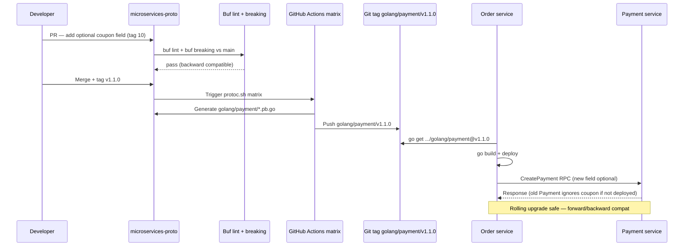

### 📖 Chapter Summary

Chapter 3 is where Babal (*gRPC Microservices in Go*, Ch.3) moves from architecture diagrams to **contract-first engineering**: define messages and services in **proto3**, understand the **binary wire format** (field tags, Varints, wire types), generate **Go stubs** with `protoc`/`protoc-gen-go`/`protoc-gen-go-grpc`, and publish them from a **centralized proto repository** with **subfolder Git tags** (`golang/payment/v1.0.0`). The chapter closes with **compatibility rules** — unknown fields, `reserved`, `oneof` traps, and semantic versioning — that keep polyglot microservices safe during rolling upgrades.

Shuiskov (*Microservices with Go, 2nd Edition*, Ch.4 Serialization + Ch.5 gRPC intro) complements Babal with a **format comparison** (JSON vs Protobuf benchmarks) and the **synchronous RPC mental model** that stubs implement. Internet practice in **2026** adds **Buf** (`buf lint`, `buf breaking`, `buf generate`), **pinned plugin versions**, and **`grpc.NewClient`** when consuming generated stubs.

This guide maps Babal's encoding mechanics (Fig 3.1, 3.2) and CI pipeline (Fig 3.3) to the companion **`microservices-proto`** module and flags what a senior engineer would harden on day one.

**Sources**

| Reference | Chapter / Section | Focus |
|-----------|-------------------|-------|
| Babal | Ch.3 — Getting up and running with gRPC and Golang | proto3, wire encoding, stub codegen, proto repo, compatibility |
| Shuiskov | Ch.4 — Serialization formats; Ch.5 — gRPC intro | JSON vs Protobuf, RPC types, contract-first APIs |
| Repo | `https://github.com/huseyinbabal/microservices-proto` | Centralized `.proto`, `protoc.sh`, matrix CI, Go submodules |
| Internet (2026) | Buf, grpc-go releases, protobuf.dev | `buf breaking`, pinned `protoc-gen-*`, `grpc.NewClient` |

---

#### 🆕 Key New Concepts & Technologies

| **Concept / Technology** | **Short Description** | **Babal** | **Shuiskov** | **Repo** | **2026** |
|:--|:--|:--|:--|:--|:--|
| **proto3** | Simplified Protobuf IDL syntax | Core Ch.3 contract language | Ch.4 serialization context | `order/`, `payment/` `.proto` | Still default; use `optional` for presence |
| **Field numbers (tags)** | Permanent binary identifiers for fields | Tags 1–15 = 1-byte overhead | Schema evolution in Ch.4 | Tags in `payment.proto` | Never change after production |
| **Varint / MSB** | Variable-length integer encoding | Fig 3.1, 3.2 wire mechanics | Binary size advantage vs JSON | Implicit in all stubs | Wire type 0 for Varint scalars |
| **Wire types** | 3-bit decoder hint in metadata byte | Fig 3.1 (type 0 = Varint) | Ch.4 binary formats | Generated marshal code | Document in Buf STYLE guide |
| **`repeated`** | Zero-or-more ordered field rule | `CreateOrderRequest.items` | Slice mapping in Go | Order line items | Prefer over manual arrays |
| **`reserved`** | Block deleted tag numbers/names | Compatibility section | Ch.4 evolution rules | Required on field deletion | Enforced by `buf breaking` |
| **`oneof`** | Mutually exclusive field group | Compatibility traps | Polymorphic payloads | Use sparingly in v1 | Prefer new message/RPC over migration |
| **Stub generation** | IDL → `*.pb.go` + `*_grpc.pb.go` | Listing 3.1 `protoc` flags | `protoc` / `gen/` pattern | `protoc.sh` automation | Prefer `buf generate` |
| **Centralized proto repo** | Single contract source of truth | `microservices-proto` pattern | In-repo `gen/` alternative | `github.com/huseyinbabal/microservices-proto` | Buf Schema Registry optional |
| **Subfolder Git tags** | `golang/order/v1.0.0` for Go modules | Listing 3.2 `run.sh` | Module path per service | Tags on `golang/{service}/` | Pin `@v1.x.y` in consumers |
| **Backward / forward compat** | Old↔new code coexistence | Unknown fields, defaults | Ch.4 safe evolution | Rolling Order/Payment deploys | `buf breaking` in every PR |
| **`optional` keyword** | Explicit field presence in proto3 | Payment `vat` example | Wrappers / presence | Add for business-critical zeros | Generates `Has<Field>()` |
| **Semantic versioning** | Major.Minor.Patch contract signals | Tag `v1.0.0` triggers CI | Version API modules | `golang/payment/v1.0.38` | Major = breaking proto change |

---

#### 📊 Comparison at a Glance

| Topic | Babal Ch.3 | Shuiskov Ch.4–5 | Repo (`microservices-proto`) | Current practice (2026) |
|-------|------------|-----------------|------------------------------|-------------------------|
| **IDL** | proto3 messages + services | Protobuf in serialization survey | `payment/payment.proto` | Buf `STANDARD` lint |
| **Encoding** | Varint, MSB, wire types (Fig 3.1–3.2) | JSON ~106B vs Proto ~63B benchmark | Opaque in generated code | Understand wire format for debugging |
| **Codegen** | `protoc` + `paths=source_relative` | `protoc` → `gen/` | `protoc.sh` on tag push | `buf generate` + pinned plugins |
| **Proto location** | Dedicated repo (Fig 3.3) | Can live in service repo | Separate GitHub repo ✓ | Monorepo or BSR; never copy `.pb.go` |
| **Versioning** | Subfolder tags + semver tags | Module version imports | Matrix CI for 3 services | `buf breaking` gates + semver |
| **Client API** | Preview `NewOrderClient` | `grpc.Dial` examples | Consumed via `go get` module | `grpc.NewClient` + pinned proto module |
| **Compatibility** | `reserved`, `oneof` warnings | Safe field addition rules | Manual review only | Automated `buf breaking` against `main` |

---

## Part 1: proto3 Fundamentals and Message Design

### 📌 Concepts Explained

- **`.proto` as source of truth**: The Interface Definition Language (IDL) describes messages (data) and services (RPC methods) independently of Go, Java, or Python implementations.
- **`syntax = "proto3"`**: Declares the Protobuf language version — simplified semantics (no `required`, implicit optional scalars with defaults).
- **Scalar types**: `string`, `bytes`, `bool`, `int32`, `int64`, `uint32`, `uint64`, `float`, `double`, `enum` — mapped to Go types by `protoc-gen-go`.
- **Field numbers (tags)**: Permanent identifiers used on the wire instead of field names — **never reuse** after production.
- **Tags 1–15 optimization**: Field numbers 1 through 15 encode tag metadata in **1 byte**; 16–2047 need **2+ bytes** — assign hot fields to low tags.
- **`repeated`**: Ordered list of zero or more values (maps to Go slices); use for line items, tags, IDs.
- **Naming**: `snake_case` in `.proto`; compiler generates `PascalCase` / `CamelCase` in Go.

### 🔧 Babal — Message Definitions (Ch.3)

In gRPC microservices, every cross-service call starts with a `.proto` contract. Babal's `CreateOrderRequest` demonstrates the core field rules: singular scalars, nested messages, and `repeated` collections.

**Design principles Babal emphasizes:**
- Declare `syntax = "proto3"` and a `package` (e.g. `order.v1`) for namespacing.
- Put high-frequency fields on tags **1–15** to minimize per-field wire overhead.
- Use nested `message` types for structured repeated data (`Item` inside `CreateOrderRequest`).

### 🔧 Shuiskov — Schema as API Boundary (Ch.4–5)

Shuiskov frames Protobuf as the **contract layer** for synchronous communication: explicit types prevent the "shared DTO library" antipattern across microservices. Ch.5 introduces gRPC as the runtime that carries these serialized messages over HTTP/2 — Ch.3 in Babal is the prerequisite tooling chapter.

### 💻 Babal — Order Message with Field Rules

```protobuf
// order/order.proto (Babal pattern)
syntax = "proto3";

package order.v1;

option go_package = "github.com/huseyinbabal/microservices-proto/golang/order";

message CreateOrderRequest {
  int64 user_id = 1;        // hot field → tag 1 (1-byte tag overhead)
  repeated Item items = 2;  // ordered list → Go []Item
  float amount = 3;         // scalar; maps to float32 in Go
}

message Item {
  string name = 1;
  int32 quantity = 2;
}

service OrderService {
  rpc Create(CreateOrderRequest) returns (CreateOrderResponse);
}

message CreateOrderResponse {
  string order_id = 1;
}
```

### 📊 Scalar Type Mapping (proto3 → Go)

| Protobuf type | Go type (generated) | Notes |
|---------------|---------------------|-------|
| `int32`, `int64` | `int32`, `int64` | `int64` for IDs; Varint-sized on wire |
| `string` | `string` | UTF-8; length-delimited wire type |
| `float` | `float32` | 4-byte IEEE |
| `double` | `float64` | 8-byte IEEE |
| `bool` | `bool` | Encoded as Varint 0/1 |
| `bytes` | `[]byte` | Opaque binary blob |
| `repeated T` | `[]T` | Preserves order |

### 📊 Directory Tree — Proto Source Layout (Babal / Repo)

```
microservices-proto/
├── order/
│   └── order.proto          # service + messages
├── payment/
│   └── payment.proto
├── shipping/
│   └── shipping.proto
├── golang/                  # generated Go stubs (committed)
│   ├── order/
│   │   ├── order.pb.go
│   │   └── order_grpc.pb.go
│   ├── payment/
│   └── shipping/
├── protoc.sh                # generate + tag + push
└── .github/workflows/
    └── protoc.yaml          # matrix CI on version tags
```

### 🧪 Interview Q&A

**Q1:** Why does Protobuf use field numbers instead of field names on the wire?

**Q2:** Why should frequently transmitted fields use tags 1–15?

**Q3:** What does `repeated` mean in proto3, and how does it map to Go?

**Q4:** What is the proto3 default value for an unset `int64` field?

**Q5:** Why use `snake_case` in `.proto` files when Go uses `CamelCase`?

> [!success]- 📋 Answers — Part 1
> **A1:** Field names would bloat every message with string metadata. Tag numbers are compact (1 byte for tags 1–15) and stable across renames — only the number matters on the wire.
>
> **A2:** Tags 1–15 combine with wire type in a single metadata byte; tags ≥16 need at least two bytes. High-traffic fields benefit from lower overhead and faster marshal/unmarshal.
>
> **A3:** `repeated` means zero or more values in order — equivalent to a Go slice (`[]Item`). It is not a fixed-size array.
>
> **A4:** `0`. In proto3, absent scalar fields are indistinguishable from "set to zero" unless you use `optional`, wrapper types, or `oneof`.
>
> **A5:** Protobuf style convention is `snake_case` across all languages. `protoc-gen-go` auto-generates idiomatic Go field names (`user_id` → `UserId` or `UserID` per protoc version).

---

## Part 2: Binary Wire Encoding — Varints, MSB, and Wire Types

### 📌 Concepts Explained

- **Wire format**: Protobuf serializes messages to a compact `[]byte` — not JSON text. gRPC carries these bytes in HTTP/2 DATA frames.
- **Metadata byte**: Each field starts with a byte combining **wire type** (low 3 bits) and **field number** (upper bits).
- **Wire types** (decoder hints): Type 0 = Varint; Type 1 = 64-bit; Type 2 = length-delimited (strings, bytes, embedded messages); Type 5 = 32-bit.
- **Varint**: Variable-length integer encoding — small values use fewer bytes.
- **MSB continuation bit**: The most significant bit of each Varint byte is `1` if more bytes follow, `0` on the final byte.
- **Little-endian base-128**: Varint chunks are 7 data bits per byte, least significant group first.

### 🔧 Babal — Figure 3.1: Single-Field Encoding (`user_id = 65`)

For `int64 user_id = 1` with value `65`:

```
Message on wire (conceptual):
┌──────────────────┬──────────────────┐
│  Metadata byte   │   Data byte(s)   │
│  wire_type + tag │   Varint value   │
└──────────────────┴──────────────────┘

Metadata byte breakdown:
  Bits 0-2: wire type = 0 (Varint)
  Bits 3+:  field number = 1
  → Combined: 0x08 (0000 1000)

Data byte for value 65:
  0x41 (0100 0001) — MSB = 0 → single-byte Varint complete
```

The marshaler never sends `"user_id"` — only tag `1`, wire type `0`, and the Varint `65`.

### 🔧 Babal — Figure 3.2: Values Larger Than 127 (`21567`)

When a value exceeds 127 (max 7-bit chunk), Varint uses multiple bytes:

1. Convert decimal `21567` to binary.
2. Split into 7-bit groups.
3. Reverse order (little-endian base-128).
4. Set MSB=`1` on all but the last byte; MSB=`0` on the final byte.

```
21567 decimal → 3 Varint bytes (MSB continuation on first two)

Byte 1: MSB=1 │ 7 data bits (least significant group)
Byte 2: MSB=1 │ 7 data bits
Byte 3: MSB=0 │ 7 data bits (final)
```

**Practical rule:** A scalar that was 1 byte on the wire at value `65` may become 2–3 bytes at `21567` — payload size is **data-dependent**, not fixed like fixed-width binary structs.

### 📊 Wire Type Reference (Fig 3.1 context)

| Wire type | Name | Used for |
|-----------|------|----------|
| 0 | Varint | `int32`, `int64`, `uint32`, `uint64`, `bool`, `enum`, `sint32`, `sint64` |
| 1 | 64-bit | `fixed64`, `sfixed64`, `double` |
| 2 | Length-delimited | `string`, `bytes`, embedded messages, `packed repeated` |
| 5 | 32-bit | `fixed32`, `sfixed32`, `float` |

### 💻 Go — Marshal and Inspect Wire Bytes

```go
package main

import (
    "fmt"

    "google.golang.org/protobuf/proto"
    paymentv1 "github.com/huseyinbabal/microservices-proto/golang/payment"
)

func main() {
    evt := &paymentv1.PaymentEvent{
        TransactionId: 65,       // Varint — likely 1 data byte
        Amount:        50.0,
        Currency:      "USD",
    }
    b, err := proto.Marshal(evt)
    if err != nil {
        panic(err)
    }
    fmt.Printf("len=%d hex=%x\n", len(b), b)
    // Small TransactionId keeps Varint compact; Currency adds length-delimited chunk
}
```

### 📊 Tag Overhead vs Value Size

| Field tag | Tag metadata size | Value 65 (Varint) | Value 21567 (Varint) |
|-----------|-------------------|-------------------|----------------------|
| `= 1` (hot) | 1 byte | 1 byte data | 3 bytes data |
| `= 16` (cold) | 2 bytes | 1 byte data | 3 bytes data |

### 🧪 Interview Q&A

**Q1:** What are the three low bits of the metadata byte used for?

**Q2:** What does MSB=`1` mean in Varint encoding?

**Q3:** What happens to message size when an integer value exceeds 127?

**Q4:** Why is `int64 user_id = 1` cheaper on the wire than `user_id = 16` when both hold the same value?

**Q5:** How does understanding wire format help in production debugging?

> [!success]- 📋 Answers — Part 2
> **A1:** They encode the **wire type** — telling the decoder how to parse the following bytes (Varint, 64-bit, length-delimited, etc.).
>
> **A2:** MSB=`1` is a **continuation flag** — another Varint byte follows. MSB=`0` marks the final byte of the integer.
>
> **A3:** The Varint expands to at least two bytes (often three for larger values) because each byte only carries 7 data bits.
>
> **A4:** Tag `1` encodes field metadata in 1 byte; tag `16` requires 2 bytes for the same wire type and value — tag choice affects overhead independent of value size.
>
> **A5:** You can explain unexpected payload growth, diagnose malformed messages, and reason about why hot fields belong on low tags — essential when optimizing high-QPS internal RPCs.

---

## Part 3: Serialization Comparison — Shuiskov vs Babal

### 📌 Concepts Explained

- **Serialization** converts in-memory structures to bytes for network transport; **deserialization** reverses the process.
- **JSON**: Human-readable, schema-less or JSON Schema — browsers and `curl` friendly; larger payloads, text parsing cost.
- **Protobuf**: Binary, schema-first — smaller payloads, faster marshal/unmarshal, multi-language codegen.
- **gRPC carries Protobuf** by default; REST typically carries JSON — Babal Ch.1 performance claims become measurable here.
- **Contract evolution**: Protobuf enforces explicit field tags; JSON APIs often evolve ad-hoc with optional fields and documentation drift.

### 🔧 Shuiskov — Ch.4 Serialization Benchmarks

Shuiskov compares formats on a representative metadata payload:

| Format | Approx. payload size | Marshal time (indicative) |
|--------|-------------------|---------------------------|
| JSON | ~106 bytes | ~342 ns |
| Protobuf | ~63 bytes | ~185 ns |

**Why Protobuf wins for internal RPC:**
- No field names on the wire (tags only).
- Binary encoding avoids UTF-8 text parsing.
- Known schema → optimized generated code in Go.

**When JSON still wins (Shuiskov + Babal):**
- Browser-facing public APIs without gRPC-Web.
- Ad-hoc debugging with `curl` and human inspection.
- Small teams with 1–2 services where proto pipeline cost exceeds benefit.

### 🔧 Babal — Performance Link to Ch.3 Encoding

Babal's Varint and tag-overhead lessons **explain** Shuiskov's numbers: Protobuf omits repeated field names, uses Varints for small integers, and length-prefixes strings once — JSON repeats keys like `"transaction_id"` on every message.

### 📊 Three-Way Comparison — Serialization Choice

| Criterion | Babal Ch.3 | Shuiskov Ch.4 | 2026 practice |
|-----------|------------|---------------|---------------|
| **Internal microservices** | Protobuf + gRPC default | Protobuf recommended | Buf-managed protos |
| **Public / browser API** | Gateway or gRPC-Web | REST/JSON common | gRPC-Gateway or Connect |
| **Schema enforcement** | `.proto` compile-time | `.proto` or hand-written | `buf lint` + CI |
| **Evolution safety** | Tags + `reserved` | Versioned messages | `buf breaking` |
| **Debugging** | `grpcurl`, hex dumps | JSON easy to read | `grpcurl` + Buf Studio |
| **Polyglot** | Codegen from IDL | Codegen from IDL | Same; BSR for sharing |

### 💻 Side-by-Side — Same Data, Two Formats

```go
// Shuiskov-style comparison in Go
type PaymentJSON struct {
    TransactionID int64   `json:"transaction_id"`
    Amount        float64 `json:"amount"`
    Currency      string  `json:"currency"`
}

// JSON: protojson or encoding/json → ~106B with key names
// Protobuf: proto.Marshal → ~63B with tag numbers (Shuiskov Ch.4 benchmark)
```

```protobuf
// Equivalent Protobuf (Babal Ch.3)
message PaymentEvent {
  int64 transaction_id = 1;
  double amount = 2;
  string currency = 3;
  string correlation_id = 16;  // infrequent → tag 16 (2-byte metadata)
}
```

### 📊 Payload Anatomy

```
JSON on wire:
{"transaction_id":99,"amount":50.0,"currency":"USD"}
↑ field names repeated every message

Protobuf on wire:
[tag+type][varint 99][tag+type][8-byte double][tag+type][len]["USD"]
↑ only varint tag numbers, no string keys
```

### 🧪 Interview Q&A

**Q1:** Why is Protobuf typically smaller than JSON for the same struct?

**Q2:** When would Shuiskov still choose JSON over Protobuf?

**Q3:** How does Babal's tag 1–15 rule relate to Shuiskov's size benchmarks?

**Q4:** What is the "shared model library" antipattern, and how does Protobuf avoid it?

**Q5:** Does smaller payload always mean lower end-to-end latency?

> [!success]- 📋 Answers — Part 3
> **A1:** Protobuf sends numeric field tags instead of string keys, uses binary encoding (Varints, fixed-width floats), and avoids JSON syntax characters (`{`, `"`, `:`).
>
> **A2:** Public browser APIs, quick MVPs with one service, teams prioritizing human-readable debugging, or consumers without proto tooling.
>
> **A3:** Low tag numbers reduce per-field metadata bytes — compounding Shuiskov's already smaller Protobuf payloads on high-QPS paths.
>
> **A4:** Sharing Go struct packages across services couples deployments and breaks polyglot teams. Protobuf generates **per-service stubs** from one IDL without sharing implementation code.
>
> **A5:** No — network RTT, TLS, DB calls, and serialization CPU all contribute. Protobuf helps CPU and bandwidth but does not eliminate distributed-system latency.

---

## Part 4: Stub Generation — protoc, Plugins, and Go Output

### 📌 Concepts Explained

- **gRPC stub**: Generated client code implementing remote RPC methods locally — handles marshal, HTTP/2 transport hooks, and unmarshal.
- **`protoc`**: The Protocol Buffers compiler — parses `.proto` and invokes language plugins.
- **`protoc-gen-go`**: Plugin generating `*.pb.go` — message structs, `proto.Marshal`, getters.
- **`protoc-gen-go-grpc`**: Plugin generating `*_grpc.pb.go` — `RegisterXServer`, `NewXClient`, service interfaces.
- **`paths=source_relative`**: Output mirrors input directory structure — critical for predictable Go module layout.
- **Two-file split**: Message code separate from gRPC service code — consumers can import messages without server interfaces.

### 🔧 Babal — Listing 3.1 Toolchain

**Book installation:**

```bash
go install google.golang.org/protobuf/cmd/protoc-gen-go@latest
go install google.golang.org/grpc/cmd/protoc-gen-go-grpc@latest
```

**Book generation command:**

```bash
protoc -I ./proto \
  --go_out ./golang \
  --go_opt paths=source_relative \
  --go-grpc_out ./golang \
  --go-grpc_opt paths=source_relative \
  ./proto/order.proto
```

**Why `paths=source_relative` is mandatory (Babal):** Without it, `protoc` nests output under full `go_package` path segments — breaking clean `golang/order/` module trees and confusing imports.

### 🔧 2026 — Pinned Plugins + Buf

```bash
# Pin versions for reproducible CI (Go 1.22+)
go install google.golang.org/protobuf/cmd/protoc-gen-go@v1.36.5
go install google.golang.org/grpc/cmd/protoc-gen-go-grpc@v1.5.1
go install github.com/bufbuild/buf/cmd/buf@v1.50.0
```

```yaml
# buf.gen.yaml (2026 standard)
version: v2
plugins:
  - remote: buf.build/protocolbuffers/go
    out: golang
    opt: paths=source_relative
  - remote: buf.build/grpc/go
    out: golang
    opt: paths=source_relative
```

```bash
buf lint && buf generate
```

### 💻 Generated Files — What Each Contains

| File | Generated by | Contents |
|------|--------------|----------|
| `order.pb.go` | `protoc-gen-go` | `CreateOrderRequest` struct, `ProtoReflect`, `Marshal`/`Unmarshal` |
| `order_grpc.pb.go` | `protoc-gen-go-grpc` | `OrderServiceClient`, `OrderServiceServer`, `RegisterOrderServiceServer` |

**Naming convention (Babal):** `NewOrderServiceClient(conn)` — `New` + `ServiceName` + `Client`.

### 💻 Consuming Stubs — Book vs 2026

```go
import (
    "context"
    "time"

    "google.golang.org/grpc"
    "google.golang.org/grpc/credentials/insecure"

    orderv1 "github.com/huseyinbabal/microservices-proto/golang/order"
)

func dialOrder() (orderv1.OrderServiceClient, error) {
    // Babal / early book: grpc.Dial(url, grpc.WithInsecure())

    // 2026 (grpc-go v1.67+): grpc.NewClient replaces deprecated Dial
    conn, err := grpc.NewClient("order:8080",
        grpc.WithTransportCredentials(insecure.NewCredentials()),
    )
    if err != nil {
        return nil, err
    }

    client := orderv1.NewOrderServiceClient(conn)

    ctx, cancel := context.WithTimeout(context.Background(), 5*time.Second)
    defer cancel()

    _, err = client.Create(ctx, &orderv1.CreateOrderRequest{UserId: 100})
    return client, err
}
```

### 📊 Stub Generation Pipeline (Babal Fig 3.3 preview)

```
.proto file
    │
    ▼
┌─────────┐     ┌──────────────────┐     ┌───────────────────┐
│ protoc  │────►│ protoc-gen-go    │────►│ order.pb.go       │
│ (or Buf)│     └──────────────────┘     └───────────────────┘
│         │     ┌──────────────────┐     ┌───────────────────┐
│         │────►│ protoc-gen-go-grpc│────►│ order_grpc.pb.go  │
└─────────┘     └──────────────────┘     └───────────────────┘
    │
    ▼
go mod init → git tag golang/order/v1.0.0 → consumer go get
```

### 🧪 Interview Q&A

**Q1:** What is the difference between `order.pb.go` and `order_grpc.pb.go`?

**Q2:** Why is `paths=source_relative` necessary?

**Q3:** What is the generated client constructor naming convention?

**Q4:** Why pin `protoc-gen-go` versions in CI instead of `@latest`?

**Q5:** When would you import `*.pb.go` without `*_grpc.pb.go`?

> [!success]- 📋 Answers — Part 4
> **A1:** `order.pb.go` has message types and serialization; `order_grpc.pb.go` has gRPC client/server interfaces and registration helpers.
>
> **A2:** It places generated Go files beside their logical module path (`golang/order/`) instead of deep nesting from `go_package`, keeping imports stable.
>
> **A3:** `New<ServiceName>Client` — e.g. `NewOrderServiceClient`, `NewPaymentServiceClient`.
>
> **A4:** Unpinned plugins can change generated APIs between CI runs, causing noisy diffs or subtle breaking changes in committed stubs.
>
> **A5:** When a component only needs message types (events, logging, validators) without making RPC calls — e.g. Kafka consumer unmarshaling `PaymentEvent`.

---

## Part 5: Centralized Proto Repository and CI Automation

### 📌 Concepts Explained

- **Centralized proto repo**: All `.proto` files live in one repository (e.g. `microservices-proto`) — single source of truth for Go, Java, Python consumers.
- **Avoids circular dependencies**: Service repos import stubs; they don't each own conflicting copies of the same `.proto`.
- **Subfolder Git tags**: Go modules in subdirectories require tags like `golang/payment/v1.0.0` — not just `v1.0.0` at repo root.
- **`protoc.sh` / `run.sh`**: Bash script automating generate → commit → tag → push — eliminates manual stub drift.
- **Matrix CI strategy**: One workflow file runs parallel jobs per service (`order`, `payment`, `shipping`).
- **Trigger on semver tag**: Push `v1.0.0` → extract version → matrix generates all service stubs.

### 🔧 Babal — Fig 3.3 Automatic Generation Flow

1. Developer updates `payment/payment.proto` in **central repo**.
2. Maintainer tags `v1.0.38` (or similar release).
3. GitHub Actions matrix invokes `protoc.sh` per service.
4. Script generates Go stubs under `golang/{service}/`, commits, pushes `golang/{service}/v1.0.38` tag.
5. **Order** and **Payment** services run `go get ...@v1.0.38` — reproducible contract.

### 🔧 Repo Snapshot — `microservices-proto` Layout

```
microservices-proto/                    # github.com/huseyinbabal/microservices-proto
├── order/order.proto
├── payment/payment.proto
├── shipping/shipping.proto
├── golang/
│   ├── go.mod                          # shared module root (repo)
│   ├── order/   → order.pb.go, order_grpc.pb.go
│   ├── payment/ → payment.pb.go, payment_grpc.pb.go
│   └── shipping/
├── protoc.sh                           # Babal Listing 3.2 pattern
└── .github/workflows/protoc.yaml       # matrix: order, payment, shipping
```

### 💻 Babal — `run.sh` / `protoc.sh` Pattern

```bash
#!/bin/bash
SERVICE_NAME=$1
RELEASE_VERSION=$2

protoc --go_out=./golang --go_opt=paths=source_relative \
  --go-grpc_out=./golang --go-grpc_opt=paths=source_relative \
  ./${SERVICE_NAME}/*.proto

cd golang/${SERVICE_NAME}
go mod init github.com/huseyinbabal/microservices-proto/golang/${SERVICE_NAME} || true
go mod tidy
cd ../../

git add . && git commit -am "proto update" || true
git push origin HEAD:main
git tag -fa golang/${SERVICE_NAME}/${RELEASE_VERSION} \
  -m "golang/${SERVICE_NAME}/${RELEASE_VERSION}"
git push origin refs/tags/golang/${SERVICE_NAME}/${RELEASE_VERSION}
```

### 💻 Consumer — Pin Module Version (Babal Ch.5 preview)

```bash
# In order/go.mod — never @latest in production
go get github.com/huseyinbabal/microservices-proto/golang/payment@v1.0.38
go get github.com/huseyinbabal/microservices-proto/golang/order@v1.0.38
```

### 📊 GitHub Actions Matrix (Babal / Repo)

```yaml
# .github/workflows/protoc.yaml (book + repo pattern; 2026: bump action versions)
name: "Protocol Buffer Go Stubs Generation"
on:
  push:
    tags:
      - v**
jobs:
  protoc:
    runs-on: ubuntu-latest
    strategy:
      matrix:
        service: ["order", "payment", "shipping"]
    steps:
      - uses: actions/setup-go@v5
        with:
          go-version: "1.23"
      - uses: actions/checkout@v4
      - name: Extract Release Version
        run: echo "RELEASE_VERSION=${GITHUB_REF#refs/*/}" >> $GITHUB_ENV
      - name: Generate for Golang
        run: ./protoc.sh ${{ matrix.service }} ${{ env.RELEASE_VERSION }}
```

### 📊 Centralized vs In-Repo Proto (Babal vs Shuiskov)

| Approach | Babal | Shuiskov | 2026 |
|----------|-------|----------|------|
| **Location** | Dedicated `microservices-proto` repo | `gen/` inside service repo | Dedicated repo or Buf BSR |
| **Consumption** | `go get` versioned submodule | Local import `gen/go/...` | Pin module version |
| **Polyglot** | Same `.proto` → Java, Go | Often Go-only in examples | Buf generates all targets |
| **CI** | Tag-triggered matrix | `make proto` in service CI | `buf generate` + `buf breaking` |

### 🧪 Interview Q&A

**Q1:** Why maintain `.proto` files in a separate repository?

**Q2:** Why are subfolder tags (`golang/order/v1.0.0`) required for Go?

**Q3:** How does the GitHub Actions matrix strategy improve CI efficiency?

**Q4:** What problem does atomic `protoc.sh` tagging solve?

**Q5:** What happens if Order pins `payment@v1.0.38` but Payment deploys with expectations from `v1.0.40`?

> [!success]- 📋 Answers — Part 5
> **A1:** Single contract source for polyglot consumers; prevents circular deps between service repos; enables independent versioning and CI stub publication.
>
> **A2:** Go module resolution uses Git tags matching the **module path prefix**. A module at `.../golang/order` needs tag `golang/order/v1.0.0`, not root `v1.0.0`.
>
> **A3:** One workflow file parallelizes stub generation for order, payment, and shipping — DRY maintenance, faster releases, consistent plugin versions.
>
> **A4:** Guarantees the Git tag points exactly to the generated code from that proto release — no hand-edited `.pb.go` drift.
>
> **A5:** If proto changes are backward-compatible, mixed versions often work (forward compat). If incompatible, you get runtime decode errors or logical bugs — pin and upgrade deliberately with contract tests.

---

## Part 6: Backward and Forward Compatibility

### 📌 Concepts Explained

- **Backward compatibility**: Newer code reads data from older producers — existing clients keep working after server upgrade.
- **Forward compatibility**: Older code reads data from newer producers — old servers ignore fields they don't know.
- **Unknown fields**: Proto3 parsers preserve and skip unrecognized tags — no parse failure on extra fields.
- **Tag numbers are identity**: Renaming `user_id` → `customer_id` is safe if tag stays `1`; changing tag `1` from `int64` to `string` is **breaking**.
- **`optional` keyword**: Restores explicit presence in proto3 — generates `HasVat()` / `GetVat()` for distinguishing unset from zero.
- **Safe changes**: Add new fields with new tags; add new RPC methods; add enum values (with caveats).
- **Unsafe changes**: Delete/rename tags without `reserved`; change field types; move fields into `oneof`.

### 🔧 Babal — Upgrade Scenarios

| Scenario | Behavior |
|----------|----------|
| **Server upgraded first** (new field `vat`) | Old client omits `vat` → server applies default (e.g. `DEFAULT_VAT`) |
| **Client upgraded first** (sends `vat`) | Old server treats `vat` as **unknown field** → ignored; request still succeeds |
| **Missing field** | Proto3 default (`0`, `""`, `false`) — server must not confuse "unset" with "explicit zero" for business logic |

### 🔧 Server Handling — Book vs 2026

```go
// Babal — default VAT when old clients omit field
func (p *Payment) Create(ctx context.Context, req *pb.CreatePaymentRequest) (*pb.CreatePaymentResponse, error) {
    vat := 0.20 // DEFAULT_VAT
    if req.GetVat() != 0 {
        vat = req.GetVat()
    }
    return &pb.CreatePaymentResponse{
        TotalPrice: req.GetPrice() * (1 + vat),
    }, nil
}
```

```protobuf
// 2026 — optional for true presence semantics
message CreatePaymentRequest {
  double price = 1;
  optional double vat = 2;  // HasVat() distinguishes unset vs 0.0
}
```

```go
// 2026 — explicit presence check
if req.HasVat() {
    vat = req.GetVat()
} else {
    vat = 0.20
}
```

### 📊 Compatibility Matrix

| Change | Backward compat | Forward compat | Semver bump |
|--------|-----------------|----------------|-------------|
| Add field with new tag | ✓ | ✓ | Minor |
| Add RPC method | ✓ (old clients unaffected) | ✓ | Minor |
| Delete field without `reserved` | ✗ | ✗ | Major (blocked) |
| Change field type on same tag | ✗ | ✗ | Major |
| Rename field, same tag | ✓ on wire | ✓ on wire | Minor (source break only) |

### 📊 Unknown Field Flow

```
Client v2 message:  [tag 1: price][tag 2: vat][tag 3: promo_code]
                              │
                              ▼
Server v1 schema:     knows tag 1 only
                              │
                              ▼
                      Processes price; skips tags 2,3 as unknown
                      Request succeeds (forward compatibility)
```

### 🧪 Interview Q&A

**Q1:** What is the difference between backward and forward compatibility?

**Q2:** Why is it safe for a new client to send a field an old server does not recognize?

**Q3:** How should a server handle a missing `vat` field from an old client?

**Q4:** Why can't proto3 distinguish "unset" from "zero" without `optional`?

**Q5:** Is renaming a field from `user_id` to `customer_id` a wire-format breaking change?

> [!success]- 📋 Answers — Part 6
> **A1:** **Backward**: new code reads old messages. **Forward**: old code reads new messages (unknown fields skipped).
>
> **A2:** Proto3 implementations skip unknown fields by tag — the server still parses known fields and completes the RPC.
>
> **A3:** Apply a documented default (e.g. standard VAT rate) or reject if business rules require explicit values — prefer `optional` when zero is valid input.
>
> **A4:** Proto3 scalars always have default values when absent on the wire; without `optional`/wrappers, `vat=0` looks identical to "not sent."
>
> **A5:** No — wire format uses tag numbers, not names. Source-level renames affect generated code but not binary compatibility if the tag is unchanged.

---

## Part 7: Hardening Contracts — reserved, oneof, Buf, and Repo Snapshot

### 📌 Concepts Explained

- **`reserved`**: After deleting a field, reserve its number and name so future developers cannot accidentally reuse them with a different type.
- **`oneof`**: Only one member of the group can be set — efficient for mutually exclusive options; **risky to migrate into/out of**.
- **`buf breaking`**: Compares PR protos against `main` — blocks tag deletion, type changes, and other wire-breaking edits.
- **Semantic versioning**: `v1.2.3` — **Major** for breaking proto, **Minor** for backward-compatible additions, **Patch** for non-API fixes.
- **Repo snapshot**: The companion `microservices-proto` repo implements Babal's pattern but has gaps vs 2026 senior standards.

### 🔧 Babal — `reserved` and Safe Evolution

```protobuf
syntax = "proto3";
package payment.v1;

message CreatePaymentRequest {
  reserved 5, 6;
  reserved "old_promo_code", "legacy_card_token";

  double price = 1;
  optional double vat = 2;

  oneof payment_method {
    string credit_card_id = 3;
    string apple_pay_id = 4;
  }
}
```

**Rules:**
- Delete field `old_promo_code` at tag 5 → immediately `reserved 5` and `reserved "old_promo_code"`.
- Never reassign tag 5 to a `string` if it was once an `int64` — old clients would misdecode.

### 🔧 The `oneof` Trap (Babal)

| Action | Risk |
|--------|------|
| Add new arm to `oneof` | Usually safe (new tag) |
| Remove arm from `oneof` | **Breaking** — old clients still send it → treated as unknown → **data loss** |
| Move plain field into `oneof` | **Dangerous** — client setting both loses one value on the wire |

**Senior mitigation:** Prefer a new message type (`CreatePaymentRequestV2`) or new RPC rather than in-place `oneof` surgery.

### 🔧 2026 — `buf breaking` in CI

```yaml
# .github/workflows/proto-compat.yaml
name: Proto Compatibility
on: [pull_request]
jobs:
  breaking:
    runs-on: ubuntu-latest
    steps:
      - uses: actions/checkout@v4
      - uses: bufbuild/buf-setup-action@v1
      - run: buf lint
      - uses: bufbuild/buf-breaking-action@v1
        with:
          against: "https://github.com/${{ github.repository }}.git#branch=main"
```

```bash
# Local check before push
buf lint
buf breaking --against '.git#branch=main'
```

### 📊 Semantic Versioning for Proto Modules

| Release | Proto change example | Consumer action |
|---------|---------------------|-----------------|
| **v1.0.0 → v1.1.0** | Add `optional string coupon = 10` | Safe to upgrade; recompile |
| **v1.1.0 → v1.1.1** | CI/script fix only | Optional upgrade |
| **v1.x → v2.0.0** | Remove RPC; retag field | Coordinated upgrade required |

### ✅ Ahead of the Books — `microservices-proto`

| Area | Status |
|------|--------|
| Centralized proto repo | ✓ Dedicated `microservices-proto` repository |
| Per-service `.proto` | ✓ `order/`, `payment/`, `shipping/` |
| Generated Go stubs committed | ✓ `golang/{service}/*.pb.go` |
| Subfolder Git tags | ✓ `golang/{service}/{version}` via `protoc.sh` |
| Matrix CI on version tags | ✓ `.github/workflows/protoc.yaml` |
| `paths=source_relative` | ✓ In `protoc.sh` |
| Polyglot-ready layout | ✓ Java/other gens possible from same protos |

### ⚠️ Gaps vs 2026 Senior Standards

| Gap | Risk | Priority |
|-----|------|----------|
| No `buf lint` / `buf breaking` in CI | Accidental wire-breaking proto merges | 🔴 High |
| `@latest` on `protoc-gen-go` in `protoc.sh` | Non-reproducible stub diffs | 🟡 Medium |
| `actions/setup-go@v2`, `checkout@v2` | Outdated CI; missing security fixes | 🟡 Medium |
| No `optional` / presence on critical fields | Cannot distinguish zero vs unset | 🟡 Medium |
| Book still teaches raw `protoc` only | Teams skip lint/breaking gates | 🟡 Medium |
| Consumer docs don't mandate pin | `@latest` stub pulls break builds | 🔴 High |

### 📊 Repo vs 2026 Tooling

| Step | Babal / current repo | 2026 recommendation |
|------|---------------------|----------------------|
| Lint | Manual review | `buf lint` (STANDARD) |
| Breaking detection | Human vigilance | `buf breaking` on every PR |
| Generate | `protoc.sh` | `buf generate` + locked plugins |
| Publish | Git subfolder tags | Same + optional Buf Schema Registry |
| Consume | `go get ...@v1.0.38` | Same + `grpc.NewClient` in services |

### 🧪 Interview Q&A

**Q1:** Why must deleted field numbers be added to `reserved`?

**Q2:** Why is removing a field from a `oneof` backward-incompatible?

**Q3:** What does `buf breaking` detect that code review might miss?

**Q4:** When should you bump the major version of a proto module?

**Q5:** What is the highest-priority gap in `microservices-proto` vs 2026 standards?

> [!success]- 📋 Answers — Part 7
> **A1:** Prevents reuse of the same tag with a different type — which would cause silent data corruption when old and new binaries coexist.
>
> **A2:** Old clients still send that oneof arm; new servers no longer recognize it as part of the group — data is dropped as unknown or misinterpreted.
>
> **A3:** Wire-breaking changes: field type swaps, tag renumbering, deleting fields without reserve, incompatible `oneof` edits — binary issues invisible in textual diff review.
>
> **A4:** Breaking wire or RPC contract changes: removing fields/RPCs, changing types on existing tags, incompatible JSON/binary mapping changes requiring coordinated consumer updates.
>
> **A5:** Missing automated `buf breaking` (and consumers not pinning versions) — highest risk of production incompatibility during rolling deploys.

---

## Part 8: Senior Recommendations and End-to-End Proto Lifecycle

### 📌 Concepts Explained

- **Contract-first workflow**: Proto change → lint/breaking CI → stub publish → consumer pin → deploy — not "edit `.pb.go` by hand."
- **Tags are permanent**: Optimize 1–15 for hot fields; `reserved` on delete; never change types on existing tags.
- **Presence matters**: Use `optional` when `0` or `""` is valid business input.
- **Centralize + version**: One proto repo, subfolder module tags, semver signals.
- **Automate gates**: `buf lint` + `buf breaking` before any tag push.
- **Consume with modern grpc-go**: `grpc.NewClient`, pinned proto modules, OTel handlers (Ch.5+).

### 🔧 Combined Recommendations

| # | Recommendation | Babal | Shuiskov | 2026 |
|---|----------------|-------|----------|------|
| 1 | Treat `.proto` as the API source of truth | Ch.3 core | Ch.4 schema | Buf + VCS |
| 2 | Assign hot fields to tags 1–15 | Wire encoding section | Smaller payloads | Same + lint enforcement |
| 3 | Never copy `.pb.go` into service repos | Fig 3.3 flow | `gen/` import pattern | `go get` versioned module |
| 4 | Use `paths=source_relative` | Listing 3.1 | Directory-based gen | `buf.gen.yaml` opt |
| 5 | `reserved` on every field deletion | Compatibility section | Evolution rules | `buf breaking` enforces |
| 6 | Avoid risky `oneof` migrations | Compatibility traps | Prefer new messages | New RPC or v2 package |
| 7 | Pin proto + plugin versions | Tag-based releases | Module versions | No `@latest` anywhere |
| 8 | Add `buf breaking` before tag CI | Not in book | Not in Ch.4 | Mandatory on PR |
| 9 | Use `optional` for business-critical zeros | Payment VAT example | Wrapper types | `Has<Field>()` |
| 10 | Consume stubs with `grpc.NewClient` | Preview in Ch.3–5 | `grpc.Dial` | Deprecated Dial removed |

### 📊 End-to-End Flow — Proto Change to Running Consumer



### 🧪 Master Interview Q&A

**Q1:** Walk through Babal's stub generation pipeline from `.proto` to Order service import.

**Q2:** Explain Varint encoding and why tag 1 is cheaper than tag 16 for metadata.

**Q3:** How do backward and forward compatibility enable rolling deployments?

**Q4:** What are the three most dangerous proto changes in production?

**Q5:** How would you modernize the book's `protoc.sh` workflow for a 2026 greenfield team?

> [!success]- 📋 Answers — Master Q&A
> **A1:** Define messages/services in central repo `.proto` → run `protoc` (or Buf) with `protoc-gen-go` + `protoc-gen-go-grpc` and `paths=source_relative` → commit `golang/{service}/*.pb.go` → tag `golang/{service}/vX.Y.Z` → Order runs `go get` on that module → imports `NewPaymentServiceClient` and calls RPCs.
>
> **A2:** Varint uses 7 bits per byte with MSB continuation; small integers use fewer bytes. Field metadata combines wire type + tag number — tags 1–15 fit in one byte with type; tag 16+ needs two bytes before value data.
>
> **A3:** **Forward**: old server skips unknown new fields from upgraded clients. **Backward**: new server applies defaults for missing fields from old clients. Together, Order and Payment can roll at different speeds without coordinated flag days.
>
> **A4:** (1) Reusing a tag with a new type without `reserved`. (2) Removing `oneof` arms clients still send. (3) Moving fields into `oneof` causing silent data loss when both old and new fields are set.
>
> **A5:** Add `buf.yaml` (STANDARD lint, FILE breaking), replace raw `protoc` with pinned `buf generate`, run `buf breaking` on every PR, bump CI actions to v4/v5, pin plugin versions, document consumer `go get` pins, and use `grpc.NewClient` in all examples.

---

### 💡 Pro Tips & Best Practices (Combined)

1. **Hot fields on tags 1–15** — every byte counts at thousands of RPCs per second.
2. **`reserved` immediately on deletion** — tag numbers are permanent identities, not recyclable integers.
3. **Never hand-edit `*.pb.go`** — regenerate; manual edits are overwritten and untracked.
4. **Use Buf from day one** — `buf lint`, `buf breaking`, `buf generate` replace fragile shell scripts.
5. **Pin `protoc-gen-go` and proto module versions** — `@latest` is for experiments, not production CI.
6. **`paths=source_relative` always** — predictable `golang/order/` trees match Go module paths.
7. **Prefer `optional` over guessing zero** — VAT, discounts, and limits often need presence semantics.
8. **Treat `oneof` as a last resort** — migrating into/out of oneof loses data; prefer new messages/RPCs.
9. **Subfolder tags for Go submodules** — `golang/payment/v1.0.0`, not repo-root `v1.0.0` alone.
10. **Atomic tag pushes via CI** — `protoc.sh` ensures the tag matches generated output exactly.
11. **Use `Get<Field>()` and `Has<Field>()`** — generated getters prevent nil issues and clarify presence.
12. **`grpc.NewClient` when wiring stubs** — `grpc.Dial` is deprecated; match the updated companion repo.

---

### 🔨 Hands-On Tasks

#### Task 1: Encode and decode a Varint message by hand
**Goal:** Internalize Babal Fig 3.1–3.2 wire format — not just use generated code blindly.
**Files:** Local sandbox `proto-lab/` with one `.proto` and a tiny Go `main.go`
**Steps:**
1. Define `message Lab { int64 user_id = 1; }` and run `buf generate` (or `protoc`).
2. Marshal `user_id=65` and `user_id=21567`; print `fmt.Printf("%x\n", b)`.
3. Compare byte lengths; verify metadata byte for tag 1 wire type 0 (`0x08`).
4. Document in notes: when value crosses 127, count extra Varint bytes.
**Done when:** You can predict whether a given `int64` value adds one or multiple data bytes and explain the MSB continuation rule.

#### Task 2: Central proto module with Buf breaking gate
**Goal:** Reproduce Babal Fig 3.3 with 2026 tooling — lint, generate, breaking check, tagged module.
**Files:** Sandbox repo `payments-proto/` (not production)
**Steps:**
1. `buf config init` — set `lint: STANDARD`, `breaking: FILE` in `buf.yaml`.
2. Add `payment/v1/payment.proto` with `Create` RPC; run `buf lint && buf generate`.
3. Tag `v0.1.0`; in a branch, try deleting a field without `reserved` — run `buf breaking --against '.git#tag=v0.1.0'` and confirm failure.
4. Fix with `reserved`, add new field, pass breaking; tag `v0.2.0`.
5. In a consumer `go.mod`, `go get your-module/golang/payment@v0.2.0` and call stub with `grpc.NewClient`.
**Done when:** Breaking check blocks the bad change; consumer builds against pinned `v0.2.0`.

---

### 📚 Further Reading

| Resource | Topic |
|----------|-------|
| Babal Ch.4 | Microservice project setup — hexagonal layout |
| Babal Ch.5 | Interservice communication — consuming Payment stub |
| Shuiskov Ch.4 | Serialization formats — JSON, Protobuf, benchmarks |
| Shuiskov Ch.5 | Synchronous communication — gRPC RPC types |
| [Protocol Buffers encoding](https://protobuf.dev/programming-guides/encoding/) | Official wire format reference |
| [gRPC Go quick start](https://grpc.io/docs/languages/go/quickstart/) | Server/client setup |
| [Buf docs](https://buf.build/docs) | Lint, breaking, code generation |
| [Go module versioning](https://go.dev/ref/mod#vcs-version) | Subdirectory semantic version tags |
| [grpc-go NewClient](https://github.com/grpc/grpc-go) | `Dial` deprecation notes |
| [microservices-proto repo](https://github.com/huseyinbabal/microservices-proto) | Book companion proto module |
| [microservices repo](https://github.com/huseyinbabal/microservices) | Order + Payment consumers |

---

### 🤖 Regenerate this guide

1. [[AI Prompt/00 - General Study Guide Prompt]] — fill Inputs table, copy full prompt
2. [[Go/AI Prompt - Go]] — append Go-specific instructions
3. [[Go/gRPC Microservices in Go/AI Prompt - grpc babal]] — append Babal/Shuiskov/internet source hierarchy

---

*Study guide for Getting up and running with gRPC and Golang (Ch.3), 2026.*