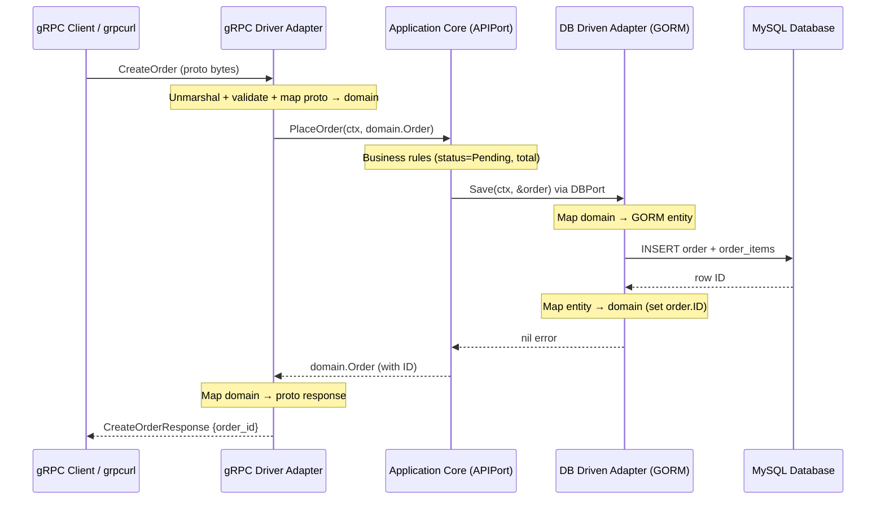

### 📖 Chapter Summary

Chapter 4 is where Babal (*gRPC Microservices in Go*, Ch.4) moves from gRPC theory to **building a real Go microservice** using **Hexagonal Architecture** (Ports and Adapters). The Order service becomes the reference implementation: a technology-agnostic application core surrounded by **driver adapters** (gRPC server) and **driven adapters** (MySQL via GORM). Ports are Go interfaces; adapters translate between wire formats, SQL rows, and pure domain models.

Shuiskov (*Microservices with Go, 2nd Edition*, Ch.2) complements this with **Go project structure** conventions — `cmd/`, `internal/`, handler/repository naming, and the repository pattern for persistence isolation. The companion repo `github.com/huseyinbabal/microservices` implements both Order and Payment services with Babal's hexagonal layout.

This guide maps Babal Ch.4 step-by-step, contrasts Shuiskov's structural choices, and adds a **2026 senior lens**: `context.Context` on every port, graceful shutdown, gRPC health probes, struct-based env config, and production migration tooling.

**Sources**

| Reference | Chapter / Section | Focus |
|-----------|-------------------|-------|
| Babal | Ch.4 — Microservice project setup | Hexagonal architecture, Order service scaffold |
| Shuiskov | Ch.2 — Go structure and tooling | Project layout, repository pattern, handler layer |
| Repo | `https://github.com/huseyinbabal/microservices` | `order/`, `payment/` hexagonal layout |
| Internet (2026) | gRPC health, graceful shutdown, env config | Production hardening beyond the book |

---

#### 🆕 Key New Concepts & Technologies

| **Concept / Technology** | **Short Description** | **Babal** | **Shuiskov** | **Repo** | **2026** |
|:--|:--|:--|:--|:--|:--|
| **Hexagonal Architecture** | Core isolated from infrastructure via ports/adapters | Ch.4 Fig 4.1; Order service | Ch.2 movie MS scaffold | `internal/ports/` + `adapters/` ✓ | Still default for testable MS |
| **Driver (Primary) Actor** | Initiates interaction with the app (gRPC client, CLI) | gRPC server adapter | `handler` / `controller` | `adapters/grpc/` ✓ | Same; add health + metrics adapters |
| **Driven (Secondary) Actor** | App initiates interaction (DB, payment API) | GORM MySQL adapter | `repository` layer | `adapters/db/` ✓ | sqlc or GORM behind port |
| **Ports** | Interfaces defining contracts | `APIPort`, `DBPort` | Repository interfaces | `ports/*.go` ✓ | Every method takes `context.Context` |
| **Adapters** | Concrete port implementations | gRPC + GORM adapters | Handler + repository | `adapters/grpc`, `db` ✓ | Thin translation only |
| **Domain Models** | Pure business structs | `domain.Order` | Service models | `application/core/domain/` ✓ | Rich types; factory functions |
| **`internal/`** | Compiler-enforced private packages | Used throughout | Recommended in Ch.2 | Enforced ✓ | Non-negotiable for MS |
| **GORM** | Go ORM for MySQL | Primary persistence tool | Repository abstraction | `AutoMigrate` + mapping ✓ | Dev only; migrations in prod |
| **UnimplementedServer** | Forward-compat embed for gRPC | `UnimplementedOrderServer` | Required pattern | Embedded in adapter ✓ | Mandatory in grpc-go |
| **12-Factor Config** | Config via environment | `os.Getenv` in `config/` | YAML + env | `config.Get*()` ✓ | `env` struct tags + fail-fast |
| **gRPC Health** | Standard health check RPC | Not in Ch.4 | Reliability preview | Not implemented | Required for K8s probes |
| **Graceful Shutdown** | Drain in-flight RPCs on SIGTERM | Not in Ch.4 | Ch.11 preview | `Stop()` exists; not wired | `GracefulStop()` + signal ctx |

---

#### 📊 Comparison at a Glance

| Topic | Babal Ch.4 | Shuiskov Ch.2 | Repo (`order/`, `payment/`) | Current practice (2026) |
|-------|------------|---------------|-----------------------------|-------------------------|
| **Architecture pattern** | Hexagonal (ports/adapters) | Layered handler/repository | Babal hexagonal layout | Hexagonal or clean architecture |
| **Folder naming** | `application/core/api`, `ports`, `adapters` | `handler`, `repository`, `service` | Matches Babal | Babal layout or singular `port/` |
| **Port ownership** | Core defines driven ports | Consumer defines repository iface | Core owns `DBPort`, `APIPort` | Core always owns interfaces |
| **Context propagation** | Book adds ctx in handlers | Best practice in Ch.2 | `ctx` on all port methods ✓ | Mandatory end-to-end |
| **DB mapping** | GORM entity ↔ domain in adapter | Explicit `ToDomain` helpers | Inline mapping in `db.go` ✓ | Dedicated mapper functions |
| **Schema management** | `AutoMigrate` at startup | Explicit migrations preferred | `AutoMigrate` in `NewAdapter` | `golang-migrate` / Atlas in prod |
| **gRPC errors** | Basic error return | Map domain → `codes.*` | Raw errors returned | `status.Error(codes.X, ...)` |
| **Config** | `os.Getenv` per key | YAML decode to struct | Fail-fast `Getenv` | `caarlos0/env` struct tags |
| **Server lifecycle** | `Run()` blocks forever | Graceful shutdown discussed | `Stop()` method unused | `signal.NotifyContext` + `GracefulStop` |
| **Health checks** | Not covered | Reliability chapter | Missing | `grpc.health.v1` + reflection dev-only |

---

## Part 1: Hexagonal Architecture Theory

### 📌 Concepts Explained

- **Hexagonal Architecture (Ports and Adapters)**: Proposed by Alistair Cockburn — the application core sits at the center, communicating with the outside world only through **ports** (interfaces) implemented by **adapters** (concrete technology code).
- **Transport neutrality**: Business logic (`PlaceOrder`) has no knowledge of gRPC, MySQL, or HTTP. You can add a REST adapter later without touching the core.
- **Testability**: Swap real adapters for in-memory mocks at the port boundary — unit-test `PlaceOrder` without a database or network.
- **The hexagon shape is arbitrary**: What matters is the **dependency direction** — adapters depend on ports; the core never depends on adapters.
- **Pluggable components**: Dependency injection wires concrete adapters into the core at startup (`main.go`).

### 🔧 Babal — Fig 4.1: Hexagonal Architecture with Ports

Babal introduces hexagonal architecture as the structural foundation for every service in the e-commerce system (Order = Checkout orchestration). The Order service in Ch.4 is the first full implementation.

| Layer | Responsibility | Knows about |
|-------|----------------|-------------|
| **Application Core** | Domain models + use-case orchestration (`PlaceOrder`) | Only domain types and port interfaces |
| **Driver Ports** | What the app *offers* to the outside (API contract) | Defined in `ports/` |
| **Driven Ports** | What the app *requires* from infrastructure (DB, Payment) | Defined in `ports/` — owned by core |
| **Driver Adapters** | gRPC server, CLI, message consumer | gRPC, protobuf, HTTP |
| **Driven Adapters** | GORM/MySQL, Payment gRPC client | SQL, ORM, remote stubs |

### 🔧 Shuiskov — Architectural Parallel (Ch.2)

Shuiskov does not label it "hexagonal" explicitly, but his movie microservice scaffold follows the same principle: handlers (driver) call service logic; services call repositories (driven). The naming differs (`handler`/`repository` vs `adapters/grpc`/`adapters/db`), but the dependency rule is identical.

### 📊 Diagram — Fig 4.1: Hexagonal Architecture (Babal)

```
                    DRIVER SIDE                         DRIVEN SIDE
              (Primary — initiates)              (Secondary — app initiates)

         ┌──────────────┐                              ┌──────────────┐
         │  gRPC Client │                              │    MySQL     │
         │  (external)  │                              │   Database   │
         └──────┬───────┘                              └──────▲───────┘
                │                                           │
         ┌──────▼───────┐                              ┌──────┴───────┐
         │ gRPC Adapter │                              │  DB Adapter  │
         │  (Driver)    │                              │   (Driven)   │
         └──────┬───────┘                              └──────▲───────┘
                │         DRIVER PORT                      │ DRIVEN PORT
                │    ┌─────────────────┐                   │
                └───►│                 │◄──────────────────┘
                     │  APPLICATION    │
                     │     CORE        │
                     │  (domain + api) │
                     │                 │
                     └─────────────────┘
                              ▲
                              │ DRIVER PORT
                     ┌────────┴───────┐
                     │  CLI / REST    │
                     │   Adapter      │
                     └────────────────┘
```

> The core never imports `google.golang.org/grpc`, `gorm.io/gorm`, or any generated `.pb.go` file.

### 🧪 Interview Q&A

**Q1:** What is the main motivation for Hexagonal Architecture in a gRPC microservice?

**Q2:** What is a "port" in this pattern?

**Q3:** Why is the application core called "technology-agnostic"?

**Q4:** How does hexagonal architecture help when you need to add a REST endpoint alongside gRPC?

**Q5:** Who defines the driven port interfaces — the adapter or the core?

> [!success]- 📋 Answers — Part 1
> **A1:** To isolate business logic from external dependencies (databases, transport protocols, third-party APIs), making the service loosely coupled, easier to test with mocks, and able to swap technologies without rewriting core rules.
>
> **A2:** A port is an interface defining a contract — either what the application offers (driver port, e.g. `APIPort`) or what it requires (driven port, e.g. `DBPort`). Adapters implement these interfaces.
>
> **A3:** The core contains only domain models and orchestration logic. It imports no gRPC, SQL, or protobuf packages — only Go standard library and its own domain/port packages.
>
> **A4:** You add a new driver adapter (REST handler) that calls the same `APIPort` interface. The `PlaceOrder` logic in the core remains unchanged — only a new thin translation layer is added.
>
> **A5:** The **core** (consumer) defines driven port interfaces. This is the Dependency Inversion Principle — the core states what it needs; adapters conform to that contract.

---

## Part 2: Driver vs Driven Actors and the Dependency Rule

### 📌 Concepts Explained

- **Driver (Primary) Actors**: External entities that **initiate** communication with the application — gRPC clients, CLI tools, HTTP callers, message consumers.
- **Driven (Secondary) Actors**: External entities the application **initiates** communication with — databases, payment gateways, email services, other microservices.
- **Driver Ports**: Interfaces the core **implements** (or exposes) — "here is what you can ask me to do."
- **Driven Ports**: Interfaces the core **depends on** — "here is what I need from infrastructure."
- **The Dependency Rule**: Dependencies point **inward only**. Adapters depend on ports; ports depend on domain; the core depends on nothing outside itself.

### 🔧 Babal — Actor Classification (Ch.4)

| Actor Type | Examples in Order Service | Port | Adapter |
|------------|---------------------------|------|---------|
| **Driver** | Checkout service calling Order gRPC | `APIPort` (implemented by core, called by adapter) | `adapters/grpc/` |
| **Driven** | MySQL persistence | `DBPort` (defined by core) | `adapters/db/` |
| **Driven** | Payment service (Ch.5) | `PaymentPort` | `adapters/payment/` |

**Conversation direction:**
- Driver: *"Place this order"* → gRPC adapter → core `PlaceOrder`
- Driven: core `PlaceOrder` → `DBPort.Save` → GORM adapter → MySQL INSERT

### 🔧 Shuiskov — Repository as Driven Actor (Ch.2)

Shuiskov treats the repository as the driven boundary. His `metadataRepository` interface is owned by the service layer (core), not the MySQL package. In-memory repositories (for tests) and persistent repositories (for production) both implement the same interface — identical to Babal's `DBPort`.

### 🔧 2026 — Context as the Cross-Cutting Port Concern

Every port method must accept `context.Context` as the first parameter. This is how gRPC deadlines, cancellation, and OpenTelemetry trace IDs propagate from the driver adapter through the core to driven adapters — without the core knowing about gRPC or OTel.

### 📊 Diagram — Dependency Flow (Order Service)

```
DEPENDENCY DIRECTION (always inward ──►)

adapters/grpc ──► ports.APIPort ◄── application/core/api
adapters/db   ──► ports.DBPort   ◄── application/core/api
adapters/payment ──► ports.Payment ◄── application/core/api

application/core/api ──► application/core/domain
application/core/api ──► ports (interfaces only)

❌ domain NEVER imports adapters
❌ ports NEVER import gorm or grpc
❌ core NEVER imports adapters
```

### 💻 Port Interface Ownership — Book vs Repo vs 2026

```go
// Babal (book) — driven port defined by core
// internal/ports/db.go
type DBPort interface {
    Get(ctx context.Context, id int64) (domain.Order, error)
    Save(ctx context.Context, order *domain.Order) error
}

// Repo (companion) — matches book; ctx on all methods ✓
// github.com/huseyinbabal/microservices/order/internal/ports/db.go

// 2026 — core also defines sentinel errors for adapter mapping
var ErrOrderNotFound = errors.New("order not found")

type DBPort interface {
    Get(ctx context.Context, id int64) (domain.Order, error)
    Save(ctx context.Context, order *domain.Order) error
}
```

### 🧪 Interview Q&A

**Q1:** What is the difference between a Driver Actor and a Driven Actor?

**Q2:** State the Dependency Rule in Hexagonal Architecture.

**Q3:** Why should driven port interfaces be defined in the `ports/` package, not in `adapters/db/`?

**Q4:** Is the gRPC server adapter a driver or driven component? Why?

**Q5:** Why must every port method include `context.Context` in a gRPC microservice?

> [!success]- 📋 Answers — Part 2
> **A1:** Driver (primary) actors initiate communication *with* the application (e.g. a gRPC client calling `Create`). Driven (secondary) actors are initiated *by* the application (e.g. the app saving to MySQL or calling Payment service).
>
> **A2:** Outer layers (adapters) depend on inner layers (ports, domain, core). The core never depends on adapters or infrastructure packages. Dependencies always point inward.
>
> **A3:** The core (consumer) owns the interface it needs — Dependency Inversion. If the adapter defined the interface, the core would depend on the adapter's package, violating the dependency rule.
>
> **A4:** **Driver.** It receives incoming gRPC requests from external clients and translates them into calls on the core's `APIPort`. It sits on the "primary" side of the hexagon.
>
> **A5:** To propagate gRPC deadlines, cancellation signals, and distributed trace IDs from the transport layer through business logic to the database — enabling timeouts, graceful cancellation, and end-to-end observability.

---

## Part 3: Go Project Structure — Babal vs Shuiskov

### 📌 Concepts Explained

- **`cmd/`**: Contains only `main.go` — the composition root where adapters are wired together. No business logic.
- **`internal/`**: Go compiler enforces that packages here cannot be imported by external modules — architectural encapsulation.
- **`config/`**: Environment-driven configuration (12-factor); separate from secrets in production.
- **Package naming**: Babal uses plural (`ports/`, `adapters/`); modern teams often prefer singular (`port/`, `adapter/`).
- **No `pkg/` unless needed**: Babal keeps everything in `internal/`; Shuiskov suggests `pkg/` only for intentionally shared libraries.

### 🔧 Babal — Fig 4.2: Project Folder Structure

Babal maps hexagonal concepts directly to Go packages. This is the layout used in the companion repo.

```
order/                                    # Babal Ch.4 + companion repo
├── cmd/
│   └── main.go                         # DI wiring: DB → App → gRPC
├── config/
│   └── config.go                       # os.Getenv (12-factor)
├── internal/
│   ├── adapters/
│   │   ├── db/
│   │   │   └── db.go                   # Driven: GORM MySQL
│   │   ├── grpc/
│   │   │   ├── grpc.go                 # Driver: RPC handlers
│   │   │   └── server.go               # Driver: Listen & Serve
│   │   └── payment/                    # Driven: Payment stub (Ch.5)
│   │       └── payment.go
│   ├── application/
│   │   └── core/
│   │       ├── api/
│   │       │   └── api.go              # Use-case orchestration
│   │       └── domain/
│   │           └── order.go            # Pure domain models
│   └── ports/
│       ├── api.go                      # Driver port (APIPort)
│       ├── db.go                       # Driven port (DBPort)
│       └── payment.go                  # Driven port (Payment)
├── deployment.yaml                       # K8s manifest
├── Dockerfile
├── go.mod
└── go.sum
```

### 🔧 Shuiskov — Alternative Layout (Ch.2 Movie Microservice)

```
movie-service/                            # Shuiskov Ch.2 style
├── cmd/
│   └── moviesvc/
│       └── main.go
├── internal/
│   ├── handler/                          # Driver adapters (gRPC/HTTP)
│   │   └── grpc.go
│   ├── repository/                       # Driven adapters (DB)
│   │   └── mysql.go
│   ├── service/                          # Core orchestration
│   │   └── movie.go
│   └── model/                            # Domain entities
│       └── movie.go
├── api/
│   └── proto/                            # Local proto definitions
├── buf.yaml
└── go.mod
```

### 📊 Babal vs Shuiskov vs 2026 — Structure Comparison

| Aspect | Babal Ch.4 | Shuiskov Ch.2 | 2026 consensus |
|--------|------------|---------------|----------------|
| **Core location** | `application/core/api` | `service/` | Either; prefer flatter `application/service/` |
| **Domain models** | `application/core/domain` | `model/` | `domain/` package |
| **Driver adapter** | `adapters/grpc/` | `handler/` | `adapters/grpc/` or `handler/` — pick one org-wide |
| **Driven adapter** | `adapters/db/` | `repository/` | `adapters/db/` or `repository/` |
| **Port interfaces** | `ports/` (separate package) | Inline in `service/` or `repository/` | Dedicated `ports/` package (Babal) |
| **Proto location** | External `microservices-proto` module | In-repo `api/proto/` | Versioned proto module + Buf |
| **Config** | `config/` with `Getenv` | YAML + env | `config/` with struct tags (`caarlos0/env`) |
| **Binary name** | `cmd/main.go` | `cmd/moviesvc/main.go` | `cmd/ordersvc/main.go` for clarity |

### 📊 Diagram — Package Import Rules

```
ALLOWED                          FORBIDDEN
───────                          ─────────
cmd → config                     domain → adapters
cmd → adapters                   domain → ports (only types, not impl)
cmd → application                ports → gorm / grpc
adapters → ports                 core → adapters
adapters → domain                adapters → application (skip ports)
application → ports
application → domain
ports → domain
```

### 🧪 Interview Q&A

**Q1:** What is the purpose of the `internal/` directory in Go microservices?

**Q2:** Why should `main.go` contain no business logic?

**Q3:** How does Babal's `adapters/grpc/` map to Shuiskov's `handler/`?

**Q4:** What happens if an external module tries to import `order/internal/domain`?

**Q5:** Should you use `pkg/` in a microservice? When?

> [!success]- 📋 Answers — Part 3
> **A1:** Go's compiler prevents any external module from importing packages under `internal/`. This enforces encapsulation — implementation details cannot leak into other services' dependencies.
>
> **A2:** `main.go` is the composition root — it only loads config, constructs adapters, injects them into the core, and starts the server. Business rules belong in `application/core/api` so they remain testable without `main`.
>
> **A3:** Both are **driver adapters** — they receive external requests (gRPC calls) and translate them into calls on the application core. Same role, different package name.
>
> **A4:** The Go compiler **rejects the import** with an error: "use of internal package not allowed." This is compile-time enforcement, not a convention.
>
> **A5:** Only when you intentionally publish reusable code for other services (shared auth middleware, common error types). Babal keeps everything in `internal/` because each microservice should be independently deployable.

---

## Part 4: Project Initialization — Module, Domain, and Ports

### 📌 Concepts Explained

- **`go mod init`**: Establishes the module path used for all internal imports — must be lowercase.
- **Domain models**: Pure Go structs representing business entities (`Order`, `OrderItem`) — no ORM tags, no proto imports.
- **Factory functions**: `NewOrder()` encapsulates initial state (status = "Pending", timestamp) in the domain, not the adapter.
- **Driver port (`APIPort`)**: Defines what the core can do — `PlaceOrder`, `GetOrder`.
- **Driven port (`DBPort`)**: Defines what the core needs — `Save`, `Get`.
- **Dependency Injection**: Core receives port interfaces via constructor — `NewApplication(dbPort, paymentPort)`.

### 🔧 Babal — Project Initialization Steps

```bash
# Babal Ch.4 — scaffold Order service
mkdir -p microservices/order && cd microservices/order
go mod init github.com/huseyinbabal/microservices/order

mkdir -p cmd config
mkdir -p internal/adapters/db internal/adapters/grpc
mkdir -p internal/application/core/api internal/application/core/domain
mkdir -p internal/ports
```

### 🔧 Domain Model — Book vs Repo vs 2026

```go
// Babal (book) — internal/application/core/domain/order.go
type Order struct {
    ID         int64       `json:"id"`
    CustomerID int64       `json:"customer_id"`
    Status     string      `json:"status"`
    OrderItems []OrderItem `json:"order_items"`
    CreatedAt  int64       `json:"created_at"`
}

// Repo (companion) — adds factory + domain method
func NewOrder(customerId int64, orderItems []OrderItem) Order {
    return Order{
        CreatedAt:  time.Now().Unix(),
        Status:     "Pending",
        CustomerID: customerId,
        OrderItems: orderItems,
    }
}

func (o *Order) TotalPrice() float32 { /* ... */ }

// 2026 recommended — time.Time in domain, map at adapter boundary
type Order struct {
    ID         int64
    CustomerID int64
    Status     OrderStatus  // typed enum, not raw string
    OrderItems []OrderItem
    CreatedAt  time.Time
}

type OrderStatus string
const (
    StatusPending   OrderStatus = "Pending"
    StatusConfirmed OrderStatus = "Confirmed"
)
```

### 💻 Port Definitions — Book vs Repo vs 2026

```go
// Babal (book) — internal/ports/api.go
type APIPort interface {
    PlaceOrder(ctx context.Context, order domain.Order) (domain.Order, error)
    GetOrder(ctx context.Context, id int64) (domain.Order, error)
}

// Babal (book) — internal/ports/db.go
type DBPort interface {
    Get(ctx context.Context, id int64) (domain.Order, error)
    Save(ctx context.Context, order *domain.Order) error
}

// Repo (companion) — identical signatures; ctx on all methods ✓

// 2026 — add domain errors + payment port with ctx
type APIPort interface {
    PlaceOrder(ctx context.Context, order domain.Order) (domain.Order, error)
    GetOrder(ctx context.Context, id int64) (domain.Order, error)
}
```

### 💻 Application Core — Constructor Injection

```go
// internal/application/core/api/api.go
package api

type Application struct {
    db      ports.DBPort
    payment ports.Payment  // driven port (Ch.5)
}

func NewApplication(db ports.DBPort, payment ports.Payment) *Application {
    return &Application{db: db, payment: payment}
}

func (a Application) PlaceOrder(ctx context.Context, order domain.Order) (domain.Order, error) {
    if err := a.db.Save(ctx, &order); err != nil {
        return domain.Order{}, err
    }
    return order, nil
}
```

### 📊 Diagram — Initialization Sequence

```
1. go mod init          → module path established
2. mkdir internal/*     → hexagonal folders created
3. domain/order.go      → pure business entities
4. ports/*.go           → interface contracts (ctx on every method)
5. application/core/api → orchestration with injected ports
6. adapters/*           → concrete implementations (Parts 5–6)
7. cmd/main.go          → wire adapters → core → server (Part 7)
```

### 🧪 Interview Q&A

**Q1:** Why must the Go module path be lowercase?

**Q2:** What is the difference between a Driver Port and a Driven Port?

**Q3:** Why should `NewOrder()` live in the `domain` package, not the gRPC adapter?

**Q4:** How does constructor-based DI make adapters "pluggable"?

**Q5:** Why should domain models avoid `gorm` or `json` struct tags?

> [!success]- 📋 Answers — Part 4
> **A1:** Go module paths are case-sensitive on some filesystems (Linux) but GitHub URLs are case-insensitive. Lowercase paths prevent "module not found" errors across developer machines and CI environments.
>
> **A2:** A **driver port** (`APIPort`) defines what the application offers to the outside world. A **driven port** (`DBPort`) defines what the application requires from infrastructure. The core implements driver port behavior; adapters implement driven port behavior.
>
> **A3:** Initial state rules (status = "Pending", timestamp) are business logic. Placing them in the domain package keeps adapters thin translation layers and ensures consistent order creation regardless of entry point (gRPC, CLI, test).
>
> **A4:** `NewApplication(db ports.DBPort)` accepts an interface. At test time, pass a mock implementing `DBPort`; at runtime, pass the GORM adapter. The core code never changes — only the injected implementation.
>
> **A5:** ORM tags (`gorm:"primaryKey"`) and serialization tags leak infrastructure concerns into the domain. Keep domain structs pure; let adapters handle mapping to/from DB entities and proto messages.

---

## Part 5: GORM Database Driven Adapter

### 📌 Concepts Explained

- **Driven adapter**: Implements `DBPort` — the core's persistence contract.
- **GORM entities vs domain models**: DB structs carry `gorm.Model`, foreign keys, and column tags; domain structs carry business meaning only.
- **Mapping**: Adapter methods translate between entity ↔ domain on every `Get` and `Save`.
- **`WithContext(ctx)`**: Propagates cancellation and tracing into SQL queries.
- **`AutoMigrate`**: Creates/updates tables at startup — fine for dev; use versioned migrations in production.
- **Repository pattern (Shuiskov)**: Same concept, different name — the `db.Adapter` *is* the repository.

### 🔧 Babal — DB Adapter Structure (Ch.4, p.56)

Babal wraps `*gorm.DB` in an `Adapter` struct that implements `DBPort`. On construction, it opens MySQL, runs `AutoMigrate`, and returns the adapter ready for injection.

### 🔧 Shuiskov — Durability and Repository Isolation (Ch.2, Ch.7)

Shuiskov stresses that in-memory maps lose data on restart. External databases provide **durability** — the first step toward production-grade reliability. His repository interface is identical in purpose to Babal's `DBPort`: mediate between domain and data store.

### 💻 DB Adapter — Book vs Repo vs 2026

```go
// Babal (book) — separate GORM entity from domain model
type Order struct {
    gorm.Model
    CustomerID int64
    Status     string
    OrderItems []OrderItem
}

type Adapter struct { db *gorm.DB }

func NewAdapter(dataSourceUrl string) (*Adapter, error) {
    db, err := gorm.Open(mysql.Open(dataSourceUrl), &gorm.Config{})
    if err != nil {
        return nil, fmt.Errorf("db connection error: %v", err)
    }
    if err := db.AutoMigrate(&Order{}, OrderItem{}); err != nil {
        return nil, fmt.Errorf("db migration error: %v", err)
    }
    return &Adapter{db: db}, nil
}

// Repo (companion) — adds otelgorm plugin + WithContext
func (a Adapter) Save(ctx context.Context, order *domain.Order) error {
    // map domain → entity, then:
    return a.db.WithContext(ctx).Create(&orderModel).Error
}

// 2026 — return port interface; sentinel errors; no AutoMigrate in prod
func NewAdapter(db *gorm.DB) ports.DBPort {
    return &Adapter{db: db}
}

func (a *Adapter) Get(ctx context.Context, id int64) (domain.Order, error) {
    var entity Order
    res := a.db.WithContext(ctx).Preload("OrderItems").First(&entity, id)
    if errors.Is(res.Error, gorm.ErrRecordNotFound) {
        return domain.Order{}, ports.ErrOrderNotFound
    }
    return toDomain(entity), res.Error
}
```

### 💻 Mapping Functions — Shuiskov Style

```go
// Dedicated mappers keep adapter methods readable (Shuiskov Ch.2 pattern)
func toDomain(e Order) domain.Order {
    items := make([]domain.OrderItem, len(e.OrderItems))
    for i, item := range e.OrderItems {
        items[i] = domain.OrderItem{
            ProductCode: item.ProductCode,
            UnitPrice:   item.UnitPrice,
            Quantity:    item.Quantity,
        }
    }
    return domain.Order{
        ID:         int64(e.ID),
        CustomerID: e.CustomerID,
        Status:     e.Status,
        OrderItems: items,
        CreatedAt:  e.CreatedAt,
    }
}

func toEntity(o domain.Order) Order {
    // reverse mapping — adapter owns this translation
}
```

### 📊 AutoMigrate vs Versioned Migrations

| Aspect | `AutoMigrate` (Babal Ch.4) | `golang-migrate` / Atlas (2026) |
|--------|---------------------------|----------------------------------|
| **When** | Local dev, first prototype | Staging, production |
| **Safety** | May silently alter columns | Explicit up/down scripts reviewed in PR |
| **Rollback** | No rollback | `migrate down` restores previous schema |
| **CI integration** | None | Migration runs as deployment step |
| **Team coordination** | Dangerous with multiple services | Versioned, auditable changes |

### 📊 Diagram — Save Flow Through Driven Adapter

```
core.PlaceOrder(ctx, order)
        │
        ▼
ports.DBPort.Save(ctx, &order)        ← interface call (no GORM knowledge)
        │
        ▼
adapters/db.Adapter.Save(ctx, order)
        │
        ├── map domain.Order → db.Order (GORM entity)
        ├── db.WithContext(ctx).Create(&entity)
        └── write back entity.ID → order.ID
        │
        ▼
     MySQL INSERT
```

### 🧪 Interview Q&A

**Q1:** Why does the DB adapter wrap `*gorm.DB` instead of exposing GORM to the core?

**Q2:** What is the role of `AutoMigrate` and when should you stop using it?

**Q3:** Why map database entities to domain models on every `Get`?

**Q4:** What does `db.WithContext(ctx)` accomplish?

**Q5:** How does Shuiskov's "durability" argument justify an external database?

> [!success]- 📋 Answers — Part 5
> **A1:** Wrapping GORM behind `DBPort` keeps the core technology-agnostic. The core calls `Save(ctx, order)` without knowing SQL, MySQL, or GORM exists. You can swap GORM for sqlc or PostgreSQL by changing only the adapter.
>
> **A2:** `AutoMigrate` synchronizes database tables with Go struct definitions at startup. Use it for local development and initial prototyping. In production (2026), use versioned migration tools (`golang-migrate`, Atlas) for auditable, rollback-capable schema changes.
>
> **A3:** GORM entities carry infrastructure tags (`gorm.Model`, column tags). Returning them to the core would leak persistence details into business logic, violating hexagonal boundaries. Mapping ensures the core only sees clean domain types.
>
> **A4:** It attaches the request's `context.Context` to the SQL query, enabling cancellation (client timeout kills the query), deadline enforcement, and OpenTelemetry trace propagation into database spans.
>
> **A5:** In-memory storage is lost on process restart or crash. External databases persist data across failures — a prerequisite for production reliability. Shuiskov treats the move from in-memory to persistent repository as the first production milestone.

---

## Part 6: gRPC Driver Adapter

### 📌 Concepts Explained

- **Driver adapter**: Implements the generated gRPC service interface and delegates to `APIPort`.
- **`UnimplementedOrderServer`**: Embedded struct providing default "unimplemented" responses for forward compatibility.
- **Request mapping**: Proto messages → domain models in the adapter (never in the core).
- **Response mapping**: Domain models → proto messages in the adapter.
- **gRPC status codes**: Translate domain/infra errors to `codes.NotFound`, `codes.InvalidArgument`, etc.
- **Server reflection**: Enables `grpcurl` discovery — dev only.
- **Getter methods**: Always use `req.GetUserId()` — safe on nil messages.

### 🔧 Babal — gRPC Adapter Structure (Ch.4, p.58)

```go
// Babal — adapters/grpc/server.go pattern
type Adapter struct {
    api    ports.APIPort
    port   int
    server *grpc.Server
    order.UnimplementedOrderServer   // forward compatibility
}
```

The adapter struct embeds both the core port (for delegation) and the unimplemented server (for interface satisfaction).

### 🔧 Shuiskov — Handler as Thin Translation (Ch.2, Ch.5)

Shuiskov insists handlers do **only** validation, mapping, and status-code translation. Business rules stay in the service layer. He recommends dedicated `ToProto`/`FromProto` functions rather than inline mapping.

### 💻 gRPC Handler — Book vs Repo vs 2026

```go
// Babal (book) — inline mapping in handler
func (a Adapter) Create(ctx context.Context, req *order.CreateOrderRequest) (*order.CreateOrderResponse, error) {
    var orderItems []domain.OrderItem
    for _, item := range req.OrderItems {
        orderItems = append(orderItems, domain.OrderItem{
            ProductCode: item.ProductCode,
            UnitPrice:   item.UnitPrice,
            Quantity:    item.Quantity,
        })
    }
    newOrder := domain.NewOrder(req.UserId, orderItems)
    result, err := a.api.PlaceOrder(ctx, newOrder)
    if err != nil {
        return nil, err
    }
    return &order.CreateOrderResponse{OrderId: result.ID}, nil
}

// Repo (companion) — same pattern; otelgrpc interceptor on server ✓
// Missing: structured gRPC status codes on error

// 2026 recommended — validate, map, delegate, translate errors
func (a *Adapter) Create(ctx context.Context, req *order.CreateOrderRequest) (*order.CreateOrderResponse, error) {
    if req.GetUserId() == 0 {
        return nil, status.Error(codes.InvalidArgument, "user_id is required")
    }

    newOrder := fromProto(req)
    result, err := a.api.PlaceOrder(ctx, newOrder)
    if err != nil {
        return nil, mapError(err)  // ErrOrderNotFound → codes.NotFound
    }
    return &order.CreateOrderResponse{OrderId: result.ID}, nil
}

func mapError(err error) error {
    switch {
    case errors.Is(err, ports.ErrOrderNotFound):
        return status.Error(codes.NotFound, "order not found")
    default:
        return status.Errorf(codes.Internal, "place order: %v", err)
    }
}
```

### 💻 Server Lifecycle — Book vs Repo vs 2026

```go
// Babal (book) + Repo — server.go
func (a Adapter) Run() {
    listen, _ := net.Listen("tcp", fmt.Sprintf(":%d", a.port))
    grpcServer := grpc.NewServer(
        grpc.UnaryInterceptor(otelgrpc.UnaryServerInterceptor()),
    )
    order.RegisterOrderServer(grpcServer, a)
    if config.GetEnv() == "development" {
        reflection.Register(grpcServer)  // dev only ✓
    }
    grpcServer.Serve(listen)  // blocks forever
}

// 2026 — non-blocking Run + GracefulStop + health service
func (a *Adapter) Run(ctx context.Context) error {
    lis, err := net.Listen("tcp", fmt.Sprintf(":%d", a.port))
    if err != nil {
        return err
    }
    a.grpcServer = grpc.NewServer(
        grpc.StatsHandler(otelgrpc.NewServerHandler()),
    )
    order.RegisterOrderServer(a.grpcServer, a)
    healthpb.RegisterHealthServer(a.grpcServer, health.NewServer())
    if a.cfg.Env == "development" {
        reflection.Register(a.grpcServer)
    }
    go func() {
        <-ctx.Done()
        a.grpcServer.GracefulStop()
    }()
    return a.grpcServer.Serve(lis)
}
```

### 📊 gRPC Status Code Mapping

| Domain / Infra Error | gRPC Code | HTTP Equivalent |
|---------------------|-----------|-----------------|
| Missing required field | `InvalidArgument` | 400 |
| Entity not found | `NotFound` | 404 |
| Duplicate / conflict | `AlreadyExists` | 409 |
| DB timeout / unavailable | `Unavailable` | 503 |
| Unexpected internal error | `Internal` | 500 |
| Client deadline exceeded | `DeadlineExceeded` | 504 |

### 📊 Diagram — gRPC Adapter as Translation Boundary

```
Client bytes (protobuf on wire)
        │
        ▼
┌─────────────────────────────────────────┐
│  gRPC Driver Adapter                    │
│                                         │
│  1. Unmarshal proto → Go proto struct   │
│  2. Validate (user_id, items)           │
│  3. Map proto → domain.Order            │
│  4. Call api.PlaceOrder(ctx, domain)    │──────► Application Core
│  5. Map domain → proto response         │◄──────
│  6. Map errors → gRPC status codes      │
└─────────────────────────────────────────┘
        │
        ▼
Client bytes (protobuf response)
```

### 🧪 Interview Q&A

**Q1:** Why must you embed `UnimplementedOrderServer` in the gRPC adapter?

**Q2:** Why should proto ↔ domain mapping happen in the adapter, not the core?

**Q3:** What gRPC status code should you return for a missing mandatory field?

**Q4:** When should gRPC server reflection be enabled?

**Q5:** What is the difference between `grpc.NewServer()` and `grpcServer.Serve(listener)`?

> [!success]- 📋 Answers — Part 6
> **A1:** It provides forward compatibility — if new RPC methods are added to the `.proto` file, the server still compiles and returns `UNIMPLEMENTED` for methods you haven't written yet, instead of failing to satisfy the interface.
>
> **A2:** The core must remain technology-agnostic. It only knows `domain.Order`, not `order.CreateOrderRequest`. The adapter is the translation boundary between wire format and business model.
>
> **A3:** `codes.InvalidArgument` — equivalent to HTTP 400. Use `status.Error(codes.InvalidArgument, "user_id is required")`.
>
> **A4:** **Development only.** Reflection exposes your API schema to any client. In production, disable it to avoid leaking service internals. The repo correctly gates it behind `config.GetEnv() == "development"`.
>
> **A5:** `NewServer()` creates and configures the server object (interceptors, options). `Serve(listener)` is a blocking call that starts accepting and processing network connections on the bound TCP port.

---

## Part 7: Dependency Injection, Configuration, and Repo Snapshot

### 📌 Concepts Explained

- **Composition root**: `cmd/main.go` is the only place where concrete types meet interfaces.
- **Wiring order**: Driven adapters first (DB, Payment) → core (Application) → driver adapter (gRPC).
- **Fail-fast**: If DB connection fails, `log.Fatalf` — never start serving with broken dependencies.
- **12-Factor Config**: Store config in environment variables, not source code.
- **Graceful shutdown**: On SIGTERM/SIGINT, stop accepting new RPCs, drain in-flight requests, close DB.
- **Repo snapshot**: What the companion repo implements vs 2026 production standards.

### 🔧 Babal — Manual DI in `main.go` (Ch.4, p.62)

```go
// Babal (book) — wiring chain
func main() {
    dbAdapter, _ := db.NewAdapter(config.GetDataSourceURL())
    app := api.NewApplication(dbAdapter)
    grpcAdapter := grpc.NewAdapter(app, config.GetApplicationPort())
    grpcAdapter.Run()
}
```

Dependency flow: `DB → Application → gRPC`. Each layer receives the previous layer's output as an interface.

### 🔧 2026 — Config, DI, and Graceful Shutdown

```go
// config/config.go — 2026 struct-based env parsing
type Config struct {
    Env            string `env:"ENV" envDefault:"development"`
    DBURL          string `env:"DATA_SOURCE_URL,required"`
    Port           int    `env:"APPLICATION_PORT" envDefault:"3000"`
    PaymentService string `env:"PAYMENT_SERVICE_URL,required"`
    JaegerEndpoint string `env:"JAEGER_ENDPOINT"`
}

func Load() (*Config, error) {
    var cfg Config
    return &cfg, env.Parse(&cfg)
}

// cmd/main.go — 2026 wiring with graceful shutdown
func main() {
    cfg, err := config.Load()
    if err != nil {
        log.Fatalf("config: %v", err)
    }

    ctx, stop := signal.NotifyContext(context.Background(), os.Interrupt, syscall.SIGTERM)
    defer stop()

    dbAdapter, err := db.NewAdapter(cfg.DBURL)
    if err != nil {
        log.Fatalf("database: %v", err)
    }

    paymentAdapter, err := payment.NewAdapter(cfg.PaymentService)
    if err != nil {
        log.Fatalf("payment stub: %v", err)
    }

    application := api.NewApplication(dbAdapter, paymentAdapter)
    grpcAdapter := grpc.NewAdapter(application, cfg.Port)

    go func() {
        if err := grpcAdapter.Run(ctx); err != nil {
            log.Fatalf("grpc server: %v", err)
        }
    }()

    <-ctx.Done()
    log.Println("shutting down gracefully...")
    grpcAdapter.Stop()
}
```

### 💻 Repo `main.go` — Actual Wiring (companion)

```go
// github.com/huseyinbabal/microservices/order/cmd/main.go (simplified)
dbAdapter, err := db.NewAdapter(config.GetDataSourceURL())
paymentAdapter, err := payment.NewAdapter(config.GetPaymentServiceUrl())
application := api.NewApplication(dbAdapter, paymentAdapter)
grpcAdapter := grpc.NewAdapter(application, config.GetApplicationPort())
grpcAdapter.Run()  // blocks; no signal handling yet
```

### 💻 Configuration — Book vs Repo vs 2026

| Source | Pattern | Fail-fast |
|--------|---------|-----------|
| Babal (book) | `os.Getenv("DATA_SOURCE_URL")` | ✓ `log.Fatalf` if missing |
| Repo | `config.Get*()` wrappers | ✓ same fail-fast |
| 2026 | `env.Parse(&cfg)` struct tags | ✓ `required` tag + typed fields |

### 📊 Payment Service Layout (companion repo)

```
payment/                                  # Same hexagonal pattern
├── cmd/main.go                           # DB → App → gRPC (no payment client)
├── config/config.go
├── internal/
│   ├── adapters/
│   │   ├── db/db.go                      # Driven: payment persistence
│   │   └── grpc/
│   │       ├── grpc.go                   # Driver: Create handler
│   │       └── server.go                 # Driver: server lifecycle
│   ├── application/core/
│   │   ├── api/api.go
│   │   └── domain/payment.go
│   └── ports/
│       ├── api.go
│       └── db.go
├── deployment.yaml
└── go.mod
```

### 🔧 Ahead of the Books

| Area | Status |
|------|--------|
| Hexagonal layout (`ports/` + `adapters/`) | ✓ Both Order and Payment |
| `context.Context` on port methods | ✓ `APIPort`, `DBPort` |
| `UnimplementedOrderServer` embed | ✓ Forward compat |
| Domain ↔ DB entity mapping | ✓ Separate GORM structs |
| Environment-aware reflection | ✓ Dev-only in `server.go` |
| OTel gRPC interceptor | ✓ `otelgrpc.UnaryServerInterceptor()` |
| OTel GORM plugin | ✓ `otelgorm` on Order DB adapter |
| Fail-fast config | ✓ Missing env → `log.Fatalf` |
| `Stop()` method on gRPC adapter | ✓ Exists (not wired in `main`) |
| K8s deployment manifests | ✓ `deployment.yaml` per service |

### ⚠️ Gaps vs 2026 Senior Standards

| Gap | Risk | Priority |
|-----|------|----------|
| No graceful shutdown in `main.go` | In-flight orders lost on pod restart | 🔴 High |
| No gRPC health service (`grpc.health.v1`) | K8s probes can't verify gRPC readiness | 🔴 High |
| `AutoMigrate` in production path | Unreviewed schema changes on deploy | 🔴 High |
| Raw errors returned from gRPC handlers | Clients get `Unknown` instead of `NotFound` | 🟡 Medium |
| `os.Getenv` string parsing for config | No type safety; scattered config access | 🟡 Medium |
| `ports.Payment` lacks `context.Context` | Broken deadlines on Order→Payment calls | 🟡 Medium |
| `CreatedAt` as `int64` in domain | Loses timezone semantics | 🟡 Medium |
| No Buf lint/breaking in CI | Accidental proto breaking changes | 🟡 Medium |
| Jaeger exporter hardcoded in `main.go` | Not configurable per environment | 🟡 Medium |

### 📊 Book vs Repo vs 2026 — DI and Lifecycle

| Topic | Babal Ch.4 | Repo | 2026 |
|-------|------------|------|------|
| **DI style** | Manual in `main.go` | Manual in `main.go` | Manual or Wire/fx for large graphs |
| **Shutdown** | Not covered | `Stop()` exists, unused | `signal.NotifyContext` + `GracefulStop()` |
| **Health** | Not covered | Missing | `grpc.health.v1.Health/Check` |
| **Config** | Per-key `Getenv` | Per-key `Getenv` | Struct tags with `caarlos0/env` |
| **OTel** | Not in Ch.4 | Jaeger + otelgrpc + otelgorm | OTel SDK + Collector |

### 🧪 Interview Q&A

**Q1:** Why is `main.go` called the "glue layer" of hexagonal architecture?

**Q2:** In what order should you wire dependencies in `main.go`?

**Q3:** What is the 12-Factor App principle for configuration?

**Q4:** What happens if `db.NewAdapter` fails and you don't call `log.Fatalf`?

**Q5:** What is the highest-priority gap in the companion repo vs 2026 standards?

> [!success]- 📋 Answers — Part 7
> **A1:** It is the composition root — the only place where concrete adapters (GORM, gRPC) are instantiated and injected into the technology-agnostic core via port interfaces. No other package should know about concrete implementations.
>
> **A2:** Driven adapters first (DB, external service clients) → application core (receives driven ports) → driver adapter (receives core as APIPort). Dependencies flow inward: infrastructure → core → transport.
>
> **A3:** Store config in environment variables, not in source code. The same binary runs in dev, staging, and production — only env vars change. Secrets are injected by the platform (K8s Secrets, Vault), not committed to Git.
>
> **A4:** The gRPC server would start accepting requests that fail on every DB operation — a partially running, broken service. Fail-fast at startup prevents this; K8s restarts the pod until config/DB is correct.
>
> **A5:** Missing graceful shutdown — `main.go` calls `grpcAdapter.Run()` which blocks forever. On SIGTERM (K8s pod eviction), in-flight `PlaceOrder` RPCs are killed mid-execution without draining.

---

## Part 8: Verification, Health Checks, and Senior Recommendations

### 📌 Concepts Explained

- **`grpcurl`**: CLI tool for calling gRPC services — the `curl` equivalent for RPC.
- **Server reflection**: Allows `grpcurl` to discover services without local `.proto` files.
- **gRPC Health Checking Protocol**: Standard `grpc.health.v1.Health/Check` RPC for liveness/readiness probes.
- **End-to-end verification**: Confirm the full path: gRPC request → adapter → core → DB adapter → MySQL.
- **Senior recommendations**: Combine Babal's hexagonal foundation with 2026 production hardening.

### 🔧 Verification with `grpcurl`

```bash
# List services (requires reflection enabled in dev)
grpcurl -plaintext localhost:3000 list

# List methods on Order service
grpcurl -plaintext localhost:3000 list order.Order

# Create an order (Babal Ch.4 verification)
grpcurl -d '{
  "user_id": 42,
  "order_items": [
    {"product_code": "ABC123", "quantity": 2, "unit_price": 9.99}
  ]
}' -plaintext localhost:3000 order.Order/Create

# Get an order
grpcurl -d '{"order_id": 1}' -plaintext localhost:3000 order.Order/Get

# Health check (2026 — after registering health service)
grpcurl -plaintext localhost:3000 grpc.health.v1.Health/Check
```

### 🔧 gRPC Health Service — 2026 Standard

```go
import healthpb "google.golang.org/grpc/health/grpc_health_v1"
import "google.golang.org/grpc/health"

// Register in server.go after creating grpcServer
healthServer := health.NewServer()
healthpb.RegisterHealthServer(grpcServer, healthServer)
healthServer.SetServingStatus("order.Order", healthpb.HealthCheckResponse_SERVING)
```

### 💻 Kubernetes Readiness Probe — YAML

```yaml
# order/deployment.yaml — 2026 gRPC health probe
apiVersion: apps/v1
kind: Deployment
metadata:
  name: order
spec:
  template:
    spec:
      containers:
        - name: order
          image: order:latest
          ports:
            - containerPort: 3000
          env:
            - name: DATA_SOURCE_URL
              valueFrom:
                secretKeyRef:
                  name: order-secrets
                  key: db-url
            - name: APPLICATION_PORT
              value: "3000"
            - name: PAYMENT_SERVICE_URL
              value: "payment:8081"
            - name: ENV
              value: "production"
          readinessProbe:
            exec:
              command: ["grpc_health_probe", "-addr=:3000"]
            initialDelaySeconds: 5
            periodSeconds: 10
          livenessProbe:
            exec:
              command: ["grpc_health_probe", "-addr=:3000"]
            initialDelaySeconds: 15
            periodSeconds: 20
```

### 🔧 Combined Senior Recommendations

| # | Recommendation | Babal | Shuiskov | 2026 |
|---|----------------|-------|----------|------|
| 1 | Hexagonal layout for every service | Ch.4 core pattern | Ch.2 scaffold | Unchanged |
| 2 | `context.Context` on every port method | In handlers | Ch.2 best practice | Mandatory end-to-end |
| 3 | Map proto ↔ domain in adapter only | Ch.4 inline | Dedicated helpers | `fromProto`/`toProto` functions |
| 4 | Map domain errors → gRPC status codes | Basic | Ch.5 explicit | `mapError()` in adapter |
| 5 | Fail-fast config at startup | `Getenv` + Fatalf | YAML + env | `env.Parse` struct tags |
| 6 | `AutoMigrate` for dev only | Ch.4 default | Explicit migrations | `golang-migrate` / Atlas in prod |
| 7 | Graceful shutdown on SIGTERM | Not in Ch.4 | Ch.11 preview | `GracefulStop()` + `signal.NotifyContext` |
| 8 | Register gRPC health service | Not in Ch.4 | Reliability | `grpc.health.v1` for K8s probes |
| 9 | Dev-only server reflection | Ch.4 suggested | Implicit | Strict `if cfg.Env == "development"` |
| 10 | Embed `UnimplementedServer` | Ch.4 required | Required | Forward compat on proto changes |

### 📊 Sequence Diagram — Ch.4 End-to-End Request Path



### 🧪 Master Interview Q&A

**Q1:** Walk through the hexagonal layers a `CreateOrder` gRPC request passes through.

**Q2:** Why does the core define `DBPort` instead of the GORM adapter?

**Q3:** What three things must a senior engineer add to Babal's Ch.4 scaffold before production?

**Q4:** How does `grpcurl` discover service methods without a local `.proto` file?

**Q5:** A junior dev puts GORM tags on `domain.Order`. What do you tell them?

> [!success]- 📋 Answers — Master Q&A
> **A1:** (1) gRPC driver adapter receives proto bytes, validates, maps to `domain.Order`. (2) Application core runs `PlaceOrder` business logic via `APIPort`. (3) Core calls `DBPort.Save(ctx, &order)`. (4) DB driven adapter maps domain to GORM entity, executes INSERT via `WithContext(ctx)`. (5) Response flows back up — entity → domain → proto — with errors mapped to gRPC status codes at the adapter.
>
> **A2:** Dependency Inversion — the core (consumer) declares what it needs. The GORM adapter implements that contract. If the adapter defined the interface, the core would import the adapter package, violating the inward-only dependency rule.
>
> **A3:** (1) Graceful shutdown with `signal.NotifyContext` + `GracefulStop()`. (2) gRPC health service for K8s readiness/liveness probes. (3) Versioned database migrations instead of `AutoMigrate` — plus structured gRPC error mapping and struct-based config.
>
> **A4:** gRPC **server reflection** — the server exposes its registered services and methods at runtime. `grpcurl` queries this metadata. Must be enabled during development; disable in production.
>
> **A5:** Domain models must be technology-agnostic. GORM tags belong on separate DB entity structs in `adapters/db/`. The adapter maps between them. This lets you change the schema or switch databases without touching business logic.

---

### 💡 Pro Tips & Best Practices (Combined)

1. **Keep the hexagon pure** — `internal/application` must never import `google.golang.org/grpc`, `gorm.io/gorm`, or generated `.pb.go` files.
2. **Context is non-negotiable** — every port method takes `context.Context` as the first parameter; use `db.WithContext(ctx)` in GORM.
3. **Core owns driven ports** — define `DBPort` in `ports/`, implement it in `adapters/db/`; never the reverse.
4. **Embed `UnimplementedServer`** — forward compatibility when `.proto` RPCs are added before Go handlers.
5. **Map at the adapter boundary** — proto ↔ domain and entity ↔ domain translation happens only in adapters.
6. **Fail-fast on startup** — `log.Fatalf` if DB, config, or payment stub initialization fails; never serve with broken deps.
7. **AutoMigrate is dev-only** — use `golang-migrate` or Atlas for staging and production schema changes.
8. **Dev-only reflection** — `reflection.Register()` inside `if cfg.Env == "development"`; security risk in production.
9. **Use proto getters** — `req.GetUserId()` returns zero value on nil; `req.UserId` panics on nil message.
10. **Register gRPC health service** — enables `grpc_health_probe` for Kubernetes readiness and liveness checks.
11. **Graceful shutdown** — `signal.NotifyContext` + `grpcServer.GracefulStop()` to drain in-flight RPCs on SIGTERM.
12. **Struct-based config** — `caarlos0/env` with `required` tags replaces scattered `os.Getenv` calls.

---

### 🔨 Hands-On Tasks

#### Task 1: Scaffold the Order service hexagonal layout
**Goal:** Internalize Babal Ch.4 folder structure by creating the hexagonal skeleton from scratch.
**Files:** Local sandbox `order-sandbox/` (not the book repo)
**Steps:**
1. `mkdir -p order-sandbox && cd order-sandbox`
2. `go mod init github.com/you/order-sandbox`
3. Create the full tree: `cmd/`, `config/`, `internal/adapters/{db,grpc}/`, `internal/application/core/{api,domain}/`, `internal/ports/`
4. Define `domain.Order` with `NewOrder()` factory and `ports.APIPort` + `ports.DBPort` with `context.Context`
5. Add stub implementations: `api.Application` (returns order as-is), `db.Adapter` (in-memory `map[int64]domain.Order`), `grpc.Adapter` (echo handler)
6. Wire in `cmd/main.go`: `db → api → grpc → Run()`
**Done when:** `go build ./...` succeeds and the package import graph respects the dependency rule (no adapter imports in domain).

#### Task 2: Verify with `grpcurl` and add a health check
**Goal:** Experience the Ch.4 verification flow and add the top 2026 gap — gRPC health service.
**Files:** `order-sandbox/` from Task 1 (or clone `github.com/huseyinbabal/microservices`)
**Steps:**
1. `go install github.com/fullstorydev/grpcurl/cmd/grpcurl@latest`
2. Enable reflection in dev: `reflection.Register(grpcServer)`
3. Start the service: `DATA_SOURCE_URL="..." APPLICATION_PORT=3000 ENV=development go run ./cmd`
4. `grpcurl -plaintext localhost:3000 list` — confirm `order.Order` appears
5. `grpcurl -d '{"user_id":1,"order_items":[{"product_code":"X","quantity":1,"unit_price":10}]}' -plaintext localhost:3000 order.Order/Create`
6. Add `google.golang.org/grpc/health` — register `grpc.health.v1.Health/Check`
7. `grpcurl -plaintext localhost:3000 grpc.health.v1.Health/Check` — expect `SERVING`
**Done when:** `Create` returns an `order_id` and health check returns `SERVING` status.

---

### 📚 Further Reading

| Resource | Topic |
|----------|-------|
| Babal Ch.5 | Interservice communication — Order → Payment stub |
| Babal Ch.6 | Error handling, timeouts, `context.Context` propagation |
| Babal Ch.7 | Storing service data — persistence deep dive |
| Shuiskov Ch.2 | Go project structure, movie microservice scaffold |
| Shuiskov Ch.5 | Synchronous communication, gRPC status codes |
| Shuiskov Ch.7 | Storing service data, repository durability |
| [Hexagonal Architecture (Alistair Cockburn)](https://alistair.cockburn.us/hexagonal-architecture/) | Original ports and adapters article |
| [gRPC Go quick start](https://grpc.io/docs/languages/go/quickstart/) | Server/client setup |
| [gRPC Health Checking](https://github.com/grpc/grpc/blob/master/doc/health-checking.md) | Standard health protocol |
| [caarlos0/env](https://github.com/caarlos0/env) | Struct-based environment config |
| [golang-migrate](https://github.com/golang-migrate/migrate) | Production database migrations |
| [Companion repo](https://github.com/huseyinbabal/microservices) | Order + Payment hexagonal implementation |

---

### 🤖 Regenerate this guide

1. [[AI Prompt/00 - General Study Guide Prompt]] — fill Inputs table, copy full prompt
2. [[Go/AI Prompt - Go]] — append Go-specific instructions
3. [[Go/gRPC Microservices in Go/AI Prompt - grpc babal]] — append Babal/Shuiskov/internet source hierarchy

---

*Study guide for Microservice project setup (Ch.4), 2026.*