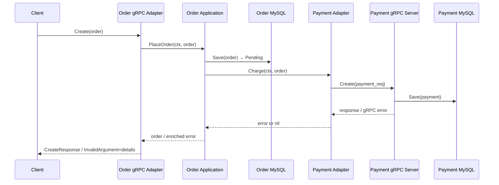

### 📖 Chapter Summary

Chapter 5 is the pivot from **building a single gRPC service** to **connecting services in a distributed system**. Babal (*gRPC Microservices in Go*, Ch.5) walks through Order → Payment using hexagonal ports/adapters, gRPC stubs, and rich error propagation. Shuiskov (*Microservices with Go, 2nd Edition*, Ch.5: Synchronous Communication) frames the same problem architecturally: request/response models, four gRPC RPC types, gateway patterns, discovery-aware clients, and production best practices (validation, status codes, idempotency).

The reference implementation in `microservices/` (Order + Payment services) already implements the Babal flow and extends the books with a shared proto module, `grpc.NewClient`, OpenTelemetry on Payment, and Docker Compose networking. This guide maps theory to that code and flags what a **2026 senior Go engineer** would still change.

**Sources**

| Book | Chapter | Focus |
|------|---------|-------|
| Babal | Ch.5 — Interservice Communication | Order→Payment stub, LB, error details |
| Shuiskov | Ch.5 — Synchronous Communication | RPC types, gateways, idempotency |
| Repo | `microservices/order`, `microservices/payment` | Updated hexagonal gRPC services |

---

#### 🆕 Key New Concepts & Technologies

| **Concept / Technology** | **Short Description** | **Babal** | **Shuiskov** | **microservices repo** |
|:--|:--|:--|:--|:--|
| **Synchronous Communication** | Real-time request/response (or streams) | Service-to-service stub calls | Generic client/server model | Order `Create` → Payment `Create` |
| **gRPC Stub** | Autogenerated client proxy | `PaymentServiceClient` module dep | `NewMetadataServiceClient` | `microservices-proto/gen/go` v0.2.0 |
| **Server-Side LB** | Client dials one VIP; proxy routes | K8s preview (Ch.5) | Load balancer + registry (Ch.3) | Docker DNS `payment:8081` |
| **Client-Side LB** | Client picks backend instance | Round-robin + load reports | Consul/static registry + `rand.Intn` | Not implemented yet |
| **Driven Port** | Outgoing interface from core | `ports.Payment` | Gateway interface | `ports.Payment` ✓ |
| **gRPC Status + Details** | Structured errors | `status.Convert` + `BadRequest` | Domain err → `codes.X` | Order aggregates payment errors ✓ |
| **Idempotency** | Safe retries | Deferred to Ch.6 | Explicit best practice | Gap — no idempotency key yet |
| **Context Propagation** | Deadlines, traces, cancel | Mentioned in Ch.6 | Best practice in Ch.5 | Payment core has ctx; Order port does not |

---

#### 📊 Book Comparison at a Glance

| Topic | Babal | Shuiskov | microservices repo |
|-------|-------|----------|-------------------|
| **Client creation** | `grpc.Dial` | `grpc.Dial` + `grpcutil.ServiceConnection` | `grpc.NewClient` ✓ |
| **Proto/stubs** | Separate proto repo, `go get` | In-repo `gen/` via `protoc` | Versioned `microservices-proto` module ✓ |
| **Discovery / LB** | Server-side (K8s); client-side explained | Client-side via Consul/static registry | Static URL + Docker network |
| **Architecture** | Port + driven adapter | Gateway per downstream service | Port + `adapters/payment` ✓ |
| **Observability** | Not in Ch.5 | Context propagation mentioned | OTel on Payment only |
| **Streaming RPC** | Later chapters | Four types explained | Unary only |

---

## Part 1: Synchronous Communication Foundations

### 📌 Concepts Explained

- **Synchronous request–response**: Caller blocks until a response (or stream) completes.
- **HTTP/2 + Protobuf**: gRPC transport and serialization layer.
- **Four RPC types**: Unary, client streaming, server streaming, bidirectional streaming.
- **Babal's client side**: Order calls a **local stub** that marshals binary over the wire.

### 🔧 Shuiskov — The Pattern

Synchronous communication is where services exchange data in **blocks or streams**. HTTP is the most common protocol; JSON is readable but larger and lacks cross-language codegen. gRPC adds automated ser/de, client/server codegen, auth, and context propagation.

**Four gRPC communication types (Shuiskov):**

| Type | Flow | Use when |
|------|------|----------|
| **Unary** | 1 request → 1 response | CRUD, charge payment, get order |
| **Client streaming** | N requests → 1 response | Large file upload |
| **Server streaming** | 1 request → N responses | File download, log tail |
| **Bidirectional** | N ↔ N | Live chat, collaborative edit |

> ⚠️ Shuiskov warns: streaming adds memory/CPU for long-lived connections — use only when needed.

### 🔧 Babal — The Implementation

Babal assumes the Order gRPC **server** exists (Ch.4) and adds the **client** side: `paymentClient.Create(ctx, req)` feels local but runs remotely via stub marshal → HTTP/2 → unmarshal.

### 📊 Diagram — Conceptual Flow

```
Order Service                    Payment Service
┌─────────────┐                 ┌─────────────┐
│ PlaceOrder  │──► PaymentPort  │             │
│   (core)    │    interface    │             │
└──────┬──────┘                 │             │
       ▼                        │             │
┌─────────────┐   gRPC/HTTP2    ┌─────────────┐
│ payment     │ ──────────────► │ gRPC server │
│ adapter     │   (stub)        │  Create()   │
└─────────────┘                 └─────────────┘
```

### Shuiskov vs Babal — Different Angles

| Babal | Shuiskov |
|-------|----------|
| Stub → marshal → wire → unmarshal | Client → Request → Server → Response |
| Single downstream (Payment) | Multiple gateways (metadata, rating) |
| Static `PAYMENT_SERVICE_URL` | Registry + address rotation |
| `google.rpc.BadRequest` chaining | Domain error → gRPC code in handler |

### 🧪 Interview Q&A

**Q1:** What is synchronous communication in microservices?

**Q2:** What are the four gRPC communication types?

**Q3:** Why is Protobuf preferred over JSON for interservice calls?

**Q4:** How does Babal's Figure 5.1 differ from Shuiskov's Figure 5.1?

**Q5:** When would you choose streaming over unary RPC?

> [!success]- 📋 Answers — Part 1
> **A1:** A caller sends a request and blocks until it receives a response. Data moves as discrete messages or streams over HTTP or gRPC. Used when immediate consistency is required (e.g., charge payment before confirming an order).
>
> **A2:** (1) **Unary** — one request, one response. (2) **Client streaming** — many requests, one response. (3) **Server streaming** — one request, many responses. (4) **Bidirectional** — both sides stream. Use streaming only for large payloads or live feeds.
>
> **A3:** Smaller payloads (~63B vs ~106B JSON in Shuiskov's benchmark), faster serialization (~185ns vs ~342ns), explicit schema, and multi-language codegen — fewer bugs and lower network cost.
>
> **A4:** Babal's diagram is **implementation-specific** (Order → Payment stub). Shuiskov's is **architectural** (generic client/server). Same pattern, different abstraction level.
>
> **A5:** Large file transfer, log tailing, real-time metrics, chunked media. For create-payment / get-order, unary is correct — as in `microservices/`.
---

## Part 2: gRPC Stubs and Module Dependencies

### 📌 Concepts Explained

- **Stub**: Auto-generated client implementing the same RPC interface as the server.
- **Module dependency**: Import generated code via `go get`, never copy `.pb.go` files.
- **Version pinning**: `@v0.2.0` prevents surprise breaking changes from `@latest`.

### 🔧 Babal Ch.5.2 — Stub as Go Module

```bash
# Babal (original)
go get github.com/huseyinbabal/microservices-proto/golang/payment@v1.0.38

# microservices repo (2026)
go get github.com/ryan-dev-learning/microservices-proto/gen/go@v0.2.0
```

### 🔧 Shuiskov — Proto → gen/

Define services in `.proto`, run `protoc` (or Buf), generate `gen/` with `NewXxxServiceClient` and `RegisterXxxServiceServer`. Use paired messages per RPC: `GetMetadataRequest` / `GetMetadataResponse`.

### Stub Lifecycle (Babal Figure 5.6)

1. Adapter calls `paymentClient.Create(ctx, req)`
2. Stub marshals `CreateRequest` to binary
3. HTTP/2 carries frames to Payment server
4. Server unmarshals, runs handler, marshals response
5. Client stub returns response or gRPC error

### 💻 Reference Repo — Directory Tree

```
microservices/
├── order/
│   ├── cmd/main.go                          # DI: db + payment + grpc
│   ├── config/config.go                     # PAYMENT_SERVICE_URL
│   └── internal/
│       ├── adapters/
│       │   ├── payment/payment.go           # gRPC client stub (driven)
│       │   ├── grpc/grpc.go                 # gRPC server handlers (driver)
│       │   └── db/db.go
│       ├── application/core/
│       │   ├── api/api.go                   # PlaceOrder orchestration
│       │   └── domain/order.go
│       └── ports/
│           ├── payment.go                   # Charge interface
│           └── api.go
└── payment/
    ├── cmd/main.go                          # OTel init + grpc run
    └── internal/
        ├── adapters/grpc/grpc.go            # Create handler
        ├── application/core/api/api.go      # Charge(ctx, payment)
        └── telemetry/telemetry.go           # OTLP exporter
```

### 💻 Payment Adapter (Reference)

`microservices/order/internal/adapters/payment/payment.go`

```go
func NewAdapter(paymentServiceUrl string) (*Adapter, error) {
    opts := []grpc.DialOption{
        grpc.WithTransportCredentials(insecure.NewCredentials()),
    }
    conn, err := grpc.NewClient(paymentServiceUrl, opts...)
    if err != nil {
        return nil, err
    }
    return &Adapter{
        conn:    conn,
        payment: paymentv1.NewPaymentServiceClient(conn),
    }, nil
}

func (a *Adapter) Charge(order *domain.Order) error {
    _, err := a.payment.Create(context.Background(), &paymentv1.CreateRequest{
        OrderId: order.ID, UserId: order.CustomerID, TotalPrice: order.TotalPrice(),
    })
    return err
}
```

**✅ Better than books:** `grpc.NewClient` (not deprecated `grpc.Dial`).

**⚠️ Gaps:** `context.Background()` — no deadline/trace propagation; no `conn.Close()` on shutdown.

### 🧪 Interview Q&A

**Q1:** What is a gRPC stub and why does it improve interoperability?

**Q2:** Why use a separate proto repository as a Go module?

**Q3:** What does `go get module@version` prevent?

**Q4:** What is the difference between `grpc.Dial` and `grpc.NewClient`?

**Q5:** Why embed `UnimplementedXxxServiceServer` on the server?

> [!success]- 📋 Answers — Part 2
> **A1:** Auto-generated client code mirroring the server RPC interface. Generated for Go, Java, Python, etc. from one `.proto` — polyglot microservices with one contract.
>
> **A2:** Single source of truth for API contracts; versioned releases; consumers pin versions; CI publishes stubs — no manual file copying.
>
> **A3:** Unexpected breaking changes from always pulling `@latest`. Production should pin versions and upgrade with `buf breaking` checks.
>
> **A4:** `grpc.Dial` is deprecated. `grpc.NewClient` is non-blocking with modern semantics — standard for grpc-go 1.63+.
>
> **A5:** Forward compatibility. New RPCs in `.proto` won't break old server builds; unimplemented methods return `Unimplemented` instead of compile errors.
---

## Part 3: Load Balancing Strategies

### 📌 Concepts Explained

- **Server-side LB**: Client → single VIP/proxy → backend pool.
- **Client-side LB**: Client knows all backends; picks one per RPC.
- **Extra hop**: Server-side adds latency via the proxy layer.
- **Load report**: Backend returns capacity hints for smarter routing (Babal Fig 5.3).

### 🔧 Babal Ch.5.1 — Comparison

| | Server-side LB | Client-side LB |
|--|----------------|----------------|
| **How** | Dial K8s Service / Docker DNS | Registry → pick instance |
| **Pros** | Simple client; proxy tracks health | No extra hop; no LB SPOF |
| **Cons** | Extra hop; proxy bottleneck | Hard to configure; app logic |

### 🔧 Shuiskov — Client-Side via Registry

Gateway calls `registry.ServiceAddresses(ctx, "metadata")`, then `addrs[rand.Intn(len(addrs))]` — random spread across healthy instances (Consul or static registry from Ch.3).

### 💻 Reference Repo — Docker Compose (Server-Side Semantics)

`microservices/order/deployment/docker-compose.yaml`

```yaml
environment:
  PAYMENT_SERVICE_URL: payment:8081
networks:
  microservices:
    external: true
```

Payment service registers alias `payment` on the shared `microservices` network — Docker DNS acts as the stable endpoint (same idea as K8s Service DNS).

### 📊 Diagram — Server-Side LB (Babal Fig 5.2)

```
order-service#1 ──┐
order-service#2 ──┼──► Payment LB ──► payment-service#1
order-service#3 ──┘                    payment-service#2
                                       payment-service#3
```

### 🧪 Interview Q&A

**Q1:** What is the "extra hop" problem in server-side load balancing?

**Q2:** How does Kubernetes provide server-side load balancing for gRPC?

**Q3:** How did Shuiskov implement client-side load balancing without a proxy?

**Q4:** What is a load report in client-side gRPC LB?

**Q5:** For a 2-service local stack, is client-side LB worth it?

> [!success]- 📋 Answers — Part 3
> **A1:** Traffic goes Client → Load Balancer → Backend. The LB hop adds latency and can bottleneck throughput. Client-side LB connects directly to a chosen instance.
>
> **A2:** A `Service` exposes stable ClusterIP/DNS. kube-proxy (or eBPF dataplane) distributes connections to healthy pod endpoints. Client uses one address: `payment:8081`.
>
> **A3:** Gateway queries registry for healthy addresses, then `rand.Intn` per request. Production often uses round-robin, least-conn, or gRPC resolver plugins.
>
> **A4:** Backend returns load/capacity in RPC responses so the client routes the next call to a less-loaded instance. Often replaced by service mesh or xDS today.
>
> **A5:** No. Static URL or Docker DNS is enough. Client-side LB pays off at scale with many replicas and strict latency SLOs.
---

## Part 4: Hexagonal Architecture — Payment Port and Adapter

### 📌 Concepts Explained

- **Driven port**: Application initiates outbound calls (Payment).
- **Driver adapter**: External actors invoke the app (Order gRPC `Create`).
- **Gateway (Shuiskov)** ≈ **Adapter (Babal)** on the driven side — anti-corruption layer.

### 🔧 Place Order Flow (Babal Fig 5.4)

1. Client calls Order `Create` via gRPC
2. Order saves order as `Pending` in DB
3. Order calls `payment.Charge(order)`
4. Payment service processes charge
5. Success → return order ID; failure → enriched gRPC error

### 💻 Reference Repo — Directory Tree (Order driven side)

```
microservices/order/internal/
├── ports/
│   └── payment.go              # type Payment interface { Charge(...) }
├── adapters/
│   └── payment/payment.go      # gRPC stub implementation
└── application/core/
    └── api/api.go              # PlaceOrder: db.Save → payment.Charge
```

### 💻 Dependency Injection

`microservices/order/cmd/main.go`

```go
func main() {
    dbAdapter, _ := db.NewAdapter(config.GetDataSourceURL())
    paymentAdapter, _ := payment.NewAdapter(config.GetPaymentServiceURL())
    application := api.NewApplication(dbAdapter, paymentAdapter)
    grpcAdapter := grpc.NewAdapter(application, config.GetApplicationPort())
    grpcAdapter.Run()
}
```

### 💻 PlaceOrder with Error Enrichment

`microservices/order/internal/application/core/api/api.go`

```go
func (a *Application) PlaceOrder(order domain.Order) (domain.Order, error) {
    if err := a.db.Save(&order); err != nil {
        return domain.Order{}, err
    }
    if paymentErr := a.payment.Charge(&order); paymentErr != nil {
        st := status.Convert(paymentErr)
        // aggregate BadRequest field violations → re-wrap for client
        return domain.Order{}, statusWithDetails.Err()
    }
    return order, nil
}
```

**Shuiskov gap in repo:** `ports.Payment.Charge` lacks `context.Context`; Payment service core `Charge(ctx, ...)` already has it.

### 🧪 Interview Q&A

**Q1:** Why is Payment a "driven" port in hexagonal architecture?

**Q2:** What is the benefit of `PaymentPort` over using the gRPC client directly in `api.go`?

**Q3:** Why save the order to DB *before* calling Payment?

**Q4:** Gateway (Shuiskov) vs Adapter (Babal) — same thing?

**Q5:** Should `PlaceOrder` accept `context.Context`?

> [!success]- 📋 Answers — Part 4
> **A1:** The application **initiates** the outbound call. Driver ports are invoked **by** external actors; driven ports are invoked **by** the application.
>
> **A2:** Core stays transport-agnostic. Swap gRPC for mocks, HTTP, or queues in tests without changing `PlaceOrder`.
>
> **A3:** You need a stable `order.ID` for Payment. Trade-off: **orphan orders** on payment failure — production needs status update (`payment_failed`), saga, or outbox.
>
> **A4:** Same role — translation/anti-corruption layer. Gateway often bundles discovery; Babal's adapter is thinner (connection in `NewAdapter`, logic in `Charge`).
>
> **A5:** Yes (2026 standard). Propagates deadlines, cancellation, and trace IDs from inbound gRPC through Payment and DB.
---

## Part 5: gRPC Error Handling and Status Codes

### 📌 Concepts Explained

- Plain `errors.New` → gRPC `Code: Unknown`
- `status.Errorf(codes.X, msg)` → meaningful wire errors
- `google.rpc.BadRequest` → field-level validation details
- `status.Convert(err)` → extract nested details from downstream

### 📊 Common Status Codes

| Code | Meaning | Example |
|------|---------|---------|
| `OK` | Success | Payment created |
| `InvalidArgument` | Bad client input | Empty `order_id` |
| `NotFound` | Resource missing | Order not found |
| `DeadlineExceeded` | Timeout | Context expired |
| `AlreadyExists` | Duplicate | Idempotent retry |
| `Internal` | Server bug | DB failure |
| `Unavailable` | Retryable | Payment service down |

### 🔧 Shuiskov — Handler Mapping

```go
if errors.Is(err, controller.ErrNotFound) {
    return nil, status.Errorf(codes.NotFound, err.Error())
}
```

### 🔧 Babal — Error Detail Chaining

Order service uses `status.Convert(paymentErr)` to aggregate `BadRequest` field violations and re-wrap under `field: "payment"`.

### 💻 Reference Repo — Payment Handler Gap

`microservices/payment/internal/adapters/grpc/grpc.go` returns `codes.Internal` for all failures — should differentiate validation vs infrastructure.

### 🧪 Interview Q&A

**Q1:** What happens if you `return nil, err` with a plain Go error from a gRPC handler?

**Q2:** What is `status.Convert` vs `status.FromError`?

**Q3:** What are `google.rpc.BadRequest` field violations for?

**Q4:** Which codes should clients retry?

**Q5:** How does Shuiskov's validation approach differ from Babal's error-detail chaining?

> [!success]- 📋 Answers — Part 5
> **A1:** gRPC maps it to `codes.Unknown` — clients can't decide retry vs fix-input.
>
> **A2:** `FromError` returns `(status, ok)`. `Convert` always returns a status, wrapping non-gRPC errors as `Unknown`. Use `Convert` for downstream aggregation.
>
> **A3:** Structured validation errors (field + description). Order aggregates Payment failures so API consumers know which subsystem failed.
>
> **A4:** Typically `Unavailable`, `DeadlineExceeded`, `ResourceExhausted` with backoff — **not** `InvalidArgument` or `NotFound`. Retries on writes need idempotency.
>
> **A5:** Shuiskov maps domain errors to correct codes at the handler. Babal enriches and re-wraps upstream errors for end-user messaging. Production needs both.
---

## Part 6: Synchronous Communication Best Practices (Shuiskov)

### 📌 Concepts Explained

- **Excessive validation** — nil checks, empty IDs → `InvalidArgument` early
- **Correct error codes** — enable automated retries and alerting
- **Idempotency** — safe retries via idempotency keys
- **API documentation** — explicit idempotent vs non-idempotent operations

### 🔧 Idempotency Pattern (Gap in Repo)

```protobuf
message CreateRequest {
  string idempotency_key = 1;
  int64 order_id = 2;
  // ...
}
```

Server: `UNIQUE(idempotency_key)` or dedup table — same key returns original `payment_id` without double charge.

### 🧪 Interview Q&A

**Q1:** What is idempotency and why does it matter for gRPC clients?

**Q2:** Which HTTP methods map to idempotent operations?

**Q3:** What is an idempotency key?

**Q4:** Why "excessive" validation on the server?

**Q5:** How does explicit error documentation help operations?

> [!success]- 📋 Answers — Part 6
> **A1:** Repeating the same request has the same effect as one call. Networks fail after server processing but before client response — retries without idempotency can double-charge.
>
> **A2:** GET, PUT, DELETE are idempotent by convention. POST / gRPC `Create` need explicit keys.
>
> **A3:** Client-supplied UUID per logical operation. Server stores key → result; duplicates return cached outcome.
>
> **A4:** Prevents panics, keeps bad data out of DB, returns actionable `InvalidArgument` instead of opaque `Internal`.
>
> **A5:** Clients and SREs know when to retry, fix input, or page on-call — no reverse-engineering handler behavior.
---

## Part 7: Reference Implementation Snapshot (2026)

### 📊 Repo Architecture

```
microservices/
├── order/          # gRPC :3000, MySQL, calls Payment
└── payment/        # gRPC :8081, MySQL, OTel + Jaeger
```

**Shared contract:** `github.com/ryan-dev-learning/microservices-proto/gen/go`

### ✅ Ahead of the Books

| Area | Status |
|------|--------|
| `grpc.NewClient` | ✓ order/payment adapters |
| Versioned proto module | ✓ v0.2.0 |
| `UnimplementedXxxServer` | ✓ both services |
| Rich error propagation | ✓ `status.Convert` + `BadRequest` |
| Structured logging | ✓ logrus + context on Payment |
| OpenTelemetry | ✓ Payment server (`otelgrpc`) |
| Graceful gRPC stop | ✓ Payment `Stop()` |
| Docker Compose networking | ✓ `microservices` network |
| MySQL health checks | ✓ both compose files |
| Go 1.26 + grpc v1.82 | ✓ modern toolchain |

### ⚠️ Gaps vs 2026 Senior Standards

| Gap | Risk | Priority |
|-----|------|----------|
| `context.Background()` in `Charge` | No deadline/cancel/trace | 🔴 High |
| No OTel on Order | Broken distributed traces | 🔴 High |
| Order saved before payment, no rollback | Orphan `Pending` orders | 🔴 High |
| No idempotency key | Unsafe retries | 🔴 High |
| `insecure` credentials | No TLS/mTLS | 🟡 Medium |
| No retry / circuit breaker | Cascading failures (Babal Ch.6) | 🟡 Medium |
| Payment returns only `Internal` | Poor retry decisions | 🟡 Medium |
| `AutoMigrate` in prod path | Unsafe schema changes | 🟡 Medium |
| No graceful shutdown in Order | Connection leaks | 🟡 Medium |

---

## Part 8: 2026 Senior Go Developer Recommendations

### 🔧 1. Context Propagation (End-to-End)

```go
// ports/payment.go
type Payment interface {
    Charge(ctx context.Context, order *domain.Order) error
}

// adapters/payment/payment.go
func (a *Adapter) Charge(ctx context.Context, order *domain.Order) error {
    ctx, cancel := context.WithTimeout(ctx, 3*time.Second)
    defer cancel()
    _, err := a.payment.Create(ctx, &paymentv1.CreateRequest{...})
    return err
}
```

### 🔧 2. OpenTelemetry on Both Services

```go
conn, err := grpc.NewClient(addr,
    grpc.WithStatsHandler(otelgrpc.NewClientHandler()),
    grpc.WithTransportCredentials(insecure.NewCredentials()),
)
```

### 🔧 3. Idempotent Payment + Saga-Aware Order

- Add `idempotency_key` to proto (`buf breaking` check)
- Payment: dedup on key before charge
- Order: set `payment_failed` on charge error

### 🔧 4. Domain Error → gRPC Code Mapping

```go
switch {
case errors.Is(err, domain.ErrInsufficientFunds):
    return nil, status.Errorf(codes.FailedPrecondition, "...")
case errors.Is(err, domain.ErrInvalidAmount):
    return nil, status.Errorf(codes.InvalidArgument, "...")
default:
    return nil, status.Errorf(codes.Internal, "...")
}
```

### 🔧 5. Resilience (Babal Ch.6 Preview)

- Retry interceptor for `Unavailable` / `DeadlineExceeded` (with idempotency)
- Circuit breaker on Payment client
- Separate timeout budgets for payment vs DB

### 🔧 6. Proto Tooling — Buf

- `buf lint` — style enforcement
- `buf breaking` — CI blocks incompatible changes
- Publish versioned `microservices-proto` module

### 🔧 7. Production Hardening

| Item | Action |
|------|--------|
| TLS | `credentials.NewTLS` / SPIFFE mTLS |
| Migrations | `golang-migrate` or Atlas; drop `AutoMigrate` in prod |
| Shutdown | `signal.Notify` → `GracefulStop()` → `conn.Close()` |
| Health | `grpc.health.v1` for K8s probes |
| Testing | `bufconn` or testcontainers |

### 📊 Sequence Diagram — Full Chapter Flow



### 🧪 Master Interview Q&A

**Q1:** Why is gRPC called "synchronous" if it supports streaming?

**Q2:** How would you test the payment adapter without a real Payment service?

**Q3:** Order is public; Payment is internal — how do you enforce that?

**Q4:** What's the difference between Babal's "adapter" and Shuiskov's "gateway"?

**Q5:** Name three things you'd do before shipping this to production.

> [!success]- 📋 Answers — Master Q&A
> **A1:** The caller still waits for the RPC (or stream) to complete. "Synchronous" contrasts with async messaging (Kafka) where the producer doesn't wait for consumer processing.
>
> **A2:** Mock `ports.Payment` in core tests. For adapter tests: `bufconn` in-process server or testcontainers.
>
> **A3:** Network policies, private subnets, mTLS service identities, no ingress on Payment, API gateway only on Order.
>
> **A4:** Naming convention. Both sit on the driven side, translate domain ↔ wire, hide transport. Gateway often includes service discovery.
>
> **A5:** (1) Context + OTel everywhere, (2) idempotent payment + order status on failure, (3) TLS + migrations + health probes + graceful shutdown.
---

### 💡 Pro Tips & Best Practices (Combined)

1. **Stop using `grpc.Dial`** — use `grpc.NewClient` for all new Go gRPC code.
2. **Stubs as modules** — never copy `.pb.go`; import versioned proto packages.
3. **Prefer Buf over raw `protoc`** — lint, breaking checks, reproducible codegen.
4. **Context is mandatory** — propagate from gRPC handler → core → downstream adapters.
5. **Map domain errors to gRPC codes** — don't leak `Unknown` to clients.
6. **Design for idempotency** — especially on `Create` RPCs that move money.
7. **Evaluate client-side LB at scale** — until then, K8s Service / Docker DNS is fine.

---

### 🔨 Practice Challenge (Shuiskov, Adapted)

Implement **round-robin client-side LB** in the Order payment adapter:

1. Config: `PAYMENT_SERVICE_URLS=payment-1:8081,payment-2:8081`
2. Parse slice; atomic counter `% len(urls)` per `Charge`
3. Optionally wire Consul registry (Shuiskov Ch.3)

---

### 📚 Further Reading

| Resource | Topic |
|----------|-------|
| Babal Ch.6 | Retry, timeout, circuit breaker, TLS |
| Shuiskov Ch.3 | Service discovery (Consul, client vs server-side) |
| Shuiskov Ch.6 | Async communication (Kafka) |
| [gRPC status codes](https://grpc.io/docs/guides/status-codes/) | Full code reference |
| [Buf docs](https://buf.build/docs) | Proto lint, breaking changes |
| [Stripe idempotency](https://stripe.com/blog/idempotency) | Idempotency key patterns |

---

### 🤖 Regenerate this guide

1. [[AI Prompt/00 - General Study Guide Prompt]] — fill Inputs table, copy full prompt
2. [[Go/AI Prompt - Go]] — append Go-specific instructions

---

*Generated study guide for gRPC Microservices in Go — Chapter 5, cross-referenced with Microservices with Go 2nd Edition and the `microservices` reference repo.*