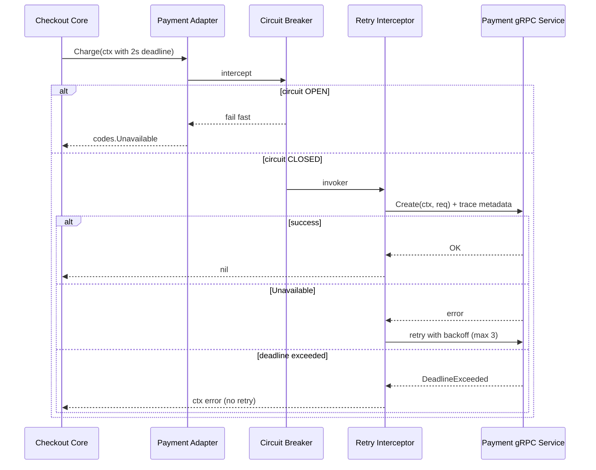

### 📖 Chapter Summary

Chapter 6 is where Babal (*gRPC Microservices in Go*, Ch.6) makes distributed failure **explicit and manageable**. A dependent service outage (e.g., Shipping cannot reach its database) can cascade to Order even for requests that do not need Shipping. Babal introduces three **resiliency patterns** — timeout, retry, and circuit breaker — implemented via `context.Context`, gRPC **client interceptors**, and `sony/gobreaker`. The chapter then covers the **gRPC error model** (`google.golang.org/grpc/status`, `errdetails.BadRequest`) and **TLS/mTLS** for zero-trust inter-service communication.

Shuiskov (*Microservices with Go, 2nd Edition*, Ch.2 context + Ch.5 communication error handling) complements Babal with Go **context propagation** idioms and structured error handling philosophy. Internet practice in **2026** adds `grpc.NewClient`, OTel-aware interceptors, service-mesh retries, and cert-manager for production TLS instead of hand-rolled OpenSSL.

This chapter answers: *How do we fail fast instead of cascading? When should we retry vs not retry? How do structured gRPC errors drive retry/circuit-breaker decisions? How do we secure service-to-service RPC?*

**Sources**

| Reference | Chapter / Section | Focus |
|-----------|-------------------|-------|
| Babal | Ch.6 — Resilient communication | Timeout, retry, circuit breaker, error model, TLS/mTLS |
| Shuiskov | Ch.2 — Context; Ch.5 — Communication error handling | `context.Context` propagation, explicit errors |
| Repo | `https://github.com/huseyinbabal/microservices` | OTel client interceptor on Payment stub; no retry/CB yet |
| Internet (2026) | grpc-go, go-grpc-middleware, cert-manager | `grpc.NewClient`, retry policies, mTLS in K8s |

---

#### 🆕 Key New Concepts & Technologies

| **Concept / Technology** | **Short Description** | **Babal** | **Shuiskov** | **Repo** | **2026** |
|:--|:--|:--|:--|:--|:--|
| **Cascading failure** | One downstream outage takes upstream services down | Fig 6.1 Shipping DB failure → Order | Design for failure (Ch.1) | No circuit breaker yet | Isolate failure domains |
| **Timeout pattern** | Fail fast when SLA exceeded | `context.WithTimeout` / `WithDeadline` | Context deadlines (Ch.2) | No explicit timeout on Payment call | Always derive ctx with deadline |
| **Context propagation** | Deadline/cancel/metadata flows across RPC hops | Fig 6.2 three-service chain | First arg `context.Context` | `ctx` passed to `Charge` ✓ | OTel trace context in metadata |
| **Retry pattern** | Auto-retry transient faults | `go-grpc-middleware/retry` interceptor | — | Not implemented | Retry only `Unavailable`/`ResourceExhausted` |
| **Circuit breaker** | Open circuit on failure threshold; half-open probe | `sony/gobreaker` + interceptor (Listing 6.6) | — | Not implemented | CB per dependency, not global |
| **gRPC interceptors** | Middleware on client/server RPC path | Fig 6.4 unary client/server | — | OTel unary interceptor only | Chain: OTel → retry → CB |
| **gRPC status codes** | Structured `codes.*` for decision logic | `codes.Unavailable`, `ResourceExhausted` | Ch.5 error handling | Payment errors mapped in core | Map domain errors → `codes` |
| **`errdetails`** | Rich error payloads (`BadRequest`, etc.) | Listing 6.7 field violations | — | Used in `api_test.go` | `google.rpc.ErrorInfo` for retry hints |
| **TLS / mTLS** | Encrypt + authenticate RPC traffic | OpenSSL certs, Listing 6.8 | — | `insecure.NewCredentials()` in dev | cert-manager + SPIFFE in K8s |

---

#### 📊 Comparison at a Glance

| Topic | Babal Ch.6 | Shuiskov Ch.2 / Ch.5 | Repo | Current practice (2026) |
|-------|------------|----------------------|------|-------------------------|
| **Fail-fast** | `context.WithTimeout` on client | Context as first parameter | No client timeout configured | Deadline on every outbound RPC |
| **Retry** | `grpc_retry.UnaryClientInterceptor` | — | None | Retry idempotent ops only; max attempts + jitter |
| **Circuit breaker** | `gobreaker` wrapped in interceptor | — | None | Per-dependency CB; expose metrics |
| **Error structure** | `status.New` + `WithDetails` | Explicit error handling | `errdetails.BadRequest` in core | `status.Convert` + typed details |
| **When NOT to retry** | Validation errors (fix payload) | — | — | Never retry `InvalidArgument` |
| **TLS** | Manual OpenSSL + `grpc.Creds` | — | Insecure credentials | mTLS via mesh or cert-manager |
| **Client API** | `grpc.Dial` + interceptors | `grpc.Dial` | `grpc.Dial` + OTel | `grpc.NewClient` + chained interceptors |

---

## Part 1: Cascading Failure and Resiliency Foundations

### 📌 Concepts Explained

- **Cascading failure**: When Shipping cannot reach its database, Order — which depends on Shipping — may also become unreachable, even for requests that do not need Shipping (Babal Fig 6.1).
- **Partial vs complete failure**: Network may be up but latency breaches SLO (e.g., 50 ms average).
- **Resiliency patterns**: Timeout (fail fast), retry (transient faults), circuit breaker (stop hammering a sick dependency).
- **Design for failure**: Microservices trade monolith blast radius for network failure modes — resiliency is not optional.

### 🔧 Babal — The Problem Statement (Ch.6 intro)

In a monolith, a critical error can bring down the entire runtime. In microservices, components are decoupled but **network dependencies multiply**. Without resiliency patterns, a Shipping DB outage eventually makes Order unavailable too.

### 🔧 Shuiskov — Context as the Foundation

Shuiskov (Ch.2) establishes `context.Context` as Go's mechanism for cancellation, deadlines, and metadata propagation. Every I/O function should accept context as the first argument. Babal Ch.6 applies this directly to gRPC client calls.

### 📊 Diagram — Cascading Failure (Babal Fig 6.1)

```
Initial state                    After Shipping DB failure
┌─────────┐                      ┌─────────┐
│  Order  │──gRPC──► Shipping   │  Order  │──gRPC──► Shipping (DOWN)
└────┬────┘                      └────┬────┘         cannot reach DB
     │ gRPC                           │ gRPC
     ▼                                ▼
┌─────────┐                      ┌─────────┐
│ Payment │                      │ Payment │
└─────────┘                      └─────────┘

Without timeout/CB: Order threads block waiting for Shipping → Order also "down"
With timeout/CB:    Order fails fast on shipping path; other paths still serve
```

### 🧪 Interview Q&A

**Q1:** What is a cascading failure in microservices?

**Q2:** Why doesn't decoupling services automatically prevent cascading failures?

**Q3:** Name the three resiliency patterns Babal covers in Ch.6.

**Q4:** What is the difference between a complete and partial network failure?

**Q5:** Why is "design for failure" more critical in microservices than monoliths?

**Q6 (real-world):** "Shipping is slow but not down. Order latency spikes. What's your first fix?"

> [!success]- 📋 Answers — Part 1
> **A1:** A failure in one downstream service (e.g., Shipping DB) propagates upstream, causing services that depend on it (Order) to also become slow or unavailable — even for unrelated request paths.
>
> **A2:** Decoupling separates deployables but **adds network calls**. Upstream services still block or retry on downstream failures unless you add timeouts, circuit breakers, and bulkheads.
>
> **A3:** Timeout (context deadlines), retry (transient fault recovery), circuit breaker (stop calling a failing dependency).
>
> **A4:** Complete failure = service unreachable. Partial failure = service responds but with high latency or intermittent errors that breach SLOs.
>
> **A5:** Every cross-service call can fail, timeout, or degrade. There is no shared process boundary — network failures are normal, not exceptional.
>
> **A6:** Add client-side timeouts on the Shipping stub call (`context.WithTimeout`). If latency is chronic, add a circuit breaker to fail fast and shed load while Shipping recovers.

---

## Part 2: Timeout Pattern and Context Propagation

### 📌 Concepts Explained

- **`context.WithDeadline`**: Cancel execution after a specific wall-clock time.
- **`context.WithTimeout`**: Wrapper — specify duration instead of computing target time.
- **Cancellation function**: Call `cancel()` via `defer` to release resources early.
- **Propagation**: Client creates ctx with 3 s budget; Order passes same ctx to Product stub — entire chain shares one deadline (Babal Fig 6.2).
- **gRPC injection**: Protoc adds `context.Context` as first param on every generated RPC method.

### 💻 Timeout — Babal Listing 6.1 vs 2026

```go
// Babal (book) — client timeout
ctx, cancel := context.WithTimeout(context.Background(), 1*time.Second)
defer cancel()
_, err := shippingClient.Create(ctx, &shipping.CreateShippingRequest{UserId: 23})

// Repo (order/internal/adapters/payment/payment.go) — ctx propagated, no deadline set
func (a *Adapter) Charge(ctx context.Context, order *domain.Order) error {
    _, err := a.payment.Create(ctx, &payment.CreatePaymentRequest{...})
    return err
}

// 2026 senior standard — deadline at call site + propagation
ctx, cancel := context.WithTimeout(ctx, 2*time.Second)
defer cancel()
_, err := paymentClient.Create(ctx, req)
```

### 💻 Context Propagation Chain (Babal Listing 6.2)

```go
// Client: 3-second total budget
ctx, cancel := context.WithTimeout(context.TODO(), 3*time.Second)
defer cancel()
_, err := orderClient.Create(ctx, &order.CreateOrderRequest{...})

// Order server: passes ctx to Product stub (inherits remaining time)
func (s *server) Create(ctx context.Context, in *order.CreateOrderRequest) (*order.CreateOrderResponse, error) {
    productInfo, err := s.productClient.Get(ctx, &product.GetProductRequest{ProductId: in.ProductId})
    // ...
}
```

If Order sleeps 2 s and Product sleeps 2 s, the 3 s client deadline fires before completion.

### 📊 Context Propagation Diagram (Babal Fig 6.2)

```
Client ──ctx(3s)──► Order ──ctx(same)──► Product
                      │                      │
                      └── 2s sleep ──────────┴── 2s sleep = 4s total → TIMEOUT
```

### 🧪 Interview Q&A

**Q1:** What is the difference between `WithTimeout` and `WithDeadline`?

**Q2:** Why must you call `cancel()` even when the deadline expires naturally?

**Q3:** How does gRPC propagate context across service boundaries?

**Q4:** If the gateway sets a 5 s deadline, and Order sets a new 10 s timeout internally, what happens?

**Q5:** What gRPC error do you get when a context deadline is exceeded?

**Q6 (real-world):** "Parent context has 500 ms left. Child service needs 2 s. What should happen?"

> [!success]- 📋 Answers — Part 2
> **A1:** `WithTimeout(d)` is sugar for `WithDeadline(time.Now().Add(d))`. Both return a derived context and a `cancel` function.
>
> **A2:** `cancel()` releases timer and context tree resources immediately. Relying only on expiry can leak resources until GC.
>
> **A3:** gRPC serializes deadline and cancellation over HTTP/2 metadata. Server handlers receive the same context; client stubs pass it on outbound calls.
>
> **A4:** The **minimum** deadline wins. If Order creates a child context with a longer timeout detached from parent, you break end-to-end SLA guarantees — anti-pattern.
>
> **A5:** `codes.DeadlineExceeded` (often wrapped as `context.DeadlineExceeded`).
>
> **A6:** The child call should fail with `DeadlineExceeded` once the 500 ms parent budget expires — fail fast rather than run 2 s.

---

## Part 3: Retry Pattern and Client Interceptors

### 📌 Concepts Explained

- **Transient faults**: Momentary loss of functionality that self-corrects (brief network blip, pod restart, throttling).
- **Retry interceptor**: `grpc.WithUnaryInterceptor(grpc_retry.UnaryClientInterceptor(...))` applies retry to all unary calls.
- **Retry codes**: Default `Unavailable` and `ResourceExhausted` — not validation errors.
- **Backoff**: `BackoffLinear`, `BackoffExponential`, with jitter variants to avoid thundering herd.
- **Risk**: Infinite retries load a recovering service — combine with max attempts + circuit breaker.

### 💻 Retry — Babal Listing 6.3 vs 2026

```go
// Babal (book)
import grpc_retry "github.com/grpc-ecosystem/go-grpc-middleware/retry"

opts = append(opts,
    grpc.WithUnaryInterceptor(grpc_retry.UnaryClientInterceptor(
        grpc_retry.WithCodes(codes.Unavailable, codes.ResourceExhausted),
        grpc_retry.WithMax(5),
        grpc_retry.WithBackoff(grpc_retry.BackoffLinear(time.Second)),
    )),
    grpc.WithInsecure(),
)
conn, err := grpc.Dial("localhost:8080", opts...)

// 2026 recommended
conn, err := grpc.NewClient(paymentAddr,
    grpc.WithUnaryInterceptor(grpc_retry.UnaryClientInterceptor(
        grpc_retry.WithMax(3),
        grpc_retry.WithBackoff(grpc_retry.BackoffExponentialWithJitter(100*time.Millisecond, 0.1)),
    )),
    grpc.WithStatsHandler(otelgrpc.NewClientHandler()),
    grpc.WithTransportCredentials(credentials.NewTLS(tlsConfig)),
)
```

### 📊 When to Retry vs When to Stop

| gRPC Code | Retry? | Reason |
|-----------|--------|--------|
| `Unavailable` | Yes | Transient — service restarting |
| `ResourceExhausted` | Yes (with backoff) | Throttling may clear |
| `DeadlineExceeded` | No | Budget spent — return to caller |
| `InvalidArgument` | No | Fix the payload |
| `NotFound` | No | Resource doesn't exist |
| `AlreadyExists` | No (unless idempotent dedup) | Duplicate create |

### 📊 Interceptor Chain (Babal Fig 6.4)

```
Client ──► UnaryClientInterceptor(s) ──► network ──► UnaryServerInterceptor(s) ──► handler
           (retry, CB, OTel)                              (auth, logging, OTel)
```

### 🧪 Interview Q&A

**Q1:** What transient faults does Babal's retry pattern target?

**Q2:** Why should you NOT retry on `InvalidArgument`?

**Q3:** What is the purpose of jitter in backoff?

**Q4:** What is a gRPC unary client interceptor?

**Q5:** Why combine retry max attempts with context timeout?

**Q6 (real-world):** "Payment returns `ResourceExhausted`. Your retry config has max 5, linear 1 s backoff. Walk through the behavior."

> [!success]- 📋 Answers — Part 3
> **A1:** Instant network failures, temporarily unavailable services, resource exhaustion/throttling that clears after backoff.
>
> **A2:** The request payload is wrong — retrying the same invalid request will never succeed. Fix the data instead.
>
> **A3:** Randomized delay spreads retry attempts across clients, preventing synchronized retries that re-overwhelm a recovering service (thundering herd).
>
> **A4:** A function that wraps every unary RPC on the client — can add retry, circuit breaker, tracing, auth headers before the actual `invoker` call.
>
> **A5:** Retries multiply latency. A context timeout caps total wall-clock time so the caller doesn't wait through all retry attempts indefinitely.
>
> **A6:** Client retries up to 5 times, waiting 1 s between attempts, only while response code is `ResourceExhausted`. Stops early on success or different code. Total time still bounded by context deadline.

---

## Part 4: Circuit Breaker Pattern

### 📌 Concepts Explained

- **Circuit**: Connection between two services. **Open** = fail fast without calling downstream. **Half-open** = allow limited probe requests. **Closed** = normal operation (Babal Fig 6.3).
- **`sony/gobreaker` settings**: `MaxRequests` (half-open), `Interval`, `Timeout` (open→half-open), `ReadyToTrip`, `OnStateChange`.
- **Interceptor integration**: Wrap `invoker` in `cb.Execute()` (Listing 6.6) — centralizes CB logic.
- **vs retry**: Retry keeps trying; CB stops trying when failure rate exceeds threshold.

### 💻 Circuit Breaker Interceptor (Babal Listing 6.6)

```go
// middleware/circuit_breaker.go
func CircuitBreakerClientInterceptor(cb *gobreaker.CircuitBreaker) grpc.UnaryClientInterceptor {
    return func(ctx context.Context, method string, req, reply interface{},
        cc *grpc.ClientConn, invoker grpc.UnaryInvoker, opts ...grpc.CallOption) error {
        _, cbErr := cb.Execute(func() (interface{}, error) {
            err := invoker(ctx, method, req, reply, cc, opts...)
            if err != nil {
                return nil, err
            }
            return nil, nil
        })
        return cbErr
    }
}

// Usage
cb := gobreaker.NewCircuitBreaker(gobreaker.Settings{
    Name:        "payment",
    MaxRequests: 3,
    Timeout:     4 * time.Second,
    ReadyToTrip: func(counts gobreaker.Counts) bool {
        return float64(counts.TotalFailures)/float64(counts.Requests) >= 0.6
    },
})
opts = append(opts, grpc.WithUnaryInterceptor(CircuitBreakerClientInterceptor(cb)))
```

### 📊 Circuit Breaker State Machine (Babal Fig 6.3)

```
        ┌─────────┐
   ┌───►│ CLOSED  │◄─── success, failure rate OK
   │    └────┬────┘
   │         │ failure rate > threshold
   │         ▼
   │    ┌─────────┐
   │    │  OPEN   │─── fail fast (no downstream call)
   │    └────┬────┘
   │         │ after Timeout duration
   │         ▼
   │    ┌──────────┐
   └───►│HALF-OPEN │─── allow MaxRequests probes
        └──────────┘
```

### 🧪 Interview Q&A

**Q1:** What are the three circuit breaker states?

**Q2:** What is the purpose of the half-open state?

**Q3:** How does a circuit breaker differ from retry?

**Q4:** What does `ReadyToTrip` decide?

**Q5:** Why wrap the gRPC `invoker` inside `cb.Execute`?

**Q6 (real-world):** "Circuit is OPEN. A new Order request arrives. What happens without a fallback?"

> [!success]- 📋 Answers — Part 4
> **A1:** Closed (normal), Open (fail fast), Half-open (limited probe requests to test recovery).
>
> **A2:** Allows a controlled number of test requests through to see if the downstream service recovered, without flooding it.
>
> **A3:** Retry keeps attempting calls on failure. Circuit breaker **stops calling** entirely when failure rate is too high, protecting both caller and callee.
>
> **A4:** Whether to transition from Closed to Open based on failure statistics (e.g., failure ratio ≥ 0.6).
>
> **A5:** Centralizes CB around all calls to a dependency via one interceptor instead of wrapping every stub method manually.
>
> **A6:** The interceptor returns immediately with circuit-open error — Order should return a degraded response or queue the operation, not block on Payment.

---

## Part 5: gRPC Error Model and Structured Details

### 📌 Concepts Explained

- **gRPC error model** (Fig 6.5): `Code`, `Status`, `Message`, `ErrorDetails`.
- **`status.New(codes.*, msg)`**: Create structured server error.
- **`WithDetails`**: Attach `errdetails.BadRequest`, `ErrorInfo`, etc.
- **Client parsing**: `status.Convert(err)` then type-switch on `Details()`.
- **Resiliency link**: Error codes drive retry/CB decisions — structured codes beat string matching.

### 💻 Server Error — Babal Listing 6.7

```go
import (
    "google.golang.org/genproto/googleapis/rpc/errdetails"
    "google.golang.org/grpc/codes"
    "google.golang.org/grpc/status"
)

func (s *server) Create(ctx context.Context, in *order.CreateOrderRequest) (*order.CreateOrderResponse, error) {
    var violations []*errdetails.BadRequest_FieldViolation
    if in.UserId < 1 {
        violations = append(violations, &errdetails.BadRequest_FieldViolation{
            Field: "user_id", Description: "user id cannot be less than 1",
        })
    }
    if len(violations) > 0 {
        st := status.New(codes.InvalidArgument, "invalid order request")
        br := &errdetails.BadRequest{FieldViolations: violations}
        st, _ = st.WithDetails(br)
        return nil, st.Err()
    }
    return &order.CreateOrderResponse{OrderId: 1243}, nil
}
```

### 💻 Client Error Parsing

```go
_, err := orderClient.Create(ctx, req)
if err != nil {
    st := status.Convert(err)
    for _, detail := range st.Details() {
        switch t := detail.(type) {
        case *errdetails.BadRequest:
            for _, v := range t.GetFieldViolations() {
                log.Printf("field %s: %s", v.GetField(), v.GetDescription())
            }
        }
    }
}
```

### 📊 gRPC Status Codes for Resiliency Decisions

| Code | HTTP analog | Retry? | CB counts as failure? |
|------|-------------|--------|----------------------|
| `OK` | 200 | — | No |
| `InvalidArgument` | 400 | No | No (client fault) |
| `Unavailable` | 503 | Yes | Yes |
| `ResourceExhausted` | 429 | Yes (backoff) | Yes |
| `DeadlineExceeded` | 504 | No | Yes |

### 🧪 Interview Q&A

**Q1:** What fields make up the gRPC error model?

**Q2:** How do you attach field-level validation errors to a gRPC response?

**Q3:** How does the client extract `BadRequest` details from an error?

**Q4:** Why map domain validation failures to `InvalidArgument` instead of `Internal`?

**Q5:** How do structured error codes interact with retry logic?

**Q6 (real-world):** "Server returns `codes.Internal` for a validation error. What breaks downstream?"

> [!success]- 📋 Answers — Part 5
> **A1:** Code (machine-readable `codes.*`), Status (short name), Message (human explanation), ErrorDetails (typed protobuf extensions).
>
> **A2:** Build `errdetails.BadRequest` with `FieldViolations`, attach via `status.New(...).WithDetails(badRequest)`, return `st.Err()`.
>
> **A3:** `st := status.Convert(err)`, iterate `st.Details()`, type-switch on `*errdetails.BadRequest`.
>
> **A4:** `InvalidArgument` signals client-fixable input — callers won't retry. `Internal` triggers retries and alerts, masking a validation bug as infrastructure failure.
>
> **A5:** Retry interceptors match on `codes.Unavailable` and `ResourceExhausted`. Correct code mapping ensures retries fire only for transient server-side issues.
>
> **A6:** Clients may retry `Internal` unnecessarily, circuit breakers trip on client-caused errors, and monitoring shows false infrastructure alerts.

---

## Part 6: Securing gRPC with TLS and mTLS

### 📌 Concepts Explained

- **TLS**: Encrypts inter-service traffic; successor to SSL.
- **TLS handshake** (Fig 6.6): Client connects → server presents cert → client verifies → encrypted channel.
- **mTLS** (Fig 6.7): Both sides present and verify certificates — zero-trust identity.
- **Certificate generation**: OpenSSL CA + server CSR + client CSR (Babal Ch.6.3.2).
- **gRPC credentials**: `credentials.NewTLS(&tls.Config{...})` on server (`grpc.Creds`) and client (`grpc.WithTransportCredentials`).

### 💻 TLS Server — Babal Listing 6.8 vs 2026

```go
// Babal (book) — server
tlsCreds, _ := credentials.NewTLS(&tls.Config{
    ClientAuth:   tls.RequireAnyClientCert, // mTLS
    Certificates: []tls.Certificate{serverCert},
    ClientCAs:    certPool,
})
grpcServer := grpc.NewServer(grpc.Creds(tlsCreds))

// Babal (book) — client
conn, err := grpc.Dial(addr, grpc.WithTransportCredentials(tlsCreds))

// 2026 — production
// Use cert-manager / SPIFFE / service mesh for cert rotation
conn, err := grpc.NewClient(addr,
    grpc.WithTransportCredentials(credentials.NewTLS(tlsConfig)),
    grpc.WithStatsHandler(otelgrpc.NewClientHandler()),
)
```

### 💻 Directory Tree — Local Dev Certs

```
order/
├── cert/
│   ├── ca.crt
│   ├── client.crt
│   ├── client.key
│   ├── server.crt
│   └── server.key
└── cmd/main.go
```

### 📊 TLS vs mTLS

| Aspect | TLS (one-way) | mTLS (mutual) |
|--------|---------------|---------------|
| Server cert | Required | Required |
| Client cert | Not required | Required |
| Identity | Server only | Both parties |
| Use case | Public HTTPS-like | Zero-trust service mesh |

### 🧪 Interview Q&A

**Q1:** What is the difference between TLS and mTLS?

**Q2:** Walk through the four-step TLS handshake Babal describes.

**Q3:** What is `credentials.TransportCredentials` in gRPC?

**Q4:** Why does Babal delegate production cert management to chapter 8?

**Q5:** What replaces `grpc.WithInsecure()` in production?

**Q6 (real-world):** "Order calls Payment over plaintext gRPC inside a private VPC. Is that enough?"

> [!success]- 📋 Answers — Part 6
> **A1:** TLS = server proves identity to client. mTLS = both server and client present certificates; both verify each other.
>
> **A2:** (1) Client connects. (2) Server shows certificate. (3) Client verifies against CA. (4) Encrypted channel established for data.
>
> **A3:** gRPC abstraction over TLS config — passed to `grpc.Creds` (server) or `grpc.WithTransportCredentials` (client) to enable encrypted, authenticated transport.
>
> **A4:** Manual OpenSSL is fine for local dev; production needs automated rotation, encrypted key storage, and CA integration (K8s secrets, cert-manager) — covered in Ch.8 Deployment.
>
> **A5:** `grpc.WithTransportCredentials(credentials.NewTLS(tlsConfig))` with proper CA trust and ideally mTLS.
>
> **A6:** Often not for regulated/zero-trust environments. VPC boundary helps but insider threat, compromised pod, or misconfigured SG still exposes traffic. mTLS between services is 2026 baseline.

---

## Part 7: Companion Repo Snapshot (2026)

### 📌 Concepts Explained

- **Repo state**: Order calls Payment via gRPC client adapter with OTel interceptor — partial resilience.
- **Missing patterns**: No retry, circuit breaker, client timeout, or TLS in payment adapter.

### 🔧 Ahead of the Books

| Area | Status |
|------|--------|
| Context on Payment port | `Charge(ctx context.Context, ...)` ✓ |
| OTel client interceptor | `otelgrpc.UnaryClientInterceptor()` on Payment stub ✓ |
| Structured errors in core | `errdetails.BadRequest` mapping in `api.go` ✓ |
| Hexagonal isolation | Payment client behind `ports.Payment` interface ✓ |

### ⚠️ Gaps vs 2026 Senior Standards

| Gap | Risk | Priority |
|-----|------|----------|
| No `context.WithTimeout` on Payment call | Hung requests, cascading latency | 🔴 High |
| No retry interceptor | Transient Payment outage fails Order | 🔴 High |
| No circuit breaker | Hammers sick Payment service | 🔴 High |
| `grpc.Dial` + `insecure.NewCredentials()` | Deprecated API + plaintext RPC | 🔴 High |
| No mTLS | Unencrypted inter-service traffic | 🟡 Medium |
| No idempotency on Payment `Create` | Retry safety missing | 🔴 High |

### 💻 Repo vs Book — Payment Adapter

```go
// Repo (current) — order/internal/adapters/payment/payment.go
conn, err := grpc.Dial(paymentServiceUrl,
    grpc.WithTransportCredentials(insecure.NewCredentials()),
    grpc.WithUnaryInterceptor(otelgrpc.UnaryClientInterceptor()),
)

// 2026 target
conn, err := grpc.NewClient(paymentServiceUrl,
    grpc.WithTransportCredentials(credentials.NewTLS(tlsConfig)),
    grpc.WithChainUnaryInterceptor(
        otelgrpc.UnaryClientInterceptor(),
        grpc_retry.UnaryClientInterceptor(grpc_retry.WithMax(3)),
        CircuitBreakerClientInterceptor(paymentCB),
    ),
)
```

### 🧪 Interview Q&A

**Q1:** What resiliency patterns does the companion repo implement today?

**Q2:** Where would you add a circuit breaker in the repo's hexagonal layout?

**Q3:** What is the highest-priority resilience gap in the repo?

**Q4:** Does the repo use structured gRPC errors?

**Q5:** How does OTel in the payment adapter relate to resilience?

> [!success]- 📋 Answers — Part 7
> **A1:** Context propagation and OTel unary client interceptor only. No timeout, retry, circuit breaker, or TLS.
>
> **A2:** In `adapters/payment/payment.go` as a chained `grpc.WithUnaryInterceptor` — keeps resilience at the adapter boundary, core stays transport-agnostic.
>
> **A3:** No client-side timeout on Payment calls — a slow Payment blocks Order indefinitely, classic cascading failure vector.
>
> **A4:** Yes — core maps Payment failures to `status` with `errdetails.BadRequest` field violations (see `api_test.go`).
>
> **A5:** OTel traces help debug timeout/retry storms after incidents, but tracing is observability — not a substitute for timeout/retry/CB patterns.

---

## Part 8: Senior Recommendations and End-to-End Resilience

### 📌 Concepts Explained

- **Layer defenses**: Timeout (bounded wait) + retry (transient recovery) + circuit breaker (load shedding) + structured errors (correct decisions).
- **Idempotency prerequisite**: Retries are safe only on idempotent operations or with idempotency keys.
- **Interceptor ordering**: OTel → auth → retry → circuit breaker (outermost fails fast when circuit open).
- **Production TLS**: cert-manager, not hand-rolled OpenSSL in CI.

### 🔧 Combined Recommendations

| # | Recommendation | Babal | Shuiskov | 2026 |
|---|----------------|-------|----------|------|
| 1 | Deadline on every outbound RPC | Listing 6.1–6.2 | Context first arg | Propagate from gateway |
| 2 | Retry only transient codes | `Unavailable`, `ResourceExhausted` | — | + idempotency keys |
| 3 | Circuit breaker per dependency | `gobreaker` interceptor | — | Expose CB state metrics |
| 4 | Structured `status` + `errdetails` | Listing 6.7 | Explicit errors | `ErrorInfo` for retry hints |
| 5 | Never retry validation errors | Summary note | — | Map 4xx-class to `InvalidArgument` |
| 6 | mTLS between services | Listing 6.8 | — | Mesh or cert-manager |
| 7 | Use `grpc.NewClient` | Book uses `Dial` | `Dial` in examples | Deprecated `Dial` removed |
| 8 | Chain interceptors centrally | Listings 6.3, 6.6 | — | `WithChainUnaryInterceptor` |

### 📊 Mermaid — Resilient Order → Payment Call



### 🧪 Master Interview Q&A

**Q1:** Explain the timeout → retry → circuit breaker layering and why you need all three.

**Q2:** Payment is down for 10 minutes. What happens with only retry vs only circuit breaker vs both?

**Q3:** How do you decide which gRPC status codes are retryable?

**Q4:** Implement mTLS between Order and Payment in three sentences.

**Q5:** A junior dev retries all errors including `InvalidArgument`. What's wrong?

**Q6:** How does context propagation preserve the gateway's SLA across three gRPC hops?

**Q7 (real-world):** "Design resilience for Order → Payment `Create` RPC."

**Q8 (real-world):** "What's the difference between a timeout and a circuit breaker?"

**Q9:** Where do interceptors fit in hexagonal architecture?

**Q10:** Why must retries on `Create` be paired with idempotency keys?

> [!success]- 📋 Answers — Master Q&A
> **A1:** Timeout caps any single attempt's wait. Retry recovers transient blips within the budget. Circuit breaker stops calling a persistently failing dependency to prevent cascade and give it recovery time.
>
> **A2:** Only retry: clients hammer Payment for 10 min, worsening recovery. Only CB: fails fast quickly (good) but no recovery on brief blips. Both: brief blips recovered by retry; sustained outage trips CB to fail fast.
>
> **A3:** Retry `Unavailable` (service down/restarting), `ResourceExhausted` (throttling). Never retry client errors (`InvalidArgument`, `NotFound`, `AlreadyExists`) or `DeadlineExceeded`.
>
> **A4:** Generate CA + service certs. Server: `grpc.Creds(credentials.NewTLS(serverTLS))`. Client: `grpc.NewClient(addr, grpc.WithTransportCredentials(clientTLS))` with mutual cert verification in `tls.Config`.
>
> **A5:** `InvalidArgument` means bad input — retrying wastes resources and may amplify load. Fix the request instead.
>
> **A6:** Gateway creates ctx with 5 s deadline. Each hop passes the same ctx; remaining time decreases. No service can extend the budget unilaterally.
>
> **A7:** Set 2 s ctx timeout. Chain OTel + retry (max 3, exponential jitter on `Unavailable`/`ResourceExhausted`) + gobreaker per Payment dependency. Map errors to `status` with details. Use mTLS. Require idempotency key on `Create` before enabling retry.
>
> **A8:** Timeout limits how long you wait on one call. Circuit breaker stops making calls entirely when failure rate is too high — fail fast without hitting the network.
>
> **A9:** Resilience belongs in **driven adapters** (outbound gRPC clients) via interceptors — core ports stay unaware of retry/CB mechanics.
>
> **A10:** Without idempotency, a retried `Create` after a successful-but-timed-out first attempt can double-charge. Idempotency keys let the server deduplicate.

---

### 💡 Pro Tips & Best Practices (Combined)

1. **Always set a deadline** on outbound gRPC — never call with `context.Background()` in production paths.
2. **Propagate context unchanged** through the call chain — do not create fresh unbounded contexts mid-chain.
3. **Retry transient codes only** — `Unavailable` and `ResourceExhausted`; never `InvalidArgument`.
4. **Cap retries** with `WithMax` and exponential jitter — unbounded retry is a distributed DoS.
5. **Add circuit breakers per dependency** — one CB for Payment, another for Shipping.
6. **Map domain errors to correct `codes.*`** — wrong codes break retry/CB/alerting.
7. **Use `status.WithDetails`** for field-level validation — clients and gateways can render useful errors.
8. **Replace `grpc.Dial` with `grpc.NewClient`** — chain interceptors with `WithChainUnaryInterceptor`.
9. **Enable mTLS in production** — delegate cert lifecycle to cert-manager or service mesh (Ch.8).
10. **Pair retries with idempotency keys** on non-idempotent RPCs like `Create`/`Charge`.

---

### 🔨 Hands-On Tasks

#### Task 1: Add timeout + retry to a Payment client stub
**Goal:** Apply Babal Listings 6.1 and 6.3 patterns to a scratch gRPC client.
**Files:** `cmd/resilience-demo/main.go` (local sandbox)
**Steps:**
1. Create a Payment client with `context.WithTimeout(ctx, 2*time.Second)`.
2. Add `grpc_retry.UnaryClientInterceptor` with `WithMax(3)` and jittered backoff.
3. Point at a server that sleeps 3 s — verify `DeadlineExceeded`.
4. Point at a server that returns `Unavailable` twice then succeeds — verify retry.
**Done when:** Logs show timeout on slow server and successful retry on flaky server.

#### Task 2: Circuit breaker interceptor
**Goal:** Implement Babal Listing 6.6 pattern wrapping a gRPC invoker.
**Files:** `internal/middleware/circuit_breaker.go` + test
**Steps:**
1. Configure `gobreaker` with `ReadyToTrip` at 50% failure ratio.
2. Wrap a unary interceptor around a mock invoker.
3. Trigger 10 failures — verify circuit opens and calls fail fast without invoking.
**Done when:** `OnStateChange` logs show `closed → open` transition.

---

### 📚 Further Reading

| Resource | Topic |
|----------|-------|
| Babal Ch.5 | Error handling preview (status codes, client-side handling) |
| Babal Ch.8 | Deployment — cert-manager, K8s TLS |
| Babal Ch.9 | Observability — correlate timeout/retry storms in traces |
| Shuiskov Ch.2 | Context propagation idioms |
| Shuiskov Ch.5 | Communication error handling |
| [gRPC status codes](https://grpc.io/docs/guides/status-codes/) | Official code reference |
| [go-grpc-middleware retry](https://github.com/grpc-ecosystem/go-grpc-middleware) | Retry interceptor |
| [sony/gobreaker](https://github.com/sony/gobreaker) | Circuit breaker |
| [grpc-go anti-patterns](https://github.com/grpc/grpc-go/blob/master/Documentation/anti-patterns.md) | `Dial` deprecation |
| [Companion repo](https://github.com/huseyinbabal/microservices) | Order → Payment adapter |

---

### 🤖 Regenerate this guide

1. [[AI Prompt/00 - General Study Guide Prompt]] — fill Inputs (Babal = Ref 1, Shuiskov = Ref 2, Internet = Ref 3, PRIMARY = 1)
2. [[Go/AI Prompt - Go]] — append Go code/tree requirements
3. [[Go/gRPC Microservices in Go/AI Prompt - grpc babal]] — append this project prompt

---

*Study guide for Resilient communication (Ch.6), 2026.*