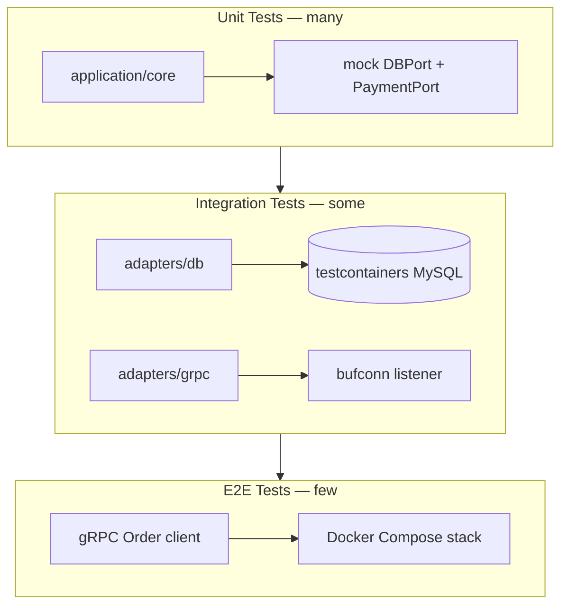

### 📖 Chapter Summary

Chapter 7 is where Babal (*gRPC Microservices in Go*, Ch.7) turns the Order/Payment hexagonal scaffold into a **testable system**. Babal introduces the **testing pyramid** (unit > integration > e2e), the four-phase test workflow (setup → invoke → verify → teardown), **testify mocks** on hexagonal ports, **testcontainers** for real MySQL integration tests, and a full **e2e module** (`e2e/`) that spins up Docker Compose (MySQL + Payment + Order) via testcontainers and verifies the create-order flow over gRPC.

Shuiskov (*Microservices with Go, 2nd Edition*, Ch.9 Unit and Integration Testing) complements with Go testing idioms: table-driven tests, mocking best practices, subtests, flaky-test detection, and coverage maintenance in CI.

Internet practice in **2026** adds **`bufconn`** for in-process gRPC adapter tests (no TCP), **mockery**/`gomock` codegen, testcontainers module pinning, and coverage gates in CI — faster feedback than Babal's Docker Compose e2e for everyday development.

This chapter answers: *How do we test hexagonal layers in isolation? When do we need real databases? How do we verify the full Order→Payment flow? How does coverage fit CI?*

**Sources**

| Reference | Chapter / Section | Focus |
|-----------|-------------------|-------|
| Babal | Ch.7 — Testing microservices | Pyramid, mocks, testcontainers, e2e Compose |
| Shuiskov | Ch.9 — Unit and Integration Testing | Go test idioms, mocking, coverage, flaky tests |
| Repo | `https://github.com/huseyinbabal/microservices` | `api_test.go`, `db_integration_test.go`, `e2e/` |
| Internet (2026) | testify, testcontainers-go, bufconn | In-process gRPC tests, CI coverage gates |

---

#### 🆕 Key New Concepts & Technologies

| **Concept / Technology** | **Short Description** | **Babal** | **Shuiskov** | **Repo** | **2026** |
|:--|:--|:--|:--|:--|:--|
| **Testing pyramid** | Unit (many) > integration (some) > e2e (few) | Fig 7.1 | Ch.9 testing strategy | All three layers present ✓ | Same; shift heavy e2e to CI nightly |
| **SUT** | System Under Test — the code element being verified | Fig 7.2 test suite | Ch.9 SUT definition | `Application.PlaceOrder` | One SUT per test file |
| **Test workflow** | Setup → invoke → verify → teardown | Ch.7.2.2 four phases | Ch.9 structure | testify `suite` for integration | `t.Cleanup` for teardown |
| **Mocking ports** | Replace driven adapters with testify mocks | `mockedPayment`, `mockedDb` | Ch.9 mocking | `api_test.go` ✓ | mockery codegen from `ports/` |
| **testify/mock** | `On().Return()`, `Called()` tracking | Listing 7.2–7.3 | testify in Ch.9 | Hand-written mocks | `mockery --all` |
| **testcontainers** | Real MySQL in Docker for integration tests | Ch.7.3 `GenericContainer` | Ch.9 integration | `db_integration_test.go` ✓ | Pin image digest |
| **testify/suite** | `SetupSuite` / `TearDownSuite` lifecycle | Fig 7.5 flow | — | Used in DB + e2e suites ✓ | Same |
| **E2E via Compose** | Full stack: MySQL + Payment + Order | Ch.7.4 `e2e/` module | — | `e2e/create_order_e2e_test.go` ✓ | Keep minimal; prefer contract tests |
| **Coverage** | `-cover`, `-coverprofile`, HTML report | Ch.7.5 | Ch.9 coverage tracking | `api` ~93% cited in book | CI gate on diff coverage |
| **bufconn** | In-memory gRPC pipe for adapter tests | Not in Babal | — | Not in repo | Preferred for gRPC adapter unit tests |

---

#### 📊 Comparison at a Glance

| Topic | Babal Ch.7 | Shuiskov Ch.9 | Repo | Current practice (2026) |
|-------|------------|---------------|------|-------------------------|
| **Unit test target** | Application core via port mocks | Public API + table tests | `api_test.go` on core | Mock all driven ports |
| **Mock strategy** | Hand-written testify mocks | testify / gomock | Hand-written | mockery from `ports/*.go` |
| **Integration scope** | DB adapter + real MySQL | DB + external deps | `db_integration_test.go` | testcontainers + pinned image |
| **gRPC adapter test** | E2E only (real TCP) | — | No bufconn tests | `bufconn` in-process server |
| **E2E stack** | Docker Compose via testcontainers | — | `e2e/resources/docker-compose.yml` | Nightly CI job, not every PR |
| **Client in tests** | `grpc.Dial` + insecure | — | `grpc.Dial` in e2e | `grpc.NewClient` + `bufconn` |
| **Coverage in CI** | PR gate concept (Fig 7.8) | Coverage thresholds | Not shown in repo | Diff coverage + minimum floor |
| **Test speed** | Unit fast, e2e slow (by design) | Flaky test detection | e2e provisions full stack | More unit/integration, fewer e2e |

---

## Part 1: Testing Pyramid and Motivation

### 📌 Concepts Explained

- **Manual testing**: Run all real services — slow, blocks delivery.
- **Automated testing**: Machine-verified feedback on every change.
- **Testing pyramid** (Fig 7.1): Many unit tests (fast, cheap, isolated) → fewer integration tests → fewest e2e tests (slow, expensive).
- **Microservice advantage**: Small service context — testing Order means focusing on Order boundaries, not the entire monolith.

### 🔧 Babal — Pyramid Rationale (Ch.7.1)

| Layer | Speed | Cost | Isolation | % of suite |
|-------|-------|------|-----------|------------|
| Unit | Fastest | Cheapest | Highest (mocks) | Largest |
| Integration | Slower | Medium | Partial (real DB) | Medium |
| E2E | Slowest | Highest | Lowest (full stack) | Smallest |

Unit tests mock dependencies. Integration tests spin real infrastructure (testcontainers). E2E tests provision the entire application stack.

### 🔧 Shuiskov — Testing Investment (Ch.1 + Ch.9)

Shuiskov emphasizes comprehensive **integration testing** as a microservice tax — service boundaries multiply test surfaces. Ch.9 adds: table-driven tests, test only public functions, and always provide actionable failure messages.

### 📊 ASCII — Testing Pyramid (Babal Fig 7.1)

```
                    ┌─────────────┐
                    │  E2E tests  │  expensive, slow, few
                    ├─────────────┤
                    │ Integration │  medium cost
                    ├─────────────┤
                    │  Unit tests │  cheap, fast, many
                    └─────────────┘
```

### 🧪 Interview Q&A

**Q1:** Why does the testing pyramid have more unit tests than e2e tests?

**Q2:** What is the cost argument against relying on manual testing in microservices?

**Q3:** What makes microservices easier to unit test than monoliths?

**Q4:** When would you still invest in e2e tests despite their cost?

**Q5:** What is the relationship between isolation and test layer?

**Q6 (real-world):** "We have 50 e2e tests and 10 unit tests. What's wrong?"

> [!success]- 📋 Answers — Part 1
> **A1:** Unit tests are fast and cheap — mock dependencies, no infrastructure. E2E tests provision real services and databases — slow and resource-heavy. The pyramid optimizes feedback speed and cost.
>
> **A2:** Manual testing requires all services running, blocks CI, and doesn't scale with team size or release frequency.
>
> **A3:** Each service has a smaller bounded context. You test Order logic without loading Cart, Payment, and Shipping into one test runtime.
>
> **A4:** For critical user journeys (checkout flow), smoke tests before production deploy, and verifying cross-service wiring that mocks cannot catch.
>
> **A5:** Higher in the pyramid = less isolation, more real components. Lower = more mocks, faster feedback.
>
> **A6:** Inverted pyramid — slow CI, flaky tests, hard to pinpoint failures. Shift to port-mocked unit tests and targeted integration tests; keep ~5–10 e2e smokes.

---

## Part 2: Unit Testing — SUT, Workflow, and Mocks

### 📌 Concepts Explained

- **SUT (System Under Test)**: The specific code element under verification — a class, function, or application layer (Fig 7.2).
- **Test suite**: Group of related tests verifying one SUT's behaviors (happy path + edge cases).
- **Four phases**: Setup → invoke SUT → verify (assert) → teardown.
- **Mocking**: Replace driven adapters (DB, Payment) with controlled fakes — fast, deterministic.
- **Hexagonal fit**: Ports are interfaces → trivial to mock without changing production code.

### 🔧 Test Workflow (Babal Ch.7.2.2)

```
Setup:     mock payment + mock db → NewApplication(db, payment)
Invoke:    application.PlaceOrder(ctx, order)
Verify:    assert.Nil(t, err) or assert.EqualError(...)
Teardown:  (often unnecessary for pure unit tests)
```

### 💻 Unit Test — Babal vs Repo

```go
// Babal (book) — hand-written mocks
type mockedPayment struct { mock.Mock }
func (p *mockedPayment) Charge(order *domain.Order) error {
    args := p.Called(order)
    return args.Error(0)
}

// Repo (order/internal/application/core/api/api_test.go) — with context
type mockedPayment struct { mock.Mock }
func (p *mockedPayment) Charge(ctx context.Context, order *domain.Order) error {
    args := p.Called(ctx, order)
    return args.Error(0)
}

func TestPlaceOrder(t *testing.T) {
    payment := new(mockedPayment)
    db := new(mockedDb)
    payment.On("Charge", mock.Anything, mock.Anything).Return(nil)
    db.On("Save", mock.Anything, mock.Anything).Return(nil)

    app := NewApplication(db, payment)
    _, err := app.PlaceOrder(context.Background(), domain.Order{...})
    assert.Nil(t, err)
}
```

### 💻 Edge Case — DB Failure (Babal + Repo)

```go
func Test_Should_Return_Error_When_Db_Persistence_Fail(t *testing.T) {
    db := new(mockedDb)
    db.On("Save", mock.Anything, mock.Anything).Return(errors.New("connection error"))
    _, err := app.PlaceOrder(ctx, order)
    assert.EqualError(t, err, "connection error")
}
```

### 💻 Edge Case — Payment Failure with Structured Error

```go
func Test_Should_Return_Error_When_Payment_Fail(t *testing.T) {
    payment.On("Charge", mock.Anything, mock.Anything).Return(errors.New("insufficient balance"))
    _, err := app.PlaceOrder(ctx, order)
    st, _ := status.FromError(err)
    assert.Equal(t, st.Message(), "order creation failed")
    assert.Equal(t, st.Code(), codes.InvalidArgument)
    br := st.Details()[0].(*errdetails.BadRequest)
    assert.Equal(t, br.FieldViolations[0].Description, "insufficient balance")
}
```

### 📊 Mock vs Real Dependencies (Babal Fig 7.3)

```
WITH REAL DEPS (slow)              WITH MOCKS (fast)
Order ──► real MySQL               Order ──► mock DB
  │                                    │
  └──► live Payment service          └──► mock Payment
       (must be running)                   (controlled behavior)
```

### 📊 Directory Tree — Unit Test Layout

```
order/internal/application/core/
├── api/
│   ├── api.go              # SUT: Application.PlaceOrder
│   └── api_test.go         # unit tests + hand mocks
├── domain/
│   └── order.go
└── ports/                  # interfaces mocked in tests
    ├── db.go
    └── payment.go
```

### 🧪 Interview Q&A

**Q1:** What is a SUT in the context of hexagonal architecture?

**Q2:** Why must mocks target interfaces, not concrete adapters?

**Q3:** Walk through the four phases of an automated test.

**Q4:** How does `testify/mock` control return values?

**Q5:** Why does the repo's `Charge` mock include `context.Context`?

**Q6 (real-world):** "How do you test `PlaceOrder` when Payment is down?"

> [!success]- 📋 Answers — Part 2
> **A1:** The specific layer under test — typically `application/core` (e.g., `Application.PlaceOrder`) with all ports mocked.
>
> **A2:** Hexagonal architecture defines ports as interfaces. Mocking interfaces lets you test core logic without DB or gRPC infrastructure.
>
> **A3:** Setup (prepare mocks/SUT) → invoke (call the method) → verify (assert outcomes) → teardown (release resources).
>
> **A4:** `mock.On("Method", args...).Return(values...)` configures behavior. `Called()` records invocations for verification.
>
> **A5:** 2026/repo practice propagates context on all port methods — mocks must match the real interface signature.
>
> **A6:** Mock `payment.Charge` to return an error. Assert core returns structured `status` with `InvalidArgument` and `errdetails.BadRequest` — no real Payment service needed.

---

## Part 3: Automatic Mock Generation and Shuiskov Idioms

### 📌 Concepts Explained

- **mockery**: `mockery --all --keeptree` generates `*_mock.go` from every interface in a package.
- **Regenerate on interface change**: Re-run mockery when ports evolve.
- **Table-driven tests** (Shuiskov): One test function, many cases — improves readability.
- **Test public API only**: Private functions tested indirectly through public methods.

### 💻 mockery Workflow

```bash
# Babal (book) — from order/ directory
brew install mockery
mockery --all --keeptree

# 2026 — config-driven
# .mockery.yaml targets ports/ package
mockery
```

### 💻 Table-Driven Test (Shuiskov Ch.9 style)

```go
func TestPlaceOrder_Validation(t *testing.T) {
    tests := []struct {
        name      string
        order     domain.Order
        dbErr     error
        payErr    error
        wantCode  codes.Code
    }{
        {"happy path", validOrder(), nil, nil, codes.OK},
        {"db fail", validOrder(), errors.New("connection error"), nil, codes.Unknown},
        {"payment fail", validOrder(), nil, errors.New("insufficient balance"), codes.InvalidArgument},
    }
    for _, tt := range tests {
        t.Run(tt.name, func(t *testing.T) {
            // setup mocks with tt.dbErr, tt.payErr
            // invoke + assert wantCode
        })
    }
}
```

### 🧪 Interview Q&A

**Q1:** When is hand-written mocking better than mockery?

**Q2:** What does `mockery --keeptree` preserve?

**Q3:** What is a table-driven test and why use it?

**Q4:** Should you test private functions directly?

**Q5:** How often should you regenerate mocks?

**Q6 (real-world):** "You add `Refund` to `PaymentPort`. What breaks in tests?"

> [!success]- 📋 Answers — Part 3
> **A1:** Simple projects with few interfaces, or when you need highly customized mock behavior. mockery wins at scale with many ports.
>
> **A2:** The directory tree structure — generated mocks land alongside the interfaces they implement.
>
> **A3:** A single test function iterating over cases — reduces duplication, makes edge cases visible in a table, easy to add new scenarios.
>
> **A4:** No (Shuiskov). Test through public API — private functions are covered indirectly; testing privates couples tests to implementation.
>
> **A5:** Whenever a port interface changes — ideally in CI via `go generate` or a mockery check step.
>
> **A6:** Hand-written mocks won't compile until you add `Refund` method. Regenerate with mockery or update manual mocks to match the new interface.

---

## Part 4: Integration Testing with Testcontainers

### 📌 Concepts Explained

- **Integration test**: Verify two modules together — e.g., DB adapter against real MySQL.
- **Why real DB**: Catch SQL dialect issues, driver bugs, schema mismatches mocks hide.
- **testcontainers-go**: Pulls and runs MySQL in Docker; provides connection URL.
- **testify/suite lifecycle**: `SetupSuite` (start container) → tests → `TearDownSuite` (destroy).

### 💻 Integration Test Suite — Babal = Repo

```go
// order/internal/adapters/db/db_integration_test.go (repo matches book)
type OrderDatabaseTestSuite struct {
    suite.Suite
    DataSourceUrl string
}

func (o *OrderDatabaseTestSuite) SetupSuite() {
    req := testcontainers.ContainerRequest{
        Image:        "docker.io/mysql:8.0.30",
        ExposedPorts: []string{"3306/tcp"},
        Env: map[string]string{
            "MYSQL_ROOT_PASSWORD": "s3cr3t",
            "MYSQL_DATABASE":      "orders",
        },
        WaitingFor: wait.ForSQL(nat.Port("3306/tcp"), "mysql", dbURL).Timeout(30 * time.Second),
    }
    mysqlContainer, _ := testcontainers.GenericContainer(ctx, testcontainers.GenericContainerRequest{
        ContainerRequest: req, Started: true,
    })
    endpoint, _ := mysqlContainer.Endpoint(ctx, "")
    o.DataSourceUrl = fmt.Sprintf("root:s3cr3t@tcp(%s)/orders?...", endpoint)
}

func (o *OrderDatabaseTestSuite) Test_Should_Save_Order() {
    adapter, err := NewAdapter(o.DataSourceUrl)
    o.Nil(err)
    o.Nil(adapter.Save(context.Background(), &domain.Order{}))
}

func TestOrderDatabaseTestSuite(t *testing.T) {
    suite.Run(t, new(OrderDatabaseTestSuite))
}
```

### 📊 Suite Lifecycle (Babal Fig 7.5)

```
SetupSuite → SetupTest → Test_A → TearDownTest → SetupTest → Test_B → TearDownTest → TearDownSuite
     │                                                                                      │
     └── start MySQL container ────────────────────────────────────────────────── destroy ──┘
```

### 📊 Directory Tree — Integration Test Location

```
order/internal/adapters/db/
├── db.go
├── db_integration_test.go   # build tag: //go:build integration (2026 optional)
└── db_test.go               # pure unit tests with sqlmock (optional)
```

### 🧪 Interview Q&A

**Q1:** Why use testcontainers instead of a shared dev database?

**Q2:** What happens in `SetupSuite` vs `SetupTest`?

**Q3:** Why does Babal warn against using root in production but allow it in tests?

**Q4:** What does `wait.ForSQL` do?

**Q5:** How is an integration test different from an e2e test in this chapter?

**Q6 (real-world):** "CI has no Docker. Can you run testcontainers tests?"

> [!success]- 📋 Answers — Part 4
> **A1:** Testcontainers gives each test run an isolated, disposable database — no shared state, no manual setup, reproducible in CI.
>
> **A2:** `SetupSuite` runs once before all tests (start MySQL). `SetupTest` runs before each test (reset state). `TearDownSuite` destroys the container.
>
> **A3:** Tests need quick setup with full privileges. Production should use least-privilege DB users — different security posture.
>
> **A4:** Polls the container with a SQL probe (`SELECT 1`) until MySQL accepts connections or timeout — prevents tests running against unready DB.
>
> **A5:** Integration = two modules (adapter + DB). E2E = entire stack (MySQL + Payment + Order) verifying a user flow.
>
> **A6:** No — testcontainers requires Docker (or compatible runtime). Use build tags to skip integration tests locally; run them in CI with Docker, or use sqlmock for adapter-only tests.

---

## Part 5: gRPC Adapter Testing with bufconn (2026)

### 📌 Concepts Explained

- **Babal gap**: gRPC adapters are only tested via slow e2e TCP tests.
- **bufconn**: In-memory `net.Conn` — start a gRPC server and client without network ports.
- **Use case**: Test `adapters/grpc` translation logic fast, without Docker.
- **Pattern**: Register server on `bufconn.Listener`; client dials `bufconn` context.

### 💻 bufconn gRPC Adapter Test (2026 — not in Babal)

```go
import (
    "google.golang.org/grpc"
    "google.golang.org/grpc/credentials/insecure"
    "google.golang.org/grpc/test/bufconn"
)

const bufSize = 1024 * 1024

func startBufconnServer(t *testing.T, register func(*grpc.Server)) *bufconn.Listener {
    lis := bufconn.Listen(bufSize)
    srv := grpc.NewServer()
    register(srv)
    go func() { _ = srv.Serve(lis) }()
    t.Cleanup(srv.Stop)
    return lis
}

func bufconnDialer(lis *bufconn.Listener) func(context.Context, string) (net.Conn, error) {
    return func(ctx context.Context, _ string) (net.Conn, error) {
        return lis.Dial()
    }
}

func TestGRPCServer_CreateOrder(t *testing.T) {
    lis := startBufconnServer(t, func(s *grpc.Server) {
        order.RegisterOrderServer(s, &server{...})
    })
    conn, err := grpc.NewClient("passthrough:///bufnet",
        grpc.WithContextDialer(bufconnDialer(lis)),
        grpc.WithTransportCredentials(insecure.NewCredentials()),
    )
    require.NoError(t, err)
    t.Cleanup(func() { conn.Close() })

    client := order.NewOrderClient(conn)
    resp, err := client.Create(context.Background(), &order.CreateOrderRequest{...})
    require.NoError(t, err)
}
```

### 📊 gRPC Test Strategy Comparison

| Approach | Speed | Fidelity | Babal | 2026 |
|----------|-------|----------|-------|------|
| Mock ports (unit) | Fastest | No gRPC wire | Ch.7.2 ✓ | Core tests |
| bufconn (adapter) | Fast | Real gRPC codec | — | Adapter tests |
| testcontainers e2e | Slow | Full stack | Ch.7.4 ✓ | CI smoke only |

### 🧪 Interview Q&A

**Q1:** What is bufconn and why use it for gRPC tests?

**Q2:** How does bufconn differ from mocking the port interface?

**Q3:** Why does Babal's book not use bufconn?

**Q4:** What does `grpc.NewClient` with a custom `ContextDialer` achieve?

**Q5:** Which hexagonal layer should bufconn tests target?

**Q6 (real-world):** "When do you choose bufconn over e2e for a gRPC handler test?"

> [!success]- 📋 Answers — Part 5
> **A1:** In-memory network listener for gRPC — exercises real protobuf serialization and gRPC handlers without TCP ports or Docker.
>
> **A2:** Port mocks skip gRPC entirely. bufconn tests the **gRPC adapter** — request translation, status mapping, metadata — with real gRPC machinery.
>
> **A3:** bufconn is standard practice now but less emphasized when the book was written; Babal uses e2e for gRPC verification.
>
> **A4:** Routes gRPC connections through the in-memory listener instead of TCP — `passthrough:///bufnet` is a conventional target name.
>
> **A5:** `adapters/grpc/` — the driver adapter. Core remains tested with port mocks; bufconn bridges adapter integration gap.
>
> **A6:** bufconn for every adapter test during development. e2e only for cross-service smoke (Order→Payment→MySQL) in CI.

---

## Part 6: End-to-End Testing with Docker Compose

### 📌 Concepts Explained

- **E2E goal**: Verify the full create-order flow against a running stack.
- **Stack**: MySQL + Payment + Order (Babal Fig 7.6).
- **Docker Compose**: `docker-compose.yml` defines services, healthchecks, depends_on.
- **testcontainers LocalDockerCompose**: `compose up -d` in SetupSuite, `down` in TearDownSuite.
- **Separate `e2e/` module**: Own `go.mod` — isolates heavy deps from service modules.

### 💻 docker-compose.yml (Babal Ch.7.4)

```yaml
# e2e/resources/docker-compose.yml
version: "3.9"
services:
  mysql:
    image: "mysql:8.0.30"
    environment:
      MYSQL_ROOT_PASSWORD: "s3cr3t"
    volumes:
      - "./init.sql:/docker-entrypoint-initdb.d/init.sql"
    healthcheck:
      test: ["CMD", "mysqladmin", "ping", "-h", "localhost", "-uroot", "-ps3cr3t"]
      interval: 5s
      retries: 20

  payment:
    depends_on:
      mysql:
        condition: service_healthy
    build: ../../payment/
    environment:
      APPLICATION_PORT: 8081
      DATA_SOURCE_URL: "root:s3cr3t@tcp(mysql:3306)/payments?charset=utf8mb4&parseTime=True&loc=Local"

  order:
    depends_on:
      mysql:
        condition: service_healthy
    build: ../../order/
    ports:
      - "8080:8080"
    environment:
      APPLICATION_PORT: 8080
      DATA_SOURCE_URL: "root:s3cr3t@tcp(mysql:3306)/orders?charset=utf8mb4&parseTime=True&loc=Local"
      PAYMENT_SERVICE_URL: "payment:8081"
```

### 💻 E2E Test — Repo matches Babal

```go
// e2e/create_order_e2e_test.go
func (c *CreateOrderTestSuite) SetupSuite() {
    compose := testcontainers.NewLocalDockerCompose([]string{"resources/docker-compose.yml"}, uuid.New().String())
    c.compose = compose
    compose.WithCommand([]string{"up", "-d"}).Invoke()
}

func (c *CreateOrderTestSuite) Test_Should_Create_Order() {
    conn, _ := grpc.Dial("localhost:8080",
        grpc.WithTransportCredentials(insecure.NewCredentials()))
    defer conn.Close()
    client := order.NewOrderClient(conn)
    createResp, err := client.Create(context.Background(), &order.CreateOrderRequest{...})
    c.Nil(err)
    getResp, err := client.Get(context.Background(), &order.GetOrderRequest{OrderId: createResp.OrderId})
    c.Equal(int64(23), getResp.UserId)
}

func (c *CreateOrderTestSuite) TearDownSuite() {
    c.compose.WithCommand([]string{"down"}).Invoke()
}
```

### 📊 Directory Tree — E2E Module (Babal Fig 7.7)

```
e2e/
├── go.mod
├── go.sum
├── create_order_e2e_test.go
└── resources/
    ├── docker-compose.yml
    └── init.sql          # CREATE DATABASE payments; CREATE DATABASE orders;
```

### 🧪 Interview Q&A

**Q1:** Why is e2e in a separate Go module?

**Q2:** What role does `depends_on: condition: service_healthy` play?

**Q3:** Walk through the e2e test lifecycle.

**Q4:** Why expose Order on `8080:8080` but not Payment?

**Q5:** What does `init.sql` accomplish?

**Q6 (real-world):** "E2E test passes locally but fails in CI. Top 3 causes?"

> [!success]- 📋 Answers — Part 6
> **A1:** Isolates testcontainers + compose dependencies from slim service binaries. E2E pulls proto client module separately via `go get`.
>
> **A2:** Payment and Order wait until MySQL healthcheck passes — prevents services starting before DB is ready.
>
> **A3:** SetupSuite (`compose up -d`) → test (gRPC Create + Get) → TearDownSuite (`compose down`).
>
> **A4:** The test suite connects to Order as the entry point. Payment is internal — reached by Order over Docker network, not host port.
>
> **A5:** Creates `payments` and `orders` databases when MySQL container first starts.
>
> **A6:** (1) Port 8080 conflict on CI runner. (2) Docker image build timeout. (3) Race — healthcheck passes before app ready; add gRPC health probe.

---

## Part 7: Coverage, CI, and Repo Snapshot

### 📌 Concepts Explained

- **Coverage**: Percentage of statements executed by tests — confidence indicator, not quality guarantee.
- **`-coverprofile=coverage.out`**: Detailed per-line coverage data.
- **`go tool cover -html`**: Visual drill-down for local dev.
- **CI gate** (Fig 7.8): Fail PR if coverage drops below threshold.

### 💻 Coverage Commands

```bash
# Run all tests with coverage
go test ./... -cover -coverprofile=coverage.out

# HTML report (local)
go tool cover -html=coverage.out -o coverage.html

# Single package (Babal example: api at 93.3%)
go test ./internal/application/core/api/... -cover
```

### 🔧 Repo Test Inventory

| File | Type | What it verifies |
|------|------|------------------|
| `order/internal/application/core/api/api_test.go` | Unit | PlaceOrder happy path, DB fail, Payment fail |
| `order/internal/adapters/db/db_integration_test.go` | Integration | Save + Get against real MySQL |
| `e2e/create_order_e2e_test.go` | E2E | Create + Get order via live stack |

### ⚠️ Gaps vs 2026 Senior Standards

| Gap | Risk | Priority |
|-----|------|----------|
| No `bufconn` gRPC adapter tests | Adapter bugs found only in slow e2e | 🟡 Medium |
| `grpc.Dial` in e2e | Deprecated client API | 🟡 Medium |
| Hand-written mocks only | Drift when ports change | 🟡 Medium |
| No coverage gate in CI | Coverage regression unnoticed | 🟡 Medium |
| No Payment service unit tests shown | Payment core untested in chapter | 🟡 Medium |
| E2E uses plaintext gRPC | Doesn't test TLS path | 🟡 Medium |
| `PAYMENT_SERVICE_URL: localhost:8081` in compose | May break inter-container networking | 🔴 High (verify) |

### 🧪 Interview Q&A

**Q1:** What test files exist in the companion repo?

**Q2:** How do you generate a coverage report in Go?

**Q3:** What coverage threshold is reasonable for microservice core logic?

**Q4:** Why is 100% coverage not the goal?

**Q5:** What is the highest-priority testing gap in the repo?

> [!success]- 📋 Answers — Part 7
> **A1:** Unit tests in `api_test.go`, integration in `db_integration_test.go`, e2e in `e2e/create_order_e2e_test.go`.
>
> **A2:** `go test -coverprofile=coverage.out ./...` then `go tool cover -html=coverage.out`.
>
> **A3:** 80–90% on `application/core` is a solid target. Adapters and generated code may differ. Gate on **diff coverage** for PRs.
>
> **A4:** Coverage measures execution, not correctness. You can hit 100% with meaningless asserts. Focus on behavior and edge cases.
>
> **A5:** Missing bufconn tests for gRPC adapters — adapter translation and error mapping bugs surface late in expensive e2e runs.

---

## Part 8: Senior Recommendations and Test Architecture

### 📌 Concepts Explained

- **Test at the port boundary**: Core uses mocks; adapters use integration/bufconn; one e2e smoke.
- **Fast feedback loop**: `go test ./...` under 30 s for daily dev; e2e in CI nightly.
- **Flaky test discipline**: Quarantine, fix, or delete — never ignore red e2e.
- **Contract tests**: Proto compatibility (Buf breaking) complements e2e.

### 🔧 Combined Recommendations

| # | Recommendation | Babal | Shuiskov | 2026 |
|---|----------------|-------|----------|------|
| 1 | Many unit tests on core | Ch.7.2 ✓ | Ch.9 ✓ | Table-driven + subtests |
| 2 | Mock driven ports, not adapters | Fig 7.3 | Ch.9 mocking | mockery codegen |
| 3 | Integration test DB adapters | testcontainers ✓ | Ch.9 ✓ | Pin image digest |
| 4 | bufconn for gRPC adapters | — | — | Fast adapter coverage |
| 5 | Minimal e2e smokes | Ch.7.4 ✓ | — | 1–3 critical flows |
| 6 | Coverage gate in CI | Fig 7.8 | Ch.9 tracking | Diff coverage on PRs |
| 7 | `context.Context` in all tests | Repo updated | Ch.2 ✓ | Match port signatures |
| 8 | `grpc.NewClient` in tests | Book uses `Dial` | — | bufconn + NewClient |

### 📊 Mermaid — Test Strategy per Hexagonal Layer



### 🧪 Master Interview Q&A

**Q1:** Describe the testing pyramid for a hexagonal gRPC microservice.

**Q2:** How do you test `PlaceOrder` without a running Payment service?

**Q3:** When do you reach for testcontainers vs sqlmock?

**Q4:** What is bufconn and where does it fit?

**Q5:** How few e2e tests should you have and what should they cover?

**Q6:** How does coverage fit into a CI pipeline?

**Q7 (real-world):** "How do you test a gRPC client adapter?"

**Q8 (real-world):** "Integration test is flaky — MySQL sometimes not ready. Fix?"

**Q9:** Difference between mocking a port and mocking a gRPC stub?

**Q10:** How do proto breaking changes relate to testing?

> [!success]- 📋 Answers — Master Q&A
> **A1:** Many unit tests on core with mocked ports. Some integration tests on adapters (DB via testcontainers, gRPC via bufconn). Few e2e smokes verifying critical flows across real services.
>
> **A2:** Mock `ports.Payment` to return controlled errors/success. Test core logic and structured error mapping in isolation.
>
> **A3:** testcontainers when SQL correctness matters (queries, migrations, driver behavior). sqlmock for fast adapter tests when SQL is trivial.
>
> **A4:** In-memory gRPC transport. Use for `adapters/grpc` tests — real protobuf + status codes without TCP or Docker.
>
> **A5:** 1–3 per critical user journey (create order, payment failure path). Run in CI, not on every keystroke.
>
> **A6:** `go test -coverprofile` on every PR. Fail if diff coverage drops or absolute coverage falls below team floor. Upload `coverage.out` to reporting tool.
>
> **A7:** Start gRPC server on bufconn with real handler (or mock core behind it). Client uses `grpc.NewClient` with `ContextDialer`. Assert response translation and error mapping.
>
> **A8:** Use `wait.ForSQL` with adequate timeout. Add retry in SetupSuite. Ensure container `Started: true` before reading endpoint.
>
> **A9:** Port mock tests core business logic (no gRPC). gRPC stub mock tests client wiring but skips codec. bufconn tests full gRPC stack for adapter layer.
>
> **A10:** `buf breaking` in CI catches contract changes before e2e/runtime failures. Consumer compile breaks are another line of defense.

---

### 💡 Pro Tips & Best Practices (Combined)

1. **Test the core with port mocks** — never spin up MySQL for business logic tests.
2. **Use table-driven tests** for validation edge cases (Shuiskov Ch.9).
3. **Pin testcontainers images** — `mysql:8.0.30` today, digest-pinned tomorrow.
4. **Add bufconn tests for gRPC adapters** — catch wire/status bugs without Docker.
5. **Keep e2e to 1–3 smokes** — full Compose stack is minutes, not milliseconds.
6. **Regenerate mocks when ports change** — mockery in CI or `go generate`.
7. **Pass `context.Context` in tests** — match production port signatures.
8. **Use `t.Cleanup` / `TearDownSuite`** — never leak containers on failed tests.
9. **Gate PRs on diff coverage** — not just absolute percentage.
10. **Quarantine flaky e2e** — fix or delete; flaky tests erode trust in the entire suite.

---

### 🔨 Hands-On Tasks

#### Task 1: Unit test PlaceOrder payment failure path
**Goal:** Reproduce Babal's `Test_Should_Return_Error_When_Payment_Fail` against the companion repo pattern.
**Files:** `order/internal/application/core/api/api_test.go` (or scratch copy)
**Steps:**
1. Mock `payment.Charge` to return `errors.New("insufficient balance")`.
2. Call `PlaceOrder` and parse error with `status.FromError`.
3. Assert `codes.InvalidArgument`, message, and `errdetails.BadRequest` field description.
4. Run `go test -v ./...` in the api package.
**Done when:** Test passes and fails if you remove the error mapping logic.

#### Task 2: bufconn gRPC adapter smoke test
**Goal:** Add a 2026-pattern gRPC adapter test not shown in Babal.
**Files:** `order/internal/adapters/grpc/grpc_test.go` (new)
**Steps:**
1. Start `bufconn.Listener`, register Order gRPC server with mock core behind it.
2. Dial with `grpc.NewClient` + `WithContextDialer`.
3. Call `Create` with a valid request; assert response fields.
4. Call with invalid input; assert gRPC status code.
**Done when:** `go test` passes in <1 s with no Docker running.

---

### 📚 Further Reading

| Resource | Topic |
|----------|-------|
| Babal Ch.4 | Hexagonal architecture — what to mock |
| Babal Ch.5 | Interservice communication — stub usage under test |
| Babal Ch.6 | Resilience — testing timeout/retry behavior |
| Babal Ch.8 | Deployment — multistage Dockerfiles used in e2e |
| Shuiskov Ch.9 | Unit and integration testing deep dive |
| [testify](https://github.com/stretchr/testify) | assert, mock, suite |
| [testcontainers-go](https://golang.testcontainers.org/) | Go testcontainers docs |
| [bufconn example](https://github.com/grpc/grpc-go/blob/master/examples/features/authentication/client/main.go) | In-process gRPC testing patterns |
| [mockery](https://github.com/vektra/mockery) | Auto-generate mocks from interfaces |
| [Companion repo](https://github.com/huseyinbabal/microservices) | api, db, e2e tests |

---

### 🤖 Regenerate this guide

1. [[AI-Prompt/00 - General Study Guide Prompt]] — fill Inputs (Babal = Ref 1, Shuiskov = Ref 2, Internet = Ref 3, PRIMARY = 1)
2. [[AI-Prompt/01 - Go - Specific Prompt]] — append Go code/tree requirements
3. [[Go/gRPC Microservices in Go/AI-Prompt - grpc-babal]] — append this project prompt

---

*Study guide for Testing microservices (Ch.7), 2026.*