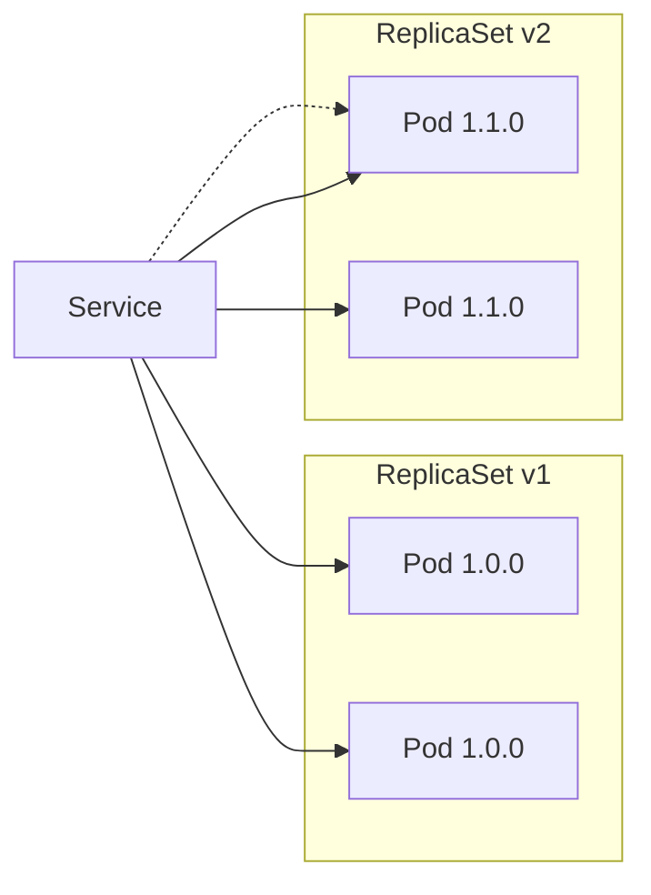
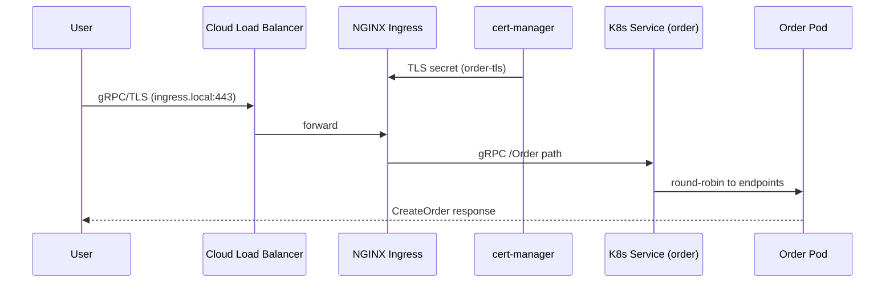

### 📖 Chapter Summary

Chapter 8 is where Babal (*gRPC Microservices in Go*, Ch.8) moves from local development to **cloud-native deployment**. Babal covers **Docker multistage builds** (Go builder → `scratch` runtime), **Kubernetes** fundamentals (control plane, Pods, Deployments, Services, Ingress), **NGINX Ingress** for gRPC with a single load balancer, **cert-manager** for TLS automation, and **deployment strategies** (RollingUpdate, Blue-Green, Canary). The chapter closes with GitOps pointers (ArgoCD, FluxCD).

Shuiskov (*Microservices with Go, 2nd Edition*, Ch.8 Kubernetes deployment) complements with K8s data model and deployment preparation patterns. Internet practice in **2026** adds **Skaffold** (already in the companion repo), **gRPC health probes**, **Gateway API**, OTLP-ready observability sidecars, and digest-pinned images.

This chapter answers: *How do we containerize Go gRPC services? How does traffic reach pods in Kubernetes? How do we automate TLS for gRPC Ingress? What deployment strategies minimize downtime?*

**Sources**

| Reference | Chapter / Section | Focus |
|-----------|-------------------|-------|
| Babal | Ch.8 — Deployment | Docker, K8s resources, Ingress, cert-manager, deploy strategies |
| Shuiskov | Ch.8 — Deploying via Kubernetes | K8s data model, deployment prep |
| Repo | `https://github.com/huseyinbabal/microservices` | `deployment.yaml`, Skaffold, Dockerfiles, Ingress |
| Internet (2026) | K8s docs, cert-manager, Gateway API | Health probes, GitOps, image pinning |

---

#### 🆕 Key New Concepts & Technologies

| **Concept / Technology** | **Short Description** | **Babal** | **Shuiskov** | **Repo** | **2026** |
|:--|:--|:--|:--|:--|:--|
| **Multistage Docker build** | Compile in `golang` image, run from `scratch` | Ch.8.1.1 | Ch.8 Docker section | `order/Dockerfile` ✓ | Pin base image digests |
| **Pod** | Minimum deployable K8s unit (containers + env) | Ch.8.2.4 | K8s data model | Deployment template | Add probes |
| **Deployment** | Manages ReplicaSets + rolling updates | Ch.8.2.5, Fig 8.5 | Deployment resources | `replicas: 1` | Set resource limits |
| **Service** | Stable network endpoint to pods | ClusterIP, NodePort, LoadBalancer | Service discovery in K8s | ClusterIP + headless Payment | ClusterIP for internal gRPC |
| **Ingress** | Path-based routing to Services | NGINX + gRPC annotations | — | `/Order`, `/Payment` paths ✓ | Consider Gateway API |
| **cert-manager** | Automated TLS cert lifecycle | ClusterIssuer + Ingress annotation | — | `selfsigned-issuer` ✓ | Let's Encrypt in prod |
| **RollingUpdate** | Default K8s deploy strategy | Ch.8.4.1 | — | Implicit default | `maxUnavailable` tuning |
| **Blue-Green** | Switch traffic between two environments | Ch.8.4.2 | — | — | Argo Rollouts |
| **Canary** | Gradual traffic shift to new version | Ch.8.4.3 | — | — | Flagger / service mesh |
| **Skaffold** | Local dev loop: build + deploy | Not in Babal Ch.8 | — | `skaffold.yaml` ✓ | Still popular for MS dev |

---

#### 📊 Comparison at a Glance

| Topic | Babal Ch.8 | Shuiskov Ch.8 | Repo | Current practice (2026) |
|-------|------------|---------------|------|-------------------------|
| **Container image** | Multistage `scratch` binary | Similar pattern | `order/`, `payment/` Dockerfiles | Distroless or scratch + non-root |
| **Service exposure** | Ingress > per-service LB | K8s Services | Ingress per service + gRPC backend | Single gateway; internal ClusterIP |
| **gRPC Ingress** | `backend-protocol: GRPC` | — | NGINX annotations ✓ | Same; verify HTTP/2 |
| **TLS** | cert-manager self-signed | — | `cert-manager.io/cluster-issuer` | Let's Encrypt + cert-manager |
| **DB readiness** | — | Init patterns | `mysql-check` initContainer ✓ | Same + migration job |
| **Deploy automation** | kubectl + GitOps mention | K8s deploy steps | Skaffold | ArgoCD / Flux + CI |
| **Proto compatibility** | RollingUpdate needs backward compat | — | — | Buf breaking + blue-green for breaking |

---

## Part 1: Docker — Cloud-Native Artifacts

### 📌 Concepts Explained

- **Docker**: Package application + dependencies into images; run as containers.
- **Go advantage**: Static binary — copy single executable into minimal image.
- **Multistage build**: Stage 1 compiles with full Go toolchain; stage 2 copies only the binary to `scratch`.
- **Registry**: Remote storage (Docker Hub, ECR, GCR) — K8s pulls images from registries via pull secrets.

### 💻 Dockerfile — Babal vs Repo

```dockerfile
# Babal (book) — order/Dockerfile pattern
FROM golang:1.18 AS builder
WORKDIR /usr/src/app
COPY . .
RUN CGO_ENABLED=0 GOOS=linux go build -a -installsuffix cgo -o order ./cmd/main.go

FROM scratch
COPY --from=builder /usr/src/app/order ./order
CMD ["./order"]

# 2026 hardened variant
FROM golang:1.22-bookworm AS builder
WORKDIR /src
COPY go.mod go.sum ./
RUN go mod download
COPY . .
RUN CGO_ENABLED=0 go build -trimpath -ldflags="-s -w" -o /order ./cmd/main.go

FROM gcr.io/distroless/static-debian12:nonroot
COPY --from=builder /order /order
USER nonroot:nonroot
ENTRYPOINT ["/order"]
```

### 💻 Build and Push

```bash
# Babal (book)
docker build -t order .
docker tag order huseyinbabal/order:1.0.0
docker push huseyinbabal/order:1.0.0

# Repo local (Skaffold handles build)
skaffold dev   # builds order + payment, deploys manifests
```

### 📊 Directory Tree — Per-Service Docker Layout

```
order/
├── Dockerfile          # multistage: builder → scratch
├── cmd/main.go
├── deployment.yaml     # K8s Service + Deployment + Ingress
└── go.mod
payment/
├── Dockerfile
├── cmd/main.go
└── deployment.yaml
```

### 🧪 Interview Q&A

**Q1:** Why use multistage Docker builds for Go gRPC services?

**Q2:** What is the `scratch` image and why use it?

**Q3:** What does `CGO_ENABLED=0` accomplish?

**Q4:** Why push images to a registry instead of copying to nodes?

**Q5:** How does the repo automate local build+deploy?

**Q6 (real-world):** "Your Go gRPC image is 800 MB. How do you shrink it?"

> [!success]- 📋 Answers — Part 1
> **A1:** Separates compile-time deps (Go SDK) from runtime. Final image contains only the static binary — tiny, fast pull, smaller attack surface.
>
> **A2:** Empty base image — no OS, shell, or package manager. You provide only the binary as entrypoint. Minimal size and attack surface.
>
> **A3:** Disables cgo — produces a fully static binary with no libc dependency, required for `scratch`/distroless images.
>
> **A4:** K8s nodes pull images on schedule from a central registry. Manual copy doesn't scale and breaks rolling updates across nodes.
>
> **A5:** `skaffold.yaml` defines build artifacts (order, payment Dockerfiles) and deploy manifests — `skaffold dev` loops build and kubectl apply.
>
> **A6:** Multistage build to scratch/distroless, `CGO_ENABLED=0`, strip symbols (`-ldflags="-s -w"`), don't copy source/tests into final stage.

---

## Part 2: Kubernetes Architecture and Core Resources

### 📌 Concepts Explained

- **Kubernetes (k8s)**: Container orchestration — abstracts disks, networking, load balancers.
- **Control plane**: API server, etcd, scheduler, controller manager — cluster brain.
- **Worker nodes**: kubelet, kube-proxy, pods (workloads).
- **kubectl apply flow** (Fig 8.4): YAML → API server → etcd → scheduler → kubelet pulls image → container runs.
- **Mandatory YAML fields**: `apiVersion`, `kind`, `spec`.

### 🔧 Control Plane Components (Babal Ch.8.2.1)

| Component | Role |
|-----------|------|
| kubectl | CLI → API server |
| API server | Unified cluster API |
| Scheduler | Assigns pods to nodes |
| Controller manager | Reconciles desired state (ReplicaSet, Deployment) |
| etcd | State store |
| kubelet | Node agent — ensures containers match spec |
| kube-proxy | Service networking / load balancing |

### 📊 ASCII — K8s Architecture (Babal Fig 8.2)

```
Internet → kubectl → API Server ←→ etcd
                        │
            ┌───────────┼───────────┐
            ▼           ▼           ▼
       Worker 1     Worker 2     Worker N
       kubelet      kubelet      kubelet
       Pod(s)       Pod(s)       Pod(s)
```

### 📊 Eagle View — Microservices on K8s (Babal Fig 8.3)

```
Load Balancer → Ingress Controller → Ingress (/order, /payment)
                                          │
                                    Service (order)
                                          │
                                      Pod (order)
                                    gRPC :8080
```

### 🧪 Interview Q&A

**Q1:** What is the minimum deployable unit in Kubernetes?

**Q2:** Walk through `kubectl apply -f deployment.yaml`.

**Q3:** What is etcd's role?

**Q4:** Why doesn't Kubernetes deploy containers directly?

**Q5:** How do services find each other inside a cluster?

**Q6 (real-world):** "What's the difference between a Pod and a Deployment?"

> [!success]- 📋 Answers — Part 2
> **A1:** A Pod — one or more containers sharing network namespace and storage.
>
> **A2:** kubectl sends manifest to API server → stored in etcd → scheduler assigns to node → kubelet pulls image and starts containers.
>
> **A3:** Distributed key-value store holding all cluster state — pod specs, service definitions, secrets.
>
> **A4:** Pods are ephemeral. Deployment/ReplicaSet abstractions manage replicas, rolling updates, and self-healing.
>
> **A5:** Kubernetes DNS — Service name resolves to ClusterIP which load-balances to healthy pod endpoints.
>
> **A6:** Pod is a single instance. Deployment manages N pod replicas via ReplicaSet, handles updates, and maintains desired state.

---

## Part 3: Deployment, Service, and Ingress for gRPC

### 📌 Concepts Explained

- **Deployment**: Declares desired replicas + pod template; creates ReplicaSet; handles RollingUpdate (Fig 8.5).
- **Service types**: ClusterIP (internal), NodePort (host port), LoadBalancer (cloud LB).
- **Ingress**: Path routing — one LB via Ingress controller instead of one LB per microservice.
- **gRPC Ingress**: Requires `nginx.ingress.kubernetes.io/backend-protocol: GRPC` annotation.

### 💻 Deployment — Babal vs Repo

```yaml
# Babal (book) — payment deployment excerpt
apiVersion: apps/v1
kind: Deployment
metadata:
  name: payment
spec:
  replicas: 2
  selector:
    matchLabels:
      app: payment
  template:
    spec:
      containers:
      - name: payment
        image: huseyinbabal/payment:v1.0.2
        env:
        - name: APPLICATION_PORT
          value: "8081"
        - name: DATA_SOURCE_URL
          value: "root:changeit@tcp(mysql:3306)/payments"

# Repo (order/deployment.yaml) — with init container + ingress
apiVersion: apps/v1
kind: Deployment
metadata:
  name: order
spec:
  replicas: 1
  template:
    spec:
      initContainers:
      - name: mysql-check
        image: busybox:1.28
        command: ['sh', '-c', 'until nslookup mysql; do sleep 10; done;']
      containers:
      - name: order
        image: order
        env:
        - name: PAYMENT_SERVICE_URL
          value: "payment:8081"
        ports:
        - containerPort: 8080
```

### 💻 Service + Ingress for gRPC

```yaml
# Repo — order Service + gRPC Ingress
apiVersion: v1
kind: Service
metadata:
  name: order
spec:
  selector:
    service: order
  ports:
  - name: grpc
    port: 8080
    targetPort: 8080
---
apiVersion: networking.k8s.io/v1
kind: Ingress
metadata:
  annotations:
    kubernetes.io/ingress.class: nginx
    nginx.ingress.kubernetes.io/backend-protocol: GRPC
    nginx.ingress.kubernetes.io/ssl-redirect: "true"
    cert-manager.io/cluster-issuer: selfsigned-issuer
  name: order
spec:
  rules:
  - http:
      paths:
      - path: /Order
        pathType: Prefix
        backend:
          service:
            name: order
            port:
              number: 8080
  tls:
  - hosts: [ingress.local]
    secretName: order-tls
```

### 📊 Service Type Comparison

| Type | Exposure | Cost | Use case |
|------|----------|------|----------|
| ClusterIP | Internal only | Free | Order→Payment gRPC (repo) |
| NodePort | Host IP:port | Medium | Dev/debug |
| LoadBalancer | Cloud LB per Service | High | Avoid for many MS |
| Ingress | One LB, many paths | Lower | Public gRPC/REST gateway |

### 🧪 Interview Q&A

**Q1:** Why use Ingress instead of LoadBalancer per microservice?

**Q2:** What annotation makes NGINX Ingress speak gRPC to the backend?

**Q3:** What is the Deployment → ReplicaSet → Pod hierarchy?

**Q4:** Why does the repo use an initContainer for MySQL?

**Q5:** How does Payment service discovery work for Order inside the cluster?

**Q6 (real-world):** "Expose gRPC Order service publicly. What K8s resources do you need?"

> [!success]- 📋 Answers — Part 3
> **A1:** One LoadBalancer per service is expensive and operationally heavy. Ingress controller provides a single entry point routing by path.
>
> **A2:** `nginx.ingress.kubernetes.io/backend-protocol: GRPC` — tells NGINX to use HTTP/2 gRPC to the backend, not HTTP/1.1.
>
> **A3:** Deployment defines desired state → creates ReplicaSet(s) → ReplicaSet creates Pod(s). Rolling update creates new ReplicaSet, scales down old.
>
> **A4:** Blocks Order/Payment pods until MySQL DNS resolves — prevents crash-loop on startup before DB is reachable.
>
> **A5:** Order uses `PAYMENT_SERVICE_URL=payment:8081` — K8s DNS resolves `payment` Service to Payment pod endpoints.
>
> **A6:** Deployment + Service + Ingress (with gRPC annotation) + Ingress controller + TLS cert (cert-manager). Optional: gRPC health probe on Deployment.

---

## Part 4: Certificate Management with cert-manager

### 📌 Concepts Explained

- **cert-manager**: K8s operator for certificate issuance and renewal (CRDs: Certificate, ClusterIssuer, etc.).
- **ClusterIssuer**: Cluster-wide cert authority config — Babal uses `selfSigned` for local dev.
- **Ingress integration**: `cert-manager.io/cluster-issuer` annotation triggers cert provisioning.
- **Client trust**: Browser/grpcurl needs CA cert installed for self-signed; Let's Encrypt for production.

### 💻 cert-manager Setup (Babal Ch.8.3)

```bash
helm repo add jetstack https://charts.jetstack.io
helm install cert-manager jetstack/cert-manager \
  --namespace cert-manager --create-namespace \
  --set installCRDs=true
```

```yaml
# ClusterIssuer — self-signed for local dev
apiVersion: cert-manager.io/v1
kind: ClusterIssuer
metadata:
  name: selfsigned-issuer
spec:
  selfSigned: {}
```

```bash
# /etc/hosts for local Ingress
# ingress.local 127.0.0.1
minikube tunnel
grpcurl -import-path ./proto -proto order.proto ingress.local:443 Order.Create
```

### 📊 TLS Flow — Ingress to gRPC Pod

```
Client ──TLS──► Ingress (terminates TLS, presents cert) ──gRPC──► Service ──► Pod
         cert-manager provisions TLS secret referenced in Ingress spec.tls
```

### 🧪 Interview Q&A

**Q1:** What problem does cert-manager solve?

**Q2:** What is a ClusterIssuer vs Issuer?

**Q3:** How does cert-manager integrate with Ingress?

**Q4:** Why does gRPC Ingress require HTTPS?

**Q5:** What's the production alternative to self-signed certs?

**Q6 (real-world):** "TLS works in browser but grpcurl fails. Why?"

> [!success]- 📋 Answers — Part 4
> **A1:** Automates certificate request, issuance, renewal, and mounting into Ingress/secrets — no manual OpenSSL on each deploy.
>
> **A2:** ClusterIssuer is cluster-scoped (any namespace). Issuer is namespace-scoped.
>
> **A3:** Ingress annotation `cert-manager.io/cluster-issuer: <name>` triggers Certificate resource creation; secret mounted for `spec.tls`.
>
> **A4:** gRPC runs over HTTP/2; browsers and NGINX gRPC mode expect TLS for HTTP/2 ALPN in production configurations.
>
> **A5:** Let's Encrypt via cert-manager `ACME` ClusterIssuer, or cloud-managed certs (ACM, GCP managed certs).
>
> **A6:** grpcurl needs `-cacert` or system trust store with the CA. Self-signed certs aren't trusted by default — import CA or use `-insecure` in dev only.

---

## Part 5: Deployment Strategies

### 📌 Concepts Explained

- **RollingUpdate** (default): New ReplicaSet created; old pods gradually terminated (Fig 8.9). Requires **backward-compatible** proto/API.
- **Blue-Green**: Two full environments; switch DNS/LB from green (v1) to blue (v2) (Fig 8.10). Higher cost, instant switch.
- **Canary**: Two Deployments share Service selector; traffic split gradually (Fig 8.11). Good for experimental features.
- **GitOps**: ArgoCD/FluxCD watch git repo and reconcile cluster state.

### 📊 Strategy Comparison

| Strategy | Downtime | Cost | Rollback | Proto breaking change |
|----------|----------|------|----------|----------------------|
| RollingUpdate | Near-zero | Low | Redeploy old image | Needs backward compat |
| Blue-Green | Zero (at switch) | 2× infra during deploy | Switch LB back | Can deploy breaking v2 to blue |
| Canary | Near-zero | Medium | Scale down canary | Test with subset of users |

### 💻 RollingUpdate Trigger

```bash
# Babal (book)
kubectl set image deployment/order order=order:1.1.0
kubectl rollout status deployment/order
kubectl rollout undo deployment/order   # rollback
```

### 📊 Mermaid — RollingUpdate Phases (Babal Fig 8.9)



### 🧪 Interview Q&A

**Q1:** What is the default Kubernetes deployment strategy?

**Q2:** Why must RollingUpdate services maintain backward compatibility?

**Q3:** Describe blue-green deployment in one paragraph.

**Q4:** How does canary deployment split traffic?

**Q5:** When would you choose blue-green over rolling update?

**Q6 (real-world):** "You need a breaking proto change. Which deploy strategy?"

> [!success]- 📋 Answers — Part 5
> **A1:** RollingUpdate — gradually replaces old pods with new ones via new ReplicaSet.
>
> **A2:** During rollout, v1 and v2 pods serve traffic simultaneously. Clients must work with both until rollout completes.
>
> **A3:** Run two identical environments (blue=new, green=current). Deploy and test blue internally, then switch the load balancer/DNS to blue. Instant cutover; old green kept for quick rollback.
>
> **A4:** Two Deployments with same Service selector labels — kube-proxy distributes requests across both v1 and v2 pods. Gradually scale v2 up and v1 down.
>
> **A5:** When you need instant switch/rollback, full pre-production validation of v2, or breaking changes that can't coexist during rollout.
>
> **A6:** Blue-green or canary with dual API versions — not plain RollingUpdate unless clients and servers support both proto versions simultaneously.

---

## Part 6: Skaffold, Secrets, and Production Hardening

### 📌 Concepts Explained

- **Skaffold**: Dev workflow tool — build images, deploy manifests, watch for changes.
- **Secrets / ConfigMaps**: Inject config without baking into images; ExternalSecrets for Vault/AWS SM.
- **Resource requests/limits**: CPU/memory per container — prevent noisy neighbor and OOM.
- **gRPC health service**: K8s probes should check gRPC readiness, not just TCP.

### 💻 Skaffold — Repo

```yaml
# skaffold.yaml (repo)
apiVersion: skaffold/v2beta29
kind: Config
build:
  artifacts:
  - image: order
    context: order
  - image: payment
    context: payment
deploy:
  kubectl:
    manifests:
    - mysql/deployment.yaml
    - order/deployment.yaml
    - payment/deployment.yaml
```

### 💻 2026 — gRPC Health Probe

```yaml
# Recommended addition (not in repo yet)
readinessProbe:
  grpc:
    port: 8080
  initialDelaySeconds: 5
livenessProbe:
  grpc:
    port: 8080
  initialDelaySeconds: 15
```

### 🧪 Interview Q&A

**Q1:** What does Skaffold automate for the companion repo?

**Q2:** Why use Kubernetes Secrets for `DATA_SOURCE_URL`?

**Q3:** What is ExternalSecrets?

**Q4:** Why add gRPC health probes?

**Q5:** What GitOps tools does Babal mention?

> [!success]- 📋 Answers — Part 6
> **A1:** Builds order/payment Docker images and applies mysql + order + payment K8s manifests in a dev loop.
>
> **A2:** Keeps credentials out of git and Docker layers; rotate secrets without rebuilding images.
>
> **A3:** Operator that syncs secrets from external stores (Vault, AWS Secrets Manager) into K8s Secrets automatically.
>
> **A4:** TCP probe only checks port open — gRPC health confirms the server can serve RPCs; prevents routing to starting/crashed processes.
>
> **A5:** ArgoCD and FluxCD — watch git repo, reconcile cluster to desired state.

---

## Part 7: Companion Repo Snapshot (2026)

### 🔧 Ahead of the Books

| Area | Status |
|------|--------|
| Multistage Dockerfiles | `order/`, `payment/` ✓ |
| K8s Deployment + Service + Ingress | Per-service `deployment.yaml` ✓ |
| gRPC Ingress annotations | `backend-protocol: GRPC` ✓ |
| cert-manager integration | `selfsigned-issuer` annotation ✓ |
| MySQL init wait | `initContainers` dns check ✓ |
| Skaffold dev loop | `skaffold.yaml` ✓ |
| Internal service discovery | `payment:8081` DNS name ✓ |

### ⚠️ Gaps vs 2026 Senior Standards

| Gap | Risk | Priority |
|-----|------|----------|
| No gRPC health probes | Traffic to unready pods | 🔴 High |
| No resource requests/limits | OOM / noisy neighbor | 🟡 Medium |
| DB password in plain env | Secret leakage via `kubectl describe` | 🔴 High |
| `replicas: 1` only | No HA | 🟡 Medium |
| Self-signed certs only | Not production-ready | 🟡 Medium (expected for book) |
| No HPA / PDB | No autoscale or disruption protection | 🟡 Medium |
| Payment headless Service (`clusterIP: None`) | Unusual for gRPC — verify intent | 🟡 Medium |

### 🧪 Interview Q&A

**Q1:** What K8s resources does the repo deploy per service?

**Q2:** How does the repo expose gRPC publicly?

**Q3:** What is the highest-priority production gap?

**Q4:** How does Skaffold fit the repo workflow?

**Q5:** Why is `PAYMENT_SERVICE_URL=payment:8081` correct inside K8s?

> [!success]- 📋 Answers — Part 7
> **A1:** Service, Deployment, and Ingress per order/payment; mysql Deployment separately.
>
> **A2:** NGINX Ingress with `backend-protocol: GRPC`, path `/Order` and `/Payment`, TLS via cert-manager.
>
> **A3:** Missing gRPC health probes and plaintext DB credentials in env vars — readiness and security risks.
>
> **A4:** One-command local dev: build both images, deploy all manifests, watch for file changes.
>
> **A5:** `payment` resolves to the Payment Service ClusterIP via K8s DNS within the same namespace.

---

## Part 8: Senior Recommendations and End-to-End Deploy Flow

### 🔧 Combined Recommendations

| # | Recommendation | Babal | Shuiskov | 2026 |
|---|----------------|-------|----------|------|
| 1 | Multistage Docker → scratch/distroless | Ch.8.1 ✓ | Ch.8 ✓ | Non-root user |
| 2 | Ingress over per-service LB | Ch.8.2.7 ✓ | — | Gateway API emerging |
| 3 | cert-manager for TLS | Ch.8.3 ✓ | — | Let's Encrypt ACME |
| 4 | RollingUpdate default + proto compat | Ch.8.4.1 | — | Buf breaking gates |
| 5 | Blue-green for breaking changes | Ch.8.4.2 | — | Argo Rollouts |
| 6 | GitOps for CD | Ch.8.4.4 mention | — | ArgoCD standard |
| 7 | gRPC health probes | — | — | Mandatory |
| 8 | Secrets for DB URLs | Mentioned | — | ExternalSecrets |

### 📊 Mermaid — Request Path: Internet to gRPC Pod



### 🧪 Master Interview Q&A

**Q1:** Walk through containerizing a Go gRPC service from source to running pod.

**Q2:** Explain the difference between Service, Ingress, and Ingress controller.

**Q3:** How does cert-manager enable TLS for gRPC Ingress?

**Q4:** Compare RollingUpdate, blue-green, and canary.

**Q5:** Why must proto schemas be backward compatible during RollingUpdate?

**Q6:** How does Order find Payment in the companion repo's K8s deployment?

**Q7 (real-world):** "Design K8s deployment for Order + Payment + MySQL."

**Q8 (real-world):** "NGINX returns 502 on gRPC calls. Debug checklist?"

**Q9:** What is Skaffold and when do you use it vs GitOps?

**Q10:** How do you roll back a bad deployment in Kubernetes?

> [!success]- 📋 Answers — Master Q&A
> **A1:** Write multistage Dockerfile → `docker build` → push to registry → write Deployment/Service/Ingress YAML → `kubectl apply` → scheduler places pod → kubelet pulls image → container runs gRPC server.
>
> **A2:** Service = stable cluster IP to pods. Ingress = routing rules (paths → services). Ingress controller = NGINX pod that implements Ingress rules and provisions LB.
>
> **A3:** ClusterIssuer defines CA → Ingress annotation triggers Certificate → TLS secret created → Ingress mounts secret for `spec.tls` → clients connect over HTTPS/gRPC.
>
> **A4:** Rolling = gradual pod replacement (default). Blue-green = two envs, switch LB. Canary = partial traffic to new version via shared selector scaling.
>
> **A5:** Old and new pods serve simultaneously during rollout. Clients on old stubs must still work until all pods updated.
>
> **A6:** `PAYMENT_SERVICE_URL=payment:8081` — K8s CoreDNS resolves Service name `payment` to endpoints.
>
> **A7:** MySQL Deployment + Service; Order and Payment Deployments with initContainers waiting for mysql DNS; ClusterIP Services; Order Ingress for external; internal gRPC via service DNS; Secrets for DB URL; gRPC health probes.
>
> **A8:** Check `backend-protocol: GRPC` annotation, HTTP/2 enabled, Service port matches containerPort, pod actually listening, TLS cert valid, grpcurl with correct authority/SNI.
>
> **A9:** Skaffold = fast local dev iteration. GitOps = production CD reconciling git to cluster. Use both — Skaffold for dev, ArgoCD for prod.
>
> **A10:** `kubectl rollout undo deployment/order` or redeploy previous image tag via CI.

---

### 💡 Pro Tips & Best Practices (Combined)

1. **Multistage + scratch/distroless** — smallest image, smallest attack surface for Go gRPC binaries.
2. **One Ingress controller, many paths** — don't provision a LoadBalancer per microservice.
3. **Annotate gRPC backends** — `backend-protocol: GRPC` on NGINX Ingress is mandatory.
4. **cert-manager from day one** — even self-signed locally; swap to Let's Encrypt for prod.
5. **Init containers for dependencies** — wait for MySQL DNS before app starts (repo pattern).
6. **Use K8s DNS for internal gRPC** — `payment:8081`, never hard-code pod IPs.
7. **RollingUpdate requires proto backward compat** — gate with `buf breaking` in CI.
8. **Blue-green for breaking API changes** — don't roll breaking protos with default strategy.
9. **Add gRPC health probes** — readiness must reflect RPC ability, not just open port.
10. **Store secrets in K8s Secrets / ExternalSecrets** — not plain `env` values in git.

---

### 🔨 Hands-On Tasks

#### Task 1: Deploy Order to Minikube with Ingress
**Goal:** Apply Babal Ch.8 flow — build image, deploy, verify gRPC via Ingress.
**Files:** `order/Dockerfile`, `order/deployment.yaml`
**Steps:**
1. `eval $(minikube docker-env)` then `docker build -t order ./order`
2. Install NGINX Ingress controller and cert-manager via Helm.
3. Apply ClusterIssuer + order deployment.yaml.
4. `minikube tunnel` + add `ingress.local` to `/etc/hosts`.
5. `grpcurl -insecure ingress.local:443 list` or call `Order.Create`.
**Done when:** gRPC response returns from the Ingress path.

#### Task 2: Trigger and roll back a RollingUpdate
**Goal:** Experience Babal Fig 8.9 rollout lifecycle.
**Files:** Existing order Deployment
**Steps:**
1. `kubectl set image deployment/order order=order:v2` (rebuild image first).
2. `kubectl rollout status deployment/order` — watch pods transition.
3. `kubectl get rs` — observe two ReplicaSets during rollout.
4. `kubectl rollout undo deployment/order`.
**Done when:** Rollback completes and all pods run previous image.

---

### 📚 Further Reading

| Resource | Topic |
|----------|-------|
| Babal Ch.6 | TLS/mTLS theory applied in Ch.8 cert-manager |
| Babal Ch.9 | Observability stack on K8s (Jaeger Helm) |
| Shuiskov Ch.8 | Kubernetes deployment preparation |
| [Kubernetes docs — Deployments](https://kubernetes.io/docs/concepts/workloads/controllers/deployment/) | RollingUpdate, rollback |
| [NGINX Ingress gRPC](https://kubernetes.github.io/ingress-nginx/user-guide/grpc/) | gRPC annotations |
| [cert-manager docs](https://cert-manager.io/docs/) | ClusterIssuer, ACME |
| [Skaffold docs](https://skaffold.dev/) | Local dev workflow |
| [Companion repo](https://github.com/huseyinbabal/microservices) | deployment.yaml, skaffold.yaml |

---

### 🤖 Regenerate this guide

1. [[AI-Prompt/00 - General Study Guide Prompt]] — fill Inputs (Babal = Ref 1, Shuiskov = Ref 2, Internet = Ref 3, PRIMARY = 1)
2. [[AI-Prompt/01 - Go - Specific Prompt]] — append Go code/tree requirements
3. [[Go/gRPC Microservices in Go/AI-Prompt - grpc-babal]] — append this project prompt

---

*Study guide for Deployment (Ch.8), 2026.*