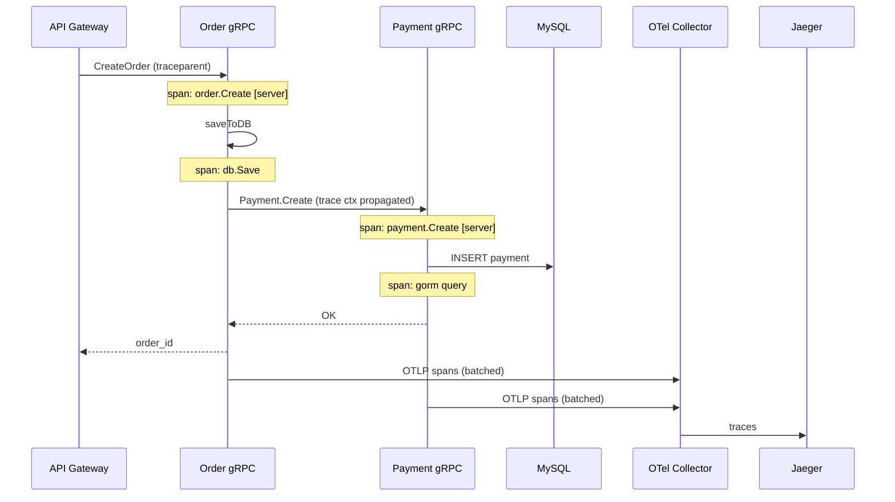

### 📖 Chapter Summary

Chapter 9 is where Babal (*gRPC Microservices in Go*, Ch.9) makes distributed systems **visible**. Babal introduces the observability triad — **traces**, **metrics**, and **logs** — and implements them with **OpenTelemetry** (gRPC interceptors, tracer provider), **Jaeger** (trace UI + SPM), **Prometheus** (time-series metrics), and the **ELK-adjacent stack** (Fluent Bit → Elasticsearch → Kibana) for log correlation via `trace_id` injected into **logrus** JSON output.

Shuiskov (*Microservices with Go, 2nd Edition*, Ch.12 Collecting Service Telemetry Data) complements with broader telemetry patterns, Prometheus alerting, and dashboard design. Internet practice in **2026** migrates from the deprecated **Jaeger exporter** to **OTLP → OpenTelemetry Collector**, uses `otelgrpc.NewServerHandler()`/`NewClientHandler()`, and standardizes on **Grafana** (metrics + traces) alongside or instead of Kibana for logs.

This chapter answers: *How do we trace a PlaceOrder across Order→Payment? How do metrics inform SLOs? How do logs correlate with traces? How do we deploy the observability stack on Kubernetes?*

**Sources**

| Reference | Chapter / Section | Focus |
|-----------|-------------------|-------|
| Babal | Ch.9 — Observability | Traces, metrics, logs, OTel, Jaeger, Fluent Bit, ELK |
| Shuiskov | Ch.12 — Collecting Service Telemetry Data | Telemetry overview, Prometheus, OTel Collector |
| Repo | `https://github.com/huseyinbabal/microservices` | OTel on Order+Payment, logrus trace_id, Jaeger exporter |
| Internet (2026) | OpenTelemetry, Grafana, OTLP | Collector pipeline, deprecated Jaeger exporter |

---

#### 🆕 Key New Concepts & Technologies

| **Concept / Technology** | **Short Description** | **Babal** | **Shuiskov** | **Repo** | **2026** |
|:--|:--|:--|:--|:--|:--|
| **Trace** | Journey of one request across services | Fig 9.1 PlaceOrder spans | Ch.12 tracing | Jaeger UI ✓ | OTLP export |
| **Span** | Single operation within a trace | rpc.service, rpc.method tags | Span attributes | Order + Payment spans | W3C tracecontext |
| **Metrics** | Numerical time-series (latency, errors) | Prometheus + percentiles | Ch.12 metrics | Via Jaeger SPM | Prometheus + Grafana |
| **Logs** | Application events for debugging | logrus JSON + trace_id | Structured logging | `trace_id` in logs ✓ | Same + Loki alternative |
| **SLA / SLI / SLO** | Agreement, indicator, objective | Ch.9.1.2 percentile math | Ch.12 SLO patterns | — | Error budgets |
| **OpenTelemetry** | Vendor-neutral telemetry SDK | otelgrpc interceptors | OTel Collector (Ch.12) | Jaeger exporter (legacy) | OTLP exporter |
| **Jaeger** | Distributed tracing backend + UI | Helm chart (all-in-one) | Jaeger mention | Collector endpoint in main.go | Backend via OTel Collector |
| **Prometheus** | Time-series metrics store | Paired with Jaeger SPM | Ch.12 Prometheus | Helm chart included | Still standard |
| **Fluent Bit** | Log shipper DaemonSet | Ch.9.3.8 | — | Not in repo | + Loki option |
| **Correlation** | Link logs ↔ traces via trace_id | Fig 9.17–9.19 | Ch.12 correlation | logrus formatter ✓ | Exemplars in metrics |

---

#### 📊 Comparison at a Glance

| Topic | Babal Ch.9 | Shuiskov Ch.12 | Repo | Current practice (2026) |
|-------|------------|----------------|------|-------------------------|
| **Trace propagation** | W3C TraceContext via OTel SDK | OTel SDK + Collector | `propagation.TraceContext{}` ✓ | Same; baggage for biz IDs |
| **gRPC instrumentation** | `otelgrpc.UnaryServerInterceptor` | OTel gRPC libs | Client interceptor on Payment | `NewServerHandler`/`NewClientHandler` |
| **Trace export** | Jaeger exporter direct | OTLP to Collector | `jaeger.New(...)` deprecated | `otlptracegrpc` → Collector |
| **Metrics backend** | Prometheus via Jaeger SPM | Prometheus + alerting | Helm chart | Grafana dashboards |
| **Log correlation** | trace_id in logrus JSON | Structured + trace context | customLogger formatter ✓ | `slog` + trace context |
| **Log pipeline** | Fluent Bit → Elasticsearch → Kibana | Log aggregation patterns | stdout only in repo | Fluent Bit → Loki or ES |
| **Percentiles** | p95 over averages | Histogram buckets | Jaeger SPM p95 | Prometheus histogram_quantile |
| **Instrumentation scope** | Client + server + GORM | Full telemetry chapter | Order server + Payment client | + DB, all outbound stubs |

---

## Part 1: Observability Foundations — Traces, Metrics, Logs

### 📌 Concepts Explained

- **Observability**: Ability to understand system internal state from external outputs — essential when PlaceOrder touches Order, Payment, and Shipping.
- **Three pillars**: Traces (request journey), metrics (aggregated numbers), logs (discrete events).
- **Correlation**: Same `trace_id` across all three — the key to debugging distributed failures.
- **Monitoring vs observability**: Monitoring alerts on known thresholds; observability lets you explore unknown issues.

### 🔧 Babal — Questions Observability Answers (Ch.9.1)

- Why did the Product service crash yesterday?
- Why is performance degraded every Thursday?
- What is Payment service latency right now?

### 🔧 Shuiskov — Telemetry Mindset (Ch.12 preview)

Shuiskov treats telemetry as a first-class production requirement: collect logs, metrics, and traces from day one, not as an afterthought retrofit.

### 📊 Three Pillars Comparison

| Pillar | Answers | Example | Tool (Babal) |
|--------|---------|---------|--------------|
| Traces | "What path did this request take?" | Order→Payment span tree | Jaeger UI |
| Metrics | "How fast/error-prone is Payment?" | p95 latency, error rate | Prometheus + Jaeger SPM |
| Logs | "What did Payment log at failure time?" | JSON with trace_id | Kibana |

### 🧪 Interview Q&A

**Q1:** What are the three pillars of observability?

**Q2:** Why do microservices need observability more than monoliths?

**Q3:** What is the difference between monitoring and observability?

**Q4:** What questions does Babal say observability should answer?

**Q5:** Why is correlating traces, metrics, and logs important?

**Q6 (real-world):** "A user reports a slow checkout. Where do you look first?"

> [!success]- 📋 Answers — Part 1
> **A1:** Traces (distributed request flow), metrics (time-series aggregates), logs (event records).
>
> **A2:** One user request crosses many services — failure can occur anywhere. Without distributed tracing, you see slow Order but not that Payment DB is the bottleneck.
>
> **A3:** Monitoring watches known metrics for threshold breaches. Observability lets you interrogate the system to diagnose novel problems using correlated telemetry.
>
> **A4:** Root cause of crashes, periodic performance degradation patterns, real-time service health.
>
> **A5:** Trace shows Payment was slow; metrics confirm p95 spike; logs at that trace_id show the exact SQL error — together they pinpoint root cause fast.
>
> **A6:** Find the trace_id (from gateway or logs) → Jaeger trace waterfall → identify slow span → check metrics for that service → filter logs by trace_id.

---

## Part 2: Distributed Tracing — Traces and Spans

### 📌 Concepts Explained

- **Trace**: Collection of spans for one logical transaction (e.g., PlaceOrder). Auto-generated **trace ID** at entry.
- **Span**: Single operation — `OrderService:saveToDB`, `paymentClient:Create`, `paymentService:charge` (Fig 9.1).
- **Span tags**: `rpc.service`, `rpc.method`, `span.kind` (client/server), `rpc.system=grpc` (Fig 9.2).
- **Propagation**: Trace context flows Order → Payment via gRPC metadata (W3C TraceContext).

### 📊 Trace Structure (Babal Fig 9.1)

```
Trace: PlaceOrder
├── Span 1: OrderService:saveToDB()
├── Span 2: paymentClient:Create()     [client span]
└── Span 3: paymentService:charge()    [server span]
         └── Span 4: DB query (GORM/otelgorm)
```

### 📊 Span Tags (Babal Fig 9.2)

| Tag | Example | Meaning |
|-----|---------|---------|
| `rpc.service` | Payment | gRPC service name |
| `rpc.method` | Create | RPC method |
| `span.kind` | server / client | Instrumentation side |
| `rpc.system` | grpc | RPC framework |

### 🧪 Interview Q&A

**Q1:** What is the difference between a trace and a span?

**Q2:** When is a new trace ID created?

**Q3:** What span tags identify a gRPC server handler?

**Q4:** How does trace context cross from Order to Payment?

**Q5:** Why instrument both client and server sides?

**Q6 (real-world):** "Jaeger shows Order span but no Payment child span. What broke?"

> [!success]- 📋 Answers — Part 2
> **A1:** Trace = entire request journey. Span = one operation within that journey.
>
> **A2:** At the system entry point (API gateway or first service receiving the external request).
>
> **A3:** `span.kind=server`, `rpc.service`, `rpc.method`, `rpc.system=grpc`.
>
> **A4:** OpenTelemetry propagator injects trace context into gRPC outgoing metadata on client; server extractor continues the trace.
>
> **A5:** Client span shows stub call latency; server span shows handler + DB time. Both needed to find whether delay is network or server processing.
>
> **A6:** Trace propagation not configured on Payment client or server — missing `SetTextMapPropagator` or OTel handler on one side.

---

## Part 3: Metrics — SLI, SLO, and Percentiles

### 📌 Concepts Explained

- **SLA**: Agreement with customers (latency, uptime guarantees).
- **SLI**: Measurable indicator (request latency, error rate, throughput).
- **SLO**: Internal target (e.g., 99.999% uptime).
- **Average vs percentile**: Average hides outliers — p95/p99 reveal tail latency (Babal Fig 9.3–9.5).
- **Jaeger SPM**: Service Performance Monitoring — p95 latency, request rate, error rate from Prometheus data.

### 🔧 Percentile Example (Babal)

Latencies: `10 22 2 3 9 1 87 11 7 4` → sorted: `87 22 11 10 9 7 4 3 2 1` → 80th percentile ≈ 11 ms.

**Problem with averages**: 1000× 1 ms + 10× 4000 ms → average 5 ms, but 10 users waited 4 seconds.

### 📊 SLA → SLI → SLO Chain

```
SLA (customer contract) → SLO (team target) → SLI (measured metric) → Prometheus histogram
```

### 🧪 Interview Q&A

**Q1:** Define SLA, SLI, and SLO.

**Q2:** Why is p95 latency more useful than average latency for SLOs?

**Q3:** What metrics does Jaeger SPM show?

**Q4:** How does Prometheus store gRPC metrics?

**Q5:** What is an error budget in SLO terms?

**Q6 (real-world):** "SLO is p99 < 200ms. p99 is 350ms. What do you do?"

> [!success]- 📋 Answers — Part 3
> **A1:** SLA = customer-facing agreement. SLI = specific measurable metric (latency, errors). SLO = internal goal to meet SLA (e.g., 99.9% of requests < 100ms).
>
> **A2:** Averages mask tail outliers. p95 tells you 95% of users experience latency at or below that value — better customer experience proxy.
>
> **A3:** p95 latency, request rate (req/s), error rate — per service, aggregated from Prometheus.
>
> **A4:** Time-series with name, labels, timestamp. OTel Collector exports to Prometheus; Jaeger SPM queries Prometheus for dashboards.
>
> **A5:** Allowed unreliability window — if SLO is 99.9%, error budget is 0.1% downtime/errors before SLA breach.
>
> **A6:** Halt feature work, fix performance regression — investigate traces for slow spans, check recent deploys, scale hot service, optimize DB queries.

---

## Part 4: OpenTelemetry Instrumentation in gRPC Services

### 📌 Concepts Explained

- **Instrumentation locations**: gRPC client adapter, gRPC server, database (otelgorm).
- **Tracer provider**: Global OTel setup in `main.go` — exporter + resource attributes + batcher.
- **Propagation**: `otel.SetTextMapPropagator(propagation.TraceContext{})` — W3C standard.
- **Interceptors/handlers**: `otelgrpc` on both client and server gRPC connections.

### 💻 Tracer Provider — Babal vs Repo vs 2026

```go
// Babal + Repo (order/cmd/main.go) — Jaeger exporter (deprecated path)
func tracerProvider(url string) (*tracesdk.TracerProvider, error) {
    exp, err := jaeger.New(jaeger.WithCollectorEndpoint(jaeger.WithEndpoint(url)))
    tp := tracesdk.NewTracerProvider(
        tracesdk.WithBatcher(exp),
        tracesdk.WithResource(resource.NewWithAttributes(
            semconv.SchemaURL,
            semconv.ServiceNameKey.String("order"),
            attribute.String("environment", "dev"),
        )),
    )
    return tp, nil
}

func main() {
    tp, _ := tracerProvider("http://jaeger-otel.jaeger.svc.cluster.local:14278/api/traces")
    otel.SetTracerProvider(tp)
    otel.SetTextMapPropagator(propagation.NewCompositeTextMapPropagator(propagation.TraceContext{}))
}

// 2026 recommended — OTLP to OpenTelemetry Collector
import "go.opentelemetry.io/otel/exporters/otlp/otlptrace/otlptracegrpc"

exp, _ := otlptracegrpc.New(ctx,
    otlptracegrpc.WithEndpoint("otel-collector:4317"),
    otlptracegrpc.WithInsecure(), // TLS in prod
)
tp := tracesdk.NewTracerProvider(tracesdk.WithBatcher(exp), ...)
```

### 💻 gRPC Instrumentation — Book vs Repo vs 2026

```go
// Babal (book) — server
grpcServer := grpc.NewServer(
    grpc.UnaryInterceptor(otelgrpc.UnaryServerInterceptor()),
)

// Repo — payment client adapter
grpc.WithUnaryInterceptor(otelgrpc.UnaryClientInterceptor())

// 2026 recommended
grpcServer := grpc.NewServer(
    grpc.StatsHandler(otelgrpc.NewServerHandler()),
)
conn, _ := grpc.NewClient(addr,
    grpc.WithStatsHandler(otelgrpc.NewClientHandler()),
)
```

### 📊 Directory Tree — Instrumentation Touchpoints

```
order/
├── cmd/main.go                    # TracerProvider + propagator
├── internal/adapters/
│   ├── grpc/server.go             # OTel server interceptor/handler
│   ├── grpc/grpc.go               # log.WithContext(ctx) — trace in logs
│   └── payment/payment.go         # OTel client interceptor
payment/
├── cmd/main.go                    # TracerProvider
└── internal/adapters/grpc/        # OTel server interceptor
```

### 🧪 Interview Q&A

**Q1:** Where does Babal configure the global tracer provider?

**Q2:** What does `SetTextMapPropagator(TraceContext{})` do?

**Q3:** Difference between OTel client interceptor and server interceptor?

**Q4:** Why batch spans before export?

**Q5:** Why is the Jaeger direct exporter deprecated in 2026?

**Q6 (real-world):** "How do you add tracing to a new gRPC service in this architecture?"

> [!success]- 📋 Answers — Part 4
> **A1:** `cmd/main.go` — before adapters initialize. Sets global provider used by all otelgrpc instrumentation.
>
> **A2:** Configures W3C `traceparent` header propagation over gRPC metadata — child spans link to parent trace.
>
> **A3:** Client interceptor creates spans for outbound stub calls; server interceptor creates spans for incoming RPC handlers.
>
> **A4:** Reduces export overhead — batching spans every N seconds is more efficient than per-span network calls.
>
> **A5:** OTel recommends OTLP as the universal export protocol. Jaeger now accepts OTLP natively; direct Jaeger exporter is unmaintained.
>
> **A6:** Add OTLP tracer provider in `main.go`, `NewServerHandler` on gRPC server, `NewClientHandler` on all client stubs, `TraceContext` propagator, service.name resource attribute.

---

## Part 5: Log Correlation and Structured Logging

### 📌 Concepts Explained

- **Structured logs**: JSON with key-value fields — easy for Elasticsearch/Loki indexing.
- **trace_id injection**: Custom logrus formatter reads `trace.SpanFromContext(entry.Context)` and adds `trace_id`, `span_id` to every log line.
- **`log.WithContext(ctx)`**: Ensures handler logs include the active span's trace ID.
- **K8s logging**: Container stdout → `/var/log/containers` → Fluent Bit DaemonSet → Elasticsearch.

### 💻 Logrus Correlation — Babal = Repo

```go
// order/cmd/main.go — customLogger formatter (repo matches book)
func (l customLogger) Format(entry *log.Entry) ([]byte, error) {
    span := trace.SpanFromContext(entry.Context)
    entry.Data["trace_id"] = span.SpanContext().TraceID().String()
    entry.Data["span_id"] = span.SpanContext().SpanID().String()
    return l.formatter.Format(entry)
}

// order/internal/adapters/grpc/grpc.go
func (a Adapter) Create(ctx context.Context, req *order.CreateOrderRequest) (*order.CreateOrderResponse, error) {
    log.WithContext(ctx).Info("Creating order...")
    // ...
}
```

```json
{"level":"info","message":"Creating order...","trace_id":"4a55375c835c1e0f78d5a0001b6f5f5d","span_id":"1ab65b1c982ee940","time":"..."}
```

### 📊 Logging Architectures (Babal Fig 9.6–9.7)

```
Node-level:  app → stdout/file → log rotation → ship to backend
Cluster-level: pod stdout → Fluent Bit DaemonSet (per node) → Elasticsearch → Kibana
```

### 🧪 Interview Q&A

**Q1:** How does Babal inject trace IDs into application logs?

**Q2:** Why use JSON logs instead of plain text?

**Q3:** What is a DaemonSet in the logging context?

**Q4:** How do you find all logs for one PlaceOrder in Kibana?

**Q5:** Why call `log.WithContext(ctx)` in gRPC handlers?

**Q6 (real-world):** "Trace shows error but logs are empty. Why?"

> [!success]- 📋 Answers — Part 5
> **A1:** Custom logrus `Format` function extracts span from `entry.Context`, adds `trace_id` and `span_id` fields to JSON output.
>
> **A2:** Log aggregators index JSON fields automatically. Plain text requires regex parsing — fragile and slow.
>
> **A3:** Ensures one log collector pod runs per K8s node — collects all container logs under `/var/log/containers`.
>
> **A4:** Search Kibana for `trace_id: "4a55375c..."` — returns all log lines from every service in that request.
>
> **A5:** Without context, logs have zero trace_id — cannot correlate with Jaeger trace. Handler receives ctx with active span from OTel middleware.
>
> **A6:** Handler logged without `WithContext(ctx)`, or log level filtered out, or Fluent Bit not shipping that pod's stdout.

---

## Part 6: Observability Stack on Kubernetes

### 📌 Concepts Explained

- **Jaeger All-in-One**: UI (16686) + collector + query in one image.
- **OpenTelemetry Collector**: Receives OTLP/Jaeger from apps; exports to Jaeger + Prometheus.
- **Prometheus**: Time-series store; Jaeger SPM queries it for p95 charts.
- **Fluent Bit → Elasticsearch → Kibana**: Log pipeline (Babal Ch.9.3.8–9.3.10).
- **Helm**: Babal's custom chart `huseyinbabal/jaeger` bundles all three.

### 💻 Jaeger Helm Install (Babal Ch.9.3.4)

```bash
helm repo add huseyinbabal https://huseyinbabal.github.io/charts
helm install my-jaeger huseyinbabal/jaeger -n jaeger --create-namespace

# Access UI
kubectl port-forward svc/jaeger 16686:16686 -n jaeger
# http://localhost:16686
```

### 💻 Fluent Bit → Elasticsearch (Babal Ch.9.3.8–9.3.10)

```bash
helm repo add fluent https://fluent.github.io/helm-charts
helm install fluent-bit fluent/fluent-bit -f fluent.yaml
# fluent.yaml outputs to quickstart-es-http (Elasticsearch)
```

### 📊 Observability Stack Architecture (Babal Fig 9.8)

```
Order ──OTel──► OTel Collector ──► Jaeger (traces UI)
Payment ──OTel──►     │          ──► Prometheus (metrics)
                      │
Pod stdout ──► Fluent Bit ──► Elasticsearch ──► Kibana (logs)
```

### 📊 Mermaid — PlaceOrder Trace Flow



### 🧪 Interview Q&A

**Q1:** What three components does Babal's Jaeger Helm chart include?

**Q2:** What port does the OTel Collector listen on for trace ingestion?

**Q3:** How does Jaeger SPM get performance metrics?

**Q4:** What is the role of Fluent Bit?

**Q5:** How do you view traces locally after Helm install?

**Q6 (real-world):** "Design observability stack for 5 gRPC services on K8s."

> [!success]- 📋 Answers — Part 6
> **A1:** Jaeger All-in-One, OpenTelemetry Collector, Prometheus.
>
> **A2:** Port 14278 for collector endpoint in Babal's chart (2026 OTLP standard: 4317 gRPC, 4318 HTTP).
>
> **A3:** OTel Collector exports metrics to Prometheus; Jaeger SPM queries Prometheus for p95, request rate, error rate charts.
>
> **A4:** DaemonSet log shipper — tails container logs on each node, forwards to Elasticsearch (or Loki).
>
> **A5:** `kubectl port-forward` to Jaeger UI port 16686, search by service name.
>
> **A6:** OTel Collector (Deployment) receiving OTLP from all pods → Jaeger for traces + Prometheus for metrics + Grafana dashboards. Fluent Bit DaemonSet → Loki/ES for logs. All apps: OTLP exporter + log trace_id injection.

---

## Part 7: Companion Repo Snapshot (2026)

### 🔧 Ahead of the Books

| Area | Status |
|------|--------|
| OTel tracer provider | Order + Payment `main.go` ✓ |
| W3C TraceContext propagation | `SetTextMapPropagator` ✓ |
| OTel gRPC client interceptor | Payment adapter ✓ |
| trace_id in JSON logs | logrus customLogger ✓ |
| `log.WithContext(ctx)` in handlers | `grpc.go` Create handler ✓ |
| Service resource attributes | service name, environment, ID ✓ |

### ⚠️ Gaps vs 2026 Senior Standards

| Gap | Risk | Priority |
|-----|------|----------|
| Jaeger exporter (deprecated) | Migration debt | 🔴 High |
| `UnaryServerInterceptor` vs `NewServerHandler` | Deprecated API | 🟡 Medium |
| No OTel on Order payment client only — verify server | Incomplete trace tree | 🟡 Medium |
| No Fluent Bit / log stack in repo | Logs not centrally searchable | 🟡 Medium |
| No Prometheus metrics export (OTLP metrics) | No SLO dashboards | 🟡 Medium |
| No GORM otelgorm in repo | DB spans missing | 🟡 Medium |
| Hardcoded Jaeger URL | Not env-configurable | 🟡 Medium |

### 🧪 Interview Q&A

**Q1:** What observability does the repo implement today?

**Q2:** Where is trace_id added to logs?

**Q3:** What is the highest-priority observability migration?

**Q4:** Does Payment service have tracing?

**Q5:** What would a complete trace of CreateOrder show?

> [!success]- 📋 Answers — Part 7
> **A1:** OTel tracing with Jaeger exporter on Order and Payment, client-side OTel on Payment stub, trace/span ID in logrus JSON logs.
>
> **A2:** `customLogger.Format` in `order/cmd/main.go` (and payment equivalent) — reads span from log entry context.
>
> **A3:** Replace Jaeger exporter with OTLP exporter pointing to OpenTelemetry Collector — Jaeger exporter deprecated.
>
> **A4:** Yes — Payment has its own tracer provider and should have server-side OTel interceptor on gRPC server.
>
> **A5:** Gateway span → Order `Create` server span → DB save span → Payment client span → Payment `Create` server span → DB insert span (if otelgorm enabled).

---

## Part 8: Senior Recommendations and Operational Excellence

### 🔧 Combined Recommendations

| # | Recommendation | Babal | Shuiskov | 2026 |
|---|----------------|-------|----------|------|
| 1 | Instrument client + server gRPC | Ch.9.2 ✓ | Ch.12 ✓ | `NewClientHandler`/`NewServerHandler` |
| 2 | Propagate W3C TraceContext | Ch.9.3.5 ✓ | — | + baggage for correlation IDs |
| 3 | Inject trace_id into structured logs | Ch.9.3.7 ✓ | — | `slog` with trace context |
| 4 | Use percentiles for SLOs | Ch.9.1.2 ✓ | Ch.12 ✓ | Prometheus histograms |
| 5 | OTLP → Collector → backends | Partial (Jaeger direct) | OTel Collector ✓ | Standard pipeline |
| 6 | Fluent Bit for log shipping | Ch.9.3.8 ✓ | — | Or Grafana Loki |
| 7 | Jaeger for trace UI | Ch.9.3 ✓ | Jaeger mention | + Grafana Tempo option |
| 8 | Correlate all three pillars | Ch.9 summary | Ch.12 ✓ | Unified Grafana dashboards |

### 🧪 Master Interview Q&A

**Q1:** Explain the full observability path for a PlaceOrder request.

**Q2:** How do you correlate a Jaeger trace with Kibana logs?

**Q3:** Why are averages insufficient for latency SLOs?

**Q4:** Migrate Babal's Jaeger exporter to 2026 OTLP. What changes?

**Q5:** What spans should a well-instrumented Order→Payment call show?

**Q6:** Difference between OTel Collector and Jaeger?

**Q7 (real-world):** "Payment p95 latency doubled after deploy. Debug workflow?"

**Q8 (real-world):** "How do you propagate trace context through gRPC metadata?"

**Q9:** What is Jaeger SPM and what data feeds it?

**Q10:** Why instrument the DB layer with otelgorm?

> [!success]- 📋 Answers — Master Q&A
> **A1:** Gateway creates trace → Order server span → Payment client span → Payment server span → spans batched to OTel Collector → Jaeger UI. Metrics flow to Prometheus (p95, error rate). Logs emit JSON with same trace_id → Fluent Bit → Kibana.
>
> **A2:** Copy trace_id from Jaeger trace detail → search `trace_id` field in Kibana → see all service logs for that request chronologically.
>
> **A3:** A few extreme outliers skew average without affecting most users — p95/p99 capture tail latency that customers actually feel.
>
> **A4:** Replace `jaeger.New(...)` with `otlptracegrpc.New(...)`. Point at OTel Collector `:4317`. Deploy Collector with exporters to Jaeger + Prometheus. Switch `UnaryServerInterceptor` to `NewServerHandler`.
>
> **A5:** `order.Create` [server], `payment.Payment/Create` [client], `payment.Create` [server], optional DB spans on each side.
>
> **A6:** Collector = vendor-neutral telemetry router (receive OTLP, export to many backends). Jaeger = trace storage + UI. Collector sits in front; Jaeger is one backend.
>
> **A7:** Check Jaeger SPM for p95 spike timing → find slow traces → identify slow span (DB? network?) → check Payment logs by trace_id → compare with previous deploy diff.
>
> **A8:** `otel.SetTextMapPropagator(TraceContext{})` on both services. OTel gRPC handlers inject/extract `traceparent` from metadata automatically on client and server.
>
> **A9:** Service Performance Monitoring in Jaeger UI — shows p95 latency, request rate, error rate per service. Data sourced from Prometheus time-series fed by OTel Collector.
>
> **A10:** Without DB spans, trace shows Payment handler took 50ms but you can't see 45ms was a slow SQL query — otelgorm adds the missing visibility.

---

### 💡 Pro Tips & Best Practices (Combined)

1. **Instrument from day one** — retrofitting traces across services is expensive; add OTel when you create the first gRPC stub.
2. **Propagate context everywhere** — gateway → all stubs → all handlers; broken chain = broken traces.
3. **Use `log.WithContext(ctx)`** in every handler — logs without trace_id are orphans in distributed debugging.
4. **Prefer OTLP over Jaeger exporter** — one protocol to Collector, many backends.
5. **Use p95/p99 for SLOs** — not averages; set Prometheus histogram buckets accordingly.
6. **Batch span export** — `WithBatcher` in TracerProvider; don't export per span.
7. **Add resource attributes** — `service.name`, `deployment.environment` for filtering in Jaeger/Grafana.
8. **Deploy OTel Collector centrally** — apps only know one endpoint; swap backends without redeploying services.
9. **Structured JSON logs** — required for Elasticsearch/Loki search; plain text is a debugging dead end at scale.
10. **Unified dashboards** — Grafana linking traces → metrics → logs beats switching three UIs during an incident.

---

### 🔨 Hands-On Tasks

#### Task 1: Trace a CreateOrder call in Jaeger
**Goal:** Deploy Babal's observability stack and verify cross-service trace propagation.
**Files:** Repo `order/cmd/main.go`, `payment/cmd/main.go`
**Steps:**
1. `helm install my-jaeger huseyinbabal/jaeger -n jaeger --create-namespace`
2. Deploy order + payment with `JAEGER_ENDPOINT` reachable.
3. Port-forward Jaeger UI: `kubectl port-forward svc/jaeger 16686:16686 -n jaeger`
4. Call `Order.Create` via grpcurl or e2e test.
5. In Jaeger UI, find trace showing Order + Payment spans.
**Done when:** Single trace shows client and server spans across both services.

#### Task 2: Correlate logs with traces
**Goal:** Verify Babal's logrus trace_id injection pattern.
**Files:** `order/internal/adapters/grpc/grpc.go`
**Steps:**
1. Ensure `log.WithContext(ctx).Info("Creating order...")` is present.
2. Trigger a CreateOrder call; capture stdout JSON log line.
3. Copy `trace_id` from log; search same ID in Jaeger.
4. Confirm they match.
**Done when:** Log trace_id opens the same trace in Jaeger UI.

---

### 📚 Further Reading

| Resource | Topic |
|----------|-------|
| Babal Ch.6 | Resilience — trace timeout/retry storms |
| Babal Ch.8 | K8s deployment — where observability stack runs |
| Shuiskov Ch.12 | Full telemetry + Prometheus alerting |
| [OpenTelemetry Go](https://opentelemetry.io/docs/languages/go/) | SDK, OTLP export |
| [otelgrpc package](https://pkg.go.dev/go.opentelemetry.io/contrib/instrumentation/google.golang.org/grpc/otelgrpc) | NewServerHandler/NewClientHandler |
| [Jaeger docs](https://www.jaegertracing.io/docs/) | UI, OTLP ingestion |
| [Prometheus histograms](https://prometheus.io/docs/practices/histograms/) | Percentile computation |
| [Fluent Bit](https://docs.fluentbit.io/) | K8s log shipping |
| [Grafana LGTM stack](https://grafana.com/docs/) | Loki, Grafana, Tempo, Mimir |
| [Companion repo](https://github.com/huseyinbabal/microservices) | OTel in order/payment main.go |

---

### 🤖 Regenerate this guide

1. [[AI-Prompt/00 - General Study Guide Prompt]] — fill Inputs (Babal = Ref 1, Shuiskov = Ref 2, Internet = Ref 3, PRIMARY = 1)
2. [[AI-Prompt/01 - Go - Specific Prompt]] — append Go code/tree requirements
3. [[Go/gRPC Microservices in Go/AI-Prompt - grpc-babal]] — append this project prompt

---

*Study guide for Observability (Ch.9), 2026.*