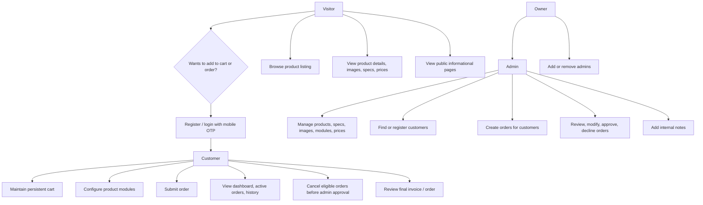
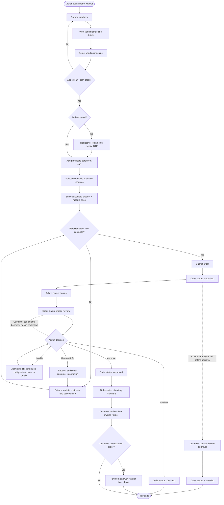
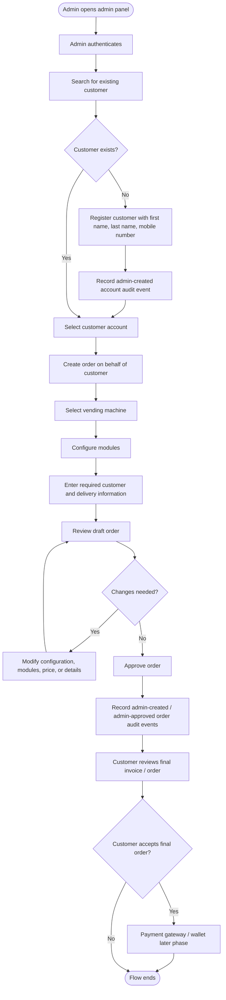
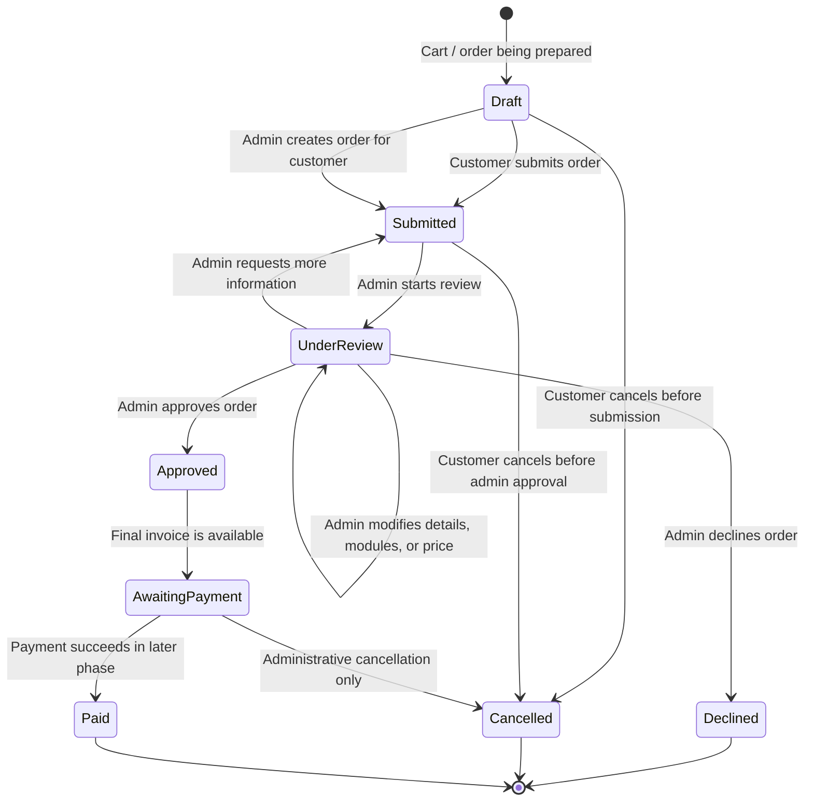
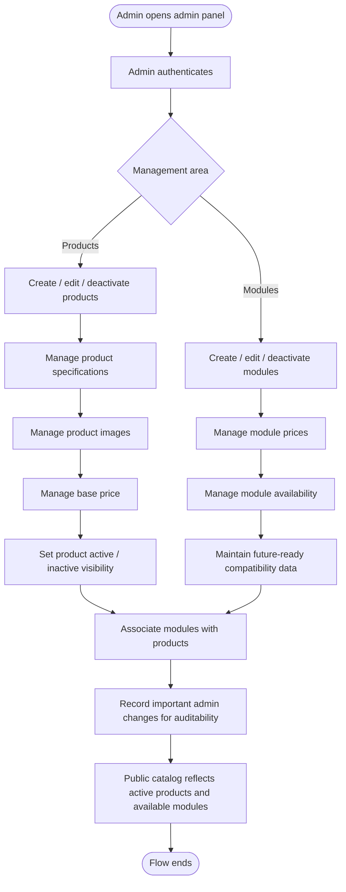
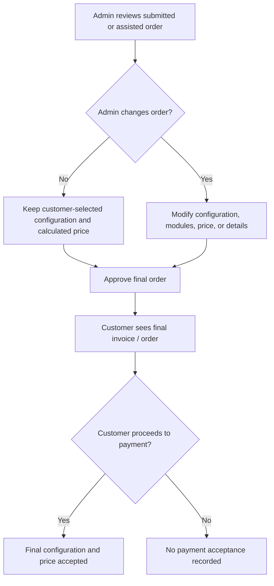

# Robot Market - User Flow

Source: `Robot Market — Product Requirements Document (1).md`

This document describes the main user flows for Robot Market using Mermaid diagrams. The flows focus on the MVP/current scope and mark payment and wallet behavior as later-phase items.

---

## 1. Role Access Overview

---

## 2. Customer Self-Service Ordering Flow

---

## 3. Admin-Assisted Customer Registration and Ordering Flow

---

## 4. Order Lifecycle

---

## 5. Admin Catalog and Pricing Management Flow

---

## 6. Final Invoice Acceptance Rule

