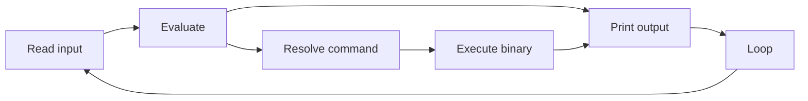
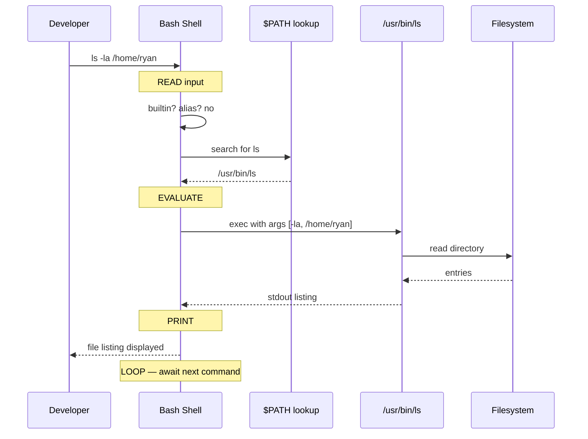

### 📖 Chapter Summary

Chapter 1 is the foundation of the entire SDGL book. David Cohen (*The Software Developer's Guide to Linux*, Ch.1) teaches **how the command line actually works** before dumping commands on you: the **REPL cycle** (Read → Evaluate → Print → Loop), command syntax, the difference between **command line** and **shell**, how Bash **resolves** what to run (path → builtin/alias → `$PATH`), and **POSIX** portability (`command -v`).

The chapter then moves to practice: navigating the filesystem (`pwd`, `cd`, `ls`), finding and reading files (`find`, `less`), creating and changing files (`touch`, `mkdir`, `mv`, `rm`), getting help (`man`, `apropos`), and **tab completion**.

Linux Bible Ch.3 (*Using the Shell*) adds terminal access patterns (GUI terminal, virtual consoles), prompt customization, shell history, and metacharacters. CompTIA Linux+ (Domain 105 / Ch.2 shell basics) adds the **kernel → terminal → shell** model, `$` vs `#` prompts, and exam-precise rules for commands, options, and arguments.

**Sources**

| Reference | Chapter / Section | Focus |
|-----------|-------------------|-------|
| SDGL (primary) | Ch.1 — How the Command Line Works | REPL, shell resolution, core file commands |
| Linux Bible | Ch.3 — Using the Shell | Bash shell, terminals, history, tab completion |
| CompTIA Linux+ | Ch.2 — Shells, Terminals, Kernel; Domain 105 | Kernel/shell model, prompts, metacharacters |

---

#### 🆕 Key New Concepts & Technologies

| **Concept / Technology** | **Short Description** | **SDGL** | **Linux Bible** | **CompTIA** | **2026** |
|:--|:--|:--|:--|:--|:--|
| **REPL** | Read-Eval-Print-Loop CLI cycle | Core mental model; ties to Python/Ruby shells | Implicit in shell usage | Not emphasized | Same; also applies to `ipython`, `node` REPL |
| **Shell vs command line** | Interface concept vs implementing program (Bash) | Explicit distinction | "Shell = command interpreter" | Terminal → shell → kernel diagram | WSL2/Zsh on dev laptops |
| **Command resolution** | Path → builtin/alias → `$PATH` → error | Step-by-step evaluate phase | Assumes Bash lookup | Case-sensitive; space-separated args | `type -a cmd` for full picture |
| **POSIX** | Portable Unix standards | `command -v` over `which` | Mentions POSIX `--` options | POSIX long options (`--word`) | Still relevant for scripts |
| **Absolute vs relative paths** | `/full/path` vs `./relative` | Ch.1 filesystem section | Ch.4 filesystem (preview) | Path rules in usage chapter | Same |
| **`$PATH`** | Colon-separated executable search dirs | Version managers modify PATH | Shell variables section | `$SHELL` variable example | pyenv, nvm, venv all use PATH |
| **Man pages** | Built-in command documentation | Sections 1, 5, 8 for devs | man + info pages | `man` command | `tldr` as quick supplement |
| **Tab completion** | Shell expands partial input | Full walkthrough with `cd` | History + tab completion | Arrow-key history recall | Bash 5+ completion plugins |
| **Exit status** | `$?` after command | Implied in REPL loop | Scripting preview (Ch.7) | Success/failure codes | Use in scripts and CI |

---

#### 📊 Comparison at a Glance

| Topic | SDGL | Linux Bible | CompTIA | Current practice (2026) |
|-------|------|-------------|---------|-------------------------|
| **Audience** | Software developers new to Linux | Power users + admins | Certification candidates | Dev uses WSL2 + SSH to servers |
| **Opening theory** | REPL from Lisp/Python analogy | "Before icons and windows…" history | Kernel/terminal/shell diagram | Same SDGL framing for devs |
| **Shell default** | Bash (Unix shell) | Bash; notes dash at boot on Ubuntu | BASH throughout | Bash on servers; Zsh common on macOS |
| **Find command** | `which` + `command -v` | `type`, `whereis` | `which`, `whereis` | Prefer `command -v` in scripts |
| **Terminal access** | Assumes you have a shell | GUI Terminal, virtual consoles, cloud | tty1–tty6, Ctrl+Alt+Fx | VS Code integrated terminal, SSH |
| **Prompt** | Not customized in Ch.1 | `$` user, `#` root; customizable PS1 | `$` regular, `#` root | Starship/Oh-My-Zsh optional |
| **File ops in Ch.1** | ls, cd, find, less, touch, mkdir, rm, mv | Deferred to Ch.4–5 | Basic commands table | Same commands everywhere |
| **Help system** | `man`, `apropos`, man sections | man + `--help` | `man`, `whatis` | `tldr`, official docs online |

---

## Part 1: SDGL Core Theory — The REPL Mental Model

### 📌 Concepts Explained

- **CLI = REPL**: Every shell interaction is Read → Evaluate → Print → Loop.
- **Developer bridge**: Linux CLI works like Python/Ruby/Node interactive shells — same loop, more power.
- **Command = function call**: `commandname options` — command is the function name, options are arguments.
- **Shell validates little**: Beyond finding an executable, correctness is the program's job.
- **Quoting rules**: Spaces end arguments; quote strings with spaces (`"my file.txt"`).

### 🔧 SDGL — In the Beginning Was the REPL

SDGL opens by connecting to what developers already know:

```
while (true) {        // the loop
    print(eval(read()))
}
```

| REPL Step | What happens with `ls` |
|-----------|------------------------|
| **Read** | You type `ls` and press Enter |
| **Evaluate** | Shell finds `/bin/ls` and executes it |
| **Print** | `ls` writes filenames; shell displays them |
| **Loop** | Shell waits for the next command |

Perl one-liner from SDGL — a minimal shell:

```bash
perl -e 'while (<>){print eval, "\n"}'
# Type: 1+2
# Output: 3
```

### 🔧 Command-Line Syntax (Read Phase)

SDGL manpage convention:

```
command [-flags,] [--example=foobar] [even_more_options ...]
```

| Notation | Meaning |
|----------|---------|
| `[item]` | Optional |
| `[xyz ...]` | Zero or more |
| `-l` / `--long` | Short vs long flag (when implemented) |
| Space | Ends an argument — quote strings with spaces |

### 📊 Diagram — REPL Cycle



### 🧪 Interview Q&A

**Q1:** What does REPL stand for and what are its four steps?

**Q2:** How does SDGL relate the Linux CLI to programming languages?

**Q3:** In `commandname options`, what role does the shell play vs the command program?

**Q4:** Why must `"my project notes.txt"` be quoted?

**Q5:** What do brackets `[ ]` mean in man page syntax?

> [!success]- 📋 Answers — Part 1
> **A1:** Read-Eval-Print-Loop: (1) Read user input, (2) Evaluate/execute, (3) Print output, (4) Loop back for more input.
>
> **A2:** Linux CLI is like Python/Ruby/Perl interactive shells — same REPL pattern. Developers already use REPLs; the Unix shell is a more powerful instance.
>
> **A3:** The shell reads input and resolves which executable to run; the command program handles logic, options parsing, and output. The shell does minimal validation.
>
> **A4:** A space terminates an argument. Without quotes, the shell passes three arguments (`my`, `project`, `notes.txt`) instead of one filename.
>
> **A5:** Brackets denote optional items. Ellipsis inside brackets means zero or more of that item.

---

## Part 2: Shell vs Command Line and Command Resolution

### 📌 Concepts Explained

- **Command line**: General concept — any text-based REPL interface (OS, database, language).
- **Shell**: Specific program implementing that interface (Bash, Zsh, `psql`, `redis-cli`).
- **In this book**: "Shell" = Unix shell, usually **Bash**.
- **Resolution order**: Explicit path → builtin/alias → `$PATH` directories → `command not found`.
- **Ambiguity is dangerous**: Wrong binary in PATH can cause subtle bugs — verify with `command -v`.

### 🔧 SDGL — Shell vs Command Line

| Term | SDGL definition |
|------|-----------------|
| Command line | Text-based REPL for interacting with OS, DB, language runtime |
| Shell | Specific program implementing that environment (Bash for Linux OS) |

Examples of non-OS shells: `psql`, MySQL shell, `irb`, Python REPL, Redis CLI.

### 🔧 SDGL — How the Shell Evaluates Commands

When you type `foobar -option1 test.txt`:

```
1. Path specified?
   ├── /usr/bin/foobar     (absolute)
   ├── ./foobar            (relative — current dir)
   └── $HOME/foobar, ~/foobar

2. Shell known name?
   ├── builtin (e.g. cd, echo)
   └── alias (user shortcut)

3. Search $PATH (in order)
   └── /bin, /usr/bin, /sbin, ...

4. Still nothing? → bash: foobar: command not found

5. Found? → execute, pass -option1 and test.txt as arguments
```

### 💻 Command Summary — Resolution & Verification

| Command | Short Description | Main Options/Flags | Common Use Case |
|---------|-------------------|--------------------|-----------------|
| `which` | Print path to command | N/A | Quick check which `ls` runs |
| `command -v` | POSIX path lookup | `-v` | **Preferred in portable scripts** |
| `type` | Show command type | `-a` all matches | See builtin vs alias vs file |
| `echo $PATH` | Show search path | N/A | Debug "command not found" |

### 💻 Examples — Verify What Runs

```bash
# Which binary handles ls?
which ls
# Output: /usr/bin/ls

# POSIX-compliant (SDGL recommended for scripts)
command -v ls
# Output: /usr/bin/ls

# Full resolution picture (Bible/Linux practice)
type -a ls
# Output: ls is hashed (/usr/bin/ls)

# See your PATH search order
echo $PATH
# Output: /home/you/.local/bin:/usr/bin:/bin:...
```

```bash
# Explicit path — skips PATH lookup
/usr/bin/ls -la

# Relative path — runs local script
./deploy.sh

# Missing command
nosuchcommand
# Output: bash: nosuchcommand: command not found

# Exit status of last command (CompTIA/scripting)
echo $?
# Output: 127 (command not found)
```

### 🧪 Interview Q&A

**Q1:** What is the difference between "command line" and "shell"?

**Q2:** In what order does Bash resolve an unqualified command name?

**Q3:** Why does SDGL recommend `command -v` over `which`?

**Q4:** What is the difference between `./script.sh` and `script.sh`?

**Q5:** What does exit code 127 typically mean?

> [!success]- 📋 Answers — Part 2
> **A1:** Command line is the general text-based interface concept; shell is the specific program (Bash) that implements it for the operating system.
>
> **A2:** (1) Explicit path if given, (2) shell builtin or alias, (3) each directory in `$PATH` in order, (4) error if not found.
>
> **A3:** `command -v` is POSIX-standard and behaves consistently across Unix systems; `which` may be missing or differ (e.g. doesn't see all builtins).
>
> **A4:** `./script.sh` uses a relative path — shell runs the file in the current directory. `script.sh` alone is looked up via PATH; current directory is typically NOT in PATH (security).
>
> **A5:** 127 = command not found (convention on Bash and most Unix shells).

---

## Part 3: POSIX, `$PATH`, and Linux Bible Shell Context

### 📌 Concepts Explained

- **POSIX**: IEEE standards for Unix compatibility — common commands and behaviors.
- **`$PATH`**: Colon-separated list of directories searched for executables.
- **PATH mutation**: Language version managers (pyenv, nvm), Python venv, and installers prepend directories.
- **Terminal vs shell (Bible)**: Terminal = login channel; shell = interface after login.
- **Accessing a shell**: GUI Terminal app, virtual console (Ctrl+Alt+F2), SSH remote session.

### 🔧 SDGL — POSIX and Portability

POSIX guarantees things like: every compatible OS has `ls`, and a way to test if a command exists (`command -v`).

> SDGL warning: popular distros diverge from POSIX in subtle ways — portability is a goal, not a guarantee.

### 🔧 Linux Bible Ch.3 — Using the Shell

| Bible topic | Key point |
|-------------|-----------|
| Bash | Bourne Again Shell — default on Fedora/RHEL/Ubuntu login |
| Other shells | dash (Ubuntu boot), csh, ksh, zsh, tcsh |
| `$` prompt | Regular user |
| `#` prompt | Root (or sudo context) |
| Terminal window | GNOME Terminal (`gnome-terminal`) on Fedora desktop |
| Virtual consoles | Ctrl+Alt+F2–F6 for text shells alongside GUI |
| History | Up/down arrows recall previous commands |
| Tab completion | Expand filenames and commands |

Bible notes Ubuntu uses **dash** at boot for speed but **bash** as login shell — good to know when debugging init scripts vs interactive use.

### 📊 Three-Way Comparison — Finding Commands

| Topic | SDGL | Linux Bible | CompTIA | 2026 |
|-------|------|-------------|---------|------|
| Verify command | `command -v` (POSIX) | `type`, `whereis` | `which`, `whereis` | `type -a` for debugging |
| PATH variable | Central to resolution | Shell variables section | `$SHELL`, `$PATH` via `echo` | Same; watch venv/pyenv ordering |
| Root prompt | Not Ch.1 focus | `#` = root | `#` root, `$` user | Use `sudo` not root login |
| Terminal types | Assumes shell access | GUI + virtual + cloud | tty1–tty6 table | VS Code terminal, Warp, SSH |

### 💻 Bible-Style Basics

```bash
# Who am I? (CompTIA Table 2-6)
whoami
# Output: ryan

id
# Output: uid=1000(ryan) gid=1000(ryan) groups=...

# Current shell (SDGL + CompTIA)
echo $SHELL
# Output: /bin/bash

# Bible: recall last command
# Press Up arrow — previous command reappears
```

### 🧪 Interview Q&A

**Q1:** What is POSIX and why does it matter to developers?

**Q2:** How do version managers affect command resolution?

**Q3:** What is the Linux Bible's `$` vs `#` prompt convention?

**Q4:** How do you access a shell on a Linux desktop without SSH?

**Q5:** What is the difference between a terminal and a shell (CompTIA model)?

> [!success]- 📋 Answers — Part 3
> **A1:** POSIX defines portable Unix standards (commands, APIs). Scripts using POSIX tools (`command -v`, `ls`, `test`) are more likely to run across Linux, macOS, and BSD.
>
> **A2:** They prepend directories to `$PATH` so their binaries are found first — e.g. `~/.pyenv/shims/python` before system Python.
>
> **A3:** `$` = regular user prompt; `#` = root/superuser prompt. Bible uses `sudo` rather than daily root login.
>
> **A4:** Open a Terminal emulator from the desktop (GNOME: Activities → Terminal), or switch to a virtual console with Ctrl+Alt+F2.
>
> **A5:** Terminal = channel to log in (tty); shell = user interface after login that accepts commands and passes work to the kernel.

---

## Part 4: CompTIA Precision — Commands, Options, Arguments

### 📌 Concepts Explained

- **Command**: Program name — **case-sensitive**.
- **Option**: Modifies behavior — starts with `-` or `--` (POSIX long options).
- **Argument**: Parameter for the command — no leading dash.
- **Spaces required**: Between command, options, and arguments.
- **Metacharacters**: `$`, `|`, `>`, `*`, `;` — shell interprets specially (preview for Ch.11).

### 🔧 CompTIA — Command Structure

```
command -option argument
```

Example from CompTIA:

```bash
ls -a /etc/rpm
# -a = option (list all)
# /etc/rpm = argument (directory to list)
```

| Component | Rule |
|-----------|------|
| Command | Case-sensitive (`LS` ≠ `ls`) |
| Short option | Single dash: `-a` |
| POSIX long option | Double dash: `--all` |
| Argument | No dash; space-separated |

### 🔧 CompTIA — Essential Commands (No Options Needed)

| Command | Description |
|---------|-------------|
| `clear` | Clear terminal screen |
| `who` | Logged-in users |
| `whoami` | Your username |
| `id` | UID, GID, groups |
| `date` | Current date/time |
| `uname` | System information |
| `exit` | Leave current shell |

### 🔧 CompTIA — Metacharacters Preview

| Char | Meaning |
|------|---------|
| `$` | Variable reference (`$SHELL`) |
| `~` | Home directory |
| `;` | End command |
| `|` | Pipe (Ch.11) |
| `> >>` | Redirection (Ch.11) |

### 💻 CompTIA-Style Drill

```bash
# Case sensitivity matters
ls
# Works

LS
# Output: bash: LS: command not found

# Space between components (CompTIA rule)
ls-la
# Output: bash: ls-la: command not found

ls -la
# Works — space before -la

# Variable expansion
echo $SHELL
# Output: /bin/bash

echo My shell is $SHELL
# Output: My shell is /bin/bash
```

### 🧪 Interview Q&A

**Q1:** What is the difference between an option and an argument?

**Q2:** Are Linux commands case-sensitive?

**Q3:** What does `$SHELL` expand to and why?

**Q4:** What is a POSIX long option? Give an example.

**Q5:** (CompTIA style) Which prompt character indicates root — `$` or `#`?

> [!success]- 📋 Answers — Part 4
> **A1:** Options (flags) modify how a command runs and start with `-` or `--`. Arguments are operands (files, directories, text) and don't start with a dash.
>
> **A2:** Yes — commands are case-sensitive. `ls` works; `LS` does not.
>
> **A3:** `$SHELL` is an environment variable holding the path to your login shell (e.g. `/bin/bash`). The `$` tells the shell to substitute the value.
>
> **A4:** Double-dash word option per POSIX — e.g. `ls --all` equivalent to `ls -a` when supported.
>
> **A5:** `#` indicates root; `$` indicates a regular user.

---

## Part 5: Practical Commands — Navigation, Files, and Help

### 📌 Concepts Explained

- **Absolute path**: Starts at root `/` — same from anywhere.
- **Relative path**: From current directory — `.` (here), `..` (parent), `~/` (home).
- **FHS preview**: Standard directory layout — detail in SDGL Ch.5.
- **Man sections**: 1 = commands, 5 = config formats, 8 = admin — most relevant for developers.
- **Tab completion**: Press Tab to autocomplete paths and commands.

### 🔧 SDGL — Filesystem Navigation

| Command | Purpose |
|---------|---------|
| `pwd` | Print working directory |
| `cd` | Change directory (`cd ..`, `cd ~`, `cd /var/log`) |
| `ls` | List directory (`-l` long, `-a` all, `-h` human sizes) |
| `find` | Search files (`find . -name "*.go"`) |
| `less` | Page through file (`q` quit, `/text` search) |

### 🔧 SDGL — Create, Change, Delete

| Command | Purpose | Safety note |
|---------|---------|---------------|
| `touch` | Create empty file or update timestamp | Safe |
| `mkdir` | Create directory (`-p` nested parents) | `-p` is idempotent — good for scripts |
| `rmdir` | Remove **empty** directory only | Safer than `rm` |
| `rm` | Delete files (`-r` recursive, `-f` force) | **Dangerous** — never `rm -rf /` |
| `mv` | Move or rename | Overwrites destination silently |

### 🔧 SDGL — Getting Help

```bash
man ls              # Manual for ls (section 1 default)
man 5 passwd        # File format docs (section 5)
apropos password    # Search man pages by keyword
man -k password     # Same as apropos
```

Man page sections (SDGL):

| Section | Content |
|---------|---------|
| 1 | User commands |
| 5 | Config file formats |
| 8 | Admin/daemon commands |

### 💻 SDGL Walkthrough — Daily Developer Flow

```bash
# Where am I?
pwd
# Output: /home/ryan

# List files (long + human-readable sizes)
ls -lh
# Output: -rw-r--r-- 1 ryan ryan  2.1K Jul  6 10:00 main.go

# Create project structure (idempotent)
mkdir -p ~/projects/myapp/{cmd,internal}

# Create a file
touch ~/projects/myapp/README.md

# Find Go files from current directory
find ~/projects/myapp -name "*.go"
# Output: (empty until you add .go files)

# Read a log file page by page
less /var/log/syslog
# Press q to quit

# Rename/move
mv ~/projects/myapp/README.md ~/projects/myapp/README.old
```

```bash
# Pipeline preview (Bible connects commands — full detail SDGL Ch.11)
ls -la | head -5
# Output: first 5 lines of directory listing
```

### 📊 Diagram — Absolute vs Relative Paths

```
Filesystem (simplified)
/
├── home/
│   └── ryan/          ← ~ or $HOME
│       └── projects/
│           └── myapp/   ← pwd if you're here
│               └── main.go

Absolute:  /home/ryan/projects/myapp/main.go
Relative:  ./main.go
Parent:    ../
Home:      ~/projects/myapp
```

### 🧪 Interview Q&A

**Q1:** What do `.` and `..` mean in a path?

**Q2:** What does `mkdir -p a/b/c` do that plain `mkdir` cannot?

**Q3:** Why is `rm -rf /` catastrophic?

**Q4:** What man page section documents `/etc/passwd` file format?

**Q5:** How does tab completion help when running `cd Doc<Tab>`?

> [!success]- 📋 Answers — Part 5
> **A1:** `.` = current directory; `..` = parent directory.
>
> **A2:** `-p` creates parent directories as needed and does not error if they already exist — essential for scripts.
>
> **A3:** `/` is the root of the entire filesystem — recursive forced delete removes system files and destroys the OS.
>
> **A4:** Section 5 (file formats). Section 1 is user commands.
>
> **A5:** Shell narrows matches (Documents/, Downloads/) and autocompletes when unique — saves typing and reduces typos.

---

## Part 6: Combined Best Practices — Three Books Agree (and Differ)

### 📌 Concepts Explained

- **Daily dev**: SDGL mental models + hands-on commands.
- **Power user**: Bible terminal tricks, history, virtual consoles.
- **Exam/cert**: CompTIA precise syntax, prompts, metacharacters.
- **Scripts**: Always `command -v`, quote variables, check `$?`.
- **Safety**: Never run pasted `rm -rf` commands without reading; prefer `rmdir` for empty dirs.

### 🔧 Where Sources Agree

| Practice | SDGL | Bible | CompTIA |
|----------|------|-------|---------|
| Learn shell early | ✓ Core thesis | ✓ "More powerful than GUI" | ✓ Domain 105 |
| Bash default | ✓ | ✓ | ✓ |
| `man` for help | ✓ | ✓ | ✓ |
| Quote spaced strings | ✓ | ✓ | ✓ |
| `$` vs `#` prompts | Implied | ✓ | ✓ |
| History recall | SDGL Ch.4 | ✓ Ch.3 | Arrow keys |

### 🔧 Where Sources Differ

| Topic | SDGL says | Bible adds | CompTIA adds |
|-------|-----------|------------|--------------|
| Command lookup | `command -v` (POSIX) | `type`, `whereis` | `which`, `whereis` |
| Shell theory | REPL from dev perspective | Pre-GUI history, many shells | Kernel/terminal/shell diagram |
| Root access | Not daily root | `sudo` preferred | `su -` for full root env |
| Desktop | Secondary to CLI | GNOME/Fedora desktop setup | GUI terminal within GNOME |
| Completion | Tab completion walkthrough | History + tab | Arrow-key recall |

### 💡 Pro Tips & Best Practices (Combined)

1. **Think REPL** — every command is Read → Evaluate → Print; errors are Evaluate or Print failures.
2. **Use `command -v` in scripts** — POSIX portable; SDGL-endorsed over bare `which`.
3. **Use `type -a` when debugging** — shows builtin, alias, and PATH hits (Bible practice).
4. **Check `$?` after failures** — 0 = success, 127 = not found, 1 = generic error.
5. **Prefer absolute paths in scripts** — relative paths break when cwd changes.
6. **`mkdir -p` in automation** — idempotent directory creation (SDGL scripting preview).
7. **Start tab completion early** — SDGL's highest-ROI keystroke saver.
8. **Read man section 1 first** — sections 5 and 8 when configuring services (SDGL).
9. **Don't log in as root on desktop** — CompTIA/Bible security guidance; use `sudo`.
10. **Keep a lab VM or WSL2** — SDGL preface: practice on real Linux beats reading alone.

### 🧪 Interview Q&A

**Q1:** Which command lookup tool should you use in a portable Bash script?

**Q2:** What is the single most important mental model from SDGL Ch.1?

**Q3:** When would you use Bible's virtual consoles instead of a GUI terminal?

**Q4:** What CompTIA rule catches beginners who type `ls-la`?

**Q5:** Name three commands you'll use almost every Linux session (SDGL conclusion).

> [!success]- 📋 Answers — Part 6
> **A1:** `command -v` — POSIX standard and reliable in scripts across Unix-like systems.
>
> **A2:** The REPL cycle — understanding Read/Evaluate/Print/Loop explains every shell interaction and troubleshooting path.
>
> **A3:** When the GUI is broken or unavailable (server rescue, display failure) — Ctrl+Alt+F2 gives a text login.
>
> **A4:** Commands, options, and arguments must be space-separated — `ls-la` is treated as one unknown command name.
>
> **A5:** `ls`, `cd`, `pwd` (plus `man` when stuck) — navigation and orientation before anything else.

---

## Part 7: 2026 Developer Workflow Snapshot

### 📌 Concepts Explained

- **Dev environments**: WSL2 (Windows), native Linux VM, cloud dev boxes, SSH to servers.
- **Terminal apps**: GNOME Terminal, VS Code integrated terminal, iTerm2 (SSH to Linux).
- **Modern helpers**: `tldr` for quick examples; still learn `man` for completeness.
- **Optional speedups**: `rg`/`fd` — but master `grep`/`find` for remote servers and exams.

### ✅ What SDGL Ch.1 Prepares You For

| Skill | SDGL coverage | Ready for |
|-------|---------------|-----------|
| Understand shell errors | REPL + resolution order | Debugging "command not found" |
| Navigate filesystem | pwd, cd, ls | Ch.2 processes, Ch.5 FHS |
| Find files | find basics | Log hunting (Ch.16) |
| Read files | less | Config inspection (Ch.10) |
| Get help | man, apropos | Self-serve learning any command |
| Save keystrokes | tab completion | Daily dev productivity |

### ⚠️ Gaps to Fill from Bible / CompTIA / Practice

| Gap | Source to study | Priority |
|-----|-----------------|----------|
| Shell history shortcuts | SDGL Ch.4 + Bible Ch.3 | 🟡 Medium |
| Pipes and redirection | SDGL Ch.11 | 🔴 High (next major skill) |
| Permissions denied errors | SDGL Ch.7–8 | 🔴 High (preview in Ch.2) |
| `sudo` vs `su` depth | Bible Ch.8 + CompTIA | 🟡 Medium |
| systemd services | SDGL Ch.3 | 🔴 High (next chapter path) |
| Scripting (`$?`, `if`) | SDGL Ch.12 | 🟡 Medium |

### 📊 2026 Developer Stack

| Layer | Tool | Notes |
|-------|------|-------|
| Local Linux | WSL2 Ubuntu or VM | SDGL preface recommendation |
| Remote | SSH + terminal | Ch.13 preview |
| Editor | vim/nano (Ch.6) or VS Code remote | SDGL teaches both CLI editors |
| Quick help | `tldr ls` | Supplements `man`; not on exams |
| Search | `rg` / `grep` | `grep` for CompTIA + minimal containers |

### 🧪 Interview Q&A

**Q1:** Can you learn SDGL Ch.1 on macOS?

**Q2:** What should you use for quick command examples in 2026 vs deep reference?

**Q3:** Why still learn `find` if `fd` exists?

**Q4:** What is the next SDGL chapter after Ch.1 and how does it connect?

**Q5:** What gap from Ch.1 causes the most real-world pain before Ch.7?

> [!success]- 📋 Answers — Part 7
> **A1:** Yes — SDGL notes macOS is Unix; most Ch.1 commands work. Best experience is still native Linux or WSL2.
>
> **A2:** `tldr` or `--help` for quick start; `man` for complete reference and exam prep.
>
> **A3:** `find` is on every Linux system by default; CompTIA tests it; embedded/minimal containers may lack `fd`.
>
> **A4:** Ch.2 Working with Processes — builds on CLI skills to manage PIDs, signals, and `ps`/`top`.
>
> **A5:** Permissions (EUID, file modes) — you hit "Permission denied" before you understand users/groups in Ch.7.

---

## Part 8: Senior Recommendations, Cheat Sheet, and Master Q&A

### 📌 Concepts Explained

- **Foundation complete**: REPL + resolution + navigation + help = safe to explore further.
- **Troubleshooting order**: command exists? → permissions? → path/cwd? → man page?
- **Habit**: practice 10 minutes on a real shell before Ch.2 (SDGL conclusion).

### 🔧 Ch.1 Command Cheat Sheet

| Task | Command |
|------|---------|
| Where am I? | `pwd` |
| List files | `ls -lah` |
| Change dir | `cd path` / `cd ..` / `cd ~` |
| Find file | `find . -name "pattern"` |
| Read file | `less file` |
| Create file | `touch file` |
| Create dir | `mkdir -p dir/sub` |
| Move/rename | `mv src dst` |
| Delete file | `rm file` |
| Delete empty dir | `rmdir dir` |
| Help | `man cmd` / `apropos keyword` |
| Which binary? | `command -v cmd` |
| Last exit code | `echo $?` |
| My shell | `echo $SHELL` |
| PATH | `echo $PATH` |

### 📊 Sequence Diagram — Full Ch.1 Flow



### 📊 Book Comparison Revisited (Ch.1)

| Topic | SDGL | Linux Bible | CompTIA | 2026 |
|-------|------|-------------|---------|------|
| **Best for** | Developer mental models | Breadth + Fedora habits | Exam precision | SDGL + Bible depth |
| **Ch.1 strength** | REPL + resolution | Terminal access options | Syntax rules | WSL2 + SDGL |
| **Lookup tool** | `command -v` | `type` | `which` | `command -v` in scripts |
| **Theory depth** | Just enough | Historical context | Kernel diagram | All three; SDGL leads |

### 🧪 Master Interview Q&A

**Q1:** Walk through the REPL cycle for `grep error app.log`.

**Q2:** Explain how Bash resolves `./deploy.sh` vs `deploy.sh`.

**Q3:** A script works on your Mac but fails on CI Linux with "command not found" — what do you check?

**Q4:** Compare SDGL, Bible, and CompTIA approaches to teaching the shell.

**Q5:** A junior dev says "the command line and the shell are the same thing" — how do you correct them?

> [!success]- 📋 Answers — Master Q&A
> **A1:** Read: shell reads `grep error app.log`. Evaluate: finds `/usr/bin/grep`, executes with args `error` and `app.log`. Print: matching lines to stdout. Loop: prompt returns.
>
> **A2:** `./deploy.sh` — explicit relative path, runs from cwd (needs execute permission). `deploy.sh` — searched only in PATH; current dir usually excluded.
>
> **A3:** `command -v failingcmd` on CI, compare PATH (`echo $PATH`), check if dependency installed, verify shebang and execute bit on scripts.
>
> **A4:** SDGL: developer-first REPL theory. Bible: practical breadth, many access methods, Fedora-centric examples. CompTIA: formal syntax, prompts, metacharacters for exams. Use SDGL to learn, Bible to deepen, CompTIA to test knowledge.
>
> **A5:** Command line is the abstract text interface pattern (REPL); shell is the concrete program (Bash) implementing it. Databases and languages also have "shells" — the term is specific, not generic.

---

### 🔨 Hands-On Tasks

#### Task 1: Trace command resolution
**Goal:** See SDGL's evaluate phase in action — path, builtin, PATH, and failure.
**Commands:** `type`, `command -v`, `which`, `echo $PATH`, `echo $?`
**Steps:**
1. Run `type -a echo` — note: builtin
2. Run `command -v ls` and `which ls` — compare output
3. Run `echo $PATH` — identify search order
4. Create `~/bin/hello.sh` with `#!/bin/bash` and `echo hello`, `chmod +x`
5. Add `~/bin` to PATH: `export PATH="$HOME/bin:$PATH"`
6. Run `hello.sh` (fail) then `~/bin/hello.sh` (works)
7. Run `fakecmd`; then `echo $?` — expect 127
**Done when:** You can explain why step 6 failed without PATH vs succeeded with explicit path.

#### Task 2: REPL navigation and help drill
**Goal:** Practice SDGL's "absolute basics" — navigate, create, find, read help.
**Commands:** `pwd`, `cd`, `mkdir -p`, `touch`, `ls`, `find`, `man`, Tab completion
**Steps:**
1. `mkdir -p ~/sdgl-lab/{docs,src}` && `cd ~/sdgl-lab`
2. `touch src/main.go` && `ls -la src/`
3. `find . -name "*.go"`
4. `cd doc<Tab>` — let shell complete to `docs/`
5. `man ls` — find `-a` flag description; press `q` to quit
6. `apropos directory` — skim related commands
**Done when:** `pwd` shows `~/sdgl-lab/docs` and you can describe what `-a` does for `ls`.

---

### 📚 Further Reading

| Resource | Topic |
|----------|-------|
| SDGL Ch.2 | Working with Processes |
| SDGL Ch.4 | Shell History shortcuts |
| SDGL Ch.5 | Filesystem Hierarchy Standard (FHS) |
| SDGL Ch.11 | Pipes and Redirection |
| Linux Bible Ch.3 | Using the Shell (full) |
| Linux Bible Ch.4 | Moving Around the Filesystem |
| CompTIA Domain 105 | Shells, scripting, data management |
| [POSIX.1-2017 shell command language](https://pubs.opengroup.org/onlinepubs/9699919799/) | Formal shell spec |
| [explainshell.com](https://explainshell.com) | Paste a command → flag explanations |
| [[Tmux]] | Multiplex terminal sessions |
| [[Linux/Scatterd Learning/SSH]] | Remote shell access (Ch.13 preview) |

---

### 🤖 Regenerate this guide

1. [[AI Prompt/00 - General Study Guide Prompt]] — fill Inputs (SDGL = Ref 1, PRIMARY = 1)
2. [[Linux/The Software Developer’s Guide to Linux/AI Prompt - linux beginner]] — append this project prompt

---

*Study guide for How the Command Line Works (Ch.1), 2026.*