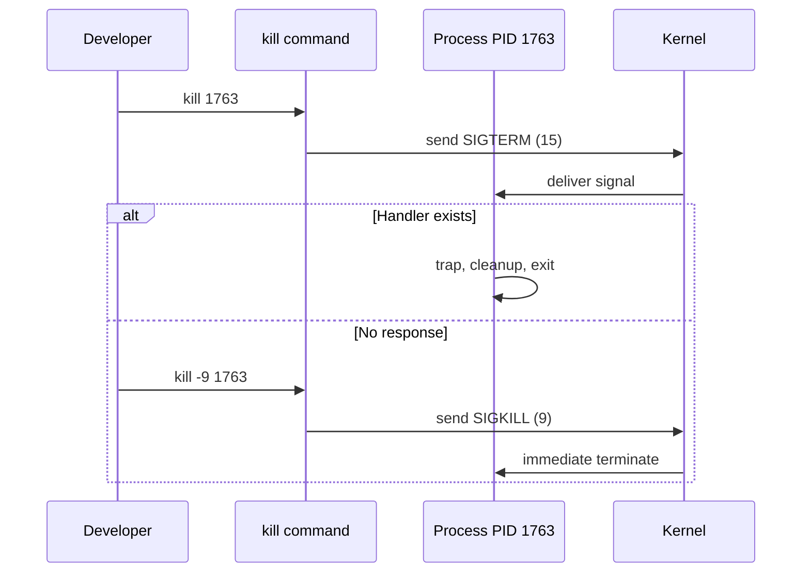
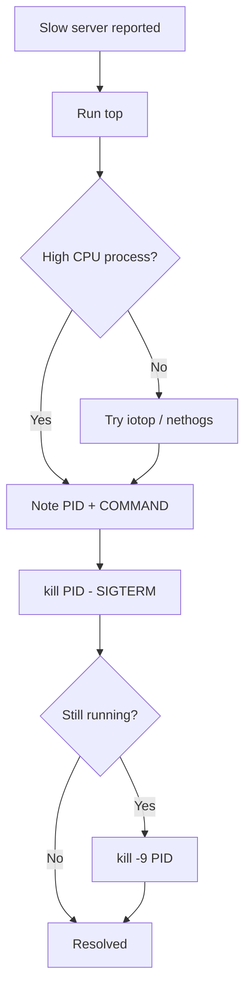

### 📖 Chapter Summary

Chapter 2 bridges developer intuition and Linux operations. SDGL (*The Software Developer's Guide to Linux*, Ch.2) reframes your running program as a **process** — the OS abstraction with PID, PPID, STAT, EUID/EGID, environment variables, and working directory. You learn to **inspect** processes (`ps`, `pgrep`, `top`, `iotop`, `nethogs`), **signal** them (`kill`, SIGTERM vs SIGKILL), and **debug** them (`/proc`, `lsof`), plus a full **troubleshooting walkthrough** (runaway `bzip2` on CPU).

Linux Bible Ch.6 (*Managing Running Processes*) adds multitasking context, `ps`/`procs`/`top` depth, foreground/background jobs, `nice`/`renice`, and GNOME System Monitor. CompTIA Ch.9 adds exam framing: user vs daemon processes, process genealogy to init/systemd, zombie cleanup via parent kill, and signal number tables.

This chapter directly sets up **Ch.3 systemd** — PID 1 is systemd on modern Linux, and services are long-running managed processes.

**Sources**

| Reference | Chapter / Section | Focus |
|-----------|-------------------|-------|
| SDGL (primary) | Ch.2 — Working with Processes | Process model, signals, troubleshooting |
| Linux Bible | Ch.6 — Managing Running Processes | ps/top, jobs, renice, /proc |
| CompTIA Linux+ | Ch.9 — Managing Linux Processes | PIDs, daemons, signals, zombies |

---

#### 🆕 Key New Concepts & Technologies

| **Concept / Technology** | **Short Description** | **SDGL** | **Linux Bible** | **CompTIA** | **2026** |
|:--|:--|:--|:--|:--|:--|
| **Process** | Running program in memory | Core abstraction | "Instance of a command" | Program in action | Same; containers add namespaces |
| **PID / PPID** | Process / parent process ID | Sequential PID; PID 1 = init | Unique per system | Process genealogy diagram | `systemd` as PID 1 |
| **PID 1 (init)** | First process; adopts orphans | systemd on Linux | systemd in ps output | "Grandfather" of processes | Still systemd on most distros |
| **STAT codes** | Process state (R,S,D,T,Z) | Full list from `man ps` | R, S, + foreground | Z = zombie | Same codes in `ps aux` |
| **Zombie** | Dead child not reaped | Fix parent, not zombie | Mentioned in STAT | Kill parent to release PID | `ps aux \| grep Z` |
| **Signals** | Numeric IPC messages | SIGHUP, SIGTERM, SIGKILL | top/kill interactive | Signal table for exam | `kill -TERM` preferred |
| **kill command** | Sends signals (default SIGTERM) | Misnamed — not only SIGKILL | Signals 15 and 9 in top | Default SIGTERM | `kill` then `kill -9` last resort |
| **/proc** | Virtual FS per-PID info | Deep dive optional | ps reads from /proc | Process details | `cat /proc/PID/cmdline` |
| **lsof** | Open files per process | nginx sockets/logs example | Less emphasis | Not core Ch.9 | Debug port conflicts |
| **Container PIDs** | Namespaced view vs host | PID 1 inside, real PID on host | — | — | `docker top`, host `ps` |

---

#### 📊 Comparison at a Glance

| Topic | SDGL | Linux Bible | CompTIA | Current practice (2026) |
|-------|------|-------------|---------|-------------------------|
| **Audience** | Developers troubleshooting apps | Power user + admin | Certification | DevOps uses same tools |
| **Process definition** | OS wraps threads/vars into one unit | Multitasking, multiuser | Program on disk vs in RAM | Same |
| **Primary inspect tool** | `ps aux`, `top`, `pgrep` | `ps`, `procs`, `top`, GUI monitor | `ps -ef`, `ps -f` | `ps aux` + `htop` optional |
| **Kill strategy** | SIGTERM → wait → SIGKILL | top: 15 then 9 | Signal table memorization | Always try 15 first |
| **Init system** | systemd named as PID 1 | systemd in examples | init or systemd | systemd |
| **Background jobs** | Foreground shell commands | jobs, fg, bg, Ctrl+Z | at/cron in Ch.9 | systemd for services |
| **Priority** | Niceness mentioned in STAT | nice/renice in top | nice, renice, at, cron | cgroups in K8s |
| **Troubleshooting story** | bzip2 CPU hog walkthrough | Resource-based hunt | Zombie accumulation | Same pattern: observe→PID→act |

---

## Part 1: SDGL Core Theory — The Process Abstraction

### 📌 Concepts Explained

- **Program vs process**: Program = file on disk; process = program executing in memory.
- **Developer shift**: Variables, threads, functions → external knobs: PID, STAT, CPU%, memory.
- **Everything runs as a process**: `ls`, nginx, your Go binary, the shell itself.
- **Process = kernel data structure**: Tracks memory, CPU time, open resources, ownership.
- **PID 1**: init/systemd — cannot be killed; adopts orphaned children.

### 🔧 SDGL — Process Basics

When your code finally runs, it becomes a process. The kernel tracks:

| Attribute | Purpose |
|-----------|---------|
| Memory usage (VSZ, RSS) | How much RAM allocated vs used |
| CPU time | Cumulative processor usage |
| Disk/network I/O | Resource contention debugging |
| IPC | Signals, pipes (later chapters) |
| Child processes | Parent spawns workers (shell scripts, compilers) |

```bash
# First look at all processes you can see (SDGL)
ps aux
```

**Expected output (abbreviated):**

```
USER       PID %CPU %MEM    VSZ   RSS TTY      STAT START   TIME COMMAND
root         1  0.1  0.2 168000 12000 ?        Ss   08:00   0:02 /usr/lib/systemd/systemd
ryan      4521  0.0  0.1  17232  9216 pts/0    S+   09:15   0:00 bash
ryan      4600  0.0  0.0  22800  3200 pts/0    R+   09:16   0:00 ps aux
```

### 🔧 Program vs Process (All Three Books Agree)

| Term | SDGL | CompTIA |
|------|------|---------|
| Program | Static executable on disk | File you execute |
| Process | Running instance in RAM/CPU | Program in action |

### 📊 Diagram — Process Genealogy (CompTIA + SDGL)

```
kernel
  └── PID 1: systemd (init)
        ├── sshd (daemon)
        ├── nginx (daemon)
        └── login → bash (PID 4521)
              ├── python app.py (child)
              └── ps aux (child, short-lived)
```

Orphaned children → re-parented to **PID 1**.

### 🧪 Interview Q&A

**Q1:** What is the difference between a program and a process?

**Q2:** Why does SDGL say developers must shift mental models in Ch.2?

**Q3:** What is PID 1 and why can't you kill it?

**Q4:** What happens to a child process when its parent dies?

**Q5:** What does VSZ vs RSS tell you in `ps aux`?

> [!success]- 📋 Answers — Part 1
> **A1:** A program is a static executable file; a process is that program loaded and running in memory with kernel-tracked state.
>
> **A2:** In application code you see variables and threads; on Linux you manage processes externally via PID, signals, and resource metrics.
>
> **A3:** PID 1 is the init system (systemd) — it bootstraps all other processes and adopts orphans. The kernel protects it for system stability.
>
> **A4:** The child becomes an orphan and is re-parented to PID 1 (init/systemd), which becomes its new parent.
>
> **A5:** VSZ is virtual memory allocated; RSS is physical RAM actually in use. They differ when memory is allocated but not touched.

---

## Part 2: Process Attributes — PID, STAT, EUID, Environment

### 📌 Concepts Explained

- **PID**: Unique integer label — most useful identifier for `kill`, `lsof`, `/proc/PID`.
- **PPID**: Parent PID — shows who spawned the process (`ps -ef`).
- **STAT**: Single-letter state — R running, S sleeping, D disk wait, Z zombie, T stopped.
- **EUID/EGID**: Effective user/group — determines file permission "keys."
- **Environment variables**: Inherited config (`$HOME`, `$PATH`, secrets) — passed parent → child.
- **Working directory**: Each process has cwd; shell's `pwd` shows yours.

### 🔧 SDGL — STAT Codes

| Code | Meaning |
|------|---------|
| **R** | Runnable / running |
| **S** | Interruptible sleep (waiting for event) |
| **D** | Uninterruptible sleep (usually disk I/O) |
| **T** | Stopped (job control / debugger) |
| **Z** | Zombie — exited but not reaped by parent |
| **I** | Idle kernel thread |

### 🔧 Container Namespacing (SDGL — Developer Critical)

| View | What you see |
|------|--------------|
| Inside container | App may be **PID 1** |
| On host | Same process might be **PID 3210** |

Always use **host `ps`** for real PIDs when debugging Docker/K8s.

### 💻 Command Summary

| Command | Short Description | Main Options/Flags | Common Use Case |
|---------|-------------------|--------------------|-----------------|
| `ps aux` | BSD-style process snapshot | `aux` | See all processes + CPU/MEM |
| `ps -ef` | UNIX full listing with PPID | `-ef` | Parent/child relationships |
| `ps -ejH` | Process tree (indented) | `-ejH` | Visualize hierarchy |
| `ps -eLf` | Threads per process | `-eLf` | Debug multi-threaded apps |
| `echo $VAR` | Print environment variable | `$HOME`, `$PATH` | Verify inherited config |
| `id` | Current UID/GID/groups | N/A | Check effective identity |
| `pwd` | Process/shell working directory | N/A | Confirm cwd before relative paths |

### 💻 Examples

```bash
# Standard format with parent PIDs (SDGL + CompTIA)
ps -ef
# Output:
# UID        PID  PPID  C STIME TTY          TIME CMD
# root         1     0  0 08:00 ?        00:00:02 /usr/lib/systemd/systemd
# ryan      4521  4510  0 09:15 pts/0    00:00:00 -bash
# ryan      4610  4521  0 09:16 pts/0    00:00:00 ps -ef

# Tree view (SDGL)
ps -ejH

# Check environment inherited by shell process
echo $HOME
# Output: /home/ryan

echo $SHELL
# Output: /bin/bash

id
# Output: uid=1000(ryan) gid=1000(ryan) groups=1000(ryan),27(sudo)
```

```bash
# Find zombies (CompTIA + SDGL)
ps aux | awk '$8 ~ /Z/ {print}'
# If zombies exist — fix the PARENT process, not the zombie
```

### 🧪 Interview Q&A

**Q1:** What does STAT `Z` mean and how do you fix zombies?

**Q2:** What is the difference between EUID and your login username?

**Q3:** How do environment variables reach your Python/Go application?

**Q4:** Why is container PID 1 misleading inside Docker?

**Q5:** What does STAT `D` indicate and why can't you kill it easily?

> [!success]- 📋 Answers — Part 2
> **A1:** Zombie = process finished but parent hasn't `wait()`'d. Fix by addressing the parent (restart or kill parent) — killing the zombie PID does not work.
>
> **A2:** EUID is the effective user ID the kernel uses for permission checks; may differ from login name when using `sudo` or setuid binaries.
>
> **A3:** Parent process (shell, systemd, container entrypoint) exports env vars; child inherits them at fork/exec. Apps read via `os.environ`, `process.env`, etc.
>
> **A4:** Containers use PID namespaces — the app sees itself as PID 1 but the host maps it to a different real PID. Use host tools for accurate targeting.
>
> **A5:** D = uninterruptible sleep, usually waiting on I/O. Signals won't interrupt it until the kernel completes the I/O operation.

---

## Part 3: Inspecting Processes — ps, pgrep, top, and Friends

### 📌 Concepts Explained

- **`ps`**: Snapshot of processes at one moment — filter with `grep`, pipe to `head`.
- **`pgrep`**: Find PIDs by process name (regex capable).
- **`top`**: Live interactive view — sorted by CPU by default; press `q` to quit.
- **`iotop` / `nethogs`**: Per-process disk and network usage (install via package manager).
- **Pipeline**: `ps aux | grep nginx` — classic filter pattern from Ch.1.

### 🔧 SDGL — Practical Commands

```bash
# Top 10 processes by snapshot
ps aux | head -n 11

# Find PIDs by name
pgrep nginx
# Output: 1589

pgrep -a python
# Output: 4522 /usr/bin/python3 app.py

# Interactive CPU view (SDGL troubleshooting)
top
# Default sort: %CPU — press q to quit
```

### 🔧 Linux Bible Ch.6 — Extended Tooling

| Tool | Bible adds |
|------|------------|
| `ps ux \| less` | Page through your processes |
| `ps aux \| less` | All users' processes |
| `ps -eo pid,user,vsz,rss,comm --sort=-vsz` | Custom columns + sort |
| `procs` | Modern colored `ps` replacement (dnf/snap) |
| `gnome-system-monitor` | GUI kill/renice/stop |
| `/proc` | Raw data behind ps/top |

```bash
# Bible: sort by memory use
ps -eo pid,user,vsz,rss,comm --sort=-vsz | head
```

### 📊 Three-Way ps Syntax Comparison

| Style | Example | Used by |
|-------|---------|---------|
| BSD | `ps aux` | SDGL default, most tutorials |
| UNIX | `ps -ef` | CompTIA, enterprise scripts |
| Custom | `ps -eo pid,cmd --sort=-%cpu` | Bible advanced |

### 🧪 Interview Q&A

**Q1:** When would you use `top` instead of `ps`?

**Q2:** What does `pgrep -a` give you that `pgrep` alone does not?

**Q3:** How does Linux Bible recommend finding memory hogs?

**Q4:** Where does `ps` get its data from?

**Q5:** Write a command to list all `python` processes with full command lines.

> [!success]- 📋 Answers — Part 3
> **A1:** `top` for live monitoring and changing sort order interactively; `ps` for snapshots, scripting, and piping to other tools.
>
> **A2:** `-a` shows the full command line alongside the PID, not just the PID number.
>
> **A3:** `ps -eo ... --sort=-vsz` or press `M` in `top` to sort by memory, or use GNOME System Monitor sorted by Memory column.
>
> **A4:** The `/proc` filesystem — each PID has a directory under `/proc/PID/` with live kernel data.
>
> **A5:** `pgrep -a python` or `ps aux | grep python` (mind the grep process itself).

---

## Part 4: Signals, kill, and CompTIA Process Management

### 📌 Concepts Explained

- **Signal**: Numeric message to a process (IPC + OS control).
- **Trapping**: Process catches signal and runs handler — graceful shutdown, config reload.
- **`kill`**: Misnamed utility — sends signals; **default is SIGTERM (15), not SIGKILL (9)**.
- **SIGKILL (9)**: Cannot be trapped — immediate termination, no cleanup.
- **User vs daemon (CompTIA)**: Terminal-attached vs background system/service processes.

### 🔧 SDGL — Key Signals (Interview Table)

| Signal | Number | Meaning | Trappable? |
|--------|--------|---------|------------|
| SIGHUP | 1 | Hangup; nginx reload config | Yes |
| SIGINT | 2 | Interrupt (Ctrl+C) | Yes |
| SIGTERM | 15 | Polite shutdown request | Yes |
| SIGKILL | 9 | Force kill immediately | **No** |
| SIGUSR1 | 30 | App-defined (nginx log reopen) | Yes |

```bash
# Default: SIGTERM (15) — SDGL troubleshooting first step
kill 1763

# Explicit signal by number
kill -1 1763    # SIGHUP
kill -15 1763   # SIGTERM (same as default)
kill -9 1763    # SIGKILL — last resort only

# By name (portable)
kill -TERM 1763
kill -KILL 1763
```

### 🔧 SDGL — Troubleshooting Pattern (bzip2)

```
1. top          → identify resource (CPU 94% on bzip2, PID 1763)
2. kill 1763    → ask nicely (SIGTERM)
3. pgrep bzip2  → still running?
4. kill -9 1763 → force SIGKILL
```

### 🔧 CompTIA Ch.9 — Process Types

| Type | Description | Example |
|------|-------------|---------|
| User process | Started from terminal/shell | `ls`, `grep`, your app |
| Daemon | Background, no terminal | `sshd`, `nginx`, `cron` |

**CompTIA kill defaults:** `kill PID` → SIGTERM (15). Only SIGKILL (9) cannot be trapped.

### 🔧 Linux Bible — top Interactive Kill

In `top` as root: press `k`, enter PID, send `15` (clean) or `9` (force).

### 🧪 Interview Q&A

**Q1:** What signal does plain `kill PID` send?

**Q2:** Why is SIGKILL a last resort?

**Q3:** What does SIGHUP mean for nginx?

**Q4:** (CompTIA) What is the difference between a user process and a daemon?

**Q5:** A process ignores SIGTERM — what do you do next?

> [!success]- 📋 Answers — Part 4
> **A1:** SIGTERM (signal 15) — a polite request to terminate, allowing cleanup handlers to run.
>
> **A2:** SIGKILL cannot be caught — no flush to disk, no connection drain, risk of corrupted data or half-written files.
>
> **A3:** Many daemons interpret SIGHUP as "reload configuration without full restart."
>
> **A4:** User processes attach to a terminal session; daemons run in background without a tty, often started at boot.
>
> **A5:** Verify correct PID, check STAT `D` (uninterruptible I/O), then after reasonable wait use `kill -9` as last resort.

---

## Part 5: Advanced Tools — /proc, lsof, Fork Inheritance

### 📌 Concepts Explained

- **`/proc`**: Virtual filesystem — one directory per PID with live kernel data.
- **`lsof -p PID`**: Lists open files, sockets, libraries for a process.
- **Fork inheritance**: Child gets parent's EUID, env vars, cwd — security implication.
- **Drop privileges**: Production services fork workers with reduced permissions.
- **Everything is a file**: Sockets appear as file descriptors in `lsof`.

### 🔧 SDGL — /proc and lsof

```bash
# Inspect process command line
cat /proc/1589/cmdline | tr '\0' ' '
# Output: nginx: master process /usr/sbin/nginx

# Open files for nginx (often needs sudo)
sudo lsof -p 1589
# Shows: binary, .so libraries, log files, socket:[...] network fds
```

### 🔧 SDGL — Fork and Inheritance Security

When a parent forks:
- Child inherits **EUID/EGID**, **environment variables**, **permissions**
- Risk: root parent + `AWS_SECRET_KEY` in env → child inherits both
- Pattern: drop privileges and sanitize env before forking workers

### 🔧 Linux Bible — Foreground/Background Preview

| Action | Command |
|--------|---------|
| Run in background | `command &` |
| Stop foreground | Ctrl+Z |
| Resume background | `bg` |
| Bring to foreground | `fg` |
| List jobs | `jobs` |

(SDGL focuses on foreground shell commands; services covered in Ch.3.)

### 📊 Diagram — Signal Flow



### 🧪 Interview Q&A

**Q1:** What is `/proc/PID/` used for?

**Q2:** Why would you run `lsof` on a hung web server?

**Q3:** What security risk does fork inheritance create?

**Q4:** What does a socket entry in `lsof` output mean?

**Q5:** How does Ctrl+Z differ from SIGKILL?

> [!success]- 📋 Answers — Part 5
> **A1:** Live process metadata from the kernel — cmdline, environ, fd, memory maps — without attaching a debugger.
>
> **A2:** See open log files, listening ports, stale lock files, or leaked file descriptors causing resource exhaustion.
>
> **A3:** Children inherit root privileges and secrets from parent — a compromised or overly privileged child can access sensitive files/env.
>
> **A4:** Unix treats sockets as file descriptors — network connections show as open "files" in lsof.
>
> **A5:** Ctrl+Z sends SIGTSTP — pauses process (job control), recoverable with `fg`/`bg`. SIGKILL terminates permanently.

---

## Part 6: Combined Best Practices — Three Books

### 📌 Concepts Explained

- **Troubleshooting order**: Resource view → PID → inspect → SIGTERM → SIGKILL.
- **Zombie rule**: Kill/fix parent, never chase zombie PIDs.
- **PID 1 rule**: Never kill systemd.
- **Container rule**: Trust host PIDs, not container-internal view.
- **Least privilege**: Don't run dev tools as root; mind env inheritance.

### 🔧 Where Sources Agree

| Practice | SDGL | Bible | CompTIA |
|----------|------|-------|---------|
| ps aux for overview | ✓ | ✓ | ✓ (`ps -ef`) |
| SIGTERM before SIGKILL | ✓ | ✓ | ✓ |
| PID 1 = init/systemd | ✓ | ✓ | ✓ |
| Zombies need parent fix | ✓ | ✓ | ✓ |
| /proc backs ps/top | ✓ | ✓ | Implied |

### 🔧 Where Sources Differ

| Topic | SDGL | Bible | CompTIA |
|-------|------|-------|---------|
| Advanced tools | lsof, iotop, nethogs | procs, GUI monitor | at, cron scheduling |
| Job control | Light touch | jobs, fg, bg full | Background processes section |
| Priority | STAT niceness mention | renice in top | nice/renice formal |
| Troubleshooting | Narrative bzip2 story | Interactive top keys | Zombie accumulation exam scenario |

### 💡 Pro Tips & Best Practices (Combined)

1. **Label processes by PID** — always confirm with `ps -p PID -o pid,cmd` before `kill`.
2. **SIGTERM first, SIGKILL last** — SDGL, Bible, and CompTIA all agree.
3. **Zombies → fix parent** — `ps -eo pid,ppid,stat,cmd | awk '$3=="Z"'`.
4. **Never kill PID 1** — systemd is the foundation; use `systemctl` for services (Ch.3).
5. **Host ps for containers** — `docker top <container>` or inspect from host namespace.
6. **Use `pgrep -a`** — faster than `ps aux | grep` without extra grep process.
7. **Check STAT `D` before SIGKILL** — process may be stuck on I/O, not ignoring you.
8. **Sanitize env before forking** — don't pass production secrets to child workers unnecessarily.
9. **`sudo lsof -p PID`** — essential for "address already in use" and log rotation debugging.
10. **Practice the bzip2 drill** — compress a file in background, find with `top`, kill cleanly.

### 🧪 Interview Q&A

**Q1:** State the universal three-step troubleshooting pattern from SDGL Ch.2.

**Q2:** Bible vs SDGL: name one tool SDGL emphasizes that Bible de-emphasizes.

**Q3:** (CompTIA) Why can zombie processes block new process creation on busy servers?

**Q4:** When would you use `iotop` over `top`?

**Q5:** What is the single most dangerous misconception about the `kill` command?

> [!success]- 📋 Answers — Part 6
> **A1:** (1) Observe resource usage with top/ps/iotop, (2) identify PID, (3) act — usually SIGTERM then SIGKILL if needed.
>
> **A2:** SDGL emphasizes `lsof`, `iotop`, `nethogs` for developer debugging; Bible emphasizes `procs`, GUI System Monitor, and job control.
>
> **A3:** Zombies hold PIDs in the process table until parent reaps them; too many zombies can exhaust PID space.
>
> **A4:** When disk I/O saturation is suspected — `iotop` shows per-process disk reads/writes.
>
> **A5:** That `kill` sends SIGKILL — it actually sends SIGTERM (15) by default; the command name is misleading.

---

## Part 7: 2026 Developer Workflow Snapshot

### 📌 Concepts Explained

- **Local dev**: Processes on WSL2 map 1:1 to Linux process model.
- **Containers**: Single-process containers — app as PID 1; no systemd inside (SDGL Ch.3 preview).
- **Kubernetes**: `kubectl top pod` — process view at pod level; `kubectl exec` for in-container ps.
- **Modern alternatives**: `htop`, `btop` — nicer UI; still learn `top`/`ps` for servers and exams.

### ✅ What SDGL Ch.2 Prepares You For

| Skill | Ready for |
|-------|-----------|
| Read `ps aux` / STAT | Ch.3 systemd service PIDs |
| Send signals | Reloading nginx, stopping runaway jobs |
| Understand EUID | Ch.7–8 permissions |
| Env vars | Ch.10 configuration |
| Container PIDs | Ch.15 Docker |
| `/proc` / `lsof` | Production debugging |

### ⚠️ Gaps to Fill from Bible / CompTIA / Practice

| Gap | Source | Priority |
|-----|--------|----------|
| Job control (fg/bg/jobs) | Bible Ch.6 | 🟡 Medium |
| nice/renice priority | Bible + CompTIA Ch.9 | 🟡 Medium |
| at/cron scheduling | CompTIA Ch.9 | 🟡 Medium |
| systemd service management | SDGL Ch.3 | 🔴 High (next chapter) |
| File permissions (EUID context) | SDGL Ch.7–8 | 🔴 High |

### 🧪 Interview Q&A

**Q1:** Should you run systemd inside a Docker container?

**Q2:** How do you find the host PID of a containerized process?

**Q3:** What's the 2026 alternative to `top` many developers prefer locally?

**Q4:** How does Ch.2 connect to Ch.3?

**Q5:** Why do Go/Java apps still appear as single entries in `ps`?

> [!success]- 📋 Answers — Part 7
> **A1:** No — SDGL Ch.3: containers should run one process; systemd belongs on the host. Exception: dev VMs, not production images.
>
> **A2:** `docker top <container>` on host, or `ps aux` on host and match command/namespace.
>
> **A3:** `htop` or `btop` locally; still know `top` for minimal servers and interviews.
>
> **A4:** Ch.2 explains processes; Ch.3 wraps long-running ones as systemd services managed via `systemctl`.
>
> **A5:** `ps` shows process threads optionally with `-eLf`; default view is one row per process, not per thread.

---

## Part 8: Senior Recommendations, Cheat Sheet, and Master Q&A

### 📌 Concepts Explained

- **Foundation for ops**: Every production incident eventually becomes "which process?"
- **Habit**: Before `kill -9`, always ask "did I try SIGTERM and wait?"
- **Bridge to Ch.3**: Daemons = processes; systemd manages them.

### 🔧 Process Command Cheat Sheet

| Task | Command |
|------|---------|
| Snapshot all | `ps aux` |
| With parents | `ps -ef` |
| Tree view | `ps -ejH` |
| Find by name | `pgrep -a name` |
| Live CPU view | `top` (q to quit) |
| Disk per process | `sudo iotop` |
| Polite stop | `kill PID` or `kill -TERM PID` |
| Force stop | `kill -9 PID` |
| Reload config | `kill -HUP PID` |
| Open files | `sudo lsof -p PID` |
| Process cmdline | `cat /proc/PID/cmdline \| tr '\0' ' '` |
| Find zombies | `ps aux \| awk '$8 ~ /Z/'` |
| Last exit code | `echo $?` |

### 📊 Sequence Diagram — SDGL Troubleshooting Flow



### 📊 Book Comparison Revisited

| Topic | SDGL | Linux Bible | CompTIA | 2026 |
|-------|------|-------------|---------|------|
| **Ch.2 strength** | Developer troubleshooting narrative | Full multitasking toolkit | Exam signal/process types | SDGL + Bible tools |
| **Kill default** | SIGTERM | 15 in top | SIGTERM table | Unchanged |
| **Best drill** | bzip2 + top + kill | top interactive | Zombie parent kill | Same on cloud VMs |

### 🧪 Master Interview Q&A

**Q1:** Walk through identifying and stopping a runaway CPU process.

**Q2:** Explain zombie processes and the correct fix.

**Q3:** Compare SIGTERM, SIGINT, and SIGKILL.

**Q4:** Why does SDGL discuss container PID namespacing in a beginner chapter?

**Q5:** A junior dev runs `kill -9` on every stuck process — what's wrong with that?

> [!success]- 📋 Answers — Master Q&A
> **A1:** `top` → find highest %CPU → note PID → `kill PID` (SIGTERM) → verify with `pgrep` → if still running, `kill -9 PID`.
>
> **A2:** Zombie exited but parent didn't reap. Zombie holds PID table entry. Fix parent process (restart service or kill parent), not the zombie.
>
> **A3:** SIGTERM (15) = polite shutdown, trappable. SIGINT (2) = interrupt (Ctrl+C), trappable. SIGKILL (9) = forced death, not trappable, no cleanup.
>
> **A4:** Developers hit Docker early — knowing host vs container PIDs prevents wrong `kill` targets and explains why in-container `ps` looks different.
>
> **A5:** Skips graceful shutdown — databases corrupt, connections drop, logs truncate. Always try SIGTERM and understand why process is stuck first.

---

### 🔨 Hands-On Tasks

#### Task 1: Process inspection drill
**Goal:** Practice SDGL core commands — snapshot, tree, env, identity.
**Commands:** `ps aux`, `ps -ef`, `ps -ejH`, `echo`, `id`
**Steps:**
1. Run `ps -ef | head -20` — identify PID 1 command (should be systemd)
2. Run `ps -ejH | head -30` — find your bash and its children
3. Run `echo $$` — your shell's PID; `echo $PPID` — parent's PID
4. Run `id` and `echo $HOME $SHELL`
5. Start `sleep 300 &` — run `ps -ef | grep sleep` and note PPID equals your bash PID
6. `kill %1` or `kill <sleep-pid>` to clean up
**Done when:** You can explain the PPID chain from systemd → bash → sleep.

#### Task 2: Signal troubleshooting simulation
**Goal:** Reproduce SDGL's bzip2 troubleshooting pattern safely.
**Commands:** `top`, `pgrep`, `kill`, `kill -9`
**Steps:**
1. Create test data: `dd if=/dev/urandom of=/tmp/bigfile bs=1M count=50`
2. Start compression in background: `bzip2 -k /tmp/bigfile &`
3. Run `top` — find `bzip2` near top of CPU list; note PID
4. `kill <pid>` — wait 5s — `pgrep bzip2` (should be gone)
5. Restart: `bzip2 -k /tmp/bigfile &` — if needed, `kill -9 <pid>`
6. Cleanup: `rm -f /tmp/bigfile /tmp/bigfile.bz2`
**Done when:** You executed SIGTERM successfully before ever needing SIGKILL.

---

### 📚 Further Reading

| Resource | Topic |
|----------|-------|
| SDGL Ch.3 | Service Management with systemd |
| SDGL Ch.7–8 | Users, groups, EUID permissions |
| SDGL Ch.15 | Containers and process namespaces |
| Linux Bible Ch.6 | jobs, renice, killall (full) |
| CompTIA Ch.9 | nice, renice, at, cron |
| `man ps` | STAT code reference |
| `man 7 signal` | Full signal list |
| [[Tmux]] | Multiple shell sessions |
| [[SSH]] | Remote process inspection |

---

### 🤖 Regenerate this guide

1. [[AI-Prompt/00 - General Study Guide Prompt]] — fill Inputs (SDGL = Ref 1, PRIMARY = 1)
2. [[Linux/The Software Developer's Guide to Linux/AI-Prompt - linux-beginner]] — append this project prompt

---

*Study guide for Working with Processes (Ch.2), 2026.*